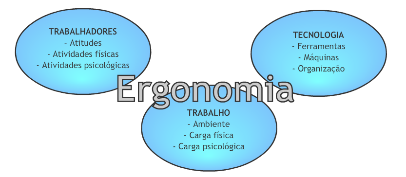

# Engenharia de Usabilidade

## Aula 1 - Reflexões iniciais sobre a interação humano-computador 

O termo ‘interação humano-computador’ começou a ser amplamente utilizado a partir da década de 1980, mas suas raízes estão relacionadas a disciplinas bem mais antigas. O estudo sistemático do desempenho humano com ênfase nas tarefas manuais iniciou-se no século passado, nos ambientes das fábricas. A Segunda Guerra Mundial foi responsável por impulsionar a análise da interação entre pessoas e máquinas, o que aumentou o interesse pela área entre os pesquisadores e incentivou a criação da Sociedade de Pesquisa em Ergonomia (Ergonomics Research Society), em 1949.  

Tradicionalmente, a ergonomia preocupa-se com as características físicas de máquinas e sistemas e com o modo como afetam o desempenho humano. Os fatores humanos também consideram essa perspectiva, mas adicionam ainda algumas questões cognitivas. Independente da nomenclatura, ambas as áreas preocupam-se com o desempenho humano no contexto de qualquer sistema, seja ele computadorizado, mecânico ou manual. À medida que o uso de máquinas foi se difundindo, um número crescente de pesquisadores especializou-se no estudo da interação entre pessoas e computadores, com ênfase nos aspectos físicos, psicológicos e teóricos desse processo. O nome inicial dessa área de investigação foi ‘interação homem-máquina’ (IHM), mas a mesma logo passou a ser denominada ‘interação humano-computador’ (IHC), em reconhecimento ao interesse particular nos computadores e na população de usuários. 

Outro ramo de pesquisa que influenciou o desenvolvimento da disciplina IHC foi a área da ciência e tecnologia da informação. A ciência da informação é uma disciplina antiga, que antecede ao aparecimento da tecnologia e que se preocupa com o gerenciamento e com a manipulação da informação dentro das empresas. A introdução da tecnologia causou um grande impacto na maneira como a informação pode ser armazenada, acessada e utilizada; o que, consequentemente, produziu um efeito significativo sobre a empresa e o ambiente de trabalho. A IHC também se preocupa com a influência da tecnologia no trabalho e com a adequação da mesma aos requisitos e restrições da atividade.  

A área de IHC bebe de muitas fontes, mas é nas disciplinas da ciência da computação e do projeto de sistemas que ela se encaixa como uma preocupação relevante. Entre as questões analisadas, estão o projeto, a implementação e a avaliação de sistemas interativos no contexto da tarefa e do ambiente de trabalho do usuário. Quando falamos de interação humano-computador, entretanto, não visualizamos um único usuário diante de um computador. Por ‘humano’ entende-se um único usuário, um grupo de usuários trabalhando em conjunto ou uma sequência de usuários em uma empresa, cada um lidando com alguma parte de uma tarefa ou processo. O usuário é aquele que está tentando realizar seu trabalho utilizando a tecnologia. O termo ‘computador’ faz referência a qualquer tecnologia, desde um computador desktop até um computador de grande porte, um sistema de controle de processos ou um sistema embutido. O sistema pode incluir partes não computadorizadas e até mesmo pessoas. Por ‘interação’ entende-se qualquer comunicação entre um usuário e um computador, seja ela direta ou indireta. A interação direta envolve um diálogo com feedback e o controle ao longo de toda a execução da tarefa. A interação indireta pode envolver o processamento em lote ou o uso de sensores inteligentes que controlem o ambiente. O importante a observar é que o usuário está interagindo com o computador de modo a realizar alguma tarefa. 

A disciplina de IHC é, certamente, multidisciplinar. O projetista ideal de um sistema interativo teria de ter experiência em uma variedade de áreas, entre elas:  

* Psicologia e ciência cognitiva – para compreender as habilidades perceptivas, cognitivas e a capacidade para a solução de problemas do usuário;  
* Ergonomia – para compreender as habilidades físicas do usuário; 
* Sociologia – para ajudar na compreensão do contexto mais amplo da interação; 
* Ciência da computação e engenharia – para estar apto a construir uma interface eficiente com a tecnologia disponível e a mais adequada; 
* Redação técnica – para produzir manuais e outros documentos. 

É certo que há muitas exigências de experiência que serão atendidas por apenas uma pessoa! Na verdade, mesmo sendo a IHC reconhecida como uma disciplina interdisciplinar, na prática as pessoas tendem a se basear em uma das áreas listadas anteriormente. Contudo, não é possível projetar sistemas interativos eficientes com base nos conhecimentos de somente uma dessas disciplinas. É preciso recorrer a todas elas. Um monitor lindamente projetado, por exemplo, pode tornar-se inútil se desconsiderar as restrições de comunicação ou as limitações físicas dos usuários.  

 
### Um pouco mais sobre ergonomia 

Muitas pessoas já ouviram o termo ‘ergonomia’ e acreditam que ele se refere ao modo correto de sentar-se ou ao projeto de controles e instrumentos de automóveis. É claro que esse pensamento está correto, mas a área da ergonomia envolve muito mais!  

Ergonomia refere-se à aplicação de informações científicas relacionadas aos seres humanos e ao projeto de objetos, sistemas e ambientes a serem utilizados pelos mesmos. Quando bem executados, os projetos relacionados a trabalho, esportes, lazer, saúde e segurança costumam envolver princípios ergonômicos. 

Por que esse gravador é tão difícil de ser operado? Por que alguns bancos de carros nos deixam com dor nas costas depois de viagens longas? Por que alguns computadores nos causam cansaço nas vistas e fadiga muscular? Essas e outras inconveniências não são inevitáveis – a ergonomia é uma abordagem na qual as necessidades e capacidades humanas são o foco do design de sistemas tecnológicos. O objetivo é garantir que os humanos trabalhem em total harmonia com a tecnologia, alinhando equipamentos e tarefas às características humanas. 

A ergonomia pode ser aplicada a diferentes aspectos das situações domésticas cotidianas, mas suas implicações são ainda mais significativas, em termos de eficiência, produtividade, segurança e saúde nos ambientes de trabalho. Entre suas aplicações, estão: 

* Projeto de equipamentos e sistemas, incluindo computadores, de modo que sejam mais fáceis de usar e estejam menos propensos a erros de operação;  
* Planejamento de tarefas, para que sejam eficientes e considerem as necessidades humanas, tais como as paradas para descanso; 
* Planejamento da distribuição física de equipamentos e tarefas, a fim de aprimorar a postura no trabalho e diminuir a carga sobre o corpo, reduzindo, assim, as ocorrências de lesões por esforços repetitivos (LER); 
* Projeto da informação, para que a interpretação e o uso de telas, manuais, símbolos e cartazes sejam mais fáceis e estejam menos propensos a erros; 
* Planejamento de treinamentos, de modo que abordem todos os aspectos significativos da tarefa em questão e considerem, ainda, os requisitos humanos de aprendizagem; 
* Projeto de equipamentos militares e espaciais – caso extremo de demanda sobre os seres humanos; 
* Projeto de ambientes de trabalho, inclusive dos sistemas de aquecimento, refrigeração e iluminação, de modo que se adaptem a seus usuários e às tarefas a serem executadas. Quando necessário, a ergonomia também pode ser aplicada ao projeto de equipamentos pessoais de proteção para o trabalho e para ambientes hostis. 

A natureza multidisciplinar da ergonomia (algumas vezes denominada ‘fatores humanos’) é clara. O ergonomista, que é o responsável por aplicar os conceitos de ergonomia e melhorar o ambiente de trabalho humano, trabalha em equipes que podem incluir uma variedade de profissionais: engenheiros de projeto, engenheiros de produção, engenheiros industriais, especialistas em computação, médicos e profissionais de recursos humanos. O objetivo geral é garantir que o conhecimento a respeito das características humanas seja considerado na solução de problemas práticos vivenciados pelas pessoas nos ambientes de trabalho e lazer. Sabemos que, em muitos casos, os humanos podem se adaptar a condições inadequadas, mas essa adaptação costuma causar ineficiência, erros, estresse e prejuízos físicos e/ou mentais. 
 

#### Os componentes da ergonomia 

A ergonomia lida com a interação entre as situações de trabalho e as tecnológicas com os seres humanos. As ciências humanas básicas envolvidas são a anatomia, a fisiologia e a psicologia. Os ergonomistas recorrem a essas ciências com dois objetivos principais: fazer uso mais produtivo das capacidades humanas e manter a saúde e o bem-estar das pessoas. Em suma, a tarefa deve se adequar à pessoa em todos os aspectos, e a situação de trabalho não deve comprometer as capacidades e as limitações humanas. 

 

### Diferentes abordagens ergonômicas 

Os ergonomistas projetam e avaliam tarefas, produtos e ambientes, de maneira que possam torná-los compatíveis com as capacidades e limitações humanas. 

* Egornomia física: observa as respostas do corpo humano às cargas de trabalho físicas e psicolóficas. 
* Ergonomia cognitiva: lida com os processos mentais e as capacidades humanas na execução de um trabalho. 
* Ergonomia organizacional: avalia estruturas, políticas e processos organizacionais no ambiente de trabalho, tais como trocas de turno, cronogramas, satisfação com o trabalho, motivação, supervisão, trabalho em equipe, telecomutação e ética. 
 

#### Um pouco mais sobre ergonomia cognitiva 

O termo ‘ergonomia cognitiva’ é sinônimo de ‘engenharia cognitiva’. Ele está relacionado ao projeto, à estrutura e à operação da interface entre o usuário final e os estados e processos de um sistema. Essa abordagem assume que a maneira como as pessoas veem, escutam, prestam atenção, pensam, lembram (e esquecem) de coisas e tomam decisões possui implicações diretas no projeto de  artefatos e ambientes que utilizam. Se as características do ambiente físico e dos sistemas que as rodeiam refletirem e derem suporte a suas tendências cognitivas, então é possível que o usuário cometa menos erros durante o uso desses sistemas.  

A ergonomia cognitiva aplica os fundamentos de áreas como ciências cognitivas e psicologia cognitiva para projetar produtos, sistemas, artefatos e ambientes utilizados por pessoas. Pode-se esperar o uso mais eficiente desses sistemas quando o projeto desses itens reflete as tendências das estruturas de conhecimento e do comportamento natural de seus usuários. 

Nos estudos da interação humano-computador, a ergonomia cognitiva é especialmente importante, porque está voltada para o projeto de sistemas automatizados complexos e de alta tecnologia. Embora uma interface de usuário ruim em um telefone celular possa não causar acidente, ela com certeza será responsável por uma enorme frustração no consumidor e pode acabar acarretando um fracasso no mercado. Um projeto de interface ou um equipamento industrial deficiente pode resultar na diminuição da qualidade e da produtividade, ou mesmo representar um risco à vida humana. 
