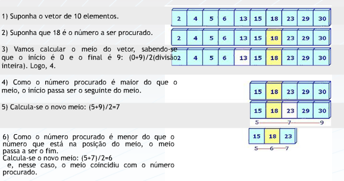

## Aula 4 - Ordenação e pesquisa 
 

#### Ordenação 

Relembrando comparações: 
* Vetor de char 
**strcmp** (abreviatura de string compare) cuja função é comparar dois vetores de char e **strcpy** (abreviatura de strng copy) cuja função é copiar o conteúdo de um vetor de char nas posições ocupadas por outro vetor de char. 

A técnicas de ordenação permitem apresentar um conjunto amplo de algoritmos distintos para resolver uma mesma tarefa.  

Ordenar significa dispor elementos de um conjunto seguindo um determinado critério. Esse critério estará baseado em um atributo do elemento do conjunto. 
 

**Ordenação interna vs Ordenação externa**

* **Externa**: quando o método de ordenação usa uma memória auxiliar porque o arquivo é muito grande. 

* **Interna**: quando o método de ordenação só usa a memória principal para realizar o processo de ordenação. 

    * **Métodos simples**: indicados para conjuntos **pequenos**; usam **muitas comparações**; os **códigos** são **pequenos**; códigos de **fácil entendimento**. **Exemplos**: Selection Sort; Insertion Sort; Bubble Sort. 

    * **Métodos eficientes ou sofisticados**: indicados para conjuntos **grandes**; usam **menos comparações**; os **códigos** são **grandes**; alguns incluem o conceito de **recursividade**, deixando-os **muito complexos**. **Exemplo**: Shell Sort; Quick Sort; Heap Sort; Merge Sort. 

##### Selection Sort: ordenação por seleção. 

Sempre buscar o menor e posicionar no início. 

Você terá que construir um algoritmo que tenha uma repetição dentro de outra repetição, visto que você percorreu o vetor quatro vezes (2,4,6,8) para identificar o menor  e, a cada vez que percorria o vetor, você comparava os elementos para encontrar o menor. Supondo que você usará duas estruturas de repetição( for), poderemos afirmar que cada vez que o for mais interno terminar, o algoritmo identificará o menor número e fará a troca. 

A cada nova busca, o número de comparações diminuirá e esses procedimentos se repetirão até que o vetor esteja ordenado.
 

void selecao(int vet[], int tam) 

{ 

    int j, i, aux, temp; 

 
 

 
 

    for (i=0; i<tam -1; i++) 

    { 

        aux = i; 

 
 

 
 

        for (j=i+1; j<tam; j++) 

        { 

            if(vet[aux] > vet [j]) 

                aux = j; 

 
 

 
 

            temp = vet[aux]; 

            vet[aux] = vet[i]; 

            vet[i] = temp; 

        } 

    } 

} 

**Insertion Sort: ordenação por inserção.**

void insercao(int vet[], int tam) 

{ 

  int j,i, aux; 

    for (i=1;i<tam;i++) 

    { 

        aux = vet[i];  

         

        for(j=i; j>0 && aux <vet[j-1]; j--) 

            vet[j]=vet[j-1]; 

         

        vet[j]=aux;   

    } 

} 

 

 

O for mais externo começa com a segunda posição do vetor porque o for de dentro sempre compara com os elementos anteriores. O teste de j>0 se justifica porque dentro dos colchetes, ele subtrai de 1 o valor de j e se deixasse j chegar a zero, o índice ficaria negativo o que não é permitido na linguagem C++. O elemento fundamental do for interno é o teste: j>0 && aux <vet[j-1] porque  incorpora um teste interrompendo a repetição quando a condição aux <vet[j-1] não for mais atendida. 

Você terá que construir um algoritmo que tenha uma repetição dentro de outra repetição. Na repetição interna, toda vez que dois valores de posições adjacentes forem encontrados fora de ordem, deverão ser trocados de posições.  

 
 

void bolha(int vet[], int tam) 

{ 

    int j,i, aux; 

    for (i=0; i<tam -1; i++) 

    { 

        for(j=tam-1; j>i; j--) 

            if(vet[j] < vet[j-1] ) 

            { 

                aux=vet[j]; 

                vet[j]= vet[j-1]; 

                vet[j-1]=aux; 

            } 

    } 

} 

 

 

O for mais externo começa na primeira posição do vetor e o for interno sempre começa na última posição, significando que o borbulhamento começará de baixo para cima. O teste fará troca toda vez que encontrar valores adjacentes onde o valor  maior se encontrar em posição menor do que o valor menor. Isto ocorre porque o método está ordenando de forma crescente. Esse processo vai se repetindo até que todos elementos sejam colocados em suas posições corretas. 

* Selection Sort: 

    * ideal para arquivos pequenos; 

    * muito simples; 

    * não melhora sua performance se o arquivo já estiver ordenado; 

    * tem menos movimentos que o insertion sort. 

* Insertion Sort: 

    * só ordena quando necessário; 

    * quando um elemento é inserido, todos os elementos maiores do que ele são deslocados para direita; 

    * é considerado o melhor dos três métodos estudados. 

* Bubble Sort: 

    * é o mais conhecido; 

    * é muito simples; 

    * muito lento; 

    * considerado o pior dos três métodos. 

 
 #### Pesquisa 

 
Pesquisa sequencial: simples, mas ineficiente. Busca em todo o arquivo mesmo que já tenha achado. 

Pesquisa binária: a matriz tem que estar ordenada.
