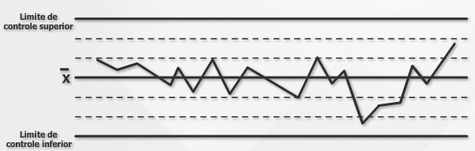
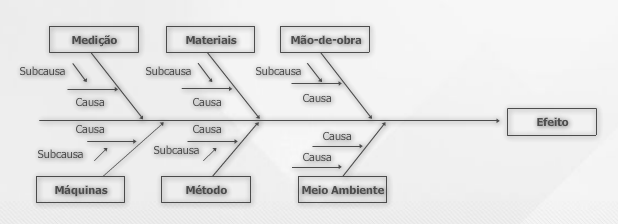
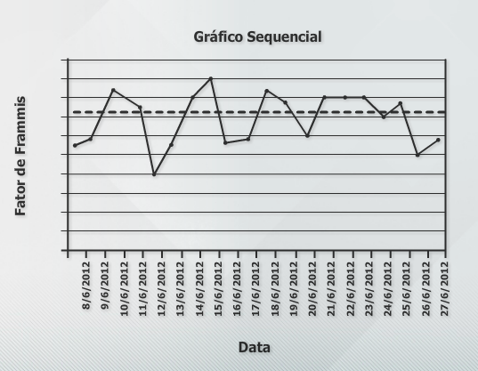
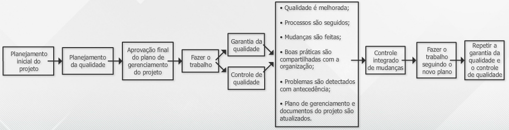

# Aula 6 - Gerenciamento da qualidade do projeto 
 
## Planejamento da qualidade 
 
O gerenciamento da qualidade garante que o projeto satisfaça às necessidades para os quais foi criado e impacta diretamente na: 
* Redução dos custos de correção de falhas; 
* Aumento da produtividade; 
* Menos retrabalho. 
 
## Custos da qualidade 
 
O custo para atender aos padrões de qualidade do projeto é denominado **custo da qualidade**. O custo da qualidade é composto por três tipos de custos: 
- **Custos da prevenção** (ex.: documentação do processo, treinamento); 
- **Custos de avaliação do produto ou serviço** (ex.: teste, inspeção); 
- **Custos de falhas ou de má qualidade** (ex.: custo do retrabalho, perda de negócios). 
 
A análise custo/ benefício é uma das técnicas utilizadas para avaliar **se o custo da qualidade compensa o valor do benefício**. O planejamento da qualidade do projeto considera a **qualidade do próprio projeto e do seu produto**. 
  
A qualidade deve ser referenciada a um **padrão**, pois **não existe qualidade absoluta**. No contexto do projeto, a qualidade se referencia às **necessidades das partes interessadas**, que espera que os requisitos do projeto e do seu produto sejam atendidos dentro de determinadas margens de tolerância. 
 
O objetivo do planejamento da qualidade é definir: 
* Padrões de qualidade para o projeto e produto do projeto; 
* Critérios de qualidade para avaliar as entregas; 
* Métricas de desempenho do projeto, como por exemplo, de prazo, custos, frequência de rejeição das entregas, frequência de defeitos, entre outras. 
 
Em geral, as empresas já possuem uma política de qualidade estabelecida e documentada. Os padrões de qualidade podem ser estabelecidos pela própria empresa ou por órgãos independentes, como, por exemplo, a já tradicional ISO (Internacional Organization for Standardization). 
 
## Benefícios da qualidade 
 
 1. Aumento da satisfação do cliente; 
 2. Redução dos custos de correção de falhas; 
 3. Aumento da produtividade; 
 4. Menos retrabalho. 
 
Durante a fase de planejamento da qualidade, é elaborado o Plano de Gerenciamento de Qualidade, que contém as definições dos padrões da qualidade, tipos de relatórios e métricas a serem utilizadas no projeto. 
 
Também é elaborado o Plano de Melhoria Contínua, o qual visa identificar possíveis melhorias e atividades sem valor nos processos do próprio projeto. 
 
## Ferramentas da qualidade 
 
Existem várias técnicas e ferramentas utilizadas no gerenciamento da qualidade, tais como: 
* Gráficos de controle; 
* Diagrama de causa e efeito ou Ishikawa ou espinha de peixe; 
* Histograma; 
* Elaboração de fluxogramas; 
* Diagrama de Pareto; 
* Diagrama de dispersão; 
* Amostragem estatística; 
* Inspeção; 
* Lista de verificação. 
 
## Gráfico de controle 
 
A utilização de gráficos de controle e a definição dos limites superior e inferior permite conhecer se um processo é estável e se tem um comportamento previsível. 
 
Um processo é considerado **fora de controle** quando um ponto excede um limite de controle ou sete pontos consecutivos estiverem acima ou abaixo da linha média. 
  
Podem ser utilizados para monitorar variações de custos, prazos e volume de mudanças, entre outras saídas dos processos de gerenciamento do projeto, de modo a garantir que estão sob controle. 
 
 
 
 ### Gráfico de causa e efeito 
 
Demonstra a relação entre os efeitos do problema e suas possíveis causas. Seguindo uma das linhas, uma possível causa raiz pode ser identificada ao continuar a perguntar “por quê?” ou “como”? 
 
 
 
 ### Histograma 
 
Mostra a frequência de ocorrência dos eventos. Indica quantos defeitos foram gerados por categoria de causa identificada. 
 
 
 
 ### Diagrama ou gráfico de Pareto ou curva ABC 
 
É um tipo especial de histograma. Representa o maior número de defeitos (80%) e consequência de uma quantidade pequena de causas (20%). A equipe do projeto deve abordar primeiramente as causas que estão gerando o maior número de defeitos. 
 
 
 
 
 ### Diagrama de dispersão 
 
Mostra o relacionamento entre duas variáveis (dependente x independente). 
 
A equipe de projeto pode estudar e identificar o relacionamento possível entre as mudanças observadas em duas variáveis. **Quanto mais próxima da linha diagonal, mais próximo será o relacionamento entre as duas variáveis**. 
 
 
 
 ### Gráfico sequencial 
 
Semelhante a um gráfico de controle, sem a definição de limites. Mostra o histórico e o padrão de variação de uma variável. 
 
 
 
 ### Fluxograma 
 
É a representação gráfica de um processo. Mostra o relacionamento entre suas etapas. 
 
 
 
 ## Garantia de qualidade 
 
A garantia da qualidade é realizada a partir de diversas ações que visam à melhoria contínua dos processos de gerenciamento do projeto. Estas ações ocorrem durante a execução do projeto, em vez de serem realizadas apenas no final. 
  
O objetivo é reduzir os desperdícios e melhorar a eficiência dos processos. 
  
Esse processo comporta auditorias independentes, cujo objetivo é assegurar que o projeto está sendo executado de acordo as políticas, processos e procedimentos previamente definidos para o projeto. 
 
As melhorias na qualidade dos processos surgem a partir dos resultados dessas auditorias independentes, as quais podem ser realizadas por auditores internos ou externos que não estejam envolvidos diretamente no trabalho do projeto. 
  
Neste processo, são usados dados fornecidos pelo processo de controle de qualidade das entregas do projeto. 
  
A análise do processo é outra técnica utilizada na garantia de qualidade cujo objetivo é identificar ineficiências no processo. 
  
Essa análise inclui a análise da causa do problema e, consequentemente, tratar dessa causa, de modo a prevenir problemas semelhantes que venham a ocorrer no futuro. Para tanto, utiliza-se o fluxograma como ferramenta da qualidade. 
 
## Controle da qualidade 
 
O controle da qualidade é realizado com o objetivo de assegurar que os padrões de qualidade definidos para o projeto estejam sendo atendidos. 
  
Cada entrega do projeto tem uma especificação e, consequentemente, um parâmetro de qualidade a ser medido, para que seja conhecido seu eventual desvio em relação ao requisitado. Caso seja observado o desvio, é necessário tomar ações corretivas. 
 