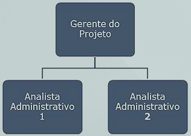

# Aula 7 – Gerenciamento dos recursos humanos do projeto 

## Planejamento dos recursos humanos 

O planejamento de recursos humanos consiste em: 
* Identificar e documentar funções, responsabilidades e relações hierárquicas do projeto; 
* Elaborar o plano de gerenciamento de pessoal. 

Fatores a considerar para o planejamento da equipe do projeto: 
* Escassez ou limitação dos recursos e a necessidade de trabalhar com alternativas ou desenvolver opções; 
* A rede de relacionamento do gerente de projetos na eficácia na seleção dos recursos; 
* A recorrente reclamação dos envolvidos sobre a falta de informações sobre suas responsabilidades; 
* A necessidade de designação de pessoas internas ou externas a organização do projeto. 

Outros fatores devem ser considerados para o planejamento da equipe do projeto, como: 
* Tipo de organização; 
* Fatores técnicos; 
* Habilidades interpessoais; 
* Localização da equipe; 
* Influência das partes interessadas. 

 ## Plano de recursos humanos 

Os requisitos dos recursos para a execução das atividades definidos no processo de planejamento do tempo são utilizados para o planejamento da equipe do projeto. O plano de recursos humanos contempla: 
1. Papéis e responsabilidades - para identificar papéis e responsabilidades dos membros da equipe. 

2. Organograma do projeto – para estabelecer as relações hierárquicas do projeto. 

3. Plano de gerenciamento de pessoal - contém o plano de mobilização e liberação de pessoal, calendário de recursos, necessidades de treinamento, reconhecimento e recompensas, normas de segurança do trabalho. 

 ## Mobilização da equipe do projeto 

Consiste em negociar com eficácia os recursos humanos necessários ao projeto e revisar o planejamento do projeto com os novos membros. 
* Pré alocados e já definidos no termo de abertura do projeto; 
* Negociados com gerentes funcionais ou com outras equipes de gerenciamento de projetos dentro de uma organização; 
* Contratados, quando a empresa não possui pessoal interno necessário para executar o projeto; 
* Virtuais, no caso de profissionais trabalharem em diferentes localidades, turnos ou horários. 

 ## Desenvolvimento da equipe do projeto 

Visa aprimorar as competências e as interações entre os profissionais da equipe para aumentar o desempenho da equipe. 

Algumas técnicas utilizadas para auxiliar neste desenvolvimento são: 
* Aprimoramento das habilidades profissionais; 
* Treinamento formal ou informal; 
* Aprimoramento das habilidades interpessoais através de atividades de formação de equipe; 
* Reconhecimento e premiações; 
* Regras básicas de convívio; 
* Agrupamento (matriz integrada). 

A construção de uma equipe se dá em cinco etapas: 
1. Formação – quando a equipe se encontra e conhece o projeto; 
2. Conflito - quando a equipe começa a considerar o trabalho do projeto; 
3. Acordo - quando começa o trabalho em conjunto e ganho de confiança; 
4. Desempenho - quando a equipe ganha unidade; 
5. Dispersão - trabalho concluído, e a equipe se desliga do projeto. 

Á medida que os esforços de desenvolvimento da equipe são implementados, as avaliações de desempenho da eficácia da equipe do projeto, orientadas às tarefas e resultados, podem indicar a necessidade de treinamento, orientação, assistência, mentoria ou mudanças. 

## Gerenciamento da equipe do projeto 

O gerenciamento da equipe consiste em: 
* Acompanhar o desempenho da equipe; 
* Fornecer feedback; 
* Resolver problemas; 
* Gerenciar conflitos; 
* Gerenciar mudanças para otimizar o desempenho do projeto; 

Envolve: 
* Realização da avaliação de desempenho (esclarecimento de papéis e responsabilidades, questões desconhecidas e criação de plano de desenvolvimento); 
* Observação; 
* Registro de questões; 
* Utilização de técnicas de gerenciamento de conflitos (negociação, imposição, colaboração ou acomodação); 
* Desenvolvimento de habilidades interpessoais. 

Esse gerenciamento é mais complexo, quando a equipe presta contas para o gerente funcional e para o gerente de projetos. 

 ## Características do conflito 

Os conflitos são inevitáveis em um projeto. Originam-se por disputas por cronograma, prioridades, recursos, estilos de trabalho pessoais e personalidades. Quando bem gerenciados, agregam valor (produtividade e relacionamento). 
* É natural e força uma busca de alternativa; 
* É uma questão da equipe; 
* A comunicação aberta ajuda na resolução; 
* A resolução deve se concentrar em questões e não nas pessoas; 
* A resolução deve se concentrar no presente e não no passado. 

 ## Técnicas de gerenciamento de conflito 

 **Colaboração**: trata-se da construção de uma alternativa que incorpore as diversas soluções. 
 **Reconciliação**: permite que a solução encontrada traga algum grau de satisfação entre as partes. 
 **Retirada**: é uma forma de fugir momentaneamente do problema. 
 **Força**: uma parte de maior autoridade impõe a outra seu ponto de vista. 
 **Acomodação**: é um acordo onde as partes cedem um pouco para alcançarem uma solução. 
 ## Os tipos de poder do gerente de projeto 
 **Formal**: é delegado pela organização em função do cargo que exerce. 
 **Recompensatório**: tem poder para recompensar, inclusive financeiramente, a equipe. 
 **Penalizatório**: refere-se ao poder de demitir ou afastar um determinado membro da equipe. 
 **Referencial**: quando se trata de um profissional que é um exemplo a ser seguido por uma ou mais de suas características. 
