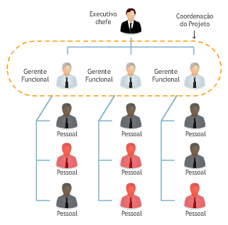
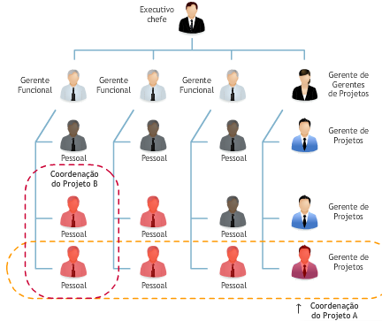
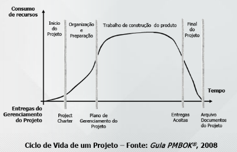
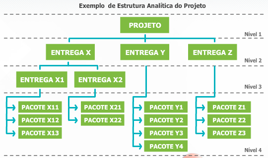

# Aula 1 - Fundamentos de Gerenciamento de Projetos 
 
Cada vez mais é exigido que os projetos sejam realizados dentro do **escopo, prazo, custos e qualidade planejados** para o atendimento às necessidades das partes interessadas. 
 
O **gerenciamento de projetos** é a aplicação de conhecimento, habilidades, ferramentas e técnicas as atividades do projeto com o objetivo de atender as necessidades e expectativas das partes envolvidas. 
 
* Benefícios do gerenciamento de projetos: Gerenciar projetos possibilita uma maior previsibilidade e probabilidade de atingir os objetivos do projeto. 
* Maior comprometimento com objetivos e resultado; 
* Disponibilidade de informação para tomada de decisão; 
* Melhorias na qualidade do resultado do projeto; 
* Minimização dos riscos em projetos; 
* Maior integração entre as áreas; 
* Aumento da satisfação do cliente; 
* Redução dos prazos de entrega; 
* Aumento de produtividade; 
* Redução dos custos do projeto. 
 
## Conceitos de projeto e operação 
 
**Projeto é “esforço temporário empreendido para criar um produto, serviço ou resultado exclusivo”.** 
 
Principais características do projeto: 
* Início e término definidos antes do início do trabalho; 
* Único - Produz um propósito único; 
* Elaborado progressivamente – Desenvolvido em etapas; 
* Resultado incerto. 
 
Um projeto termina quando: 
* Os objetivos são alcançados; 
* Fica claro que os objetivos não podem ou não serão alcançados; 
* A necessidade que originou o projeto não existe mais. 
 
**Operação é esforço contínuo que sempre gera o mesmo resultado e não possui hora nem data para acabar.** 
 
Principais características da operação: 
* É um trabalho contínuo e, normalmente, repetitivo; 
* Seu objetivo é manter o negócio da organização; 
* Produz o mesmo produto, serviço ou resultado; 
* Resultado determinístico. 
 
**O projeto e a operação têm algumas características em comum**: 
* São realizados por pessoas; 
* Possuem recursos limitados; 
* São planejados, controlados e executados. 
 
## Project Management Institute - PMI 
 
O PMI foi criado com o objetivo de organizar, difundir e incentivar as melhores práticas em gerenciamento de projetos no mundo. 
 
Também o PMI certifica profissionais em gerenciamento de projetos. Esta certificação, muito valorizada no mercado, é denominada PMP (Project Management Professional) 
 
## Origens dos projetos 
 
Os projetos são autorizados para atender uma ou mais considerações estratégicas, tais como: 
* Demanda de mercado; 
* Oportunidade de negócio; 
* Necessidade de natureza social; 
* Considerações ambientais; 
* Solicitação de cliente; 
* Avanço tecnológico; 
* Requisito legal. 
 
Problemas mais frequentes em projetos: 
* Não cumprimento dos prazos; 
* Mudanças de escopo constantes; 
* Problemas de comunicação; 
* Escopo não definido adequadamente; 
* Riscos não avaliados adequadamente; 
* Recursos humanos insuficientes; 
* Concorrência entre as atividades rotineiras e o projeto na utilização dos recursos; 
* Não cumprimento do orçamento; 
* Mudanças de prioridades constantes ou falta de prioridades; 
* Estimativas incorretas ou sem fundamento. 
 
## Métodos de análise da viabilidade econômica dos projetos: 
 
### Payback (tempo de retorno)  
 
Mede o prazo necessário para a organização recuperar o investimento inicial do projeto.  
 
Quanto menor for este prazo, melhor para a organização; 
 
### Valor presente líquido (VPL) 
 
Transporta todas as receitas e custos estimados do projeto, descontados pela taxa mínima de atratividade, para a data de início do projeto.  
 
O projeto de maior VPL deve ser o selecionado; 
 
### Taxa interna de retorno (TIR) 
 
Calcula a taxa de juros que torna anula a soma de todas as receitas e custos estimados do projeto na data de início do projeto.  
 
O projeto com a maior TIR deve ser o selecionado; 
 
### Índice de benefício-custo 
 
Compara os benefícios do projeto com os custos do projeto.  
 
O índice de benefício-custo igual a 1 significa que os benefícios e custos do projeto se igualam. 
 
## Escritório de projetos - PMO (project management office) 
 
É uma unidade organizacional que supervisiona o gerenciamento de projetos. O escritório de projeto pode ser central ou descentralizado em áreas e locais, dependendo do tamanho da organização. 
 
Um **programa** é um grupo de projetos relacionados entre si, coordenados de forma a obter benefícios que não estariam disponíveis se fossem administrados isoladamente. 
 
Um **portfólio** é um conjunto de projetos e programas que tem por finalidade atingir objetivos estratégicos da organização. 
 
## Stakeholders (partes interessadas) 
 
As partes interessadas, também chamadas de stakeholders, são pessoas e organizações envolvidas no projeto ou aqueles cujos interesses são afetados pela execução ou resultado do projeto. A identificação das partes interessadas deve ser realizada o mais cedo possível. 
 
São exemplos de partes interessadas: 
* Gerente do projeto; 
* Patrocinador; 
* Cliente; 
* Parceiros; 
* Gerentes funcionais; 
* Equipe do projeto; 
* Escritório de projetos. 
 
## Tipos de estruturas das organizacionais e suas influências no projeto 
 
### Organização funcional 
 
Profissionais agrupados, por especialidade, em departamentos funcionais (Marketing, Contabilidade, Financeiro, Engenharia...). Gerentes de projeto, em geral, são os próprios gerentes funcionais. Os funcionários de vermelho representam os que estão alocados em atividades de projetos. 

 
 
 
 ### Projetizada 
 
Profissionais agrupados por projetos. Os gerentes de projeto têm total autoridade sobre o projeto. Os profissionais são dedicados exclusivamente ao projeto (sem lar). Os funcionários de vermelho representam os que estão alocados em atividades de projetos. 
 
 
 
 ### Organização matricial 
 
Profissionais se reportam ao gerente funcional e ao gerente de projetos (pelo menos dois chefes). Gerentes de projetos são os responsáveis pela gestão do projeto. Já os gerentes funcionais são “donos dos recursos” e responsáveis pela alocação de profissionais no projeto. Os funcionários de vermelho representam os que estão alocados em atividades de projetos. 
 
 
 
 
 ## Ciclo de vida do projeto 
 
Uma **fase de um projeto** possui um grupo de atividades relacionadas de forma lógica, e sua conclusão é marcada pela **disponibilização de uma ou mais entregas**. 
 
Uma **entrega** é qualquer produto ou serviço, **tangível e verificável**. 
 
Embora os projetos variem em tamanho e complexidade, sua estrutura pode ser mapeada no ciclo de vida a seguir: 
* Início do projeto; 
* Organização e preparação; 
* Execução do trabalho do projeto; 
* Encerramento. 
 

 
 
 ## Ciclo de vida do produto 
 
O ciclo de vida do produto é determinado pelas seguintes fases, basicamente associadas ao nível de quantidades produzidas: 
* Concepção; 
* Crescimento; 
* Maturidade; 
* Declínio; 
* Retirada da produção. 
 
## Áreas de conhecimento de Gerenciamento de Projeto 
 
### Gerenciamento de integração do projeto 
 
Garantir que os diversos elementos do projeto serão coordenados de maneira integrada; 
 
### Gerenciamento de escopo do projeto 
 
Garantir que o projeto incluirá todo e somente o trabalho necessário para o sucesso do projeto; 
 
### Gerenciamento do tempo do projeto 
 
Garantir que o projeto será concluído no prazo previsto; 
 
### Gerenciamento de custos do projeto 
 
Garantir que o projeto será concluído dentro do custo previsto; 
 
### Gerenciamento da qualidade do projeto 
 
Garantir que o projeto atenderá aos requisitos de qualidade esperados; 
 
### Gerenciamento dos recursos humanos do projeto 
 
Garantir a utilização efetiva dos recursos humanos do projeto; 
 
### Gerenciamento das comunicações do projeto 
 
Garantir a geração, coleta, disseminação, armazenamento e disponibilização das informações apropriadas do projeto no tempo e de maneira adequada; 
 
### Gerenciamento das partes interessadas 
 
Garantir o engajamento das partes interessadas com os objetivos do projeto; 
 
### Gerenciamento dos riscos do projeto 
 
Garantir a identificação, análise, planejamento, monitoramento e controle dos riscos do projeto; 
 
### Gerenciamento de aquisições do projeto 
 
Garantir as aquisições de bens e serviços externos à organização do projeto. 
 
## Grupos de processos em gerenciamento de processos 
 
Um grupo de processos deve ser entendido como o trabalho de gerenciamento que deve ser feita em cada fase do ciclo de vida do projeto.  
 
### Iniciação 
 
Estabelece as ações para dar início ao projeto ou fase do projeto; 
 
### Planejamento 
 
Planeja e mantém um plano de trabalho viável para atingir os objetivos definidos para o projeto; 
 
### Execução 
 
Coordena as ações definidas para realizar o plano de trabalho e produzir os produtos a serem entregues em cada fase; 
 
### Encerramento 
 
Formaliza o encerramento do projeto ou fase do projeto. 
 
[](../../media/gestao-de-projetos-para-ti/gerenciamento_de_projetos.pdf)


 ## Tríplice restrição 
 
A tríplice restrição do projeto é formada pelo balanceamento dos objetivos de **escopo, tempo e custos**. Um projeto é considerado bem sucedido quando for concluído dentro das restrições de escopo, tempo e custos. 
 

 
# Aula 2 - Gerenciamento da integração do projeto 
 
## Conceitos de gerenciamento da integração do projeto 
 
Gerenciamento de integração: grupo de processos que coordena e unifica os processos das demais áreas de conhecimento. 
 
A finalidade da integração é avaliar e selecionar a aplicação dos diversos processos, das dez áreas de conhecimento, para garantir que os objetivos do projeto serão alcançados. 
 
Áreas de conhecimento: 
- **Gerenciamento de integração do projeto**: Garantir que os diversos elementos do projeto serão coordenados de maneira integrada; 
- **Gerenciamento de escopo do projeto**: Garantir que o projeto incluirá todo e somente o trabalho necessário para o sucesso do projeto; 
- **Gerenciamento do tempo do projeto**: Garantir que o projeto será concluído no prazo previsto; 
- **Gerenciamento de custos do projeto**: Garantir que o projeto será concluído dentro do custo previsto; 
- **Gerenciamento da qualidade do projeto**: Garantir que o projeto atenderá aos requisitos de qualidade esperados; 
- **Gerenciamento dos recursos humanos do projeto**: Garantir a utilização efetiva dos recursos humanos do projeto; 
- **Gerenciamento das comunicações do projeto**: Garantir a geração, coleta, disseminação, armazenamento e disponibilização das informações apropriadas do projeto no tempo e de maneira adequada; 
- **Gerenciamento das partes interessadas**: Garantir o engajamento das partes interessadas com os objetivos do projeto; 
- **Gerenciamento dos riscos do projeto**: Garantir a identificação, análise, planejamento, monitoramento e controle dos riscos do projeto; 
- **Gerenciamento de aquisições do projeto**: Garantir as aquisições de bens e serviços externos à organização do projeto. 
 
## Termo de abertura do projeto 
 
Ele é a autorização para o início do projeto. Pode ser simples ou completo, dependendo das informações disponíveis sobre o projeto no momento da sua emissão. Parte das informações para a elaboração do termo de abertura é obtida consultando o **estudo de viabilidade do projeto**. O termo de abertura é usado durante todo o **ciclo de vida do projeto**, notadamente para a avaliação das propostas de mudanças do projeto. 
 
O termo de abertura do projeto é emitido pelo **patrocinador do projeto**. Porém, é recomendável que o gerente de projetos a ser designado participe de sua elaboração. Ele somente pode ser alterado pelo patrocinador do projeto, pois ele é o responsável por sua emissão. O termo de abertura documenta a necessidade do negócio, seja para resolver um problema, seja para capturar uma oportunidade para a organização. 
 
O termo de abertura pode ser composto pelos seguintes elementos: 
- **Nome do projeto**: o nome "vende" o projeto.  
- **Descrição do projeto**: deve ser apresentada uma descrição de alto nível das características do projeto.  
- **Justificativa do projeto**: a justificativa liga o projeto aos objetivos estratégicos da organização. É uma necessidade da organização que está sendo atendida. Fortalece a posição do patrocinador do projeto e motiva a equipe para sua execução. Geralmente o estudo de viabilidade fornece a base para esta justificativa. É importante que a justificativa seja bem clara.  
- **Objetivos do projeto**: são os requisitos mais amplos que o projeto deve atender. 
- **Requisitos de alto nível**: é uma lista de itens que o produto do projeto deve ter para atingir o que é solicitado nas especificações, sejam elas internas ou contratuais. 
- **Critério de aceitação**: são os critérios mínimos, inclusive requisitos de desempenho e condições essenciais, que devem ser atendidos para que as entregas do projeto sejam aceitas. 
- **Cronograma resumido**: Mostra as datas estimadas dos principais eventos. Normalmente, nessa fase, os prazos são baseados em projetos semelhantes já realizados. 
- **Estimativa orçamentária**:  basta apresentar uma ordem de grandeza dos custos estimados para a realização do projeto. A tolerância dessa estimativa deve ser grande, pois pouco se conhece em detalhes sobre a execução do projeto. 
- **Riscos relevantes identificados**: Caso sejam conhecidos riscos que possam impactar na execução do projeto, é importante registrá-lo já no início do projeto. 
- **Gerente de projetos designado e sua autoridade**: É o responsável pelo sucesso ou fracasso do projeto. É recomendável que o gerente de projetos seja designado o mais cedo possível. 
- **Cliente do projeto**: O cliente do projeto é o responsável por fornecer os requisitos do produto do projeto. 
- **Patrocinador do projeto**: O patrocinador é a voz do projeto junto à alta administração da organização. Ele provê recursos orçamentários e defende o projeto junto à organização. 
 
## Plano de gerenciamento do projeto 
 
Cria-se um documento que define como o projeto será: 
* Planejado; 
* Executado; 
* Controlado; 
* Monitorado; 
* Encerrado. 
 
Esse processo envolve a documentação das ações necessárias para definir, preparar, integrar e coordenar os planos auxiliares, gerando-se o plano de gerenciamento do projeto, que será a fonte principal de informações sobre como desenvolver o projeto. 
 
Este plano é desenvolvido através de uma série de processos integrados. Assim, o esforço para a criação do plano é realizado pela equipe de **gerenciamento do projeto** com a participação de diversas partes interessadas do projeto, cujas especializações são necessárias para a adequação do trabalho. 
 
O plano do projeto é um documento composto de diversos planos auxiliares. Sua elaboração é progressiva. Durante todo o ciclo de vida do projeto, este plano deve ser atualizado, à medida que as mudanças vão ocorrendo. 
 
**O que pode influenciar o desenvolvimento do plano do projeto?**  
 
A infraestrutura de TI e de comunicações, sua estrutura de governança, padrões existentes na organização ou na área de aplicação do projeto, informações históricas, entre outros aspectos. 
 
Nesse ponto, é importante você considerar que a única certeza que se tem em relação ao plano é que **dificilmente será implantado exatamente como planejado**. Por outro lado, planejar um projeto é uma experiência imperdível. É um projeto dentro de um projeto. Os profissionais envolvidos vivenciam no planejamento a simulação da execução do projeto. 


 
 
 A sequência inicial para o trabalho de planejamento do projeto é rígida: **escopo, tempo e custo**. 
 
Depois seguem, de acordo com as características do projeto, **sem a mesma rigidez**, as demais áreas de conhecimento: **Qualidade, recursos humanos, comunicações, engajamento das partes interessadas, riscos e aquisições**. Apesar da sequência lógica, é um **trabalho iterativo**. 
 
**O plano de gerenciamento de projeto integra e consolida todos os planos auxiliares de gerenciamento de projetos.** Cada plano auxiliar é detalhado de acordo com as necessidades da área de conhecimento envolvida no projeto, conforme o nível de aplicação de cada processo selecionado. Assim, descreve as técnicas e ferramentas selecionadas para os processos escolhidos. É função do **gerente de projeto** avaliar o impacto da mudança nos diversos aspectos do projeto, para que a tomada de decisão seja a mais objetiva possível. 
 
**Como deve ser o Plano de gerenciamento de projeto?**  
 
**Formal e realista**, aprovado pelos envolvidos para sua execução e usado no dia a dia do projeto. Uma vez aprovado, o plano do projeto somente pode ser alterado através de solicitação de mudança aprovada. 
 
O plano é composto de duas partes: **os planos auxiliares e as linhas de base**, sobre as quais o desempenho do projeto será avaliado. As linhas de base do projeto são: 
- **Linha de base do escopo**: Declaração do escopo, estrutura analítica do projeto e dicionário da EAP 
- **Linha de base do cronograma**: Cronograma 
- **Linha de base do desempenho de custos**: Orçamento 
 
Durante a fase de execução, estas linhas de base são dinâmicas. É importante saber que, com a utilização da técnica de gerenciamento de valor agregado, essas três linhas combinadas formam a **linha de base de desempenho do projeto**. 
 
## Orientação e gerenciamento do trabalho do projeto 
 
Os desdobramentos do processo de orientação e gerenciamento do projeto são: 
* Executar as atividades para realizar os objetivos do projeto; 
* Criar as entregas do projeto; 
* Formar, treinar e gerenciar os membros da equipe do projeto; 
* Obter, gerenciar e usar os recursos humanos, equipamentos, instalações, materiais e ferramentas; 
* Implementar os padrões e os métodos planejados; 
* Implantar atividades de melhoria nos processos; 
* Estabelecer e gerenciar os canais internos e externos de comunicação do projeto; 
* Gerar dados do projeto, tais como custos, cronograma, progresso técnico e informações sobre o andamento do projeto; 
* Emitir solicitações de mudança; 
* Adaptar as mudanças aprovadas; 
* Gerenciar os riscos e implantar as atividades de resposta a riscos; 
* Gerenciar fornecedores; 
* Coletar e documentar as lições aprendidas. 
 
Orientar e gerenciar são as principais atividades do gerente do projeto. É preciso garantir o entendimento comum do trabalho do projeto. Para tanto, por exemplo, é importante: 
* Garantir que o plano de comunicação seja seguido pela equipe do projeto; 
* Garantir que as partes interessadas tenham consciência de como serão afetadas pelo projeto; 
* Garantir o entendimento das exclusões do escopo do projeto; 
* Garantir que os setores da organização que estão disponibilizando recursos para o projeto tenham a última versão do cronograma; 
* Confirmar que os gerentes estão cientes os relatórios emitidos pelo projeto. 
 
Gerenciar é lidar com pessoas. Para tanto, é preciso: 
* Circular as informações do projeto entre os membros da equipe; 
* Facilitar as discussões para seleção de opções; 
* Interceder juntos aos setores da organização na superação de barreiras; 
* Trabalhar na solução de problemas da equipe. 
 
## Monitoramento e controle do trabalho do projeto 
 
O processo de acompanhar, revisar e avaliar o andamento do projeto para atender aos objetivos de desempenho definidos no plano de gerenciamento do projeto inclui a coleta, a medição e a distribuição das informações sobre o desempenho e a avaliação das medições e tendências para efetuar melhorias no processo. 
 
Os desdobramentos do processo de monitoramento e controle do projeto são: 
* Comparar o desempenho real do projeto como o planejado; 
* Avaliar o desempenho para determinar a necessidade de ações corretivas ou preventivas; 
* Fornecer informações para suporte aos relatórios de progresso; 
* Monitorar a implantação das mudanças aprovadas. 
 
**Quando o monitoramento e controle ocorrem?** 
 
Durante todo o ciclo de vida do projeto, desde a iniciação até o encerramento. O monitoramento contínuo do andamento do projeto permite que a equipe de gerenciamento do projeto tenha uma visão clara da saúde do projeto e identifique as áreas que exigem atenção especial. 
 
Esse trabalho também contempla o acompanhamento dos indicadores de desempenho criados para o projeto. O resultado do trabalho de monitoramento e controle do trabalho do projeto são as solicitações de mudanças e atualizações no plano do projeto. 
 
**Ações corretivas** são baseadas em: 
* Contínua medição dos processos; 
* Saber quanto o projeto saiu dos trilhos; 
* Habilidade de achar a causa-raiz do problema, e não sua consequência 
 
**Ações preventivas** tem como exemplos: 
* Ações para evitar que o problema não se repita; 
* Troca de um recurso motivado pelo fato que a entrega por ele realizadas não atingiu o critério de aceitação; 
* Treinamento para um profissional para que ele possa se tornar um backup de um recurso-chave. 
 
**Reparos de defeitos** *(a.k.a retrabalho)*: 
* Rejeição de uma entrega pelo cliente por falta de qualidade; 
* Rejeição de uma entrega pelo controle de qualidade do projeto; 
* Entrega com escopo incompleto. 
 
## Controle integrado de mudanças 
 
Trata-se do trabalho definido no plano do projeto para levar a efeito as **solicitações de mudança** do projeto. O mais importante é analisar o impacto da mudança em todas as áreas de conhecimento. 
 
## Encerramento do projeto ou fase 
 
Trata-se do processo de finalização de todas as atividades, em todos os grupos de processos de gerenciamento de projetos, para encerrar formalmente o projeto ou uma de suas fases. 
 
* As atividades envolvidas, entre outras, são: 
* Confirmar que todo o trabalho planejado foi realizado; 
* Garantir de que o projeto atendeu aos critérios de aceitação; 
* Terminar os relatórios de acompanhamento; 
* Coordenar a transição do produto do projeto para o cliente; 
* Coletar os dados técnicos do projeto; 
* Consolidar os registros das lições aprendidas; 
* Arquivar a documentação técnica do projeto; 
* Arquivar a documentação administrativa do projeto; 
* Arquivar a documentação financeira do projeto; 
* Obter o aceite do cliente do produto final do produto. 
 
Se projeto for cancelado, a documentação indicará por que o projeto foi finalizado antes do previsto e formalizará os procedimentos da transferência das entregas acabadas ou em andamento para o cliente. 
 
## Lições aprendidas 
 
Para o contínuo aprendizado da organização, o registro das lições aprendidas é uma garantia de que o aprendizado proporcionado pelo projeto não ficará apenas no entendimento dos profissionais que trabalharam no empreendimento. 
 
O registro das lições aprendidas e a análise da documentação deste acervo é um ativo organizacional de inestimável valor: **cria riqueza para a organização**. 
 
# Aula 3 - Gerenciamento do Escopo do Projeto 
 
## Planejamento do escopo do projeto 
 
Ele visa definir claramente aquilo que deve ser feito pelo projeto e garantir que somente esse trabalho seja realizado. 
 
Os planejamentos de todas as demais áreas de conhecimento somente podem ser executados após a conclusão do planejamento do escopo. 
 
## Levantamento dos requisitos 
 
Segundo o PMBOK®, “Os requisitos incluem os anseios, necessidades e expectativas quantificados e documentados do patrocinador, do cliente e de outras partes interessadas”. 
 
Para registro dos requisitos, são elaborados: o documento denominado “documentação dos requisitos” e a “matriz de rastreabilidade dos requisitos”, os quais esclarecem os requisitos e permitem rastrear as partes interessantes que os demandaram. 
 
Quando adequadamente detalhados, melhoram o entendimento das necessidades e expectativas das partes interessadas, facilitando seu gerenciamento. Um requisito não incluído pode provocar retrabalho no futuro. 
 
Podem ser classificados como:  
Requisitos do projeto: trabalho que precisa ser feito, entregas intermediárias; 
Requisitos do produto: características técnicas, funcionalidades, atributos, desempenho. 
 
## Escopo do produto x escopo do projeto 
 
“O **escopo do produto** abrange as características ou funções que devem compor o produto, serviço ou resultado”. 
 
Podemos dizer que o **escopo do produto** é representado por requisitos ou especificações do mesmo. 
 
Exemplo: 
``` 
Imagine o projeto de construção de uma casa. São exemplos de especificações do produto: 
* Projeto de arquitetura; 
* Projeto estrutural; 
* Projeto de instalação hidráulica; 
* Projeto de urbanismo; 
* Projeto de instalações elétricas. 
``` 
 
“O **escopo do projeto** abrange todo o trabalho que deve ser realizado para entregar o produto, serviço ou resultado com as características e funções especificadas”. 
 
Entrega é qualquer produto, serviço ou resultado que deverá ser produzido para a conclusão de um projeto. 
 
``` 
A busca de fornecedores, licitação e contratação da empresa que elaborará o projeto de arquitetura e urbanismo, bem como a entrega desses projetos são exemplos de escopo de projeto. 
``` 
 
## Declaração do escopo do projeto 
 
Objetivos do documento: 
* Formalizar todo e apenas o trabalho necessário para gerar as entregas do projeto; 
* Fornecer um entendimento comum do escopo do projeto a todas as partes interessadas no projeto; 
* Orientar a equipe durante a execução; 
* Fornecer a linha de base (referência) para facilitar a avaliação de mudanças de escopo. 
 
### Componentes da declaração do escopo do projeto 
 
**Descrição do escopo do produto**: Características ou funções que devem compor o produto, serviço ou resultado; 
 
**Descrição do escopo do projeto**: São as entregas do projeto. Qualquer produto ou serviço que deve ser produzido para permitir a conclusão de um projeto; 
 
**Exclusões específicas do escopo**: Explicita o que está excluído do escopo para não causar dúvidas ou suposições. Pode ser considerada uma lista de verificação para projetos cujas características podem ser consideradas óbvias; 
 
**Restrições do projeto**: Restringe as opções da equipe do projeto. Por exemplo: restrição de recursos, restrição de tecnologia, restrição de prazo ou restrição de custo; 
 
**Premissas do projeto**: São pré-requisitos ou fatores considerados como verdadeiros para efeito de planejamento. Caso não aconteçam podem impactar o projeto. 
 
### Premissas x restrições 
 
As premissas são fatos considerados verdadeiros pela equipe do projeto para fins de planejamento do projeto, que, se modificadas, implicam em alterações. **As premissas são fontes de riscos para o projeto.** 
 
**As restrições são, em geral, fatores externo ao projeto que limitam suas opções**, tal como uma determinada data para a conclusão do projeto ou valor orçamentário limite. 
 
## Estrutura analítica de projetos (EAP) 
 
A EAP — em inglês, work breakdown structures (WBS) — é uma forma de representar o escopo do projeto que será realizado no mesmo, em forma de entregas. 
 
É uma importante ferramenta de comunicação, para a elaboração e representação do escopo do projeto. 
 
Se não faz parte da EAP, não faz parte do projeto. 
 
 
 
 ### Elementos da EAP x atividades do cronograma 
 
É importante atentar que os elementos da EAP **representam as entregas do projeto**, e não as atividades do cronograma. 
 
As atividades do cronograma do projeto são ações que devem ser realizadas para concluir os pacotes de trabalho da EAP. 
 
As atividades fazem parte da área de conhecimento do **gerenciamento do tempo do projeto**. A EAP faz parte do **gerenciamento do escopo do projeto**. 
 
### Dicionário da EAP 
 
Documento complementar que fornece descrições detalhadas dos elementos da EAP. 
 
Pode conter, entre outros: 
* O código identificador da conta; 
* A descrição do trabalho; 
* Recursos estimados; 
* Critérios de aceitação; 
* Requisitos de qualidade; 
* Referências técnicas; 
* Informações de contrato. 
 
**Componentes da linha de base**: A linha de base do escopo é composta pela **declaração do escopo, pela EAP e pelo dicionário da EAP**. Serve como referência para monitorar e controlar o escopo do projeto e avaliar solicitações de mudanças. 
 
## Controle e validação do escopo do projeto 
 
**Controlar** o escopo do projeto envolve: 
* Monitoramento e controle do andamento do escopo do projeto e do produto do projeto para conhecer quais entregas foram concluídas e quais estão em andamento; 
* Confirmação de que as mudanças de escopo foram aprovadas através de processo de controle integrado de mudanças; 
* Gerenciamento das mudanças aprovadas na linha de base do escopo. 
 
**Validar** o escopo do projeto envolve: 
* O aceite formal do cliente das entregas concluídas pela equipe do projeto; 
* Eventual revisão de entregas por solicitação do cliente para aprovação final. 
 
### Diferença entre validação do escopo e controle da qualidade 
 
A validação do escopo **formaliza a aceitação das entregas** do projeto pelo cliente. 
 
Já o controle da qualidade trata do **atendimento aos requisitos de qualidade para a execução da entrega** pela equipe do projeto. 
 
Normalmente, o controle da qualidade é realizado antes da verificação do escopo, mas pode ser feito simultaneamente. 
 
# Aula 4 - Gerenciamento do tempo do projeto 
 
O objetivo destes processos é obter o **cronograma do projeto**. 
* Começando com a identificação das atividades necessárias para a execução dos pacotes de trabalho da EAP e o estabelecimento do sequenciamento destas atividades. 
* Em seguida, são estimados os tipos e quantidades de recursos para a execução das atividades e, consequentemente, as durações que estes recursos necessitam para executar as atividades. 
* Conhecidos as durações e o sequenciamento é o obtido o cronograma do projeto. 
* O cronograma do projeto deve ser analisado, quanto ao atendimento aos prazos, pois é uma das principais preocupações do gerente do projeto verificar se a data de término planejada para o projeto pode ser atendida. 
* Após esta análise, é definida uma versão do cronograma que será adotada como linha de base do cronograma do projeto. 
 
## Planejamento do tempo do projeto 
 
Para desenvolver o cronograma do projeto, é necessário responder as perguntas: 
 1. Quais são as atividades necessárias para produzir as entregas do pacote de trabalho da EAP do projeto? 
 2. Quais são as dependências entre estas atividades? 
 3. Quantos e quais tipos de recursos são necessários para realizá-las? 
 4. Qual a estimativa de duração de cada atividade? 
 
## Método do diagrama de precedência (MDP) 
 
Para representar as dependências entre as atividades o mais indicado é o método do diagrama de precedência (MDP). 
 
Ele permite os quatro tipos de relações de dependência: 
 
 
 
 **Término para início**: A atividade sucessora só pode iniciar após o término da atividade predecessora. É o tipo mais comum de dependência.  
 
**Início para termino**: O término da atividade sucessora depende da iniciação da atividade predecessora. Esse tipo de dependência raramente acontece. 
 
**Início para início**: A atividade sucessora só pode iniciar após o início da atividade predecessora. 
 
**Término para término**: A atividade sucessora só pode terminar após o término da atividade predecessora. 
 
A sequência das atividades é denominada **diagrama de rede do cronograma do projeto**. Um conjunto de atividades dependentes entre si é denominado **caminho do diagrama de rede**. O diagrama de rede pode ter mais de um caminho. Em comum, todos os caminhos do diagrama de rede têm o início e o fim do projeto. 
 
 
 

 
 ## Estimativas de recursos necessários para a execução das atividades 
 
Para estimar os recursos de cada atividade é necessário identificar os tipos e quantidades de recursos que serão utilizados na sua execução: pessoas, equipamentos, materiais, software ou hardware. 
 
A análise dos recursos considera: 
* Os custos dos recursos; 
* A disponibilidade dos recursos; 
* Recursos próprios do projeto ou terceirizados. 
 
O custo estimado da atividade do projeto está relacionado com os custos dos recursos estimados para sua execução. 
 
As técnicas utilizadas para realizar a estimativa dos recursos são: 
* Opinião especializada baseada em informações de projetos anteriores; 
* Análise de alternativas de execução, como por exemplo, a análise de “fazer com recursos do projeto” ou “comprar de terceiros”; 
* Dados publicados para auxílio a estimativas, como por exemplo, taxas de produção, preços preestabelecidos com fornecedores, entre outros. 
 
## Estimativas de duração das atividades 
 
Estimar as durações das atividades consiste em mensurar o período de trabalho que será necessário para concluir as atividades. Existe o princípio empírico de 8/80, que recomenda que uma atividade seja planejada para ser executada no prazo mínimo de 8 horas (um dia) e máximo de 80 horas (quinze dias). 
 
Algumas técnicas utilizadas: 
* Opinião especializada: baseada na experiência de atividades similares ocorridas em outros projetos; 
* Estimativas por analogia: baseada em informações históricas de atividades similares ocorridas ajustadas as condições do projeto; 
* Estimativas paramétricas: é um modelo matemático que multiplica a quantidade de trabalho a ser realizado pelo valor da produtividade; 
* Estimativas de três pontos (PERT): baseia-se na definição de três estimativas: otimista, mais provável e pessimista; 

 
 ## Cronograma de projeto 
 
O cronograma é montado a partir dos resultados dos processos anteriores:  
* lista de atividades; 
* diagrama de rede; 
* estimativas de recursos; 
* estimativas de duração das atividades.  
 
Para finalizar o cronograma, falta determinar as datas de início e fim das atividades e datas de início e fim do projeto. 
  
### Método do caminho crítico 
 
Este método é uma técnica de análise do diagrama de rede do cronograma que calcula as datas de início e término mais cedo e de início e término mais tarde de cada atividade do cronograma, considerando sua duração e precedência. 
  
A partir deste cálculo, é possível avaliar o tempo de folga do cronograma. 
  
O caminho crítico do projeto é o caminho de **maior duração**, em que todas as atividades possuem a menor folga ou mesmo folga zero.  
 
É o prazo de duração mínima do projeto. 
 
É fundamental conhecer o caminho crítico do projeto para a avaliação dos riscos e controle do desempenho do projeto, pois qualquer atraso nas atividades do caminho crítico deve ser criteriosamente avaliado.  
 
 
 
 
 
 
 
 
 ## Técnicas de compressão do cronograma 
 
Após a determinação do caminho crítico, é possível que a data de término prevista do projeto não atenda à necessidade do prazo do cliente para a conclusão do projeto. 
 
Neste caso, pode-se utilizar a técnica de compressão do cronograma, que possibilita reduzir o prazo do projeto sem alterar o seu escopo. Porém, podem afetar os custos e riscos do projeto. São elas: 
 
**Compressão (crashing)**: Consiste em adicionar recursos às tarefas do caminho crítico. A desvantagem desta técnica é o aumento de custo. Neste caso, deve-se levar a efeito a análise custo/ benefício de atender o prazo e aumentar o custo; 
 
**Paralelismo (fast traking)**: Consiste em iniciar ao mesmo tempo duas atividades que, em princípio, seriam realizadas em sequência.  
Ao optar por esta técnica, há um aumento dos riscos do projeto e eventualmente retrabalho. 
 
O próximo passo é verificar a alocação dos recursos, pois é provável que algum recurso tenha ficado sobrecarregado ou subalocado em termos de carga horária. 
 
## Nivelamento dos recursos 
 
A técnica de nivelamento de recursos é utilizada quando: 
* Há restrição de datas específicas; 
* Os recursos são compartilhados em quantidade ou prazo; 
* Se deseja manter um nível constante de utilização dos recursos em determinado período. 
 
O nivelamento de recursos pode ocasionar mudança no caminho crítico original do projeto. 
 
## Apresentação do cronograma 
 
Tabela: Apresenta as atividades, duração, data de início e data de fim do cronograma. 
 
Gráfico de Gantt (barras): Apresenta o cronograma a partir de barras, demonstrando a duração e as datas de início e término de cada atividade e sua sequência. 
 
Gráfico de marcos: Apresenta o término das principais entregas, fase ou algum evento importante do projeto. 
 
## Linha de base e controle do cronograma do projeto 
 
Após a aprovação, uma versão específica do cronograma servirá como linha de base para o acompanhamento do desempenho dos prazos do projeto. 
 
O controle do cronograma envolve avaliar, entre outros: 
* Quais atividades já foram concluídas? 
* Existem atividades do cronograma que estão atrasadas ou adiantadas? 
* Quanto tempo ainda falta para terminar uma determinada atividade? 
* A data de conclusão do projeto será ultrapassada? 
* Há necessidade de avaliar a alteração do prazo final do projeto? 
 
Algumas informações coletadas para avaliar a situação do cronograma são: 
* Datas de início e término reais das atividades concluídas; 
* Duração restante das atividades não finalizadas; 
* Percentual de execução das atividades em andamento. 
 
# Aula 5 - Gerenciamento dos custos do projeto 
 
## Custos do projeto 
 
O gerenciamento dos custos do projeto basicamente foca nos esforços para os levantamentos dos custos dos recursos estimados para executar as atividades do cronograma. 
 
A linha de base dos custos é obtida agregando-se os custos das atividades somados aos custos das reservas de contingência do projeto. 
 
O orçamento do projeto contempla os custos expressos na linha de base, somados à reserva de gerenciamento do projeto. 
 
## Planejamento dos custos do projeto 
 
Os planejamentos do tempo e dos custos do projeto são interdependentes. Esta interdependência ocorre por ocasião da definição dos recursos para a execução das atividades do projeto. 
 
O planejamento dos custos consiste em: 
Calcular os custos dos recursos identificados como necessários para executar as atividades do projeto; 
Consolidar esses custos para compor o orçamento do projeto. 
 
## Tipos de custos 
 
Existem basicamente quatro tipos de custos: 
 1. **Fixos**: os custos fixos não mudam com a mudança na produção. 
 2. **Variáveis**: variam de acordo com a quantidade de produção do trabalho. 
 3. **Diretos**: são atribuíveis diretamente ao trabalho do projeto. 
 4. **Indiretos**: são custos incorridos para o benefício de mais de um projeto. 
 
## Estimativas de custos 
 
O primeiro passo é elaborar uma estimativa dos custos dos recursos necessários para executar as atividades do projeto. 
  
As estimativas de custo são elaboradas para os diversos recursos atribuídos ao projeto, como por exemplo: mão-de-obra, materiais, equipamentos, serviços e instalações. 
  
Existem diversas técnicas e ferramentas para auxiliar nessa estimativa: 
 
### Estimativa por analogia ou top down (de cima para baixo) 
 
Baseada em informações históricas de projetos reais semelhantes e opinião de especialista. Utilizada quando não se tem muitas informações sobre o projeto. Normalmente são menos precisas e precisam ser ajustadas as condições do projeto. 
 
### Estimativa bottom up (de baixo para cima) 
 
Estima-se o custo de cada atividade do projeto para posteriormente agrupá-las na estimativa de custo total do projeto. 
 
### Estimativa paramétrica 
 
Utiliza relação estatística entre dados históricos e parâmetros. Neste caso, a estimativa é feita multiplicando a quantidade de trabalho a ser realizado pelo custo histórico da unidade. 
 
### Estimativa de três pontos (PERT) 
 
Baseia-se na definição de estimativas de custos considerando a variabilidade e riscos. A Análise PERT que utiliza três tipos de estimativas: mais provável, otimista e pessimista. 
 
O cálculo da estimativa de custo da atividade é obtido a partir da seguinte fórmula: 
 
PERT = [Otimista + (4 x Provável) + Pessimista] / 6 
 
Para o cálculo do desvio padrão, adota-se a seguinte fórmula: 
 
PERT = (Otimista - Pessimista) / 6 
 
Essa forma de estimar custos é aderente à natureza probabilista das atividades do projeto. 
 
Outra maneira para a obtenção das estimativas dos custos das atividades do projeto baseia-se na análise das cotações das propostas de fornecedores. 
 
## Precisão das estimativas 
 
Deve ser definida por intervalos e esses intervalos refletem o grau de incerteza característico de cada fase do ciclo de vida do projeto.  
 
Seguem como exemplos os percentuais: 
1. **Na fase de iniciação**: Intervalo variando entre menos 25% e mais 25%. 
2. **Na fase de planejamento**: Faixa com intervalo entre menos 10% e mais 25%. 
3. **Na fase de execução**: Faixa de intervalo entre menos 10% a mais 10%. 
 
## Linha de base dos custos do projeto 
 
O próximo passo é obter a linha de base dos custos do projeto. A obtenção da linha de base de custos do projeto consiste em **agregar os custos estimados das atividades**. Assim, **os custos das atividades são resumidos nos níveis mais elevados e finalmente na estimativa total do projeto**. 
 
As estimativas dos custos não podem ser concluídas sem incluir as reservas de contingência, as quais levam em consideração as incertezas das estimativas dos custos das atividades. 
  
As reservas de contingências podem ser calculadas a partir de um percentual adicional do estimado do custo da atividade ou um mesmo um valor fixo. 
  
**A linha de base é utilizada na medição do desempenho dos custos do projeto.** 
 
## Orçamento do projeto 
 
Representa quanto à organização reservou de recursos financeiros para a execução do projeto. 
  
Para a obtenção do valor do orçamento do projeto, **deve-se definir uma reserva de contingência de gerenciamento**, objetivando atender para mudanças no projeto oriundas de eventos inesperados e imprevisíveis pelos quais o projeto poderá ser impactado. 
  
**Esta reserva não é considerada na linha de base de custos**. Ela representa fundos que **só podem ser utilizados pelo projeto com autorização da administração da organização**. 
 
## Curva S dos custos acumulados 
 
A linha de base de custos do projeto é apresentada com os valores acumulados por período de tempo e é tipicamente representada por uma curva com formato de S. 
 
 
 
 ## Controle dos custos do projeto 
 
**Monitorar** o desempenho de custos, visando detectar e entender os desvios em relação aos custos estimados; 
 
**Garantir** que mudanças na linha de base dos custos sejam previamente aprovadas; 
 
**Prevenir** que o orçamento aprovado não seja ultrapassado;  
 
**Evitar** que mudanças não aprovadas sejam incluídas nos custos do projeto; 
 
**Refletir** as mudanças aprovadas na linha de base de custos. 
 
# Aula 6 - Gerenciamento da qualidade do projeto 
 
## Planejamento da qualidade 
 
O gerenciamento da qualidade garante que o projeto satisfaça às necessidades para os quais foi criado e impacta diretamente na: 
* Redução dos custos de correção de falhas; 
* Aumento da produtividade; 
* Menos retrabalho. 
 
## Custos da qualidade 
 
O custo para atender aos padrões de qualidade do projeto é denominado **custo da qualidade**. O custo da qualidade é composto por três tipos de custos: 
- **Custos da prevenção** (ex.: documentação do processo, treinamento); 
- **Custos de avaliação do produto ou serviço** (ex.: teste, inspeção); 
- **Custos de falhas ou de má qualidade** (ex.: custo do retrabalho, perda de negócios). 
 
A análise custo/ benefício é uma das técnicas utilizadas para avaliar **se o custo da qualidade compensa o valor do benefício**. O planejamento da qualidade do projeto considera a **qualidade do próprio projeto e do seu produto**. 
  
A qualidade deve ser referenciada a um **padrão**, pois **não existe qualidade absoluta**. No contexto do projeto, a qualidade se referencia às **necessidades das partes interessadas**, que espera que os requisitos do projeto e do seu produto sejam atendidos dentro de determinadas margens de tolerância. 
 
O objetivo do planejamento da qualidade é definir: 
* Padrões de qualidade para o projeto e produto do projeto; 
* Critérios de qualidade para avaliar as entregas; 
* Métricas de desempenho do projeto, como por exemplo, de prazo, custos, frequência de rejeição das entregas, frequência de defeitos, entre outras. 
 
Em geral, as empresas já possuem uma política de qualidade estabelecida e documentada. Os padrões de qualidade podem ser estabelecidos pela própria empresa ou por órgãos independentes, como, por exemplo, a já tradicional ISO (Internacional Organization for Standardization). 
 
## Benefícios da qualidade 
 
 1. Aumento da satisfação do cliente; 
 2. Redução dos custos de correção de falhas; 
 3. Aumento da produtividade; 
 4. Menos retrabalho. 
 
Durante a fase de planejamento da qualidade, é elaborado o Plano de Gerenciamento de Qualidade, que contém as definições dos padrões da qualidade, tipos de relatórios e métricas a serem utilizadas no projeto. 
 
Também é elaborado o Plano de Melhoria Contínua, o qual visa identificar possíveis melhorias e atividades sem valor nos processos do próprio projeto. 
 
## Ferramentas da qualidade 
 
Existem várias técnicas e ferramentas utilizadas no gerenciamento da qualidade, tais como: 
* Gráficos de controle; 
* Diagrama de causa e efeito ou Ishikawa ou espinha de peixe; 
* Histograma; 
* Elaboração de fluxogramas; 
* Diagrama de Pareto; 
* Diagrama de dispersão; 
* Amostragem estatística; 
* Inspeção; 
* Lista de verificação. 
 
## Gráfico de controle 
 
A utilização de gráficos de controle e a definição dos limites superior e inferior permite conhecer se um processo é estável e se tem um comportamento previsível. 
 
Um processo é considerado **fora de controle** quando um ponto excede um limite de controle ou sete pontos consecutivos estiverem acima ou abaixo da linha média. 
  
Podem ser utilizados para monitorar variações de custos, prazos e volume de mudanças, entre outras saídas dos processos de gerenciamento do projeto, de modo a garantir que estão sob controle. 
 
 
 
 ### Gráfico de causa e efeito 
 
Demonstra a relação entre os efeitos do problema e suas possíveis causas. Seguindo uma das linhas, uma possível causa raiz pode ser identificada ao continuar a perguntar “por quê?” ou “como”? 
 
 
 
 ### Histograma 
 
Mostra a frequência de ocorrência dos eventos. Indica quantos defeitos foram gerados por categoria de causa identificada. 
 
 
 
 ### Diagrama ou gráfico de Pareto ou curva ABC 
 
É um tipo especial de histograma. Representa o maior número de defeitos (80%) e consequência de uma quantidade pequena de causas (20%). A equipe do projeto deve abordar primeiramente as causas que estão gerando o maior número de defeitos. 
 
 
 
 
 ### Diagrama de dispersão 
 
Mostra o relacionamento entre duas variáveis (dependente x independente). 
 
A equipe de projeto pode estudar e identificar o relacionamento possível entre as mudanças observadas em duas variáveis. **Quanto mais próxima da linha diagonal, mais próximo será o relacionamento entre as duas variáveis**. 
 
 
 
 ### Gráfico sequencial 
 
Semelhante a um gráfico de controle, sem a definição de limites. Mostra o histórico e o padrão de variação de uma variável. 
 
 
 
 ### Fluxograma 
 
É a representação gráfica de um processo. Mostra o relacionamento entre suas etapas. 
 
 
 
 ## Garantia de qualidade 
 
A garantia da qualidade é realizada a partir de diversas ações que visam à melhoria contínua dos processos de gerenciamento do projeto. Estas ações ocorrem durante a execução do projeto, em vez de serem realizadas apenas no final. 
  
O objetivo é reduzir os desperdícios e melhorar a eficiência dos processos. 
  
Esse processo comporta auditorias independentes, cujo objetivo é assegurar que o projeto está sendo executado de acordo as políticas, processos e procedimentos previamente definidos para o projeto. 
 
As melhorias na qualidade dos processos surgem a partir dos resultados dessas auditorias independentes, as quais podem ser realizadas por auditores internos ou externos que não estejam envolvidos diretamente no trabalho do projeto. 
  
Neste processo, são usados dados fornecidos pelo processo de controle de qualidade das entregas do projeto. 
  
A análise do processo é outra técnica utilizada na garantia de qualidade cujo objetivo é identificar ineficiências no processo. 
  
Essa análise inclui a análise da causa do problema e, consequentemente, tratar dessa causa, de modo a prevenir problemas semelhantes que venham a ocorrer no futuro. Para tanto, utiliza-se o fluxograma como ferramenta da qualidade. 
 
## Controle da qualidade 
 
O controle da qualidade é realizado com o objetivo de assegurar que os padrões de qualidade definidos para o projeto estejam sendo atendidos. 
  
Cada entrega do projeto tem uma especificação e, consequentemente, um parâmetro de qualidade a ser medido, para que seja conhecido seu eventual desvio em relação ao requisitado. Caso seja observado o desvio, é necessário tomar ações corretivas. 
 
# Aula 7 – Gerenciamento dos recursos humanos do projeto 

## Planejamento dos recursos humanos 

O planejamento de recursos humanos consiste em: 
* Identificar e documentar funções, responsabilidades e relações hierárquicas do projeto; 
* Elaborar o plano de gerenciamento de pessoal. 

Fatores a considerar para o planejamento da equipe do projeto: 
* Escassez ou limitação dos recursos e a necessidade de trabalhar com alternativas ou desenvolver opções; 
* A rede de relacionamento do gerente de projetos na eficácia na seleção dos recursos; 
* A recorrente reclamação dos envolvidos sobre a falta de informações sobre suas responsabilidades; 
* A necessidade de designação de pessoas internas ou externas a organização do projeto. 

Outros fatores devem ser considerados para o planejamento da equipe do projeto, como: 
* Tipo de organização; 
* Fatores técnicos; 
* Habilidades interpessoais; 
* Localização da equipe; 
* Influência das partes interessadas. 

 ## Plano de recursos humanos 

Os requisitos dos recursos para a execução das atividades definidos no processo de planejamento do tempo são utilizados para o planejamento da equipe do projeto. O plano de recursos humanos contempla: 
1. Papéis e responsabilidades - para identificar papéis e responsabilidades dos membros da equipe. 


2. Organograma do projeto – para estabelecer as relações hierárquicas do projeto. 


3. Plano de gerenciamento de pessoal - contém o plano de mobilização e liberação de pessoal, calendário de recursos, necessidades de treinamento, reconhecimento e recompensas, normas de segurança do trabalho. 

 ## Mobilização da equipe do projeto 

Consiste em negociar com eficácia os recursos humanos necessários ao projeto e revisar o planejamento do projeto com os novos membros. 
* Pré alocados e já definidos no termo de abertura do projeto; 
* Negociados com gerentes funcionais ou com outras equipes de gerenciamento de projetos dentro de uma organização; 
* Contratados, quando a empresa não possui pessoal interno necessário para executar o projeto; 
* Virtuais, no caso de profissionais trabalharem em diferentes localidades, turnos ou horários. 

 ## Desenvolvimento da equipe do projeto 

Visa aprimorar as competências e as interações entre os profissionais da equipe para aumentar o desempenho da equipe. 

Algumas técnicas utilizadas para auxiliar neste desenvolvimento são: 
* Aprimoramento das habilidades profissionais; 
* Treinamento formal ou informal; 
* Aprimoramento das habilidades interpessoais através de atividades de formação de equipe; 
* Reconhecimento e premiações; 
* Regras básicas de convívio; 
* Agrupamento (matriz integrada). 

A construção de uma equipe se dá em cinco etapas: 
1. Formação – quando a equipe se encontra e conhece o projeto; 
2. Conflito - quando a equipe começa a considerar o trabalho do projeto; 
3. Acordo - quando começa o trabalho em conjunto e ganho de confiança; 
4. Desempenho - quando a equipe ganha unidade; 
5. Dispersão - trabalho concluído, e a equipe se desliga do projeto. 

Á medida que os esforços de desenvolvimento da equipe são implementados, as avaliações de desempenho da eficácia da equipe do projeto, orientadas às tarefas e resultados, podem indicar a necessidade de treinamento, orientação, assistência, mentoria ou mudanças. 

## Gerenciamento da equipe do projeto 

O gerenciamento da equipe consiste em: 
* Acompanhar o desempenho da equipe; 
* Fornecer feedback; 
* Resolver problemas; 
* Gerenciar conflitos; 
* Gerenciar mudanças para otimizar o desempenho do projeto; 

Envolve: 
* Realização da avaliação de desempenho (esclarecimento de papéis e responsabilidades, questões desconhecidas e criação de plano de desenvolvimento); 
* Observação; 
* Registro de questões; 
* Utilização de técnicas de gerenciamento de conflitos (negociação, imposição, colaboração ou acomodação); 
* Desenvolvimento de habilidades interpessoais. 

Esse gerenciamento é mais complexo, quando a equipe presta contas para o gerente funcional e para o gerente de projetos. 

 ## Características do conflito 

Os conflitos são inevitáveis em um projeto. Originam-se por disputas por cronograma, prioridades, recursos, estilos de trabalho pessoais e personalidades. Quando bem gerenciados, agregam valor (produtividade e relacionamento). 
* É natural e força uma busca de alternativa; 
* É uma questão da equipe; 
* A comunicação aberta ajuda na resolução; 
* A resolução deve se concentrar em questões e não nas pessoas; 
* A resolução deve se concentrar no presente e não no passado. 

 ## Técnicas de gerenciamento de conflito 

 **Colaboração**: trata-se da construção de uma alternativa que incorpore as diversas soluções. 
 **Reconciliação**: permite que a solução encontrada traga algum grau de satisfação entre as partes. 
 **Retirada**: é uma forma de fugir momentaneamente do problema. 
 **Força**: uma parte de maior autoridade impõe a outra seu ponto de vista. 
 **Acomodação**: é um acordo onde as partes cedem um pouco para alcançarem uma solução. 
 ## Os tipos de poder do gerente de projeto 
 **Formal**: é delegado pela organização em função do cargo que exerce. 
 **Recompensatório**: tem poder para recompensar, inclusive financeiramente, a equipe. 
 **Penalizatório**: refere-se ao poder de demitir ou afastar um determinado membro da equipe. 
 **Referencial**: quando se trata de um profissional que é um exemplo a ser seguido por uma ou mais de suas características. 

 # Aula 8 – Gerenciamento das comunicações do projeto e das partes interessadas 

 ## A importância da comunicação para o projeto 

A falha de comunicação nos projetos é considerada um dos maiores problemas e representa uma ameaça para seu sucesso. 
  
O gerente de projetos passa a maior parte do seu tempo se comunicando com as diversas partes interessadas do projeto, notadamente com os membros de sua equipe. 
  
A comunicação adequada permite que diferentes interesses, aspectos culturais e entendimentos do trabalho do projeto sejam compreendidos de forma clara e os objetivos do projeto sejam atingidos. Para isso, no planejamento, gerenciamento e controle da comunicação é levando em consideração a imprevisibilidade de suas necessidades. 

O gerenciamento das partes interessadas tem como foco a comunicação contínua e permanente, de modo a não perder qualquer oportunidade de interpretar as necessidades, expectativas e desejos dos envolvidos com o projeto. 
  
Por vezes, depara-se com interesses conflitantes. A meta é obter o engajamento das partes interessadas, de modo que o projeto atinja os objetivos planejados. 

## Planejamento das comunicações 

Abrange determinação das necessidades de comunicação de todas as partes interessadas e a definição da abordagem a ser utilizada. O planejamento adequado da comunicação envolve identificar: 
* Quem deve ser comunicado 
* O que precisa ser comunicado 
* Como deve ser comunicado 

Na fase de iniciação do projeto, por ocasião da identificação das partes interessadas, diversos dados são levantados, tais como: nome, cargo, função, grau de interesse no projeto, posicionamento em relação ao projeto, nível de poder na organização e grau de influência. Estes dados devem ser considerados no planejamento das comunicações. 

## Modelo de comunicação 

### Emissor 

O emissor codifica a mensagem com cuidado, determina o melhor método de comunicação e confirma o recebimento da mensagem. 

### Mensagem 

Para a codificação da mensagem, o emissor deve saber que cerca de 50% das comunicações são não verbais, mas sim maneirismos físicos. Também ajudam a transmitir a mensagem aspectos paralinguísticos, tais como o volume e tom de voz. 

### Receptor 

Cabe ao receptor decodificar a mensagem com cuidado e confirmar que ela foi entendida. Inclui usar a escuta ativa e observar o emissor para captar gestos físicos e expressões faciais. 

A análise dos requisitos de comunicação passa pelo dimensionamento dos seus canais. O número total de canais de comunicação é calculado pela fórmula n.(n-1) /2, em que n é o número de partes interessadas do projeto e mostra a complexidade das comunicações do projeto. 
  
Assim, um projeto que envolva 10 partes interessadas terá {10- (10-1)}/2=45 canais de comunicação. 

## Gerenciamento das comunicações 

As informações são distribuídas conforme o plano de gerenciamento das comunicações desenvolvido durante o planejamento do projeto. Porém, podem surgir necessidades de comunicações não planejadas. Estima-se que o gerente de projeto ocupe a maior parte do seu tempo com comunicação, dentre elas participando de reuniões. 
  
Na prática, distinguimos basicamente os seguintes tipos de reuniões: 
* reuniões de progresso: Geralmente são realizadas para coletar informações sobre o status do projeto, atividades já realizadas, entregas atrasadas, riscos ativos, novos riscos identificados, bem como identificar e propor ações preventivas e/ou corretivas. São realizadas obedecendo aos parâmetros do ciclo de controle do projeto. 
* reuniões de apresentação do desempenho atualizado do projeto: Para o patrocinador e demais gerentes executivos da organização. 
* reuniões de lições aprendidas: Correspondem à coleta de informações ao longo do projeto como resultado de sucesso ou fracasso do trabalho. Estas informações são documentadas e servem como base de informações históricas para outros projetos. 

As seguintes regras devem ser obedecidas para a realização de uma reunião: 
* Defina e cumpra o prazo da reunião; 
* Agende reuniões recorrentes sempre o mesmo dias da semana e horário; 
* Tenha um objetivo claro para a reunião; 
* Estabeleça uma pauta e a distribua com antecedência. 
  
Observe, também, algumas técnicas para uma comunicação eficaz: 
* Realimentação de feedback e eliminação de barreiras à comunicação; 
* Escolha dos meios de comunicação (oral, escrita, formal, informal, pessoalmente, e-mail); 
* Estilo de redação (voz ativa ou passiva, estrutura das frases, palavras); 
* Técnicas de gestão de reuniões (preparação agenda, tratamento conflitos); 
* Técnicas de apresentação (linguagem corporal, recursos visuais). 

**Controle das comunicações**: Algumas informações são coletadas e distribuídas para relatar o desempenho do projeto, como por exemplo: atividades concluídas no período avaliado, resultado das variações do desempenho (percentual de desvio de prazo e custo), mudanças aprovadas no período, situação dos riscos, situação das entregas, problemas e plano de ações corretivas e preventivas, bem como as atividades previstas para serem executadas no próximo período. 

## Gerenciamento das partes interessadas 
Visa identificar as pessoas e organizações impactadas pelo trabalho do projeto ou com o seu resultado, conhecer suas necessidades e expectativas e estabelecer abordagens de envolvimento que permitam alinhamento e engajamento destas partes interessadas com os objetivos do projeto. 
As partes interessadas são chamadas de stakeholders, a análise dos stakeholders é feita em 3 partes: 
1. identificação dos stakeholders: Na primeira etapa é realizada a Identificação de todas as partes interessadas e suas informações relevantes. 
2. identificação e classificação dos impactos potenciai: Na segunda etapa ocorre a Identificação e classificação do impacto potencial que cada parte interessada pode gerar para o projeto. 
3. avaliação das reações: Na terceira e última etapa, acontece a Avaliação de como as partes interessadas reagem ou respondem em diversas situações visando planejar como influenciá-los para garantir seu suporte e mitigar impactos potenciais negativos. 

# Aula 9 – Gerenciamento dos riscos do projeto 

## Definição de risco 

**Risco é um evento ou condição inverta que, se ocorrer, provocará um efeito positivo ou negativo nos objetivos de um projeto.** 

O risco é uma condição de incerteza identificada antecipadamente. Devido à falta de conhecimento pode ou não ocorrer. Se ocorrer, causará um impacto positivo ou negativo nos objetivos do projeto, tais como escopo, prazo, custos, qualidade e satisfação do cliente. 

 ## Fatores de risco 

Os fatores de risco são: 
1. Probabilidade de ocorrência do evento; 
2. Impacto do risco nos objetivos do projeto; 
3. Ocasião esperada para a ocorrência no ciclo de vida do projeto; 
5. Frequência de ocorrência prevista. 

Entre esses quatro fatores, a probabilidade e o impacto são os que mais exigem atenção do gerente do projeto. 

## Benefícios do gerenciamento dos riscos 

O gerenciamento dos riscos aumenta a probabilidade de sucesso do projeto. Os principais benefícios do gerenciamento dos riscos são: 
* Ajuda a evitar problemas; 
* Reduz a probabilidade de ocorrência de problemas; 
* Aumenta a probabilidade de aproveitar oportunidades; 
* Diminui as incertezas das estimativas de duração e custo das atividades do projeto; 

## Planejamento do gerenciamento de riscos do projeto 

O plano de gerenciamento de riscos define como será o planejamento, monitoramento e controle das atividades relacionadas ao gerenciamento de riscos. Esse plano abrange a definição de elementos como: 
* Categorias ou fontes de riscos. 
  * Técnicos; 
  * Gerenciamento do projeto; 
  * Organizacional; 
  * Regulatórios; 
  * Ambientais; 
  * Fornecimentos. 

* Classificação dos níveis de probabilidade e impacto utilizando escalas relativas ou numéricas. 
  * Exemplo: 
  * Escala de probabilidade: “alta”, “média” e “baixa”; 
  * Escala impacto:” baixo”, “moderado” e “alto”. 

* Matriz de probabilidade e impacto. 
  * Para priorizar qualitativamente os riscos de acordo com suas implicações potenciais de afetar os objetivos do projeto. 
  * 

* Papéis e responsabilidades relacionadas aos eventos de risco. 
* Custos envolvidos. 

## identificação dos riscos 

A identificação inicial dos riscos ocorre logo na iniciação do projeto e mais intensamente durante o planejamento. 

s riscos identificados são denominados **riscos conhecidos**. Ao longo da vida do projeto, podem ser identificados novos riscos até então desconhecidos. Uma vez identificado um novo risco para o projeto, os processos de gerenciamento de riscos devem ser observados. 

Observe, abaixo, as diversas técnicas e ferramentas utilizadas para auxiliar na identificação dos riscos do projeto: 
* Análise SWOT (*strengths, weakness,  opportunities, and threats analysis*, forças, fraquezas, oportunidades e ameaças) para identificar pontos fortes e fracos do projeto e as ameaças e oportunidades do ambiente externo; 
* Revisão da documentação histórica de projetos similares; 
* Requisitos do projeto que podem causar incertezas; 
* Premissas e restrições do projeto; 
* Grau de detalhamento dos requisitos e do escopo; 
* Análise das atividades do cronograma e fatores que podem provocar atrasos ou antecipação; 
* Análise das estimativas de custos e de prazos, bem como os fatores que podem provocar variações destas estimativas; 
* Técnicas de coleta de informações, tais como entrevista, brainstorming e técnica de Delphi; 
* Lista de verificação das categorias de risco. 

## Descrição e registro do risco identificado 

O risco deve ser descrito em três partes: devido à “**causa conhecida**”, poderá ocorrer o “**risco**”, o que levaria ao “**impacto**”. 

Quanto mais detalhada for a descrição, mais facilmente será feito o planejamento da resposta.  
  
Observe os exemplos: 
- **Exemplo de descrição genérica**: devido à situação da transportadora, poderá ocorrer dificuldade na entrega dos materiais, o que levaria a um aumento dos custos do projeto. 
- **Exemplo de descrição detalhada**: devido à transportadora não ter caminhão em sua frota com capacidade de 10 toneladas de carga para transportar a totalidade dos perfis metálicos, poderá ocorrer dificuldade na subcontratação do serviço, o que levaria a um aumento dos custos do projeto. 

O documento resultante deste processo é o Registro dos Riscos. O Registro de Riscos é dinâmico, atualizado ao longo do ciclo de vida do projeto. Os processos subsequentes de análise dos riscos e planejamento das respostas complementam as informações desse documento. O Registro dos Riscos contém: 
* Lista de riscos; 
* Classificação dos riscos; 
* Lista de possíveis respostas; 
* Causas-raiz dos riscos; 
* Gatilhos de riscos; 
* Responsáveis pelos riscos. 

## Análise Qualitativa dos riscos 

Os riscos identificados listados no Registro dos Riscos passam pelo processo de análise qualitativa de riscos, quando são avaliados e classificados em relação aos impactos no projeto e probabilidades de ocorrência. 

Exemplo de matriz de probabilidade x impacto: 


Na matriz exemplificada, a primeira letra representa a classificação da probabilidade e a segunda letra, o grau do impacto. As cores mostram o grau de criticidade do risco. 

Após a classificação, é possível priorizar os riscos no Registro de Risco com o objetivo de se concentrar no trabalho de planejamento das respostas. 

## Análise Quantitativa dos riscos 

Após a análise qualitativa, os riscos priorizados passam pelo processo de análise quantitativa. A análise qualitativa dos riscos sempre é executada, mas a quantitativa pode não ser necessária.  

A análise quantitativa é objetiva. Tenta medir a probabilidade e os impactos reais nos objetivos de prazo e custos do projeto. Os principais resultados do processo de análise quantitativa são: 
* Determinar a exposição do projeto (risco geral); 
* Determinar a probabilidade quantificada de cumprir os objetivos de prazo e custos do projeto; 
* Determinar as reservas de prazo e custos. 

A técnica mais utilizada neste processo é a simulação de Monte Carlo. 

## Planejamento das respostas aos riscos 

O processo de planejamento das respostas aos riscos é responsável pela elaboração de ações para ampliar as oportunidades e reduzir as ameaças aos objetivos do projeto. 

As estratégias utilizadas para responder a riscos negativos ou ameaças são: 
* Aceitar ativamente o risco: Preparar os planos alternativos de contingência, com custos, recursos e prazos definidos, de modo a lidar com a eventual ocorrência dos riscos. 
* Aceitar passivamente o risco: Aguardar o risco ocorrer para então gerenciar seus efeitos. 
* Prevenir o risco: Planejar ações com o objetivo de eliminar a ameaça para os objetivos do projeto. 
* Transferir o risco: Repassar os riscos para terceiros. É o caso de transferir o risco de acidente durante o transporte de um equipamento contratando uma apólice de seguro. 
* Mitigar o risco: Planejar ações que possam reduzir a probabilidade da ocorrência ou do impacto do risco identificado. 

As estratégias utilizadas para ampliar os riscos positivos ou oportunidades são: 
* Explorar o risco - Planejar ações que concorram para a ocorrência da oportunidade; 
* Compartilhar o risco - Atribuir sua responsabilidade a terceiros que possam capturar melhor a oportunidade do risco acontecer e, consequentemente, beneficiar o projeto; 
* Melhorar o risco - Planejar ações para aumentar a probabilidade e/ou impacto do risco. 

Dois termos utilizados no gerenciamento de riscos: 
- **Riscos residuais** - São aqueles que permanecem após o planejamento das respostas aos riscos identificados. 
- **Riscos secundários** - São os novos riscos que surgem como consequência da definição da estratégia de respostas aos riscos identificados. 

## Atualização do registro dos riscos 

As respostas planejadas devem ser inseridas no documento Registro dos Riscos, seguindo algumas regras: 
* As ações de resposta devem ser claras e objetivas, de modo a evitar apenas intenções; 
* Para cada risco identificado, é formalmente designado um responsável pelas ações de acompanhamento e controle; 
* As reservas de contingência de custos para os riscos identificados não utilizadas pelo projeto não podem ser destinadas para outras atividades do projeto. 

**Soluções de contorno**: São as respostas não planejadas para riscos ocorridos. Este fato deve ser registrado no Registro de Riscos para futuras consultas e registro das lições aprendidas do projeto. 

## Monitoramento e controle dos riscos 

O monitoramento e controle dos riscos devem ser realizados durante todo o ciclo de vida do projeto e envolvem atividades como: 
* Revisar a classificação e as respostas aos riscos; 
* Acompanhar os riscos já identificados; 
* Procurar identificar gatilhos de riscos; 
* Executar os planos de respostas aos riscos; 
* Identificar, comunicar e planejar respostas para novos riscos descobertos; 
* Identificar e registrar as lições aprendidas; 
* Realizar auditorias de riscos visando avaliar a eficiência das estratégias de resposta aos riscos e do plano de gerenciamento de riscos; 
* Avaliar as quantidades restantes das reservas de contingência para os custos ou prazos em decorrência dos riscos que não ocorridos; 
* Comunicar as partes interessadas sobre a situação dos riscos; 
* Revisar a lista de observação de risco. 

# Aula 10 – Gerenciamento das aquisições do projeto 

Um contrato é um documento legal entre um comprador e um fornecedor que gera obrigações para as partes. Ele obriga o fornecedor a fornecer o produto contratado e o comprador a pagar a compensação monetária. É uma relação sujeita à mediação da justiça. Portanto, assinar um contrato é definir responsabilidades. 

## Ciclo de vida do contrato 

As várias atividades envolvidas no gerenciamento das aquisições formam o ciclo de vida do contrato. 
  
É possível evitar ou reduzir alguns riscos identificáveis gerenciando ativamente o ciclo de vida do contrato e redigindo cuidadosamente os termos e condições contratuais. 
  
Um projeto complexo pode envolver vários contratos simultâneos ou em sequência. Nesses casos, o ciclo de vida de um determinado contrato pode terminar durante qualquer fase do ciclo de vida do projeto. 

## Especificidades dos contratos 

Um contrato pode ser simples ou complexo, refletindo a simplicidade ou complexidade do fornecimento. 
  
Ele inclui diversos termos e condições, usualmente padronizadas pela empresa, julgados necessários para esclarecer para o contratante o que deve ser fornecido. 
  
O comprador é o responsável por adequar o edital de licitação e o contrato às necessidades específicas do projeto, bem como sua aderência as políticas da organização. 
  
A maior parte das organizações possui políticas e procedimentos que definem quem pode, em nome da organização, assinar contratos, administrar a contratação, realizar medições dos serviços executados, receber e verificar os produtos entregues, inspecionar a qualidade do fornecimento. 

## Objetivos da seleção do tipo de contrato 

Veja os objetivos da seleção do tipo de contrato: 
* Conseguir uma razoável distribuição de risco entre o comprador e o fornecedor; 
* Incentivar a eficiência do fornecedor; 
* Incentivar a performance econômica do fornecedor. 

Os principais fatores que influenciam no tipo de contrato são: 
* Grau de detalhamento do escopo do contrato; 
* Quantidade e frequência de mudanças esperadas; 
* Nível de esforço e experiência que o comprador pode se dedicar à gestão do contrato. 

Cada tipo de contrato é adequado para uma determinada contratação. O tipo de contrato selecionado e as condições contratuais definem o grau de risco que está sendo assumido pelo comprador e pelo fornecedor. 
  
Apesar do tipo de contrato preço fixo ser o mais adotado pelas organizações, há situações para as quais os interesses do projeto são melhores atendidos por outro tipo de contrato. 

## Categorias de contratos 

Há três categorias de contratos: preço fixo, custo reembolsável e custo unitários. 

### Contratos de preço fixo ou preço global 

Envolve um preço fixo total para um fornecimento especificado. A forma mais simples de um contrato de preço fixo é um pedido de compra de um item de material a ser fornecido numa determinada data por um determinado preço. 
  
Os contratos do tipo preço fixo podem incluir cláusulas de incentivo financeiro para o atingimento ou superação das metas selecionadas do projeto, tais como datas de entregas e performance técnica.  
  
Os fornecedores contratados a preço fixo são obrigados a cumprir o contrato, sob pena de multa, caso não o faça. Por outro lado, é da responsabilidade do contratante especificar precisamente o fornecimento contratado. Eventuais mudanças no escopo do fornecimento podem ser negociadas, normalmente, com o aumento do valor do contrato. 

Esse é o tipo mais comum de contrato. É o favorito das organizações de compra, pois a totalidade do preço do fornecimento está definido e não está sujeito a qualquer mudança a não ser que haja mudança de escopo do fornecimento.  
  
Eventuais custos adicionais, devido a não performance do fornecimento, são suportados pelo fornecedor.  
  
É possível afirmar que este é o tipo de contrato que o fornecedor está mais preocupado com o escopo do fornecimento. O comprador transfere a totalidade do risco do fornecimento para o fornecedor, assumindo pouco risco. Em contrapartida, o comprador se obriga a definir claramente o escopo da contratação. 

### Contrato custos reembolsáveis 

Envolve o reembolso para o fornecedor dos custos diretos efetivamente incorridos na execução do fornecimento acrescidos de uma remuneração, a qual inclui o lucro e os custos indiretos.  
  
Os custos diretos são os incorridos para a execução do fornecimento. Os custos indiretos ou “overhead” são os custos gerais e administrativos necessários para suportar a execução do fornecimento (salários, impostos, energia elétrica, água).  
  
Os contratos custos reembolsáveis dão ao contratante flexibilidade para redirecionar o trabalho do fornecedor nas situações para as quais o escopo do fornecimento não pode ser precisamente definido no momento inicial da contratação ou quando existe elevado risco na sua execução.  
  
Neste tipo de contrato, o comprador assume a maior parte do risco, pois o custo total é desconhecido. 
  
Este tipo de contrato também permite cláusulas de incentivo por meta contratual pré-estabelecida, tais como prazo, custos ou performance técnica. 
  
Podemos considerar como exemplo o desenvolvimento de software. 

### Custos unitários (tempo e material) 

São contratos híbridos, pois contêm ambos os aspectos das categorias anteriores (preço fixo e custos reembolsáveis). 
  
São frequentemente adotados para contratação de equipes de profissionais (especialistas demandados para execução dos trabalhos cujas especificações não puderam ser rapidamente estabelecidas), normalmente em contratações de pequeno valor e curta duração. 
  
São contratos semelhantes aos contratos custos reembolsáveis por serem modificáveis, pois o valor global do contrato e as quantidades dos itens a serem fornecidos são estimativas estabelecidas por ocasião da contratação, mas os esforços são conhecidos. 
  
Portanto, este tipo de contrato pode ter seu valor majorado como se fossem do tipo custos reembolsáveis. Alguns contratantes costumam estabelecer um valor limite que o contrato não pode ultrapassar. 
  
Por desconhecer as quantidades envolvidas dos itens dos fornecimentos, as quais são apenas estimadas, o comprador assume um risco médio quando comparado aos demais tipos de contrato. 

## Negociações contratuais 

As negociações esclarecem a estrutura, requisitos e demais termos da contratação, de modo que um acordo mútuo pode ser alcançado antes da assinatura do contrato. 
  
Os termos contratuais finais refletem os entendimentos alcançados pelas partes. 
* Definições das responsabilidades; 
* Autoridade para fazer as mudanças; 
* Cláusulas contratuais e legislação aplicável; 
* Abordagem técnica e gerencial; 
* Direitos de propriedade; 
* Financiamentos; 
* Soluções técnicas;  
* Cronograma geral; 
* Pagamentos e preços. 

As negociações são concluídas com a assinatura do contrato que deve ser executado por ambas as partes, isto é, pelo comprador e pelo fornecedor. 
  
No caso de aquisições simples, as condições comerciais apresentadas no documento de aquisição podem ser fixas e não negociáveis pelo comprador e devem ser aceitas incondicionalmente pelos fornecedores.  

O gerente de projeto não deve liderar as negociações. O gerente e a equipe de projeto devem estar presentes nas negociações para dar suporte e, se necessário, esclarecer aspectos técnicos, de qualidade e gerenciais do projeto. 

## Conceitos de gerenciamento das aquisições do projeto 

É responsabilidade tanto do fornecedor como do comprador gerenciar o contrato do fornecimento. 
  
Tipicamente, o fornecedor irá gerenciar seu trabalho como um projeto, caso o fornecimento não seja apenas de material ou bens ou produtos comuns. Neste caso, o comprador é uma importante parte interessada do projeto do fornecedor. 
  
A equipe de gerenciamento de projetos do fornecedor estará, então, preocupada com todos os processos de gerenciamento de projeto e não apenas com a gestão do contrato. 
  
No caso de contratações de vulto, que impactam na sociedade, o processo pode incluir audiências públicas, de modo a divulgar para a sociedade envolvida os impactos do projeto. 
  
No Brasil, as licitações e contratações dos órgãos públicos são regidas pela a Lei nº 8666/93. 

## Planejamento das aquisições 

O processo de planejamento das aquisições: 
* Documenta as decisões de compra; 
* Especifica a abordagem a ser adotada para as aquisições; 
* Especifica os bens ou serviços a serem fornecidos; 
* Identifica potenciais fornecedores; 
* Prepara o edital da licitação; 

O planejamento das aquisições leva em consideração os riscos envolvidos em cada decisão de fazer ou comprar e, consequentemente, na decisão do tipo de contrato que deve ser usado para reduzir estes riscos, por vezes, transferindo-os para o fornecedor. 

## Declaração do trabalho da aquisição 

A declaração do trabalho da aquisição são as especificações do fornecimento. É desenvolvida a partir da linha de base do escopo do projeto e define somente que parte do escopo do projeto está incluída dentro de determinado contrato. 

Deve apresentar detalhadamente: 
* O escopo do trabalho; 
* As especificações técnicas; 
* A quantidade; 
* Os níveis de qualidade; 
* O local do trabalho; 
* Outros requisitos que permitam aos fornecedores conhecerem o objeto do fornecimento e avaliarem se estão aptos a fornecer o solicitado. 

O grau de detalhamento varia de acordo com a natureza do fornecimento, as necessidades do comprador ou o tipo de contrato esperado. 
  
A declaração de trabalho deve ser escrita de forma clara, completa e concisa, incluindo a descrição de serviços auxiliares necessários, tais como relatório de desempenho ou suporte pós-operacional para cada item contratado. Além disso, ela pode ser revisada e refinada ao longo do processo de aquisição até ser incorporada ao contrato. 

## Nomenclatura dos documentos de aquisição 

Indistintamente, o documento de aquisição possui diversas denominações. 

As mais comuns utilizadas no Brasil: 
* Edital; 
* Convite; 
* Tomada de preços; 
* Concorrência; 
* Solicitação de proposta; 
* Solicitação de cotação; 
* Cotação; 
* Aviso de oferta; 
* RFP - Request for proposal; 
* RFQ - Request for quotation; 
* IFB – Invitation for bid; 
* Instrumento convocatório. 

Já as respostas dos licitantes são conhecidas como: 
* Oferta; 
* Cotação; 
* Proposta; 
* BID (significa a palavra “proposta” no idioma inglês). 

## Para que servem os documentos de aquisição? 

Os documentos de aquisição representam os termos do edital de licitação e são utilizados para solicitar propostas dos fornecedores. 
  
O comprador deve estruturar o documento de aquisição para permitir a resposta exata e completa de cada licitante e também para facilitar sua avaliação das propostas apresentadas. 
  
Este documento deve incluir a forma de apresentação da resposta, a declaração de trabalho e qualquer outra provisão contratual. 
  
Nas contratações governamentais, algumas ou mesmo a totalidade do conteúdo e estrutura deste documento podem ser definidas por regulação. 
  
A complexidade e o nível de detalhes do documento de aquisição devem estar de acordo com a complexidade, com o valor da compra e com os riscos associados à contratação do fornecimento com terceiros. 

O documento de aquisição deve ser suficientemente rigoroso para garantir respostas consistentes e comparáveis e, ao mesmo tempo, satisfatoriamente flexível para permitir considerações e sugestões por parte do licitante. 
  
É possível fazer isso estabelecendo no documento de licitação a obrigatoriedade da apresentação da proposta que atenda às estipulações do instrumento convocatório e que também serão aceitas propostas alternativas, analisadas e levadas em conta no julgamento do certame. 
  
A emissão do documento de aquisição solicitando aos potenciais fornecedores apresentarem propostas é normalmente feita de acordo com a política da organização do comprador, e podem incluir a publicação em jornais, internet e audiências públicas. 
  
O documento de aquisição bem estruturado é o principal fator de sucesso da licitação e um dos fatores que mais contribui para o sucesso da contratação. 

## Tópicos dos documentos de aquisição 

Veja alguns tópicos usualmente encontrados nos documentos de aquisição de um fornecimento complexo ou de vulto: 
* Identificação da empresa contratante; 
* Objeto da licitação; 
* Prazo de execução; 
* Conhecimento do local dos serviços; 
* Consultas sobre o edital; 
* Elaboração da proposta; 
* Apresentação; 
* Documentação de habilitação; 
* Habilitação jurídica; 
* Regularidade fiscal; 
* Qualificação técnica; 
* Qualificação econômico-financeira; 
* Proposta de preço; 
* Recebimento das propostas; 
* Abertura das propostas; 
* Julgamento das propostas; 
* Critério da habilitação; 
* Critério da proposta de preço; 
* Critério de aceitabilidade de preços; 
* Prazo e documentação para assinatura do contrato; 
* Penalidades contratuais; 
* Seguros; 
* Garantia contratual; 
* Subcontratação; 
* Partes integrantes do contrato; 
* Exclusividade dos documentos e divulgação; 
* Disposições gerais e minuta do contrato. 

## Formulários padrão 

As organizações que realizam quantidades substanciais de compras podem ter diversos formulários padrão, entre eles: 
* Contratos padrão; 
* Termos de confidencialidade; 
* Descrições padrão de itens de aquisição; 
* Listas de verificação de critérios de avaliação de propostas ou versão padronizada de todas as partes do documento de licitação necessárias. 

No caso de transação envolvendo propriedade intelectual, os termos de confidencialidade são formalizados antes da divulgação de qualquer informação da licitação. 

O sistema de cadastramento de fornecedores pré-qualificados é baseado no registro do desempenho em contratações anteriores da empresa ou, no caso de um novo fornecedor, de informações do mercado. 

## Critérios de avaliação de propostas 

Os critérios de avaliação das propostas são frequentemente parte integrante do documento de aquisição e têm a finalidade de pontuar e classificar as propostas. 
  
Usualmente, as compras de materiais ficam restritas ao preço proposto, caso o mesmo esteja prontamente disponível no mercado por um número aceitável de fornecedores. Neste contexto, o preço ofertado inclui os custos do item e demais custos associados, tal como o custo do frete. 

## Condução das aquisições

* Selecionar um fornecedor; 
* Formalizar a contratação; 
* Enviar os documentos de aquisição; 
* Receber as ofertas com as informações dos produtos/serviços, cotações, preços, condições financeiras e, eventualmente, propostas alternativas; 
* Analisar as propostas; 
* Negociar com os fornecedores que apresentaram as propostas mais vantajosas. 

## A proposta 

A proposta do fornecedor, preparada em resposta ao documento de aquisição, constitui um conjunto de informações que serão usadas para avaliação das propostas e seleção dos fornecedores. 
  
Esta proposta contém as informações dos bens e serviços, preços, condições financeiras e, eventualmente, propostas alternativas. 
  
Normalmente, são os fornecedores que suportam os custos para a elaboração das propostas, sem qualquer custo direto para a organização, pois os custos suportados pela organização ou projeto ocorreram durante o processo “planejar aquisição”. 
  
A seleção dos fornecedores que serão convidados a apresentarem suas ofertas é de responsabilidade do comprador. 

## Reuniões com licitantes 

É válido agendar reunião com os fornecedores para a análise dos pontos críticos do fornecimento. 
  
O resultado desta iniciativa visa, antes de tudo, garantir que todos fornecedores convidados a participar do certame venham a ter um entendimento claro e comum dos requisitos técnicos, comerciais e financeiros do documento de aquisição. 
  
As perguntas e respostas ocorridas podem ser anexadas aos documentos de aquisição. Para ser justo, cabe ao comprador garantir que todos licitantes ouçam as questões levantadas e todas respostas dadas. 

## Administração das aquisições 

Administrar aquisições é o processo que gerencia o relacionamento contratual, monitora a desempenho do contrato e providencia as mudanças e correções necessárias. 
  
Ambas as partes, comprador e fornecedor, administram o contrato com os mesmos objetivos. Cada um quer garantir que suas obrigações contratuais foram cumpridas, bem como as obrigações da outra parte. Assim, seus direitos legais estão protegidos. 
  
Este processo visa garantir que o desempenho do fornecedor atende aos requisitos contratuais e que o comprador atua de acordo com os termos contratuais. 

Devido a sua natureza legal, é imperativo que o comprador esteja perfeitamente a par das implicações legais das suas decisões durante a administração do contrato. 
  
No caso de empreendimentos com vários fornecedores simultâneos, é relevante administrar as interfaces entre os diversos envolvidos. 
  
Devido às variadas estruturas organizacionais, muitas organizações tratam a administração do contrato como função administrativa separada da estrutura do projeto. 
  
Caso o comprador pertença à equipe de projeto, normalmente se reportará a um gerente da organização fora do projeto. 

## Atividades do processo de gerenciamento 

Pode incluir, entre outras, as seguintes atividades: 
* Orientar a execução do contrato, autorizando o início do trabalho do fornecedor no tempo adequado; 
* Elaborar relatórios de desempenho, para monitorar os custos, cronograma e desempenho técnico do fornecedor; 
* Verificar ou inspecionar a qualidade do fornecimento; 
* Controlar as mudanças necessárias do contrato, de modo a garantir que sejam aprovadas corretamente junto aos envolvidos; 
* Monitorar os riscos envolvidos no contrato, de modo a garantir que os riscos sejam mitigados; 
* Administrar os pagamentos ao fornecedor nos termos contratuais. 

### Gerenciamento financeiro 

Administrar aquisições também contempla o gerenciamento financeiro, que envolve o monitoramento dos pagamentos realizados para o fornecedor. 
  
Estes pagamentos asseguram que as condições estipuladas em contrato estão sendo obedecidas e que a compensação financeira ao fornecedor está de acordo com o progresso do fornecimento. 
  
Uma das principais considerações por ocasião do pagamento diz respeito ao fato de que há uma estreita relação entre o valor do pagamento e o trabalho realizado pelo fornecedor. 

### Avaliação do fornecedor 

O processo de administração de aquisições também documenta, através de avaliação, o desempenho do fornecedor, tomando por base estritamente os termos do contrato e, se necessário, estabelece as ações corretivas. 
  
Este registro é importante principalmente para confirmar a competência ou falta de competência do fornecedor, de modo a determinar as relações com o fornecedor para a execução de futuros fornecimentos. 
  
Obrigatoriamente, registram-se as avaliações de desempenho quando o comprador considera que as obrigações contratuais não estão sendo cumpridas ou quando o comprador contempla ações corretivas. Também deve ser realizada quando o contrato é encerrado. 

## Encerramento das aquisições 

Termina e liquida o contrato, dá solução a qualquer item pendente e aceita formalmente o fornecimento. 
  
Envolve confirmar que todo trabalho contratado foi executado e as entregas foram aceitas. 
  
Requer atividades administrativas, tais como solucionar as reivindicações pendentes, atualizações de registros dos resultados finais e o arquivamento das informações para uso futuro. 
  
Reivindicações não resolvidas podem ensejar processo judicial após o encerramento do contrato. 
  
Usualmente, há disposições contratuais específicas para os procedimentos de encerramento do contrato. 
 