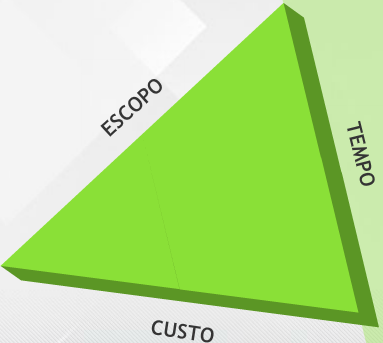

# Aula 2 - Gerenciamento da integração do projeto 

## Conceitos de gerenciamento da integração do projeto 

Gerenciamento de integração: grupo de processos que coordena e unifica os processos das demais áreas de conhecimento. 

A finalidade da integração é avaliar e selecionar a aplicação dos diversos processos, das dez áreas de conhecimento, para garantir que os objetivos do projeto serão alcançados. 

Áreas de conhecimento: 
- **Gerenciamento de integração do projeto**: Garantir que os diversos elementos do projeto serão coordenados de maneira integrada; 
- **Gerenciamento de escopo do projeto**: Garantir que o projeto incluirá todo e somente o trabalho necessário para o sucesso do projeto; 
- **Gerenciamento do tempo do projeto**: Garantir que o projeto será concluído no prazo previsto; 
- **Gerenciamento de custos do projeto**: Garantir que o projeto será concluído dentro do custo previsto; 
- **Gerenciamento da qualidade do projeto**: Garantir que o projeto atenderá aos requisitos de qualidade esperados; 
- **Gerenciamento dos recursos humanos do projeto**: Garantir a utilização efetiva dos recursos humanos do projeto; 
- **Gerenciamento das comunicações do projeto**: Garantir a geração, coleta, disseminação, armazenamento e disponibilização das informações apropriadas do projeto no tempo e de maneira adequada; 
- **Gerenciamento das partes interessadas**: Garantir o engajamento das partes interessadas com os objetivos do projeto; 
- **Gerenciamento dos riscos do projeto**: Garantir a identificação, análise, planejamento, monitoramento e controle dos riscos do projeto; 
- **Gerenciamento de aquisições do projeto**: Garantir as aquisições de bens e serviços externos à organização do projeto.
 

## Termo de abertura do projeto 

Ele é a autorização para o início do projeto. Pode ser simples ou completo, dependendo das informações disponíveis sobre o projeto no momento da sua emissão. Parte das informações para a elaboração do termo de abertura é obtida consultando o **estudo de viabilidade do projeto**. O termo de abertura é usado durante todo o **ciclo de vida do projeto**, notadamente para a avaliação das propostas de mudanças do projeto. 

O termo de abertura do projeto é emitido pelo **patrocinador do projeto**. Porém, é recomendável que o gerente de projetos a ser designado participe de sua elaboração. Ele somente pode ser alterado pelo patrocinador do projeto, pois ele é o responsável por sua emissão. O termo de abertura documenta a necessidade do negócio, seja para resolver um problema, seja para capturar uma oportunidade para a organização. 

O termo de abertura pode ser composto pelos seguintes elementos: 
- **Nome do projeto**: o nome "vende" o projeto.  
- **Descrição do projeto**: deve ser apresentada uma descrição de alto nível das características do projeto.  
- **Justificativa do projeto**: a justificativa liga o projeto aos objetivos estratégicos da organização. É uma necessidade da organização que está sendo atendida. Fortalece a posição do patrocinador do projeto e motiva a equipe para sua execução. Geralmente o estudo de viabilidade fornece a base para esta justificativa. É importante que a justificativa seja bem clara.  
- **Objetivos do projeto**: são os requisitos mais amplos que o projeto deve atender. 
- **Requisitos de alto nível**: é uma lista de itens que o produto do projeto deve ter para atingir o que é solicitado nas especificações, sejam elas internas ou contratuais. 
- **Critério de aceitação**: são os critérios mínimos, inclusive requisitos de desempenho e condições essenciais, que devem ser atendidos para que as entregas do projeto sejam aceitas. 
- **Cronograma resumido**: Mostra as datas estimadas dos principais eventos. Normalmente, nessa fase, os prazos são baseados em projetos semelhantes já realizados. 
- **Estimativa orçamentária**:  basta apresentar uma ordem de grandeza dos custos estimados para a realização do projeto. A tolerância dessa estimativa deve ser grande, pois pouco se conhece em detalhes sobre a execução do projeto. 
- **Riscos relevantes identificados**: Caso sejam conhecidos riscos que possam impactar na execução do projeto, é importante registrá-lo já no início do projeto. 
- **Gerente de projetos designado e sua autoridade**: É o responsável pelo sucesso ou fracasso do projeto. É recomendável que o gerente de projetos seja designado o mais cedo possível. 
- **Cliente do projeto**: O cliente do projeto é o responsável por fornecer os requisitos do produto do projeto. 
- **Patrocinador do projeto**: O patrocinador é a voz do projeto junto à alta administração da organização. Ele provê recursos orçamentários e defende o projeto junto à organização. 

## Plano de gerenciamento do projeto 

Cria-se um documento que define como o projeto será: 
- Planejado;
- Executado; 
- Controlado; 
- Monitorado; 
- Encerrado. 

Esse processo envolve a documentação das ações necessárias para definir, preparar, integrar e coordenar os planos auxiliares, gerando-se o plano de gerenciamento do projeto, que será a fonte principal de informações sobre como desenvolver o projeto. 

Este plano é desenvolvido através de uma série de processos integrados. Assim, o esforço para a criação do plano é realizado pela equipe de **gerenciamento do projeto** com a participação de diversas partes interessadas do projeto, cujas especializações são necessárias para a adequação do trabalho. 
 
O plano do projeto é um documento composto de diversos planos auxiliares. Sua elaboração é progressiva. Durante todo o ciclo de vida do projeto, este plano deve ser atualizado, à medida que as mudanças vão ocorrendo.

**O que pode influenciar o desenvolvimento do plano do projeto?**  

A infraestrutura de TI e de comunicações, sua estrutura de governança, padrões existentes na organização ou na área de aplicação do projeto, informações históricas, entre outros aspectos. 

Nesse ponto, é importante você considerar que a única certeza que se tem em relação ao plano é que **dificilmente será implantado exatamente como planejado**. Por outro lado, planejar um projeto é uma experiência imperdível. É um projeto dentro de um projeto. Os profissionais envolvidos vivenciam no planejamento a simulação da execução do projeto.

A sequência inicial para o trabalho de planejamento do projeto é rígida: **escopo, tempo e custo**. 

Depois seguem, de acordo com as características do projeto, **sem a mesma rigidez**, as demais áreas de conhecimento: **Qualidade, recursos humanos, comunicações, engajamento das partes interessadas, riscos e aquisições**. Apesar da sequência lógica, é um **trabalho iterativo**. 

**O plano de gerenciamento de projeto integra e consolida todos os planos auxiliares de gerenciamento de projetos.** Cada plano auxiliar é detalhado de acordo com as necessidades da área de conhecimento envolvida no projeto, conforme o nível de aplicação de cada processo selecionado. Assim, descreve as técnicas e ferramentas selecionadas para os processos escolhidos. É função do **gerente de projeto** avaliar o impacto da mudança nos diversos aspectos do projeto, para que a tomada de decisão seja a mais objetiva possível. 

 
**Como deve ser o Plano de gerenciamento de projeto?**  

**Formal e realista**, aprovado pelos envolvidos para sua execução e usado no dia a dia do projeto. Uma vez aprovado, o plano do projeto somente pode ser alterado através de solicitação de mudança aprovada. 

O plano é composto de duas partes: **os planos auxiliares e as linhas de base**, sobre as quais o desempenho do projeto será avaliado. As linhas de base do projeto são: 
- **Linha de base do escopo**: Declaração do escopo, estrutura analítica do projeto e dicionário da EAP 
- **Linha de base do cronograma**: Cronograma 
- **Linha de base do desempenho de custos**: Orçamento 

Durante a fase de execução, estas linhas de base são dinâmicas. É importante saber que, com a utilização da técnica de gerenciamento de valor agregado, essas três linhas combinadas formam a **linha de base de desempenho do projeto**. 

## Orientação e gerenciamento do trabalho do projeto 

Os desdobramentos do processo de orientação e gerenciamento do projeto são: 
- Executar as atividades para realizar os objetivos do projeto; 
- Criar as entregas do projeto; 
- Formar, treinar e gerenciar os membros da equipe do projeto; 
- Obter, gerenciar e usar os recursos humanos, equipamentos, instalações, materiais e ferramentas; 
- Implementar os padrões e os métodos planejados; 
- Implantar atividades de melhoria nos processos; 
- Estabelecer e gerenciar os canais internos e externos de comunicação do projeto; 
- Gerar dados do projeto, tais como custos, cronograma, progresso técnico e informações sobre o andamento do projeto;
- Emitir solicitações de mudança; 
- Adaptar as mudanças aprovadas; 
- Gerenciar os riscos e implantar as atividades de resposta a riscos; 
- Gerenciar fornecedores; 
- Coletar e documentar as lições aprendidas. 

Orientar e gerenciar são as principais atividades do gerente do projeto. É preciso garantir o entendimento comum do trabalho do projeto. Para tanto, por exemplo, é importante: 
- Garantir que o plano de comunicação seja seguido pela equipe do projeto; 
- Garantir que as partes interessadas tenham consciência de como serão afetadas pelo projeto; 
- Garantir o entendimento das exclusões do escopo do projeto; 
- Garantir que os setores da organização que estão disponibilizando recursos para o projeto tenham a última versão do cronograma; 
- Confirmar que os gerentes estão cientes os relatórios emitidos pelo projeto. 
 
Gerenciar é lidar com pessoas. Para tanto, é preciso: 
- Circular as informações do projeto entre os membros da equipe; 
- Facilitar as discussões para seleção de opções; 
- Interceder juntos aos setores da organização na superação de barreiras; 
- Trabalhar na solução de problemas da equipe. 

## Monitoramento e controle do trabalho do projeto 

O processo de acompanhar, revisar e avaliar o andamento do projeto para atender aos objetivos de desempenho definidos no plano de gerenciamento do projeto inclui a coleta, a medição e a distribuição das informações sobre o desempenho e a avaliação das medições e tendências para efetuar melhorias no processo. 

Os desdobramentos do processo de monitoramento e controle do projeto são: 
- Comparar o desempenho real do projeto como o planejado; 
- Avaliar o desempenho para determinar a necessidade de ações corretivas ou preventivas; 
- Fornecer informações para suporte aos relatórios de progresso; 
- Monitorar a implantação das mudanças aprovadas. 

**Quando o monitoramento e controle ocorrem?** 
 
Durante todo o ciclo de vida do projeto, desde a iniciação até o encerramento. O monitoramento contínuo do andamento do projeto permite que a equipe de gerenciamento do projeto tenha uma visão clara da saúde do projeto e identifique as áreas que exigem atenção especial. 

Esse trabalho também contempla o acompanhamento dos indicadores de desempenho criados para o projeto. O resultado do trabalho de monitoramento e controle do trabalho do projeto são as solicitações de mudanças e atualizações no plano do projeto. 

**Ações corretivas** são baseadas em: 
- Contínua medição dos processos; 
- Saber quanto o projeto saiu dos trilhos; 
- Habilidade de achar a causa-raiz do problema, e não sua consequência 

**Ações preventivas** tem como exemplos: 
- Ações para evitar que o problema não se repita; 
- Troca de um recurso motivado pelo fato que a entrega por ele realizadas não atingiu o critério de aceitação; 
- Treinamento para um profissional para que ele possa se tornar um backup de um recurso-chave. 

**Reparos de defeitos** *(a.k.a retrabalho)*: 
- Rejeição de uma entrega pelo cliente por falta de qualidade; 
- Rejeição de uma entrega pelo controle de qualidade do projeto; 
- Entrega com escopo incompleto. 
 
## Controle integrado de mudanças 

Trata-se do trabalho definido no plano do projeto para levar a efeito as **solicitações de mudança** do projeto. O mais importante é analisar o impacto da mudança em todas as áreas de conhecimento. 

## Encerramento do projeto ou fase 

Trata-se do processo de finalização de todas as atividades, em todos os grupos de processos de gerenciamento de projetos, para encerrar formalmente o projeto ou uma de suas fases. 
 
As atividades envolvidas, entre outras, são: 
- Confirmar que todo o trabalho planejado foi realizado; 
- Garantir de que o projeto atendeu aos critérios de aceitação; 
- Terminar os relatórios de acompanhamento; 
- Coordenar a transição do produto do projeto para o cliente; 
- Coletar os dados técnicos do projeto; 
- Consolidar os registros das lições aprendidas; 
- Arquivar a documentação técnica do projeto; 
- Arquivar a documentação administrativa do projeto; 
- Arquivar a documentação financeira do projeto; 

Obter o aceite do cliente do produto final do produto. 

Se projeto for cancelado, a documentação indicará por que o projeto foi finalizado antes do previsto e formalizará os procedimentos da transferência das entregas acabadas ou em andamento para o cliente. 

## Lições aprendidas 

Para o contínuo aprendizado da organização, o registro das lições aprendidas é uma garantia de que o aprendizado proporcionado pelo projeto não ficará apenas no entendimento dos profissionais que trabalharam no empreendimento. 

O registro das lições aprendidas e a análise da documentação deste acervo é um ativo organizacional de inestimável valor: **cria riqueza para a organização**.