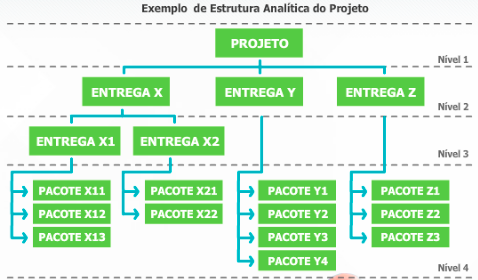

# Aula 3 - Gerenciamento do Escopo do Projeto 

## Planejamento do escopo do projeto 

Ele visa definir claramente aquilo que deve ser feito pelo projeto e garantir que somente esse trabalho seja realizado. 

Os planejamentos de todas as demais áreas de conhecimento somente podem ser executados após a conclusão do planejamento do escopo. 


## Levantamento dos requisitos 

Segundo o PMBOK®, “Os requisitos incluem os anseios, necessidades e expectativas quantificados e documentados do patrocinador, do cliente e de outras partes interessadas”. 

Para registro dos requisitos, são elaborados: o documento denominado “documentação dos requisitos” e a “matriz de rastreabilidade dos requisitos”, os quais esclarecem os requisitos e permitem rastrear as partes interessantes que os demandaram. 

Quando adequadamente detalhados, melhoram o entendimento das necessidades e expectativas das partes interessadas, facilitando seu gerenciamento. Um requisito não incluído pode provocar retrabalho no futuro. 
 
Podem ser classificados como:  
- Requisitos do projeto: trabalho que precisa ser feito, entregas intermediárias; 
- Requisitos do produto: características técnicas, funcionalidades, atributos, desempenho. 


## Escopo do produto x escopo do projeto 

“O **escopo do produto** abrange as características ou funções que devem compor o produto, serviço ou resultado”. 

Podemos dizer que o **escopo do produto** é representado por requisitos ou especificações do mesmo. 

Exemplo:

``` 
Imagine o projeto de construção de uma casa. São exemplos de especificações do produto: 
- Projeto de arquitetura; 
- Projeto estrutural; 
- Projeto de instalação hidráulica; 
- Projeto de urbanismo; 
- Projeto de instalações elétricas. 
``` 

“O **escopo do projeto** abrange todo o trabalho que deve ser realizado para entregar o produto, serviço ou resultado com as características e funções especificadas”. 

Entrega é qualquer produto, serviço ou resultado que deverá ser produzido para a conclusão de um projeto. 
 
``` 
A busca de fornecedores, licitação e contratação da empresa que elaborará o projeto de arquitetura e urbanismo, bem como a entrega desses projetos são exemplos de escopo de projeto. 
``` 

## Declaração do escopo do projeto 

Objetivos do documento: 
- Formalizar todo e apenas o trabalho necessário para gerar as entregas do projeto; 
- Fornecer um entendimento comum do escopo do projeto a todas as partes interessadas no projeto; 
- Orientar a equipe durante a execução; 
- Fornecer a linha de base (referência) para facilitar a avaliação de mudanças de escopo. 


### Componentes da declaração do escopo do projeto 
 
**Descrição do escopo do produto**: Características ou funções que devem compor o produto, serviço ou resultado; 

**Descrição do escopo do projeto**: São as entregas do projeto. Qualquer produto ou serviço que deve ser produzido para permitir a conclusão de um projeto; 

**Exclusões específicas do escopo**: Explicita o que está excluído do escopo para não causar dúvidas ou suposições. Pode ser considerada uma lista de verificação para projetos cujas características podem ser consideradas óbvias; 

**Restrições do projeto**: Restringe as opções da equipe do projeto. Por exemplo: restrição de recursos, restrição de tecnologia, restrição de prazo ou restrição de custo; 

**Premissas do projeto**: São pré-requisitos ou fatores considerados como verdadeiros para efeito de planejamento. Caso não aconteçam podem impactar o projeto. 


### Premissas x restrições 

As premissas são fatos considerados verdadeiros pela equipe do projeto para fins de planejamento do projeto, que, se modificadas, implicam em alterações. **As premissas são fontes de riscos para o projeto.** 

**As restrições são, em geral, fatores externo ao projeto que limitam suas opções**, tal como uma determinada data para a conclusão do projeto ou valor orçamentário limite. 


## Estrutura analítica de projetos (EAP) 

A EAP — em inglês, work breakdown structures (WBS) — é uma forma de representar o escopo do projeto que será realizado no mesmo, em forma de entregas. 

É uma importante ferramenta de comunicação, para a elaboração e representação do escopo do projeto. 
 
Se não faz parte da EAP, não faz parte do projeto.




### Elementos da EAP x atividades do cronograma 

É importante atentar que os elementos da EAP **representam as entregas do projeto**, e não as atividades do cronograma. 

As atividades do cronograma do projeto são ações que devem ser realizadas para concluir os pacotes de trabalho da EAP. 

As atividades fazem parte da área de conhecimento do **gerenciamento do tempo do projeto**. A EAP faz parte do **gerenciamento do escopo do projeto**. 


### Dicionário da EAP 

Documento complementar que fornece descrições detalhadas dos elementos da EAP. 

Pode conter, entre outros: 
- O código identificador da conta; 
- A descrição do trabalho; 
- Recursos estimados; 
- Critérios de aceitação; 
- Requisitos de qualidade; 
- Referências técnicas; 
- Informações de contrato. 
 
**Componentes da linha de base**: A linha de base do escopo é composta pela **declaração do escopo, pela EAP e pelo dicionário da EAP**. Serve como referência para monitorar e controlar o escopo do projeto e avaliar solicitações de mudanças. 
 

## Controle e validação do escopo do projeto 

**Controlar** o escopo do projeto envolve: 
- Monitoramento e controle do andamento do escopo do projeto e do produto do projeto para conhecer quais entregas foram concluídas e quais estão em andamento; 
- Confirmação de que as mudanças de escopo foram aprovadas através de processo de controle integrado de mudanças; 
- Gerenciamento das mudanças aprovadas na linha de base do escopo. 

**Validar** o escopo do projeto envolve: 
- O aceite formal do cliente das entregas concluídas pela equipe do projeto; 
- Eventual revisão de entregas por solicitação do cliente para aprovação final. 


### Diferença entre validação do escopo e controle da qualidade 

A validação do escopo **formaliza a aceitação das entregas** do projeto pelo cliente. 

Já o controle da qualidade trata do **atendimento aos requisitos de qualidade para a execução da entrega** pela equipe do projeto. 

Normalmente, o controle da qualidade é realizado antes da verificação do escopo, mas pode ser feito simultaneamente. 