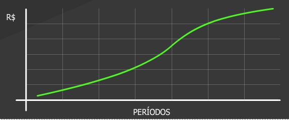

# Aula 5 - Gerenciamento dos custos do projeto 
 
## Custos do projeto 

O gerenciamento dos custos do projeto basicamente foca nos esforços para os levantamentos dos custos dos recursos estimados para executar as atividades do cronograma. 

A linha de base dos custos é obtida agregando-se os custos das atividades somados aos custos das reservas de contingência do projeto. 

O orçamento do projeto contempla os custos expressos na linha de base, somados à reserva de gerenciamento do projeto. 

## Planejamento dos custos do projeto 

Os planejamentos do tempo e dos custos do projeto são interdependentes. Esta interdependência ocorre por ocasião da definição dos recursos para a execução das atividades do projeto. 

O planejamento dos custos consiste em: 
- Calcular os custos dos recursos identificados como necessários para executar as atividades do projeto; 
- Consolidar esses custos para compor o orçamento do projeto. 

## Tipos de custos 

Existem basicamente quatro tipos de custos: 
1. **Fixos**: os custos fixos não mudam com a mudança na produção. 
2. **Variáveis**: variam de acordo com a quantidade de produção do trabalho. 
3. **Diretos**: são atribuíveis diretamente ao trabalho do projeto. 
4. **Indiretos**: são custos incorridos para o benefício de mais de um projeto. 

## Estimativas de custos 
 
O primeiro passo é elaborar uma estimativa dos custos dos recursos necessários para executar as atividades do projeto. 

As estimativas de custo são elaboradas para os diversos recursos atribuídos ao projeto, como por exemplo: mão-de-obra, materiais, equipamentos, serviços e instalações. 
  
Existem diversas técnicas e ferramentas para auxiliar nessa estimativa: 
 
 
### Estimativa por analogia ou top down (de cima para baixo) 

Baseada em informações históricas de projetos reais semelhantes e opinião de especialista. Utilizada quando não se tem muitas informações sobre o projeto. Normalmente são menos precisas e precisam ser ajustadas as condições do projeto. 

### Estimativa bottom up (de baixo para cima) 

Estima-se o custo de cada atividade do projeto para posteriormente agrupá-las na estimativa de custo total do projeto. 

### Estimativa paramétrica 

Utiliza relação estatística entre dados históricos e parâmetros. Neste caso, a estimativa é feita multiplicando a quantidade de trabalho a ser realizado pelo custo histórico da unidade. 

### Estimativa de três pontos (PERT) 

Baseia-se na definição de estimativas de custos considerando a variabilidade e riscos. A Análise PERT que utiliza três tipos de estimativas: mais provável, otimista e pessimista. 

O cálculo da estimativa de custo da atividade é obtido a partir da seguinte fórmula: 

PERT = [Otimista + (4 x Provável) + Pessimista] / 6 

Para o cálculo do desvio padrão, adota-se a seguinte fórmula: 

PERT = (Otimista - Pessimista) / 6 

Essa forma de estimar custos é aderente à natureza probabilista das atividades do projeto. 

Outra maneira para a obtenção das estimativas dos custos das atividades do projeto baseia-se na análise das cotações das propostas de fornecedores. 

## Precisão das estimativas 

Deve ser definida por intervalos e esses intervalos refletem o grau de incerteza característico de cada fase do ciclo de vida do projeto.  

Seguem como exemplos os percentuais: 
1. **Na fase de iniciação**: Intervalo variando entre menos 25% e mais 25%. 
2. **Na fase de planejamento**: Faixa com intervalo entre menos 10% e mais 25%. 
3. **Na fase de execução**: Faixa de intervalo entre menos 10% a mais 10%. 

## Linha de base dos custos do projeto 

O próximo passo é obter a linha de base dos custos do projeto. A obtenção da linha de base de custos do projeto consiste em **agregar os custos estimados das atividades**. Assim, **os custos das atividades são resumidos nos níveis mais elevados e finalmente na estimativa total do projeto**. 

As estimativas dos custos não podem ser concluídas sem incluir as reservas de contingência, as quais levam em consideração as incertezas das estimativas dos custos das atividades. 

As reservas de contingências podem ser calculadas a partir de um percentual adicional do estimado do custo da atividade ou um mesmo um valor fixo. 

**A linha de base é utilizada na medição do desempenho dos custos do projeto.** 
 
## Orçamento do projeto 

Representa quanto à organização reservou de recursos financeiros para a execução do projeto. 

Para a obtenção do valor do orçamento do projeto, **deve-se definir uma reserva de contingência de gerenciamento**, objetivando atender para mudanças no projeto oriundas de eventos inesperados e imprevisíveis pelos quais o projeto poderá ser impactado. 

**Esta reserva não é considerada na linha de base de custos**. Ela representa fundos que **só podem ser utilizados pelo projeto com autorização da administração da organização**. 
 

## Curva S dos custos acumulados 

A linha de base de custos do projeto é apresentada com os valores acumulados por período de tempo e é tipicamente representada por uma curva com formato de S. 

## Controle dos custos do projeto 

**Monitorar** o desempenho de custos, visando detectar e entender os desvios em relação aos custos estimados; 

**Garantir** que mudanças na linha de base dos custos sejam previamente aprovadas; 

**Prevenir** que o orçamento aprovado não seja ultrapassado;  
 
**Evitar** que mudanças não aprovadas sejam incluídas nos custos do projeto; 

**Refletir** as mudanças aprovadas na linha de base de custos. 