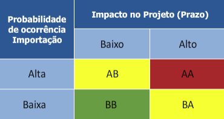
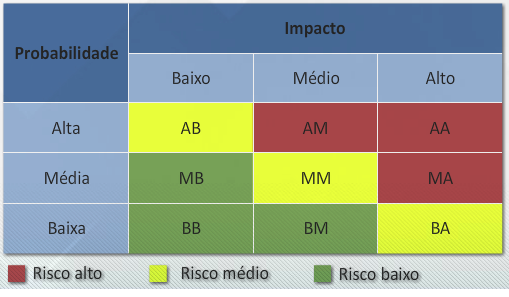

# Aula 9 – Gerenciamento dos riscos do projeto 

## Definição de risco 

**Risco é um evento ou condição inverta que, se ocorrer, provocará um efeito positivo ou negativo nos objetivos de um projeto.** 

O risco é uma condição de incerteza identificada antecipadamente. Devido à falta de conhecimento pode ou não ocorrer. Se ocorrer, causará um impacto positivo ou negativo nos objetivos do projeto, tais como escopo, prazo, custos, qualidade e satisfação do cliente. 
 

## Fatores de risco 

Os fatores de risco são: 
- Probabilidade de ocorrência do evento; 
- Impacto do risco nos objetivos do projeto; 
- Ocasião esperada para a ocorrência no ciclo de vida do projeto; 
- Frequência de ocorrência prevista. 

Entre esses quatro fatores, a probabilidade e o impacto são os que mais exigem atenção do gerente do projeto. 

## Benefícios do gerenciamento dos riscos 

O gerenciamento dos riscos aumenta a probabilidade de sucesso do projeto. Os principais benefícios do gerenciamento dos riscos são: 
- Ajuda a evitar problemas; 
- Reduz a probabilidade de ocorrência de problemas; 
- Aumenta a probabilidade de aproveitar oportunidades; 
- Diminui as incertezas das estimativas de duração e custo das atividades do projeto; 

## Planejamento do gerenciamento de riscos do projeto 

O plano de gerenciamento de riscos define como será o planejamento, monitoramento e controle das atividades relacionadas ao gerenciamento de riscos. Esse plano abrange a definição de elementos como: 

- Categorias ou fontes de riscos. 
- Técnicos; 
 - - Gerenciamento do projeto; 
 - - Organizacional; 
 - - Regulatórios; 
 - - Ambientais; 
 - - Fornecimentos. 

- Classificação dos níveis de probabilidade e impacto utilizando escalas relativas ou numéricas. 
- - Exemplo: 
- - Escala de probabilidade: “alta”, “média” e “baixa”; 
 - - Escala impacto:” baixo”, “moderado” e “alto”. 

- Matriz de probabilidade e impacto. 
- - Para priorizar qualitativamente os riscos de acordo com suas implicações potenciais de afetar os objetivos do projeto. 
- - 

- Papéis e responsabilidades relacionadas aos eventos de risco. 
- Custos envolvidos. 

## identificação dos riscos 

A identificação inicial dos riscos ocorre logo na iniciação do projeto e mais intensamente durante o planejamento. 
 
Os riscos identificados são denominados **riscos conhecidos**. Ao longo da vida do projeto, podem ser identificados novos riscos até então desconhecidos. Uma vez identificado um novo risco para o projeto, os processos de gerenciamento de riscos devem ser observados. 

Observe, abaixo, as diversas técnicas e ferramentas utilizadas para auxiliar na identificação dos riscos do projeto: 
- Análise SWOT (*strengths, weakness,  opportunities, and threats analysis*, forças, fraquezas, oportunidades e  ameaças) para identificar pontos fortes e fracos do projeto e as ameaças e oportunidades do ambiente externo; 
- Revisão da documentação histórica de projetos similares; 
- Requisitos do projeto que podem causar incertezas; 
- Premissas e restrições do projeto; 
- Grau de detalhamento dos requisitos e do escopo; 
- Análise das atividades do cronograma e fatores que podem provocar atrasos ou antecipação; 
- Análise das estimativas de custos e de prazos, bem como os fatores que podem provocar variações destas estimativas; 
- Técnicas de coleta de informações, tais como entrevista, brainstorming e técnica de Delphi; 
- Lista de verificação das categorias de risco. 

 
## Descrição e registro do risco identificado 

O risco deve ser descrito em três partes: devido à “**causa conhecida**”, poderá ocorrer o “**risco**”, o que levaria ao “**impacto**”. 

Quanto mais detalhada for a descrição, mais facilmente será feito o planejamento da resposta.  

Observe os exemplos: 

**Exemplo de descrição genérica**: devido à situação da transportadora, poderá ocorrer dificuldade na entrega dos materiais, o que levaria a um aumento dos custos do projeto. 

**Exemplo de descrição detalhada**: devido à transportadora não ter caminhão em sua frota com capacidade de 10 toneladas de carga para transportar a totalidade dos perfis metálicos, poderá ocorrer dificuldade na subcontratação do serviço, o que levaria a um aumento dos custos do projeto. 

O documento resultante deste processo é o Registro dos Riscos. O Registro de Riscos é dinâmico, atualizado ao longo do ciclo de vida do projeto. Os processos subsequentes de análise dos riscos e planejamento das respostas complementam as informações desse documento. O Registro dos Riscos contém: 
- Lista de riscos; 
- Classificação dos riscos; 
- Lista de possíveis respostas; 
- Causas-raiz dos riscos; 
- Gatilhos de riscos; 
- Responsáveis pelos riscos. 
 

## Análise Qualitativa dos riscos 

Os riscos identificados listados no Registro dos Riscos passam pelo processo de análise qualitativa de riscos, quando são avaliados e classificados em relação aos impactos no projeto e probabilidades de ocorrência. 

Exemplo de matriz de probabilidade x impacto: 

Na matriz exemplificada, a primeira letra representa a classificação da probabilidade e a segunda letra, o grau do impacto. As cores mostram o grau de criticidade do risco. 

Após a classificação, é possível priorizar os riscos no Registro de Risco com o objetivo de se concentrar no trabalho de planejamento das respostas. 
 

## Análise Quantitativa dos riscos 

Após a análise qualitativa, os riscos priorizados passam pelo processo de análise quantitativa. A análise qualitativa dos riscos sempre é executada, mas a quantitativa pode não ser necessária.  

A análise quantitativa é objetiva. Tenta medir a probabilidade e os impactos reais nos objetivos de prazo e custos do projeto. Os principais resultados do processo de análise quantitativa são: 
- Determinar a exposição do projeto (risco geral); 
- Determinar a probabilidade quantificada de cumprir os objetivos de prazo e custos do projeto; 
- Determinar as reservas de prazo e custos. 

A técnica mais utilizada neste processo é a simulação de Monte Carlo. 

## Planejamento das respostas aos riscos 

O processo de planejamento das respostas aos riscos é responsável pela elaboração de ações para ampliar as oportunidades e reduzir as ameaças aos objetivos do projeto. 

As estratégias utilizadas para responder a riscos negativos ou ameaças são: 
- Aceitar ativamente o risco: Preparar os planos alternativos de contingência, com custos, recursos e prazos definidos, de modo a lidar com a eventual ocorrência dos riscos. 
- Aceitar passivamente o risco: Aguardar o risco ocorrer para então gerenciar seus efeitos. 
- Prevenir o risco: Planejar ações com o objetivo de eliminar a ameaça para os objetivos do projeto. 
- Transferir o risco: Repassar os riscos para terceiros. É o caso de transferir o risco de acidente durante o transporte de um equipamento contratando uma apólice de seguro. 
- Mitigar o risco: Planejar ações que possam reduzir a probabilidade da ocorrência ou do impacto do risco identificado. 

As estratégias utilizadas para ampliar os riscos positivos ou oportunidades são: 
- Explorar o risco - Planejar ações que concorram para a ocorrência da oportunidade; 
- Compartilhar o risco - Atribuir sua responsabilidade a terceiros que possam capturar melhor a oportunidade do risco acontecer e, consequentemente, beneficiar o projeto; 
- Melhorar o risco - Planejar ações para aumentar a probabilidade e/ou impacto do risco. 

Dois termos utilizados no gerenciamento de riscos: 
- **Riscos residuais** - São aqueles que permanecem após o planejamento das respostas aos riscos identificados. 
- **Riscos secundários** - São os novos riscos que surgem como consequência da definição da estratégia de respostas aos riscos identificados. 

## Atualização do registro dos riscos 

As respostas planejadas devem ser inseridas no documento Registro dos Riscos, seguindo algumas regras: 
- As ações de resposta devem ser claras e objetivas, de modo a evitar apenas intenções; 
- Para cada risco identificado, é formalmente designado um responsável pelas ações de acompanhamento e controle; 
- As reservas de contingência de custos para os riscos identificados não utilizadas pelo projeto não podem ser destinadas para outras atividades do projeto. 

**Soluções de contorno**: São as respostas não planejadas para riscos ocorridos. Este fato deve ser registrado no Registro de Riscos para futuras consultas e registro das lições aprendidas do projeto. 

## Monitoramento e controle dos riscos 

O monitoramento e controle dos riscos devem ser realizados durante todo o ciclo de vida do projeto e envolvem atividades como: 
- Revisar a classificação e as respostas aos riscos; 
- Acompanhar os riscos já identificados; 
- Procurar identificar gatilhos de riscos; 
- Executar os planos de respostas aos riscos; 
- Identificar, comunicar e planejar respostas para novos riscos descobertos; 
- Identificar e registrar as lições aprendidas; 
- Realizar auditorias de riscos visando avaliar a eficiência das estratégias de resposta aos riscos e do plano de gerenciamento de riscos; 
- Avaliar as quantidades restantes das reservas de contingência para os custos ou prazos em decorrência dos riscos que não ocorridos; 
- Comunicar as partes interessadas sobre a situação dos riscos; 
- Revisar a lista de observação de risco. 