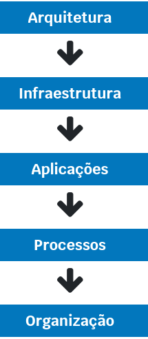

# Governança em Tecnologia da Informação 

# Aula 1 - Governança corporativa e de TI 

## Governança corporativa 

Separação entre **gestor e proprietário** deu origem à discussão sobre a governança corporativa e aos conflitos entre o melhor interesse da organização e os interesses dos sócios e executivos (conflito de agência). 

### Teoria do agente principal 

O principal, o titular da propriedade delega ao agente o poder de decisão sobre esse bem. 

Gestor -> delega poder de decisão -> Agente 

Gestor -> uma vez que os interesses do primeiro nem sempre estão alinhados aos do último, podem ocorrer conflitos. -> Agente 

A **teoria do agente principal ou teoria da firma**: dois pesquisadores chegaram à conclusão que executivos contratados por acionistas tenderiam a agir em interesse próprio, focando em seus próprios benefícios (mais poder, salários maiores, estabilidade) em detrimento dos interesses da empresa, dos acionistas e demais partes interessadas. Para mitigar o problema e garantir o sucesso da empresa, foi sugerida a adoção de uma série de medidas para o alinhamento dos interesses dos envolvidos que incluíam entre outras ações: 

* Monitoramento 
* Controle 
* Divulgação de informações 

Essas medidas receberam o nome de **governança corporativa** que pode ser definida como: *"o sistema pelo qual as empresas e demais organizações são dirigidas, monitoradas e incentivadas, envolvendo os relacionamentos entre sócios, conselho de administração, diretoria, órgãos de fiscalização e controle e demais partes interessadas." Instituto Brasileiro de Governança Corporativa (IBGC)*; *"Conjunto de responsabilidades e práticas exercidas pela diretoria e pela gerência executiva com os objetivos de fornecer uma direção estratégica, garantir que as metas sejam atingidas, certificar-se de que os riscos sejam gerenciados corretamente e garantir que os recursos da empresa sejam utilizados de modo responsável." IT Governance Institute*. 

**Governança corporativa**, portanto, é: Um conjunto de práticas que envolvem processos, pessoas e ferramentas, que convertem princípios em recomendações objetivas, alinhado aos interesses da organização, com a finalidade de preservar e otimizar o valor da organização, contribuindo para sua longevidade. 

### Princípios da governança corporativa 

* **Transparência**: Obrigação e desejo de informar resultados e ações. 
* **Responsabilidade corporativa**: Os agentes de governança devem zelar pela sustentabilidade das organizações, visando sua longevidade, incorporando considerações de ordem social e ambiental na definição dos negócios e operações. 
* **Equidade**: Tratamento igual para todos os acionistas. 
* **Prestação de contas**: Os agentes da governança corporativa prestam contas e são responsáveis pelos seus atos e omissões. 

**As regulamentações possuem forte impacto na área de TI e devem fazer parte do modelo de governança de TI, pois dependendo da natureza da instituição devem ser contempladas pelo alinhamento estratégico.** 

Para obter sucesso na implementação da governança, o conselho de administração da organização deve exercer seu papel: 

* Estabelecendo estratégias para a empresa 
* Elegendo e destituindo o principal executivo da organização 
* Fiscalizando e avaliando o desempenho da gestão 
* Escolhendo a auditoria independente 

## Governança de TI 

São objetivos da governança de TI: 

1. **Posicionamento da TI**: Promover o posicionamento mais claro e consistente da TI em relação às demais áreas de negócios da empresa. 

2. **Alinhamento e priorização das iniciativas de TI**: Promover o alinhamento e a priorização das iniciativas de TI com a estratégia do negócio. 

3. **Alinhamento da arquitetura de TI**: Promover o alinhamento da arquitetura de TI, sua infraestrutura e aplicações às necessidades do negócio, em termos de presente e futuro. 

4. **Implantação e melhoria dos processos operacionais**: Promover a implantação e melhoria dos processos operacionais e de gestão necessários para atender aos serviços de TI, conforme padrões que satisfaçam as necessidades do negócio. 

5. **Gestão de risco e de compliance**: Prover a TI da estrutura de processos que possibilite a gestão do seu risco e compliance para a continuidade operacional da empresa. 

6. **Responsabilidade sobre a decisão e ações de TI**: Promover o emprego de regras claras para as responsabilidades sobre decisões e ações relativas à TI no âmbito da empresa. 

A governança de TI deve estabelecer os relacionamentos formais e informais e conferir direitos decisórios a um papel (CEO), ou a um grupo de papéis específicos (CFO, CPO, CIO, entre outros) no lado normativo, e focar na definição de mecanismos, formalizando relacionamentos e estabelecendo regras e procedimentos operacionais que proporcionarão que os objetivos sejam atingidos. 

Chief Enterprise Officer: Diretor geral ou presidente da empresa. 

CFO - Chief Financial Officer: Diretor financeiro. 
CPO - Chief Product Officer: Diretor de produtos. 
CIO - Chief Information Officer: Diretor de TI. 
COO - Chief Operating Officer: Diretor de operações. 
CTO - Chief Technical Officer: Diretor técnico. 
CHRO - Chief Human Resources Officer: Diretor de RH. 
CMO - Chief Marketing Officer: Diretor de marketing. 
CLO - Chief Legal Officer: Diretor jurídico. 
CKO - Chief Knowledge Officer: Diretor de conhecimento.  

O ciclo de governança de TI que é composto por quatro etapas: 

1. Alinhamento estratégico e compliance.
2. Decisão, compromisso, priorização e alocação de recurso. 
3. Estrutura, processos, operações e gestão. 
4. Medição de desempenho. 

Um dos objetivos da governança de TI é prover o emprego de regras claras para as responsabilidades sobre decisões e ações relativas à TI no âmbito organizacional e, nesse sentido, precisamos compreender as questões que envolvem esse processo decisório que basicamente pretendem responder as seguintes questões: 

* Quais decisões devem ser tomadas para garantir a gestão e o uso eficaz da TI? 
* Quem deve tomar estas decisões? 
* Como essas decisões serão tomadas e monitoradas? 

Decisões devem considerar necessariamente os diferentes aspectos que envolvem a área de TI: 

* **Investimentos de TI**: Devem ser analisadas quais as iniciativas de TI que receberão investimentos financeiros e de quanto será este investimento. 

* **Princípios de TI**: Devem ser definidos os princípios de TI da organização, que refletirão um comportamento adequado tanto para os profissionais quanto para os usuários de TI e devem esclarecer pelo menos três expectativas para a TI na empresa: Qual o modelo operacional de TI desejado na organização? / Como a TI dará suporte ao modelo desejado? / Como a TI será financiada? 

* **Arquitetura de TI**: Devem ser definidos os requisitos de integração e padronização da tecnologia e de negócio por meio da organização lógica dos dados, de aplicações e infraestrutura. 

* **Necessidade de aplicações de negócios**: Devem ser especificadas as necessidades de negócio de aplicações de TI, que podem ser adquiridas no mercado ou desenvolvidas internamente na organização. 

* **Estratégias de infraestrutura de TI**: Devem ser definidos os serviços compartilhados de TI e de suporte, de modo a prover serviços confiáveis para a organização. 

### Monarquia de Negócio 

Altos executivos de negócio tomam as decisões de TI que afetarão toda a empresa. 

### Monarquia de TI 

A decisão é tomada pelos especialistas de TI. 

### Feudalismo 

Cada unidade de negócio toma decisões independentes. 

### Duopólio de TI 

A decisão envolve dois grupos, um deles o de TI e um outro grupo da organização. 

### Federalismo 

Combinação entre o centro corporativo e as unidades de negócio, com ou sem envolvimento do pessoal de TI. 

### Anarquia 

Tomada de decisões individuais ou por pequenos grupos de modo isolado, com base somente em suas necessidades locais. 

## Framework de governança de TI 

É importante a implementação de um framework de governança como forma de proporcionar a harmonia entre a estratégia da organização da empresa, os arranjos de governança de TI e as metas de desempenho de negócio. 

## Alinhamento estratégico da TI com o negócio 

O processo de alinhamento estratégico da Tecnologia da Informação procura determinar qual deve ser o alinhamento da TI com as necessidades presentes e futuras do negócio: 

É o processo de transformar a estratégia do negócio em estratégias e ações de TI que garante que os objetivos de negócio sejam apoiados. Com os avanços tecnológicos atuais, esse processo de alinhamento passou a ser bidirecional e a TI também pode potencializar as estratégias de negócio nas organizações. 

O plano deve apoiar toda a operação da organização, considerando a possibilidade de desenvolvimento de novas soluções caso seja necessário para o negócio, deve abranger a manutenção de soluções já existentes, dos aplicativos e dos demais ativos de TI, da implantação e manutenção de soluções de serviços associados ao uso dos ativos e da infraestrutura. 

Um plano de Tecnologia da Informação é elaborado por um determinado período de tempo e revisado anualmente. O plano deve contemplar as seguintes informações: 

1. Princípios de TI 
2. Arquitetura de TI 
3. Infraestrutura de TI 
4. Necessidades de aplicações 
5. Objetivos de desempenho e níveis de serviço e metas 
6. Capacidade de atendimento 
7. Organização das operações de serviços de TI 
8. Estratégia para fornecedores de serviços 
9. Competências requeridas 
10. Políticas de segurança da informação 
11. Investimentos e custeio 
12. Roadmap de TI 

O alinhamento estratégico ocorre em diferentes momentos na organização: 

* Quando a organização se reúne para definir objetivos de negócio de médio e longo prazos e estabelece estratégias para atingir esses objetivos, produzindo um plano estratégico ou um plano de negócios que posteriormente é desmembrado em planos táticos e operacionais para implementação. 

* Quando este plano estratégico é realinhado face a novas oportunidades de negócios. 

* Quando os próprios clientes demandam por novas soluções. 
