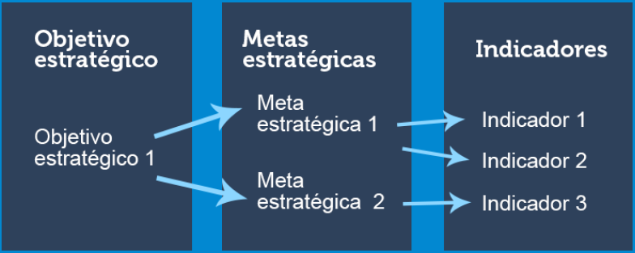
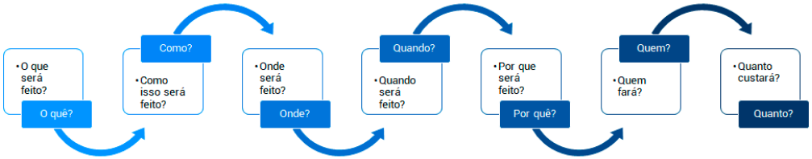
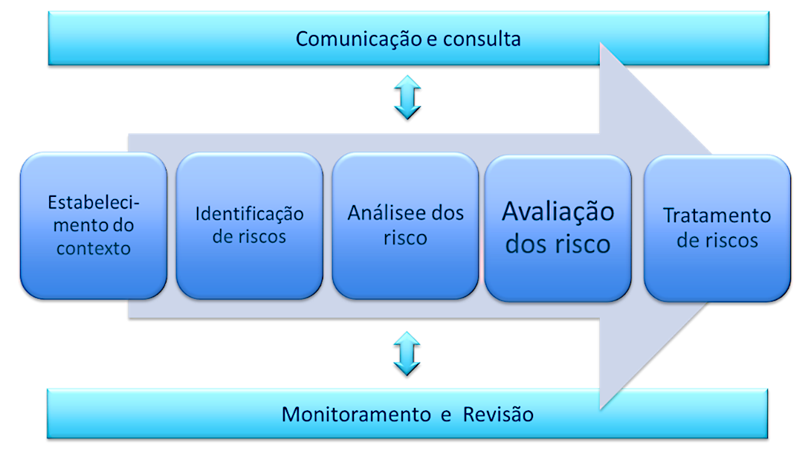

# Aula 2 - Gestão de desempenho em TI 

## Controle na boa governança 

O controle está relacionado diretamente com as demais funções do processo administrativo: **PLANEJAMENTO** -> **DIREÇÃO** -> **ORGANIZAÇÃO** 

Ele fornece feedback, além do estabelecimento de padrões, mensuração de desempenho e correção de desvio, por isso a importância da sua utilização na melhoria contínua das ações organizacionais. 

**Mensuração** -> **_Ação empresarial_** <- **Avaliação dos resultados** 

Todas as ações de TI independentemente se são resultados da prestação de serviços, de planos estratégicos ou de projetos, **só podem ser gerenciadas se tiverem medições e indicadores**. 

A organização deverá adotar um sistema de medição que definirá o desempenho da empresa, baseado em um conjunto de indicadores previamente estabelecidos e que atendam à demanda do negócio. 

Medir é importante para que se entenda o que está acontecendo na gestão, quais mudanças devem ser feitas e quais foram os impactos das mudanças já realizadas. Com essas respostas, é possível acompanhar se as metas para a organização estão sendo alcançadas e medir qual a porcentagem de melhoria ou piora em relação às medições anteriores. 
 
 

## Gestão de desempenho de TI 

A gestão do desempenho de TI tem como objetivos: 

1. Verificar se o objetivo de TI foi atendido conforme planejado pela organização. 
2. Entender os motivos da variação positiva ou negativa dos resultados obtidos em comparação com os resultados planejados. 

Caso os resultados apresentem variação negativa, ações corretivas, preventivas ou de melhorias no processo devem ser recomendadas, monitoradas e implementadas, e posteriormente monitoradas. 

Os resultados de TI são as medições derivadas de toda a prestação de serviços em termos de entrega de projetos e serviços e do atendimento a planos estratégicos e táticos. Esses resultados podem ser avaliados por meio: 

1. Da execução e do gerenciamento de processos e serviços de TI. 
   
2. Do gerenciamento dos níveis de serviços. 
   
3. Do gerenciamento da estratégia de TI. 
   
4. Do gerenciamento de projetos de TI. 
   
5. Do gerenciamento do portfólio de TI. 

## Indicadores de desempenho 

Um indicador de desempenho, também conhecido como **KPI (sigla em inglês para Key Performance Indicator)** é utilizado para **medir e avaliar o desempenho de processos e gerenciá-los da maneira mais eficaz e eficiente possível** e **medir e avaliar metas e objetivos previamente estipulados pelas organizações**. 

### Indicador 

Uma informação estruturada que permite comparações. Serve para comparar a métrica com um valor-base definido previamente (baseline) ou com um resultado esperado. 

Funções de um indicador: 

* Mensurar resultados e gerir o desempenho. 
* Embasar a análise crítica dos resultados obtidos e do processo de tomada de decisão.  
* Contribuir para a melhoria contínua dos processos organizacionais.  
* Facilitar o planejamento e o controle do desempenho. 
* Viabilizar a análise comparativa do desempenho da organização. 

A medição é necessária para confirmar que os esforços dispendidos na melhoria tiveram efeito e, assim, apoiar o sistema de melhoria contínua da organização. 

Os indicadores precisam ser apurados e documentados regularmente, é necessário definir diretrizes de controle para cada indicador.  
 
| Indicador | (nome do indicador) |
| :---: | :---: |
| Descrição | Fórmula | 
| O que o indicador mede e qual sua finalidade. | Como o indicador é calculado e a unidade de medida (número percentual, valor, etc) | 
| | |

Os indicadores de desempenho (KPI) devem observar as seguintes características: 

* Refletir os objetivos da empresa como um todo.  
* Serem utilizados pela gestão da organização para administrar e tomar decisões, pois tem caráter estratégico. 
* Ter alto grau de aderência ao negócio da organização. 
* Ter relevância em todos os níveis da empresa.  
* Serem baseados em dados confiáveis e mensuráveis. 
* Serem fáceis de entender (ou pelo menos rápidos de serem explicados). 
* Servir como insumo para uma ação ou um plano de ações.  

Para realizar o monitoramento, a organização poderá criar *dashboards* de gestão, agrupando os indicadores em diferentes níveis: 

1. **Indicadores estratégicos**: são os indicadores primários da organização, que serão acompanhados pela diretoria. O **principal propósito** é demonstrar de forma rápida se os objetivos estratégicos estão sendo alcançados. 
   
2. **Indicadores táticos**: são indicadores secundários, que serão acompanhados pelas gerências de cada departamento. Seus resultados devem ser ligados aos resultados dos indicadores estratégicos. 
   
3. **Indicadores operacionais**: indicadores que serão acompanhados pelos especialistas de cada área. Têm a função de fornecer mais detalhes para entendimento dos resultados dos indicadores táticos e estratégicos. 

O monitoramento do desempenho ocorre quando o resultado atingido é comparado com os resultados esperados, normalmente a intervalos regulares. Esse monitoramento deve responder as seguintes perguntas: 

* Qual é o nosso desempenho atual? 
* Existem diferenças entre o realizado e o previsto? 
* O que está causando desvios? 
* Qual é a tendência do desempenho? 
* Como estamos em relação a referenciais de mercado (benchmarking)? 
* Quais eventos causam variação positiva ou negativa no desempenho? 
* Qual é o padrão de desempenho? 

A partir desse monitoramento, a organização deverá estabelecer um plano de ação para atingir corrigir os possíveis desvios encontrados. O plano de ação deve deixar claro tudo o que deverá ser feito para o cumprimento dos objetivos e metas. 

 

## Comunicação 

A maneira mais eficiente de comunicação do desempenho organizacional é por meio da criação de dashboard que permita ao executivo consultar e entender, de forma rápida, o desempenho da TI. 

## Gestão de risco 

As organizações de todos os tipos e tamanhos enfrentam influências e fatores internos e externos que tomam incerto se e quando elas atingirão seus objetivos. O efeito que essa incerteza tem sobre os objetivos da organização é chamado de risco. 

É qualquer impacto em potencial nos objetivos da empresa causado por um evento não planejado deve ser identificado, analisado e avaliado. 

Estratégias de **mitigação de risco** devem ser adotadas para minimizar os riscos residuais a níveis aceitáveis. O resultado da avaliação deve ser entendido pelas partes interessadas, e expresso em termos financeiros, para permitir que as partes interessadas alinhem o risco a níveis de tolerância aceitáveis. Entretanto, precisamos considerar que nem sempre o risco percebido é o risco verdadeiro. 
 
 

A gestão de riscos contempla uma série de atividades relacionadas à forma como uma organização lida com o risco. Cobre todo o ciclo de vida de tratamento de risco, desde sua identificação até a comunicação às partes envolvidas. 

### A fase de identificação dos riscos 

É o processo de busca, reconhecimento e descrição de riscos. Essa busca pode envolver dados históricos, análises teóricas, opiniões de pessoas informadas e especialistas, e as necessidades das partes interessadas. Nessa fase é preciso identificar: 

* **Fonte de risco**: É um elemento que, individualmente ou combinado, tem o potencial intrínseco para dar origem ao risco. 

* **Evento**: Representa a ocorrência ou alteração em um conjunto específico de circunstâncias. Um evento pode consistir em uma ou mais ocorrências, podendo ter várias causas. 

* **Consequência**: É o resultado de um evento que afeta os objetivos. Um evento pode levar a uma série de consequências. Uma consequência pode ser certa ou incerta e pode ter efeitos positivos ou negativos sobre os objetivos. 

* **Probabilidade**: É a chance de algo acontecer. 

* **Perfil de risco**: É a descrição de um conjunto qualquer de riscos que dizem respeito a toda a organização, parte da organização, ou referente ao que tiver sido definido. 

### A fase de análise dos riscos 

Contempla todos os levantamentos em relação às possibilidades de algum objetivo de TI não se concretizar, as causas do problema, ameaças, vulnerabilidades, probabilidades e impacto aos quais os ativos estão sujeitos. 

### A fase de avaliação de risco 

É o processo de avaliar regularmente a probabilidade e o impacto de todos os riscos identificados, utilizando métodos qualitativos e quantitativos. 

QUALITATIVO: Em vez de usarmos valores numéricos para estimar os componentes do risco, trabalhamos com menções mais subjetivas como alto, médio e baixo. O que torna o processo mais rápido. Os resultados dependem muito do conhecimento do profissional que atribuiu notas aos componentes do risco que foram levantados. 

QUANTITATIVO: A métrica é feita por meio de uma metodologia na qual tentamos quantificar em termos numéricos os componentes associados ao risco. O risco é representando em termos de possíveis perdas financeiras. 

Os **critérios de risco** representam os termos de referência contra a qual o significado de um risco é avaliado.  

O **nível de risco** representa a magnitude de um risco, expressa em termos da combinação das consequências e de suas probabilidades. 

A **probabilidade e o impacto** associado ao risco inerente e residual devem ser determinados individualmente, por categoria, e com base no portfólio da organização. 

Na fase de **tratamento dos riscos** diferentes ações podem ser implementadas: 

* **Preventivas**: Controles que reduzem a probabilidade do risco se concretizar ou diminuem o grau do impacto de sua ocorrência. 

* **Corretivas**: Reduzem o impacto da ocorrência do risco. 

* **Detectivas**: Disparam medidas reativas, tentando evitar a concretização do risco. 

* **Monitoramento**: Medidas pelas quais é possível identificar quais áreas foram bem-sucedidas e quais precisam de ajustes e revisões em relação ao risco levantado. 

A **comunicação dos riscos** identificados pelo processo de gestão de risco deverá ser feita para todas as partes envolvidas no processo, que precisem ter conhecimento dos riscos, tenham eles sido tratados ou não. 

## Compliance 

**Ser** compliance é conhecer as normas da organização, seguir os procedimentos recomendados, agir em conformidade e sentir o quanto é fundamental a ética e a idoneidade em todas as nossas atitudes. **Estar** em compliance é estar em conformidade com leis e regulamentos internos e externos. 

O compliance vai além das barreiras legais e regulamentares, incorporando princípios de integridade e conduta ética. 

AUDITORIA: Realiza seus trabalhos de forma aleatória e temporal, por meio de amostragens, a fim de certificar o cumprimento das normas e processos instituídos pela Alta Administração. 

COMPLIANCE: Realiza suas atividades de forma rotineira e permanente, sendo responsável por monitorar e assegurar de maneira corporativa e tempestiva que as diversas unidades da Instituição estejam respeitando as regras aplicáveis a cada negócio, por meio do cumprimento das regulamentações, dos processos internos, da prevenção e do controle de riscos envolvidos em cada atividade. 

*O termo compliance tem origem no verbo em inglês **to comply**, que significa agir de acordo com uma regra, uma instrução interna, um comando ou um pedido, ou seja, estar em “compliance” é estar em conformidade com leis e regulamentos externos e internos.* 
