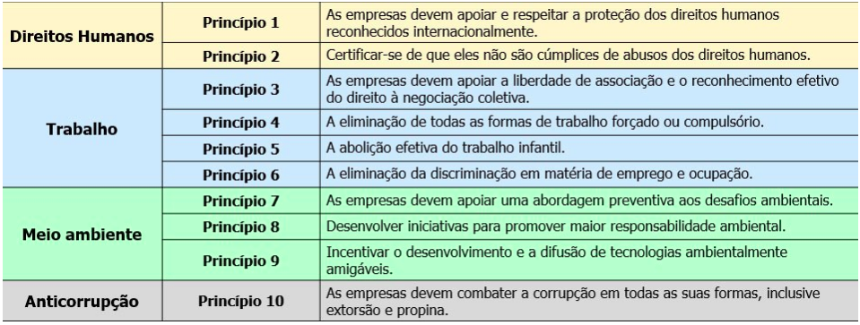

# Aula 10 - Governança da TI Verde 

## TI Verde 

TI Verde ou Green IT é uma abordagem que tem como objetivo a preservação do meio ambiente e a sustentabilidade, considerando o impacto que os resíduos tecnológicos, de fabricação ou uso, possam contribuir para a degradação do meio ambiente. 

A TI Verde trata também da utilização de recursos tecnológicos que consumam menos energia. 
- Otimizar o consumo de energia. 
- Melhorar os custos de gestão operacional. 
- Reduzir a emissão de gás carbônico. 
- Reduzir ou eliminar as fontes de resíduos (energia, refrigeração e materiais). 
 
Existe um ecossistema de TI presente nas organizações: 
- Hardware, software, rede de computadores 
- Estratégia de compras, implementação, operação e descarte 
- Pessoas e cultura organizacional 
- Sistema e rede que se conectam com fornecedores, clientes e parceiros 

Empresas que implementam o conceito de TI Verde normalmente tem preocupações com: 
- Responsabilidade ambiental 
- Mudança climática global 
- Desenvolvimento sustentável 
- Responsabilidade (social) corporativa 
 

## Impactos 

### Utilização dos recursos 

A obsolescência dos equipamentos de TI é um ponto importante, já que ficam ultrapassados tecnologicamente com muita velocidade, considerando que novas tecnologias são implementadas ou descobertas a cada dia. 

Normalmente, os equipamentos de TI duram entre três e cinco anos, e são substituídos por novos. Os equipamentos obsoletos são descartados pelas empresas, produzindo lixo eletrônico. 

Segundo a ONU, o volume de lixo eletrônico em 2016 estava em torno de 40 milhões de toneladas métricas, com crescimento previsto até 2021 de 17%, considerando que nem tudo que é descartado é reciclado. 
 

### Consumo de energia elétrica 

Segundo o Greenpeace, os datacenters consomem cerca de 1,5 a 2% da eletricidade global. Nesse contexto, é importante considerar que as máquinas servidoras dessas organizações (correio eletrônico, servidores Web, servidores de aplicação etc.) ficam ligadas 24 horas por dia e 7 dias por semana. Como os equipamentos de TI precisam funcionar em ambiente refrigerado, nem toda a energia elétrica usada pela TI é referente apenas aos seus equipamentos. 
 

### Ciclo de vida dos equipamentos 

No processo de fabricação de equipamentos de Tecnologia da Informação, são consumidos muitos recursos e energia elétrica. É importante observarmos também que o consumo de energia elétrica não é só necessário para a fabricação, mas para a utilização da TI nas organizações. Em um escritório, por exemplo, a utilização de equipamentos de TI como desktop, notebooks, roteadores e impressoras, representam parte do consumo de energia da organização. 
 

## Lixo eletrônico 

É qualquer dispositivo eletrônico ou elétrico que esteja quebrado, obsoleto ou, de alguma forma, não tenha mais serventia para a organização. Uma das preocupões atuais é que o seu crescimento poderá causar imensos estoques de lixo e impacto negativo dos resíduos eletrônicos na saúde humana. Esse tipo de resíduo é extremamente perigoso, já que é composto por substâncias tôxicas e nocivas para o ambiente. 

Uma das soluções para reduzir o perigo são as leis e tratados internacionais que obrigam as fábricas a evitar a utilização de materiais perigosos e substituir esses materias por produtos biodegradáveis, recicláveis ou reutilizáveis. 

## Pacto global 

O Pacto Global  foi uma iniciativa voluntária, lançado em 2000, com sede em Nova York e com o objetivo fornecer diretrizes para a promoção do crescimento sustentável e da cidadania. Podem participar empresas de pequeno, médio e grande porte, públicas ou privadas. Ele apresenta dez princípios: 

## Regulamentações verdes - um pouco de história 

1992: Governo dos EUA lançou o programa “Energy Star”. 

1997: Protocolo de Quioto, redução de emissão de carbono. 

2003: União Europeia adotou a diretiva RoHS (Restriction of Hazardous Substances) 

2005: Colocado em prática o selo EPEAT (Eletronic Products Environmental Assessment) pelo conselho de Eletrônicos verdes. 

## Governança de TI Verde 

**Ciclo de vida do Equipamento de TIC**: Este pilar cobre todo o ciclo de vida de um equipamento de TIC, desde sua aquisição até sua eliminação ou reciclagem de forma ambientalmente responsável. 

**Usuário Final**: Este pilar é especialmente importante pois por estar localizado fora da área de TI tem um grande efeito sobre as atitudes e comportamentos ecológicos na força de trabalho da organização. 

**Organização e Datacenter (Computação Corporativa)**: É aquela parte da função de TIC controlada diretamente pelo departamento de TI, normalmente composta pelos seguintes itens: Datacenter, Rede, Desenvolvimento software e Terceirização. 

**Emissão de Carbono**: Este pilar tata dos reais benefícios potenciais das TIC Verdes  como uma tecnologia capacitadora para ajudar a organização a reduzir suas emissões de carbono. 

### Ciclo de vida do equipamento de TIC 

Este pilar definido pelo Green ICT Framework (2010) cobre todo o ciclo de vida de um equipamento de TIC, desde sua aquisição até sua eliminação ou reciclagem de forma ambientalmente responsável. 

Segundo o Green ICT, todo equipamento possui um ciclo de vida. 

Desse modo, este pilar define o ciclo de vida de um equipamento, que compreende o intervalo de tempo desde a aquisição por parte da organização até a eliminação ou reciclagem de forma sustentável. 

 

É importante considerarmos que o descarte de um equipamento nem sempre significa que ele foi destruído. O equipamento pode ser vendido, dado ou doado a outra pessoa ou organização onde terá um novo ciclo de vida. 

Segundo o Green IT Framework (2010), dentro do ciclo de vida de um equipamento devemos considerar três fases importantes: 
- Aquisição 
- Reciclagem e reutilização 
- Descarte 

 
### Usuário final 

Este é o pilar proposto pelo Green ICT Framework que se encontra fora da área de TI, porém fundamental, por cobrir toda a organização e ter um grande efeito sobre as atitudes e comportamentos ecológicos na força de trabalho da organização. 

Como existe uma grande variedade de tecnologias que podem auxiliar na redução do consumo de energia e liberação de CO2 na organização, foi dividido em quatro subáreas. 

1) Estação de trabalho 

Em empresas com um grande número de funcionários, o elevado número de estações de trabalho pode afetar o consumo de energia da organização se não for adotada uma política de gerenciamento de energia, como o desligamento do equipamento quando não tiver em uso. 

No processo de aquisição ou aluguel, a empresa deve preferir a adoção de equipamentos com o selo Energy Star ou a substituição desses equipamentos pela utilização de clientes magros (thin client). 

2) Computação móvel 

Com o avanço das tecnologias e da mobilidade, muitos usuários estão fazendo seus trabalhos fora das estações de trabalho e utilizando outros dispositivos, como netbooks, smartphones e PDAs (personal digital assistants) para acessar a organização. Uma opção para a redução de energia e de recursos é a avaliação pela organização da utilização da computação em nuvem. 

3) Computação departamental 

As organizações devem ter uma atenção especial quanto à existência de equipamentos de TI (servidores, dispositivos de armazenamento e periféricos) em outros departamentos e longe do controle do departamento de TIC. 

Nesse caso, existe a necessidade de criação de políticas e ações para o controle do uso ineficiente de energia e de recursos desses equipamentos. 

4) Impressão e insumos 

Atualmente, a impressão é um dos maiores consumidores de recursos na área de TI, seja energia, papel, ou toner ou tinta. Por ficarem ociosas, ou mesmo ligadas desnecessariamente, são consumidas quantidades significativas de energia que acabam impactando de forma global na organização. 

Quanto à utilização do papel ou da tinta existe um efeito significativo no meio ambiente tanto na produção do insumo como no seu descarte. 
 

### Computação corporativa 

Segundo o Green ICT Framework (2010), este é um pilar controlado diretamente pelo departamento de TI e, normalmente, composto por itens de Tecnologia da Informação que são utilizados corporativamente por todos da organização. 

**Datacenter** 

O Datacenter de uma organização é um local especializado que concentra os equipamentos mais importantes da organização, no caso servidores/mainframes e dispositivos de armazenamento. 

Por serem equipamentos especializados e, normalmente, de grande capacidade são grandes consumidores de energia. À medida que o número de servidores ou processadores aumentam, consequentemente, o consumo de energia também aumenta. 

Uma prática que tem se tornado comum como forma de mitigar o aumento crescente da utilização de energia é a virtualização de servidores e de armazenamento. A virtualização reduz o número de servidores físicos e otimiza a sua utilização. Como consequência ocorre a redução do consumo de energia. 

É importante considerar que o consumo de energia nos Datacenters vem aumentando mesmo com a utilização da virtualização, considerando que existe também um aumento de demanda por parte das organizações e que os dispositivos de TI para essas demandas também estão se tornando mais potentes. 

Para o funcionamento de um Datacenter, existem equipamentos que não são de TI e que podem consumir muito mais energia do que os equipamentos de TI e que abrangem os seguintes aspectos: 
- Fonte de energia 
- Refrigeração e iluminação 
- Instalação predial 

 
### Resíduos digitais 

Os resíduos digitais que consomem espaço de armazenamento são divididos nas seguintes categorias: 

**DADOS INVOLUNTÁRIOS**: São dados que foram criados de uma forma involuntária, como por exemplo, um erro de processo ou sistêmico, e, dessa forma não têm serventia. 

**DADOS DEGRADADOS**: São dados que de alguma forma perderam sua qualidade. 

**DADOS INDESEJADOS**: São dados que foram obtidos da forma correta, porém nunca foram úteis para os usuários. 

**DADOS ÚTEIS**: São dados que serviram ou servem para o seu propósito. 

**Redes de computadores** 

De acordo com o Green ICT Framework (2010), atualmente as redes de comunicação desempenham um papel importante nas empresas, já que viabilizam o funcionamento da organização por meio da utilização de aplicativos, sistemas, funções de armazenamento de dados e acesso à internet. Por isso, é crescente nas organizações a utilização das redes locais (LAN), redes de longa distância (WAN) e redes sem fio. 

Na implementação das redes, além do cabeamento estruturado, também utilizamos equipamentos de comunicação tais como, switches, roteadores, modens, firewall e balanceadores de link que, quando não utilizados corretamente, podem aumentar o gasto energético da organização. Por isso, é necessário atenção especial aos projetos executados. 
 

**Terceirização** 

Segundo o Green ICT Framework (2010), atualmente existe a discussão pelas vantagens de terceirizar serviços como forma de diminuir custos, ter um serviço mais especializado em detrimento da execução dos mesmo na própria organização ou por profissionais da organização que muitas vezes não possuem a especialidade necessária para a execução do mesmo. 

Normalmente, essa discussão se concentra nas questões de custo e capacidade, porém atualmente foi agregada a questão da sustentabilidade que adicionou uma nova dimensão ao debate sobre terceirização de TIC. 

Muitas empresas que oferecem serviço estão destacando suas credenciais ecológicas como uma nova forma de auxiliar as organizações na implementação da TI verde e agregar valor ao negócio. 

**Arquitetura de software** 

Dependendo da arquitetura de software escolhida pela organização, ela poderá ter um efeito significativo na quantidade ou tipo de hardware usado e consequentemente no consumo de energia desses equipamentos. 

Desse modo, será essencial que a organização planeje corretamente a sua necessidade de negócio e a arquitetura de software necessária, de forma a não aumentar os custos energéticos desnecessariamente. 
 

### Emissão de carbono 

Esse último pilar definido pelo Green ICT Framework (2010) trata da participação da área de TI na emissão de carbono no mundo. 

Estima-se que essa emissão esteja em torno de 2% do valor total e ocorre principalmente pelo uso de eletricidade para operar o hardware necessário para a execução dos serviços de TI. 

O foco é tratar os reais benefícios da implementação da TIC Verde nas organizações e como a utilização da TIC poderá auxiliar a organização e a comunidade em geral a reduzir suas próprias emissões de CO2. Assim, esse pilar trata de diferentes visões: 
- Governança e Compliance; 
- Teletrabalho e Colaboração; 
- Gerenciamento de processo de negócio; 
- Aplicações de negócio; 
- Gerenciamento da emissão de CO2. 

Segundo o Green ICT Framework (2010), na visão de Governança e Compliance, ocorreu um aumento da conscientização da necessidade de um comportamento verde e sustentável. Como consequência, aumentou o perfil da sustentabilidade nas organizações que estão tentando ampliar suas credenciais ecológicas. 

Outra visão apresentada pelo Green ICT Framework (2010) trata sobre o tema de Teletrabalho e Colaboração, bem discutido nas organizações, atualmente, e que abrange uma gama de tecnologias e práticas relacionadas ao teletrabalho, teleconferência, videoconferência e telepresença (uma forma de videoconferência de alta resolução) que podem auxiliar na redução do carbono. Essa redução de carbono está principalmente relacionada à redução da necessidade de viagens pessoais — se as pessoas não tiverem que dirigir um carro ou pegar um avião para fazer seu trabalho, elas estarão reduzindo a liberação de CO2. 

**Gerenciamento de processo de negócio** 

Segundo o Green ICT Framework (2010), o Business Process Management (BPM) é a disciplina que pode auxiliar as organizações no gerenciamento de processos de negócio. O objetivo desse gerenciamento é conhecer a forma como uma organização ou um indivíduo faz suas atividades, tornando-as mais eficientes, com menos etapas ou efeitos secundários. 

Nesse contexto, o BPM refere-se ao processo geral de gerenciamento e à melhoria dos processos de negócios, e a TI tem um papel importante a desempenhar nessa melhoria. Ela fornece ferramentas para modelar os processos e tecnologias de ativação para sua execução. Ao otimizar seus processos de negócios e, consequentemente, melhorando sua eficiência, as organizações podem contribuir para a redução da emissão de carbono. 

**Aplicações de negócios e Gestão de emissão de CO2** 

O Green ICT Framework (2010) apresenta e discute a importância das organizações utilizarem aplicativos de negócios, como: 

**SFMI**: Sistema de Informações de Gerenciamento Financeiro 

**ERP**: Sistema de Planejamento de Recursos Empresariais 

**SCM**: Sistema de Gerenciamento da Cadeia de Suprimentos 

**CRM**: Sistema de Gerenciamento de Relacionamento com o Cliente 

O objetivo na adoção de tais sistemas é agilizar os processos de trabalho e de negócio da organização, reduzir custos, obter vantagem competitiva e, consequentemente, contribuir com a TI verde. 

Outra visão apresentada pelo Framework é a Gestão da emissão de CO2 que trata da emissão de carbono da organização como um todo. 
 

## Atividades de TI Verde 

O Green ICT Framework apresenta cinco componentes horizontais, ou ações que descrevem abordagens para os quatros pilares apresentados anteriormente: 

**Atitude**: Trata da atitude da organização em relação à TI Verde. Descreve como a organização pensa e o seu desejo de mudar demonstrado por meio das ações em TI verde implementadas, o envolvimento da Alta direção e da medição da eficácia destas ações. 

**Prática**: Envolve a alteração de hábitos e mentalidades da organização por meio da implementação de novos hábitos sustentáveis e em conformidade com as práticas verdes. Especificamente, refere-se às técnicas e aos comportamentos que os indivíduos e organizações podem adotar e que ajudam diretamente na implementação da TI Verde. 

**Tecnologia**: Considera que a TI verde não é só tecnologia, é apenas parte do processo, que envolve também conscientização, mudança de comportamento e atitude. 
 
**Políticas** 

Segundo o Green ICT Framework (2010), a organização deve estabelecer uma política de TI Verde e, como qualquer política, deve, necessariamente, seguir o ciclo do PDCA e: 
- Ser estabelecida; 
- Ser comunicada; 
- Ser medida quanto à eficácia; 
- Ser melhorada. 

Desse modo, a organização deverá estabelecer uma política holística, coerente e adequadamente gerenciada e monitorada. 

**Métricas** 

Como forma de garantir que os projetos de TI verde sejam bem-sucedidos ao longo do tempo, a organização deve escolher ferramentas adequadas para medir, monitorar, gerenciar e mitigar o consumo de energia e as emissões de carbono, tanto dentro como fora do departamento de TIC. 

Para que as organizações possam compreender seu nível de capacidade em TI Verde, o Framework do Green ICT (2010), desenvolveu, a partir do modelo do CMM criado pela Carnegie Mellon University, um modelo de maturidade em cinco níveis, que deve ser aplicado em cada um dos cinco aspectos apresentados pelo framework de TI verde. 
 
**0 - Não implementado**: A organização não possui consciência em TI verde. 

**1 – Inicial**: A organização já possui alguma consciência, mas ainda não implementou nenhuma ação 

**2 - Repetitível**: A organização implementou ações de forma ad hoc, mas não possui estratégia definida. 

**3 – Definido**: Programas formais foram definidos, porém a implementação ainda é imatura. 

**4 – Gerenciado**: Implementação metódica, com medição e gerenciamento. 

**5 – Otimizado**: Todas as atividades são monitoradas e gerenciadas. Melhoria contínua. Melhores prática. 

A responsabilidade ambiental preocupa-se com o bem-estar do ambiente e com a saúde, o equilíbrio e a diversidade de recursos humanos e naturais. 

Podemos definir o conceito de lixo eletrônico, como qualquer dispositivo eletrônico ou elétrico que esteja quebrado, obsoleto ou de alguma forma não tenha mais serventia para a organização. Uma das preocupações atuais é que o seu crescimento poderá gerar imensos estoque de lixo e o impacto dos resíduos eletrônicos na saúde humana, considerando que este tipo de resíduo e extremamente perigoso já que são compostos por substâncias tóxicas e nocivas para o ambiente. 

Para que organização possa transformar suas aquisições em aquisição verde é importante considerar e incluir em seu processo formal de aquisição as orientações da Agência de Proteção Ambiental (EPA - Environmental Protection Agency, https://www.epa.gov/ ) sobre o assunto. 

O rótulo Energy Star foi criado para contribuir na redução dos gases do efeito estufa e outros poluentes causados pela energia ineficiente. Os equipamentos que possuem o selo gastam bem menos energia sem sacrificar o desempenho do produto suas características e conforto.