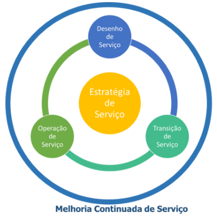
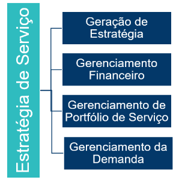
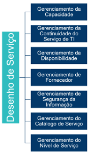
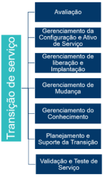
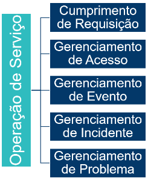
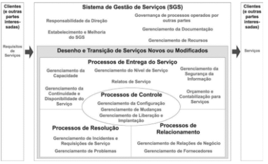
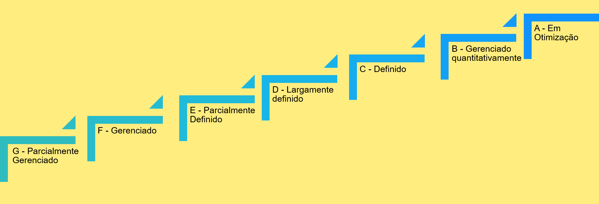

# Aula 9 - Governanças de serviços 

## ITIL 

Foi desenvolvido com o objetivo de auxiliar as empresas britânicas, com uma abordagem de melhores práticas para gerenciar a utilização eficiente e responsável dos recursos de TI. 

**O principal objetivo do ITIL é ser uma fonte de melhores práticas para as organizações no gerenciamento de serviço.** 

O ITL oferece em seu núcleo cinco publicações que descrevem as melhores práticas de gerenciamento de serviço em cada um dos estágios do ciclo de vida de um serviço, e possui 26 processos que estão agrupados de acordo com o estágio do ciclo de vida de serviço (volumes) a que pertencem. 

### Estratégia de serviço 

Esta fase orienta as organizações sobre o desenho, desenvolvimento e implementação das políticas e dos processos de gerenciamento de serviço como ativos estratégicos ao longo do ciclo de vida de serviço.

 

### Desenho de serviço 

Esta fase orienta as organizações quanto ao desenho e desenvolvimento de serviços. É neste estágio que são detalhados os aspectos do gerenciamento do catálogo de serviços, do nível de serviço, da capacidade da disponibilidade, da segurança da informação, da continuidade, dos fornecedores. Também são identificadas mudanças e melhorias necessárias para manter ou agregar valor aos clientes ao longo do ciclo de vida do serviço. 

 

### Transição de serviço 

Esta fase orienta as organizações sobre como efetivar a transição de serviços modificados ou novos para operações implementadas, detalhando os processos de planejamento e suporte à transição, gerenciamento de mudanças, gerenciamento da configuração e dos ativos de serviço, gerenciamento de liberação e da distribuição, teste e validação de serviço, avaliação e gerenciamento do conhecimento. 

### Operação de serviço 

Esta fase do ciclo de vida do gerenciamento de serviços é responsável pelas atividades do dia a dia. Ela fornece orientação sobre como garantir a entrega e o suporte a serviços de forma eficiente e eficaz, detalhando os processos de gerenciamento de eventos, incidentes, problemas, acesso e de execução de requisições. 

### Melhoria de serviço continuada 

Esta fase orienta sobre como fazer melhorias incrementais e de larga escala na qualidade dos serviços, nas metas de eficiência operacional, na continuidade dos serviços com base no modelo PDCA. 

 

## ISO 20000 

O objetivo da norma ISO 20000 é definir um padrão para o gerenciamento de serviços de TI, por meio do estabelecimento de conceitos e de um processo de gestão de forma a permitir que provedores de serviços de TI independentemente do tamanho, natureza e tipo compreendam como poderão planejar, executar, verificar e melhorar continuamente a qualidade dos serviços entregues, em conformidade com os requisitos estabelecidos junto ao negócio e a seus clientes. 

A norma está estruturada em cinco partes que tratam especificamente de Requisitos do Sistema de Gestão de serviços, Código de prática, Diretrizes de escopo, Modelo de referência de processos e Exemplo de Plano de implementação. 

### Parte 1 – Requisitos do sistema de gestão de serviços  

Apresenta a especificação formal da normal e os requisitos para o gerenciamento de serviços, em conformidade com os requisitos de negócio dentro de um nível de qualidade aceitável.  

### Parte 2 - Código de prática  

Apresenta as melhores práticas baseadas em experiências de mercado em relação aos requisitos definidos na Parte 1. 
 

### Parte 3 - Diretrizes de escopo 

Contém orientações para definição do escopo e da aplicabilidade da norma aos diferentes tipos de organizações de serviços de TI. 

### Parte 4 – Modelo de referência de processos 

Apresenta um modelo para implementação de um sistema de gestão de serviço. 

### Parte 5 – Exemplo de plano de implementação 

Exemplificação do plano. 

## Sistema de Gestão de Serviço (SGS)  

Esse sistema é a espinha dorsal da norma e inclui todas as políticas, os objetivos, os planos, os processos, os documentos e os recursos de gerenciamento de serviços requeridos para o desenho, a transição, a entrega e a melhoria dos serviços e para atender aos requisitos preconizados pela norma. Ele dirige e controla as atividades de gerenciamento de serviços do provedor. 

## Requisitos de um sistema de gestão de serviços 

A norma ISO 20000 apresenta os requisitos gerais para a implementação de um sistema de gestão de serviço: 
- Responsabilidade da Direção; 
- Governança de processos operados por outras partes; 
- Gerenciamento da documentação; 
- Gerenciamento de recursos; 
- Estabelecimento e melhoria do SGS (PDCA); 
- Desenho e transição de serviços novos ou modificados; 
  - Processos de entrega de serviço; 
  - Gerenciamento da continuidade e disponibilidade do serviço; 
  - Orçamento e contabilização para serviços; 
  - Gerenciamento da capacidade; 
  - Gerenciamento da segurança da informação. 
- Processos de relacionamento; 
- Processos de resolução; 
  - Gerenciamento de incidentes e requisições de serviço; 
  - Gerenciamento de problemas. 
- Processos de controle. 
  - Gerenciamento da configuração; 
  - Gerenciamento de mudanças; 
  - Gerenciamento de liberação e implantação. 

## CMMI-SVC 

**A implementação de gestão de serviço, o CMMI-SVC, tem como objetivo fornecer diretrizes para entrega de serviços dentro das organizações e para clientes externos.**  

O CMMI-SVC abrange as atividades necessárias para estabelecer, fornecer e gerenciar serviços, que, conforme definido no contexto do CMMI, é um produto intangível e não armazenável. O modelo apresenta a mesma estrutura de maturidade e capacidade do modelo CMMI-DEV na representação por estágio. 

A **representação por estágios** permite avaliação da maturidade do processo em cinco níveis: 

Essa representação descreve os objetivos que devem ser alcançados em cada nível de maturidade. Um nível de maturidade pode ser considerado um degrau evolucionário para o nível seguinte. 

### Nível 2 – Gerenciado 

Neste nível, a organização do serviço é gerenciado e entregue conforme o planejado e atende aos requisitos do cliente. O provedor tem a capacidade de medir o desempenho do serviço. 
- Observe o processo desse nível: 
- Gestão de Configuração; 
- Medição e Análise; 
- Garantia da qualidade do Processo e Produto; 
- Gestão de Requisitos; 
- Gestão de acordo com o Fornecedor; 
- Entrega de Serviço; 
- Controle e monitoração do trabalho; 
- Planejamento do trabalho. 

### Nível 3 – Definido 

Neste nível, o provedor de serviços utiliza processos definidos e os serviços apresentam garantias de continuidade e disponibilidade. Os processos são melhorados continuadamente. 
Observe o processo desse nível: 
- Gestão de disponibilidade (CAM); 
- Análise e resolução de decisão (DAR); 
- Resolução de prevenção de incidente (IRP); 
- Gestão integrada do trabalho (IWM); 
- Definição do processo organizacional (OPD); 
- Foco no processo organizacional (OPF); 
- Treinamento organizacional (OT); 
- Gestão de risco (RSKM); 
- Continuidade de negócio (SCON); 
- Desenvolvimento do sistema de serviços (SSD); 
- Transição do sistema do Serviço (STSM); 
- Gestão estratégica do serviço (STSM). 
 

### Nível 4 - Gerenciado quantitativamente 

Neste nível, os processos são gerenciados a partir do seu desempenho. A capacidade do processo é compreendida. 
Observe o processo desse nível: 
- Desempenho organizacional (OPP); 
- Gestão quantitativa do trabalho (QWM). 
 

### Nível 5 - Otimizado 

Neste nível, os processos são melhorados continuamente com o entendimento dos objetivos do negócio e as necessidades de desempenho e por meio de inovações. 

Observe o processo desse nível: 
- Gestão do desempenho organizacional (OPM); 
- Análise e resolução de causas (CAR). 

## Modelo MPS-SV 

Tem como objetivo melhorar a capacidade de serviços na indústria de TIC. Também existem níveis de maturidade que são uma combinação entre **processos** e **sua capacidade**. 

**Capacidade do processo**: Trata de como um processo atinge os objetivos de negócio, atuais e futuros e permite avaliar e atribuir graus de aderência ao modelo de referência na definição e execução dos processos em uma organização. 

**Níveis de maturidade**: Tratam de como a organização se encontra na evolução e melhoria desses processos. 
 

### Níveis de maturidade 

O modelo apresenta sete níveis de maturidade. Cada nível estabelece um patamar de evolução do processo e representa um estágio de melhoria para a implementação de processos na organização. A cada nível está associado um conjunto de processos e atributos de processo. 

### Capacidade de processos 

A capacidade de um processo expressa o grau de refinamento e institucionalização com que o processo é executado na organização. 

À medida que a organização evolui nos níveis e na maturidade apresentados pelo modelo MPS-SV, um maior nível de capacidade deve ser atingido. 

## Processos do modelo MPS-SV 

### Gerência de Incidentes e de Solicitações de Serviço – GIS 

O objetivo do processo é assegurar que as solicitações de serviços ou a ocorrência de um incidente sejam tratados dentro dos limites dos acordos de nível de serviços combinados (ANS/SLA). 

### Gerência da Operação do Serviço – GOS 

O objetivo do processo é a implementação dos planos que definem atividades, recursos e responsabilidades da operação dos serviços, além do fornecimento de informações sobre o andamento desses serviços, de forma a permitir o alinhamento em caso de desvio quanto ao desempenho esperado. 

### Aquisição 

O objetivo do processo é gerenciar as atividades que envolvem o processo de aquisição de serviços e produtos alinhadas com as necessidades e requisitos de negócio. 

### Gerência de Configuração 

O propósito do processo é estabelecer e manter a integridade de todos os produtos de trabalho de um processo ou operação do serviço e disponibilizá-los a todos os envolvidos. 

### Garantia da Qualidade 

O propósito do processo é assegurar que os produtos de trabalho e a execução dos processos estejam em conformidade com os planos, procedimentos e padrões estabelecidos. 

### Gerência de Problemas 

O objetivo é mitigar a ocorrência de interrupções do serviço por meio da investigação da causa raiz de um ou mais incidentes que impactam na operação do serviço ou ainda no cumprimento dos acordos de nível de serviço estabelecidos. 
 

### Gerência de Portfólio de Operação de Serviços 

O propósito do processo é iniciar e manter operações de serviço que sejam necessários, suficientes e sustentáveis, de forma a atender os objetivos de negócio da organização. 

### Medição 

O propósito do processo é definir os objetivos da medição, identificar, documentar e manter um conjunto adequado de medidas, definir os procedimentos para coleta, armazenamento e análise das medidas, assim como, coletar, armazenar, analisar e relatar os dados relativos às operações de serviço e aos processos implementados na organização, de forma a apoiar os objetivos de negócio da organização. 
 

### Avaliação e Melhoria do Processo Organizacional 

O propósito do processo é determinar o quanto os processos padrão da organização contribuem para alcançar os objetivos de negócio da organização e para apoiar a organização a planejar, definir e implantar melhorias contínuas nos processos com base no entendimento de seus pontos fortes e fracos. 
 

### Definição do Processo Organizacional 

O propósito do processo é estabelecer e manter um conjunto de ativos de processo organizacional e padrões do ambiente de trabalho usáveis e aplicáveis às necessidades de negócio da organização. 

### Gerência de Recursos Humanos 

O propósito do processo é prover a organização e as operações de serviços com os recursos humanos necessários e manter suas competências adequadas às necessidades do negócio. 

### Desenvolvimento do Sistema de Serviços 

O objetivo do processo é analisar, projetar, desenvolver, integrar, verificar e validar o sistema de serviços e todos os seus componentes de forma a satisfazer acordos existentes ou previstos. 
 

### Orçamento e Contabilização de Serviços 

O objetivo do processo é fazer a gestão do orçamento e a contabilização dos serviços fornecidos. 
 

### Gerência da Capacidade 

O objetivo é garantir que o provedor de serviços tenha capacidade para atender os requisitos atuais e futuros acordados. 

### Gerência da Continuidade e Disponibilidade dos Serviços 
 
O objetivo do processo é assegurar que acordos de níveis de serviços sejam cumpridos conforme acordado. 

### Gerência de Decisões 

O objetivo da é analisar possíveis decisões críticas através de um processo formal e com critérios estabelecidos. 

### Gerência de Liberação 

O objetivo do processo é implantar de forma controlada as liberações de serviços e componentes de serviços em um ambiente de produção. 

 
### Gerência de Riscos 

O objetivo do processo é identificar, analisar, tratar, monitorar e reduzir continuamente os riscos em nível organizacional e da operação do serviço. 
 

### Gerência da Segurança da Informação 

O objetivo do processo é gerenciar a segurança da informação durante todo o ciclo de vida da operação do serviço e de acordo com os níveis de segurança previamente acordado. 

### Relatos de Serviços 

O objetivo do processo é a produção e disponibilização de informações periódicas sobre os resultados alcançados nos processos relacionados às operações dos serviços de forma a apoiar a tomada de decisão.  