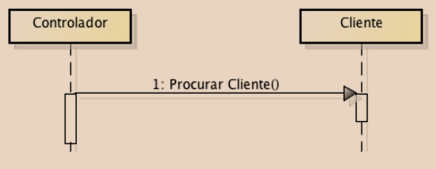
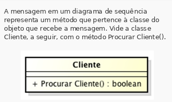

# Aula 5 - Diagrama de interação, com ênfase em sequência

**Diagramas de casos de uso:** apresentam funcionalidades.
**Diagramas de classes:** mostra a estrutura e relacionamento entre as classes necessárias.
**Diagramas de interação:** mostram como as classes (objetos) trocam mensagens (interagem para oferecer uma funcionalidade).

**Mensagem:** representa a solicitação que um objeto requisitante faz a um objeto receptor para que este execute uma das operações definidas em sua classe.

## Tipos de diagramas de interação

Mostram como as classes colaboram em determinados comportamentos.
Ambos os tipos visam estabelecer a integração entre o diagrama de classes e o diagrama de especificações textuais dos casos de uso.
Identificação de novos métodos para as classes e ainda a ajuda na identificação de qual classe deve conter um determinado método. 

- **Diagrama de sequência**
- **Diagrama de comunicação**
 
<table border="1">
    <tr>
        <th>Diagrama de Sequência</th>
        <th>Diagrama de Comunicação (Colaboração)</th>
    </tr>
    <tr>
        <td colspan="2" align="center">**VANTAGENS**</td>
    </tr>
    <tr>
        <td>há como saber a ordem de envio das mensagens, com bastante clareza</td>
        <td>modelos mais legíveis (comparando com o de sequência)</td>
    </tr>
    <tr>
        <td>é oportuno, pois foca na temporalidade da interação, que é relevante</td>
        <td>foca nas mensagens enviadas entre objetos que estão relacionados</td>
    </tr>
    <tr>
        <td colspan="2" align="center">**QUANDO USAR**</td>
    </tr>
    <tr>
        <td>quando o foco for a sequência das mensagens no **decorrer do tempo**</td>
        <td>quando o foco forem as mensagens enviadas entre os objetos que estão relacionados</td>
    </tr>
    <tr>
        <td colspan="2" align="center">**PONTOS FORTES**</td>
    </tr>
    <tr>
        <td>mostra com clareza a sequência temporal das mensagens</td>
        <td>economia de espaço ao modelar</td>
    </tr>
    <tr>
        <td>amplo conjunto de opções de notação</td>
        <td>flexibilidade ao adicionar novos objetos, em qualquer direção</td>
    </tr>
    <tr>
        <td colspan="2" align="center">**PONTOS FRACOS**</td>
    </tr>
    <tr>
        <td>a cada novo objeto, o diagrama cresce pra direita, consumindo espaço na horizontal</td>
        <td>difícil perceber a sequência das mensagens, necessário numerá-las sequencialmente</td>
    </tr>
    <tr>
        <td>muitos objetos = difícil desenho e leitura</td>
        <td>menos opções de notação</td>
    </tr>
    
</table>

## Tripé da análise

1. Diagrama de casos de uso e especificações de casos de uso;
2. Diagrama de classes;
3. Diagrama de sequência ou diagra

**Diagrama de sequência**

O foco aqui é a sequência da troca de mensagens. 

[Exemplo de diagrama de sequencia (pdf)](../../media/modelagem_de_sistemas/aula05/pdf/exemplo_sequencia.pdf)