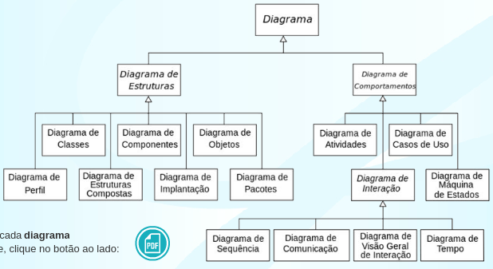
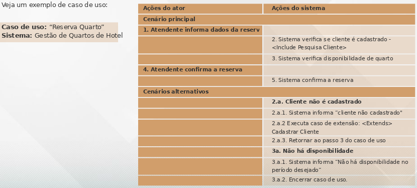

# Aula 1 - ORIENTAÇÃO A OBJETOS E UML

A modelagem de sistemas consiste no desenvolvimento de modelos (**diagramas**) que representem o mundo real, sob a perspectiva do desenvolvimento de sistemas e está intimamente relacionada a dois fatores: ao **paradigma de desenvolvimento e ao processo de desenvolvimento em uso.**

**Paradigma** é uma forma de abordar um problema.

No **paradigma orientado a objetos**, o enfoque está na **identificação de classes e seus respectivos objetos** que interagem para a solução do problema.

Dentro da **perspectiva do desenvolvimento orientado a objetos**, surge a UML (Unified Modelling Language), uma linguagem unificada de modelagem, que permite aos desenvolvedores construírem diagramas sob diferentes perspectivas.

O desenvolvimento de sistemas é um processo intelectual e progressivo, em que os profissionais envolvidos adquirem mais conhecimento do sistema à medida que avançam no entendimento da realidade em que o sistema está inserido.

No início do processo, é preciso conversar com os profissionais envolvidos no negócio em questão para **compreender a realidade e o funcionamento do mesmo.**

Para representar a realidade e entender o que se passa no contexto do sistema a ser construído, precisamos **traduzir** a realidade em **modelos.**

**Modelos** = Nada mais são que **diagramas gráficos** que representam a realidade e ajudam os desenvolvedores  a compreendê-la. Portanto, modelar um sistema consiste em **criar um conjunto de modelos sob a forma de diagramas**, que representam a estrutura e o comportamento de um sistema.

**Paradigma imperativo ou estruturado**, caracterizado pelo uso das técnicas de Análise Estruturada e Análise Essencial, que foram eficientes para sistemas de **pequeno porte.**

**Paradigma Orientado a Objetos**, também chamado paradigma OO, para sistemas **mais complexos e robustos.**

Na OO, tarefa principal passa a ser a **identificação dos objetos do mundo real** envolvidos no contexto do sistema e a relação entre eles. Ao identificar os objetos, são identificados também os **dados (atributos) e as funcionalidades (funções)** inerentes àquele objeto.

OBJETO = DADOS + FUNÇÕES

Na medida em que são identificados todos os objetos pertinentes a um sistema, já teremos os **dados e os procedimentos** relacionados.

Um modelo OO tem com entidade fundamental o **Objeto**, que **recebe e envia mensagens**, executa procedimentos e possui um estado que, por proteção, apenas ele próprio pode modificar. Nesse processo, problemas são resolvidos, por meio de objetos, que enviam mensagens uns aos outros.

## Elementos básicos da OO:

1. **Objeto:** principal elemento do modelo. Representam as “coisas” a serem modeladas do mundo real. Cada objeto possui os dados inerentes a ele e possui as operações que ele executa.
2. **Mensagens:** Quando um objeto deseja que seja executada uma operação de responsabilidade de outro objeto, ele manda uma mensagem a esse objeto informando o que ele deseja que seja feito. A operação desejada será implementada por meio de um método da classe que recebe a mensagem.
3. **Atributos:** dados que caracterizam o objeto.
4. **Métodos:** procedimento (implementado por uma rotina ou função) que executa uma operação em um objeto, que define parte do seu comportamento.
5. **Classes:** conjunto de objetos com as mesmas características (atributos e métodos).

**“Objeto é uma instância de uma classe”, isto é, a classe é o molde e o objeto, a “coisa real”.**

## Pilares da OO:

1. **Encapsulamento:** esconder; o objeto esconde seus dados (atributos) do acesso indevido de outros objetos.
2. **Herança:** Mecanismo para derivar novas classes a partir da definição de classes existentes através de um processo de refinamento.
3. **Polimorfismo:** muitas formas; a partir do momento em que uma classe herda **atributos e métodos** de uma (herança **simples**) ou mais (herança **múltipla**) classes base, ela tem o poder de **alterar o comportamento de cada um desses procedimentos (métodos).**
4. **Visibilidade:** uma classe pode visualizar da outra. Como princípio, devemos garantir o encapsulamento, ou seja, os atributos devem ser privados (acessíveis apenas por métodos da própria classe) e determinados métodos públicos (acessíveis por todas as classes), e acessar esses dados.

O uso de técnicas orientadas a objetos facilita o controle da complexidade uma vez que promove uma melhor estruturação de seus componentes e também permite que componentes já usados e validados possam ser reaproveitados.

As hierarquias de classes (herança) são componentes portáveis entre aplicações.

Proporciona modularidade trazendo os seguintes benefícios:

- Reusabilidade: softwares podem ser escritos com base em componentes já existentes;
- Extensibilidade: novos componentes de software podem ser desenvolvidos a partir de outros, já existentes, sem afetar o comportamento do componente de origem.

Um sistema desenvolvido com as características do modelo OO tende a ser bem estruturado posto que os objetos são unidades coesas com interfaces simples que escondem as suas implementações.

## Conceitos de Análise e Projeto Orientado a Objeto
Análise de sistemas significa uma investigação dos problemas e dos requisitos de um contexto, em particular, com vistas ao desenvolvimento de um sistema automatizado. A ideia básica é identificar quais seriam as funções que esse sistema precisa ter, de forma a atender eficientemente as necessidades de seus usuários.

**Atividade de análise e projeto:**

- Análise de requisitos (investigação dos requisitos);
- Análise do domínio do problema.

**Análise implica em identificar e descrever os conceitos no domínio do problema.**

**Atividade de análise:** definição dos objetos de software e como eles colaboram para que os requisitos dos usuários sejam plenamente satisfeitos.
**Atividade de projeto:** denota uma solução, voltada a atender aos requisitos, considerando aspectos de tecnologia.

**Análise pode ser traduzida em “faça a coisa certa”, e projeto em “faça certo a coisa”.**

Identificação e modelagem dos objetos do mundo real que afetam o sistema.

**UML** = (Unified Modeling Language) é uma linguagem padrão para **construção de projetos de sistemas**, orientados a objeto, voltada para visualização, especificação, construção e documentação de artefatos de um sistema. Independente do método de desenvolvimento utilizado.
**Linguagem de modelagem != linguagem de desenvolvimento**

1. **Visualização:** A modelagem gráfica tende a facilitar a compreensão, permitindo sua interpretação sem ambiguidades.
2. **Especificação:** Permite a construção de modelos precisos, sem ambiguidades e completos. A UML atende a esses quesitos sob o ponto de vista da análise, projeto e implementação.
3. **Construção:** Os diagramas UML podem ser diretamente integrados a várias linguagens de programação tais como Java e C++.
4. **Documentação:** A UML abrange a documentação da arquitetura do sistema e de todos os seus detalhes.

Os diagramas da UML são divididos em 2 grupos: **Diagramas de Estruturas e Diagramas Comportamentais.** No total, eles formam 14 diagramas.

[PDF - Diagramas de UML](../../media/modelagem_de_sistemas/aula01/pdf/diagramas_de_uml.pdf)

**UML como esboço:** desenvolvedores usam a UML como forma de expressar aspectos relevantes de um sistema, esboçando ideias e alternativas do que pretende fazer. Geralmente, são usados desenhos informais, sem ferramentas e cujo objetivo é a discussão de ideias visando à construção de software de forma colaborativa. O modo UML, como esboço, está mais compatível com as metodologias ágeis, que preconizam mais código e menos documentação.

**UML como projeto:** construir um projeto completo para ser codificado por programadores, valendo-se de ferramentas case para melhor entendimento dos modelos pela equipe. O modo UML, como projeto, está mais alinhado com os processos de desenvolvimento mais complexos, como processos iterativos e incrementais, como o PU (processo unificado) implementado através da ferramenta RUP (Rational Unifiec Process) prototipação.

**UML como linguagem de programação:** Onde os desenvolvedores desenham os diagramas que são compilados para o código executável e a UML se torna o código fonte. Exige ferramentas mais sofisticadas. O modo UML, como linguagem de programação, tende a ser mais usado em modelos de desenvolvimento de prototipação.

**Processos iterativos:** são processos onde o ciclo de vida do sistema é dividido em uma série de mini projetos, curtos, preferencialmente de duração fixa (por exemplo, 3 meses), denominados iterações.

Uma ferramenta **case** é um programa que auxilia aos membros da equipe de desenvolvimento no estudo, modelagem e **construção do sistema**, possibilitando que vários diagramas possam ser elaborados em conjunto, representando a estrutura e comportamento do sistema a ser desenvolvido.

# Aula 2 - Uso e modelagem de requisitos

**Requisitos de um sistema: O software precisa ter as funcionalidades adequadas para satisfazer as necessidades de seus usuários.**

A UML (linguagem unificada de modelagem) disponibiliza para esse fim o diagrama de casos de uso, cuja finalidade é mapear as funcionalidades do sistema, evidenciando os atores que com elas interagem.

**Levantamento de requisitos: os requisitos são necessidades dos usuários que os sistemas precisam atender.**

As atividades de levantar e identificar os requisitos são fundamentais para todo o processo de desenvolvimento de sistemas, pois uma vez conhecidas as reais necessidades de seus usuários poderemos desenvolver o sistema adequado.
Em contrapartida, se as necessidades identificadas não forem as reais, o sistema não atenderá ao que seus usuários precisam, e a tendência é que seja descartado.

**Tipos de requisitos:**

- **Funcionais:** representam as funcionalidades necessárias para atender as necessidades dos usuários do sistema.

- **Não funcionais:** Apresentam restrições e qualidades do sistema e suas funcionalidades. Eles representam os atributos e propriedades do sistema. Os requisitos não funcionais podem representar também propriedades de uma função específica.

**Diagrama de casos de uso: tem como objetivo apresentar os requisitos funcionais do sistema.**

Elementos do diagrama de casos de uso:

- Os atores
- Os casos de uso
- Os relacionamentos

**Ator:** algo com comportamento, que interage diretamente com o sistema. Um ator participa (realiza) um ou mais casos de uso do sistema. A representação do ator, no diagrama de casos de uso, é o boneco, chamado de stickman.
Pode representar:

- Papéis internos (Gerente de Compras) ou externos (Cliente e Fornecedor)
- Setores e departamentos da empresa (Contabilidade e Contas a Pagar), bem como funções desempenhadas na empresa (almoxarifado).
- Dispositivos eletrônicos, como por exemplo hardware e servidores, ou dispositivos lógicos, como sistemas.

*Identificando atores:*

- Quais órgãos, empresas ou pessoas farão uso deste sistema de informação?
- Que sistemas ou equipamentos irão se comunicar com o sistema que será desenvolvido?
- Quem deve ser informado de alguma ocorrência no sistema?
- A quem pode interessar os requisitos funcionais do sistema?

**Casos de uso:** um caso de uso é uma descrição narrativa de uma sequência de eventos que ocorre quando um ator usa um sistema para realizar uma tarefa. Os casos de uso representam, através de elipses, as funcionalidades do sistema.
    Ex: Sendo uma funcionalidade, o nome do caso de uso deve ser composto por um verbo no Infinitivo + complemento verbal, como o exemplo acima: “Matricular em Curso”.

*Identificando casos de uso:*

- **Objetivos dos atores:** Estes casos de uso representam os processos da empresa, e algumas perguntas são úteis neste momento:

    - Quais as necessidades e objetivos de cada ator em relação ao sistema?
    - Que informações serão produzidas pelo sistema?
    - O sistema realizará alguma ação que ocorre de forma regular no tempo?
    - Existe um caso de uso para atender cada requisito funcional?

- **Casos de uso que não representam um benefício direto** para os atores, mas são necessários para o funcionamento do sistema. Tais casos de uso englobam manutenção de cadastros e de informações provenientes de outros sistemas.

Cenários: é uma sequência específica de ações que ilustra o comportamento do caso de uso.

Relacionamento ou associações: o diagrama de casos de uso possibilita a existência de relacionamentos entre:

- atores e casos de uso
    - mais comum
    - indicado por uma linha sólida
    - ator interage com o caso de uso
    - **ator realiza o caso de uso**
    - comunicação é bidirecional: ator informa dados ao caso de uso e recebe informações por ele processadas

- atores entre si
    - relacionamento de generalização/especialização
    - representado por uma linha sólida com uma seta na extremidade que aponta para o ator geral
    - ator geral é o “Funcionário” e o ator especialista, o “Gerente”. Este também exerce as atividades de um funcionário, porém como gerente tem tarefas específicas a sua função.

- casos de uso entre si
    - três tipos de relacionamentos:
        - Inclusão (include ou uses);
            - caso de uso principal incorpora explicitamente o comportamento de outro caso de uso (incluído) (PARTE INTEGRANTE DO CASO DE USO PRINCIPAL) 

        - Extensão (extend);
            - usado para descrever cenários opcionais em um caso de uso, uma variação do comportamento normal. 

        - Generalização.
            - um caso de uso é semelhante a outro, mas executa algumas funções a mais.
            - pouco usado 

# Aula 3 - Descrição textual de casos de uso

O diagrama de caso de uso é útil, na medida em que nos fornece uma visão geral das funcionalidades do sistema (conjunto de casos de uso) e dos atores que com elas se relacionam.
É pobre na medida em que não entendemos como a interação ocorre em cada caso de uso.

**O diagrama é um sumário gráfico do conjunto de casos de uso (funcionalidades) de um sistema.**

Se o tempo destinado ao modelo de casos de uso for pouco, concentre-se na especificação ou descrição dos casos de uso e esqueça o diagrama.

## Formatos para especificar casos de uso

- **Resumido:** resumo de um parágrafo, contendo o cenário principal do caso de uso e o cenário de sucesso. Deve utilizar na análise inicial de requisitos para obter uma ideia do assunto e o escopo do caso de uso.
- **Informal:** múltiplos parágrafos que cobrem vários cenários de uso. Deve usar na mesma condição do resumido.
- **Completo:** todos os cenários (principal e alternativos) são descritos em detalhes, com seções adicionais, complementando a especificação com elementos que definem os pré e pós-condições. Deve usar depois que muitos casos tiverem sido descritos em resumo ou informal, geralmente durante a fase de análise de requisitos e de sistemas. Para casos de uso relevantes, tende a ser o mais adequado.

**Dicas para especificações de casos de uso:**

1. Não use detalhes de implementação ou de determinada tecnologia em suas especificações.
2. Procure não associar casos de uso a telas de sistemas.
3. Utilize um formato de especificação que deixa o diálogo mais claro entre ator e caso de uso. O modelo tem duas colunas. Na primeira, descrevemos as ações do ator, e na segunda as ações do sistema.
4. Os casos de uso incluídos (chamados de include) ou estendidos (chamados por extends) também devem ter descrição textual, podendo estar no formato resumido ou informal.
5. Algumas perguntas podem ajudar no detalhamento dos cenários principal e alternativos. Exemplo: Quando tudo ocorre na normalidade (com sucesso), qual o comportamento do sistema?
6. Quando um passo for muito complicado, ele pode vir a ser um novo caso de uso, que se relacionará com o caso original pelo estereótipo include.
7. Faça casos de uso enxutos, pois casos longos podem não ser lidos em sua totalidade.

# Aula 4 - Diagrama de classes

Diagrama de classes = principal diagrama da UML (mais amplamente usado)
Vários níveis de diagramas de classes: são usados no nível de **domínio (conceitual)** e de **projeto.**

**Não se devem representar estruturas de projeto (interfaces, chaves, arquivos, campos etc.).  O foco da análise é o negócio.**

## Modelo conceitual de classes

Usa os elementos mais básicos do diagrama de classes.
Finalidade: representar os objetos (objetos = iguais ao mundo real)

Descreve de **forma gráfica**, todos os **tipos de objeto** que interagem para realizar as **funcionalidades previstas** em um sistema e vários **tipos de relacionamentos estáticos** entre eles.
Propriedades e operações de uma classe e as restrições relacionadas à forma como os objetos se relacionam.

O diagrama de classes **evolui** à medida que o projeto **avança.**

**1º momento:**

- apresenta classes do negócio (entidades)
- chama-se diagrama de classes conceitual
- compatível com as funcionalidades dos casos de uso; mostra a modelagem em classes dos requisitos essenciais do sistema.

**2º momento:**

- novas classes podem ser inseridas no diagrama de classes, como as de **controle** e as de **interface** (ou **fronteira**)
    - Classe de **fronteira** ou **interface:** responsável pela **interação com os atores.**
    - Classes de **controle:** coordenação da **interação entre os objetos**, na realização de um caso de uso. **Cada caso de uso = uma classe de controle.**

**Fase de projeto:** o mesmo diagrama pode ser refinado com a inserção de:

- Multiplicidades e papéis;
- Relacionamento entre as classes;
- Novos métodos (como, por exemplo, get, set e formatações);
- Novos atributos;
- Parâmetros nas chamadas dos métodos;
- Visibilidade dos atributos e métodos;
- Novas classes, chamadas de classes de projeto (como representação de persistência).

**Fase de implementação:** codificação na linguagem

- novas classes podem surgir
- diagrama de classes de implementação

**Conceito de classe:** abstração da realidade, representando algo do mundo real.
Na UML, uma classe é representada por **um compartimento** contendo três partes.

|**classe**    |*nome da classe*|
|:-------|:-------|
|** atributos**|*dados que se retêm da classe*|
|**operações** |*procedimentos que a classe executa, para prestar seu serviço ao sistema = métodos*|

## Classe x Objeto

|**Classe**    |**Objeto**|
|:-------:|:-------:|
|molde de um conjunto de objetos afins (mesmas características)| é uma instância de uma classe|

Ao modelarmos um sistema, estamos em busca de classes, e não de objetos. Poderíamos pensar que o nome da técnica deveria chamar-se “orientação a classes”, e não “orientação a objetos”.

## Elementos do diagrama de classes
1. Classes, com atributos e operações (métodos) de cada uma;
2. Relacionamentos entre as classes;
3. Multiplicidade dos relacionamentos;
4. Visibilidade de atributos e métodos;
5. Nome dos relacionamentos e papel nos relacionamentos;
6. Navegabilidade nos relacionamentos;
7. Notas e comentários.

**1. Classes, com atributos e operações (métodos) de cada uma;**
Cada classe possui os seus atributos e operações específicos

- **Atributo:** conjunto de características (estado) dos objetos da classe. Ele descreve uma **propriedade estrutural da classe,** um **dado relevante** que desejamos armazenar daquela classe. Forma mínima de representar um atributo: **visibilidade Nome: tipo.**

- **Operações:** conjunto de operações (comportamento) que a classe fornece. A operação de uma classe é representada por um método = procedimento ou função da classe. Forma mínima de representar um método: **visibilidade Nome (Lista de parâmetros) : tipo.**

[PDF - Diagramas de UML](../../media/modelagem_de_sistemas/aula04/pdf/atributos_e_operacoes.pdf)

**2. Relacionamentos entre as classes;**
**Associação:** mais simples e comum relacionamento entre as classes. Ocorre entre uma, duas ou mais **classes distintas, não correlatas e independentes.** Ao final do relacionamento, as classes permanecem com suas **vidas próprias.**

- **Associação binária:** mais comum; associação entre duas classes.
- **Autoassociação:** associação unária; ocorre com a mesma classe, uma classe se relaciona com ela própria.
- **Associação exclusiva:** restrição em duas ou mais associações; indica que objetos de uma determinada classe podem participar de no máximo uma das associações, em determinado momento; representada por uma linha tracejada, com a especificação {ou}, denotando que o relacionamento é exclusivo a somente uma das duas classes.

**3. Multiplicidade dos relacionamentos;**
Indica quantos objetos de cada classe podem estar envolvidos no relacionamento.

|**Multiplicidade**|**Significado**|
|:------------------|:---------------|
|1|Exatamente um|
|1..*|Um ou vários (muitos)|
|0..*|Nenhum (zero) ou vários (muitos)|
|*|Muitos. A leitura é nenhum (zero) ou vários (muitos)|
|0..1|Nenhum (zero) ou um|
|m..n|Faixa de valores. Ex: 1 a 3, 4 a 7 ou 6 a 11.|

**Exemplo:**

A classe EQUIPEFUTEBOL tem de 11 a 22 ESTUDANTES -> 11..22 do lado da classe ESTUDANTE;
A classe ESTUDANTE pode participar de NENHUMA e até 8 DISCIPLINAS -> 0..8 do lado da classe DISCIPLINA.

**4. Visibilidade de atributos e métodos;**
Quais classes podem ver (visualizar) o que de outra classe. Cada classe tenha elementos privados e públicos.

- **Público:** pode ser visualizado e usado por qualquer outra classe.
- **Privado:** pode ser usado apenas pela classe proprietária.

A UML permite que se rotule todo atributo e método de uma classe e com um indicador de visibilidade.

|Visibilidade|Comentários|
|:-----------|:----------|
|+Público|qualquer classe pode usar o método ou atributo|
|-Privado|apenas a própria classe pode usar o método ou atributo|
|~Pacote|apenas classes dentro do pacote podem usar o método ou atributo|
|#Protegido|apenas a subclasse (herança) ou classe especializada pode usar o atributo ou método|

- **Encapsulamento:** atributos de uma classe não devem ser usados por outras classes e sim apenas por métodos da própria classe. **Conclusão: visibilidade privada (-);**
- Uma classe deve **prestar serviço** as demais através de seus **métodos.** Pelo menos um dos métodos da classe deve ter **visibilidade pública** para que as demais classes possam usá-lo;
- Em um relacionamento de **generalização/especialização,** todos os **atributos e métodos** que desejar que sejam herdados pela classe especializada (subclasse) devem ter **visibilidade protegida na classe geral** (superclasse).

**5. Nome dos relacionamentos e papel nos relacionamentos;**

- **Classe de associação:** surge do **relacionamento de associação** entre outras duas classes.
- **Generalização/especialização (herança):** relacionamento que implementa o conceito de **herança**, com reaproveitamento de código.
- **Agregação e composição:** tipo **"toda-parte"**, ou seja, existe uma classe que denota um todo e outras que denotam as partes.
- **Dependência:** existe entre duas classes se: **mudanças na definição de uma classe puder demandar mudanças na definição da outra classe.**

**6. Navegabilidade nos relacionamentos;**
Mostra a **direção da navegação.**

**7. Notas e comentários.**
Notas são **comentários** nos diagramas; podem ser **isoladas ou vinculadas**, por linha tracejada, a um dos elementos do diagrama. Podem ainda ser usadas em qualquer diagrama.
exemplo:

[Exercícios](../../media/modelagem_de_sistemas/aula04/pdf/exe.pdf)

[Exercícios - Gabarito](../../media/modelagem_de_sistemas/aula04/pdf/exe_gabarito.pdf)

# Aula 5 - Diagrama de interação, com ênfase em sequência

**Diagramas de casos de uso:** apresentam funcionalidades.
**Diagramas de classes:** mostra a estrutura e relacionamento entre as classes necessárias.
**Diagramas de interação:** mostram como as classes (objetos) trocam mensagens (interagem para oferecer uma funcionalidade).

**Mensagem:** representa a solicitação que um objeto requisitante faz a um objeto receptor para que este execute uma das operações definidas em sua classe.

## Tipos de diagramas de interação

Mostram como as classes colaboram em determinados comportamentos.
Ambos os tipos visam estabelecer a integração entre o diagrama de classes e o diagrama de especificações textuais dos casos de uso.
Identificação de novos métodos para as classes e ainda a ajuda na identificação de qual classe deve conter um determinado método.

- **Diagrama de sequência**
- **Diagrama de comunicação**
 
<table border="1">
    <tr>
        <th>Diagrama de Sequência</th>
        <th>Diagrama de Comunicação (Colaboração)</th>
    </tr>
    <tr>
        <td colspan="2" align="center">**VANTAGENS**</td>
    </tr>
    <tr>
        <td>há como saber a ordem de envio das mensagens, com bastante clareza</td>
        <td>modelos mais legíveis (comparando com o de sequência)</td>
    </tr>
    <tr>
        <td>é oportuno, pois foca na temporalidade da interação, que é relevante</td>
        <td>foca nas mensagens enviadas entre objetos que estão relacionados</td>
    </tr>
    <tr>
        <td colspan="2" align="center">**QUANDO USAR**</td>
    </tr>
    <tr>
        <td>quando o foco for a sequência das mensagens no **decorrer do tempo**</td>
        <td>quando o foco forem as mensagens enviadas entre os objetos que estão relacionados</td>
    </tr>
    <tr>
        <td colspan="2" align="center">**PONTOS FORTES**</td>
    </tr>
    <tr>
        <td>mostra com clareza a sequência temporal das mensagens</td>
        <td>economia de espaço ao modelar</td>
    </tr>
    <tr>
        <td>amplo conjunto de opções de notação</td>
        <td>flexibilidade ao adicionar novos objetos, em qualquer direção</td>
    </tr>
    <tr>
        <td colspan="2" align="center">**PONTOS FRACOS**</td>
    </tr>
    <tr>
        <td>a cada novo objeto, o diagrama cresce pra direita, consumindo espaço na horizontal</td>
        <td>difícil perceber a sequência das mensagens, necessário numerá-las sequencialmente</td>
    </tr>
    <tr>
        <td>muitos objetos = difícil desenho e leitura</td>
        <td>menos opções de notação</td>
    </tr>

</table>

## Tripé da análise

1. Diagrama de casos de uso e especificações de casos de uso;
2. Diagrama de classes;
3. Diagrama de sequência ou diagra

**Diagrama de sequência**

O foco aqui é a sequência da troca de mensagens.

[Exemplo de diagrama de sequencia (pdf)](../../media/modelagem_de_sistemas/aula05/pdf/exemplo_sequencia.pdf)
