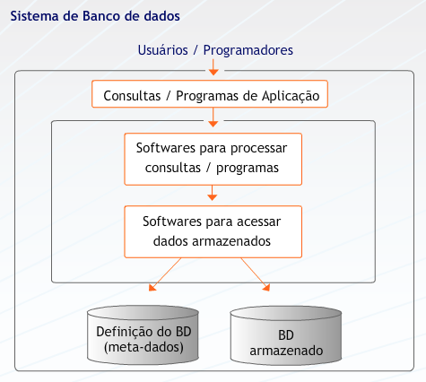
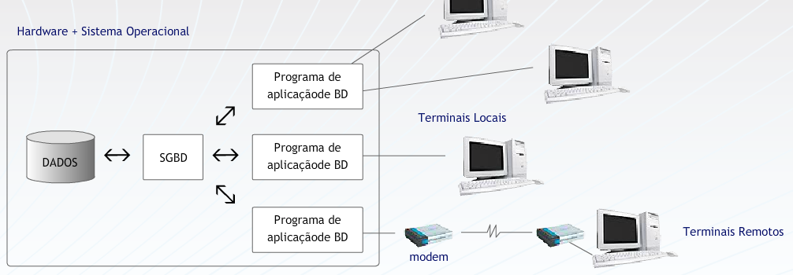
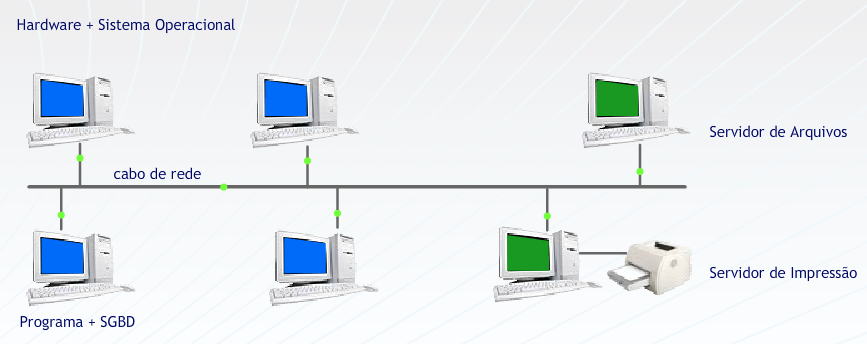
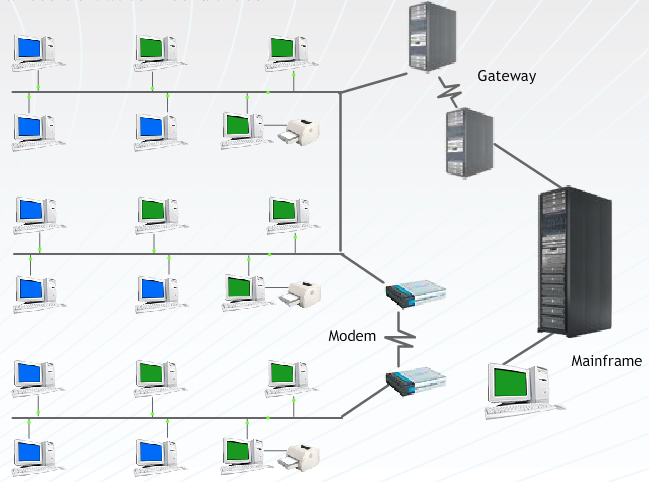
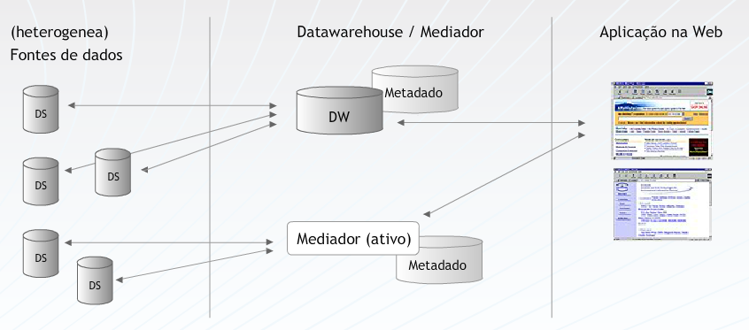

## Aula 1 
 
### Dados x Informação 
 
**Dados representam fatos em sua forma primária.** Por exemplo, o nome de um empregado, a quantidade de horas trabalhadas, por cada empregado, em uma semana, os números das peças mantidas em estoque ou dos seus pedidos de compras.  
 
Quando este fatos são **organizados ou arranjados de modo significativo**, eles se tornam uma informação. **Informação, portanto, é um conjunto de fatos organizados de tal forma que adquirem um valor adicional, além do valor do fato em si.** Por exemplo, o total de vendas mensais pode ser mais adequado ao seu propósito, ou seja, pode conter mais valor, do que as vendas de cada vendedor individualmente.  
 
**A transformação de dados em informação é um processo.** Por exemplo, com os dados de peças mantidas em estoque, pedidos e vendedores podemos obter informações tão diferentes quanto: lista de peças que estão em falta no estoque, a média de venda por peça, os melhores e piores vendedores da companhia e, ainda, relacionar os piores e melhores vendedores com as horas trabalhadas por cada um deles.  
 
De forma simples, podemos entender **um sistema de informação como um conjunto de processos que transforma dados em informação.** 
 
Os dados relevantes para um determinado negócio se mantêm estáveis mesmo que o negócio em questão modifique radicalmente sua forma de operação, ou seja, os seus processos.   
  
Sendo assim, podemos afirmar que **dados são mais estáveis do que processos** e, portanto, **representam a uma das partes mais valiosas e importantes de um sistema de informação**. 
 
### Bancos de Dados 
 
**Banco de dados é um conjunto de dados que se relacionam**. Porém, o significado do termo é mais restrito do que esta definição. Um banco de dados, necessariamente,  possui as seguintes propriedades: 
* Um banco de dados é uma coleção lógica e coerente de dados com um significado inerente; **uma disposição desordenada de dados não pode ser referenciada como um banco de dados**; 
* Um banco de dados é projetado, construído e populado com dados para um propósito específico; 
* Um banco de dados possui um conjunto pré-definido de usuários e aplicações; 
* Um banco de dados representa algum aspecto do mundo real, o qual é chamado de "mini-mundo" e qualquer alteração efetuada neste mini-mundo é automaticamente refletida no banco de dados. 
 
### Sistemas Gerenciadores de Bancos de Dados e Sistemas de Banco de Dados 
 
Um banco de dados é criado e mantido por um conjunto de aplicações desenvolvidas especialmente para esta tarefa denominado “Sistema Gerenciador de Banco de Dados” (SGBD). 
 
Um SGBD é uma **coleção de programas que permite aos seus usuários criarem e manipularem bancos de dados**. O conjunto formado por um banco de dados e estes programas que o manipulam é chamado de Sistema de Banco de Dados.  
Uma característica importante da abordagem de Banco de Dados é que **o SGBD não mantém somente os dados, mas, também, a forma como os mesmos são armazenados, através de uma descrição completa dos dados armazenados**. Estas informações são armazenadas no catálogo ou dicionário de dados do SGBD, que contém informações como a estrutura de cada arquivo, o tipo e o formato de armazenamento de cada tipo de dado, restrições, etc. **As informações armazenadas neste catálogo  são  chamadas meta-dados.** 

 
 
### SGBD X Sistemas de Gerenciamento de Arquivos 
 
A melhor maneira de entender a natureza geral e as características dos  bancos de dados de hoje é olhar para as características dos sistemas que antecederam o uso da tecnologia de banco de dados: os Sistemas de Gerenciamento de Arquivos.  Tais características são: 
 
1) Cada usuário define e implementa os arquivos necessários para uma aplicação específica, acarretando repetição dos dados e gerando inconsistência nas informações. 
2) O acesso aos dados está escrito nos programas que o manipulam, subordinando os programas aos arquivos. Isto significa que qualquer alteração na estrutura dos arquivos acarretará alterações em todos os programas que o acessam. 
3) A manipulação dos dados contidos nos arquivos pelas aplicações específicas dificulta o desenvolvimento de novos sistemas e torna a manutenção dos aplicativos difícil e cara. 
4) O sistema possibilita uma redundância não controlada de dados e inconsistência ao permitir que em um sistema um dado seja alterado e esse mesmo dado não seja alterado em outro. 
5) A responsabilidade sobre os procedimentos de backup e recuperação está a cargo da aplicação. Ou seja, não podem ser automatizadas e, caso o responsável pela aplicação não efetue estes backups sistematicamente, podem ocorrer perda de dados. 
 
### Em ambientes de SGBD 
 
Um arquivo (tabela) é definido uma única vez e atende a várias aplicações, ou seja, existe múltipla visão dos dados. 
 
Armazena-se junto com os dados todas as informações referentes à forma como estes foram estruturados e onde eles estão armazenados fisicamente. Estas informações estão armazenadas no catálogo. 
 
**Há separação entre programas e dados**. No SGBD os acessos são escritos no banco de dados e os programas enviam comandos, **solicitando o acesso aos dados. Esse conceito é chamado de abstração de dados**, que caracteriza-se por uma **independência entre programas e dados e entre programas e operações de manipulação de dados**. 
 
É permitido acesso simultâneo de vários usuários ao mesmo dado. Essa simultaneidade é tratada através do gerenciamento da concorrência. 
 
Procedimentos de backup e recuperação são automatizados. 
 
### Evolução dos bancos de dados 
 
Nos primeiros sistemas de informação, dados e processos eram mantidos juntos em um mesmo arquivo. 
 
**Programa com Dados Armazenados** 
 
A partir da observação de que os **dados são muito mais estáveis que os processos**, em um sistema de informação, iniciou-se a época de investimentos  massivos no desenvolvimento de ferramentas voltados para seu tratamento eficiente. Gradativamente, dados e processos foram separados. Em um primeiro momento, estas ferramentas mantinham as funções básicas de criação e manipulação dos dados independentes das aplicações.  
 
**DADOS -> Programa com gerência de arquivos** 
 
Em um segundo momento, apresentando as características dos SGBDs. 
 
**DADOS -> SGBD -> Programa de aplicação de BD** 
 
A partir desse ponto, em paralelo com a evolução do hardware disponível para suportar tais aplicações, estes ambientes foram ganhando novas versões. 
 
### Bancos de dados centralizados 
 
Neste ambiente, dados, SGBD e os programas que o acessam ficam restritos a uma única máquina. O acesso se dá por meio de terminais burros, ou seja, terminais com funcionalidades restritas. 
 

 
### Bancos de dados Cliente – Servidor (com servidor de arquivos) 
 
Devido ao surgimento das redes de computadores e a possibilidade de conexão entre diversas máquinas com alto poder de processamento, o banco de dados pode ser deslocado para uma máquina específica, o servidor de arquivos. Programas e SGBD podem funcionar em uma ou várias das outras máquinas da rede.  
 

### Bancos de dados Distribuídos 
 
Os bancos de dados crescem em volume de dados e as redes se tornam quase ilimitadas em tamanho. Para garantir a eficiência nestes ambientes, surge a necessidade de distribuição da própria base de dados. Surgem, então, os bancos de dados distribuídos. Estes bancos de dados representam, de forma bastante simplificada,  a divisão do banco de dados por vários servidores de bancos de dados. 
 

 
### Novas arquiteturas de BD – Datawarehouse 
 
Os bancos de dados saem do nível operacional da empresa e são agora preparados para atender níveis mais altos da pirâmide empresarial. Os datawarehouses, ou armazéns de dados, representam esta promoção dos  bancos de dados. Eles contém dados como nos bancos convencionais, só que preparados para atender as necessidades de informação dos níveis estratégicos da organização. Eles agora são empregados na tomada de decisão dentro das empresas, e não apenas na viabilização do funcionamento destas no dia a dia. 
 

 
### Novas arquiteturas de BD - Via WEB 
 
Finalmente, com o surgimento da Internet, a possibilidade de conexão entre estas bases de dados se torna praticamente ilimitada. 
 

 
### Usuários de bancos de dados 
 
**Administrador de dados (AD)**: responsáveis por identificar os dados a serem armazenados no BD e por escolher as estruturas apropriadas para representar e armazenar esses dados. Comunicação com usuários para identificação de visões (esquemas conceituais), desenvolve e mantém o dicionário de dados, garante as necessidades corporativas de dados. 
 
**Administradores do BD (ABD)**: desenvolve os esquemas internos através da construção das tabelas, índices etc; autoriza o acesso ao banco de dados, de modo a coordenar e monitorar seu uso, garante a segurança dos dados, bem como seu backup e recuperação em caso de falhas, garante a performance do banco de dados e desenvolve visões que atendam ao esquema externo. 
 
**Analistas de Sistemas**: determinam os requisitos dos usuários finais e desenvolvem especificações de transações que satisfaçam esses requisitos. 
 
**Programadores de aplicação**: implementam as especificações das transações como programas, testando-os, corrigindo-os e documentando-os. 
 
**Usuários finais**: utilizam os sistemas projetados pelo analista de sistemas cuja base de dados é mantida e monitorada pelo DBA e cuja integração com conjunto da corporação é garantido pelo esquema conceitual mantido pelo AD. 
 
**Pessoal do suporte**: preocupa-se com o hardware disponibilizado para o ambiente. 
 