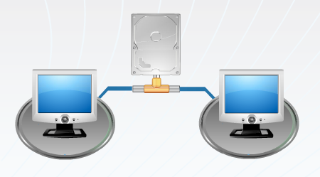

## Aula 2 – O SGBD e suas funcionalidades 
 
Um SGBD é conjunto complexo de software que deve prover um conjunto básico de funcionalidades: 
* Independência de dados 
* Controle de redundância 
* Compartilhamento de dados 
* Restrições de acesso 
* Restrições de integridade 
* Mecanismos de backup e recuperação 
* Múltiplas interfaces 
 
### Independência dos dados 
 
Em relação a aplicação, representa um avanço no sentido de tornar qualquer modificação das estruturas dos arquivos imperceptível para os programas. Desta forma, as mudanças na organização dos dados não geram qualquer necessidade de alteração dos programas que o manipulam. 
 
**Consiste na capacidade de permitir que haja evolução na descrição dos dados da empresa, sem que os sistemas ou aplicações tenham que ser alterados.** 
 
**Representa a imunidade das aplicações às mudanças na estrutura de armazenagem e estratégias de acesso.** 
 
Exemplo: Inclusão de um novo campo (atributo) em um arquivo (tabela) é feita sem que sejam alterados os programas, pois as estruturas dos arquivos não estão definidas nos programas. 
 
### Controle de redundância 
 
**Redundância é armazenar o mesmo dado várias vezes, para atender diversas aplicações.** Para manter a consistência do banco de dados, deve-se **armazenar o dado uma única vez e em apenas um lugar**, no banco de dados. Isto permite manter a consistência, economizar espaço de armazenamento. 
 
**Em alguns casos, a redundância é necessária, porém ela deve ser controlada pelo sistema de gerenciamento de banco de dados.** (Elmasri & Navathe, 2005) 
 
**É um conceito representado pelo controle centralizado dos dados compartilhados por diversas aplicações, reduzindo a repetição de dados a um mínimo justificável e aceita apenas por questão de desempenho.** (Cerícola, 1991)  
 
#### Problemas Da Redundância De Dados 
 
duplicação de esforço para manter os dados atualizados 
desperdício de espaço de armazenamento 
Possibilidade de inconsistência dos dados 
 
### Compartilhamento de Dados  
 
**Permitir, a usuários diferentes, a utilização simultânea de um mesmo dado.** 
 
As informações sobre clientes podem ser acessadas pelo sistema de vendas, de contas a receber e faturamento simultaneamente. 
A mesma base de dados sobre empregados pode ser usada simultaneamente pelo sistema de recursos humanos e pelo sistema de vendas. No primeiro caso, os dados serão utilizados no processo de pagamento e no segundo, no processo de alocação dos vendedores às áreas de atendimento a cliente. 
 

 
### Restrições de Acesso  
 
**Um SGBD deve prover controles de segurança e autorização, que são utilizados para criar contas e seus respectivos direitos de acesso, quando múltiplos usuários compartilham um banco de dados.** (Navathe, 2005) 
 
**Os controles de segurança abrangem conceitos tais como: procedimentos de validação e controle, garantia de integridade e controle de acesso, que visam resguardar o banco de dados de uma possível perda ou destruição de dados, seja por falha de programa ou por falha de equipamento.** (Cerícola, 1991) 

O sistema de pagamento poderá atualizar o cargo ocupado pelo empregado, enquanto o sistema de vendas poderá apenas consultar qual o cargo de um determinado empregado. 
O sistema de controle de material poderá incluir um novo material no cadastro existente, enquanto a área de compras consultará as informações sobre os materiais necessários para o processo de produção. 
 
#### Segurança e autorização 
 
* Senhas para usuários e para grupos de usuários; 
* restrição de acesso a parte do banco de dados; 
* proibição de executar certas operações; 
* Acesso restrito apenas a transações "enlatadas"; 
* proibição de uso de software privilegiado, como o software de criação de contas. 
 
A maioria dos SGBD prove certas restrições de integridade que devem ser aplicadas aos dados. O SGBD deve ter mecanismos para possibilitar a definição das restrições e assegurar o respeito a estas. Um exemplo de restrição de integridade é a definição de um tipo de dado (data type) para cada item de dado. 
 
### Mecanismos de backup e recuperação 
 
**Um SGBD deve prover facilidades para recuperação de falhas do hardware ou software.** 
 
Estes mecanismos evitam que cada aplicação tenha que projetar e desenvolver seus próprios controles contra a perda de dados. 
 
Exemplo: Se o sistema falha no meio de um programa de alteração complexo, o mecanismo de recuperação é responsável por assegurar que o banco de dados será restaurado para o estágio que ele se encontrava antes do início da execução do programa. 
 
### Múltiplas Interfaces 
 
Um ambiente de banco de dados é acessado por variados tipos de usuários, com variadas necessidades de informação e com diferentes níveis de conhecimento técnico. Para atender esta diversidade usuários, o SGBD deva fornecer diferentes tipos de interfaces. Sendo assim ,este ambiente disponibiliza: 
* Linguagens de consulta para usuários casuais; 
* Linguagens de programação para programadores de aplicações; 
* Interfaces gráficas com formulários (telas) e menus para usuários paramétricos; 
* Interfaces para administração do banco de dados; 
* Linguagem natural. 
 
### Benefícios no Uso de SGBDs 
 
Os ambientes de bancos de dados fornecem uma série de vantagens na sua adoção: 
  
1. Potencial para o estabelecimento e o cumprimento de padrões;  
2. Flexibilidade de mudanças; 
3. Redução no tempo de desenvolvimento de novas aplicações;  
4. Disponibilidade de informação atualizada;  
5. Economia de escala.  
 
### Bancos de dados NÃO são sempre a solução!!!  
 
Apesar das vantagens de utilização, a escolha por uma ambiente de banco de dados tem um alto custo atrelado. A sua adoção deve, então, compensar ou ser compatível com este custo. 
 
#### Sobrecustos vinculados 
 
- Alto investimento inicial em software, pela aquisição do banco de dados e licenças, e em hardware que suporte este ambiente. 
- Custo da generalidade do SGBD, ou seja, na definição e no processamento dos dados. 
- “Overhead” de processamento. Neste ambiente, overhead significa tudo aquilo que o SGBD tem que fazer além de gerenciar os dados. Isto envolve tarefas, tais como: garantir segurança, controlar concorrência (utilização do mesmo dado por aplicações e usuários distintos simultaneamente), recuperação de falhas e garantia de integridade. 
 
Quando NÃO usar bancos de dados  
- Volume de dados pequeno, aplicações simples, bem definidas.  
- Mudanças não são esperadas. 
- Ambientes de sistemas que exijam resposta em tempo real. 
- Acessos múltiplos e concorrentes não são necessários. 
 
**(essas aulas são antigas e portanto muitas dessas coisas podem ter sido alteradas com o passar dos anos e da tecnologia avançando)** 
 