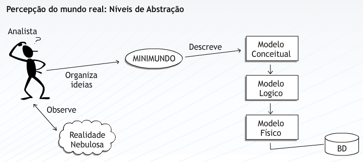
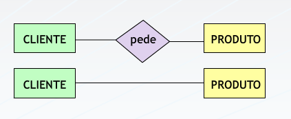

## Aula 3 – Modelagem conceitual - Percepção do mundo real 
 
O projeto de um banco de dados envolve a produção de 3 modelos que definem  uma arquitetura de 3 esquemas (conceitual, lógico e físico). 
Na fase inicial do processo, o mundo real ou mini-mundo deve ser entendido e seus objetos conceituais identificados. A este **entendimento e identificação chamamos abstração de dados** e o **modelo produzido após esta fase chamamos modelo conceitual**. Após a sua confecção e **pela a aplicação de regras específicas, um modelo lógico é produzido**. Este modelo está vinculado ao modelo de dados adotado pelo SGBD. Na etapa final, o **modelo lógico dá origem ao modelo físico**, efetivamente armazenado no banco de dados. 
 

### Percepção do Mundo Real 
 
Toda realidade é, em princípio, bastante nebulosa e informal. Através da observação podemos extrair desta realidade fatos que nos levam a conhecê-la de uma forma mais organizada. 
Em um negócio, existem fatos que, observados e modelados, dizem algo a respeito do funcionamento deste negócio. Estes fatos estão ligados diretamente ao funcionamento da realidade, a qual temos interesse em compreender e manter.  
Para que possamos retratar estes fatos e que os mesmos possam nos levar a futuras decisões e ações, se faz necessário então registrá-los. Um **MODELO** é algo que nos mostre como as informações estão relacionadas.  
 

 
Ao coletar e relacionar os fatos relevantes, devemos identificar os elementos geradores de informação, as leis que regem esta realidade, bem como as operações que incidem sobre os elementos básicos (dados). 
O que se quer criar é uma **ABSTRAÇÃO da realidade**, que seja capaz de registrar os acontecimentos da mesma, de modo que se possa implementar um sistema automatizado que atenda às reais necessidades de informação. 
 
#### Elementos de Abstração  
 
Mini-mundo: Porção específica da realidade, captada pelo analista, objeto de observação detalhada. Caso a análise do minimundo torne-se muito complexa, o analista pode subdividi-lo em pontos menores, chamados de “visões”. 
 
Banco de dados: Coleção de fatos registrados que refletem certos aspectos de interesse do mundo real. Cada mudança, em algum item do banco de dados, reflete uma mudança ocorrida na realidade. 
 
Modelo conceitual: Representa e/ou descreve a realidade do ambiente, constituindo uma visão global dos principais dados e relacionamentos (estruturas de informação), independente das restrições de implementação. Descreve as informações contidas em uma realidade, as quais irão estar armazenadas em um banco de dados. 
 
Modelo lógico: Descreve as estruturas que estarão contidas no banco de dados, considerando o modelo de dados do Sistema Gerenciador de Banco de Dados (SGBD), resultando em um esquema lógico de dados. Tem seu início a partir do Modelo Conceitual. 
 
Modelo físico: Descreve as estruturas físicas de armazenamento de dados, tais como: tamanho dos campos, índices, tipo de preenchimento destes campos, etc... Tem origem no Modelo Lógico e detalha o estudo dos métodos de acesso ao SGBD. 
 
### O Projeto do Banco de Dados 
 
Todo projeto de um sistema de aplicação para banco de dados necessita de um coração, um centro nervoso do mesmo. A modelagem de um sistema através da abordagem Entidades-Relacionamentos representa este ponto central no projeto conceitual de um sistema. 
 
O objetivo da Modelagem de Dados é **transmitir e apresentar uma representação única, não redundante e resumida, dos dados de uma aplicação**. Em projetos conceituais de aplicação, em banco de dados, o Modelo Entidades-Relacionamentos é o mais largamente utilizado para representação e entendimento dos dados que compõe um sistema. 
 
Desenvolvida na década de 70, possui paternidade discutível: Charles Bachman, James Martin, Peter Chen e outros. É de **Peter Chen o rótulo MER (Modelo Entidades-Relacionamentos)** que se transformou em, praticamente, **sinônimo da técnica de Modelagem de Dados**. 
 
Um Modelo de Dados é uma forma de representação gráfica do conhecimento que se tem sobre um ambiente qualquer. Mostra uma visão das informações de interesse e dos vínculos existentes entre elas, em um determinado momento. 
  
Quando Peter Chen formulou a proposta do Modelo Entidades-Relacionamentos , baseou-se na compreensão da realidade em que se situava o problema. Como iremos projetar um sistema se não entendemos o negócio para o qual será realizado? 
 
Chen dedicou-se a destacar a importância de reconhecer os objetos que compõem este negócio, independentemente das formas de tratamento das informações, procedimentos, programas etc. Estes objetos que desejamos conhecer e modelar foram classificados em dois grupos: Entidades e Relacionamentos. 
 
A imagem seguinte representa um fato comum que pode ser representado através dos elementos básicos que compõem o Modelo Entidades-Relacionamentos: 
 
 
 
### ENTIDADES 
 
Define-se Entidade como aquele **objeto que existe no mundo real, com identificação distinta e com um significado próprio**. São as "coisas" que existem no negócio, ou ainda, descrevem o negócio em si. 
 
A representação de uma entidade no MER é feita através de um **retângulo, com o nome da entidade em seu interior.** 
 
### ATRIBUTOS 
 
Todo objeto para ser uma entidade possui propriedades que são descritas por atributos e valores. **Estes atributos e valores, juntos, descrevem as instâncias de uma entidade**. 
O que descreve CLIENTE ? Cliente é descrito por um código de identificação, nome, endereço, telefone de contato, CGC ou CPF etc. 
A representação de um atributo no MER é feita através de uma **elipse com o nome do atributo em seu interior.** 
 

 
### RELACIONAMENTOS 
 
**Um relacionamento é uma associação entre duas entidades cujo significado seja de interesse para a realidade analisada.** 
Os relacionamentos estão intimamente ligados às ações realizadas pelos processos sobre os dados e **representam os caminhos de navegação ou rotas de acesso do Modelo de Dados**. 
Existem várias formas de se representar graficamente um relacionamento, Por exemplo, **Peter Chen utiliza um losango para desenhar uma associação entre entidades**, outros autores a representam através de um **traço unindo as entidades**. 
 

