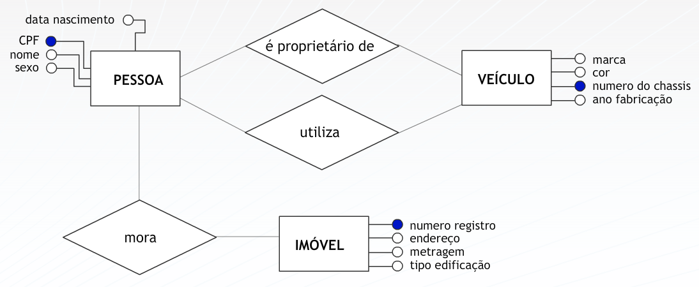

## Aula 4 – Modelagem Conceitual – Modelo entidade e relacionamento 
### Entidades 
 
Entidades podem ser tangíveis, por exemplo: pessoas, edifícios, etc. 
 
Entidades podem ser intangíveis, por exemplo: setor, reserva de um vôo, etc. 
 
Entidades fracas: Não existe,  se não estiver relacionada a outra, isto é, ela é logicamente dependente da outra.  Por exemplo, um apartamento dentro de um edifício, um dependente em relação a um funcionário em uma empresa. 
 
### Atributos 
 
Atributos compostos: Exemplo: Endereço é formado pelos atributos: rua, bairro, cidade, estado, CEP.  
 
Atributos simples ou atômicos: Atributos que não são divisíveis em unidades dados mais simples. Exemplo:  data de nascimento, numero de fatura, valor total de venda. 
 
Domínio de um atributo: Descrição de possíveis valores permitidos para um atributo. Exemplo: domínio do atributo cor de peça: azul, amarelo, verde, vermelho, branco. 
 
Valores nulos: Atributo sem valor. Um valor nulo pode ocorrer quando o atributo não é relevante para descrever uma entidade em particular. 
 
Atributos identificadores: Atributos que identifica, de forma única, as instâncias de uma entidade. Exemplo: uma matrícula identifica um aluno e um CPF identifica um cliente. 
 
### Modelando o negócio 
 
Em um primeiro contato com o negócio de uma empresa, podemos não possuir o conhecimento necessário sobre o mesmo. Portanto, é fundamental que procuremos conhecer seus objetos principais. 
Ao descrevermos textualmente a realidade analisada, as entidades podem ser identificadas por similaridade com a análise sintática das linguagens naturais. Nesse caso, algumas regras podem ser aplicadas: o sujeito e o objeto da sentença são, provavelmente, entidades; os verbos podem sugerir  relacionamentos, por exemplo:  
 
"Um país participa das Olimpíadas" 
 
A frase sugere de imediato a garimpagem de PAÍS e OLIMPÍADAS como entidades e o verbo “PARTICIPA”  como o relacionamento entre elas.  
  
Nos relacionamentos entre objetos de diferentes tipos, associamos instâncias de um objeto de um tipo a outras de outro tipo.  
 
Este processo pode ser utilizado para mapear qualquer relacionamento entre dois, ou mais tipos de objetos e, também, entre os mesmos objetos. 
 

 