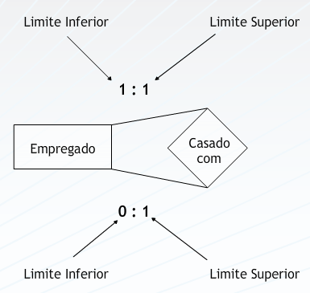

## Aula 5 – Modelagem conceitual – mais sobre relacionamentos 
 
Uma relação entre duas entidades pode ser descrita em termos da sua cardinalidade. 
1) um para um (1:1): Um empregado pode ser atribuído a um carro. Um carro pertence a um empregado. 
 
Cada instância de uma das entidades se relaciona com uma única instância da outra entidade do relacionamento. 
 

 
2) um para muitos (1:N): Um cliente pode tomar emprestado vários DVDs de vídeo. Cada DVD só pode ser emprestado a um cliente (por vez). 
 
Cada instância da entidade que representa o lado 1 do relacionamento pode se relacionar com N instâncias da entidade que representa o lado N. Por outro lado, cada instância da entidade representante do lado N, relaciona com apenas 1 instância da entidade representante do lado 1.  
 

 
3) muitos para muitos (N:N): Um estudante pode fazer várias disciplinas. Uma disciplina pode ser cursada por vários estudantes. 
 
Cada instância da entidade que representa o lado N do relacionamento pode se relacionar com M instâncias da entidade que representa o lado M. O mesmo acontece quando o relacionamento é analisado no sentido oposto. 
 

 
A cardinalidade é determinada pelas “regras de negócio” criadas pela organização. São os usuários e a documentação da organização que determinam a cardinalidade existente entre entidades e seus atributos. 
 
### Escolhendo Nomes Para Os Relacionamentos 
 
Relações podem ser nomeadas por verbos ou palavras agregadas, como nos exemplos abaixo: 
 

 
### AS RELAÇÕES PODEM TER LIMITES MÍNIMOS E MÁXIMOS 
 
Além do grau de cardinalidade máxima, já mencionado anteriormente, podemos identificar limites mínimos para as cardinalidades. Por exemplo:  
  
Um professor pode ensinar de 0 a 4 disciplinas (limite inferior é 0 e limite superior é 4); e uma disciplina pode ser  ministrada  por  0 a 1 professor (limite inferior é 0 e o limite superior é 1) 
 
1- Quando o limite inferior da cardinalidade for 0, o relacionamento é definido como “opcional” 
  
2- Quando o limite inferior da cardinalidade for 1, o relacionamento é definido como “obrigatório” 
 

 
### Relações podem ser recursivas 
 
-  Ocorre quando uma entidade possui relacionamento com ela mesma 
  
- Os relacionamentos recursivos podem também ter limites inferiores e superiores 
  
- Exemplo: Uma organização possui uma entidade "Empregado" e que guardar a informação sobre quais empregados são casados entre si. 
Esse é um relacionamento recursivo 1:1 onde a entidade "Empregado" se relaciona consigo mesmo. 
 
#### Relacionamentos Recursivos 1:1 

 
Pode ser visto como uma entidade que se relaciona com ela mesmo. 

 
#### Limites inferiores e superiores em um relacionamento 1:1 recursivo 

 
 
### Atributos Em Relacionamentos 
 
Os atributos de relacionamento são possíveis quando o grau do relacionamento for N : M ( muitos para muitos) 

 