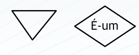
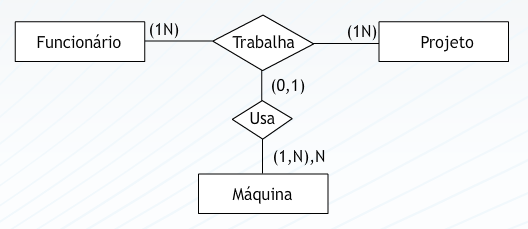
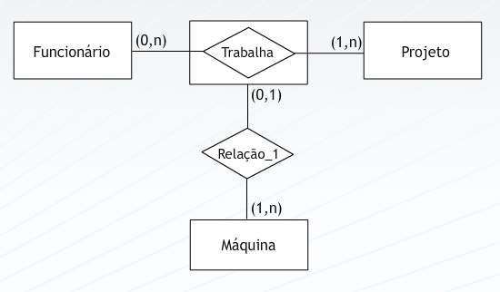

## Aula 6 – Modelagem conceitual – modelo entidade relacionamento estendido 
 
### Modelagem conceitual – Mer estendido 
 
Os conceitos básicos do Modelo Entidade Relacionamento são suficientes para modelar grande parte dos bancos de dados. Entretanto, algumas extensões, introduzidas posteriormente ao seu surgimento, permitiram  refinamentos bastante significativos.  
 
### Estrutura de Generalização-Especialização “É-um”  
 
Entidades podem ter subtipos ou subclasses e supertipos ou superclasses. 
Um entidade supertipo é uma generalização de uma entidade subtipo “especializada”. 
Cada entidade subtipo herda os atributos de sua entidade supertipo. 
Cada entidade supertipo tem seus próprios atributos únicos. 
 
A relação entre um subtipo de entidades e seu par é referenciada por uma relação “É-um” 
 
Num diagrama ER um relacionamento “É-um” conecta uma entidades mais especializada a uma entidade generalizada [sem sentido] pode ser escrita como um triângulo invertido ou um losango com o label “É-um” 

 
### Estrutura de Agregação“Faz_parte_de” 
 
O  Modelo Entidade Relacionamento não é capaz de representar relacionamentos entre relacionamentos. Uma agregação é uma abstração através da qual os relacionamentos são tratados como entidades de mais alto nível 
 
Neste caso, a entidade Máquina se relaciona com os funcionários trabalhando em um projeto. Máquinas não se relacionam com funcionários e nem projetos em separado, mas sim com o relacionamento que estas entidades mantêm. 
 

 
Outra representação: 

 
A Especialização Total ocorre quando todos os elementos da entidade pai, deve obrigatoriamente existir em pelo menos uma entidade filha. 
A Especialização Superposição ocorre quando um elemento da especialização pode existir em outra entidade do mesmo nível. 
A Especialização Exclusiva ocorre quando um elemento da especialização não pode existir em outra entidade do mesmo nível. 
A Especialização Parcial ocorre quando existir na entidade pai elementos que não existem nas filhas. 
 
Agregação: transformação de um conjunto de relacionamentos em conjunto de entidades 
 