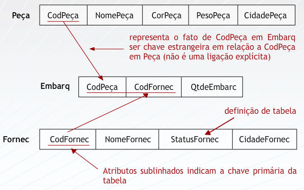

## Aula 7 – modelagem lógica - o modelo relacional 
 
### Modelagem Lógica De Dados 
 
O Modelo Lógico de Dados Lógico descreve os componentes do Modelo Conceitual de Dados, aproximando-o do ambiente computacional, onde este será trabalhado. Existem vários modelos de dados: 
* Modelo de rede: Os dados são representados por uma coleção de registros e os relacionamentos entre os dados são representados por meio de links.  
* Modelo hierárquico: Apresenta a mesma estrutura do modelo de rede, diferindo apenas na organização dos registros. Tais registros são organizados com coleções de árvores em vez de grafos aleatórios. 
* Modelo relacional: Os dados são representados através de tabelas. Por se tratar do modelo mais usual, é o foco deste curso. Iremos detalhá-lo mais adiante. 
* Modelo orientado a objetos: Surgiu em virtude da necessidade de se acompanhar o aumento na complexidade dos dados. Quando o modelo relacional foi sugerido, dados como imagens ou som não foram considerados na sua estrutura. Atualmente, dados deste tipo são bastante comuns, até mesmo nas aplicações mais simples e o modelo relacional não é suficiente para este tipo de modelagem. De modeo geral, no modelo orientado a objeto as entidades do modelo conceitual são objetos que encapsulam tanto dados quanto o código associado  a este objeto. 
* Modelo relacional objeto: Um extensão do modelo relacional, que inclui orientação a objeto e permite o tratamento de dados complexos. 
 
### Modelo relacional 
 
Está fundamentado na teoria de conjuntos, combinado com a ideia que não é relevante para o usuário saber onde os dados estão nem como os dados estão armazenados. O usuário, para lidar com esses objetos, conta com um conjunto de operadores e funções de alto nível, constantes na álgebra relacional. 
 
**Definição matemática de relação** 
 
Sejam conjuntos, não necessariamente disjuntos D1, D2, ..., Dn de valores atômicos. R é uma relação sobre estes conjuntos (domínios de R), se e somente se R é um conjunto de n-uplas (tuplas) ordenadas <d1, d2, ..., dn>, tal que para i=1,2,...,n di pertence a Di. 
 
Exemplo: 
A = {1, 2, 3, 4, 5} 
B = {2, 3, 4, 6, 7} 
R = B é o dobro de A 
R = {(2,1), (4,2), (6,3)} 
 
**No modelo relacional...** 
 
Relação = Tabela bidimensional, composta de linhas e colunas de dados.  
Relação recursiva =  Relaciona o objeto a si mesmo.  
Atributo = Coluna.  
Grau de uma relação =  Número de atributos.  
Tupla =  Cada linha da relação.   
Domínio de um atributo =  Conjunto ao qual pertencem os valores de um atributo  Valor nulo de um atributo de uma tupla =  Atributo inaplicável ou com valor desconhecido. Esquema de Banco de Dados Relacional =  Nomes das relações, seguidos pelos nomes dos atributos; com os atributos chaves sublinhados e com as chaves estrangeiras identificadas.  
 

 
### Chaves 
 
#### Chave Candidata  
 
Deve ser única, ou seja, nenhuma tupla de uma mesma relação, pode ter o mesmo valor para o atributo escolhido como chave candidata 
Deve ser irredutível, nenhum subconjunto da chave candidata, pode ter sozinho a propriedade de ser único. 
Pode ser : 
Simples : quando é composta por apenas um atributo 
Composta : quanto possui mais de um atributo para formar a chave 
 
#### Chave primária   
  
É um caso especial da chave candidata. É a escolhida entre as candidatas para identificar unicamente uma tupla. 
 
#### Chave estrangeira  
  
É quando um atributo de uma relação é chave primária em outra. 
Constitui um conceito de vital importância no modelo relacional: é o elo de ligação lógica entre as tabelas (relacionamentos)  
Através das operações com as chaves estrangeiras que se garante a INTEGRIDADE REFERENCIAL do banco de dados. 
 

 
 
### Regras de integridade 
 
Regras que devem ser obedecidas em todos os estados válidos da base de dados (podem  envolver uma ou mais linhas de uma ou mais tabelas). 
 
#### Integridade da Entidade 
 
O valor da chave não pode ser vazio. 
A chave primária serve como representante na base de dados de uma entidade – se a chave primária for vazia, a linha não corresponde a nenhuma entidade . 
 
#### Integridade de Chave Primária 
 
A chave primária tem que ser única. 
 
#### Integridade Referencial 
 
As chaves estrangeiras têm que ser respeitadas, ou seja, se existe um determinado valor para o atributo na tabela onde ele é chave estrangeira, este valor deve existir na tabela onde ele é chave primária   
  
#### Restrições de Integridades Semânticas 
 
Todas as demais regras que devem ser obedecidas por todos os estados válidos da base de dados. 
 