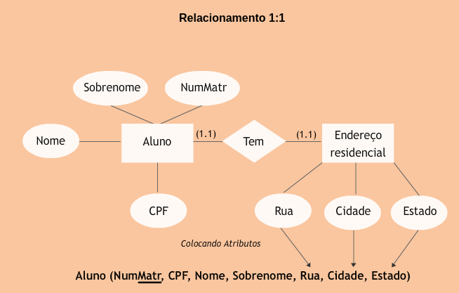
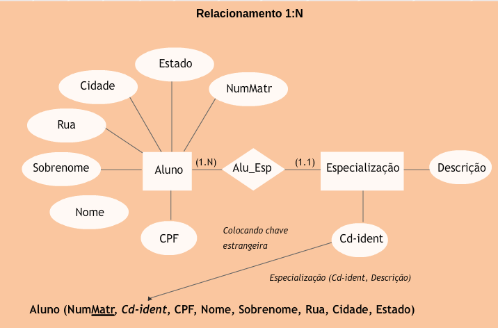
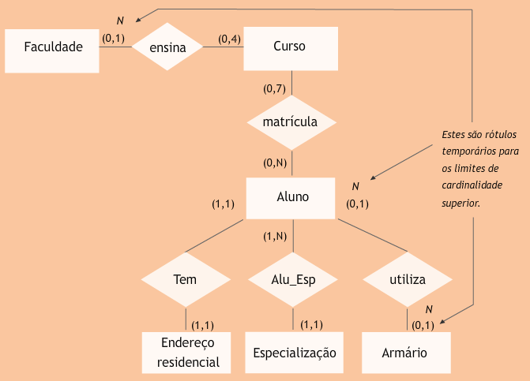
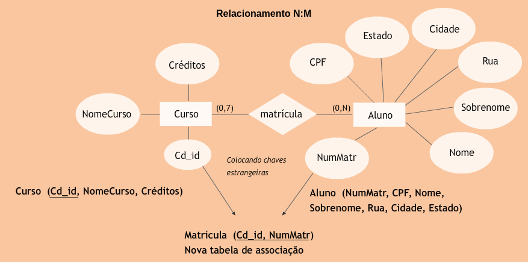

## Aula 8 – modelagem lógica - conversão do modelo conceitual para o modelo relacional 
 
Regras simples, baseadas na cardinalidade dos relacionamentos, são aplicadas para converter entidades e relacionamentos em tabelas relacionais.  
 
### Convertendo o diagrama ER para tabelas relacionais 
 
Em cada entidade onde o limite inferior para a cardinalidade é 0 e o limite superior é 1, temporariamente classifique o limite superior como N.  
  
A partir destas alterações, aplique as regras a seguir, observando apenas os valores máximos para as cardinalidades. 
 
#### Para cardinalidade 1:1 
 
Incluir todos os atributos numa tabela simples. O nome da tabela relacional pode ser o nome de uma das entidades que participam do relacionamento, um nome composto formado pela combinação dos nomes das duas entidades ou um novo nome que represente o significado dos dados na tabela. 
 

#### Para cardinalidade 1:N 
 
Incluir o “identificador”do lado “um”,  como um atributo no lado “muitos”. O identificador colocado do lado “muitos” é chamado de chave estrangeira. 
 

 
#### Para cardinalidade N:M  
 
Criar uma nova tabela e colocar as chaves primárias de cada uma das entidades como atributos na nova tabela. A nova tabela é chamada de tabela associativa.  O identificador da tabela é uma chave composta, formada pelas chaves primárias das duas tabelas que participam do relacionamento. Cada identificador colocado na nova tabela é uma chave estrangeira. 
 

 
 