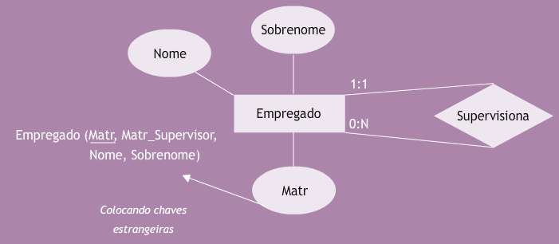

## Aula 9 – Modelagem lógica - relacionamentos recursivos e extensões 
 
### Relacionamentos Recursivos 
 
No exemplo, o atributo matricula é duplicado na tabela casado_com, para representar a matrícula do marido e de sua esposa. 
 

 
Novamente, o atributo que representa a matrícula foi duplicado para representar o supervisor e o supervisionado. 
 

 
 
### Generalizações 
 

 
### Agregações 

 
### Relacionamentos n-ários 
 

 