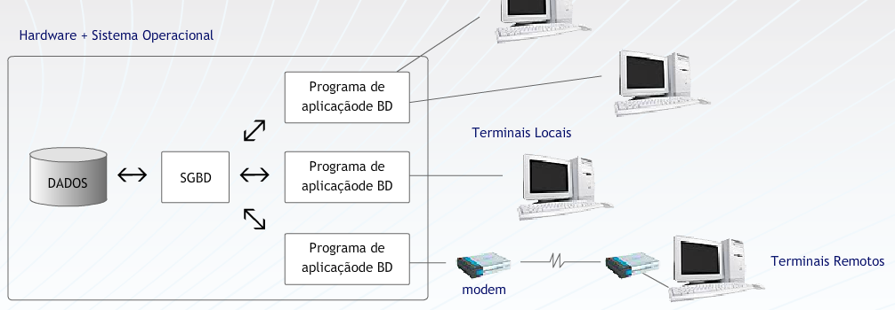
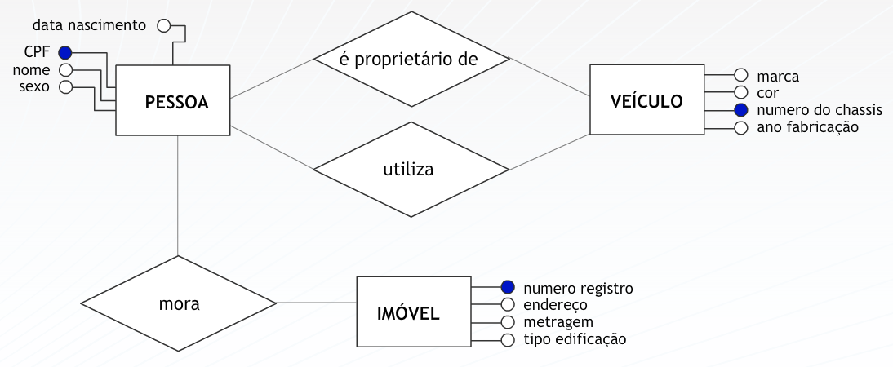
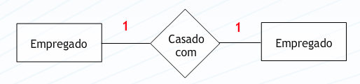
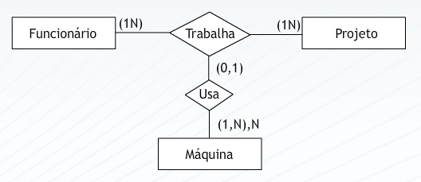
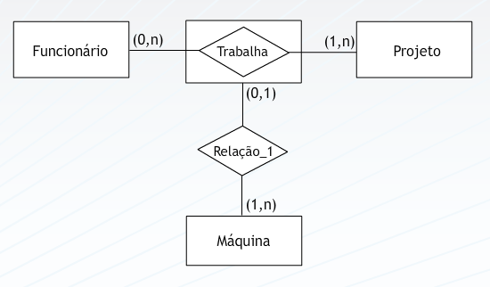
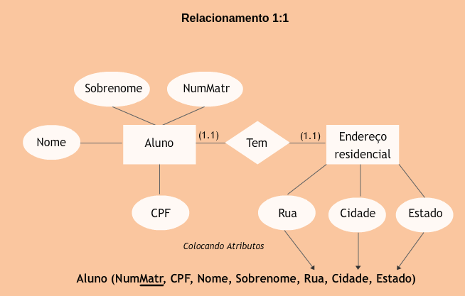
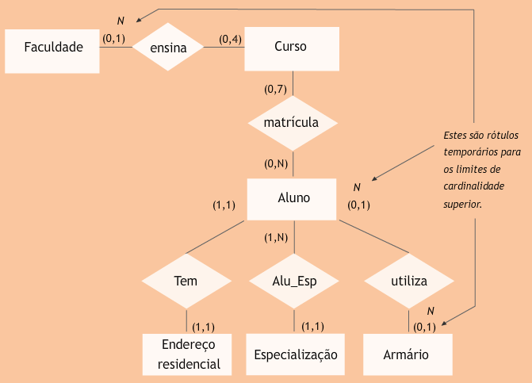
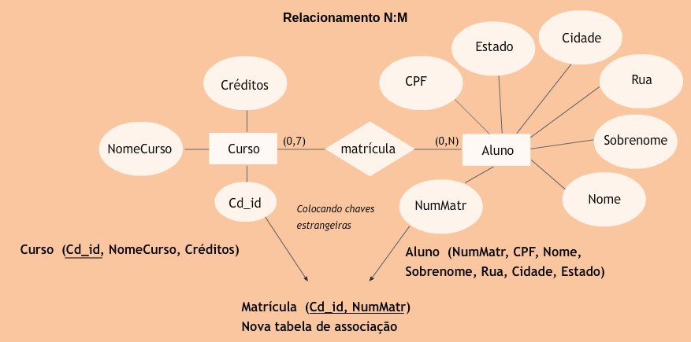
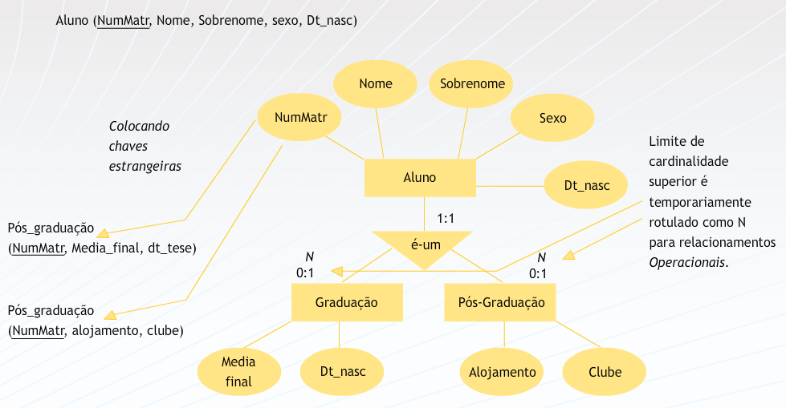
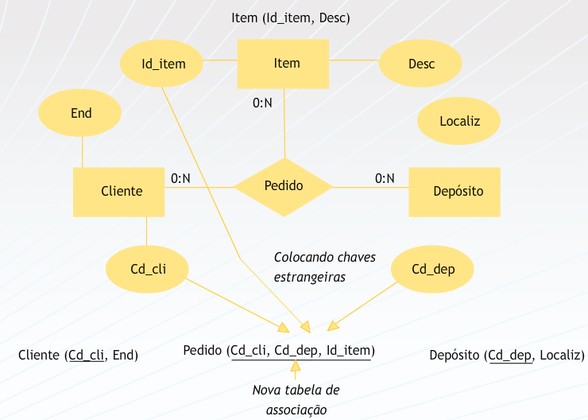

## Aula 1 
 
### Dados x Informação 
 
**Dados representam fatos em sua forma primária.** Por exemplo, o nome de um empregado, a quantidade de horas trabalhadas, por cada empregado, em uma semana, os números das peças mantidas em estoque ou dos seus pedidos de compras.  
 
Quando este fatos são **organizados ou arranjados de modo significativo**, eles se tornam uma informação. **Informação, portanto, é um conjunto de fatos organizados de tal forma que adquirem um valor adicional, além do valor do fato em si.** Por exemplo, o total de vendas mensais pode ser mais adequado ao seu propósito, ou seja, pode conter mais valor, do que as vendas de cada vendedor individualmente.  
 
**A transformação de dados em informação é um processo.** Por exemplo, com os dados de peças mantidas em estoque, pedidos e vendedores podemos obter informações tão diferentes quanto: lista de peças que estão em falta no estoque, a média de venda por peça, os melhores e piores vendedores da companhia e, ainda, relacionar os piores e melhores vendedores com as horas trabalhadas por cada um deles.  
 
De forma simples, podemos entender **um sistema de informação como um conjunto de processos que transforma dados em informação.** 
 
Os dados relevantes para um determinado negócio se mantêm estáveis mesmo que o negócio em questão modifique radicalmente sua forma de operação, ou seja, os seus processos.   
  
Sendo assim, podemos afirmar que **dados são mais estáveis do que processos** e, portanto, **representam a uma das partes mais valiosas e importantes de um sistema de informação**. 
 
### Bancos de Dados 
 
**Banco de dados é um conjunto de dados que se relacionam**. Porém, o significado do termo é mais restrito do que esta definição. Um banco de dados, necessariamente,  possui as seguintes propriedades: 
* Um banco de dados é uma coleção lógica e coerente de dados com um significado inerente; **uma disposição desordenada de dados não pode ser referenciada como um banco de dados**; 
* Um banco de dados é projetado, construído e populado com dados para um propósito específico; 
* Um banco de dados possui um conjunto pré-definido de usuários e aplicações; 
* Um banco de dados representa algum aspecto do mundo real, o qual é chamado de "mini-mundo" e qualquer alteração efetuada neste mini-mundo é automaticamente refletida no banco de dados. 
 
### Sistemas Gerenciadores de Bancos de Dados e Sistemas de Banco de Dados 
 
Um banco de dados é criado e mantido por um conjunto de aplicações desenvolvidas especialmente para esta tarefa denominado “Sistema Gerenciador de Banco de Dados” (SGBD). 
 
Um SGBD é uma **coleção de programas que permite aos seus usuários criarem e manipularem bancos de dados**. O conjunto formado por um banco de dados e estes programas que o manipulam é chamado de Sistema de Banco de Dados.  
Uma característica importante da abordagem de Banco de Dados é que **o SGBD não mantém somente os dados, mas, também, a forma como os mesmos são armazenados, através de uma descrição completa dos dados armazenados**. Estas informações são armazenadas no catálogo ou dicionário de dados do SGBD, que contém informações como a estrutura de cada arquivo, o tipo e o formato de armazenamento de cada tipo de dado, restrições, etc. **As informações armazenadas neste catálogo  são  chamadas meta-dados.** 

 
 
### SGBD X Sistemas de Gerenciamento de Arquivos 
 
A melhor maneira de entender a natureza geral e as características dos  bancos de dados de hoje é olhar para as características dos sistemas que antecederam o uso da tecnologia de banco de dados: os Sistemas de Gerenciamento de Arquivos.  Tais características são: 
 
1) Cada usuário define e implementa os arquivos necessários para uma aplicação específica, acarretando repetição dos dados e gerando inconsistência nas informações. 
2) O acesso aos dados está escrito nos programas que o manipulam, subordinando os programas aos arquivos. Isto significa que qualquer alteração na estrutura dos arquivos acarretará alterações em todos os programas que o acessam. 
3) A manipulação dos dados contidos nos arquivos pelas aplicações específicas dificulta o desenvolvimento de novos sistemas e torna a manutenção dos aplicativos difícil e cara. 
4) O sistema possibilita uma redundância não controlada de dados e inconsistência ao permitir que em um sistema um dado seja alterado e esse mesmo dado não seja alterado em outro. 
5) A responsabilidade sobre os procedimentos de backup e recuperação está a cargo da aplicação. Ou seja, não podem ser automatizadas e, caso o responsável pela aplicação não efetue estes backups sistematicamente, podem ocorrer perda de dados. 
 
### Em ambientes de SGBD 
 
Um arquivo (tabela) é definido uma única vez e atende a várias aplicações, ou seja, existe múltipla visão dos dados. 
 
Armazena-se junto com os dados todas as informações referentes à forma como estes foram estruturados e onde eles estão armazenados fisicamente. Estas informações estão armazenadas no catálogo. 
 
**Há separação entre programas e dados**. No SGBD os acessos são escritos no banco de dados e os programas enviam comandos, **solicitando o acesso aos dados. Esse conceito é chamado de abstração de dados**, que caracteriza-se por uma **independência entre programas e dados e entre programas e operações de manipulação de dados**. 
 
É permitido acesso simultâneo de vários usuários ao mesmo dado. Essa simultaneidade é tratada através do gerenciamento da concorrência. 
 
Procedimentos de backup e recuperação são automatizados. 
 
### Evolução dos bancos de dados 
 
Nos primeiros sistemas de informação, dados e processos eram mantidos juntos em um mesmo arquivo. 
 
**Programa com Dados Armazenados** 
 
A partir da observação de que os **dados são muito mais estáveis que os processos**, em um sistema de informação, iniciou-se a época de investimentos  massivos no desenvolvimento de ferramentas voltados para seu tratamento eficiente. Gradativamente, dados e processos foram separados. Em um primeiro momento, estas ferramentas mantinham as funções básicas de criação e manipulação dos dados independentes das aplicações.  
 
**DADOS -> Programa com gerência de arquivos** 
 
Em um segundo momento, apresentando as características dos SGBDs. 
 
**DADOS -> SGBD -> Programa de aplicação de BD** 
 
A partir desse ponto, em paralelo com a evolução do hardware disponível para suportar tais aplicações, estes ambientes foram ganhando novas versões. 
 
### Bancos de dados centralizados 
 
Neste ambiente, dados, SGBD e os programas que o acessam ficam restritos a uma única máquina. O acesso se dá por meio de terminais burros, ou seja, terminais com funcionalidades restritas. 
 

 
### Bancos de dados Cliente – Servidor (com servidor de arquivos) 
 
Devido ao surgimento das redes de computadores e a possibilidade de conexão entre diversas máquinas com alto poder de processamento, o banco de dados pode ser deslocado para uma máquina específica, o servidor de arquivos. Programas e SGBD podem funcionar em uma ou várias das outras máquinas da rede.  
 

### Bancos de dados Distribuídos 
 
Os bancos de dados crescem em volume de dados e as redes se tornam quase ilimitadas em tamanho. Para garantir a eficiência nestes ambientes, surge a necessidade de distribuição da própria base de dados. Surgem, então, os bancos de dados distribuídos. Estes bancos de dados representam, de forma bastante simplificada,  a divisão do banco de dados por vários servidores de bancos de dados. 
 

 
### Novas arquiteturas de BD – Datawarehouse 
 
Os bancos de dados saem do nível operacional da empresa e são agora preparados para atender níveis mais altos da pirâmide empresarial. Os datawarehouses, ou armazéns de dados, representam esta promoção dos  bancos de dados. Eles contém dados como nos bancos convencionais, só que preparados para atender as necessidades de informação dos níveis estratégicos da organização. Eles agora são empregados na tomada de decisão dentro das empresas, e não apenas na viabilização do funcionamento destas no dia a dia. 
 

 
### Novas arquiteturas de BD - Via WEB 
 
Finalmente, com o surgimento da Internet, a possibilidade de conexão entre estas bases de dados se torna praticamente ilimitada. 
 

 
### Usuários de bancos de dados 
 
**Administrador de dados (AD)**: responsáveis por identificar os dados a serem armazenados no BD e por escolher as estruturas apropriadas para representar e armazenar esses dados. Comunicação com usuários para identificação de visões (esquemas conceituais), desenvolve e mantém o dicionário de dados, garante as necessidades corporativas de dados. 
 
**Administradores do BD (ABD)**: desenvolve os esquemas internos através da construção das tabelas, índices etc; autoriza o acesso ao banco de dados, de modo a coordenar e monitorar seu uso, garante a segurança dos dados, bem como seu backup e recuperação em caso de falhas, garante a performance do banco de dados e desenvolve visões que atendam ao esquema externo. 
 
**Analistas de Sistemas**: determinam os requisitos dos usuários finais e desenvolvem especificações de transações que satisfaçam esses requisitos. 
 
**Programadores de aplicação**: implementam as especificações das transações como programas, testando-os, corrigindo-os e documentando-os. 
 
**Usuários finais**: utilizam os sistemas projetados pelo analista de sistemas cuja base de dados é mantida e monitorada pelo DBA e cuja integração com conjunto da corporação é garantido pelo esquema conceitual mantido pelo AD. 
 
**Pessoal do suporte**: preocupa-se com o hardware disponibilizado para o ambiente. 
 
 
## Aula 2 – O SGBD e suas funcionalidades 
 
Um SGBD é conjunto complexo de software que deve prover um conjunto básico de funcionalidades: 
* Independência de dados 
* Controle de redundância 
* Compartilhamento de dados 
* Restrições de acesso 
* Restrições de integridade 
* Mecanismos de backup e recuperação 
* Múltiplas interfaces 
 
### Independência dos dados 
 
Em relação a aplicação, representa um avanço no sentido de tornar qualquer modificação das estruturas dos arquivos imperceptível para os programas. Desta forma, as mudanças na organização dos dados não geram qualquer necessidade de alteração dos programas que o manipulam. 
 
**Consiste na capacidade de permitir que haja evolução na descrição dos dados da empresa, sem que os sistemas ou aplicações tenham que ser alterados.** 
 
**Representa a imunidade das aplicações às mudanças na estrutura de armazenagem e estratégias de acesso.** 
 
Exemplo: Inclusão de um novo campo (atributo) em um arquivo (tabela) é feita sem que sejam alterados os programas, pois as estruturas dos arquivos não estão definidas nos programas. 
 
### Controle de redundância 
 
**Redundância é armazenar o mesmo dado várias vezes, para atender diversas aplicações.** Para manter a consistência do banco de dados, deve-se **armazenar o dado uma única vez e em apenas um lugar**, no banco de dados. Isto permite manter a consistência, economizar espaço de armazenamento. 
 
**Em alguns casos, a redundância é necessária, porém ela deve ser controlada pelo sistema de gerenciamento de banco de dados.** (Elmasri & Navathe, 2005) 
 
**É um conceito representado pelo controle centralizado dos dados compartilhados por diversas aplicações, reduzindo a repetição de dados a um mínimo justificável e aceita apenas por questão de desempenho.** (Cerícola, 1991)  
 
#### Problemas Da Redundância De Dados 
 
duplicação de esforço para manter os dados atualizados 
desperdício de espaço de armazenamento 
Possibilidade de inconsistência dos dados 
 
### Compartilhamento de Dados  
 
**Permitir, a usuários diferentes, a utilização simultânea de um mesmo dado.** 
 
As informações sobre clientes podem ser acessadas pelo sistema de vendas, de contas a receber e faturamento simultaneamente. 
A mesma base de dados sobre empregados pode ser usada simultaneamente pelo sistema de recursos humanos e pelo sistema de vendas. No primeiro caso, os dados serão utilizados no processo de pagamento e no segundo, no processo de alocação dos vendedores às áreas de atendimento a cliente. 
 

 
### Restrições de Acesso  
 
**Um SGBD deve prover controles de segurança e autorização, que são utilizados para criar contas e seus respectivos direitos de acesso, quando múltiplos usuários compartilham um banco de dados.** (Navathe, 2005) 
 
**Os controles de segurança abrangem conceitos tais como: procedimentos de validação e controle, garantia de integridade e controle de acesso, que visam resguardar o banco de dados de uma possível perda ou destruição de dados, seja por falha de programa ou por falha de equipamento.** (Cerícola, 1991) 

O sistema de pagamento poderá atualizar o cargo ocupado pelo empregado, enquanto o sistema de vendas poderá apenas consultar qual o cargo de um determinado empregado. 
O sistema de controle de material poderá incluir um novo material no cadastro existente, enquanto a área de compras consultará as informações sobre os materiais necessários para o processo de produção. 
 
#### Segurança e autorização 
 
* Senhas para usuários e para grupos de usuários; 
* restrição de acesso a parte do banco de dados; 
* proibição de executar certas operações; 
* Acesso restrito apenas a transações "enlatadas"; 
* proibição de uso de software privilegiado, como o software de criação de contas. 
 
A maioria dos SGBD prove certas restrições de integridade que devem ser aplicadas aos dados. O SGBD deve ter mecanismos para possibilitar a definição das restrições e assegurar o respeito a estas. Um exemplo de restrição de integridade é a definição de um tipo de dado (data type) para cada item de dado. 
 
### Mecanismos de backup e recuperação 
 
**Um SGBD deve prover facilidades para recuperação de falhas do hardware ou software.** 
 
Estes mecanismos evitam que cada aplicação tenha que projetar e desenvolver seus próprios controles contra a perda de dados. 
 
Exemplo: Se o sistema falha no meio de um programa de alteração complexo, o mecanismo de recuperação é responsável por assegurar que o banco de dados será restaurado para o estágio que ele se encontrava antes do início da execução do programa. 
 
### Múltiplas Interfaces 
 
Um ambiente de banco de dados é acessado por variados tipos de usuários, com variadas necessidades de informação e com diferentes níveis de conhecimento técnico. Para atender esta diversidade usuários, o SGBD deva fornecer diferentes tipos de interfaces. Sendo assim ,este ambiente disponibiliza: 
* Linguagens de consulta para usuários casuais; 
* Linguagens de programação para programadores de aplicações; 
* Interfaces gráficas com formulários (telas) e menus para usuários paramétricos; 
* Interfaces para administração do banco de dados; 
* Linguagem natural. 
 
### Benefícios no Uso de SGBDs 
 
Os ambientes de bancos de dados fornecem uma série de vantagens na sua adoção: 
  
1. Potencial para o estabelecimento e o cumprimento de padrões;  
2. Flexibilidade de mudanças; 
3. Redução no tempo de desenvolvimento de novas aplicações;  
4. Disponibilidade de informação atualizada;  
5. Economia de escala.  
 
### Bancos de dados NÃO são sempre a solução!!!  
 
Apesar das vantagens de utilização, a escolha por uma ambiente de banco de dados tem um alto custo atrelado. A sua adoção deve, então, compensar ou ser compatível com este custo. 
 
#### Sobrecustos vinculados 
 
- Alto investimento inicial em software, pela aquisição do banco de dados e licenças, e em hardware que suporte este ambiente. 
- Custo da generalidade do SGBD, ou seja, na definição e no processamento dos dados. 
- “Overhead” de processamento. Neste ambiente, overhead significa tudo aquilo que o SGBD tem que fazer além de gerenciar os dados. Isto envolve tarefas, tais como: garantir segurança, controlar concorrência (utilização do mesmo dado por aplicações e usuários distintos simultaneamente), recuperação de falhas e garantia de integridade. 
 
Quando NÃO usar bancos de dados  
- Volume de dados pequeno, aplicações simples, bem definidas.  
- Mudanças não são esperadas. 
- Ambientes de sistemas que exijam resposta em tempo real. 
- Acessos múltiplos e concorrentes não são necessários. 
 
**(essas aulas são antigas e portanto muitas dessas coisas podem ter sido alteradas com o passar dos anos e da tecnologia avançando)** 
 
## Aula 3 – Modelagem conceitual - Percepção do mundo real 
 
O projeto de um banco de dados envolve a produção de 3 modelos que definem  uma arquitetura de 3 esquemas (conceitual, lógico e físico). 
Na fase inicial do processo, o mundo real ou mini-mundo deve ser entendido e seus objetos conceituais identificados. A este **entendimento e identificação chamamos abstração de dados** e o **modelo produzido após esta fase chamamos modelo conceitual**. Após a sua confecção e **pela a aplicação de regras específicas, um modelo lógico é produzido**. Este modelo está vinculado ao modelo de dados adotado pelo SGBD. Na etapa final, o **modelo lógico dá origem ao modelo físico**, efetivamente armazenado no banco de dados. 
 

### Percepção do Mundo Real 
 
Toda realidade é, em princípio, bastante nebulosa e informal. Através da observação podemos extrair desta realidade fatos que nos levam a conhecê-la de uma forma mais organizada. 
Em um negócio, existem fatos que, observados e modelados, dizem algo a respeito do funcionamento deste negócio. Estes fatos estão ligados diretamente ao funcionamento da realidade, a qual temos interesse em compreender e manter.  
Para que possamos retratar estes fatos e que os mesmos possam nos levar a futuras decisões e ações, se faz necessário então registrá-los. Um **MODELO** é algo que nos mostre como as informações estão relacionadas.  
 

 
Ao coletar e relacionar os fatos relevantes, devemos identificar os elementos geradores de informação, as leis que regem esta realidade, bem como as operações que incidem sobre os elementos básicos (dados). 
O que se quer criar é uma **ABSTRAÇÃO da realidade**, que seja capaz de registrar os acontecimentos da mesma, de modo que se possa implementar um sistema automatizado que atenda às reais necessidades de informação. 
 
#### Elementos de Abstração  
 
Mini-mundo: Porção específica da realidade, captada pelo analista, objeto de observação detalhada. Caso a análise do minimundo torne-se muito complexa, o analista pode subdividi-lo em pontos menores, chamados de “visões”. 
 
Banco de dados: Coleção de fatos registrados que refletem certos aspectos de interesse do mundo real. Cada mudança, em algum item do banco de dados, reflete uma mudança ocorrida na realidade. 
 
Modelo conceitual: Representa e/ou descreve a realidade do ambiente, constituindo uma visão global dos principais dados e relacionamentos (estruturas de informação), independente das restrições de implementação. Descreve as informações contidas em uma realidade, as quais irão estar armazenadas em um banco de dados. 
 
Modelo lógico: Descreve as estruturas que estarão contidas no banco de dados, considerando o modelo de dados do Sistema Gerenciador de Banco de Dados (SGBD), resultando em um esquema lógico de dados. Tem seu início a partir do Modelo Conceitual. 
 
Modelo físico: Descreve as estruturas físicas de armazenamento de dados, tais como: tamanho dos campos, índices, tipo de preenchimento destes campos, etc... Tem origem no Modelo Lógico e detalha o estudo dos métodos de acesso ao SGBD. 
 
### O Projeto do Banco de Dados 
 
Todo projeto de um sistema de aplicação para banco de dados necessita de um coração, um centro nervoso do mesmo. A modelagem de um sistema através da abordagem Entidades-Relacionamentos representa este ponto central no projeto conceitual de um sistema. 
 
O objetivo da Modelagem de Dados é **transmitir e apresentar uma representação única, não redundante e resumida, dos dados de uma aplicação**. Em projetos conceituais de aplicação, em banco de dados, o Modelo Entidades-Relacionamentos é o mais largamente utilizado para representação e entendimento dos dados que compõe um sistema. 
 
Desenvolvida na década de 70, possui paternidade discutível: Charles Bachman, James Martin, Peter Chen e outros. É de **Peter Chen o rótulo MER (Modelo Entidades-Relacionamentos)** que se transformou em, praticamente, **sinônimo da técnica de Modelagem de Dados**. 
 
Um Modelo de Dados é uma forma de representação gráfica do conhecimento que se tem sobre um ambiente qualquer. Mostra uma visão das informações de interesse e dos vínculos existentes entre elas, em um determinado momento. 
  
Quando Peter Chen formulou a proposta do Modelo Entidades-Relacionamentos , baseou-se na compreensão da realidade em que se situava o problema. Como iremos projetar um sistema se não entendemos o negócio para o qual será realizado? 
 
Chen dedicou-se a destacar a importância de reconhecer os objetos que compõem este negócio, independentemente das formas de tratamento das informações, procedimentos, programas etc. Estes objetos que desejamos conhecer e modelar foram classificados em dois grupos: Entidades e Relacionamentos. 
 
A imagem seguinte representa um fato comum que pode ser representado através dos elementos básicos que compõem o Modelo Entidades-Relacionamentos: 
 
 
 
### ENTIDADES 
 
Define-se Entidade como aquele **objeto que existe no mundo real, com identificação distinta e com um significado próprio**. São as "coisas" que existem no negócio, ou ainda, descrevem o negócio em si. 
 
A representação de uma entidade no MER é feita através de um **retângulo, com o nome da entidade em seu interior.** 
 
### ATRIBUTOS 
 
Todo objeto para ser uma entidade possui propriedades que são descritas por atributos e valores. **Estes atributos e valores, juntos, descrevem as instâncias de uma entidade**. 
O que descreve CLIENTE ? Cliente é descrito por um código de identificação, nome, endereço, telefone de contato, CGC ou CPF etc. 
A representação de um atributo no MER é feita através de uma **elipse com o nome do atributo em seu interior.** 
 

 
### RELACIONAMENTOS 
 
**Um relacionamento é uma associação entre duas entidades cujo significado seja de interesse para a realidade analisada.** 
Os relacionamentos estão intimamente ligados às ações realizadas pelos processos sobre os dados e **representam os caminhos de navegação ou rotas de acesso do Modelo de Dados**. 
Existem várias formas de se representar graficamente um relacionamento, Por exemplo, **Peter Chen utiliza um losango para desenhar uma associação entre entidades**, outros autores a representam através de um **traço unindo as entidades**. 
 

## Aula 4 – Modelagem Conceitual – Modelo entidade e relacionamento 
### Entidades 
 
Entidades podem ser tangíveis, por exemplo: pessoas, edifícios, etc. 
 
Entidades podem ser intangíveis, por exemplo: setor, reserva de um vôo, etc. 
 
Entidades fracas: Não existe,  se não estiver relacionada a outra, isto é, ela é logicamente dependente da outra.  Por exemplo, um apartamento dentro de um edifício, um dependente em relação a um funcionário em uma empresa. 
 
### Atributos 
 
Atributos compostos: Exemplo: Endereço é formado pelos atributos: rua, bairro, cidade, estado, CEP.  
 
Atributos simples ou atômicos: Atributos que não são divisíveis em unidades dados mais simples. Exemplo:  data de nascimento, numero de fatura, valor total de venda. 
 
Domínio de um atributo: Descrição de possíveis valores permitidos para um atributo. Exemplo: domínio do atributo cor de peça: azul, amarelo, verde, vermelho, branco. 
 
Valores nulos: Atributo sem valor. Um valor nulo pode ocorrer quando o atributo não é relevante para descrever uma entidade em particular. 
 
Atributos identificadores: Atributos que identifica, de forma única, as instâncias de uma entidade. Exemplo: uma matrícula identifica um aluno e um CPF identifica um cliente. 
 
### Modelando o negócio 
 
Em um primeiro contato com o negócio de uma empresa, podemos não possuir o conhecimento necessário sobre o mesmo. Portanto, é fundamental que procuremos conhecer seus objetos principais. 
Ao descrevermos textualmente a realidade analisada, as entidades podem ser identificadas por similaridade com a análise sintática das linguagens naturais. Nesse caso, algumas regras podem ser aplicadas: o sujeito e o objeto da sentença são, provavelmente, entidades; os verbos podem sugerir  relacionamentos, por exemplo:  
 
"Um país participa das Olimpíadas" 
 
A frase sugere de imediato a garimpagem de PAÍS e OLIMPÍADAS como entidades e o verbo “PARTICIPA”  como o relacionamento entre elas.  
  
Nos relacionamentos entre objetos de diferentes tipos, associamos instâncias de um objeto de um tipo a outras de outro tipo.  
 
Este processo pode ser utilizado para mapear qualquer relacionamento entre dois, ou mais tipos de objetos e, também, entre os mesmos objetos. 
 

 
## Aula 5 – Modelagem conceitual – mais sobre relacionamentos 
 
Uma relação entre duas entidades pode ser descrita em termos da sua cardinalidade. 
1) um para um (1:1): Um empregado pode ser atribuído a um carro. Um carro pertence a um empregado. 
 
Cada instância de uma das entidades se relaciona com uma única instância da outra entidade do relacionamento. 
 

 
2) um para muitos (1:N): Um cliente pode tomar emprestado vários DVDs de vídeo. Cada DVD só pode ser emprestado a um cliente (por vez). 
 
Cada instância da entidade que representa o lado 1 do relacionamento pode se relacionar com N instâncias da entidade que representa o lado N. Por outro lado, cada instância da entidade representante do lado N, relaciona com apenas 1 instância da entidade representante do lado 1.  
 

 
3) muitos para muitos (N:N): Um estudante pode fazer várias disciplinas. Uma disciplina pode ser cursada por vários estudantes. 
 
Cada instância da entidade que representa o lado N do relacionamento pode se relacionar com M instâncias da entidade que representa o lado M. O mesmo acontece quando o relacionamento é analisado no sentido oposto. 
 

 
A cardinalidade é determinada pelas “regras de negócio” criadas pela organização. São os usuários e a documentação da organização que determinam a cardinalidade existente entre entidades e seus atributos. 
 
### Escolhendo Nomes Para Os Relacionamentos 
 
Relações podem ser nomeadas por verbos ou palavras agregadas, como nos exemplos abaixo: 
 

 
### AS RELAÇÕES PODEM TER LIMITES MÍNIMOS E MÁXIMOS 
 
Além do grau de cardinalidade máxima, já mencionado anteriormente, podemos identificar limites mínimos para as cardinalidades. Por exemplo:  
  
Um professor pode ensinar de 0 a 4 disciplinas (limite inferior é 0 e limite superior é 4); e uma disciplina pode ser  ministrada  por  0 a 1 professor (limite inferior é 0 e o limite superior é 1) 
 
1- Quando o limite inferior da cardinalidade for 0, o relacionamento é definido como “opcional” 
  
2- Quando o limite inferior da cardinalidade for 1, o relacionamento é definido como “obrigatório” 
 

 
### Relações podem ser recursivas 
 
-  Ocorre quando uma entidade possui relacionamento com ela mesma 
  
- Os relacionamentos recursivos podem também ter limites inferiores e superiores 
  
- Exemplo: Uma organização possui uma entidade "Empregado" e que guardar a informação sobre quais empregados são casados entre si. 
Esse é um relacionamento recursivo 1:1 onde a entidade "Empregado" se relaciona consigo mesmo. 
 
#### Relacionamentos Recursivos 1:1 

 
Pode ser visto como uma entidade que se relaciona com ela mesmo. 

 
#### Limites inferiores e superiores em um relacionamento 1:1 recursivo 

 
 
### Atributos Em Relacionamentos 
 
Os atributos de relacionamento são possíveis quando o grau do relacionamento for N : M ( muitos para muitos) 

 
## Aula 6 – Modelagem conceitual – modelo entidade relacionamento estendido 
 
### Modelagem conceitual – Mer estendido 
 
Os conceitos básicos do Modelo Entidade Relacionamento são suficientes para modelar grande parte dos bancos de dados. Entretanto, algumas extensões, introduzidas posteriormente ao seu surgimento, permitiram  refinamentos bastante significativos.  
 
### Estrutura de Generalização-Especialização “É-um”  
 
Entidades podem ter subtipos ou subclasses e supertipos ou superclasses. 
Um entidade supertipo é uma generalização de uma entidade subtipo “especializada”. 
Cada entidade subtipo herda os atributos de sua entidade supertipo. 
Cada entidade supertipo tem seus próprios atributos únicos. 
 
A relação entre um subtipo de entidades e seu par é referenciada por uma relação “É-um” 
 
Num diagrama ER um relacionamento “É-um” conecta uma entidades mais especializada a uma entidade generalizada [sem sentido] pode ser escrita como um triângulo invertido ou um losango com o label “É-um” 

 
### Estrutura de Agregação“Faz_parte_de” 
 
O  Modelo Entidade Relacionamento não é capaz de representar relacionamentos entre relacionamentos. Uma agregação é uma abstração através da qual os relacionamentos são tratados como entidades de mais alto nível 
 
Neste caso, a entidade Máquina se relaciona com os funcionários trabalhando em um projeto. Máquinas não se relacionam com funcionários e nem projetos em separado, mas sim com o relacionamento que estas entidades mantêm. 
 

 
Outra representação: 

 
A Especialização Total ocorre quando todos os elementos da entidade pai, deve obrigatoriamente existir em pelo menos uma entidade filha. 
A Especialização Superposição ocorre quando um elemento da especialização pode existir em outra entidade do mesmo nível. 
A Especialização Exclusiva ocorre quando um elemento da especialização não pode existir em outra entidade do mesmo nível. 
A Especialização Parcial ocorre quando existir na entidade pai elementos que não existem nas filhas. 
 
Agregação: transformação de um conjunto de relacionamentos em conjunto de entidades 
 
## Aula 7 – modelagem lógica - o modelo relacional 
 
### Modelagem Lógica De Dados 
 
O Modelo Lógico de Dados Lógico descreve os componentes do Modelo Conceitual de Dados, aproximando-o do ambiente computacional, onde este será trabalhado. Existem vários modelos de dados: 
* Modelo de rede: Os dados são representados por uma coleção de registros e os relacionamentos entre os dados são representados por meio de links.  
* Modelo hierárquico: Apresenta a mesma estrutura do modelo de rede, diferindo apenas na organização dos registros. Tais registros são organizados com coleções de árvores em vez de grafos aleatórios. 
* Modelo relacional: Os dados são representados através de tabelas. Por se tratar do modelo mais usual, é o foco deste curso. Iremos detalhá-lo mais adiante. 
* Modelo orientado a objetos: Surgiu em virtude da necessidade de se acompanhar o aumento na complexidade dos dados. Quando o modelo relacional foi sugerido, dados como imagens ou som não foram considerados na sua estrutura. Atualmente, dados deste tipo são bastante comuns, até mesmo nas aplicações mais simples e o modelo relacional não é suficiente para este tipo de modelagem. De modeo geral, no modelo orientado a objeto as entidades do modelo conceitual são objetos que encapsulam tanto dados quanto o código associado  a este objeto. 
* Modelo relacional objeto: Um extensão do modelo relacional, que inclui orientação a objeto e permite o tratamento de dados complexos. 
 
### Modelo relacional 
 
Está fundamentado na teoria de conjuntos, combinado com a ideia que não é relevante para o usuário saber onde os dados estão nem como os dados estão armazenados. O usuário, para lidar com esses objetos, conta com um conjunto de operadores e funções de alto nível, constantes na álgebra relacional. 
 
**Definição matemática de relação** 
 
Sejam conjuntos, não necessariamente disjuntos D1, D2, ..., Dn de valores atômicos. R é uma relação sobre estes conjuntos (domínios de R), se e somente se R é um conjunto de n-uplas (tuplas) ordenadas <d1, d2, ..., dn>, tal que para i=1,2,...,n di pertence a Di. 
 
Exemplo: 
A = {1, 2, 3, 4, 5} 
B = {2, 3, 4, 6, 7} 
R = B é o dobro de A 
R = {(2,1), (4,2), (6,3)} 
 
**No modelo relacional...** 
 
Relação = Tabela bidimensional, composta de linhas e colunas de dados.  
Relação recursiva =  Relaciona o objeto a si mesmo.  
Atributo = Coluna.  
Grau de uma relação =  Número de atributos.  
Tupla =  Cada linha da relação.   
Domínio de um atributo =  Conjunto ao qual pertencem os valores de um atributo  Valor nulo de um atributo de uma tupla =  Atributo inaplicável ou com valor desconhecido. Esquema de Banco de Dados Relacional =  Nomes das relações, seguidos pelos nomes dos atributos; com os atributos chaves sublinhados e com as chaves estrangeiras identificadas.  
 

 
### Chaves 
 
#### Chave Candidata  
 
Deve ser única, ou seja, nenhuma tupla de uma mesma relação, pode ter o mesmo valor para o atributo escolhido como chave candidata 
Deve ser irredutível, nenhum subconjunto da chave candidata, pode ter sozinho a propriedade de ser único. 
Pode ser : 
Simples : quando é composta por apenas um atributo 
Composta : quanto possui mais de um atributo para formar a chave 
 
#### Chave primária   
  
É um caso especial da chave candidata. É a escolhida entre as candidatas para identificar unicamente uma tupla. 
 
#### Chave estrangeira  
  
É quando um atributo de uma relação é chave primária em outra. 
Constitui um conceito de vital importância no modelo relacional: é o elo de ligação lógica entre as tabelas (relacionamentos)  
Através das operações com as chaves estrangeiras que se garante a INTEGRIDADE REFERENCIAL do banco de dados. 
 

 
 
### Regras de integridade 
 
Regras que devem ser obedecidas em todos os estados válidos da base de dados (podem  envolver uma ou mais linhas de uma ou mais tabelas). 
 
#### Integridade da Entidade 
 
O valor da chave não pode ser vazio. 
A chave primária serve como representante na base de dados de uma entidade – se a chave primária for vazia, a linha não corresponde a nenhuma entidade . 
 
#### Integridade de Chave Primária 
 
A chave primária tem que ser única. 
 
#### Integridade Referencial 
 
As chaves estrangeiras têm que ser respeitadas, ou seja, se existe um determinado valor para o atributo na tabela onde ele é chave estrangeira, este valor deve existir na tabela onde ele é chave primária   
  
#### Restrições de Integridades Semânticas 
 
Todas as demais regras que devem ser obedecidas por todos os estados válidos da base de dados. 
 
## Aula 8 – modelagem lógica - conversão do modelo conceitual para o modelo relacional 
 
Regras simples, baseadas na cardinalidade dos relacionamentos, são aplicadas para converter entidades e relacionamentos em tabelas relacionais.  
 
### Convertendo o diagrama ER para tabelas relacionais 
 
Em cada entidade onde o limite inferior para a cardinalidade é 0 e o limite superior é 1, temporariamente classifique o limite superior como N.  
  
A partir destas alterações, aplique as regras a seguir, observando apenas os valores máximos para as cardinalidades. 
 
#### Para cardinalidade 1:1 
 
Incluir todos os atributos numa tabela simples. O nome da tabela relacional pode ser o nome de uma das entidades que participam do relacionamento, um nome composto formado pela combinação dos nomes das duas entidades ou um novo nome que represente o significado dos dados na tabela. 
 

#### Para cardinalidade 1:N 
 
Incluir o “identificador”do lado “um”,  como um atributo no lado “muitos”. O identificador colocado do lado “muitos” é chamado de chave estrangeira. 
 

 
#### Para cardinalidade N:M  
 
Criar uma nova tabela e colocar as chaves primárias de cada uma das entidades como atributos na nova tabela. A nova tabela é chamada de tabela associativa.  O identificador da tabela é uma chave composta, formada pelas chaves primárias das duas tabelas que participam do relacionamento. Cada identificador colocado na nova tabela é uma chave estrangeira. 
 

 
 
## Aula 9 – Modelagem lógica - relacionamentos recursivos e extensões 
 
### Relacionamentos Recursivos 
 
No exemplo, o atributo matricula é duplicado na tabela casado_com, para representar a matrícula do marido e de sua esposa. 
 

 
Novamente, o atributo que representa a matrícula foi duplicado para representar o supervisor e o supervisionado. 
 

 
 
### Generalizações 
 

 
### Agregações 

 
### Relacionamentos n-ários 
 

 
## Aula 10 – modelagem lógica - normalização 
 
### Normalização 
 
O processo de normalização de dados representa uma série de passos que se seguem no projeto de um banco de dados, que permitem um armazenamento consistente e o eficiente acesso aos dados de um banco de dados relacional. Esses passos reduzem a redundância de dados e, consequentemente,  as chances de ocorrerem inconsistências. 
 
### Características de um mau projeto 
 
Repetição de informação: Exemplo: A tabela EMPRESTAR em um banco de dados bancário: 
  
Emprestar(ag_nome, ag_ativos, empréstimo_número, cliente_nome, quantia) 
  
- Os atributos ag-nome, empréstimo_número e cliente_nome deveriam estar em tabelas distintas, já que descrevem entidades distinstas. 
 
Inabilidade de representar informações: Uma agência só pode existir se existir um empréstimo. 
 
Perda de informação: Para eliminar um cliente, é necessário eliminar todas as informações de empréstimos. 
 
### Problemas causados pela falta de normalização 
 
Anomalia de inclusão: Um novo cliente só poderá ser incluído se estiver relacionado a uma venda. 
 
Anomalia de exclusão: Ao ser excluído um cliente, os dados referentes às suas compras serão perdidos. 
 
Anomalia de alteração: Caso algum fabricante de produto altere o preço de um produto, será preciso percorrer toda a relação para se realizar múltiplas alterações. 
 
Exemplos: Tabela PEDIDO  (Num_pedido, prazo, cliente, endereco, cidade, uf, insc_est,cod_prod, unid, qtde, desc, val_unit, total_prod, total_pedido, cod_vendedor, nome_vendedor) 
 
### Dependência funcional 
 
Determina uma restrição entre dois conjuntos de atributos de um BD Relacional. 
Denotado pelo símbolo     , onde X     Y significa o atributo X determina funcionalmente o atributo Y ou ainda, o atributo Y é dependente funcional do atributo X. 
 
Exemplos: 
CPF      NOME_FUNCIONARIO    
CPF determina funcionalmente  NOME_FUNCIONARIO; 
NOME_FUNCIONARIO é dependente funcional de CPF 
Informalmente : Conhecido o valor de  um  CPF eu consigo determinar qual o NOME_FUNCIONARIO (único) com o qual este CPF está relacionado.  
  
CPF,  NUMERO_PROJETO        NUM_HORAS_TRABALHADAS    
CPF E NUMERO_PROJETO determinam funcionalmente  NUM_HORAS_TRABALHADAS;  
NUM_HORAS_TRABALHADAS é dependente funcional de CPF E NUMERO_PROJETO 
 
Informalmente : Conhecido o valor de  um  CPF E NUMERO_PROJETO eu consigo determinar qual o  NUM_HORAS_TRABALHADAS com o qual este CPF está relacionado.  
 
### Formas normais 
 
O conceito de normalização foi introduzido por E. F. Codd em 1972. Inicialmente, Codd criou as três primeiras formas de normalização, chamando-as de: primeira forma normal (1NF), segunda forma normal (2NF) e terceira forma normal (3NF). 
 
Uma definição mais forte da 3NF foi proposta depois por Boyce-Codd, e é conhecida como forma normal de Boyce-Codd (FNBC). 
 
Através do processo de normalização, pode-se, gradativamente, substituir um conjunto de entidades e relacionamentos por um outro, o qual se apresenta "purificado" em relação às anomalias de atualização (inclusão, alteração e exclusão), as quais podem causar certos problemas, tais como: 
* Grupos repetitivos (atributos multivalorados) de dados 
* Variação temporal de certos atributos, dependências funcionais totais ou parciais em relação a uma chave concatenada. 
* Redundâncias de dados desnecessárias. 
* Perdas acidentais de informação. 
* Dificuldade na representação de fatos da realidade observada. 
* Dependências transitivas entre atributos. 
 
Normalização de relações é, portanto, uma técnica que permite depurar um projeto de banco de dados, através da identificação de inconsistências (informações em duplicidade, dependências funcionais mal resolvidas etc.). 
À medida que um conjunto de relações passa para uma forma normal, vamos construindo um banco de dados mais confiável. O objetivo da normalização não é eliminar todos as inconsistências, e sim controlá-las. 
 
### Descrição das formas normais 
 
#### Primeira forma normal 
 
Uma relação está na primeira forma normal, se todos os seus atributos são monovalorados e atômicos. 
Quando encontrarmos um atributo multivalorado, devemos criar um novo atributo que individualize a informação que esta multivalorada: 
  
HISTÓRICO = {matricula-aluno, código-disciplina, notas} 
No caso acima, cada nota seria individualizada identificando a prova a qual aquela nota se refere: 
HISTÓRICO = {matrícula-aluno, código-disciplina, número-prova, nota} 
Quando encontrarmos um atributo não atômico, devemos dividi-lo em outros atributos que sejam atômicos: 
PESSOA = {CPF, nome-completo} 
  
Vamos supor que, para a aplicação que utilizará esta relação, o atributo nome-completo não é atômico, a solução então será: 
PESSOA = {CPF, nome, sobrenome} 
 
#### Segunda forma normal 
 
Uma relação está na segunda forma normal, quando duas condições são satisfeitas: 
1- A relação estiver na primeira forma normal. 
2 - Todos os atributos primos dependerem funcionalmente de toda a chave primária. 
  
Observe a relação abaixo: 
HISTÓRICO = {matrícula-aluno, código-matéria, número-prova, nota, data-da-prova, nome-aluno, endereço-aluno, nome-matéria} 
  
Fazendo a análise da dependência funcional de cada atributo primo, chegamos às seguintes dependências funcionais: 
- matrícula-aluno, código-matéria, número-prova -> nota  
- código-matéria, número-prova -> data-da-prova  
- matrícula -aluno -> nome-aluno, endereço-aluno  
- código-matéria -> nome-matéria 
  
Concluimos então que apenas o atributo primo nota depende totalmente de toda chave primária. Para que toda a relação seja passada para a segunda forma normal, devem-se criar novas relações, agrupando os atributos de acordo com suas dependências funcionais: 
  
BOLETIM = { matrícula -aluno, código-matéria, número-prova, nota} 
PROVA = { código-matéria, número-prova, data-da-prova} 
ALUNO = { matrícula -aluno, nome-aluno, endereço-aluno} 
MATÉRIA = { código-matéria, nome-matéria} 
O nome das novas relações deve ser escolhido de acordo com a chave. 
 
#### Terceira forma normal 
 
Uma relação está na terceira forma normal, quando duas condições forem satisfeitas: 
1 - A relação estiver na segunda forma normal. 
2 - Todos os atributos primos dependerem não transitivamente de toda a chave primária.  
  
Observe a relação abaixo: 
PEDIDO = {número-pedido, código-cliente, data-pedido, nome-cliente, código -cidade-cliente, nome-cidade-cliente} 
Fazendo a análise da dependência funcional de cada atributo primo, chegamos às seguintes dependências funcionais: 
- número-pedido -> código-cliente  
- número-pedido -> data-pedido  
- código -cliente -> nome-cliente  
- código-cliente -> código-cidade-cliente  
- código-cidade-cliente -> nome-cidade-cliente  
 
Concluimos então que apenas os atributos primos código-cliente e data-pedido dependem não transitivamente totalmente de toda chave primária. 
  
Observe que: 
número-pedido -> código-cliente -> nome-cliente  
número-pedido -> código-cliente -> código-cidade-cliente  
número-pedido -> código-cliente -> código-cidade-cliente -> nome-cidade-cliente  
  
Isso é dependência transitiva; devemos resolver inicialmente as dependências mais simples, criando uma nova relação onde código-cliente é a chave, o código-cliente continuará na relação PEDIDO como atributo primo, porém, os atributos que dependem dele devem ser transferidos para a nova relação: 
PEDIDO = {número-pedido, código-cliente, data-pedido} 
CLIENTE = {código-cliente, nome-cliente, código-cidade-cliente, nome-cidade-cliente} 
 
As dependências transitivas da relação PEDIDO foram eliminadas, porém, ainda, devemos analisar a nova relação CLIENTE: 
código-cliente -> código-cidade-cliente -> nome-cidade-cliente 
Observe que o nome-cidade-cliente continua com uma dependência transitiva, vamos resolvê-la da mesma maneira : 
PEDIDO = {número-pedido, código-cliente, data-pedido} 
CLIENTE = { código-cliente, nome-cliente, código-cidade-cliente} 
CIDADE = {código-cidade-cliente, nome-cidade-cliente} 
O nome das novas relações deve ser escolhido de acordo com a chave.  
 
### Regra geral da normalização 
 
“Todo item de dados em uma relação é dependente da chave, da chave toda e de nada mais do que a chave”  
[James Martin, 1991] 
   
“Um bom modelo de dados gera relações em 3FN” 
