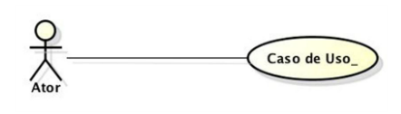
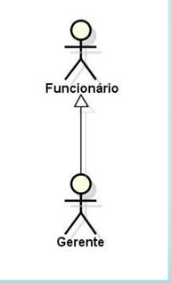
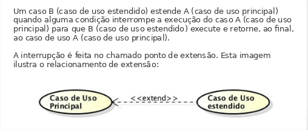

# Aula 2 - Uso e modelagem de requisitos

**Requisitos de um sistema: O software precisa ter as funcionalidades adequadas para satisfazer as necessidades de seus usuários.**

A UML (linguagem unificada de modelagem) disponibiliza para esse fim o diagrama de casos de uso, cuja finalidade é mapear as funcionalidades do sistema, evidenciando os atores que com elas interagem.

**Levantamento de requisitos: os requisitos são necessidades dos usuários que os sistemas precisam atender.**

As atividades de levantar e identificar os requisitos são fundamentais para todo o processo de desenvolvimento de sistemas, pois uma vez conhecidas as reais necessidades de seus usuários poderemos desenvolver o sistema adequado.
Em contrapartida, se as necessidades identificadas não forem as reais, o sistema não atenderá ao que seus usuários precisam, e a tendência é que seja descartado.

**Tipos de requisitos:**

- **Funcionais:** representam as funcionalidades necessárias para atender as necessidades dos usuários do sistema.

- **Não funcionais:** Apresentam restrições e qualidades do sistema e suas funcionalidades. Eles representam os atributos e propriedades do sistema. Os requisitos não funcionais podem representar também propriedades de uma função específica.

**Diagrama de casos de uso: tem como objetivo apresentar os requisitos funcionais do sistema.**

Elementos do diagrama de casos de uso:

- Os atores
- Os casos de uso
- Os relacionamentos

**Ator:** algo com comportamento, que interage diretamente com o sistema. Um ator participa (realiza) um ou mais casos de uso do sistema. A representação do ator, no diagrama de casos de uso, é o boneco, chamado de stickman.
Pode representar: 

- Papéis internos (Gerente de Compras) ou externos (Cliente e Fornecedor)
- Setores e departamentos da empresa (Contabilidade e Contas a Pagar), bem como funções desempenhadas na empresa (almoxarifado).
- Dispositivos eletrônicos, como por exemplo hardware e servidores, ou dispositivos lógicos, como sistemas.

*Identificando atores:*

- Quais órgãos, empresas ou pessoas farão uso deste sistema de informação?
- Que sistemas ou equipamentos irão se comunicar com o sistema que será desenvolvido?
- Quem deve ser informado de alguma ocorrência no sistema?
- A quem pode interessar os requisitos funcionais do sistema?

**Casos de uso:** um caso de uso é uma descrição narrativa de uma sequência de eventos que ocorre quando um ator usa um sistema para realizar uma tarefa. Os casos de uso representam, através de elipses, as funcionalidades do sistema.
    Ex: Sendo uma funcionalidade, o nome do caso de uso deve ser composto por um verbo no Infinitivo + complemento verbal, como o exemplo acima: “Matricular em Curso”.

*Identificando casos de uso:*

- **Objetivos dos atores:** Estes casos de uso representam os processos da empresa, e algumas perguntas são úteis neste momento:

    - Quais as necessidades e objetivos de cada ator em relação ao sistema?
    - Que informações serão produzidas pelo sistema?
    - O sistema realizará alguma ação que ocorre de forma regular no tempo?
    - Existe um caso de uso para atender cada requisito funcional?

- **Casos de uso que não representam um benefício direto** para os atores, mas são necessários para o funcionamento do sistema. Tais casos de uso englobam manutenção de cadastros e de informações provenientes de outros sistemas.

Cenários: é uma sequência específica de ações que ilustra o comportamento do caso de uso.

Relacionamento ou associações: o diagrama de casos de uso possibilita a existência de relacionamentos entre:

- atores e casos de uso
    - mais comum
    - indicado por uma linha sólida
    - ator interage com o caso de uso
    - **ator realiza o caso de uso**
    - comunicação é bidirecional: ator informa dados ao caso de uso e recebe informações por ele processadas

- atores entre si
    - relacionamento de generalização/especialização
    - representado por uma linha sólida com uma seta na extremidade que aponta para o ator geral
    - ator geral é o “Funcionário” e o ator especialista, o “Gerente”. Este também exerce as atividades de um funcionário, porém como gerente tem tarefas específicas a sua função.

- casos de uso entre si
    - três tipos de relacionamentos:
        - Inclusão (include ou uses);
            - caso de uso principal incorpora explicitamente o comportamento de outro caso de uso (incluído) (PARTE INTEGRANTE DO CASO DE USO PRINCIPAL) 

        - Extensão (extend);
            - usado para descrever cenários opcionais em um caso de uso, uma variação do comportamento normal. 

        - Generalização.
            - um caso de uso é semelhante a outro, mas executa algumas funções a mais.
            - pouco usado 