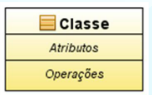
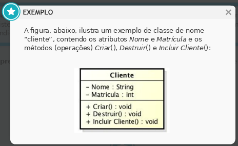
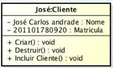
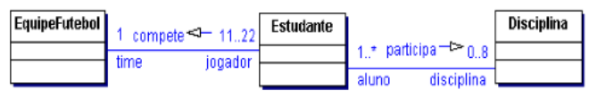
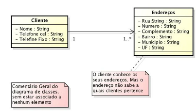

# Aula 4 - Diagrama de classes

Diagrama de classes = principal diagrama da UML (mais amplamente usado)
Vários níveis de diagramas de classes: são usados no nível de **domínio (conceitual)** e de **projeto.**

**Não se devem representar estruturas de projeto (interfaces, chaves, arquivos, campos etc.).  O foco da análise é o negócio.**

## Modelo conceitual de classes

Usa os elementos mais básicos do diagrama de classes.
Finalidade: representar os objetos (objetos = iguais ao mundo real)

Descreve de **forma gráfica**, todos os **tipos de objeto** que interagem para realizar as **funcionalidades previstas** em um sistema e vários **tipos de relacionamentos estáticos** entre eles.
Propriedades e operações de uma classe e as restrições relacionadas à forma como os objetos se relacionam.

O diagrama de classes **evolui** à medida que o projeto **avança.**

**1º momento:**

- apresenta classes do negócio (entidades)
- chama-se diagrama de classes conceitual
- compatível com as funcionalidades dos casos de uso; mostra a modelagem em classes dos requisitos essenciais do sistema.

**2º momento:**

- novas classes podem ser inseridas no diagrama de classes, como as de **controle** e as de **interface** (ou **fronteira**)
    - Classe de **fronteira** ou **interface:** responsável pela **interação com os atores.**
    - Classes de **controle:** coordenação da **interação entre os objetos**, na realização de um caso de uso. **Cada caso de uso = uma classe de controle.**

**Fase de projeto:** o mesmo diagrama pode ser refinado com a inserção de:

- Multiplicidades e papéis;
- Relacionamento entre as classes;
- Novos métodos (como, por exemplo, get, set e formatações);
- Novos atributos;
- Parâmetros nas chamadas dos métodos;
- Visibilidade dos atributos e métodos;
- Novas classes, chamadas de classes de projeto (como representação de persistência).

**Fase de implementação:** codificação na linguagem

- novas classes podem surgir
- diagrama de classes de implementação

**Conceito de classe:** abstração da realidade, representando algo do mundo real.
Na UML, uma classe é representada por **um compartimento** contendo três partes.

|**classe**    |*nome da classe*|
|:-------|:-------|
|** atributos**|*dados que se retêm da classe*|
|**operações** |*procedimentos que a classe executa, para prestar seu serviço ao sistema = métodos*|

## Classe x Objeto

|**Classe**    |**Objeto**|
|:-------:|:-------:|
|molde de um conjunto de objetos afins (mesmas características)| é uma instância de uma classe|

Ao modelarmos um sistema, estamos em busca de classes, e não de objetos. Poderíamos pensar que o nome da técnica deveria chamar-se “orientação a classes”, e não “orientação a objetos”.

## Elementos do diagrama de classes
1. Classes, com atributos e operações (métodos) de cada uma;
2. Relacionamentos entre as classes;
3. Multiplicidade dos relacionamentos;
4. Visibilidade de atributos e métodos;
5. Nome dos relacionamentos e papel nos relacionamentos;
6. Navegabilidade nos relacionamentos;
7. Notas e comentários.

**1. Classes, com atributos e operações (métodos) de cada uma;**
Cada classe possui os seus atributos e operações específicos

- **Atributo:** conjunto de características (estado) dos objetos da classe. Ele descreve uma **propriedade estrutural da classe,** um **dado relevante** que desejamos armazenar daquela classe. Forma mínima de representar um atributo: **visibilidade Nome: tipo.**

- **Operações:** conjunto de operações (comportamento) que a classe fornece. A operação de uma classe é representada por um método = procedimento ou função da classe. Forma mínima de representar um método: **visibilidade Nome (Lista de parâmetros) : tipo.**

[PDF - Diagramas de UML](../../media/modelagem_de_sistemas/aula04/pdf/atributos_e_operacoes.pdf)

**2. Relacionamentos entre as classes;**
**Associação:** mais simples e comum relacionamento entre as classes. Ocorre entre uma, duas ou mais **classes distintas, não correlatas e independentes.** Ao final do relacionamento, as classes permanecem com suas **vidas próprias.**

- **Associação binária:** mais comum; associação entre duas classes.
- **Autoassociação:** associação unária; ocorre com a mesma classe, uma classe se relaciona com ela própria.
- **Associação exclusiva:** restrição em duas ou mais associações; indica que objetos de uma determinada classe podem participar de no máximo uma das associações, em determinado momento; representada por uma linha tracejada, com a especificação {ou}, denotando que o relacionamento é exclusivo a somente uma das duas classes.

**3. Multiplicidade dos relacionamentos;**
Indica quantos objetos de cada classe podem estar envolvidos no relacionamento.

|**Multiplicidade**|**Significado**|
|:------------------|:---------------|
|1|Exatamente um|
|1..*|Um ou vários (muitos)|
|0..*|Nenhum (zero) ou vários (muitos)|
|*|Muitos. A leitura é nenhum (zero) ou vários (muitos)|
|0..1|Nenhum (zero) ou um|
|m..n|Faixa de valores. Ex: 1 a 3, 4 a 7 ou 6 a 11.|

**Exemplo:**

A classe EQUIPEFUTEBOL tem de 11 a 22 ESTUDANTES -> 11..22 do lado da classe ESTUDANTE;
A classe ESTUDANTE pode participar de NENHUMA e até 8 DISCIPLINAS -> 0..8 do lado da classe DISCIPLINA.

**4. Visibilidade de atributos e métodos;**
Quais classes podem ver (visualizar) o que de outra classe. Cada classe tenha elementos privados e públicos.

- **Público:** pode ser visualizado e usado por qualquer outra classe.
- **Privado:** pode ser usado apenas pela classe proprietária.

A UML permite que se rotule todo atributo e método de uma classe e com um indicador de visibilidade.

|Visibilidade|Comentários|
|:-----------|:----------|
|+Público|qualquer classe pode usar o método ou atributo|
|-Privado|apenas a própria classe pode usar o método ou atributo|
|~Pacote|apenas classes dentro do pacote podem usar o método ou atributo|
|#Protegido|apenas a subclasse (herança) ou classe especializada pode usar o atributo ou método|

- **Encapsulamento:** atributos de uma classe não devem ser usados por outras classes e sim apenas por métodos da própria classe. **Conclusão: visibilidade privada (-);**
- Uma classe deve **prestar serviço** as demais através de seus **métodos.** Pelo menos um dos métodos da classe deve ter **visibilidade pública** para que as demais classes possam usá-lo;
- Em um relacionamento de **generalização/especialização,** todos os **atributos e métodos** que desejar que sejam herdados pela classe especializada (subclasse) devem ter **visibilidade protegida na classe geral** (superclasse).

**5. Nome dos relacionamentos e papel nos relacionamentos;**

- **Classe de associação:** surge do **relacionamento de associação** entre outras duas classes.
- **Generalização/especialização (herança):** relacionamento que implementa o conceito de **herança**, com reaproveitamento de código.
- **Agregação e composição:** tipo **"toda-parte"**, ou seja, existe uma classe que denota um todo e outras que denotam as partes.
- **Dependência:** existe entre duas classes se: **mudanças na definição de uma classe puder demandar mudanças na definição da outra classe.**

**6. Navegabilidade nos relacionamentos;**
Mostra a **direção da navegação.**

**7. Notas e comentários.**
Notas são **comentários** nos diagramas; podem ser **isoladas ou vinculadas**, por linha tracejada, a um dos elementos do diagrama. Podem ainda ser usadas em qualquer diagrama.
exemplo:

[Exercícios](../../media/modelagem_de_sistemas/aula04/pdf/exe.pdf)

[Exercícios - Gabarito](../../media/modelagem_de_sistemas/aula04/pdf/exe_gabarito.pdf)
