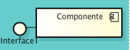
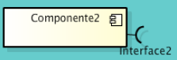
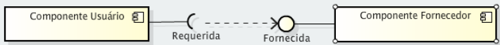
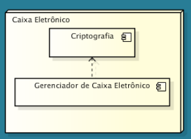

# Aula 9 - Diagrama de componentes e implantação 

## Diagrama de Componentes 

Mostra os componentes de um sistema e suas dependências. São úteis para a modelagem da arquitetura física de um software, apresentando os componentes físicos, suas interfaces e dependências. Esse diagrama permite o desenvolvimento baseado em componentes, em que um software é dividido em componentes e interfaces reutilizáveis e substituíveis.  

A ideia do uso de componentes em software é: **conjunto de componentes, com interfaces bem definidas, que podem ser integrados a qualquer sistema e substituídos sempre que necessário.**

## Componentes 

Um componente representa uma parte modular de um sistema que encapsula seu conteúdo e cuja manifestação é substituível dentro de um ambiente. 

Um componente define seu comportamento em termos de interfaces fornecidas e requeridas. Como tal, serve como um tipo, cuja conformidade é definida por essas interfaces fornecidas e requeridas. 

O componente encapsula (protege) o seu conteúdo, e seu comportamento é definido em função de prover e requerer serviços, através de suas interfaces. O desejo é que o componente possa ser independente e intercambiável. Em um sistema baseado em componentes, cada componente tem uma finalidade, ou seja, presta um serviço, e para tal, demanda o uso de outros componentes.  

## Interfaces 

Interfaces são elementos que definem um conjunto de operações que outros elementos, como classes ou componentes, devem implementar. Um mesmo componente pode tanto fornecer como requerer interfaces. O relacionamento entre os componentes e as interfaces é a essência dos sistemas. 

 
**Interfaces fornecidas:** Descrevem os **serviços oferecidos a outros componentes**. Um componente pode declarar quantas interfaces fornecidas forem necessárias. 

**Interfaces requeridas:** São as interfaces **usadas pelo componente, quando solicita serviços de outros componentes**. Um componente pode ter várias interfaces requeridas.

## Componentes e interfaces 

Para usar um componente, precisamos saber as possíveis interfaces. Existem duas maneiras de representar o relacionamento entre componentes e interface. 

Nesta representação, o componente que usa a interface se conecta ao outro componente por meio do relacionamento de dependência. O componente que fornece a interface é conectado a ela pelo relacionamento de realização (entre o componente fornecedor e a interface). 

O componente que usa a interface (componente usuário) é a ela conectado pelo relacionamento de dependência (entre o componente usuário e a interface). O relacionamento de dependência determina que um componente pode usar os serviços ou depender de outro elemento do sistema.

## Diagrama de implantação 

Mostra o layout físico de um sistema, revelando quais partes do software são executadas em quais partes do hardware (fowler). Enfoca a estrutura física sobre a qual o software vai executar. Define como as máquinas estarão conectadas e através de quais protocolos se comunicarão. **Seus elementos são os nós e as conexões entre eles**. Essas conexões representam um caminho de comunicação entre os nós. Assim como as associações, possuem nome e multiplicidade. Portanto, **um diagrama de implantação mostra o local onde os componentes e artefatos são utilizados no sistema em funcionamento.**

## Nó 

Um nó, em um diagrama de implantação, representa um recurso computacional de um sistema, como servidores, impressoras, terminais remotos, computadores pessoais, dentre outros. Em geral, o nó é identificado por um nome, que o descreve, conforme esta imagem: 

Podemos representar, em diagramas de implantação, a existência de componentes dentro de um nó, conforme estes exemplos: 

Nesse caso, representamos a relação de dependência entre os componentes. 

A possibilidade de representar os componentes que vão executar em um nó é positivo no sentido de possibilitar a definição da configuração do nó, tanto em termos de capacidade de processamento como de memória principal e secundária (discos). 

## Caminhos de comunicação (conexões) 

Os nós em um diagrama de implantação são conectados por caminhos de comunicação, que é um **relacionamento de associação**, em que podem constar: **multiplicidade, papel e nome do relacionamento** (em geral, pelo tipo de protocolo de comunicação). Neste caso, a associação representa uma conexão física entre os nós. 

Exemplo de dois nós representando um sistema cliente-servidor, onde o caminho de comunicação é o protocolo TCP/IP, através da internet: 

