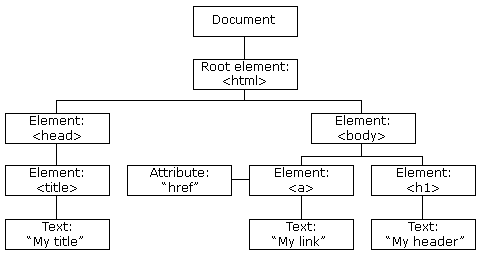
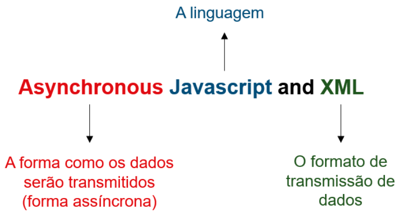

#Aula 1 - Programação Cliente com Javascript

## Incorporando o Javascript (JS) em páginas HTML 
 
Para incorporar ao documento HTML, podemos fazer de duas formas: 
* Inserindo o código JS na seção `<head>`, ao final da página, dentro da tag `<script>` 
* Incorporando um arquivo externo, contendo apenas código JS, também é possível fazer uso da tag `<script>` 
 
Considere sempre manter seu código Javascript em um arquivo externo, com a extensão “.js”. Além disso, sempre que possível, incorpore o script externo ao final da página HTML – imediatamente antes do fechamento da tag `<body>`. Além de tornar o carregamento da página mais rápido, uma vez que ela é renderizada de cima pra baixo – ou seja, ao encontrar a tag `<script>` logo no `<head>,` o navegador só continuará a carregar o restante da página após interpretar e executar todo o código JS. Essa boa prática também permite que elementos da página sejam manipulados pelo JS, pois ele será carregado apenas após todos os elementos já estarem disponíveis. Por outro lado, caso algum conteúdo ou funcionalidade da página dependa do JS para ser corretamente exibido, será necessário mantê-lo no `<head>`. Em resumo: avalie caso a caso. 
 
Exemplos: 
 
```html 
<!doctype html> 
<html lang="pt-BR"> 
<head> 
  <meta charset="utf-8"> 
  <title>Incorporação de JS em Páginas HTML</title> 
</head> 
<body> 
  <!-- Códigos HTML --> 
  <!-- Fim dos Códigos HTML --> 
  <!-- Incorporação do JS externo --> 
  <script type="text/javascript" src="script.js"></script> 
</body> 
</html> 
``` 
 
```html 
<!doctype html> 
<html lang="pt-BR"> 
<head> 
  <meta charset="utf-8"> 
  <title>Incorporação de JS em Páginas HTML</title> 
  <!-- Incorporação do JS interno --> 
  <script type="text/javascript"> 
  /* Códigos Javascript */ 
  </script> 
</head> 
<body> 
   <!-- Códigos HTML --> 
</body> 
</html> 
``` 
 
## Variáveis: escopos e tipos 
 
Quando falamos de escopo, estamos tratando do local onde uma variável existe dentro de um programa. Nesse sentido, em Javascript, uma variável pode existir a nível global ou dentro de bloco. 
 
Considere como bloco todo código escrito dentro de chaves "{ }" (estruturas condicionais, estruturas de repetição e funções, por exemplo). 
 
```html 
<!doctype html> 
<html lang="pt-BR"> 
<head> 
<meta charset="utf-8"> 
<title>Escopo de variáveis em JS</title> 
<script type="text/javascript"> 
var msg = "Conteúdo da variável msg fora do bloco de instrução"; 
//Bloco de Instrução 
//Em blocos de instrução, quando redeclarada, a variável sobrescreve a existente 
if(true){ 
var msg = "Conteúdo da variável msg dentro do bloco de instrução"; 
console.log(msg); //Imprimirá "Conteúdo da variável msg dentro do bloco de instrução" 
} 
console.log(msg); //Imprimirá "Conteúdo da variável msg dentro do bloco de instrução" 
var msg2 = "Conteúdo da variável msg2 fora do bloco de função"; 
//Bloco de Função 
//Em blocos de Função, quando redeclarada, a variável não sobrescreve a existente 
//Logo, a nova variável só existe a nível do escopo da função 
imprimeVariavel(); 
function imprimeVariavel(){ 
var msg2 = "Conteúdo da variável msg2 dentro do bloco de função"; 
var msg3 = "Conteúdo da variável msg3 - só existente dentro do bloco de função"; 
console.log(msg2); //Imprimirá "Conteúdo da variável msg2 dentro do bloco de função" 
} 
console.log(msg2); //Imprimirá "Conteúdo da variável msg2 fora do bloco função" 
console.log(msg3); //Disparará um erro dizendo que a variável msg3 não foi definida 
</script> 
</head> 
<body> 
</body> 
</html> 
``` 
 
Em linhas gerais, uma variável em Javascript tem comportamento distinto de acordo com o bloco na qual foi declarada e teve valores atribuídos. O destaque, no código anterior, vai para a variável msg2 definida e inicializada dentro da função “imprimeVariavel”. Nesse caso, embora precedida pela palavra reservada “var”, essa variável não possui escopo global, mas local, por ter sido definida dentro da função. 
 
**Variáveis definidas dentro de funções possuem escopo local, ficando restritas ao escopo da função.** 
 
### Utilizando var, let e const 
 
**Var**: A utilização dessa palavra reservada, na declaração de variáveis, concede escopo global a elas. Ou seja, variáveis declaradas utilizando var podem ser acessadas em qualquer ponto do script, dentro e fora de blocos – com exceção dos blocos de funções, onde, como já mencionado, as variáveis possuem escopo apenas local. 
 
**Let**: A partir do lançamento do Javascript 6, tornou-se possível melhorar o controle sobre o escopo de variáveis em JS com a introdução da palavra-chave let. Embora não suportada por todos os navegadores (no Internet Explorer, ela só está disponível a partir da versão Edge), essa nova palavra reservada juntou-se às demais (var e const), tendo como função, sobretudo, restringir o acesso a variáveis a nível de bloco. Ou seja, uma variável declarada com let, dentro de um bloco, não pode ser acessada em nenhum outro local do script, a não ser no bloco em questão. Isso implica ainda que, caso declarada fora de um bloco, essa variável passa a ter escopo global, assim como as variáveis declaradas com var. 
 
**Const**: Nas linguagens de programação, uma variável declarada como constante (const) é uma variável cujo valor é fixo, ou seja, o valor atribuído a tal variável não pode ser alterado. Em Javascript, utilizamos const para declarar uma variável como constante. O seu uso é indicado para garantirmos que o valor atribuído a uma variável não será alterado ao longo da execução de nosso programa, ou seja, para assegurarmos que alterações não previstas ou indesejadas sejam realizadas no valor de determinada variável. 
 
Utilizar let, var e const permite maior controle em relação à disponibilidade das variáveis e ao seu conteúdo, evitando erros de sobrescrita ou de acesso, entre outros. 
 
## Arrow functions 
 
Podem ser definidas como uma forma mais simples de se criar funções em JS.  
 
```javascript 
const multiplicacao = (n1, n2) => { 
  return n1 * n2; 
} 
console.log(multiplicacao(3, 2)); //imprimirá 6 
``` 
 
```javascript 
const multiplicacao = (n1, n2) => n1 * n2; 
console.log(multiplicacao(3, 5)); //imprimirá 15 
``` 
 
```javascript 
var cores = [ 
  { id: 1, nome: 'Amarelo' }, 
  { id: 2, nome: 'Verde' }, 
  { id: 3, nome: 'Azul' }, 
  { id: 4, nome: 'Branco' }, 
  { id: 5, nome: 'Preto' } 
]; 
//Caso você queira extrair apenas os nomes do array 'cores' 
//Exemplo 1: utilizando um laço foreach 
//Criando um novo array para receber os nomes 
var nomesCores = []; 
//Percorrendo o array cores e atribuindo ao novo array os nomes 
cores.forEach(function (cor) { 
  nomesCores.push(cor.nome); 
}); 
console.log(nomesCores); //imprimirá ["Amarelo", "Verde", "Azul", "Branco", "Preto"] 
//Exemplo 2: utilizando arrow function 
const coresNomes = cores.map(cor => cor.nome); 
console.log(coresNomes); //imprimirá ["Amarelo", "Verde", "Azul", "Branco", "Preto"] 
``` 
 
## Eventos 
 
Os eventos são responsáveis por fornecer interatividade a uma página HTML, fazendo uso da linguagem Javascript. Por exemplo: o clique do mouse em um link que abre uma janela modal ou revela um conteúdo até então escondido, como um submenu, faz uso de eventos. 
 
```javascript 
<!doctype html> 
<html lang="pt-BR"> 
<head> 
  <meta charset="utf-8"> 
  <title>Eventos em Javascript</title> 
</head> 
<body onload="escondeTexto()"> 
  <h1 id="titulo">Clique em qualquer lugar nesse texto para ver o conteúdo escondido.</h1> 
  <p id="texto_escondido">Texto escondido, que só será mostrado após click na texto acima.</p> 
<script type="text/javascript"> 
function escondeTexto(){ 
  var eP = document.getElementById("texto_escondido"); 
  eP.style.display = "none"; 
} 
var hP = document.getElementById("titulo"); 
hP.onclick = function(){ 
  document.getElementById("texto_escondido").style.display = "block"; 
} 
</script> 
</body> 
</html> 
``` 
 
## A biblioteca JQuery 
 
O jQuery é uma biblioteca Javascript rápida, pequena e rica em recursos. Tal biblioteca simplifica o processo de manipulação de documentos HTML, manipulação de eventos, animação e Ajax, com uma API fácil de usar, que funciona em vários navegadores (jQuery, 2020). 
 
Para incluir o JQuery no código, podemos fazer de duas formas: 
* Realizar o download com armazenagem local 
* Criar um link a partir de um repositório remoto 
 
Além disso, é importante saber que há versões diferentes, com tamanhos diversos. Ou seja, além de estar em contínua evolução, são disponibilizados diferentes pacotes: completos, compactados e slim. Esse último exclui alguns recursos, como os módulos AJAX e o módulo de efeitos. 
 
## Manipulando a árvore DOM 
 
A árvore DOM disponibiliza uma representação estruturada do documento HTML em formato de árvore. Logo, a partir desse modelo, temos acesso a qualquer elemento de uma página. 
 
 

### Selecionando elementos 
 
Podemos referenciar qualquer elemento da página HTML utilizando o objeto `$(seletor)`. Tal seletor pode ser um elemento DOM, um array contendo um conjunto de elementos DOM ou um objeto. 
 
```javascript 
<!doctype html> 
<html lang="pt-BR"> 
<head> 
  <meta charset="utf-8"> 
  <title>jQuery</title> 
  <script type="text/javascript" src="https://code.jquery.com/jquery-3.5.1.js"></script> 
</head> 
<body> 
  <p id="paragrafo_texto">Texto do parágrafo</p> 
  <ul> 
    <li class="item_lista">Primeiro item</li> 
    <li class="item_lista">Segundo item</li> 
    <li class="item_lista">Terceiro item</li> 
  </ul> 
  <script type="text/javascript"> 
  //imprimirá Texto do parágrafo 
  console.log($("#paragrafo_texto").html()); 
  //imprimirá Primeiro item 
  console.log($('.item_lista').eq(0).html()); 
  </script> 
</body> 
</html> 
``` 
 
No seletor, pode ser usada aspas duplas ou simples. Para id, o seletor tem "#". Para classe, o seletor usa ".". O método "eq" recebendo 0 como parâmetro, seleciona o primeiro elemento. 
 
Podemos também selecionar elementos usando o ":not": 
 
```javascript 
console.log($('li:not(.item_lista)').html()); 
``` 
 
Assim, irá selecionar os elementos que não possuírem a classe. 
 
### Adicionando e removendo elementos 
 
```html 
<!doctype html> 
<html lang="pt-BR"> 
<head> 
  <meta charset="utf-8"> 
  <title>jQuery</title> 
  <script type="text/javascript" src="https://code.jquery.com/jquery-3.5.1.js"></script> 
</head> 
<body> 
  <div> 
    <h1>Título na primeira div</h1> 
  </div> 
  <div> 
    <h2>Subtítulo na segunda div</h1> 
  </div> 
  <ul id="container_lista"> 
    <li class="item_lista">Primeiro item</li> 
    <li class="item_lista">Segundo item</li> 
    <li>Terceiro item</li> 
  </ul> 
  <script type="text/javascript"> 
  //Adicionando um novo item <li> ao final, dentro da tag <ul> com identificador "container_lista" 
  $('#container_lista').append('<li>Quarto Item</li>'); 
  //Adicionando uma tag <p> após cada tag <h1> e <h2> 
  $('h1,h2').after('<p>Texto do parágrafo inserido após cada tag h1 e h2 </p>'); 
  //Adicionando uma tag <h3> antes da tag <ul> com identificador "container_lista" 
  $('#container_lista').before('<h3>Subtítulo da Lista não ordenada</h3>'); 
  </script> 
</body> 
</html> 
``` 
 
Removeremos, em tempo de execução, alguns elementos inicialmente presentes no documento HTML. 
 
```javascript 
<!doctype html> 
<html lang="pt-BR"> 
<head> 
<meta charset="utf-8"> 
<title>jQuery</title> 
<script type="text/javascript" src="https://code.jquery.com/jquery-3.5.1.js"></script> 
</head> 
<body> 
<div> 
<h1>Título na primeira div</h1> 
<p>Texto do parágrafo inserido após cada tag h1 e h2 </p> 
</div> 
<div> 
<h2>Subtítulo na segunda div</h2> 
<p>Texto do parágrafo inserido após cada tag h1 e h2 </p> 
</div> 
<h3 class="item_lista">Subtítulo da Lista não ordenada</h3> 
<ul id="container_lista"> 
<li class="item_lista">Primeiro item</li> 
<li class="item_lista">Segundo item</li> 
<li>Terceiro item</li> 
<li>Quarto Item</li> 
</ul> 
<script type="text/javascript"> 
//Removendo o último parágrafo da página 
//Para acessar o primeiro elemento, utilizamos 0. Já para acessar o último, usamos -1 
$('p').eq(-1).remove(); 
//Removendo apenas os elementos <li> com a classe "item_list" 
//Repare que a tag <h3> também possui esse classe 
$('li.item_lista').remove(); 
</script> 
</body> 
</html> 
``` 
 
### Eventos 
 
**fire/fired**: Associado ao momento em que um evento é “disparado”. 
 
**listener**: Associado ao ato de “ouvir”, monitorar, um elemento à espera do disparo de um evento. 
 
**handler**: Associado à ação de manipular determinado evento. 
 
## Eventos onload e window.onload 
 
O evento onload ocorre quando um objeto, em uma página HTML, termina de ser carregado. Tal evento é normalmente utilizado na tag `<body>`, tornando possível que determinada ação seja realizada através de funções JS, quando a tag em questão terminar de carregar. Isso implica dizer que todas as imagens, scripts e arquivos CSS já foram carregados. Tal evento também pode ser utilizado com outras tags, como `<frame>`, `<iframe>`, ``, `<input type=’image’>`, `<link>`, `<script>` e `<style>`.
 
```javascript 
<!doctype html> 
<html lang="pt-BR"> 
<head> 
  <meta charset="utf-8"> 
  <title>Evento onload</title> 
  <script type="text/javascript" src="https://code.jquery.com/jquery-3.5.1.js"></script> 
</head> 
<body onload="alert('O <body> terminou de ser carregado')"> 
  <!-- Conteúdo HTML --> 
</body> 
</html> 
``` 
 
Assim como o evento onload, o evento window.onload ocorre quando determinado conteúdo é completamente carregado. Em JS, o objeto window está relacionado à janela do navegador – que contém um elemento DOM. Já o objeto document está relacionado ao DOM carregado na janela em questão. Portanto, o evento window.onload também é disparado quando todo o conteúdo da página é carregado. 
 
```javascript 
<!doctype html> 
<html lang="pt-BR"> 
<head> 
  <meta charset="utf-8"> 
  <title>Eventow window.load e document.load</title> 
  <script type="text/javascript" src="https://code.jquery.com/jquery-3.5.1.js"></script> 
</head> 
<body> 
  <div id="lipsum"> 
    <p> Lorem ipsum dolor sit amet, consectetur adipiscing elit. Sed justo ipsum, rhoncus at orci vel, aliquam consequat lorem. Integer congue enim quis semper mattis. Aenean augue libero, maximus et odio nec, malesuada tristique felis. Donec dignissim libero id pulvinar faucibus. Phasellus blandit justo quam. Integer ex massa, rhoncus eu libero quis, fermentum feugiat odio. Sed tellus purus, fermentum ac euismod et, mattis at nunc. Nunc nisl leo, dapibus eget lorem id, congue lobortis ipsum. </p> 
  </div> 
  <script type="text/javascript"> 
    window.onload = function () { 
      alert('Evento window.load disparado'); 
    } 
  </script> 
</body> 
</html> 
``` 
 
## O evento jquery $(document).ready() 
 
O `$(document).ready()` pode ser abreviado como `$(function(){ ... });`. Através desse evento, podemos ter acesso à página assim que a árvore DOM (tags HTML) estiver disponível, o que ocorre antes que todo o conteúdo seja carregado. 
 
```javascript 
<!doctype html> 
<html lang="pt-BR"> 
<head> 
<meta charset="utf-8"> 
<title>Eventos window.onload e $(document).ready()</title> 
<script type="text/javascript" src="https://code.jquery.com/jquery-3.5.1.js"></script> 
</head> 
<body> 
<div id="lipsum"> 
<p> Lorem ipsum dolor sit amet, consectetur adipiscing elit. Sed justo ipsum, rhoncus at orci vel, aliquam consequat lorem. Integer congue enim quis semper mattis. Aenean augue libero, maximus et odio nec, malesuada tristique felis. Donec dignissim libero id pulvinar faucibus. Phasellus blandit justo quam. Integer ex massa, rhoncus eu libero quis, fermentum feugiat odio. Sed tellus purus, fermentum ac euismod et, mattis at nunc. Nunc nisl leo, dapibus eget lorem id, congue lobortis ipsum. </p> 
<p> Lorem ipsum dolor sit amet, consectetur adipiscing elit. Sed justo ipsum, rhoncus at orci vel, aliquam consequat lorem. Integer congue enim quis semper mattis. Aenean augue libero, maximus et odio nec, malesuada tristique felis. Donec dignissim libero id pulvinar faucibus. Phasellus blandit justo quam. Integer ex massa, rhoncus eu libero quis, fermentum feugiat odio. Sed tellus purus, fermentum ac euismod et, mattis at nunc. Nunc nisl leo, dapibus eget lorem id, congue lobortis ipsum. </p> 
<p> Lorem ipsum dolor sit amet, consectetur adipiscing elit. Sed justo ipsum, rhoncus at orci vel, aliquam consequat lorem. Integer congue enim quis semper mattis. Aenean augue libero, maximus et odio nec, malesuada tristique felis. Donec dignissim libero id pulvinar faucibus. Phasellus blandit justo quam. Integer ex massa, rhoncus eu libero quis, fermentum feugiat odio. Sed tellus purus, fermentum ac euismod et, mattis at nunc. Nunc nisl leo, dapibus eget lorem id, congue lobortis ipsum. </p> 
 
 
 
 
 
</div> 
<script type="text/javascript"> 
window.onload = function () { 
alert('Evento window.load disparado'); 
} 
$(function () { 
//$('div p').before('<h1>Lorem Ipsum</h1>') 
alert('Evento document.ready disparado'); 
}); 
</script> 
</body> 
</html> 
``` 
 
Na biblioteca jQuery, também está disponível uma implementação do evento window.load, o $( window ).on(“load”, function () { ... }) . 
 
## Os eventos click() e on() 
 
Esse evento vincula um manipulador (handler) ou disparador (trigger) ao evento Javascript “click”. A ação relacionada a esse evento é disparada quando o botão do mouse é pressionado e, a seguir, liberado, sobre um elemento na página. Cabe destacar que qualquer elemento pode receber tal evento. 
 
```javascript 
<!doctype html> 
<html lang="pt-BR"> 
<head> 
<meta charset="utf-8"> 
<title>Evento click</title> 
<script type="text/javascript" src="https://code.jquery.com/jquery-3.5.1.js"></script> 
</head> 
<body> 
<ul> 
<li>Item 1</li> 
<li>Item 2</li> 
<li>Item 3</li> 
<li>Item 4</li> 
<li>Item 5</li> 
</ul> 
<script type="text/javascript"> 
$('ul li').click(function () { 
console.log('Conteúdo do item da lista: ' + $(this).text()); 
}); 
//Adicionando, dinamicamente, um novo elemento <li> à lista 
$('ul').append('<li>Item 6</li>'); 
</script> 
</body> 
</html> 
``` 
 
## Eventos de teclado e mouse 
 
Em jQuery, estão disponíveis alguns eventos relacionados ao teclado e ao mouse. É possível manipular, por exemplo, o evento disparado quando determinada tecla é pressionada ou os eventos de mouseover, entre outros. 
 
```javascript 
<!doctype html> 
<html lang="pt-BR"> 
<head> 
<meta charset="utf-8"> 
<title>Eventos de teclado e mouse</title> 
<script type="text/javascript" src="https://code.jquery.com/jquery-3.5.1.js"></script> 
</head> 
<body> 
<ul> 
<li>Item 1</li> 
<li>Item 2</li> 
<li>Item 3</li> 
<li>Item 4</li> 
<li>Item 5</li> 
</ul> 
<form> 
<input type="text" name="inpt" id="inpt" /> 
</form> 
<script type="text/javascript"> 
//Evento mouseover 
$('ul').on('mouseover', 'li', function () { 
console.log('Conteúdo do item da lista: ' + $(this).text()); 
}); 
//Evento mouseleave 
$('ul').on('mouseleave', 'li', function () { 
console.log('O mouse não está mais sobre o elemento da lista'); 
}); 
//Evento keypress 
$('#inpt').keypress(function (event) { 
event.preventDefault(); 
console.log('A tecla pressionada foi: ' + event.which); 
}); 
</script> 
</body> 
</html> 
``` 
 
## Método preventdefault() 
 
A sua função é, quando chamado, impedir que a ação padrão de um evento não seja disparada. 
 
```javascript 
<!doctype html> 
<html lang="pt-BR"> 
<head> 
<meta charset="utf-8"> 
<title>Método preventDefault</title> 
<script type="text/javascript" src="https://code.jquery.com/jquery-3.5.1.js"></script> 
</head> 
<body> 
<p> 
<a id="lnk" href="outra-pagina.html">Link para outra página</a> 
</p> 
<form action="script.php"> 
<input type="text" name="inpt" id="inpt" /> 
<input type="submit" name="inpt_sbmt" id="inpt_sbmt" value="Enviar o Formulário" /> 
</form> 
<script type="text/javascript"> 
//Click do link 
$('#lnk').click(function (event) { 
event.preventDefault(); 
console.log('Nada aconteceu ao clicar no link'); 
}); 
//Click do botão do formulário 
$('#inpt_sbmt').click(function (event) { 
event.preventDefault(); 
console.log('Nada aconteceu ao clicar no botão do formulário'); 
}); 
</script> 
</body> 
</html> 
``` 
 
O comportamento normal do link ao ser clicado é abrir a página contida no atributo “href”. Já o comportamento esperado do botão de submissão do formulário é navegar para o local definido no seu atributo action. 
 
Nenhuma dessas ações padrão foram executadas, e é pra isso que serve o método `event.preventDefault()`, para impedir que a ação default de determinado evento seja executada. Sua utilidade, na prática, é diversa, uma vez que nos permite não só impedir o comportamento normal, mas definir outro comportamento para os eventos. Um exemplo: você pode usá-lo para submeter os dados de um formulário via AJAX, impedindo que a página seja recarregada e que, por padrão, a submissão do formulário o leve a outra página. 
 
## O que é AJAX? 
 
Essa sigla significa Asynchronous Javascript and XML ou Javascript e XML Assíncronos.  
 
 

Isso implica na submissão de requisições, a partir de uma página web, sem interrupção em seu fluxo. Em outras palavras, a partir de requisições assíncronas, é possível requisitar recursos remotos, transferir dados e utilizá-los na página sem a necessidade de recarregá-la. 
 
## A interface jQuery.ajax() 
 
Para realizar requisições assíncronas através de jQuery, fazemos uso da interface jQuery.ajax(). A sintaxe desse método é composta pela URL para a qual submeteremos a requisição e por um parâmetro, no formato de objeto, que contém informações adicionais relacionadas à requisição. 
 
`jQuery.ajax(url[, settings])` 
 
```javascript 
<!doctype html> 
<html lang="pt-BR"> 
<head> 
<meta charset="utf-8"> 
<title>Requisições AJAX com jQuery</title> 
<script type="text/javascript" src="https://code.jquery.com/jquery-3.5.1.js"></script> 
</head> 
<body> 
<p> 
<a id="lnk" href="javascript:void(0);">Executar a requisição AJAX</a> 
</p> 
<!-- Esse div mostrará o resultado da requisição AJAX --> 
<div id="resultado"></div> 
<script type="text/javascript"> 
//Click do link 
$('#lnk').click(function () { 
$.ajax({ 
url: "url/recurso", 
type: 'post', 
beforeSend: function () { 
//A função beforeSend é chamada antes da requisição ser submetida. 
//Dependendo da velocidade do retorno da requisição, a msg abaixo pode não chegar 
// a ser exibida 
$("#resultado").html("Carregando..."); 
} 
}) 
.done(function (msg) { 
//Em caso de sucesso, mostra na div #resultado o retorno da requisição 
$("#resultado").html(msg); 
}) 
.fail(function (jqXHR, textStatus, msg) { 
//Em caso de fracasso, mostra no console a mensagem de erro retornada 
console.log('A requisição falhou e retornou com a seguinte mensagem: ' + msg); 
}); 
}); 
</script> 
</body> 
</html> 
``` 
 
Exemplo: 
 
```javascript 
<!doctype html> 
<html lang="pt-BR"> 
<head> 
<meta charset="utf-8"> 
<title>Requisições AJAX com jQuery</title> 
<script type="text/javascript" src="https://code.jquery.com/jquery-3.5.1.js"></script> 
</head> 
<body> 
<p> 
<a id="lnk" href="javascript:void(0);">Executar a requisição AJAX</a> 
</p> 
<!-- Esse div mostrará o resultado da requisição AJAX --> 
<div id="resultado"></div> 
<script type="text/javascript"> 
//Click do link 
$('#lnk').click(function () { 
$.ajax({ 
url: "https://reqres.in/api/users", 
type: 'post', 
data: { 
name: "Jose Maria", 
movies: ["Sem igual", "Incomparável"] 
}, 
beforeSend: function () { 
//A função beforeSend é chamada antes da requisição ser submetida. 
//Dependendo da velocidade do retorno da requisição, a msg abaixo pode não chegar 
// a ser exibida 
$("#resultado").html("Carregando..."); 
} 
}) 
.done(function (msg) { 
//Em caso de sucesso, mostra na div #resultado o retorno da requisição 
//console.log('Retorno: ' + JSON.stringify(msg) ); 
//console.dir(msg); 
/* 
//Assim como o método $.each, esse método percorre um array 
$.map(msg["movies[]"] , function( val, i ) { 
console.log(val); 
}); 
*/ 
var content = ''; 
$.each(msg["movies[]"], function (index, value) { 
content += value + ' - '; 
}); 
$("#resultado").html('Nome: ' + msg.name + '<br/>' + 'Filmes: ' + content + '<br/>' + 'Id: ' + msg.id + '<br/>' + 'Data de Criação: ' + msg.createdAt); 
}) 
.fail(function (jqXHR, textStatus, msg) { 
//Em caso de fracasso, mostra no console a mensagem de erro retornada 
console.log('A requisição falhou e retornou com a seguinte mensagem: ' + msg); 
}); 
}); 
</script> 
</body> 
</html> 
``` 
 
1. A exemplo do código anterior, é realizada uma requisição AJAX, utilizando o método HTTP POST. 
2. A URL para a qual a requisição foi submetida pertence a um serviço online que pode responder a diversos tipos de requisição. Em nosso caso, foi criado um recurso e, a seguir, tal recurso foi devolvido como resposta à solicitação. 
3. O atributo “data” foi utilizado para enviar dados para a URL requisitada. Foram passadas uma string, name, e um array, movies. 
4. Os dados recebidos em resposta à requisição vieram no formato JSON, sendo armazenados na variável “msg”. Tais resultados foram acessados através da notação de objetos – “objeto.atributo” e concatenados para serem inseridos dentro da `<div>` onde foram exibidos na página. 
5. Entre os dados retornados, merece destaque o atributo “movies”, por se tratar de um array. Veja no código que há dois métodos, tendo um permanecido comentado, para tratar esse tipo de estrutura: o `$.map` e o `$.each.` 
 
A biblioteca jQuery possui ainda dois outros métodos para realização de requisições AJAX: 
`$.get()`: Permite que sejam feitas requisições utilizando o método HTTP GET. 
`$.post()`: Permite requisições HTTP POST (é possível enviar dados na requisição). 
 
```javascript 
//Sintaxe: $.get(URL,callback); 
$.get("/url/recurso", function(data, status){ 
alert("Dados Retornados: " + data + "\nStatus: " + status); 
}); 
//Sintaxe: $.post(URL,data,callback); 
$.post("/url/recurso", {id: 1, order: "asc"} function(data, status){ 
alert("Dados Retornados: " + data + "\nStatus: " + status); 
}); 
``` 
 
