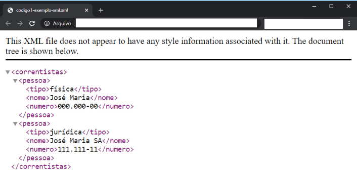
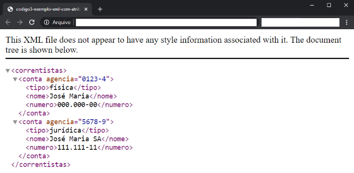
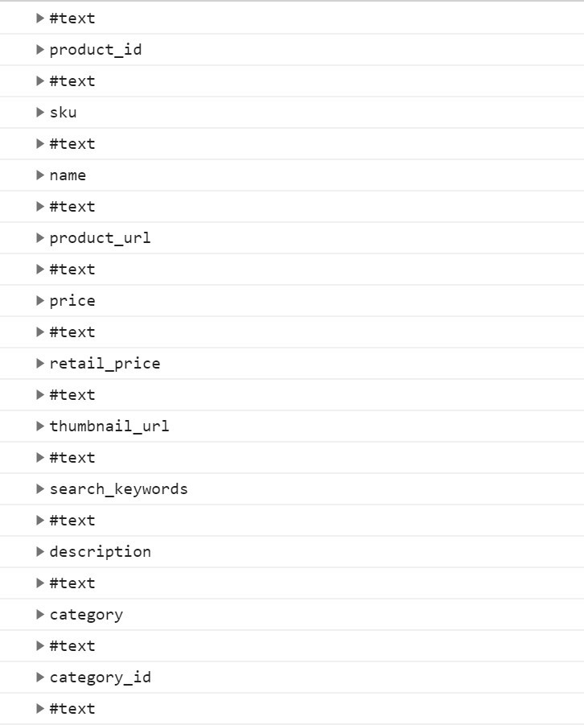
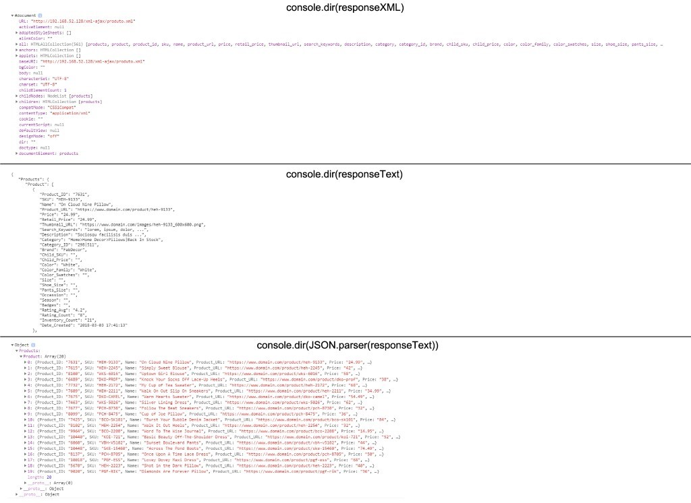

#Aula 2 – Tecnologias de transmissão de dados em sistemas web 

## A linguagem XML 
 
A linguagem XML — acrônimo para eXtensible Markup Language – é, a exemplo da HTML, uma linguagem de marcação. Criada pelo W3C (World Wide Web Consortium), em 1996, e transformada em uma recomendação pelo mesmo órgão em 1998, tal linguagem possui algumas importantes diferenças em relação à HTML, visto que foi criada justamente para ser diferente desta — em outras palavras, para estender as funcionalidades da HTML. 
 
Podemos dizer que a XML é um padrão para a formatação e transmissão de dados de fácil entendimento tanto para humanos quanto para máquinas. Sua principal característica — e diferença para HTML – é ser composta por tags definidas pelo usuário (ou programador). Ou seja, diferentemente da HTML, na qual todas as tags são predefinidas, em XML nós mesmos criamos nossas tags. 
 
A principal função e utilização da XML é transmitir dados através da web. 
 
### Anatomia de um arquivo XML 
 
Os documentos XML são constituídos por unidades de armazenamento chamadas entidades, que contêm dados. Tais dados são compostos por caracteres, alguns dos quais formam dados de caracteres enquanto outros formam a marcação (W3C, 2020) 
 
```xml 
<?xml version="1.0" encoding="UTF-8" ?> 
<correntistas> 
<!-- Nesse documento há dados de duas 'pessoas' --> 
<pessoa> 
<tipo>física</tipo> 
<nome>José Maria</nome> 
<numero>000.000-00</numero> 
</pessoa> 
<pessoa> 
<tipo>jurídica</tipo> 
<nome>José Maria SA</nome> 
<numero>111.111-11</numero> 
</pessoa> 
</correntistas> 
``` 
 
Analisando linha a linha da XML acima, temos: 
* Na **primeira linha**, a declaração XML, responsável por especificar a versão e por informar ao navegador que se trata de um arquivo XML. Nessa primeira linha, também é definido o **charset** do documento. 
* Na **segunda linha**, representado pela tag `<correntistas>,` o nó principal — ou nó raiz — do documento. 
* Entre a **segunda e a terceira**, um comentário: Repare que os comentários em um documento XML são iguais aos usados em HTML. 
* Na **terceira linha**, temos o primeiro elemento filho do nó raiz, o elemento `<pessoa>`. 
* Na **quarta, quinta e sexta linhas**, temos os elementos filhos do elemento `<pessoa>`. 
* Nas linhas seguintes, temos outro elemento `<pessoa>` e seus respectivos elementos filhos. 
 
Em termos de sintaxe, repare que:  
* Toda tag deve ser iniciada e fechada. 
* Há um aninhamento representando hierarquia entre os dados. Por exemplo: As tags `<tipo>`, `<nome>` e `<numero>` estão indentadas, aninhadas e englobadas pela tag `<pessoa>`. Da mesma forma, todas as tags filhas estão aninhadas dentro do nó principal, `<correntistas>`;  
 
Exemplo de como o documento é renderizado no navegador: 

 
Considerando sua sintaxe, dizemos que XML é um documento bem formatado. Logo, deixar de fechar uma tag ou construir um documento sem tag raiz torna o arquivo mal formatado ou inválido.  
 
### Utilizando atributos 
 
Usando esse exemplo: 
 
```xml 
<?xml version="1.0" encoding="UTF-8" ?> 
<correntistas> 
<conta agencia="0123-4"> 
<tipo>física</tipo> 
<nome>José Maria</nome> 
<numero>000.000-00</numero> 
</conta> 
<conta agencia="5678-9"> 
<tipo>jurídica</tipo> 
<nome>José Maria SA</nome> 
<numero>111.111-11</numero> 
</conta> 
</correntistas> 
``` 
 
E a renderização no browser: 

 
Em relação ao primeiro documento XML, neste último, no elemento `<conta>`, foi adicionado o atributo “agencia” e um valor para esse atributo. Logo, podemos ter em um documento XML, além dos elementos, também atributos. Inclusive, poderíamos modificar o documento anterior, trocando os elementos filhos de `<conta>` por atributos, gerando este novo documento: 
 
```xml 
<?xml version="1.0" encoding="UTF-8" ?> 
<correntistas> 
<conta agencia="0123-4" tipo="fisica" nome="José Maria" numero="000.000-00" /> 
<conta agencia="5678-9" tipo="jurídica" nome="José Maria SA" numero="111.111-11" /> 
</correntistas> 
``` 
 
Perceba que, no lugar de elementos filhos, os dados de cada conta foram armazenados diretamente no elemento `<conta>`, na forma de atributos. Sobre os atributos, como visto no exemplo, é necessário envolvê-los com aspas. Por último, veja que o elemento `<conta>` foi simplificado, sendo aberto e fechado numa única linha, com a utilização da barra antes do sinal de maior ( /> ). 
 
**Anatomia em termos conceituais: um arquivo XML é composto por: ** 
1. Dados de caracteres (sequência de texto). 
2. Instruções de processamento através de anotações, normalmente inseridas no cabeçalho do documento. 
3. Comentários, quando necessário. 
4. Declaração de entidade. 
5. Nós — Elemento rotulado com um nome ou conjunto de atributos, cada um contendo nome e valor. 
 
**Por que utilizar XML?** Como vimos, ao tratarmos de sistemas web, a aplicabilidade da XML é servir como formato de transmissão de dados. Nesse sentido, considerando que tal formato foi especificado para ser simples, de fácil leitura por humanos e computadores, temos a principal justificativa quanto à sua adoção em sistemas web. 
 
Além dessa, podemos ainda mencionar as seguintes vantagens de utilização da XML:  
* XML é auto documentado, ou seja, seu formato descreve sua estrutura, elementos e valores. 
* XML é independente de plataforma e linguagem de programação. 
* XML é facilmente interpretado pela maioria das linguagens de programação (nas quais normalmente utilizamos recursos chamados de “parsers”, responsáveis por interpretar a estrutura e dados do documento). 
* XML é extensível. Logo, podemos tanto usar entidades criadas por outros, quanto criar nossas próprias tags e atributos. 
* XML possui suporte a Unicode. 
* XML possui suporte à validação através de DTD e Schema. 
 
Convém também citar algumas desvantagens desse formato, para a transmissão de dados através da Internet, em relação a outros disponíveis:  
* A sintaxe XML é detalhada e redundante quando comparada a outros formatos baseados em texto, como JSON. 
* XML não suporta arrays. 
* Um documento XML é menos legível que outros formatos como JSON e YAML. 
* XML pode gerar arquivos grandes dada a sua sintaxe detalhada. 
 
### Manipulando um arquivo XML com a interface DOM 
 
O DOM (Document Object Model) é uma interface de plataforma e linguagem neutra que permite que programas e scripts acessem e atualizem dinamicamente o conteúdo, a estrutura e o estilo de um documento. (W3C, 2020).  
 
Utilizando a interface DOM, é possível manipular tanto documentos HTML quanto documentos XML. Em ambos, o documento, através desse objeto, é representado na forma de árvore. 
 
### XML DOM 
 
O XML DOM é um padrão para obter, modificar, adicionar ou remover elementos XML. Através dele, é possível acessar todos os elementos de um documento XML. Utilizando o documento XML apresentado anteriormente, e novamente disponibilizado a seguir, veja o código no qual, utilizando Javascript, o arquivo em questão é manipulado. 
 
**Passo 1**: 
 
```xml 
<?xml version="1.0" encoding="UTF-8" ?> 
<correntistas> 
<conta agencia="0123-4"> 
<tipo>física</tipo> 
<nome>José Maria</nome> 
<numero>000.000-00</numero> 
</conta> 
<conta agencia="5678-9"> 
<tipo>jurídica</tipo> 
<nome>José Maria SA</nome> 
<numero>111.111-11</numero> 
</conta> 
</correntistas> 
``` 
 
**Passo 2**: 
 
```html 
<!DOCTYPE html> 
<html> 
<head> 
<meta charset="utf-8"> 
</head> 
<body> 
<p id="result"></p> 
<script type="text/javascript"> 
 
//Cria o XML visto no código acima no formato de string JS 
var xmlString = '<?xml version="1.0" encoding="UTF-8" ?>  \ 
<correntistas> \ 
<conta agencia="0123-4"> <tipo>física</tipo> \ 
<nome>José Maria</nome> <numero>000.000-00</numero> \ 
</conta> \ 
<conta agencia="5678-9"> <tipo>jurídica</tipo> \ 
<nome>José Maria SA</nome> <numero>111.111-11</numero> \ 
</conta> \ 
</correntistas>'; 
 
//Converte a string acima para um documento XML válido 
var parser = new DOMParser(); 
var xmlDoc = parser.parseFromString(xmlString, "text/xml"); 
 
//Chamada a função responsável por coletar e exibir dados do XML 
manipulaXML(xmlDoc); 
 
function manipulaXML(xml) { 
document.getElementById("result").innerHTML = 
xml.getElementsByTagName("nome")[0].childNodes[0].nodeValue; 
} 
</script> 
</body> 
</html> 
``` 
 
Como visto no código, foi criada uma string JS que, a seguir, foi transformada em um documento XML válido. Estando nesse formato, foi possível manipular o seu conteúdo através do DOM. Com o método ‘getElementsByTagName’ e as propriedades “childNodes” e “nodeValue”, foi acessado o conteúdo do primeiro elemento `<nome>` e atribuído o seu valor à tag HTML `<p>`, para exibição do resultado na tela. 
 
**Propriedades XML DOM** - Estas são algumas das propriedades disponíveis cujos nomes são autoexplicativos:  
* nodeName 
* nodeValue 
* parenteNode 
* childNodes 
* attributes 
 
**Métodos XML DOM** - Em relação aos métodos, estes são alguns dos disponíveis cujos nomes são autoexplicativos:  
* getElementsByTagName(name) 
* getAttributeNode(node) 
* appendChild(node) 
* removeChild(node) 
* createElement(name) 
* createTextNode(value) 
 
### Outras formas de navegar por um documento XML 
 
**XPATH**: XPath, que é uma recomendação do W3C e possui mais de 200 funções prontas para navegar em documentos XML utilizando a sintaxe “path like”. 
*XQUERY**: XQuery, que é uma linguagem para realização de consultas no formato de queries – representando para o XML o mesmo que o SQL representa para os bancos de dados. 
 
### Recursos avançados 
 
Além dos conceitos e exemplos vistos ao longo desse módulo, há muito mais para se estudar e aprender a respeito de XML. Por exemplo: DTDs (Document Type Definition), Schemas, Entidades, Notações, tipos de dados (datas, números, strings etc.). Embora o que vimos seja o bastante para utilizar o formato XML para a transmissão de dados em sistemas web na maioria dos casos, é recomendado que, caso você precise de recursos mais avançados, leia mais a respeito desse formato. A especificação W3C é um bom ponto de partida. 
 
## O formato JSON 
 
JSON, acrônimo para Javascript Object Notation, é uma sintaxe para armazenamento e troca de dados. Trata-se de um formato de texto escrito com notação de objeto Javascript (W3C, 2020). Com JSON, é possível representar dados de forma estruturada e transmiti-los na web, enviando e recebendo dados de servidores remotos e exibindo-os em páginas HTML ou em aplicativos, por exemplo.  
 
A data de criação desse formato remete ao início dos anos 2000. Em 2001, ele foi apresentado pela primeira vez através do site json.org. A especificação mais atual do JSON é a ECMA-404. Tal especificação define um pequeno conjunto de regras para a representação estruturada de dados e seu principal objetivo é definir a sintaxe de um documento JSON válido. 
 
### A SINTAXE JSON 
 
A sintaxe JSON é composta por duas estruturas:  
Coleção de pares nome: Valor (estrutura que, nas linguagens de programação, pode ser representada por objetos, dicionário, hash table, array associativo, entre outros). 
Lista ordenada de valores (nas linguagens de programação, pode ser representada como um array, vetor, lista, sequência, entre outros).  
 
Logo a seguir, é apresentado o JSON correspondente ao XML usado anteriormente. Após o código, cada elemento JSON será descrito. 
 
```json 
{ 
  "correntistas": { 
    "conta": [ 
      { 
      "agencia": "0123-4", 
      "tipo": "física", 
      "nome": "José Maria", 
      "numero": "000.000-00" 
      }, 
      { 
      "agencia": "5678-9", 
      "tipo": "jurídica", 
      "nome": "José Maria SA", 
      "numero": "111.111-11" 
      } 
    ] 
  } 
} 
``` 
 
O código acima também pode ser chamado de texto JSON. Os dados após as chaves “agencia”, “tipo”, “nome” e “numero” são os valores JSON. O par chave: valor — como “agencia”: “0123-4” — é chamado de objeto JSON. A chave “conta” é um array. 
 
**Texto JSON**: Um texto JSON é uma sequência de tokens formados a partir de código Unicode, em conformidade com a gramática JSON. Tal conjunto de tokens possui seis tokens estruturais (e que podem ser vistos no código acima):  
* [ 
* ] 
* { 
* } 
* : 
* , 
 
**Valores JSON**: Um valor JSON pode ser:  
* Um objeto 
* Um array 
* Um número 
* Uma string 
* true 
* false 
* null 
 
**Objetos JSON**: A estrutura de um objeto JSON é representada como um par de chaves “{“ e “}” que englobam nenhum ou alguns pares de nome/valor, no qual o nome é uma string, seguido de dois pontos (:) que separam o nome do valor. Esse par “nome:valor” pode ou não ser procedido de um ou mais pares nome/valor, devendo esses serem separados por vírgula. 
 
A sintaxe JSON não determina nenhuma restrição relacionada às strings utilizadas como nome, assim como não exige que os nomes sejam exclusivos. Além disso, a especificação JSON não define nenhum significado para a ordenação dos pares nome:valor. 
 
### Arrays em JSON 
 
Um array, em JSON, é uma estrutura representada por colchetes que englobam nenhum ou alguns conjuntos de pares “nome:valor”, que deverão ser separados por vírgulas. Além disso, a sintaxe JSON não prevê nenhuma forma para ordenar os valores do array. Como mencionado no exemplo anterior, a chave “conta” é um array. 
 
### JSON na prática 
 
Vejamos como enviar, receber e armazenar dados em JSON, utilizando a linguagem Javascript. 
 
#### Enviando dados 
 
Neste exemplo, é criado um objeto Javascript, que depois é convertido em texto JSON para ser enviado para um servidor remoto, onde poderá ser processado por uma linguagem server side, como Java, PHP etc. 
 
```json 
//Cria um objeto Javacript 
var objtoJS   = {agencia: "5678-9", tipo: "física", nome: "Maria José", numero: "222.222-22"}; 
 
//Converte o objeto Javascript em texto JSON 
var textoJson = JSON.stringify(objtoJS); 
 
//Redireciona a página para o endereço especificado, passando, via GET, o texto JSON 
window.location = "processa/json/?conta=" + textoJson; 
``` 
 
#### Recebendo dados 
 
Neste exemplo, será criado um texto JSON, que será convertido em um objeto Javascript e então atribuído a um elemento HTML. Esse exemplo simula, entre outros, a situação em que, através de uma requisição AJAX, ou outro tipo de requisição, recebemos como retorno um texto JSON e precisamos manipulá-lo para acessar e utilizar seus dados. 
 
```json 
//Representa um texto JSON (que poderia ter sido recebido de uma requisição, por ex) 
var textoJson   = '{"agencia": "5678-9", "tipo": "física", "nome": "Maria José", "numero": "222.222-22"}'; 
 
//Converte o texto JSON em um objeto Javascript 
var objtoJS = JSON.parse(textoJson); 
 
//Exibe na tag html com id=resultado os dados da conta 
document.getElementById("resultado").innerHTML = 'Agência: ' + objtoJS.agencia + ' Tipo: ' + objtoJS.tipo + ' Nome: ' + objtoJS.nome + ' Número: ' + objtoJS.numero; 
``` 
 
#### Armazenando dados 
 
O exemplo, a seguir, demonstra como armazenar dados no formato JSON. Para isso, será utilizado um objeto Javascript que será convertido em texto JSON e, a seguir, armazenado. Além disso, também será demonstrado como recuperar os dados armazenados. 
 
```json 
//Cria um objeto Javacript 
var objtoJS   = {agencia: "5678-9", tipo: "física", nome: "Maria José", numero: "222.222-22"}; 
 
//Converte o objeto Javascript em texto JSON 
var textoJson = JSON.stringify(objtoJS); 
 
//Armazenando os dados no navegador 
localStorage.setItem("stringJSON", textoJson); 
``` 
 
Para recuperar esses dados: 
 
```json 
//Cria uma variável para receber o conteúdo armazenado com localStorage 
var jsonText = localStorage.getItem("stringJSON"); 
//Converte em um objeto Javascript 
jsOBJ = JSON.parse(jsonText); 
 
//Exibe o conteúdo do objeto JS com o alert 
alert('Agência: ' + jsOBJ.agencia + ' Tipo: ' + jsOBJ.tipo + ' Nome: ' + jsOBJ.nome + ' Número: ' + jsOBJ.numero); 
``` 
 
## O formato YAML 
 
YYAML, acrônimo original para “Yet Another Markup Language”, e atualmente um acrônimo recursivo para “YAML Ain´t Mark-up Language”, como o próprio nome diz, não é uma linguagem de marcação. Trata-se de uma linguagem para serialização e transmissão de dados cujo formato é amigável para humanos e de fácil entendimento para máquinas, podendo ser usada com a maioria das linguagens de programação. Assim como XML e JSON, essa linguagem, como já mencionada, é usada para a transmissão de dados na Internet. Em comparação com os outros dois formatos, sua sintaxe é parecida, em termos de estrutura, com JSON. É comum vermos esse formato sendo utilizado como arquivo de configuração ou arquivo de logs, embora não fique limitada a tais funções. 
 
**A sintaxe YAML**: Em termos de estrutura e sintaxe, a YAML tem por característica usar poucos caracteres estruturais a fim de permitir que os dados sejam exibidos de forma natural. Nesse sentido, a sintaxe de um arquivo YAML é composta por:  
Recuo/tabulação, usado como estrutura. 
Sinal de dois pontos (“:”), usado como separador do par “chave: valor”. 
Travessão, usado para a criação de listas de marcadores. 
 
Aqui vemos o mesmo exemplo anterior, em XML e JSON, agora em YAML: 
 
```yaml 
correntistas: 
  conta: 
  - agencia: 0123-4 
    tipo: física 
    nome: José Maria 
    numero: 000.000-00 
  - agencia: 5678-9 
    tipo: jurídica 
    nome: José Maria SA 
    numero: 111.111-11 
``` 
 
Como podemos ver, YAML utiliza menos tokens, ou sinais, em sua estrutura, se comparada a XML e JSON — da mesma forma que JSON o faz em relação a XML. Tal minimalismo faz com que YAML seja bastante leve. Além disso, ainda no âmbito de comparação com os outros formatos vistos, o formato YAML privilegia a leitura e compreensão por humanos, em detrimento da interpretação por linguagens de programação. Nesse ponto, ela tem comportamento inverso ao JSON, que ao custo de ser menos legível por humanos, é mais fácil de ser gerada e interpretada por linguagens de programação. 
 
### YAML na prática 
 
Vejamos, de forma prática, como trabalhar com dados armazenados com o formato YAML. No primeiro código, será demonstrado como realizar a leitura de um arquivo YAML utilizando a linguagem Javascript e, no segundo, como gerar um arquivo YAML a partir de Javascript. 
 
```html 
<!DOCTYPE html> 
<html> 
<head> 
<meta http-equiv="Content-Type" content="text/html; charset=UTF-8" /> 
<title>Parser YAML em Javascript</title> 
<!-- Incorporando a biblioteca (de terceiros) que faz o parser yaml => javascript --> 
<script type="text/javascript" src="yaml.js"></script> 
</head> 
<body> 
<p id="resultado"></p> 
<script type="text/javascript"> 
 
//Recuperando o conteúdo do arquivo yaml e, através do parser, transformando-o em um objeto JS 
objJavascript = YAML.load('clientes.yml'); 
 
//console.dir(objJavascript); 
 
//Armazenando a propriedade 'conta', do objeto JS, que é um array, em uma nova variável 
var arrayContas = objJavascript.correntistas.conta; 
 
//Percorrendo o array de contas, com a função nativa JS map e exibindo os valores no elemento HTML #resultado 
arrayContas.map(function(conta) { 
  document.getElementById("resultado").innerHTML += 'Agência: ' + conta.agencia + ' Tipo: ' + conta.tipo + ' Nome: ' + conta.nome + ' Número: ' + conta.numero + '<br/>'; 
}); 
 
</script> 
</body> 
</html> 
``` 
 
Para executar o código, salve-o em uma pasta, em um servidor web, com o arquivo da biblioteca/parser (mencionada acima) e com o arquivo ‘clientes.yml’. 
 
```html 
<!DOCTYPE html> 
<html> 
<head> 
<meta http-equiv="Content-Type" content="text/html; charset=UTF-8" /> 
<title>Parser YAML em Javascript</title> 
<!-- Incorporando a biblioteca (de terceiros) que faz o parser yaml => javascript --> 
<script type="text/javascript" src="yaml.js"></script> 
</head> 
<body> 
<p id="resultado"></p> 
<script type="text/javascript"> 
 
//Cria um objeto Javacript 
var objtoJS  = {conta:{agencia: '5678-9', tipo: 'física', nome: 'Maria José', numero: '222.222-22'}}; 
 
//Converte, com o parser, o objeto Javascript em texto YAML 
var yamlString = YAML.stringify(objtoJS); 
 
//Chamda a função download que possibilita o download do arquivo no formato YAML 
download(yamlString, 'cliente.yml', 'application/yaml'); 
 
function download(content, fileName, contentType) { 
var a = document.createElement("a"); 
var file = new Blob([content], {type: contentType}); 
a.href = URL.createObjectURL(file); 
a.download = fileName; 
a.click(); 
} 
 
 
</script> 
</body> 
</html> 
``` 
 
Como vimos, se compararmos o processo de leitura e geração de conteúdo entre os três formatos descritos, o mais complexo deles diz respeito ao YAML. Além disso, a linguagem utilizada nos exemplos foi a Javascript. Entretanto, para cada linguagem de programação, o grau de dificuldade para manuseio desses formatos pode variar. Logo, não existe um formato melhor do que o outro. Na verdade, o melhor formato é o que melhor se adequa, em primeiro lugar, às necessidades de cada projeto e, em segundo lugar, às linguagens de programação utilizadas. 
 
 ## XML e AJAX 
 
Veremos como utilizar dados armazenados no formado XML através de requisições AJAX. Embora aqui representados por arquivos salvos com a extensão “.xml”, tais arquivos poderiam ser substituídos por conteúdo gerado por linguagens de programação server side — desde que, claro, estejam no formato em questão. 
 
Vamos ao código, começando com o arquivo XML, que será lido e, a seguir, pelo arquivo HTML e Javascript que consumirá os dados do XML e os exibirá na página. 
 
**Passo 1: ** 
 
```xml 
<?xml version="1.0" encoding="UTF-8"?> 
<Products> 
<Product> 
<Product_ID>7631</Product_ID> 
<SKU>HEH-9133</SKU> 
<Name>On Cloud Nine Pillow</Name> 
<Product_URL>https://www.domain.com/product/heh-9133</Product_URL> 
<Price>24.99</Price> 
<Retail_Price>24.99</Retail_Price> 
<Thumbnail_URL>https://www.domain.com/images/heh-9133_600x600.png</Thumbnail_URL> 
<Search_Keywords>lorem, ipsum, dolor, ...</Search_Keywords> 
<Description>Sociosqu facilisis duis ...</Description> 
<Category>Home>Home Decor>Pillows|Back In Stock</Category> 
<Category_ID>298|511</Category_ID> 
<Brand>FabDecor</Brand> 
<Child_SKU></Child_SKU> 
<Child_Price></Child_Price> 
<Color>White</Color> 
<Color_Family>White</Color_Family> 
<Color_Swatches></Color_Swatches> 
<Size></Size> 
<Shoe_Size></Shoe_Size> 
<Pants_Size></Pants_Size> 
<Occassion></Occassion> 
<Season></Season> 
<Badges></Badges> 
<Rating_Avg>4.2</Rating_Avg> 
<Rating_Count>8</Rating_Count> 
<Inventory_Count>21</Inventory_Count> 
<Date_Created>2018-03-03 17:41:13</Date_Created> 
</Product> 
<!-- No arquivo original há mais produtos no arquivo XML --> 
</Products> 
``` 
 
**Passo 2: ** 
 
```html 
<!DOCTYPE html> 
<html> 
<head> 
<meta http-equiv="Content-Type" content="text/html; charset=UTF-8" /> 
<title>Requisições AJAX com XML</title> 
<style type="text/css"> 
table {border-collapse: collapse;} 
th, td {padding: 15px;text-align: left;} 
tr:nth-child(even) {background-color: #f2f2f2;} 
</style> 
</head> 
<body> 
<div id="resultado"></div> 
 
<script type="text/javascript"> 
var xhttp = new XMLHttpRequest(); 
xhttp.onreadystatechange = function() { 
if (this.readyState == 4 && this.status == 200) { //Passando o resultado da requisição (o conteúdo em XML) para a função manipulaXML 
manipulaXML(this); 
} 
}; 
xhttp.open("GET", "produto.xml", true); 
xhttp.send(); 
 
/* 
Esta função recebe o xml resultado da requisição AJAX. 
Após ler o conteúdo, faz o parse e inclui o contéudo no elemento html de id #resultado 
*/ 
function manipulaXML(xml) { 
//o objeto responseXML trata o resultado de uma requisição AJAX no formato XML 
var xmlDoc = xml.responseXML; 
 
//Criando uma tabela para armazenar os dados e exibi-los na página 
var table = "<table>"; 
table += '<tr>'; 
 
//Armazena o primeiro no Product 
var primeiroNoProduct = xmlDoc.getElementsByTagName("Product")[0]; 
//Armazena os nós filhos do primeiro nó Product 
var nosFilhosNoProduct = primeiroNoProduct.childNodes; 
 
for (var j = 0; j < nosFilhosNoProduct.length; j++) { 
var noFilho = nosFilhosNoProduct[j]; 
//Como os nós filhos também contém nós relacionados aos espaços em branco, 
//  é preciso tratar esses nós para coletar apenas as tags válidas, com nos nomes dos filhos 
if (noFilho.nodeType === 1){ 
//Armazenando os nomes dos nós para serem usados como cabeçalho da tabela HTML 
table += '<th>'+noFilho.nodeName+'</th>'; 
} 
} 
table += '</tr>'; 
 
//Percorre todo o arquivo XML, coleta os valores dos nós 
//  e os armazena como linhas e colunas da tabela HTML 
//Armazena os nós Product 
var nosProduct = xmlDoc.getElementsByTagName("Product"); 
 
for (var cont = 0; cont < nosProduct.length; cont++) { 
var filhosNoProduct = nosProduct[cont].childNodes; 
table += '<tr>'; 
for (var contFilhos = 0; contFilhos < filhosNoProduct.length; contFilhos++) { 
if (filhosNoProduct[contFilhos].nodeType === 1){ 
table += (filhosNoProduct[contFilhos].firstChild) ? '<td>'+filhosNoProduct[contFilhos].firstChild.nodeValue+'</td>' : '<td>null</td>'; 
} 
} 
table += '</tr>'; 
} 
 
table += "</table>"; 
 
document.getElementById("resultado").innerHTML = table; 
} 
</script> 
</body> 
</html> 
``` 
 
Ao analisar o código anterior, perceba que é realizada uma verificação em relação ao tipo de nó, no ponto onde os nós filhos são coletados. Tal fragmento pode ser visto a seguir: `noFilho.nodeType === 1` 
 
Essa verificação é necessária, uma vez que os espaços em branco, no arquivo XML, também são considerados como nós. Veja na figura, uma parte dos nós filhos do elemento `<Product>` e repare que existem vários nós “#text” junto aos demais nós. 

 
## JSON e AJAX 
 
Veremos agora como trabalhar com JSON e AJAX. Nesse contexto, o primeiro código contém um fragmento do arquivo JSON que será requisitado via AJAX. Vamos observar o código AJAX que recupera o conteúdo do arquivo JSON, o processa e utiliza para exibir, no formato de tabela, na página web. 
 
```json 
{ 
"Products": { 
  "Product": [ 
    { 
    "Product_ID": "7631", 
    "SKU": "HEH-9133", 
    "Name": "On Cloud Nine Pillow", 
    "Product_URL": "https://www.domain.com/product/heh-9133", 
    "Price": "24.99", 
    "Retail_Price": "24.99", 
    "Thumbnail_URL": "https://www.domain.com/images/heh-9133_600x600.png", 
    "Search_Keywords": "lorem, ipsum, dolor, ...", 
    "Description": "Sociosqu facilisis duis ...", 
    "Category": "Home>Home Decor>Pillows|Back In Stock", 
    "Category_ID": "298|511", 
    "Brand": "FabDecor", 
    "Child_SKU": "", 
    "Child_Price": "", 
    "Color": "White", 
    "Color_Family": "White", 
    "Color_Swatches": "", 
    "Size": "", 
    "Shoe_Size": "", 
    "Pants_Size": "", 
    "Occassion": "", 
    "Season": "", 
    "Badges": "", 
    "Rating_Avg": "4.2", 
    "Rating_Count": "8", 
    "Inventory_Count": "21", 
    "Date_Created": "2018-03-03 17:41:13" 
    } 
  ] 
} 
} 
``` 
 
Como visto, estamos trabalhando com a mesma estrutura de dados usada no primeiro exemplo, em XML, ou seja, uma lista de produtos. A seguir, o código para coletar e processar essa estrutura. 
 
```html 
<!DOCTYPE html> 
<html> 
<head> 
<meta http-equiv="Content-Type" content="text/html; charset=UTF-8" /> 
<title>Requisições AJAX com JSON</title> 
<style type="text/css"> 
table {border-collapse: collapse;} 
th, td {padding: 15px;text-align: left;} 
tr:nth-child(even) {background-color: #f2f2f2;} 
</style> 
</head> 
<body> 
<div id="resultado"></div> 
 
<script type="text/javascript"> 
var xhttp = new XMLHttpRequest(); 
xhttp.onreadystatechange = function() { 
if (this.readyState == 4 && this.status == 200) { 
//Passando o resultado da requisição (o conteúdo em XML) para a função manipulaXML 
manipulaJSON(this); 
} 
}; 
xhttp.open("GET", "produto.json", true); 
xhttp.send(); 
 
/* 
Esta função recebe o json resultado da requisição AJAX. 
Após ler o conteúdo, faz o parse e inclui o contéudo no elemento html de id #resultado 
*/ 
function manipulaJSON(json) { 
//o objeto responseText trata o resultado de uma requisição AJAX no formato de texto. 
//  com a função JSON.parse convertemos o formato texto em um objeto Javascript 
var jsonDoc = JSON.parse(json.responseText); 
 
//Criando uma tabela para armazenar os dados e exibi-los na página 
var table = "<table>"; 
table += '<tr>'; 
//Percorre as chaves do array (no índice 0), dentro do objeto, para montar os títulos da tabela 
for (let key in jsonDoc.Products.Product[0]){ 
table += '<th>'+key+'</th>'; 
} 
table += '</tr>'; 
 
//Percorre o array, dentro do objeto, para montar, com seus valores, as linhas da tabela HTML 
jsonDoc.Products.Product.forEach(function(item) { 
table += '<tr>'; 
Object.keys(item).forEach(function(key) { 
//console.log("key:" + key + "value:" + item[key]); 
table += '<td>'+item[key]+'</td>' 
}); 
table += '</tr>'; 
}); 
table += "</table>"; 
 
document.getElementById("resultado").innerHTML = table; 
} 
</script> 
``` 
 
A exemplo do que foi feito com o arquivo XML, o código acima trata os dados recebidos da requisição AJAX — aqui no formato texto e posteriormente convertido em objeto JSON — e atribui as informações em uma tabela HTML. 
 
Ao longo dos códigos, estão inseridos comentários explicando algumas de suas partes. 
 
## Principais diferenças no processamento de XML e JSON 
 
Os códigos, acima, que tratam da requisição e manipulação dos dados nos formatos XML e JSON, contêm alguns comentários explicando cada passo do processo. Ainda assim, é importante destacar algumas das diferenças referentes à manipulação desses dois formatos de arquivos. 
 
**RESPONSEXML vs RESPONSETEXT**: Através de requisições AJAX, é possível recuperar dados de recursos remotos em diferentes formatos, como XML, texto puro, HTML e JSON. Já no código Javascript — no objeto xmlHttpRequest —, há dois métodos disponíveis para tratar esses formatos: responseText e responseXML. Com o primeiro, tratamos os dados recebidos que não estejam no formato XML. Logo, com ele teremos os dados da resposta representados como texto. Daí a necessidade de, ao recuperar dados como JSON, realizar um parse desses dados a fim de poder manipulá-los como um objeto JS. Com isso, conseguimos acessar cada par “chave: valor” do arquivo JSON na notação de objeto. 
 
Com o segundo método, responseXML, tratamos os dados no formato XML. Nesse caso, há métodos específicos para recuperar os dados através dos nós e valores do arquivo XML. 
 
**DADOS COMO OBJETOS JS**: Quando estiver trabalhando com AJAX, e sempre que possível, converta o resultado obtido em objeto JS. Isso facilita o trabalho de interagir sobre os dados, pois teremos acesso diretamente aos métodos e objetos nativos da linguagem Javascript. 
 
Uma dica para descobrir qual o formato dos dados recebidos é utilizar o método “console.dir” no resultado da requisição (seja ela responseXML ou responseText). Através desse método, podemos ver, no console do inspecionador de elementos, o formato desses dados. Veja, a seguir, o resultado desse método aplicado sobre o responseXML e responseText dos exemplos anteriores. Além disso, há também o resultado após ter sido realizado o “JSON.parser” sobre o responseText do segundo exemplo. 
 
 

Repare na figura (que contém apenas parte dos resultados da aplicação do método “console.dir” sobre cada retorno), a diferença entre cada dado.  
 
Veja que, no primeiro, no formato XML, já na primeira linha, temos a informação “#document” e, a seguir, quando expandimos esse cabeçalho, temos disponíveis diversas propriedades como “childNodes”, “firstChild”, entre outros.  
 
Todas elas relacionadas especificamente ao formato em questão. Já na segunda, perceba que temos apenas um texto plano, na string JSON. Por fim, após aplicação do “JSON.parser” sobre a string JSON, na primeira linha temos o “Object”. Ao expandi-lo, temos a estrutura, no formato de objetos e arrays, dos dados. 
 
## YAML E AJAX 
 
Trabalhar com dados transferidos no formato YAML é semelhante ao que vimos em relação ao JSON, uma vez que os dados também serão transferidos no formato de texto puro e que, através do método responseText, teremos acesso a eles. Então, de posse dos dados no formato YAML, teremos, nesse caso, um passo adicional, que é o de transformá-los no formato de objeto JS/JSON. 
 
Para essa tarefa, é recomendado utilizar um parser, uma biblioteca de terceiros — como vimos no módulo que tratou desse formato de dados. Após a conversão, todo o código restante será exatamente igual ao que utilizamos no último exemplo. 
 
Abaixo, podemos ver o fragmento do arquivo YAML contendo os dados dos produtos (trata-se do mesmo conteúdo dos exemplos anteriores). 
 
```yaml 
Products: 
  Product: 
  - Product_ID: '7631' 
    SKU: HEH-9133 
    Name: On Cloud Nine Pillow 
    Product_URL: https://www.domain.com/product/heh-9133 
    Price: '24.99' 
    Retail_Price: '24.99' 
    Thumbnail_URL: https://www.domain.com/images/heh-9133_600x600.png 
    Search_Keywords: lorem, ipsum, dolor, ... 
    Description: Sociosqu facilisis duis ... 
    Category: Home>Home Decor>Pillows|Back In Stock 
    Category_ID: 298|511 
    Brand: FabDecor 
    Child_SKU: '' 
    Child_Price: '' 
    Color: White 
    Color_Family: White 
    Color_Swatches: '' 
    Size: '' 
    Shoe_Size: '' 
    Pants_Size: '' 
    Occassion: '' 
    Season: '' 
    Badges: '' 
    Rating_Avg: '4.2' 
    Rating_Count: '8' 
    Inventory_Count: '21' 
    Date_Created: '2018-03-03 17:41:13' 
``` 
 
 
