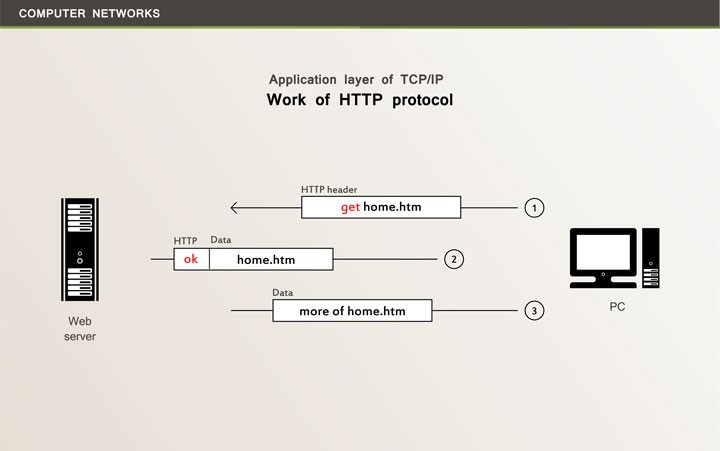
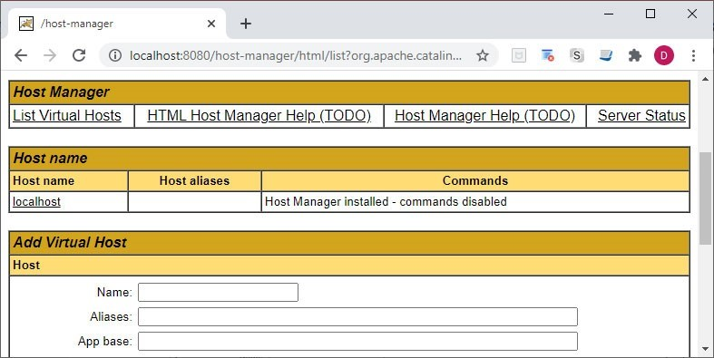
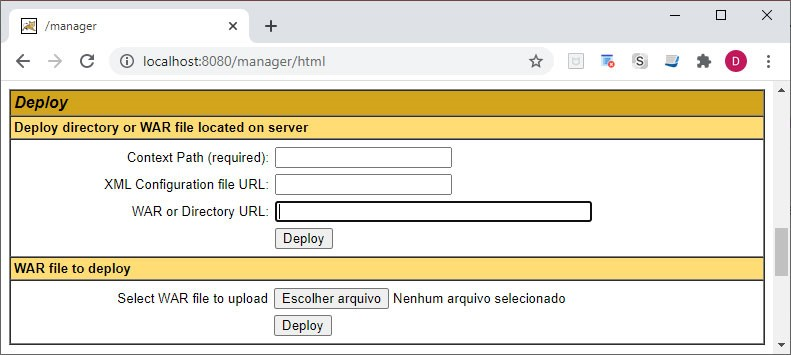
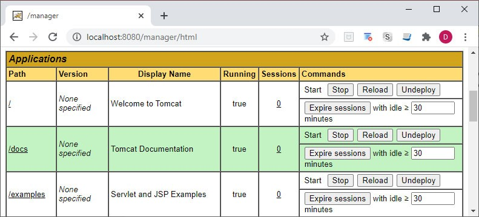
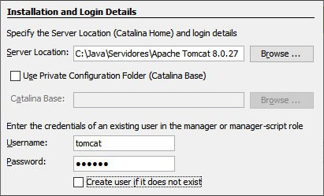
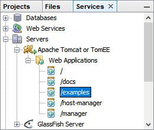
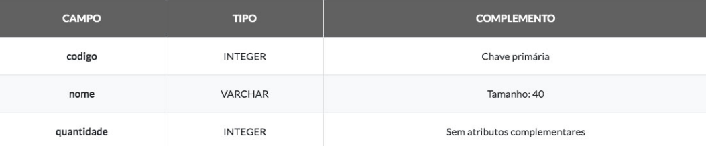
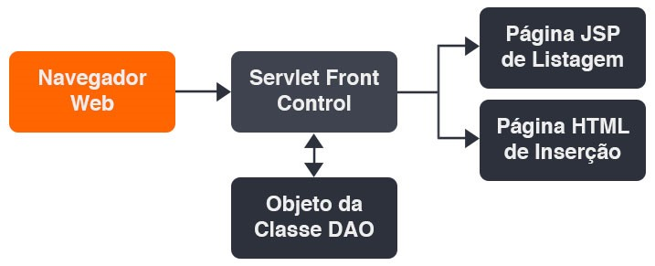

# Aula 3 - Programação servidor com Java 
## Protocolo HTTP 
 
O protocolo HTTP pertence à camada de aplicação do modelo OSI, definido originalmente para suportar páginas de hipertexto baseadas na sintaxe HTML. 
 
As informações transitam de diversas formas no protocolo HTTP, definidas a partir da escolha do método de transmissão utilizado. Os dois métodos mais comuns são **GET**, por meio do qual a informação é transmitida junto ao endereço, e **POST**, com a informação enviada para o servidor em background, de forma que não fique exposta para o usuário. 
 
 

Considerando o objetivo inicial, tudo que tínhamos eram conjuntos de páginas com conteúdo estático e a possibilidade de navegar entre elas a partir de hiperlinks, logo, o máximo de dinamismo possível era a execução de rotinas em JavaScript, ou a obtenção de dados via Sockets, com a utilização de Applets Java. 
 
Com a evolução da internet, as necessidades mudaram, e o processamento no servidor levou a um novo patamar na criação de sistemas para Web. Passamos a gerar respostas dinamicamente, com a possibilidade de utilização dos dados disponíveis no ambiente servidor, como tabelas dos bancos de dados, repositórios de arquivos, ou até mesmo informações obtidas por canais de comunicação com outras plataformas. 
 
Como as funcionalidades foram ampliadas, o perfil dos dados utilizados na comunicação também se diversificou. Atualmente, temos a adoção de **XML e JSON**, entre outros formatos, utilizados principalmente na representação de dados, como em operações cadastrais ou financeiras. 
 
De acordo com a metodologia mais aceita, atualmente, no que se refere à construção de páginas, a estruturação do conteúdo utiliza HTML, dados transitam nos formatos XML ou JSON, e a formatação tipográfica é baseada em CSS (Cascading Style Sheets). 
 
Como vamos gerar o conteúdo a partir de processamento efetuado no servidor, as respostas deverão ser constituídas com o uso dessas sintaxes e criadas através da linguagem de programação utilizada pelo servidor, como: **Java, Perl, PHP ou C#**. 
 
## Ambiente servidor para web 
 
Quando enviamos os dados para alguma tecnologia servidora, temos uma requisição HTTP, que poderá iniciar algum processamento no servidor e que, ao final, retornará uma resposta, normalmente com conteúdo HTML ou XML. Dentro do modelo de requisição e resposta, proporcionado pelo HTTP, o conteúdo recebido constitui um ambiente independente do anterior, no qual ocorreu a chamada, ou seja, **é um protocolo que não oferece a manutenção de estados**. 
 
Se utilizássemos um servidor HTTP simples, teríamos apenas um repositório de páginas e recursos de mídia, de forma geral, com todo o processamento ocorrendo no cliente, mas servidores como Apache **Tomcat** e IIS irão permitir o processamento no servidor. Em geral, temos a requisição do cliente, a interceptação do servidor, a captura de possíveis dados enviados, a execução de alguma rotina na linguagem adotada, a construção da resposta e o retorno para o cliente. 
 
Utilizaremos, no ambiente Java, uma implementação da interface **HttpServletRequest**, normalmente denominada **request**, para capturar os dados enviados pela requisição HTTP, efetuando qualquer tipo de processamento com esses dados, como a inserção em banco de dados ou as validações de segurança. A resposta, por sua vez, é encapsulada em uma implementação de **HttpServletResponse**, frequentemente com o nome **response**, que deverá emitir o conteúdo gerado através do canal de saída padrão da conexão. 
 
```javascript 
int a = Integer.parseInt(request.getParameter("valor")); 
response.getWriter().println("<html><body>Valor Enviado: "+a+ 
                             "</body></html>"); 
``` 
 
No fragmento de código apresentado, temos a recuperação de um parâmetro de nome **valor**, enviado através do protocolo HTTP, sendo recuperado no formato texto, a partir do método **getParameter** do objeto **request**, mas que teve a conversão para o formato inteiro com a chamada para **parseInt**. Em seguida, temos a escrita do conteúdo no canal de saída, através do objeto **response**, utilizando a sintaxe HTML. 
 
Algo que devemos ter em mente, com relação ao modelo Web, é a grande diferença do modelo desktop, no que se refere à gestão de estado de objetos. No modelo desktop, temos a armazenagem de objetos em um espaço de memória local, permitindo que os dados sejam mantidos durante toda a execução do sistema, mesmo que ocorra a troca de janelas, o que viabiliza a manutenção de estados, enquanto no modelo Web, a cada requisição e resposta, todos os objetos são recriados e o estado não pode ser mantido. 
 
Uma solução primária para a manutenção de estados no HTTP é o uso de cookies, algo que pode ser explorado através do Java Script. Com o uso do modelo de cookies, temos a desvantagem de trabalhar com recursos locais da máquina do usuário, ficando sujeitos a bloqueios efetuados no navegador. 
 
```javascript 
function setUser(login) { 
  var d = new Date(); 
  d.setTime(d.getTime() + (24 * 3600 * 1000)); // 24 horas 
  document.cookie = "username=" + login + ";expires=" + 
                    d.toUTCString() + ";path=/"; 
} 
``` 
 
Nas funções de exemplo, com sintaxe Java Script, temos o uso do atributo **cookie**, no objeto **document**, para armazenar o usuário logado de forma local. O momento para expiração da informação é calculado em milissegundos, sendo definido um prazo total de vinte e quatro horas, a partir do qual teremos a invalidação do cookie. 
 
Com base em uma tecnologia servidora, a melhor solução para manter os estados será a utilização de sessões, que correspondem a objetos alocados ao servidor, fazendo referência a dada conexão. Enquanto o usuário se mantiver no site, todos os dados atribuídos serão mantidos, sendo eliminados na perda da conexão. 
 
No ambiente Java, um objeto da classe **HttpSession**, que costuma se chamar **session**, permite a gerência de sessões HTTP, mas é sempre importante lembrar que ocorre consumo de memória no servidor, e a prática deve ficar restrita a finalidades específicas. 
 
## Web Server Tomcat 
 
Quando nos referimos ao **Tomcat**, estamos tratando de um projeto da Apache Software Foundation voltado para a definição de um servidor Web, ou **Web Server**, com código aberto e uso de tecnologias Java, como Java Server Pages (JSPs), Servlets, WebSockets e Java Expression Language. 
 
O conjunto de tecnologias adotado pelo Tomcat oferece um ambiente consistente para responder às chamadas HTTP, além de prover suporte a **Servlets** e **JSPs** de forma nativa no **contêiner Web**. Por ser um produto de código aberto, acabou se tornando o padrão para hospedagem de sistemas Java para Web, oferecendo a possibilidade de executar de modo totalmente independente, ou atuando como módulo plugável em servidores de aplicativos Java, uma estratégia adotada tanto pelo **JBoss** quanto pelo **GlassFish**. 
 
Um componente que implemente a interface **Servlet** é uma classe que permite ampliar as funcionalidades básicas de um servidor, ou seja, na prática é um aplicativo plugável, que deve ser executado em ambiente específico, como o contêiner Web oferecido pelo Tomcat. Por meio de um Servlet, temos o processamento no servidor, permitindo a geração dinâmica de conteúdo para a resposta HTTP. 
 
Quanto às páginas **JSP**, elas permitem uma sintaxe em que a porção estática da resposta é definida com base em **HTML ou XML**, e trechos dinâmicos são intercalados através de fragmentos de código Java denominados **Scriptlets**, que são executados no servidor. Apenas a forma de escrita é modificada, pois as páginas JSP são transformadas em Servlets pelo contêiner Web, quando ocorre o primeiro acesso, o que nos leva ao entendimento de que servidores como o Tomcat sempre utilizam Servlets para a geração de conteúdo dinâmico. 
 
A complexidade da arquitetura do **Tomcat** é refletida na grande quantidade de arquivos e diretórios gerados na instalação padrão. Os principais diretórios do Web Server Tomcat servidor podem ser: 
* bin: Binários estruturais do servidor, agrupados em arquivos no formato jar, e scripts para inicialização ou término da execução. 
* conf: Arquivos de configuração, como server.xml, que guardam os parâmetros gerais do Tomcat, incluindo a porta utilizada para comunicação. 
* lib: Bibliotecas de inicialização do servidor, no formato jar, que também ficam disponíveis para todos os aplicativos do ambiente. 
* logs: Arquivos de log, extremamente úteis para a identificação dos erros que ocorreram durante a execução do servidor. 
* webapps: Diretório de base para a instalação dos aplicativos Java Web, ou seja, define a raiz do site. Cada aplicativo corresponderá a um subdiretório. 
 
O **servidor Tomcat** pode ser utilizado como um serviço, executado a partir do ambiente do NetBeans, ou chamado diretamente pela linha de comando. Para executar na linha de comando, é necessário apontar a variável de ambiente **JAVA_HOME** para o local do **JDK** e executar o arquivo **startup.bat**, no Windows, ou **startup.sh**, para sistemas UNIX. 
 
```java 
set JAVA_HOME="C:\\Java\\jdk\\jdk1.7.0_80" 
startup.bat 
``` 
 
Com o servidor em execução, ele pode ser testado facilmente com a abertura de um navegador e a chamada para http://localhost:8080. 
 
Com a abertura da página inicial do Tomcat, sabemos que a inicialização se completou corretamente e o servidor está disponível para a inclusão de aplicativos. O término da execução ocorrerá com a chamada para **shutdown.bat**, no Windows, ou **shtdown.sh**, em sistemas com base no UNIX. 
 
No arquivo **server.xml**, do diretório **conf**, temos a possibilidade de alterar muitas das configurações do servidor, como o sistema de autenticação e a porta utilizada para a comunicação. A alteração da porta de conexão é feita no atributo com o nome **port**, presente nos elementos **Connector**, lembrando que o valor padrão é **8080**. 
 
```java 
<Connector port="8080" protocol="HTTP/1.1" 
           connectionTimeout="20000" redirectPort="8443" /> 
<Connector executor="tomcatThreadPool" 
           port="8080" protocol="HTTP/1.1" 
           connectionTimeout="20000" redirectPort="8443" /> 
``` 
 
Outro arquivo de grande importância, com o nome **tomcat-users.xml**, está presente no diretório **conf**. Para a autenticação padrão, podemos definir os usuários, as senhas e os perfis do servidor com o uso desse arquivo. 
 
```java 
<?xml version="1.0" encoding="UTF-8"?> 
<tomcat-users xmlns="http://tomcat.apache.org/xml" 
       xmlns:xsi="http://www.w3.org/2001/XMLSchema-instance"    
       version="1.0" 
       xsi:schemaLocation="http://tomcat.apache.org/xml 
       tomcat-users.xsd"> 
``` 
 
Na configuração inicial, temos apenas o usuário padrão do Tomcat, com utilização dos perfis, ou regras (**roles**), que liberam as funções administrativas apenas em modo texto. Podemos efetuar uma alteração muito interessante no arquivo **tomcat-users.xml**, acrescentando os perfis **manager-gui** e **admin-gui** ao usuário **tomcat**. 
 
```java 
<user password="tomcat" 
      roles="manager-script,admin,manager-gui,admin-gui" 
      username="tomcat"/> 
``` 
 
Com a alteração efetuada, podemos acessar os **gestores gráficos**, clicando em alguns dos links presentes na página inicial do servidor, como **Manager App** e **Host Manager**. 
 
### Interface administrativa do Tomcat 
 
Por meio dos gestores gráficos, é possível criar servidores virtuais, gerenciar os aplicativos, implantar novos aplicativos, entre diversas outras funções administrativas, sem que haja a necessidade de alterar diretamente os arquivos XML de configuração. 
 
 

## Estrutura do aplicativo WEB 
 
Os aplicativos que criaremos deverão obedecer à estrutura exigida pelo Tomcat, que é composta por um diretório de base, ou raiz, com o nome do aplicativo, contendo um subdiretório de nome WEB-INF e outro com o nome META-INF. Vejamos na figura a seguir como se organiza a estrutura de um aplicativo Web Java: 
 


|   |   | 
|---|---|
| Diretório raiz | Temos páginas JSP, HTML, XML, e outros formatos interpretados, além de podermos acrescentar subdiretórios para a organização geral do conteúdo. É comum, por exemplo, definir diretórios para imagens, folhas de estilo e arquivos de código Java Script, permitindo que as bibliotecas e os temas utilizados sejam isolados em diretórios próprios, como no caso do JQuery, o que facilita a atualização de versões e a mudança do aspecto geral do sistema. |
| Diretório WEB-INF | Encontramos o arquivo de configuração com o nome web.xml, um subdiretório com o nome classes para os arquivos compilados do Java e um subdiretório lib com as bibliotecas nos formatos jar e zip. Quando criamos um Servlet, o arquivo compilado da classe Java é copiado para classes, obedecendo à estrutura de diretórios definida pelo pacote, e o reconhecimento pelo servidor pode ser configurado, com a utilização do mapeamento correto, no arquivo web.xml. |
| Diretório META-INF | São definidas as configurações de ambiente, com recursos oferecidos para o aplicativo a partir do contêiner Web. Podemos ter arquivos como context.xml, com informações gerais de contexto, incluindo o pool de conexões com o banco de dados. |
|   |   |
 
Alguns elementos fundamentais para a configuração do servidor: 
 
1. Área do manager app para implantação de aplicativos 
   - a. Toda a estrutura criada pode ser compactada em um arquivo com extensão war, que significa Web Archive, podendo ser implantado no servidor, com o simples upload na divisão WAR file to deploy do aplicativo Manager App. De acordo com a configuração utilizada no servidor, quando temos a opção de hot deployment ativada, podemos copiar o arquivo war, ou toda a estrutura aberta, para um diretório específico, normalmente chamado de webapps ou deploy, conforme a distribuição, e o aplicativo será expandido, ficando disponível para os usuários. 

   - b. 

2. Área do manager app para acompanhamento de aplicativos 
   - a. Com a configuração de hot deployment ativada, a desinstalação de um aplicativo ocorre por meio da simples remoção do diretório ou do arquivo war. Também é possível efetuar a desinstalação do aplicativo através da opção Undeploy de Manager App. 

   - b. 

3. Acréscimo do servidor à interface do netbeans 
   - a. A interface oferecida pelo NetBeans permite iniciar e parar o servidor, ou ainda remover os aplicativos implantados, por meio de uma interface gráfica simples, oferecida na aba Services, opção Servers. Caso o servidor não esteja configurado na plataforma, basta adicioná-lo, indicando diretório de instalação, usuário e senha. 
   
   - b. 

4. Gerenciamento de servidores por meio do netbeans 
   - a. Com o servidor configurado, basta clicar com o botão direito e escolher a opção Start, iniciando a execução e permitindo acessar e remover os aplicativos implantados, o que também é feito a partir do clique com o botão direito. A implantação do aplicativo, por sua vez, ocorre a partir da execução de um projeto do tipo Web. 

   - b 
 
## Servidores de aplicativos 
 
Quando nos referimos a servidores de aplicativos, ou Application Servers, estamos considerando plataformas capazes de suportar o perfil de processamento necessário para projetos de grande porte, com alto nível de conectividade, processamento paralelo e distribuído, pools de recursos compartilhados, serviços de autenticação e autorização, entre diversos outros elementos comuns para um ambiente empresarial complexo. Entre os componentes necessários, é comum encontrar os Web Servers, que neste caso atuam como módulos internos dos Application Servers. 
 
O objetivo primário de um servidor de aplicativos é o de prover um ambiente que trate das necessidades comuns do ambiente de execução, como segurança, balanceamento de carga, alta disponibilidade, gerenciamento de exceções e controle transacional, entre outras. Eles oferecem uma arquitetura e um conjunto de contêineres, permitindo ao programador se concentrar apenas nas regras de negócio e deixando para o servidor a responsabilidade sobre a gerência de recursos e funcionalidades comuns. 
 
Servidores de aplicativos podem trabalhar de forma conjunta, com base em protocolos voltados para o processamento distribuído, o que traz mais dificuldades na gerência de exceções, já que podem ocorrer de forma local ou remota. Com a possibilidade da ocorrência de exceções em vários locais distintos, dentro de um mesmo processo, o controle transacional também precisa englobar esses locais, levando à necessidade de bibliotecas para a gerência de transações distribuídas. 
 
Uma transação é um processo atômico e isolado, que deve ser executado de forma consistente, e com resultados duráveis. 
 
Uma necessidade básica do ambiente corporativo é a gerência da segurança, exigindo ferramentas robustas para a autenticação de usuários e autorização para o uso de recursos e funcionalidades. Além de gerenciar o acesso, nosso servidor deve ser capaz de oferecer protocolos seguros, como TLS. 
 
Como os servidores de aplicativos devem lidar com diversos fluxos de dados que fazem parte do ambiente corporativo, incluindo bases de dados relacionais e mensagerias, um requisito primário é a presença de um grande conjunto de bibliotecas de middleware, garantindo a interoperabilidade com diversos outros sistemas. É com base nas opções de middleware que são definidos alguns componentes, como pools de conexões com o banco de dados e canais de comunicação com mensagerias, entre outros. 
 
Devido à grande quantidade de componentes e recursos compartilhados, é natural que haja a necessidade de individualização, o que deve ser feito com o uso de nomes únicos, gerenciados por serviços de nomes e diretórios. Para servidores criados na plataforma Java, o JNDI (Java Naming and Directory Interface) gerencia os serviços para registro e localização de recursos, funcionando como um canal de identificação comum entre os aplicativos, tanto internamente quanto para acessos externos, além de centralizar toda a integração com serviços de nomes e diretórios de outras plataformas. 
 
Temos diversas opções de servidores de aplicativos criados no ambiente Java, como JBoss, GlassFish, WebSphere, Oracle Application Server e WebLogic, sempre com base no JEE, uma arquitetura de referência para a implementação de ambientes de execução corporativos, com suporte a objetos distribuídos. 
 
## Tecnologias de objetos distribuídos 
 
Um ponto central, na grande maioria dos Application Servers, é a presença de sistemas de objetos distribuídos, como CORBA (Common Object Request Broker Architecture), ou Microsoft DCOM (Distributed Component Object Model). No caso do Java, temos os componentes do tipo EJB. 
 
Quando nos referimos a processamento distribuído, estamos considerando serviços que são oferecidos de forma remota, ou distribuída, usando protocolos próprios, como RPC e RMI. Qualquer que seja a tecnologia para processamento distribuído, alguns elementos são comuns para a definição da maioria das arquiteturas: 
* Protocolo de comunicação 
* Serviço de registro e localização 
* Descritor de serviços 
 
Um exemplo comum de processamento distribuído, no mercado de desenvolvimento, são os Web Services, como o tipo SOAP (Simple Object Access Protocol), que utiliza um protocolo de mesmo nome, WSDL (Web Service Description Language) para descrever os serviços e UDDI (Universal Description, Discovery and Integration) nas tarefas de registro e localização. 
 
Algo muito interessante sobre os elementos citados é que todos trabalham com XML, garantindo a interoperabilidade em todos os níveis da arquitetura. 
 
Quando consideramos os objetos distribuídos, temos o mesmo tipo de fornecimento de serviços, de forma distribuída, mas agora com a execução efetuada a partir de pools de objetos nos servidores. Por exemplo, no CORBA temos a utilização do protocolo de rede IIOP (Internet Inter-ORB Protocol), descritor IDL (Interface Definition Language), além de registro e localização via COS Naming, lembrando que COS significa CORBA Object Services. 
 
O registro dos EJBs, no ambiente Java, utiliza JNDI, e a comunicação utiliza o protocolo misto RMI-IIOP. Quanto ao descritor de serviços, utilizamos interfaces Java, mas pode ser gerado o IDL a partir das interfaces. 
 
A utilização dos serviços distribuídos segue um fluxo comum: 
1. Localizar o serviço ou objeto distribuído a partir do serviço de nomes 
2. Recuperar o descritor a partir da localização encontrada 
3. Gerar o cliente de comunicação a partir do descritor 
4. Transmitir as solicitações, através do cliente, com base no protocolo 
 
Com a utilização da ferramenta correta, o cliente é gerado de forma automática a partir do descritor, permitindo que nossas chamadas ao cliente se assemelhem a solicitações locais, enquanto toda a comunicação remota ocorre de forma transparente. 
 
Durante a execução dos objetos, no pool do servidor, o contêiner irá fornecer todos os recursos necessários em termos de autenticação, autorização, acesso a **middleware**, controle transacional, entre outras funcionalidades. Com base em um contêiner, temos a execução controlada e robusta dos processos de negócio do nosso sistema. 
 
Confira a seguir os **componentes arquiteturais** para alguns dos serviços distribuídos mais comuns. 

| TECNOLOGIA | REGISTRO E LOCALIZAÇÃO | DESCRITOR | PROTOCOLO |
| :---: | :---: | :---: | :---: | 
| CORBA | COS Naming | IDL | IIOP |
| SOAP | UDDI | WSDL | SOAP |
| RMI | JNDI | Interface Java | RMI |
| EJB | JNDI | Interface Java | RMI-IIOP |
| | |
 
## Application server glassfish 
 
Enquanto o Tomcat suporta, de forma nativa, apenas Servlets e JSPs, atuando como um Web Server, o GlassFish vai além, oferecendo suporte às tecnologias Java de objetos distribuídos, no caso os EJBs, sendo classificado como Application Server. 
 
É importante mencionar que o Tomcat é utilizado pelo GlassFish como módulo interno, delegando para o Web Server as tarefas de comunicação no protocolo HTTP e tratamento de Servlets e JSPs, enquanto os outros componentes da arquitetura do GlassFish tratam das diversas tecnologias do JEE. 
 
Com base no GlassFish, somos capazes de criar sistemas mais complexos, com uso de EJBs e transações distribuídas, além de obtermos ferramentas para gerenciamento de componentes corporativos, como mensagerias. O servidor também disponibiliza um ambiente de testes simplificado para Web Services do tipo SOAP. 
 
Seguindo a arquitetura JEE, o ponto central do servidor é o contêiner EJB, que gerencia o ciclo de vida dos objetos distribuídos, além de intermediar a utilização de recursos do ambiente. A disponibilização de recursos para os EJBs é configurada através de arquivos XML e anotações de código, sempre através de identificadores no JNDI. 
 
Como todas as bibliotecas de middleware são gerenciadas pelo servidor, o processo é o mesmo para a grande maioria dos recursos. De forma geral, temos a criação do recurso, como um pool de conexões, por exemplo, e o registro no JNDI, em um primeiro instante, e a localização e utilização pelo contêiner, a partir das configurações definidas para os EJBs, no momento da execução do aplicativo. 
 
Entre as bibliotecas e os elementos gerais de middleware do GlassFish, podemos destacar a presença do JDBC, intermediando o acesso aos bancos de dados, e do JMS, gerenciando o uso de mensagerias a partir de canais e filas, além de bibliotecas para o controle de transações locais e distribuídas, como JTA e JTS. 
 
Além dos componentes do GlassFish, e do Tomcat como módulo, a distribuição padrão inclui o serviço de mensageria GlassFish Message Queue, o banco de dados Derby, que também é conhecido como **Java DB**, e uma ferramenta de inicialização pelo console. 
 
Vejamos a seguir os níveis de diretórios do Application Server GlassFish: 
* bin: Contém apenas a ferramenta asadmin para inicialização pelo console e representa a divisão descrita. 
* glassfish: Diretório do servidor de aplicativos, com os componentes estruturais, arquivos de configuração e domínios estabelecidos. 
* javadb: Corresponde a uma distribuição do banco de dados Derby, contendo os subdiretórios bin e lib, com scripts de gerenciamento e bibliotecas. 
* mq: Contém os componentes da mensageria GlassFish MQ, além de diversos exemplos de utilização, disponibilizados no subdiretório examples. 
 
Ao trabalhar com o servidor GlassFish, precisamos definir domínios, que são ambientes completos e independentes para a instalação e execução de aplicativos. Fazendo uma comparação com sistemas de gerenciamento de bancos de dados, como o Oracle, temos o equivalente a instâncias de execução. 
1. Instalação do glassfish: Um domínio padrão, com o nome domain1, é criado, e podemos iniciar o servidor a partir da linha de comando com o uso de asadmin, tendo como parâmetros a opção start-domain e o nome do domínio. `asadmin start-domain domain1` 
2. Tela inicial do glassfish: Com o servidor iniciado, podemos acessar o domínio por meio da chamada para localhost na porta configurada, com o valor padrão 8080, através de um navegador, enquanto o console administrativo utiliza a porta 4848. Para encerrar a execução, basta invocar o mesmo programa (asadmin), com a utilização do parâmetro stop-domain, sendo ainda possível consultar os domínios cadastrados por meio da opção list-domains. 
3. Interface administrativa do glassfish: Observando a árvore de diretórios do servidor, temos subdiretórios para bibliotecas compartilhadas, módulos estruturais e programas administrativos (bin), entre outros. O mais importante para nós será o subdiretório domains, onde são definidas as estruturas de domínio do servidor. Entre os subdiretórios do domínio, temos um para a definição de configurações (config), podendo ser observado o arquivo domain.xml, com a definição de características gerais, como as portas de conexão utilizadas. Basicamente, apenas as portas de conexão precisam ser modificadas de forma manual para o domínio, ao nível do elemento network-listeners, de domain.xml, sendo todas as demais configurações efetuadas através do console administrativo, na porta 4848. Por meio da interface administrativa, é possível executar diversas tarefas, como implantar os aplicativos, criar os pools de conexão com o banco de dados, gerenciar filas e canais da mensageria, definir identificadores JNDI, entre outras. 
4. Gerenciamento de clusters do glassfish: Utilizando a árvore de navegação, iniciada em Common Tasks, temos acesso rápido a todas as tarefas administrativas, como o gerenciamento de Clusters, por exemplo. 
5. Gerenciamento do glassfish por meio do netbeans: Da mesma forma que para o Tomcat, podemos acessar e configurar elementos básicos do GlassFish a partir do NetBeans, por meio da aba Services. 
 
## Estrutura do aplicativo corporativo 
 
Um aplicativo corporativo comporta elementos como EJBs, Servlets e JSPs. De forma geral, os objetos de negócio e as classes de acesso ao banco de dados são compactados em um arquivo jar, enquanto a interface Web é organizada em um arquivo war, sendo os dois arquivos compactados em um terceiro, com extensão ear. 
 
A estrutura padrão para implantação é obedecida pelo NetBeans, quando criamos um projeto do tipo Enterprise Application. 
 
Na prática, são criados um projeto principal, com extensão ear, e dois projetos internos, com as extensões jar e war. Para implantar e testar o aplicativo, devemos utilizar sempre o projeto principal, representado por um triângulo. 
 
Uma estratégia simples de programação, dentro da arquitetura imposta pelo servidor, envolve a programação de classes DAO para acesso ao banco de dados, e EJBs, com as regras de negócio, no projeto jar. Como o projeto trata da camada de negócios do sistema, não devem ser definidos elementos de interface neste nível. 
 
Com a camada de negócios completa, ao nível do jar, podemos implementar a interface Web no projeto war, com a criação de elementos como Servlets e JSPs. Os elementos de interface não podem conter inteligência de negócios, funcionando como um simples canal de comunicação com o usuário e direcionador das solicitações efetuadas para a camada de negócios. 
 
Projetos mais simples, que não envolvem os EJBs e demais elementos corporativos, não precisam de um modelo tão robusto e podem ser definidos em termos de um simples aplicativo para Web, com extensão war. Nesse caso, os objetos de negócios e as classes de acesso ao banco de dados ficam no mesmo projeto, junto aos Servlets e JSPs. 
1. Criação de aplicativo web no netbeans: Para a criação de um aplicativo Web simples, que pode ser executado tanto no Tomcat quanto no GlassFish, utilizamos um projeto do tipo Web Application. Ao executar um projeto Web ou corporativo, ele é implantado no servidor e exibido no navegador após a implantação. Se o servidor não estiver ativo, o NetBeans irá iniciá-lo automaticamente, antes de implantar o aplicativo. 
2. Implantação de aplicativo no console do glassfish: Pode-se também implantar o aplicativo em um servidor externo, a partir do console de administração do GlassFish, com o uso da opção Deploy an Application. Tudo o que precisamos fazer, na tela, é escolher o arquivo, com extensão ear ou war, e com o clique no botão OK será efetuada a implantação. 
3. Gerenciamento de aplicativos no console do glassfish: Para verificar os aplicativos instalados, basta acessar a opção Applications na árvore de navegação, onde são listados todos os nossos aplicativos, sendo possível ainda efetuar a remoção deles. Em termos práticos, devido à funcionalidade do autodeploy, temos a implantação do aplicativo com o simples upload de um arquivo, e a remoção ocorre com a exclusão do arquivo no servidor. 
 
## Aplicativos web no netbeans 
 
Em nosso contexto de estudos, um aplicativo corporativo não será necessário, já que estamos analisando tecnologias voltadas para a camada Web. Precisaremos apenas de um aplicativo Web, com extensão war, e o uso de um servidor, como Tomcat ou GlassFish. 
 
Vamos criar um projeto de testes, conforme os passos apresentados a seguir: 
1. Escolha o projeto do tipo Web Application, na categoria Java Web. 
2. Defina o nome do projeto (WebTeste001). 
3. Escolha o servidor (GlassFish) e a versão do JEE (Java EE 8 Web). 
 
Ao término da execução desses passos, o novo projeto será apresentado na aba Projects do NetBeans. Pode ser necessário acrescentar manualmente a biblioteca Java EE 8 API, caso não esteja instalada. 
 
Observe que o arquivo web.xml não é apresentado na estrutura do projeto, o que se deve ao fato de termos utilizado o JEE versão 8, onde as configurações são efetuadas, em sua grande maioria, através de anotações no código Java. 
 
* Web Pages: Elementos interpretados, como XHTML, JSP (Java Server Pages), bibliotecas Java Script e folhas de estilo CSS. 
* Source Pages: Elementos compilados, definidos em temos de pacotes e classes Java, incluindo nossos Servlets. 
* Libraries: Bibliotecas Java requeridas pelo aplicativo Web. 
Configuration Files: Arquivos de configuração, como MANIFEST.MF e web.xml. 
 
Agora podemos começar a criar os elementos constituintes de nosso sistema, incluindo Servlets e JSPs, e executar o projeto. Na execução, teremos a geração do arquivo war, o servidor será iniciado, caso ainda não esteja ativo, e o arquivo compilado será copiado para o diretório de autodeploy, ocorrendo a implantação do aplicativo e abertura do navegador no endereço correspondente ao index.html. 
 
A classe HttpServlet, filha de GenericServlet, integra-se ao ambiente de execução do servidor através do contêiner Web, tirando proveito das tecnologias Java presentes ali, como pools de conexão, controle transacional e ferramentas de segurança. Quanto à comunicação com o usuário, a classe HttpServlet apresenta métodos para responder às chamadas dos tipos GET e POST no protocolo HTTP. 
 
Tudo que precisamos fazer é criar um descendente da classe HttpServlet, herdando toda a integração já existente com o ambiente, e alterar os métodos doGet e doPost para, através do polimorfismo, personalizar as respostas em nosso aplicativo às chamadas dos tipos GET e POST, respectivamente. 
 
Para definir um Servlet no NetBeans, adicione um novo arquivo e siga os passos: 
1. Escolha o arquivo do tipo Servlet na categoria Web. 
2. Defina o nome do Servlet (ServCalc) e do pacote (servlets). 
3. Finalize sem adicionar as informações ao arquivo web.xml. 
 
Teremos o código de ServCalc no editor de código do NetBeans e devemos observar alguns detalhes, como o código oculto (editor-fold), que trata de um trecho de código escondido por meio de comentários no início e fim do bloco, com a visualização alternada através do clique sobre o sinal de adição, próximo à margem esquerda. 
 
O código oculto, para ServCalc, engloba os métodos doGet e doPost, responsáveis pela recepção de chamadas HTTP dos tipos GET e POST, respectivamente. No código gerado, ambos os métodos redirecionam para processRequest, fazendo com que GET e POST sejam tratados da mesma forma, algo que nem sempre é interessante, pois temos situações, como no processo de login, em que não devemos aceitar chamadas GET. 
 
O próximo passo será a alteração do método processRequest, para que corresponda ao processamento necessário em nosso aplicativo. 
 
```java 
protected void processRequest(HttpServletRequest request, 
          HttpServletResponse response) 
          throws ServletException, IOException { 
  response.setContentType("text/html;charset=UTF-8"); 
  try (PrintWriter out = response.getWriter()) { 
    int a = new Integer(request.getParameter("a")); 
    int b = new Integer(request.getParameter("b")); 
    out.println("<html><body>"); 
    out.println("A soma de " + a + " e " + b + " será " + 
               (a + b)); 
    out.println("</body></html>"); 
  } 
} 
``` 
 
A assinatura do método **processRequest**, assim como ocorre em **doGet** e **doPost**, traz dois tipos de parâmetros: 
* Tipo HttpServletRequest: Com o nome request, para receber a requisição do usuário. 
* Tipo HttpServletResponse: Com o nome response, que será responsável pela resposta HTTP. 
 
Iniciamos a implementação de processRequest com a definição do tipo de saída, que no caso é HTML, com codificação UTF-8. Em seguida, iniciamos um bloco protegido, do tipo try with resources, em que o objeto de nome out recebe o canal de saída de response. 
 
Em meio ao bloco protegido, temos a recuperação dos parâmetros a e b, por meio do método getParameter, com a conversão para as variáveis inteiras de mesmo nome, o que é feito com base na classe Integer. Como o protocolo HTTP trabalha com valores do tipo texto, qualquer outro formato exigirá conversões ao nível do Java. 
 
Após a recuperação e conversão dos parâmetros da requisição, efetuamos a montagem da resposta através do canal de saída, com base em chamadas ao método println, como se estivéssemos enviando a informação para o console. Nossa resposta será uma página HTML simples, com a presença da frase com a soma dos valores fornecidos. 
 
Para testar nosso Servlet, devemos executar o projeto e efetuar a chamada correta a partir do navegador: http://localhost:8080/WebTeste001/ServCalc?a=10&b=15 
 
Devemos compreender como ocorre o direcionamento de fluxo, no protocolo HTTP, para a classe ServCalc. No formato original de mapeamento, deveríamos acrescentar uma entrada no arquivo web.xml, mas como estamos lidando com uma versão mais recente do contêiner, uma anotação WebServlet, aplicada à classe ServCalc, definirá o mapeamento necessário. 
 
```java 
@WebServlet(name = "ServCalc", urlPatterns = {"/ServCalc"}) public class ServCalc extends HttpServlet { 
``` 
 
A anotação WebServlet requer o nome do Servlet e o padrão de escrita da URL para o redirecionamento. Embora, tradicionalmente, sejam utilizados textos correspondentes ao nome da classe em si, esta não é uma regra, permitindo até mesmo a utilização de endereços dinâmicos na URL, com base em coringas, como no caso de "*.jsf". 
 
Para que não seja necessário escrever o endereço completo a cada chamada, podemos alterar o arquivo index.html. 
 
```html 
<!DOCTYPE html> 
<html> 
    <body> 
        <form method="GET" action="ServCalc"> 
            <input type="text" name="a"/> 
            <input type="text" name="b"/> 
            <input type="submit" value="somar"/> 
        </form> 
    </body> 
</html> 
``` 
 
Finalizando a modificação do index e executando novamente o aplicativo, teremos um formulário para a entrada dos valores e o botão de envio para o Servlet. 
 
## Tecnologia de JSPs 
 
A criação de Servlets seria suficiente para prover as necessidades de todo e qualquer aplicativo Java Web, porém, a construção de páginas diretamente no código pode se tornar desconfortável para os profissionais de design. O problema foi solucionado com um novo modelo de programação, em que os códigos Java são escritos dentro do conteúdo HTML ou XML por meio da tecnologia JSP. 
 
O processo para a criação de uma página JSP envolve apenas a adição de um arquivo, do tipo JSP na categoria Web. É necessário definir o nome do arquivo, sem acrescentar a extensão, e o novo componente ficará disponível na divisão Web Pages do projeto, ou em um subdiretório especificado nela. 
 
Vamos criar uma página JSP simples, utilizando o nome ListaCores. Ela não irá fornecer nenhuma funcionalidade relevante para o sistema, mas permitirá que analisemos os elementos estruturais principais das páginas JSP. 
 
```html 
<%@page contentType="text/html" pageEncoding="UTF-8"%> 
<!DOCTYPE html> 
<html> 
   <body> 
      <ul> 
         <% 
         String[] cores = {"vermelho","verde","azul"}; 
         for(String x: cores) { 
            out.println("<li>"+x+"</li>"); 
         } 
         %> 
      </ul> 
   </body> 
</html> 
``` 
 
Diretivas: A primeira linha deste código é uma diretiva, no caso indicando o tipo de conteúdo e a página de acentuação que será adotada. Diretivas também são utilizadas para importar bibliotecas e definir a página de erro, entre diversas outras opções. 
 
HTML: Nas linhas seguintes, temos código HTML padrão, que irá compor a saída sem requerer interpretação no servidor. O que temos aqui é a definição da estrutura básica da página HTML e a inclusão de uma lista, com o uso do marcador UL. 
 
Scriptlet: Internamente ao marcador de lista, temos um bloco iniciado com os símbolos de menor e percentual e terminado com os símbolos de percentual e maior, definindo um trecho que é executado no servidor, com utilização de sintaxe Java, e que é conhecido como Scriptlet. No trecho de código do exemplo, temos a definição de um vetor de texto com nomes de cores, as quais serão impressas no conteúdo da página através do objeto out, implícito nas páginas JSP, como itens de lista. 
 
Para testar nossa página JSP, vamos executar o projeto e efetuar a chamada correta a partir do navegador: http://localhost:8080/WebTeste001/ListaCores.jsp e estando tudo correto, teremos uma página de resposta. 
 
Os objetos request e response também são implícitos para as páginas JSP, podendo ser utilizados da mesma forma que nos métodos doGet e doPost dos Servlets. Inclusive, devemos nos lembrar de que a página JSP é convertida em Servlet no primeiro acesso, logo, o que muda é a forma de programar, e não a funcionalidade original. 
 
## Sessões e redirecionamentos 
 
As sessões HTTP são de grande utilidade no ambiente Web, provendo uma forma de manutenção de estados na troca de páginas, pois ao contrário dos sistemas desktop, com valores mantidos na alternância de janelas, a cada página temos um novo conjunto de variáveis, desconsiderando-se todas as existentes antes da requisição ser efetuada. 
 
Podemos controlar sessões de forma muito simples, com o uso da classe HttpSession, e um exemplo típico de utilização é no controle de login. Normalmente temos um Servlet para a verificação do login, e a sessão deve ser obtida a partir do objeto de requisição, com a invocação do método getSession. 
 
Nas páginas JSP, o controle de sessões é feito com o uso do objeto implícito session, da classe HttpSession. Para demonstrar o processo de login, vamos criar uma página JSP, que receberá o nome "Segura.jsp" e representará um recurso com acesso autenticado. 
 
```html 
<%@page contentType="text/html" pageEncoding="UTF-8"%> 
<% 
   if(session.getAttribute("usuario")==null) 
      response.sendRedirect("Login.jsp"); 
   else { 
%> 
<!DOCTYPE html> 
<html> 
   <body> 
      <h1>Esta é uma página protegida!</h1> 
      O usuário <%=session.getAttribute("usuario")%> 
      está logado.<br/> 
      <form action="ServletLogin" method="post"> 
      <input type="hidden" name="acao" value="desconectar"/> 
      <input type="submit" value="logout"/> 
      </form> 
   </body> 
</html> 
<% } %> 
``` 
 
Enquanto os parâmetros da requisição HTTP assumem apenas valores do tipo texto, os atributos da sessão permitem guardar qualquer tipo de objeto. Embora seja possível a utilização de estruturas mais complexas, iremos utilizar apenas um elemento de texto. 
 
Na primeira parte do arquivo JSP, temos o teste para a existência do atributo "usuário" na sessão, e se ele não existir, isto significa que não há um usuário autenticado, devendo ocorrer o redirecionamento para a página de login através de sendRedirect. 
 
A seguir, temos os dois métodos de redirecionamento do Java para Web. 
* Método sendRedirect: Possui a interface HttpServletResponse. Envia um sinal de redirecionamento para o navegador, gerando uma nova requisição. 
* Método forward: Possui a interface RequestDispatcher. Redirecionamento ao nível do servidor, que ocorre de forma interna, com a manutenção da requisição original e suas informações. 
 
Ainda observando o código da página JSP, podemos notar que a instrução else é aberta antes do início do código HTML e fechada apenas no final, logo após a tag de finalização, significando que a página de resposta será processada apenas se o atributo usuário estiver presente na sessão, ou seja, se existir alguém autenticado no sistema. Quando ocorre a montagem da página, temos um retorno bastante simples, com a exibição do login corrente, obtido através de getAttribute, e um botão para efetuar o logout, ou desconexão, por meio de uma chamada para ServletLogin. 
 
Agora precisamos criar a página de login, que receberá o nome "Login.jsp", e o Servlet responsável pelo controle das ações referentes aos processos de conexão e desconexão, que será chamado de ServletLogin. 
 
```html 
<%@page contentType="text/html" pageEncoding="UTF-8"%> 
<!DOCTYPE html> 
<html> 
   <body> 
      <h1>Acesso ao Sistema</h1> 
      <form action="ServletLogin" method="post"> 
         <input type="hidden" name="acao" value="conectar"/> 
         Login: <input type="text" name="login"/> 
         Senha: <input type="password" name="senha"/> 
         <input type="submit" value="login"/> 
      </form> 
<% 
   if(request.getAttribute("erro")!=null) { 
%> 
      <hr/>Ocorreu um erro: <%=request.getAttribute("erro")%>    
<% 
   } 
%> 
    </body> 
</html> 
``` 
 
Na primeira parte de Login.jsp, temos um formulário HTML bastante simples, contendo as informações que deverão ser enviadas para ServletLogin no processo de verificação, enquanto na segunda parte apresentamos mensagens de erro de autenticação. Note que a segunda parte será apresentada apenas se o atributo de erro estiver presente na chamada ao JSP, e que, por se tratar de um atributo, e não parâmetro, não permite o envio a partir do protocolo HTTP, mas apenas através do código do Servlet. 
 
```java 
@WebServlet(name = "ServletLogin", 
            urlPatterns = {"/ServletLogin"}) 
public class ServletLogin extends HttpServlet { 
   @Override 
   protected void doPost(HttpServletRequest request, 
                         HttpServletResponse response) 
                         throws ServletException, IOException { 
      String acao = request.getParameter("acao"); 
      if(acao==null) 
         throw new ServletException("Parâmetro Requerido"); 
      HttpSession session = request.getSession(); 
      switch(acao){ 
      case "conectar": 
         if(request.getParameter("login").equals("admin")&& 
            request.getParameter("senha").equals("123")){ 
            session.setAttribute("usuario", "Administrador"); 
            response.sendRedirect("Segura.jsp"); 
         } else { 
            request.setAttribute("erro","Dados inválidos."); 
            RequestDispatcher rd = 
               request.getRequestDispatcher("Login.jsp"); 
            rd.forward(request,response); 
         } 
         break; 
      case "desconectar": 
         session.invalidate(); 
         response.sendRedirect("index.html");                
         break; 
      default: 
         throw new ServletException("Parâmetro incorreto"); 
      } 
   } 
} 
``` 
 
Aqui estamos tratando de um processo de login muito simples, mas que, por se tratar de uma autenticação de usuário, deverá adotar apenas o método doPost. O parâmetro acao, indicando a solicitação de conexão ou desconexão, é obrigatório, sendo gerada uma exceção caso ele não seja fornecido. 
 
A partir de uma instrução switch, com base no parâmetro acao, temos a implementação da autenticação e da desconexão do sistema. Observe que o Java permite uso de texto para os desvios de fluxo do switch, mas apenas nas versões atuais da plataforma. 
 
Para responder à ação "conectar" é feito um teste, em que apenas o login "admin" e a senha com valor "123" permitirão a autenticação. Fornecidos os valores corretos, temos o acréscimo do atributo usuario à sessão, contendo o valor "Administrador", e ocorre o redirecionamento para a página Segura.jsp. 
 
Caso sejam fornecidas credenciais diferentes das estipuladas, será definido o atributo erro para a requisição, com a mensagem "Dados Inválidos", e ocorrerá o retorno para Login.jsp, através de um redirecionamento interno. 
 
Quanto à resposta para a ação "desconectar", temos um processo bem mais simples, com a chamada para o método invalidate, do objeto session, e o redirecionamento para a página index.hml. Com a utilização do método invalidate, a sessão atual é fechada, e os atributos associados à conexão do usuário são removidos da memória do servidor. 
 
Agora basta adicionar uma chamada para a página Segura.jsp em index.html. `<a href="Segura.jsp">Pagina Segura</a>` 
 
Embora seja um processo de autenticação muito simples, com valores prefixados, você pode alterá-lo facilmente para utilizar uma base de dados e senhas criptografadas. 
 
## Middleware 
 
Front-end: É a camada de software responsável pelo interfaceamento do sistema, com o uso de uma linguagem de programação. Aqui temos os aplicativos Java Web como opção de front-end. 
 
Back-end: Compreende o conjunto de tecnologias que pode ser acessado a partir de nosso front-end, mas que não pertence ao mesmo ambiente, como os bancos de dados e as mensagerias. Para nossos exemplos, iremos adotar o banco de dados Derby como back-end, com a consulta e manipulação de dados ocorrendo através do envio de comandos SQL, a partir do front-end. 
 
Exemplo: As mensagerias são outro bom exemplo de back-end, com uma arquitetura voltada para a comunicação assíncrona entre sistemas, efetuada através da troca de mensagens. Essa é uma tecnologia crucial para diversos sistemas corporativos, como os da rede bancária. 
 
Um grande problema, enfrentado pelas linguagens de programação mais antigas, é que deveríamos ter versões específicas do programa para acesso a cada tipo de servidor de banco de dados, como Oracle, Informix, DB2 e SQL Server, entre diversos outros, o que também ocorria com relação aos sistemas de mensagerias, como por exemplo, MQ Series, JBoss MQ, Active MQ e Microsoft MQ. 
 
Com diferentes componentes para acesso e modelos de programação heterogêneos, a probabilidade de ocorrência de erros é simplesmente enorme, levando à necessidade de uma camada de software intermediária, responsável por promover a comunicação entre o front-end e o back-end. Foi definido o termo middleware para a classificação desse tipo de tecnologia, que permite integração de forma transparente e mudança de fornecedor com pouca ou nenhuma alteração de código. 
 
Podemos dizer que o JDBC é o middleware do ambiente Java para acesso a bancos de dados. Ele permite que utilizemos produtos de diversos fornecedores, sem modificações no código do aplicativo, desde que os bancos de dados aceitem o uso de SQL ANSI. 
 
Entre as diversas opções de repositórios existentes, temos o Derby, ou Java DB, um banco de dados relacional construído totalmente com tecnologia Java, que não depende de um servidor e faz parte da distribuição padrão do JDK. Apache Derby é um subprojeto do Apache DB, disponível sob licença Apache, e que pode ser embutido em programas Java, bem como utilizado para transações online. 
 
Podemos gerenciar nossos bancos de dados Derby de forma muito simples, através da aba Services do NetBeans, na divisão Databases. 
1. Para criarmos um banco de dados, precisamos clicar com o botão direito sobre o driver **Java DB**, selecionável com a abertura da árvore de **Databases**, seguido da escolha da opção **Create Database**, no menu de contexto. Na janela que será aberta, efetuaremos o preenchimento do nome de nosso novo banco de dados com o valor "loja", bem como usuário e senha, podendo também utilizar o valor "loja" para ambos. 
2. Ao clicar no botão de confirmação, o banco de dados será criado e ficará disponível para conexão, através do driver **JDBC**. A conexão é identificada por sua **Connection String**, tendo como base o endereço de rede (**localhost**), a porta padrão (**1527**) e a instância que será utilizada (**loja**). A conexão é aberta com o duplo clique sobre o identificador, ou o clique com o botão direito e a escolha da opção **Connect**. Com o banco de dados aberto, podemos criar uma tabela, navegando até a divisão **Tables**, no esquema **LOJA**, e utilizando o clique com o botão direito para acessar a opção **Create Table** no menu de contexto. 
3. Na janela que se abrirá, iremos configurar uma tabela de nome Produto, com os campos definidos de acordo com o quadro seguinte. 

 
4. Definindo o nome da tabela e adicionando os campos, teremos a configuração que pode ser observada a seguir, com o processo sendo finalizado através do clique em **OK**. Cada campo deve ser adicionado individualmente, com o clique em **Add Column**. 
5. A tabela criada será acessada através de um novo nó, na árvore de navegação, abaixo de **Tables**, com o nome **Produto**. Utilizando o clique com o botão direito sobre o novo nó e escolhendo a opção **View Data**, teremos a abertura de uma área para execução de **SQL** e visualização de dados no editor de código, sendo possível acrescentar registros de forma visual com o uso de **ALT+I**, ou clique sobre o ícone referente. Nesta tela de inserção, podemos preencher os valores do novo registro, e se quisermos mais de um registro, basta clicar em **Add Row**. Ao final do preenchimento dos dados, clicamos em **OK** e o NetBeans executará os comandos **INSERT** necessários. 
 
 
## Acesso ao banco de dados no java 
 
Com relação à codificação Java, os componentes do JDBC estão presentes no pacote java.sql, e o processo para utilização segue quatro passos simples: 
1. Instanciar a classe do driver de conexão 
2. Obter uma conexão (Connection) a partir da Connection String, usuário e senha. 
3. Instanciar um executor de SQL (Statement) 
4. Executar os comandos DML (linguagem de manipulação de dados) 
 
Para o comando de seleção existe mais um detalhe, que seria a recepção da consulta em um ResultSet, o que pode ser observado no trecho de código seguinte, no qual, com base na tabela criada anteriormente, efetuamos uma consulta aos dados inseridos. 
 
```java 
ArrayList<String> listaDescricoes = new ArrayList<>(); 
 
// passo 1 
Class.forName("org.apache.derby.jdbc.ClientDriver"); 
 
// passo 2 
Connection c1 = DriverManager.getConnection( 
                "jdbc:derby://localhost:1527/loja", 
                "loja", "loja"); 
// passo 3 
Statement st = c1.createStatement(); 
 
// passo 4 e recepção no ResultSet 
ResultSet r1 = st.executeQuery("SELECT * FROM PRODUTO"); 
 
while(r1.next()) 
   listaDescricoes.add("Produto " + r1.getInt("codigo")+ 
                       ": " + r1.getString("nome")); 
r1.close(); 
st.close(); 
c1.close(); 
``` 
 
No início do código, temos o driver Derby sendo instanciado a partir a partir de uma chamada para o método forName. Com o driver instanciado, ele fica disponível para o aplicativo, permitindo abrir as conexões com o banco de dados através de JDBC. 
 
Em seguida, é instanciada a conexão c1, por meio da chamada ao método getConnection, da classe DriverManager, e os parâmetros fornecidos são a Connection String, o usuário e a senha. Quanto à Connection String, ela pode variar muito, sendo iniciada pelo driver utilizado, seguido dos parâmetros específicos para aquele driver, que, no caso do Derby, são o endereço de rede, a porta e o nome do banco de dados. 
 
A partir da conexão c1, é gerado um executor de SQL de nome st, com a chamada para o método createStatement. Com o executor instanciado, realizamos uma consulta ao banco, através da invocação do método executeQuery, recebendo um ResultSet. 
 
 
As consultas ao banco são feitas com a utilização de executeQuery, mas os comandos para manipulação de dados são executados através de executeUpdate. 
 
Após a recepção da consulta no objeto de nome r1, podemos nos movimentar pelos registros, com o uso de next, e acessar cada campo pelo nome para a obtenção do valor, sempre lembrando de utilizar o método correto para o tipo do campo, como getString para texto e getInt para valores numéricos inteiros. 
 
Ao efetuar a consulta, o ResultSet fica posicionado antes do primeiro registro, na posição BOF, e com o uso do comando next podemos mover para as posições seguintes, até atingir o final da consulta, na posição EOF. A cada registro visitado, adicionamos a descrição do produto ao ArrayList. 
 
Na parte final, devemos fechar os componentes JDBC, na ordem inversa daquela em que foram criados, já que existe dependência sucessiva entre eles. 
 
Caso a biblioteca JDBC, para o tipo de banco de dados escolhido, não esteja presente no servidor, devemos adicioná-la ao projeto, ou ocorrerá erro durante a execução. 
 
## Data Access Object (DAO) 
 
Agora que sabemos efetuar as operações sobre o banco de dados, seria interessante organizar a forma de programar, pois é fácil imaginar a dificuldade para dar manutenção em um sistema com dezenas de milhares de linhas de código Java, contendo diversos comandos SQL espalhados ao longo das linhas. 
 
A linguagem Java é orientada a objetos, e torna-se mais fácil representar uma tabela através de uma classe, onde suas instâncias corresponderão aos registros existentes. 
 
```java 
public class Produto { 
   public int codigo; 
   public String nome; 
   public int quantidade; 
    
   public Produto(){ } 
 
   public Produto(int codigo, String nome, int quantidade) { 
      this.codigo = codigo; 
      this.nome = nome; 
      this.quantidade = quantidade; 
   } 
} 
``` 
 
Com base na observação de que o SQL espalhado ao longo do código traz grandes dificuldades, foi desenvolvido o padrão DAO, com o objetivo de concentrar as instruções SQL em um único tipo de classe, o que permite o agrupamento e a reutilização dos diversos comandos relacionados ao banco de dados. Normalmente, temos uma classe DAO para cada classe de entidade relevante para o sistema. 
 
```java 
public class ProdutoDAO { 
   private Connection getConnection() throws Exception{ 
      Class.forName("org.apache.derby.jdbc.ClientDriver"); 
      return DriverManager.getConnection( 
         "jdbc:derby://localhost:1527/loja", 
         "loja", "loja");       
   } 
   private Statement getStatement() throws Exception{ 
      return getConnection().createStatement(); 
   }    
   private void closeStatement(Statement st) throws Exception{ 
      st.getConnection().close(); 
   } 
    
   public List<Produto> obterTodos(){ 
      ArrayList<Produto> lista = new ArrayList<>(); 
      try { 
         ResultSet r1 = getStatement().executeQuery( 
                        "SELECT * FROM PRODUTO"); 
         while(r1.next()) 
            lista.add(new Produto(r1.getInt("codigo"), 
               r1.getString("nome"),r1.getInt("quantidade"))); 
         closeStatement(r1.getStatement()); 
      }catch(Exception e){ 
      }    
      return lista;        
   } 
} 
``` 
 
Inicialmente, criamos os métodos getStatement e closeStatement com o objetivo de gerar executores de SQL e eliminá-los, efetuando também as conexões e desconexões nos momentos necessários. Outro método utilitário é o getConnection, utilizado apenas para encapsular o processo de conexão com o banco. 
 
O método obterTodos irá retornar todos os registros da tabela Produto no formato de um ArrayList de entidades do tipo Produto. Primeiramente, é executado o SQL necessário para a consulta e, para cada registro obtido no cursor, é gerado um novo objeto da classe Produto e adicionado à lista de retorno. 
 
Podemos alterar o código de ListaCores.jsp para exibir o nome de cada produto. 
 
```html 
<%@page import="model.Produto"%> 
<%@page import="model.ProdutoDAO"%> 
<%@page contentType="text/html" pageEncoding="UTF-8"%> 
<!DOCTYPE html> 
<html> <body> <ul> 
<% 
   ProdutoDAO dao = new ProdutoDAO(); 
   for (Produto p : dao.obterTodos()) { 
      out.println("<li>" + p.nome + "</li>"); 
   } 
%> 
</ul> </body> </html> 
``` 
 
A princípio foi necessário importar as classes Produto e ProdutoDAO, com a utilização da diretiva page, viabilizando o uso delas no Scriptlet. A partir daí, bastou instanciar o DAO, efetuar a chamada para obterTodos e percorrer a coleção, acrescentando os itens de lista para cada produto recebido. 
 
Agora que testamos o acesso ao banco de dados no ambiente Web, vamos acrescentar os métodos para efetuar a inclusão e a exclusão de produtos na classe ProdutoDAO. 
 
```java 
public void excluir(int codigo){ 
   try { 
      Statement st =  getStatement(); 
      st.executeUpdate( 
         "DELETE FROM PRODUTO WHERE CODIGO  = "+ 
         codigo); 
      closeStatement(st); 
   }catch(Exception e){ 
   } 
} 
``` 
 
Podemos observar que a exclusão utiliza um Statement, apenas com a observação de que em vez de utilizar executeQuery, como nas seleções de dados, adotamos o método executeUpdate, por se tratar de um comando DML. Com base no código fornecido, um comando SQL é montado, visando à exclusão do produto identificado pelo código. 
 
```java 
public void incluir(Produto p){ 
   try { 
      PreparedStatement ps = getConnection().prepareStatement( 
         "INSERT INTO PRODUTO VALUES(?,?,?)"); 
      ps.setInt   (1, p.codigo); 
      ps.setString(2, p.nome); 
      ps.setInt   (3, p.quantidade); 
      ps.executeUpdate(); 
      closeStatement(ps); 
   }catch(Exception e){ 
   } 
} 
``` 
 
Na inclusão foi utilizado um elemento do tipo PreparedStatement, que permite a construção de comandos SQL parametrizados. O uso de parâmetros facilita a escrita do comando SQL, sem a preocupação com o uso de apóstrofe ou outro delimitador, sendo particularmente útil quando tivermos de trabalhar com datas. 
 
Para definir os parâmetros utilizamos pontos de interrogação, que assumem valores posicionais, a partir de um, o que é um pouco diferente da indexação dos vetores, que começa em zero. 
 
Os parâmetros são preenchidos com a chamada ao método correto de acordo com seus tipos, como setInt para inteiro e setString para texto. Após o preenchimento, devemos executar o comando SQL, com a chamada para executeUpdate no caso das instruções INSERT, UPDATE e DELETE, ou executeQuery para a instrução SELECT. 
 
Com a codificação completa para as classes Produto e ProdutoDAO, estamos preparados para implementar nossa interface cadastral com o uso de Servlets e JSPs. 
 
## Aplicativos web com uso de DAO 
 
A construção de nosso aplicativo irá se concentrar na melhor utilização de Servlets e JSPs, ou seja, teremos o Servlet como um conversor de formatos e redirecionador de fluxo, enquanto o JSP será responsável pela construção da interface com o usuário. 
 
 

Nosso sistema seguirá o padrão de desenvolvimento Front Controller, em que todas as requisições serão recebidas no Servlet, onde ocorrerão as conversões e os processamentos necessários, com o redirecionamento para a visualização correta ao final. Tendo como base o comportamento descrito, fica clara a necessidade de um parâmetro que permita diferenciar qual fluxo deverá ser executado, ao qual daremos o nome de “acao”. 
 
Vamos começar pela parte mais simples, acrescentando um arquivo do tipo HTML File, na categoria HTML5/JavaScript, com o nome ProdutoDados. 
 
Nossa página HTML será constituída apenas de um formulário, com campos de entrada para os atributos de Produto, além de um campo escondido (hidden) para definir o valor de acao como "inserirX". Após o usuário preencher os dados e clicar no botão incluir, ocorrerá o envio pelo método post para o Servlet. 
 
```html 
<html> 
  <body> 
    <form action="ServletProduto" method="post"> 
      Codigo: <input type="text" name="codigo"/><br/> 
      Nome: <input type="text" name="nome"/><br/> 
      Quantidade: <input type="text" name="quantidade"/><br/> 
      <input type="hidden" name="acao" value="inserirX"/> 
      <input type="submit" value="incluir"/> 
    </form> 
  </body> 
</html> 
``` 
 
Em seguida, vamos adicionar um arquivo do tipo JSP, na categoria Web, com o nome ProdutoLista. A nova página será responsável pela exibição dos dados emitidos a partir do Servlet, além de apresentar links para inclusão e exclusão de produtos. 
 
```html 
<%@page import="model.Produto"%> 
<%@page import="java.util.ArrayList"%> 
<%@page contentType="text/html" pageEncoding="UTF-8"%> 
<!DOCTYPE html> 
<html> 
  <body> 
    <a href="ServletProduto?acao=incluir">Incluir Produto</a> 
    <table border="1" width="80%"> 
      <tr> 
      <td>codigo</td> <td>nome</td> 
      <td>quantidade</td><td>Opções</td> 
      </tr> 
<% 
  ArrayList<Produto> lista = (ArrayList<Produto>) 
                     request.getAttribute("listaProduto"); 
  for(Produto p: lista) { 
%> 
      <tr> 
      <td><%=p.codigo%></td> <td><%=p.nome%></td> 
      <td><%=p.quantidade%></td> 
      <td> 
<a href="ServletProduto?acao=excluirX&codigo=<%=p.codigo%>"> 
excluir</a> 
      </td> 
      </tr> 
<%  } %>            
    </table> 
  </body> 
</html> 
``` 
 
Na parte inicial da página, temos um link para a inclusão de produto, com a chamada para o Servlet, tendo o parâmetro acao com valor "incluir". No nível do Servlet, o acesso corresponderá a um redirecionamento direto para a página HTML de cadastro. 
 
Em seguida, temos a criação de uma tabela para a exibição dos dados de cada produto, a partir de uma lista fornecida em um atributo da requisição. A tabela apresenta uma linha inicial com os nomes dos campos, e as demais linhas, com os valores, são criadas dinamicamente através do código do Scriptlet. 
 
Como os atributos podem ser de qualquer tipo de objeto, é necessário efetuar o type cast ao recebê-los, via método getAttribute. 
 
Após resgatar a lista, executamos um loop do tipo for each para visitar todos os produtos da lista, e para cada um é executado o bloco de repetição. Note que o bloco, delimitado com o uso de chaves, contém elementos HTML e Scriptlets, uma técnica muito interessante, que nos permite aproveitar a melhor forma de escrita a cada ponto. 
 
Dentro do bloco temos a construção de uma linha da tabela HTML, onde as colunas são preenchidas com o valor dos campos por meio de etiquetas de substituição, demarcadas com o uso dos símbolos de percentual e igual. Em termos práticos, a utilização de uma etiqueta de substituição equivale a um Scriptlet com o comando out.print. 
 
```html 
<%-- Formas Equivalentes --%> 
<%= p.codigo %> 
<% out.print(p.codigo); %> 
``` 
 
Podemos observar como a combinação entre HTML e etiquetas de substituição é muito fluida, principalmente na montagem do link, em que cada linha terá um código diferente, fazendo referência ao produto corrente. O link de exclusão utiliza o parâmetro acao com valor "excluirX", enquanto o parâmetro codigo recebe o valor dinamicamente. 
 
Agora chegou o momento de criar o Servlet, orquestrando a funcionalidade de nossas páginas e executando os processos necessários para cada chamada. Vamos adicionar um Servlet com o nome ServletProduto. 
 
```java 
@WebServlet(name = "ServletProduto", 
            urlPatterns = {"/ServletProduto"}) 
public class ServletProduto extends HttpServlet { 
  protected void processRequest(HttpServletRequest request, 
            HttpServletResponse response) 
            throws ServletException, IOException { 
    String acao = request.getParameter("acao"); 
    if(acao==null) acao="listar"; 
    String paginaDestino = (acao.equals("incluir"))? 
            "ProdutoDados.html" : "ProdutoLista.jsp"; 
    ProdutoDAO dao = new ProdutoDAO(); 
    switch(acao){ 
    case "incluirX": 
      int codigo = new Integer(request.getParameter("codigo")); 
      String nome = request.getParameter("nome"); 
      int quantidade = new Integer( 
                           request.getParameter("quantidade")); 
      dao.incluir(new Produto(codigo,nome,quantidade)); 
      break; 
    case "excluirX": 
      dao.excluir(new Integer(request.getParameter("codigo"))); 
      break; 
    } 
    if(!acao.equals("incluir")){ 
      request.setAttribute("listaProduto", dao.obterTodos()); 
    } 
    request.getRequestDispatcher(paginaDestino). 
            forward(request, response); 
  } 
 
  // O restante do código foi omitido 
 
} 
``` 
 
O primeiro passo, na execução do Servlet, é a captura do parâmetro acao, e se ele não é fornecido, assumimos o valor padrão "listar". Com base nesse parâmetro, teremos a escolha da página de destino, que será ProdutoDados.html para o início do processo de inclusão e ProdutoLista.jsp para as demais ações. 
 
Em seguida, é instanciado um objeto do tipo ProdutoDAO, com o nome dao, para dar suporte aos processos que devem ser iniciados nas ações. 
 
Para acao com o valor "incluirX", capturamos os valores fornecidos via HTTP, efetuando a conversão para inteiro, quando necessário, e invocamos o método incluir, do objeto dao, com a passagem de uma instância de Produto, inicializada com os valores obtidos. Para o valor "excluirX", resgatamos o valor do parâmetro codigo, convertendo para inteiro, e efetuamos uma chamada para o método excluir. 
 
A finalização do processo de inclusão, após o preenchimento dos dados e envio pelo usuário, bem como a exclusão de um registro e a simples listagem direcionam para a página ProdutoLista.jsp, onde deve ser resgatado o atributo listaProduto. Com base na necessidade, temos a chamada para setAttribute, no nível do Servlet, para qualquer ação que seja diferente do início da inclusão. 
 
Ao final, temos o redirecionamento para a página correta, com o método forward, e a construção da resposta ficará a cargo dela, completando o ciclo de resposta. 
 
Agora só precisamos efetuar a chamada correta para o Servlet: http://localhost:8080/WebTeste001/ServletProduto 
 
A tela de listagem será apresentada, fornecendo também os links necessários para efetuar a inclusão e exclusão de produtos. 
 
 
 
