# Aula 4 – Tecnologias JPA e JEE

# JPA 
 
## Mapeamento objeto-relacional 
 
Nos bancos de dados **relacionais**, temos uma estrutura baseada em tabelas, que comportam valores em registros, e que se relacionam a partir de campos identificadores ou chaves primárias. A manutenção dos relacionamentos, por sua vez, é implementada através de chaves estrangeiras e estruturas de índices. 
 
Olhando para o ambiente de programação orientada a **objetos**, temos classes, cujas instâncias, ou objetos, comportam valores, e que podem se relacionar com outras classes através de coleções ou atributos do tipo da classe relacionada. Não existe uma estrutura de indexação, mas uma relação bilateral, com o preenchimento de propriedades dos objetos envolvidos. 
 
Temos duas filosofias distintas, com peculiaridades inerentes a cada ambiente de execução, e como o ambiente de programação deve lidar com toda a lógica, ocorre um esforço natural para minimizar o uso de tabelas e registros, com a substituição por classes e objetos. A abordagem fica clara quando utilizamos o padrão de desenvolvimento DAO (Data Access Object), onde temos uma classe de entidade, e as consultas e operações sobre o banco de dados são concentradas em uma classe gestora, com a conversão para objetos e coleções, a partir da qual não utilizamos mais o enfoque relacional no sistema. 
 
O uso de DAO deu origem à técnica de mapeamento **objeto-relacional**, ou **ORM**, na qual estamos nos referindo à forma como uma entidade (objeto) é preenchida com os dados que vieram de um registro (relacional), um processo que inicialmente era efetuado de maneira programática, mas que foi modificado com o advento de **frameworks de persistência**, normalmente baseados no uso de XML ou **anotações**. 
 
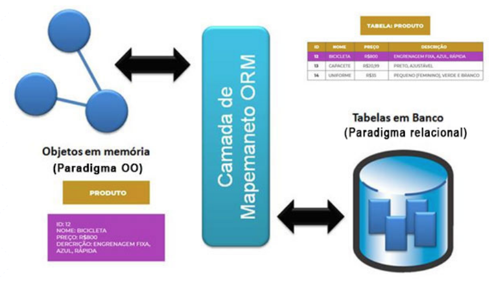 

Com base nas configurações, indicando qual atributo da classe é refletido em determinado campo do registro, além da especificação de chaves e relacionamentos, o framework de persistência cria todos os comandos SQL necessários, de modo transparente, e transmite os comandos gerados para o banco de dados através de uma biblioteca de **middleware**. 
 
No ambiente Java, os primeiros exemplos de tecnologias para ORM que obtiveram sucesso foram os **Entity Beans** e o **Hibernate**. As duas tecnologias adotaram o mapeamento baseado em XML, mas utilizaram padrões funcionais bastante distintos. 
 
Os **Entity Beans** fazem parte do J2EE, e trabalham de acordo com o padrão **Active Record**, no qual cada leitura de propriedade equivale a um comando de seleção no banco de dados, a alocação de um objeto inicia um comando de inserção, e quando alteramos o valor da propriedade, temos uma alteração no registro. Podemos chegar facilmente à conclusão de que o padrão é ineficiente, pois temos uma grande demanda de comandos SQL desnecessários, que poderiam ser executados em blocos. 
 
```java 
public abstract class ProdutoEntityBean implements EntityBean { 
  public abstract int getCodigo(); 
  public abstract void setCodigo(int codigo); 
  public abstract String getNome(); 
  public abstract void setNome(String nome); 
  public abstract int getQuantidade(); 
  public abstract void setQuantidade(int quantidade); 
  // O restante do código foi omitido 
} 
``` 
 
No fragmento de código, temos o início da definição de um Entity Bean, onde o objeto concreto é gerado pelo servidor de aplicativos, e as classes de entidade apresentam apenas as **propriedades**, definidas a partir de getters e setters **abstratos**, além de alguns métodos de gerência do ciclo de vida, aqui omitidos. O mapeamento do Entity Bean para a tabela deve ser feito com base na sintaxe XML, como no trecho apresentado a seguir, para o servidor **JBoss**.

```java 
<enterprise-beans> 
  <entity> 
    <ejb-name>ProdutoEntityBean</ejb-name> 
    <table-name>PRODUTO</table-name> 
    <cmp-field> 
      <field-name>codigo</field-name> 
      <column-name>COD_PRODUTO</column-name> 
    </cmp-field> 
    <cmp-field> 
      <field-name>nome</field-name> 
      <column-name>NOME</column-name> 
    </cmp-field> 
    <cmp-field> 
      <field-name>quantidade</field-name> 
      <column-name>QUANTIDADE</column-name> 
    </cmp-field> 
  </entity> 
</enterprise-beans> 
```
 
Já no framework **Hibernate**, temos o padrão **DAO**, de forma implícita, com os comandos sendo gerados a partir dos métodos de um gestor de persistência, com base no conjunto de elementos de mapeamento, e os dados presentes nas entidades. 
 
```java 
public class Produto { 
private int codigo; 
private String nome; 
private int quantidade; 
 
public Produto(){} 
// Os getters e setters das propriedades foram omitidos 
} 
``` 
 
As entidades, para o **Hibernate**, são apenas classes comuns, sem métodos de negócios, com um conjunto de propriedades e um construtor padrão. Todo o mapeamento deve ser efetuado através da sintaxe XML, como no trecho apresentado a seguir. 
 
```java 
<hibernate-mapping schema="loja"> 
  <class name="model.Produto" table="PRODUTO"> 
    <id name="codigo" type="int"> 
      <column name="COD_PRODUTO" /> 
    </id> 
    <property name="nome" type="string" column="NOME" /> 
    <property name="quantidade" type="int" column="QUANTIDADE" /> 
  </class> 
</hibernate-mapping> 
``` 
 
Através do XML, temos um modelo documental para o mapeamento, retirando do código as referências aos elementos do banco de dados, o que garante maior flexibilidade e menor acoplamento, além de possibilitar a troca da base de dados com a simples alteração dos arquivos XML. 
 
## Java persistence API (JPA) 
 
Embora o uso de XML tenha se tornado um padrão muito aceito na configuração do mapeamento objeto-relacional, além de exigir a escrita de uma grande quantidade de texto, também traz a desvantagem de verificar eventuais erros apenas no momento da implantação. Uma nova abordagem passou a trabalhar com anotações de código, no lugar do XML, deixando a escrita mais concisa, e permitindo que o compilador efetue a análise sintática, com a detecção de muitos erros ainda na fase de codificação. 
 
**Anotações** são metadados anexados ao código, utilizados ao nível da classe, atributos, métodos ou até parâmetros, e que permitem a leitura por ferramentas externas, com o objetivo de configurar funcionalidades adicionais. 
 
Um dos maiores avanços do Java foi a criação do JPA, pois **permitiu unificar os frameworks de persistência em uma arquitetura padrão, com apenas um arquivo de configuração, o persistence.xml**. Não é apenas uma biblioteca, mas uma API que define a interface comum, configurável através de **anotações**, que deve ser seguida pelos frameworks de persistência da plataforma Java, como Hibernate, Eclipse Link e Oracle Toplink. 
 
Trabalhando no mesmo estilo do Hibernate, através do JPA temos um padrão DAO implícito, trazendo grande eficiência nas tarefas de persistência, o que ainda é otimizado com base em recursos de **cache** de entidades em **memória**. Não é por menos que, na plataforma JEE atual, temos a substituição dos Entity Beans, presentes no J2EE, pelo JPA. 
 
Da mesma forma que no Hibernate clássico, para definir uma entidade JPA devemos criar um **POJO (Plain Old Java Object)**, ou seja, **uma classe sem métodos de negócios, mas com atributos definidos de forma privada e métodos de acesso públicos**, além de um construtor padrão e alguns métodos utilitários, como **hash**. A entidade definida deve receber **anotações**, que serão responsáveis pelo **mapeamento** efetuado entre a classe e a tabela, ou seja, o **mapeamento objeto-relacional**. 
 
```java 
@Entity 
@Table(name = "PRODUTO") 
@NamedQueries({ 
@NamedQuery(name = "Produto.findAll", 
query = "SELECT p FROM Produto p")}) 
public class Produto implements Serializable { 
	private static final long serialVersionUID = 1L; 
	@Id 
	@Basic(optional = false) 
	@Column(name = "COD_PRODUTO") 
	private Integer codigo; 
	@Column(name = "QUANTIDADE") 
	private Integer quantidade; 

	public Produto() { 
	} 
	public Produto(Integer codigo) { 
		this.codigo = codigo; 
	} 
	// Os getters e setters das propriedades foram omitidos 
	@Override 
	public int hashCode() { 
		int hash = 0; 
		hash += (codigo != null ? codigo.hashCode() : 0); 
		return hash; 
	} 
	@Override 
	public boolean equals(Object object) { 
		if (object==null||!(object instanceof Produto)) { 
			return false; 
		} 
		Produto other = (Produto) object; 
		return this.codigo!=null && 
			this.codigo.equals(other.codigo); 
	} 
	@Override 
	public String toString() { 
		return "model.Produto[ codigo=" + codigo + " ]"; 
	} 
} 
``` 
 
A anotação **Entity** define a classe Produto como uma entidade para o JPA, enquanto **Table** especifica a tabela para a qual será mapeada no banco de dados, com base no parâmetro name. Temos ainda uma anotação **NamedQueries**, agrupando um conjunto de anotações **NamedQuery**, as quais são utilizadas para criar consultas através de uma sintaxe própria do JPA, denominada **JPQL (Java Persistence Query Language)**. 
 
Após configurar a tabela que será representada pela entidade, precisamos completar as informações de mapeamento ao nível dos **atributos**, com o uso da anotação **Column** e o nome do campo definido no parâmetro **name**. Com o uso de **Id** definimos qual atributo representará a chave primária, e tornamos um atributo obrigatório através da anotação **Basic**, tendo o parâmetro **optional** configurado com valor false. 
 
As principais anotações do JPA podem ser observadas no quadro seguinte. 

| Anotação   | Utilização 
| ---        | --- 
| Entity     | Marca a classe como uma entidade para o JPA. 
| Table      | Especifica a tabela que será utilizada no mapeamento. 
| Column     | Mapeia o atributo para o campo da tabela. 
| Id         | Especifica o atributo mapeado para a chave primária. 
| Basic      | Define a obrigatoriedade do campo ou o modo utilizado para a carga de dados. 
| OneToMany  | Mapeia a relação **1XN** do lado da entidade principal através de uma **coleção**. 
| ManyToOne  | Mapeia a relação **1XN** do lado da entidade dependente, com base em uma classe de **entidade**. 
| OneToOne   | Mapeia o relacionamento **1X1** com atributos de **entidade** em ambos os lados. 
| ManyToMany | Mapeia o relacionamento **NXN** com atributos de **coleção** em ambos os lados. 
| OrderBy    | Define a regra que será adotada para ordenar a coleção. 
| JoinColumn | Especifica a regra de relacionamento da chave estrangeira ao nível das tabelas. 
|            |  

As entidades JPA devem conter dois **construtores**, sendo um vazio e outro baseado na chave primária, como podemos verificar no código de Produto, além dos métodos **equals e hashCode**. 
 
Para a entidade Produto, os dois métodos utilitários são baseados no atributo **codigo**, o que é natural, já que ele recebe o valor da chave primária, tendo a capacidade de **individualizar** a instância da entidade em meio a uma coleção. 
 
Além dos elementos descritos até aqui, utilizados na definição da estrutura de nossa entidade, precisamos do atributo **serialVersionUID**, referente à versão da classe, algo que será relevante para os processos de migração da base de dados. Temos ainda uma implementação de **toString**, que não é obrigatória, mas nos dá controle sobre a representação da entidade como texto em alguns componentes visuais, ou na impressão para a linha de comando. 
 
Além das anotações nas entidades, precisamos de um arquivo de configuração, com o nome **persistence.xml**, onde serão definidos os aspectos gerais da conexão com o banco de dados. O arquivo deve ser criado na pasta **META-INF**, e os parâmetros podem incluir elementos como a classe de conexão **JDBC (Java Database Connectivity)** ou o pool de conexões do servidor, estando sempre presente a especificação do framework de persistência que será utilizado. 
 
```xml 
<?xml version="1.0" encoding="UTF-8"?> 
<persistence version="2.1" 
	xmlns="http://xmlns.jcp.org/xml/ns/persistence" 
	xmlns:xsi="http://www.w3.org/2001/XMLSchema-instance" 
	xsi:schemaLocation="http://xmlns.jcp.org/xml/ns/persistence 
	http://xmlns.jcp.org/xml/ns/persistence/persistence_2_1.xsd"> 
<persistence-unit name="ExemploSimplesJPAPU" 
	transaction-type="RESOURCE_LOCAL"> 
<provider> 
	org.eclipse.persistence.jpa.PersistenceProvider; 
</provider> 
<class>model.Produto</class> 
<properties> 
	<property name="javax.persistence.jdbc.url" 
		value="jdbc:derby://localhost:1527/bancoJPA"/> 
	<property name="javax.persistence.jdbc.driver" 
		value="org.apache.derby.jdbc.ClientDriver"/> 
	<property name="javax.persistence.jdbc.user" 
		value="bancoJPA"/> 
	<property name="javax.persistence.jdbc.password" 
		value="bancoJPA"/> 
</properties> 
</persistence-unit> 
</persistence> 
``` 
 
A primeira informação relevante é o nome da **unidade de persistência (ExemploSimplesJPAPU)**, com o tipo de **transação** que será utilizado. **Transações** são necessárias para garantir o nível de isolamento adequado entre tarefas, como no caso de múltiplos usuários acessando o mesmo banco de dados. 
 
O controle transacional pode ocorrer a partir de um gestor próprio, para uso no ambiente **JSE (Java Standard Edition)** ou pelo **JEE (Java Enterprise Edition)** no modelo **não gerenciado**, mas também permite o modo gerenciado, através da integração com **JTA (Java Transaction API)**. 
 
**Tipos de transação**:  
* RESOURCE_LOCAL: Utiliza o gestor de transações do JPA, para execução no JSE ou no modelo não gerenciado do JEE. 
* JTA: Ativa a integração com JTA, para utilizar o gerenciamento de transações pelo JEE. 
 
Em seguida, é definido o provedor de persistência no elemento **provider**, em nosso caso a classe **PersistenceProvider** do **Eclipse Link**. As classes de entidade englobadas devem ser especificadas nos elementos class, para o modelo de acesso local, e as propriedades da conexão são definidas no grupo **properties**, o que inclui o driver **JDBC** utilizado, a URL de conexão, bem como o usuário e a senha do banco de dados. 
 
## Consulta e manipulação de dados 
 
Com as entidades mapeadas e a conexão configurada, podemos efetuar as consultas e manipulações sobre os dados através de um objeto do tipo **EntityManager**. O gestor de entidades, ou EntityManager, concentra todos os métodos necessários para invocar os comandos **INSERT, UPDATE, DELETE e SELECT**, no banco de dados, montados pelo JPA a partir das anotações da entidade, de uma forma totalmente transparente. 
 
```java 
public class Principal { 
    public static void main(String[] args) { 
        EntityManagerFactory emf = 
            Persistence.createEntityManagerFactory( 
                    "ExemploSimplesJPAPU"); 
        EntityManager em = emf.createEntityManager(); 
        Query query = em.createNamedQuery("Produto.findAll"); 
        List<Produto> lista = query.getResultList(); 
        lista.forEach((e) -> { 
            System.out.println(e.getNome()); 
        }); 
        em.close(); 
    } 
} 
``` 
 
**Passo 1**: O primeiro passo em nosso código é a definição do EntityManagerFactory, utilizando o nome da unidade de persistência (ExemploSimplesJPAPU). Em seguida, obtemos uma instância de EntityManager a partir da fábrica de gestores, através de uma chamada para o método **createEntityManager**. 
 
**Passo 2**: Com o gestor instanciado, obtemos um objeto do tipo Query, com a chamada para **createNamedQuery**, tendo como base uma anotação do tipo NamedQuery com name valendo Produto.findAll, a qual está anexada à classe Produto. As consultas nomeadas devem apresentar nomes diferentes, pois a busca é feita em todas as entidades, o que poderia gerar dualidades durante a execução. 
 
**Passo 3**: O resultado da consulta ao banco de dados é obtido com a chamada para o método **getResultList**, na forma de uma coleção de produtos do tipo List. Em termos práticos, a instrução JPQL é transformada em um comando SQL, o qual é transmitido para o banco de dados via JDBC, e o resultado da consulta é convertido em uma coleção de objetos, a partir do mapeamento efetuado com as anotações do JPA. Ao final, encerramos toda a comunicação com o banco de dados, utilizando o método **close** de nosso EntityManager. Embora o próprio coletor de lixo do Java possa causar a interrupção da conexão, a chamada para o método close é mais eficiente. 
 
Após receber a coleção de produtos, nós podemos percorrê-la através de um loop no estilo foreach, ou operador funcional equivalente, com a impressão do nome para cada produto encontrado. 
Note que o JPA não elimina o uso de JDBC, pois o que temos é a geração dos comandos SQL, de forma automatizada, a partir das informações oferecidas pelas anotações. 
 
Agora podemos verificar como é feita a inclusão de um produto em nossa base de dados. 
 
```java 
public static void incluir(Produto p){ 
    EntityManagerFactory emf = 
        Persistence.createEntityManagerFactory( 
                "ExemploSimplesJPAPU"); 
    EntityManager em = emf.createEntityManager(); 
    try { 
        em.getTransaction().begin(); 
        em.persist(p); 
        em.getTransaction().commit(); 
    }catch(Exception e){ 
        em.getTransaction().rollback(); 
    }finally{ 
        em.close(); 
    } 
} 
``` 
 
Devido ao fato de uma inclusão poder gerar erros durante a execução, o ideal é que seja efetuada dentro de uma **transação**. Na verdade, qualquer manipulação de dados efetuada a partir do JPA irá exigir uma transação, podendo ser local ou via JTA. 
 
Após obtermos uma instância de EntityManager na variável **em**, é definido um bloco de código protegido, onde a transação é iniciada com **begin**, seguida da inclusão do produto na base de dados através do método **persist**, e temos a confirmação da transação com o uso de **commit**. 
 
Caso ocorra um erro, todas as alterações efetuadas são desfeitas com o uso de **rollback**, e ainda temos um trecho **finally**, onde fechamos a comunicação com o uso de close, independente da ocorrência de erros. 
 
Para efetuar a alteração dos dados de um registro, temos um processo muito similar, trocando apenas o método **persist** por **merge**. 
 
```java 
public static void alterar(Produto p){ 
    EntityManagerFactory emf = 
        Persistence.createEntityManagerFactory( 
                "ExemploSimplesJPAPU"); 
    EntityManager em = emf.createEntityManager(); 
    try { 
        em.getTransaction().begin(); 
        em.merge(p); 
        em.getTransaction().commit(); 
    }catch(Exception e){ 
        em.getTransaction().rollback(); 
    }finally{ 
        em.close(); 
    } 
} 
``` 
 
Na exclusão de um registro, inicialmente deve ser feita a busca, com base na classe da entidade e o valor da chave primária, através do método **find**. Será retornada uma entidade, como resultado da consulta, e nós a utilizaremos como parâmetro para a chamada ao método **remove**, efetuando a exclusão no banco de dados. 
 
```java 
public static void excluir(Integer codigo){ 
    EntityManagerFactory emf = 
        Persistence.createEntityManagerFactory( 
                "ExemploSimplesJPAPU"); 
    EntityManager em = emf.createEntityManager(); 
    try { 
        em.getTransaction().begin(); 
        em.remove(em.find(Produto.class, codigo)); 
        em.getTransaction().commit(); 
    }catch(Exception e){ 
        em.getTransaction().rollback(); 
    }finally{ 
        em.close(); 
    } 
} 
``` 
 
Observando os trechos de código apresentados, podemos concluir facilmente que os métodos **find, persist, merge e remove** correspondem, respectivamente, à execução dos comandos **SELECT, INSERT, UPDATE e DELETE**, ao nível do banco de dados. 
 
## Execução do aplicativo 
 
Quando executamos um aplicativo com elementos JPA no servidor, temos todas as bibliotecas necessárias disponíveis, mas a execução local irá necessitar da inclusão de algumas bibliotecas ao projeto. 
 
Trabalharemos com o banco de dados **Derby**, também chamado de **Java DB**, exigindo a inclusão da biblioteca JDBC correta. É interessante observar que o Derby é um banco de dados implementado em Java, que faz parte da distribuição padrão da plataforma, e que pode ser executado de forma local ou no servidor. 
 
Para adicionar a biblioteca JDBC do Derby ao projeto, vamos clicar com o botão direito sobre a divisão Libraries, e escolher a opção Add Library. Na janela que se abrirá, selecionaremos apenas a opção Java DB Driver e clicaremos no botão Add Library. 
 
Precisamos acrescentar o framework JPA escolhido, no caso, o **Eclipse Link**. Após efetuar o download da versão mais recente do Eclipse Link, no formato zip, e extrair para algum diretório de fácil acesso, crie uma biblioteca através da opção de menu Tools.Libraries, seguido do clique sobre o botão New Library. Daremos a ela o nome EclipseLink2.7, e adicionaremos o arquivo eclipselink.jar, presente no diretório jlib, além de todos os arquivos no formato jar do subdiretório jpa. 
 
Após a definição da nova biblioteca, vamos adicionar ao projeto, da mesma forma que fizemos para o driver JDBC, clicando com o botão direito sobre a divisão Libraries, e escolhendo a opção Add Library. Ao final, teremos a configuração de bibliotecas para o projeto. 
 
Agora só precisamos de um banco de dados Derby, que será criado de forma simples, através da aba Services do NetBeans, na divisão Databases. 
 
Para criarmos um banco de dados, precisamos clicar com o botão direito sobre o driver Java DB, selecionável com a abertura da árvore de Databases, seguido da escolha da opção Create Database, no menu de contexto. Na janela que será aberta, efetuaremos o preenchimento do nome de nosso novo banco de dados com o valor "bancoJPA", bem como usuário e senha, onde podemos também utilizar o valor "bancoJPA" para ambos. 
 
Ao clicar no botão de confirmação, o banco de dados será criado e ficará disponível para conexão, através do driver JDBC. A conexão é identificada por sua Connection String, tendo como base o endereço de rede (localhost), a porta padrão (1527) e a instância (bancoJPA). 
 
A conexão é aberta com o duplo-clique sobre o identificador, ou o clique com o botão direito e escolha da opção Connect. Com o banco de dados aberto, vamos executar os comandos SQL necessários para a criação e alimentação da tabela, clicando com o botão direito sobre a conexão e escolhendo a opção Execute Command. 
 
Veremos que a janela de edição de SQL será aberta, permitindo que seja digitado o script apresentado a seguir. Para executar nosso script, devemos pressionar CTRL+SHIFT+E, ou clicar sobre o botão de execução de SQL, disponibilizado na parte superior do editor. 
 
```sql 
CREATE TABLE PRODUTO ( 
COD_PRODUTO INTEGER NOT NULL PRIMARY KEY, 
NOME VARCHAR(50), 
QUANTIDADE INTEGER); 
 
INSERT INTO PRODUTO VALUES (1,'Morango',200); 
INSERT INTO PRODUTO VALUES (2,'Banana',1000); 
INSERT INTO PRODUTO VALUES (3,'Manga',600); 
 
SELECT * FROM PRODUTO; 
``` 
 
Ao final da execução, será apresentada a listagem da tabela, com os registros inseridos, na própria janela de edição, em uma divisão própria, e agora podemos executar nosso projeto. 
 
# Empregar componentes EJB na construção de regras de negócio 
 
## Enterprise Java Beans (EJB) 
 
De forma geral, uma arquitetura de objetos distribuídos é o elemento central para qualquer servidor de aplicativos. No ambiente Java não poderia ser diferente, como podemos observar no uso de componentes **EJB (Enterprise Java Bean)** em servidores como **GlassFish, JBoss e WebSphere**. 
 
Um EJB é um componente corporativo, utilizado de forma indireta, dentro de um ambiente de objetos distribuídos, suportando transações locais e distribuídas, recursos de autenticação e segurança, acesso a banco de dados via pool de conexões, e demais elementos da plataforma JEE (Java Enterprise Edition). Todo EJB executa dentro de um pool de objetos, em que o número de instâncias irá aumentar ou diminuir, de acordo com a demanda de solicitações efetuadas, segundo um intervalo de tempo estabelecido. 
 
Um pool de objetos segue o padrão de desenvolvimento Flyweight, no qual o objetivo é responder a uma grande quantidade de requisições através de um pequeno conjunto de objetos. 
O acesso aos serviços oferecidos pelo pool de EJBs deve ser solicitado a partir de uma interface local (EJBLocalObject) ou remota (EJBObject), onde as interfaces são geradas a partir de componentes de fábrica, criadas com a implementação de EJBLocalHome, para acesso local, ou EJBHome, para acesso remoto. Como é padrão na plataforma Java, as fábricas são registradas e localizadas via JNDI (Java Naming and Directory Interface). 
 
O processo para acessar o pool de EJBs envolve três passos: 
1. Cliente acessa a fábrica de interfaces através de JNDI. 
2. A interface de acesso é gerada pela fábrica. 
3. Cliente recebe a interface, podendo iniciar o diálogo com o pool. 
 
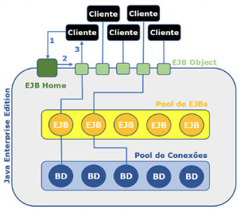 

Podemos observar muitos padrões de desenvolvimento no ambiente dos EJBs: 
* Service Locator: Para acesso aos componentes registrados via JNDI. 
* Abstract Factory: Na definição da fábrica de interfaces. 
* Proxy: Na comunicação com clientes remotos e, como citado anteriormente. 
* Flyweight: Na concepção do pool de objetos. 
 
O acesso ao banco de dados, no ambiente JEE, também ocorre de forma diferenciada, pois ao invés de uma conexão JDBC simples, obtida a partir do DriverManager, temos um pool de conexões JDBC, representado por um objeto do tipo DataSource, que assim como os EJBs, é registrado via JNDI. Quando solicitamos uma conexão ao DataSource, não estamos abrindo uma nova conexão, mas reservando uma das disponíveis no pool, e quando invocamos o método **close**, não ocorre a desconexão, mas, sim, a liberação da conexão para a próxima requisição. 
 
No fragmento de código seguinte, temos um exemplo de acesso e utilização de um pool de conexões, na linguagem Java, que poderia ser utilizado em um Servlet. Após obter o recurso via JNDI, através do método **lookup** de InitialContext, efetuamos a conversão para o tipo correto, no caso um DataSource, o qual fornece conexões através do método **getConnection**, e a partir daí, a programação é a mesma de um acesso local ao banco de dados, com a única diferença ocorrendo no comportamento do método **close**, que agora libera a conexão no pool para o próximo requisitante. 
 
```java 
protected void processRequest(HttpServletRequest request, 
    HttpServletResponse response) 
    throws ServletException, IOException { 
    response.setContentType("text/html;charset=UTF-8"); 
    try (PrintWriter out = response.getWriter()) { 
        out.println("<html><body>"); 
        try { 
            InitialContext ctx = new InitialContext(); 
            DataSource dts = (DataSource) ctx.lookup("jdbc/loja"); 
            Connection c1 = dts.getConnection(); 
            Statement st = c1.createStatement(); 
            ResultSet rs = st.executeQuery("SELECT * FROM PRODUTO"); 
            while(rs.next()) 
                out.println(rs.getString("NOME")+" 
                        "); 
                    c1.close(); 
        } catch (SQLException | NamingException ex) { 
        } 
        out.println(""); 
    } 
} 
``` 
 
Como utilizamos JPA, não é necessário efetuar toda essa codificação para localização e utilização do pool, ficando a cargo do framework de persistência. No fluxo normal de execução, o cliente faz uma solicitação para a interface de acesso, que é repassada para o pool de EJBs, sendo disponibilizado um deles para responder, e na programação do EJB, utilizamos o JPA para obter acesso ao banco de dados a partir do DataSource, com o controle transacional sendo efetuado através do JTA (Java Transaction API). 
 
No J2EE, existia um EJB para persistência, denominado Entity Bean, que seguia o padrão Active Record, mas ele se mostrou inferior, em termos de eficiência, quando comparado a alguns frameworks de persistência, sendo substituído pelo JPA no JEE5. 
 
A programação, no modelo adotado a partir do JEE5, é bastante simples, e precisaremos apenas das anotações corretas para que os Application Servers, como o JBoss ou o GlassFish, se encarreguem de montar toda a estrutura necessária. Isso é bem diferente do processo de criação adotado pelo J2EE, com implementação baseada em contrato, envolvendo uma grande quantidade de interfaces, classes e arquivos XML, e tendo a verificação apenas no momento da implantação do sistema, já que não era um modelo de compilação formal. 
 
## Session Beans 
 
Quando trabalhamos com os componentes do tipo EJB, estamos preocupados com as regras de negócio de nosso aplicativo, ou seja, visamos à implementação da lógica do sistema, com base nas entidades e nos requisitos definidos, sem qualquer preocupação com a estrutura de persistência que será utilizada. Também devemos observar que as regras de negócio devem ser totalmente independentes das interfaces do sistema, não devendo ser direcionadas para nenhum ambiente específico.    
 
O primeiro tipo de EJB que deve ser observado é o de **sessão**, responsável por efetuar processos de negócios de forma **síncrona**, e configurável de três formas distintas, como podemos observar no quadro seguinte. 

| Comportamento | Descrição 
| ---           | ---        
| Stateless     | Não permite a manutenção de estado, ou seja, não guarda valores entre chamadas sucessivas. 
| Stateful      | Utilizado quando é necessário manter valores entre chamadas sucessivas, como no caso de somatórios. 
| Singleton     | Permite apenas uma instância por máquina virtual, garantindo o compartilhamento de dados entre todos os usuários. 
 
Utilizamos Stateless quando não precisamos de informações dos processos anteriores ao corrente. Qualquer instância do pool de EJBs pode ser escolhida, e não é necessário efetuar a carga de dados anteriores, definindo o padrão de comportamento mais ágil para um Session Bean. 
 
O comportamento Stateful deve ser utilizado apenas quando precisamos de informações anteriores, como em uma cesta de compras virtual, ou processos com acumuladores em cálculos estatísticos, entre outras situações com necessidade de gerência de estados. 
 
Antes de definir um Session Bean, devemos definir sua interface de acesso, com base na anotação Local, para acesso interno, ao nível do servidor, ou Remote, permitindo que o componente seja acessado remotamente. Em nossos estudos, o uso de acesso local será suficiente, já que teremos o acionamento dos EJBs a partir dos Servlets. 
 
```java 
@Local 
public interface CalculadoraLocal { 
  int somar(int a, int b); 
} 
``` 
 
Ao criarmos o EJB, ele deverá implementar a interface de acesso, além de ser anotado como Stateless ou Stateful, dependendo da necessidade do negócio. Para uma calculadora simples, não precisaríamos de gerência de estados. 
 
```java 
@Stateless 
public class Calculadora implements CalculadoraLocal { 
  @Override 
  public int somar(int a, int b) { 
    return a + b; 
  } 
} 
``` 
 
Quanto ao EJB do tipo Singleton, ele é utilizado quando queremos compartilhar dados entre todos os usuários conectados, mesmo na execução sobre múltiplas máquinas virtuais, em ambientes distribuídos. Não podemos esquecer que os EJBs são uma tecnologia corporativa, e que a execução de forma clusterizada não é uma exceção em sistemas de missão crítica. 
 
Em um cluster, temos um conjunto de computadores atuando como se fossem apenas um, o que traz grande poder de processamento e menor possibilidade de interrupções, já que a falha de um computador causará a redistribuição das tarefas para os demais. 
 
Para utilizar um componente do tipo Session Bean a partir de um Servlet, o processo é trivial. 
 
```java 
@WebServlet(name = "ServletSoma", 
urlPatterns = {"/ServletSoma"}) 
public class ServletSoma extends HttpServlet { 

    @EJB 
    CalculadoraLocal facade; 

    protected void doGet(HttpServletRequest request, 
        HttpServletResponse response) 
        throws ServletException, IOException { 
        response.setContentType("text/html;charset=UTF-8"); 
        try (PrintWriter out = response.getWriter()) { 
            out.println("<html><body>"); 

            out.println("<h1>Servlet ServletSoma: " + 
                    facade.somar(2, 3) + "</h1>"); 
            out.println("</body>"); 
            out.println("</html>"); 
        } 
    } 
} 
``` 
 
Tudo que precisamos fazer é anotar um atributo, do tipo da interface local, com EJB, e no código de resposta à chamada HTTP, invocamos os métodos da interface, como se fossem chamadas locais. No exemplo, temos a interface CalculadorLocal referenciada no atributo facade, o que permite invocar o método somar, sendo executado pelo pool. 
 
O uso da interface CalculadoraLocal permite solicitar os serviços do Session Bean, em meio ao pool de objetos, como se fossem simples chamadas locais. 
 
Quase todos os processos de negócio de um sistema corporativo, na plataforma JEE, são implementados através de Session Beans, mas alguns comportamentos não podem ser definidos de forma síncrona, exigindo um componente adequado para a comunicação com mensagerias, segundo um modelo assíncrono. 
 
## Message Driven Beans 
 
A tecnologia de mensagerias é muito importante para satisfazer aos requisitos de um sistema corporativo. Elas atuam de forma assíncrona e permitem a adoção do domínio **point to point**, onde as mensagens são enfileiradas para um tratamento sequencial no destinatário, ou **publish/subscribe**, onde as mensagens são depositadas em tópicos, para que os assinantes as recuperem. 
 
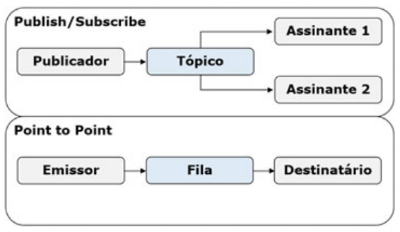 

O uso de mensagerias permite a construção de sistemas B2B (business to business), quase sem acoplamento, em que o único elemento de ligação entre os sistemas das duas empresas é a mensagem transmitida entre elas. A rede bancária utiliza amplamente as mensagerias, ao efetuar transações eletrônicas entre instituições diferentes, o que possibilita que um cliente solicite uma transferência, sem precisar esperar que ela seja concluída, já que não ocorre bloqueio do emissor. 
 
Após o cliente (**emissor ou publicador**) postar uma mensagem, a responsabilidade sobre a gerência dela passa a ser da mensageria, até o momento em que seja retirada pelos receptores. Já que as mensagerias funcionam como repositórios, gerenciando a persistência das mensagens, mesmo que o receptor esteja inativo, as mensagens não se perdem, sendo acumuladas até o momento em que o receptor seja ativado. 
 
Para criar filas ou tópicos no **GlassFish**, é necessário utilizar o comando **asadmin**, como no exemplo seguinte, para a criação de uma fila denominada jms/SimpleQueue. 
 
```java 
asadmin create-jms-resource --restype javax.jms.ConnectionFactory 
jms/SimpleConnectionFactory 
 
asadmin create-jms-resource --restype javax.jms.Queue 
jms/SimpleQueue 
``` 
 
Também podemos abrir o console do asadmin, sem a passagem de parâmetros, e depois invocar os comandos internamente. 
 
Existe um tipo de EJB denominado MDB (message driven bean), que tem como finalidade a comunicação com mensagerias via JMS, possibilitando o processamento assíncrono no JEE. Através do MDB é possível trabalhar nos dois domínios de mensagerias, com o tratamento de mensagens sendo feito através do pool de EJBs, a partir de um único método, que tem o nome onMessage representando os eventos de recepção de mensagens. 
 
```java 
@MessageDriven(activationConfig = { 
@ActivationConfigProperty(propertyName = "destinationLookup", 
propertyValue = "jms/SimpleQueue"), 
@ActivationConfigProperty(propertyName = "destinationType", 
propertyValue = "javax.jms.Queue") 
}) 
public class Mensageiro001 implements MessageListener { 

    public Mensageiro001() { 
    } 

    @Override 
    public void onMessage(Message message) { 
        try { 
            System.out.println("Mensagem enviada: "+ 
                    ((TextMessage)message).getText()); 
        } catch (JMSException ex) { 
            System.out.println("Erro: "+ex.getMessage()); 
        } 
    } 
} 
``` 
 
No código de exemplo, temos uma anotação MessageDriven, para a definição do MDB, com a configuração para acesso a jms/SimpleQueue, do tipo javax.jms.Queue, através de anotações ActivationConfigProperty. Também é possível utilizar canais internos do projeto, mas o uso de canais do servidor viabiliza o comportamento B2B, com acesso a partir de qualquer plataforma que dê suporte ao uso de mensagerias. 
 
Para o tratamento das mensagens, devemos implementar a interface MessageListener, que contém apenas o método onMessage. A mensagem é recebida no parâmetro do tipo Message, que pode ser qualquer descendente da classe, segundo os princípios da orientação a objetos, o que torna necessário converter para o tipo correto, como no exemplo, onde temos a captura de um texto enviado via TextMessage, e a impressão da mensagem no console do GlassFish.  
 
Algo importante, acerca do MDB, é que ele foi projetado exclusivamente para receber mensagens, a partir de filas ou tópicos, o que faz com que não possa ser acionado diretamente, como os Session Beans. Para sua ativação, basta que um cliente poste uma mensagem. 
 
```java 
@WebServlet(name = "ServletMessage", 
urlPatterns = {"/ServletMessage"}) 
public class ServletMessage extends HttpServlet { 
    @Resource(mappedName = "jms/SimpleConnectionFactory") 
    private ConnectionFactory connectionFactory; 
    @Resource(mappedName = "jms/SimpleQueue") 
    private Queue queue; 

    public void putMessage() throws ServletException { 
        try { 
            Connection connection = 
                connectionFactory.createConnection(); 
            Session session = 
                connection.createSession(false, 
                        Session.AUTO_ACKNOWLEDGE); 
            MessageProducer messageProducer = 
                session.createProducer(queue); 
            TextMessage message = session.createTextMessage(); 
            message.setText("Teste com MDB"); 
            messageProducer.send(message); 
        } catch (JMSException ex) { 
            throw new ServletException(ex); 
        } 
    } 

    protected void doGet(HttpServletRequest request, 
        HttpServletResponse response) 
        throws ServletException, IOException { 
        response.setContentType("text/html;charset=UTF-8"); 
        try (PrintWriter out = response.getWriter()) { 
            out.println(""); 
            out.println(""); 

            putMessage(); 

            out.println("<h1>Mensagem Enviada</h1>"); 
            out.println(""); 
        } 
    } 
} 
``` 
 
O processo é um pouco mais complexo que o adotado para os Session Beans, porém apresenta menor acoplamento. 
 
**Passo 1**: Inicialmente, devemos mapear a fábrica de conexões da mensageria e a fila de destino do MDB, através de anotações Resource. 
 
**Passo 2**: Com os recursos mapeados, definimos o método putMessage, para envio da mensagem, onde devemos criar uma conexão (Connection) a partir da fábrica, a sessão (Session) a partir da conexão, e o produtor de mensagens (MessageProducer) a partir da sessão. Na inicialização do MessageProducer, utilizamos o recurso de fila mapeado, indicando que ele deve apontar para a fila (Queue) destinada ao MDB. 
 
**Passo 3**: Após configurar a conexão, criamos a mensagem de texto (TextMessage) através da sessão, definimos o texto que será enviado com setText, e finalmente enviamos a mensagem, a partir do produtor, com o uso de send, finalizando a definição do método putMessage. Com o método completo, podemos utilizá-lo na resposta do Servlet ao protocolo HTTP, e verificar a mensagem na saída do GlassFish. 
 
## Aplicativo corportativo 
 
Para que possamos trabalhar com EJBs, através do ambiente do NetBeans, devemos definir um projeto corporativo. A sequência de passos para criar o Aplicativo Corporativo é:  
1. Criar um projeto do tipo Enterprise Application, na categoria Java Enterprise. 
2. Preencher o nome (ExemploEHB) e local do projeto 
3. Escolher o servidor (GlassFish) e versão do JEE(Java EE7), além de marcar as opções de criação para os módulos EJB e Web. 
 
Seguindo os passos anteriores corretamente, serão gerados três projetos, e poderemos visualizá-los na interface do NetBeans. 
 
O quadro seguinte apresenta as características de cada um dos projetos. 
 
| Projeto        | Característica 
| ---            | ---
| ExemploEJB-ejb |  Utilizado na definição das entidades JPA e dos componentes EJB, sendo compilado com a extensão "jar". 
| ExemploEJB-war | Contém os elementos para Web, como Servlets, Facelets e páginas XHTML, compilados para um arquivo "war". 
| ExemploEJB     | Agrupa os dois projetos anteriores, compactados em apenas um arquivo, com adoção da extensão "ear", para implantação. 
 
Quando trabalhamos com um projeto corporativo, devemos implantar o projeto principal, com extensão ear (Enterprise Archived), cujo ícone é um triângulo, pois qualquer tentativa de implantar os dois projetos secundários irá impedir a execução correta do conjunto, exigindo que seja feita a remoção manual dos projetos anteriores pela aba de Serviços. 
 
Agora, vamos criar nosso primeiro Session Bean, configurado como Stateless, no projeto secundário ExemploEJB-ejb, adicionando um novo arquivo e seguindo os seguintes passos: 
1. Selecionar o tipo de Session Bean na categoria Enterprise Java Beans 
2. Definir o nome (Calculadora) e pacote (ejbs) do novo Session Bean, escolher o tipo como Stateless e marcar apenas a interface Local. 
 
Em diversas situações, a IDE mostra um erro de compilação, decorrente da importação dos componentes da biblioteca javax.ejb. Caso o problema ocorra, a solução é simples, com a inclusão da biblioteca Java EE 7 API no projeto. 
 
Após incluir as bibliotecas necessárias, podemos completar os códigos de Calculadora e CalculadoraLocal, de acordo com os exemplos apresentados anteriormente, e iremos testar o EJB, ainda seguindo os exemplos, através de um Servlet. Já que os componentes Web são criados ao nível de ExemploEJB-war, devemos acessar o projeto e adicionar novo arquivo do tipo Servlet, na categoria Web, com o nome ServletSoma e pacote servlets, sem adicionar informações ao arquivo web.xml. 
 
Com o componente ServletSoma criado, utilizamos o código de exemplo definido antes, com a chamada para o EJB, executamos o projeto principal (ExemploEJB), e efetuamos a chamada apropriada: http://localhost:8080/ExemploSimplesJPA-war/ServletSoma 
 
Estando tudo correto, teremos a saída apresentada a seguir. 
 
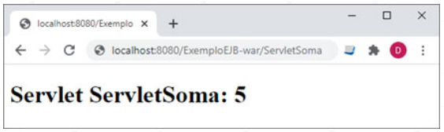
 
Quanto ao EJB do tipo MDB, para criá-lo, devemos adicionar, no projeto ExemploEJB-ejb, um novo arquivo do tipo Message Driven Bean, na categoria Enterprise Java Beans. 
 
Precisamos definir o nome (Mensageiro001) e o pacote do componente, além de escolher a fila para as mensagens no servidor (jms/SimpleQueue), como na figura seguinte. 
 
Todos os passos para a codificação de Mensageiro001 foram descritos anteriormente, bem como a do Servlet para postagem da mensagem, com o nome ServletMessage, mas lembre-se de que o Servlet deve ser criado no projeto ExemploEJB-war. Com todos os componentes implementados, basta implantar o sistema, a partir do projeto principal, e efetuar a chamada correta no navegador: http://localhost:8080/ExemploSimplesJPA-war/ServletMessage 
 
Após efetuar a chamada, será apresentada a página com a informação de que ocorreu o envio da mensagem, o que poderá ser verificado no console de saída do GlassFish, conforme descrito anteriormente. 
 
# Descrever a utilização da arquitetura MVC na plataforma Java 
 
## Padrões de desenvolvimento 
 
A orientação a objetos representou um grande avanço na implementação de sistemas, pois aproximou a modelagem da codificação, mas o uso incorreto da metodologia levou à perda de diversas vantagens. Os padrões de desenvolvimento, que definem a formalização de soluções reutilizáveis, com nome, descrição da finalidade, modelagem UML e modo de utilização, permitiram recuperar as vantagens, baseando-se na adoção de soluções eficazes para a construção de sistemas orientados a objetos. 
 
Com os padrões, temos uma terminologia comum, pois permitem a utilização de um vocabulário básico e um ponto de vista semelhante sobre os problemas e possíveis soluções. Embora existam muitos padrões de desenvolvimento, alguns deles se destacam em um sistema cadastral corporativo, como Facade, Proxy, Flyweight, Front Controller e DAO (Data Access Object). 
 
Quando abordamos a tecnologia JPA, ficou claro que ocorre uma divisão entre os dados da entidade e o mapeamento objeto-relacional, já que, ao contrário dos atributos, as anotações não são serializáveis, impedindo a sua repercussão para outras camadas, o que é semelhante ao padrão DAO, no qual temos os comandos para acesso ao banco de dados agrupados em uma classe específica, separados da classe de entidade e de todo o restante do sistema. 
 
Também vimos a utilização de diversos padrões de desenvolvimento na arquitetura de componentes do tipo EJB, como Flyweight, para o pool de objetos, Abstract Factory, no fornecimento de interfaces de acesso locais ou remotas, Service Locator, necessário para a localização de recursos via JNDI, e Proxy, utilizado na comunicação remota. 
 
Outros componentes do sistema também deverão seguir padrões de desenvolvimento, visando a organizar as funcionalidades e facilitar a leitura do código-fonte, como o uso de Facade, ao nível dos Session Beans, ou Front Controller, aplicado aos Servlets. 
 
Temos a descrição formal dos padrões de desenvolvimento citados, além de alguns outros, comuns em sistemas criados para o ambiente JEE: 
* Abstract Factory: Definição de uma arquitetura abstrata para a geração de objetos, muito comum em frameworks. 
* Command: Encapsular o processamento da resposta para algum tipo de requisição, muito utilizado para o tratamento de solicitações feitas no protocolo HTTP. 
* Data Access Object: Utilização de classes específicas para concentrar as chamadas para o banco de dados. 
* Facade: Encapsular as chamadas para um sistema complexo, muito utilizado em ambientes corporativos. 
* Flyweight: Criação de grupos de objetos que respondem a uma grande quantidade de chamadas. 
* Front Controller: Concentrar as chamadas para o sistema, efetuando os direcionamentos corretos para cada chamada. 
* Iterator: Acesso sequencial aos objetos de uma coleção, o que é implementado nativamente no Java. 
* Proxy: Definição de um objeto para substituir a referência de outro, utilizado nos objetos remotos para deixar a conexão transparente para o programador. 
* Service Locator: Gerenciar a localização de recursos compartilhados, com base em serviços de nomes e diretórios. 
* Singleton: Garantir a existência de apenas uma instância para a classe, como em controles de acesso. 
* Strategy: Seleção de algoritmos em tempo de execução, com base em algum parâmetro fornecido. 
 
A simbologia utilizada para representar os padrões de desenvolvimento é um puzzle, algo muito justo ao considerarmos que os sistemas atuais são implementados através da combinação de diversos padrões. Um exemplo seria a criação de um pool de processadores de resposta para solicitações de usuários remotos, o que poderia ser caracterizado por um Flyweight de Strategies para a escolha de Commands, além da utilização de Proxy na comunicação com os clientes. 
 
## Padrões de arquiteturais 
 
A arquitetura de um sistema define a estrutura de alto nível do software, ou seja, formaliza a organização em termos de componentes e interações entre eles. Um dos objetivos é aproximar a visão de projeto da implementação do sistema, impedindo que ocorra a previsão de funcionalidades inviáveis para a fase de codificação. 
 
As especificações da arquitetura também definem as interfaces de entrada ou saída de informações, forma de comunicação com outros sistemas, e regras para o agrupamento dos componentes com base em suas áreas de atuação, entre outras características. 
 
Note que existem diversos perfis de sistemas, como aplicativos de linha de comando, ambientes baseados em janelas, ou até serviços sem interações diretas com o usuário, além da possibilidade de execução remota ou local, e cada perfil de execução traz algumas exigências estruturais. 
 
Padrões arquiteturais definem as regras do sistema em termos estruturais, ou seja, uma visão macroscópica do programa e suas relações com o ambiente. 
 
Um modelo arquitetural define uma arquitetura de forma abstrata, com foco apenas no objetivo ou característica principal, enquanto o estilo ou padrão arquitetural define o perfil dos componentes estruturais, modelo de comunicação e, até mesmo, quais são os padrões de desenvolvimento mais adequados na implementação. 
 
Por exemplo, o modelo de Objetos Distribuídos define apenas atributos essenciais para delimitar um ambiente com coleções de objetos respondendo a requisições remotas, enquanto o padrão arquitetural Broker define as regras de implementação, como o uso de Proxy na comunicação, ou a definição de pools de objetos no padrão Flyweight. 
 
Existem diferentes definições de modelos para os padrões arquiteturais, e alguns deles satisfazem a mais de um modelo, como podemos observar no quadro seguinte. 
 
| Padrão Arquitetural | Modelo(s) 
| ---                 | ---
| Broker              | Sistemas Distribuídos 
| Camadas             | Mud to Structure, Chamada e Retorno 
| Orientado a Objetos |  Chamada e Retorno 
| Programa Principal e Sub-rotina | Chamada e Retorno 
| Pipes/Filters       | Mud to Structure, Fluxo de Dados 
| Blackboard          | Mud to Structure, Centrada em Dados 
| Lote                | Fluxo de Dados 
| Repositório         | Centrada em Dados 
| Processos Comunicantes | Componentes Independentes 
| Event-Driven        | Componentes Independentes 
| Interpretador       | Máquina Virtual 
| Baseado em Regras   | Máquina Virtual 
| MVC                 | Sistemas Interativos 
| PAC                 | Sistemas Interativos 
| Microkernel         | Sistemas Adaptáveis 
| Reflexiva           | Sistemas Adaptáveis 
| |
 
A **arquitetura de referência** serve para definir o mapeamento de um padrão arquitetural para componentes de software que sejam capazes de implementar as funcionalidades requeridas de forma cooperativa. Definida a referência, finalmente pode ser construída uma arquitetura, com todos os componentes codificados adequadamente. 
 
Um exemplo de arquitetura é o VisiBroker, da fabricante Inprise, que utiliza como referência o CORBA (Common Object Request Broker Architecture), baseado no modelo de objetos distribuídos, segundo o padrão arquitetural Broker. 
 
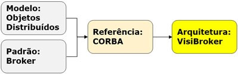 

Para utilizar uma arquitetura, é necessário compreender sua finalidade, de acordo com o padrão arquitetural adotado. Sistemas de baixa complexidade podem basear a arquitetura nos paradigmas adotados para a codificação, como a orientação a objetos, enquanto arquiteturas com maior complexidade seguem uma padronização mais robusta para os elementos estruturais, como a forma de comunicação em rede, a gerência de pools de objetos, ou a utilização de processos assíncronos. 
 
Enquanto para os mainframes era comum a arquitetura de processamento em lote, sistemas de linha de comando, no UNIX, utilizam amplamente o padrão de pipes/filters, no qual a saída obtida na execução de um programa serve como entrada para o próximo programa da sequência. Em ambos os casos, podemos observar arquiteturas baseadas no fluxo de dados. 
 
Ambientes de execução remota, como RPC (remote procedure call) e Web Services, são baseados em arquiteturas no padrão de **processos comunicantes**, onde servidores e clientes podem ser criados utilizando plataformas de desenvolvimento distintas, e o único fator de acoplamento é o protocolo de comunicação adotado. 
 
É comum o uso de mensagerias nos sistemas corporativos, onde utilizamos o padrão arquitetural event-driven, baseado na ativação de processos de forma indireta, a partir de mensagens. O papel das mensagerias é tão importante que o componente adotado na comunicação é chamado de MOM (Message-Oriented Middleware), e as vantagens no uso desse padrão são o acoplamento quase nulo e o processamento assíncrono. Um sistema simples pode responder a um único padrão arquitetural, mas os sistemas corporativos são complexos e heterogêneos, sendo muito comum a adoção de múltiplos padrões combinados. De forma geral, sempre existe um padrão principal, que no caso dos sistemas cadastrais é o MVC. 
 
## Arquitetura MVC 
 
A arquitetura MVC (model-view-controller) divide o sistema em três camadas, com responsabilidades específicas. Na camada Model, a mais baixa, temos as entidades e as classes para acesso ao banco de dados, na Controller, intermediária, concentramos os objetos de negócio, e na View, mais alta, são definidas as interfaces do sistema com o usuário ou com outros sistemas. 
 
**Model (Modelo)**:  
- Controla toda a persistência do sistema. 
- Concentra as chamadas ao banco de dados. 
- Encapsula o estado do sistema. 
- Pode utilizar mapeamento objeto-relacional. 
- Padrão DAO é aplicável. 
 
**Controller (Controle)**: 
- Implementa as regras de negócio do sistema. 
- Solicita os dados à camada Model. 
- Não pode ser direcionada para uma interface. 
- Pode utilizar objetos distribuídos. 
- Padrão Facade facilita a utilização da camada. 
 
 
**View (Visualização)**: 
- Define a interface do sistema. 
- Faz requisições para a camada Controller. 
- Contém apenas regras de formatação. 
- Podem ser definidas múltiplas interfaces. 
- Não pode acessar a camada Model. 
 
Uma regra fundamental para a arquitetura MVC é a de que os elementos da camada View não podem acessar a camada Model. Somente os objetos de negócio da camada Controller podem acessar os componentes da Model, e os elementos da View devem fazer suas requisições exclusivamente para os objetos de negócio. 
 
A arquitetura MVC é baseada em camadas, onde cada camada enxerga apenas a camada imediatamente abaixo. 
 
Em uma arquitetura MVC, as entidades são as unidades de informação para trânsito entre as camadas, e todos os comandos SQL ficam concentrados nas classes do padrão DAO. Como apenas a camada Controller pode acessar a Model, e nela estão as classes DAO, nós garantimos que as interfaces não acessem o banco de dados diretamente. 
 
O uso do padrão DAO e a popularização da arquitetura MVC demonstraram, de forma clara, a necessidade do mapeamento objeto-relacional em sistemas cadastrais criados com tecnologia orientada a objetos. Como as instruções SQL são bastante padronizadas, foi possível criar ferramentas para a geração dos comandos e preenchimento das entidades, de forma automática, bastando expressar a relação entre atributos da entidade e campos do registro. 
 
A camada Controller precisa ser definida sem que seja voltada para algum ambiente específico, como interfaces SWING ou protocolo HTTP. A única dependência aceitável para os objetos de negócio deve ser com relação à camada Model, e como a gerência do uso dos componentes DAO ocorre a partir deles, uma das características observadas é a diminuição da complexidade nas atividades cadastrais que foram iniciadas na View, o que justifica dizer que temos a aplicação do padrão Facade. 
 
Uma observação importante é a de que, como as regras de negócio ficam concentradas na camada Controller, podemos gerenciar as transações eficientemente a partir dos componentes dela. Inclusive, com a adoção de objetos distribuídos, a funcionalidade das transações foi ampliada para um modelo com a participação de múltiplos servidores. 
 
Da mesma forma, a camada Controller é o melhor local para definir as regras de autorização para o uso de funcionalidades do sistema, tendo como base o perfil de um usuário autenticado. Com relação à autenticação, ela pode ser iniciada por uma tela de login na camada View, com a efetivação na camada Controller, e nos modelos atuais é comum a geração de um token, mantendo a independência entre as camadas. 
 
## Componentes Java para MVC 
 
Uma grande vantagem do MVC é o direcionamento do desenvolvedor e das ferramentas para as necessidades de cada camada. Com a divisão funcional, diversos frameworks foram criados, como o JSF (Java Server Faces), que define interfaces Web na camada View, Spring ou EJB, para implementar as regras de negócio da camada Controller, e Hibernate, para a persistência ao nível da Model. Além disso, o uso de camadas especializadas permite a divisão da equipe entre profissionais cujo perfil seja voltado para criação visual, negócios ou banco de dados. 
 
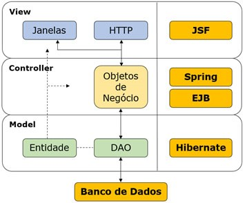 

Os frameworks facilitam a manutenção e evolução do sistema, pois tendem a acompanhar as tecnologias que surgem ao longo do tempo, mas apenas empresas de grande porte e comunidades de código aberto são capazes de garantir as atualizações, não sendo raros os casos em que uma ferramenta menos conhecida é descontinuada. 
 
Utilizar as ferramentas oferecidas pelo fabricante da linguagem pode ser uma boa opção quando desejamos garantir a continuidade da evolução do sistema. 
 
Em nosso contexto, a camada Model utiliza JPA, e como deve ser utilizada apenas pela camada Controller, é definida no mesmo projeto em que estão os componentes do tipo EJB. Note que a camada Controller oferece apenas as interfaces para os EJBs, com os dados sendo transitados na forma de entidades, sem acesso ao banco de dados, já que anotações não são serializáveis. 
 
Com a abordagem adotada, definimos o núcleo funcional e lógico de nosso sistema, sem a preocupação de satisfazer a qualquer tipo de tecnologia para construção de interfaces de usuário. 

A independência do núcleo garante que ele possa ser utilizado por diversas interfaces simultâneas, como SWING, HTTP ou Web Services, sem que ocorra qualquer modificação nos componentes do tipo JPA ou EJB 

Um erro comum, nos sistemas Java para Web, é definir os controladores no formato de Servlets, pois as regras de negócio se confundem com as rotinas de conversão utilizadas entre o protocolo HTTP e as estruturas da linguagem Java. 

A abordagem errônea faz com que qualquer nova interface, como SWING, Web Services, ou até linha de comando, seja obrigada a solicitar os serviços através do protocolo HTTP, algo que não é uma exigência das regras de negócio dos sistemas, de forma geral. 
 
Considere que a entidade Produto, definida anteriormente, com uso de tecnologia JPA, seja criada no projeto ExemploEJB-ejb, onde codificamos nosso Session Bean de teste, com o nome Calculadora. Com a presença da entidade no projeto, podemos adicionar outro Session Bean do tipo Stateless, com o nome ProdutoGestor e uso de interface Local, para as operações cadastrais. 
 
```java 
@Local 
public interface ProdutoGestorLocal { 
    List<Produto> obterTodos(); 
    void incluir(Produto p); 
} 

@Stateless 
public class ProdutoGestor implements ProdutoGestorLocal { 
    @Override 
    public List obterTodos() { 
        EntityManagerFactory emf = Persistence. 
            createEntityManagerFactory("ExemploSimplesJPAPU"); 
        EntityManager em = emf.createEntityManager(); 
        Query query = em.createNamedQuery("Produto.findAll"); 
        List<Produto> lista = query.getResultList(); 
        em.close(); 
        return lista; 
    } 
    @Override 
    public void incluir(Produto p) { 
        EntityManagerFactory emf = Persistence. 
            createEntityManagerFactory("ExemploSimplesJPAPU"); 
        EntityManager em = emf.createEntityManager(); 
        try { 
            em.getTransaction().begin(); 
            em.persist(p); 
            em.getTransaction().commit(); 
        } catch (Exception e) { 
            em.getTransaction().rollback(); 
        } finally { 
            em.close(); 
        } 
    } 
} 
``` 
 
Precisamos adicionar o arquivo persistence.xml, definido em nosso exemplo de JPA, ao diretório conf do projeto ExemploEJB-ejb, sem modificações, o que levará à utilização de controle transacional de forma local. 
 
Com nossas camadas Model e Controller completamente codificadas, podemos definir um Servlet, no projeto ExemploEJB-war, com o nome ServletListaProduto, o qual será parte da camada View do sistema, no modelo Web. 
 
O objetivo do novo componente será a exibição da listagem dos produtos presentes na base de dados. 
 
```java 
@WebServlet(name = "ServletListaProduto", 
urlPatterns = {"/ServletListaProduto"}) 
public class ServletListaProduto extends HttpServlet { 
    @EJB 
    ProdutoGestorLocal facade; 

    protected void doGet(HttpServletRequest request, 
        HttpServletResponse response) 
        throws ServletException, IOException { 
        response.setContentType("text/html;charset=UTF-8"); 
        try (PrintWriter out = response.getWriter()) { 
            out.println("<html><body>"); 
            facade.obterTodos().forEach(p -> { 
                out.println(" 
                        " + p.getNome()); 
            }); 
            out.println(""); 
        } 
    } 
} 
``` 
 
No código temos o atributo facade, do tipo ProdutoGestorLocal, utilizando a anotação EJB para injetar o acesso ao pool de Session Beans. Após configurar o acesso, invocamos o método obterTodos, na construção da resposta ao HTTP no modo GET, aceitando uma chamada como a apresentada a seguir: http://localhost:8080/ExemploEJB-war/ServletListaProduto 
 
Estando tudo correto, teremos uma saída similar à seguinte, na tela do navegador. 
 
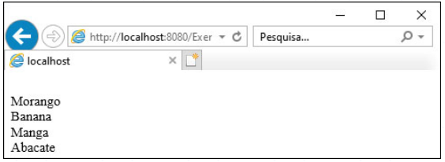 

# Empregar padrão Front Controller em sistema MVC, com interface Java Web 
 
# Padrão Front Controller 
 
O objetivo do padrão Front Controller é a concentração das chamadas efetuadas em um único ponto de acesso, centralizando a orquestração dos serviços oferecidos a partir da camada Controller, e direcionando os resultados para a interface correta. A implementação do padrão Front Controller deve ocorrer ao nível da camada View, pois lida apenas com a conversão de formatos, o fluxo de chamadas e os redirecionamentos, sem interferir com regras de negócio. 
 
Criaremos um projeto do tipo Enterprise Application, na categoria Java Enterprise, com o nome CadastroEJB, configurando para utilização do servidor GlassFish e do Java EE 7. Antes de iniciar a codificação, precisamos entender o modelo funcional do sistema, e criar as tabelas necessárias, conforme o SQL seguinte. 
 
```sql 
CREATE TABLE EMPRESA ( 
CODIGO INT NOT NULL PRIMARY KEY, 
RAZAO_SOCIAL VARCHAR(50)); 
 
CREATE TABLE DEPARTAMENTO ( 
CODIGO INT NOT NULL PRIMARY KEY, 
NOME VARCHAR(50), 
COD_EMPRESA INT NOT NULL); 
 
ALTER TABLE DEPARTAMENTO ADD FOREIGN KEY(COD_EMPRESA) 
REFERENCES EMPRESA(CODIGO); 
 
CREATE TABLE SERIAIS ( 
NOME_TABELA VARCHAR(50) NOT NULL PRIMARY KEY, 
VALOR_CHAVE INT); 
 
INSERT INTO SERIAIS VALUES ('EMPRESA',0); 
INSERT INTO SERIAIS VALUES ('DEPARTAMENTO',0); 
``` 
 
Aqui temos as tabelas EMPRESA e DEPARTAMENTO, para a persistência de dados de um cadastro simples, com um relacionamento através do campo COD_EMPRESA, da tabela DEPARTAMENTO. Também podemos observar uma terceira tabela, com o nome SERIAIS, que viabilizará o autoincremento, através de anotações do JPA. 
 
Para a interface de nosso sistema, utilizaremos cinco páginas, as quais são descritas no quadro apresentado a seguir. 
 
| Página                | Descrição 
| ---                   | ---
| index.html            | Página inicial do aplicativo cadastral de exemplo, com acesso às listagens de empresas e departamentos. 
| ListaEmpresa.jsp      | Listagem das empresas e acesso às opções oferecidas para inclusão e exclusão de empresas. 
| DadosEmpresa.jsp      | Entrada de dados da empresa que será incluída. 
| ListaDepartamento.jsp | Listagem dos departamentos e acesso às opções de inclusão e exclusão de departamentos. 
| DadosDepartamento.jsp | Entrada de dados do departamento que será incluído. 
 
Agora vamos definir os fluxos das chamadas, que ocorrerão a partir do HTTP, o que pode ser representado através de uma Rede de Petri, um ferramental que permite expressar os estados de um sistema, físico ou virtual, e definir as transições que ocorrem, efetuando a ligação entre estados e transições através de arcos. Ao modelar um sistema Web, os estados definem páginas e as transições são chamadas HTTP. 
 
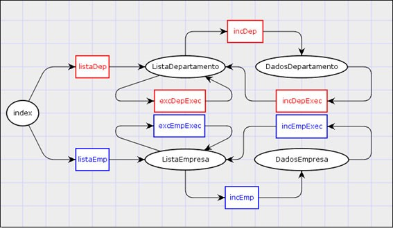 

Em nossa Rede de Petri, temos as páginas dentro de figuras elípticas, que representam os estados do sistema, e as transições expressas através de figuras retangulares. A alternância entre páginas, ou estados, sempre ocorrerá com a passagem por uma transição, através de um Front Controller. 
 
Como as chamadas HTTP utilizam parâmetros, com valores do tipo texto, vamos adotar um parâmetro para identificação da transição requerida, onde teremos o nome acao e o valor correspondente a um dos valores de nosso diagrama. Podemos observar, no quadro seguinte, os valores utilizados e operações que devem ser realizadas. 
 
| Ação        | Operações 
| ---         | ---
| listaDep    | <ul><li>Obter a lista de departamentos</li> <li>Direcionar o fluxo para ListaDepartamento.jsp</li></ul>
| listaEmp    | <ul><li>Obter a lista de empresas</li> <li>Direcionar o fluxo para ListaEmpresa.jsp</li></ul>
| excDepExec  | <ul><li>Remover o departamento, de acordo com o código informado</li> <li>Obter a lista de departamentos</li> <li>Direcionar a informação para ListaDepartamento.jsp</li> </ul>
| excEmpExec  | <ul><li>Remover a empresa, de acordo com o código informado</li> <li> Obter a lista de empresas</li><li>Direcionar o fluxo para ListaEmpresa.jsp</li></ul>
| incDep      | <ul><li>Direcionar o fluxo para DadosDepartamento.jsp</li></ul>
| incDepExec  | <ul><li>Receber os dados para inclusão do departamento</li> <li>Converter para o formato de entidade</li> <li>Incluir o departamento na base de dados</li> <li>Obter a lista de departamentos</li> <li>Direcionar o fluxo para ListaDepartamento.jsp</li></ul>
| incEmp      | <ul><li>Direcionar o fluxo para DadosEmpresa.jsp</li></ul>
| incEmpExec  | <ul><li>Receber os dados para inclusão da empresa</li> <li> Converter para o formato de entidade </li> <li> Incluir a empresa na base de dados </li> <li> Obter a lista de empresas </li> <li> Direcionar o fluxo para ListaEmpresa.jsp </li></ul>
 
Nos aplicativos Java para Web, o padrão Front Controller pode ser implementado com base em um Servlet. O processo envolve a recepção de uma chamada HTTP, através dos métodos doGet ou doPost, execução de operações que envolvam chamadas aos EJBs, relacionadas às atividades de consulta ou persistência, e redirecionamento, ao final, para uma página, normalmente do tipo JSP, para a construção da resposta. 
 
## Camadas model e controller 
 
Nossas camadas Model e Controller serão criadas no projeto CadastroEJB-ejb, através das tecnologias JPA e EJB, iniciando com a codificação da camada Model, baseada na tecnologia JPA. 
 
Utilizaremos as ferramentas de automação do NetBeans, e para gerar as entidades do sistema, iremos executar os passos apresentados a seguir: 
 
Passo 1: Adicionar novo arquivo, escolhendo Entity Classes from Database, na categoria Persistence. 
 
Passo 2: Na configuração de Data Source, escolha New Data Source, com a definição do nome JNDI (jdbc/cadastro), e escolha da conexão para o banco de dados. 
 
Passo 3: Escolha as tabelas DEPARTAMENTO e EMPRESA, deixando marcada a opção de inclusão das tabelas relacionadas. 
 
Passo 4: Na tela seguinte, defina o nome do pacote como model, deixando marcada apenas a opção de criação da unidade de persistência. 
 
Passo 5: Escolha, ao chegar na última tela, o tipo de coleção como List, além de desmarcar todas as opções. 
 
Teremos a geração das entidades Departamento e Empresa, no pacote model, embora com possíveis erros de compilação, que serão resolvidos com o acréscimo da biblioteca Java EE 7 API ao projeto CadastroEJB-ejb. As entidades geradas irão precisar apenas de uma pequena modificação, para configurar o uso de autoincremento. 
 
```java 
@Entity 
@Table(name = "DEPARTAMENTO") 
@NamedQueries({ 
@NamedQuery(name = "Departamento.findAll", 
query = "SELECT d FROM Departamento d")}) 
public class Departamento implements Serializable { 
    private static final long serialVersionUID = 1L; 
    @Id 
    @TableGenerator(name = "DeptoTabGen", table = "SERIAIS", 
    pkColumnName = "NOME_TABELA", 
    pkColumnValue = "DEPARTAMENTO", 
    valueColumnName = "VALOR_CHAVE") 
    @GeneratedValue(strategy = GenerationType.TABLE, 
    generator = "DeptoTabGen") 
    @Basic(optional = false) 
    @NotNull 
    @Column(name = "CODIGO") 
    private Integer codigo; 
    // O restante do código foi omitido por não ser relevante 
    // para a modificação efetuada 
} 

@Entity 
@Table( name = "EMPRESA" ) 
@NamedQueries({ 
@NamedQuery(name = "Empresa.findAll", 
query = "SELECT e FROM Empresa e")}) 
public class Empresa implements Serializable { 
    private static final long serialVersionUID = 1L; 
    @Id 
    @TableGenerator(name = "EmpTabGen", table = "SERIAIS", 
    pkColumnName = "NOME_TABELA", 
    pkColumnValue = "EMPRESA", 
    valueColumnName = "VALOR_CHAVE") 
    @GeneratedValue(strategy = GenerationType.TABLE, 
    generator = "EmpTabGen") 
    @Basic(optional = false) 
    @NotNull 
    @Column(name = "CODIGO") 
    private Integer codigo; 

    // O restante do código foi omitido por não ser relevante 
    // para a modificação efetuada 
} 
``` 
 
A anotação TableGenerator define um gerador sequencial baseado em tabelas, sendo necessário definir a tabela que armazena os valores (SERIAIS), o campo da tabela que individualiza o gerador (NOME_TABELA), e o valor utilizado para o campo, sendo aqui adotado o próprio nome da tabela para cada entidade, além do campo que irá guardar o valor corrente para o sequencial (VALOR_CHAVE). Após definir o gerador, temos a aplicação do valor ao campo da entidade, com base na anotação GeneratedValue, tendo como estratégia o tipo GenerationType.TABLE, e a relação com o gerador a partir do nome escolhido.   
 
Durante a execução, quando uma entidade é criada e persistida no banco de dados, o gerador é acionado, incrementa o valor do campo VALOR_CHAVE para a linha da tabela SERIAIS referente à entidade, e alimenta a chave primária com o novo valor. Existem outras estratégias de geração, como o uso de SEQUENCE, mas a adoção de uma tabela de identificadores deixa o sistema muito mais portável. 
 
Com a camada Model pronta, vamos criar a camada Controller, usando componentes do tipo EJB, de acordo com os seguintes passos:  
 
Passo 1: Adicionar arquivo, escolhendo Session Beans For Entity Classes, na categoria Persistence. 
 
Passo 2: Selecionar todas as entidades do projeto. 
 
Passo 3: Definir o nome do pacote (control), além de adotar a interface Local. 
 
Será gerada uma classe abstrata, com o nome AbstractFacade, que concentra todos os processos de acesso e manipulação de dados, com o uso de elementos genéricos. 
 
```java 
public abstract class AbstractFacade { 
    private Class entityClass; 
    public AbstractFacade(Class entityClass) { 
        this.entityClass = entityClass; 
    } 
    protected abstract EntityManager getEntityManager(); 
    public void create(T entity) { 
        getEntityManager().persist(entity); 
    } 
    public void edit(T entity) { 
        getEntityManager().merge(entity); 
    } 
    public void remove(T entity) { 
        getEntityManager().remove(getEntityManager().merge(entity)); 
    } 
    public T find(Object id) { 
        return getEntityManager().find(entityClass, id); 
    } 
    public List findAll() { 
        javax.persistence.criteria.CriteriaQuery cq = 
            getEntityManager().getCriteriaBuilder().createQuery(); 
        return getEntityManager().createQuery(cq).getResultList(); 
    } 
    public List<T> findRange(int[] range) { 
        javax.persistence.criteria.CriteriaQuery cq = 
            getEntityManager().getCriteriaBuilder().createQuery(); 
        cq.select(cq.from(entityClass)); 
        javax.persistence.Query q = 
            getEntityManager().createQuery(cq); 
        q.setMaxResults(range[1] - range[0] + 1); 
        q.setFirstResult(range[0]); 
        return q.getResultList(); 
    } 
    public int count() { 
        javax.persistence.criteria.CriteriaQuery cq = 
            getEntityManager().getCriteriaBuilder().createQuery(); 
        javax.persistence.criteria.Root<T> rt = 
            cq.from(entityClass); 
        cq.select( 
                getEntityManager().getCriteriaBuilder().count(rt)); 
        javax.persistence.Query q = 
            getEntityManager().createQuery(cq); 
        return ((Long) q.getSingleResult()).intValue(); 
    } 
} 
``` 
 
Observe que a classe é iniciada com um construtor, onde é recebida a classe da entidade gerenciada, e um método abstrato para retornar uma instância de EntityManager, ao nível dos descendentes, elementos utilizados pelos demais métodos da classe. 
 
Os métodos create, edit e remove, voltados para as ações de inclusão, edição e exclusão da entidade, são implementados através da invocação dos métodos de EntityManager, semelhante aos nossos exemplos anteriores, com tecnologia JPA, bem como find, que retorna uma entidade a partir de sua chave primária. 
 
Quanto aos métodos findAll e findRange, eles utilizam o JPA no modo programado, com base em CriteriaQuery, que apresenta métodos para substituir o uso de comandos na sintaxe JPQL. A chamada ao método from, tendo como parâmetro a classe da entidade, combinado com o método select, permite efetuar uma consulta que retorna todas as entidades do tipo gerenciado a partir do banco de dados, mas em findRange temos ainda o recurso de paginação, sendo definidos o índice inicial (setFirstResult) e a quantidade de entidades (setMaxResults). 
 
No método count, que obtém a quantidade total de entidades, também temos a adoção de CriteriaQuery, agora de uma forma mais complexa, com a definição de um elemento Root, envolvendo o conjunto completo de entidades, e aplicação do operador count sobre o conjunto. 
 
Com a definição do modelo funcional genérico, a construção dos Session Beans se torna muito simples, com base na herança e uso de anotações. 
 
```java 
@Stateless 
public class DepartamentoFacade extends 
AbstractFacade<Departamento> implements 
DepartamentoFacadeLocal { 
    @PersistenceContext(unitName = "CadastroEJB-ejbPU") 
    private EntityManager em; 

    @Override 
    protected EntityManager getEntityManager() { 
        return em; 
    } 
    public DepartamentoFacade() { 
        super(Departamento.class); 
    } 
} 

@Stateless 
public class EmpresaFacade extends 
AbstractFacade<Empresa> implements 
EmpresaFacadeLocal { 
    @PersistenceContext(unitName = "CadastroEJB-ejbPU") 
    private EntityManager em; 

    @Override 
    protected EntityManager getEntityManager() { 
        return em; 
    } 

    public EmpresaFacade() { 
        super(Empresa.class); 
    } 
} 
``` 
 
Em todos os três EJBs temos o mesmo tipo de programação, onde ocorre a herança com base em AbstractFacade, passando o tipo da entidade. O método getEntityManager retorna o atributo em, e no construtor a superclasse é chamada, com a passagem da classe da entidade. 
 
Os EJBs seguem o padrão Facade, e enquanto a anotação Stateless configura a classe para se tornar um Stateless Session Bean, o uso da anotação PersistenceContext, com a definição da unidade de persistência, instancia um EntityManager no atributo em. 
 
Ainda são necessárias as interfaces de acesso ao pool de EJBs, o que deve ser feito sem o uso de elementos genéricos. 
 
```java 
@Local 
public interface DepartamentoFacadeLocal { 
    void create(Departamento departamento); 
    void edit(Departamento departamento); 
    void remove(Departamento departamento); 
    Departamento find(Object id); 
    List findAll(); 
    List findRange(int[] range); 
    int count(); 
} 

@Local 
public interface EmpresaFacadeLocal { 
    void create(Empresa empresa); 
    void edit(Empresa empresa); 
    void remove(Empresa empresa); 
    Empresa find(Object id); 
    List<Empresa> findAll(); 
    List<Empresa> findRange(int[] range); 
    int count(); 
} 
``` 
 
Note que as interfaces apresentam métodos equivalentes aos que foram definidos em AbstractFacade, mas com a especificação da entidade, o que faz com que a herança ocorrida nos Session Beans implemente, de forma natural, as interfaces relacionadas. 
 
Não foram utilizadas instruções para o controle transacional, o que decorre do fato de que o contêiner EJB será o responsável por gerenciar as transações, via JTA, dentro do modelo conhecido como CMP (Container Managed Persistence). 
 
Para que o controle transacional ocorra da forma indicada, temos o atributo transaction-type com valor JTA, no arquivo persistence.xml, mas, há uma discrepância entre o NetBeans e o GlassFish, em termos da convenção de nomes, invalidando o identificador JNDI. 
 
Vamos alterar o atributo jndi-name, no arquivo glassfish-resources.xml, bem como o elemento jta-data-source, no arquivo persistence.xml, adotando o valor jdbc/cadastro para ambos. A modificação é necessária pelo fato do servidor GlassFish não aceitar o uso do sinal de dois pontos no identificador JNDI. 
 
```xml 
<?xml version="1.0" encoding="UTF-8"?> 
<DOCTYPE resources ...> 
    <resources> 
        <jdbc-connection-pool ...> 
            <property name="serverName" value="localhost"/> 
            <property name="portNumber" value="1527"/> 
            <property name="databaseName" value="bancoJPA"/> 
            <property name="User" value="bancoJPA"/> 
            <property name="Password" value="bancoJPA"/> 
            <property name="URL" 
                value="jdbc:derby://localhost:1527/bancoJPA"/> 
            <property name="driverClass" 
                value="org.apache.derby.jdbc.ClientDriver"/> 
        </jdbc-connection-pool> 
        <jdbc-resource enabled="true" jndi-name="jdbc/cadastro" object-type="user" 
            pool-name="derby_net_bancoJPA_bancoJPAPool"/> 
    </resources> 

    <?xml version="1.0" encoding="UTF-8"?> 
    <persistence version="1.0" ...> 
        <persistence-unit name="CadastroEJB-ejbPU" transaction-type="JTA"> 
            <jta-data-source> jdbc/cadastro</jta-data-source> 
            <exclude-unlisted-classes>false</exclude-unlisted-classes> 
            <properties/> 
        </persistence-unit> 
    </persistence> 
``` 
 
Caso ocorra erro na implantação, mesmo após alterar os arquivos, execute o programa asadmin, invocando, em seguida, o comando add-resources, com a passagem do nome completo do arquivo glassfish-resources.xml. 
 
O arquivo glassfish-resources.xml fica disponível na divisão de configurações do projeto CadastroEJB-ejb, e foi gerado quando criamos as entidades a partir do banco de dados. 
 
## Camada view 
 
A construção da camada View ocorrerá no projeto CadastroEJB-war, e será iniciada com a geração das páginas JSP consideradas na Rede de Petri do sistema, começando pela página DadosEmpresa.jsp, que não apresenta conteúdo dinâmico. 
 
```java 
<%@page contentType="text/html" pageEncoding="UTF-8"%> 
<html><body> 
    <form action="CadastroFC" method="post"> 
      <input type="hidden" name="acao" value="incEmpExec"/> 
      Razão Social: <input type="text" name="razao_social"/><br/> 
      <input type="submit" value="Cadastrar"/> 
    </form> 
  </body></html> 
``` 
 
Observando o código-fonte, temos apenas um formulário comum, com um parâmetro do tipo hidden guardando o valor de acao, no caso incEmpExec, e um campo de texto para a razão social da empresa. Os dados serão enviados para CadastroFC, um Servlet no padrão Front Controller que iremos criar posteriormente. 
 
O cadastro de um departamento será mais complexo, pois envolverá a escolha de uma das empresas do banco de dados. Vamos adicionar o arquivo DadosDepartamento.jsp, com o conteúdo apresentado a seguir. 
 
```java 
<%@page import="model.Empresa"%> 
<%@page import="java.util.List"%> 
<%@page contentType="text/html" pageEncoding="UTF-8"%> 
<html> 
  <body> 
    <form action="CadastroFC" method="post"> 
      <input type="hidden" name="acao" value="incDepExec"/> 
      Empresa: 
      <select name="cod_empresa"> 
        <% 
          List<Empresa> lista = (List<Empresa>) 
          request.getAttribute("listaEmp"); 
          for(Empresa e: lista){ 
          %> 
          <option value="<%=e.getCodigo()%>"> 
            <%=e.getRazaoSocial()%> 
          </option> 
        <% } %> 
      </select><br/> 
      Nome: <input type="text" name="nome"/> 

      <input type="submit" value="Cadastrar"/> 
    </form> 
  </body> 
</html> 
``` 
 
A coleção de empresas será recuperada a partir de um atributo de requisição, com o nome listaEmp, através do método getAttribute, e com base na coleção, preenchemos as opções de uma lista de seleção para o parâmetro cod_empresa. Os outros campos são apenas um parâmetro do tipo hidden, definindo o valor de acao como incDepExec, e um campo de texto para o nome do departamento. 
 
Agora vamos criar o primeiro arquivo para listagem, com o nome ListaEmpresa.jsp. 
 
```java 
<%@page import="model.Empresa"%> 
<%@page import="java.util.List"%> 
<%@page contentType="text/html" pageEncoding="UTF-8"%> 
<html> 
  <body> 
    <form action="CadastroFC" method="post"> 
      <input type="hidden" name="acao" value="incDepExec"/> 
      Empresa: 
      <select name="cod_empresa"> 
        <% 
          List<Empresa> lista = (List<Empresa>) 
          request.getAttribute("listaEmp"); 
          for(Empresa e: lista){ 
          %> 
          <option value="<%=e.getCodigo()%>"> 
          <%=e.getRazaoSocial()%> 
          </option> 
        <% } %> 
      </select><br/> 
      Nome: <input type="text" name="nome"/> 

      <input type="submit" value="Cadastrar"/> 
    </form> 
  </body> 
</html> 
``` 
 
A página é iniciada com a definição de um link para CadastroFC, com o parâmetro acao contendo o valor incEmp. Em seguida, é definida uma tabela para exibir os dados de cada empresa do banco de dados, contendo os títulos Código, Razão Social e Opções. 
 
Recuperamos a coleção de empresas, através de um atributo de requisição com o nome lista, e preenchemos as células de cada linha da tabela a partir dos dados da entidade, além de um link para exclusão montado dinamicamente. A exclusão será efetuada com a chamada para CadastroFC, tendo o valor excEmpExec no parâmetro acao, e o código da empresa corrente no parâmetro cod. 
 
Finalmente, temos a listagem de departamentos, no arquivo ListaDepartamento.jsp. 
 
```java 
<%@page import="model.Departamento"%> 
<%@page import="java.util.List"%> 
<%@page contentType="text/html" pageEncoding="UTF-8"%> 
<html> 
  <body> 
    <a href="CadastroFC?acao=incDep">Novo Departamento</a> 
    <table border="1" width="100%"> 
      <tr><td>Código</td><td>Nome</td><td>Empresa</td> 
        <td>Opções</td></tr> 
      <% 
          List<Departamento> lista = (List<Departamento>) 
          request.getAttribute("lista"); 
          for(Departamento d: lista){ 
          %> 
          <tr><td><%=d.getCodigo()%></td> 
            <td><%=d.getNome()%></td> 
            <td><%=d.getEmpresa().getRazaoSocial()%></td> 
            <td> 
              <a href="CadastroFC?acao=excDepExec&cod=<%=d.getCodigo()%>"> 
                Excluir</a> 
            </td> 
          </tr> 
          <% } %> 
    </table> 
  </body> 
</html> 
``` 
 
Em termos práticos, a listagem de departamentos é muito semelhante à de empresas, com a definição de um link de inclusão, agora com o valor incDep para acao, e a exibição dos dados através de uma tabela com os títulos Código, Nome, Empresa e Opções. 
 
Agora temos uma coleção de departamentos para o preenchimento das células, e o link para exclusão faz a chamada para CadastroFC, tendo o valor excDepExec no parâmetro acao, e o código do departamento corrente no parâmetro cod. Observe como a razão social da empresa é recuperada facilmente, utilizando o atributo presente na entidade departamento, alimentado através de uma anotação ManyToOne. 
 
Com a modificação de index.html, terminamos a construção das interfaces de usuário. 
 
```html 
<html> 
  <body> 
    <a href="CadastroFC?acao=listaDep"> 
    Listagem de Departamentos</a> 
    <a href="CadastroFC?acao=listaEmp"> 
    Listagem de Empresas</a> 
</body> 
</html> 
``` 
 
Podemos observar que os links utilizados fazem referência a CadastroFC, com os valores de acao para obtenção de listagens para as entidades, que no caso são listaDep, para departamentos, e listaEmp, para empresas. 
 
## Implementação do front controller 
 
Com as interfaces concluídas, devemos iniciar a construção do Front Controller, levando à conclusão da camada View. Utilizaremos também um padrão Strategy, com o objetivo de segmentar as chamadas aos EJBs, e todas as classes serão criadas no pacote view, do projeto ExemploEJB-war. 
 
```java 
public abstract class Strategy { 
protected final K facade; 
public Strategy(K facade) { 
  this.facade = facade; 
} 
public abstract String executar(String acao, 
  HttpServletRequest request); 
} 
``` 
 
Com base em uma classe abstrata, e uso de elemento genérico, definimos um padrão Strategy, onde a execução ocorrerá a partir do valor para acao e da requisição HTTP, além de um construtor recebendo a interface para o EJB, através do elemento genérico. 
 
Definimos, em seguida, a estratégia para empresas, herdando da classe Strategy, com a adoção da interface EmpresaFacadeLocal. 
 
```java 
public class EmpresaStrategy 
    extends Strategy<EmpresaFacadeLocal> { 
    public EmpresaStrategy(EmpresaFacadeLocal facade) { 
        super(facade); 
    } 
    @Override 
    public String executar(String acao, 
        HttpServletRequest request) { 
        String paginaDestino = "ListaEmpresa.jsp"; 
        switch(acao){ 
            case "listaEmp": 
                request.setAttribute("lista", facade.findAll()); 
                break; 
            case "excEmpExec": 
                Integer codigo = 
                    new Integer(request.getParameter("cod")); 
                facade.remove(facade.find(codigo)); 
                request.setAttribute("lista", facade.findAll()); 
                break; 
            case "incEmpExec": 
                String razaoSocial = 
                    request.getParameter("razao_social"); 
                Empresa empresa = new Empresa(); 
                empresa.setRazaoSocial(razaoSocial); 
                facade.create(empresa); 
                request.setAttribute("lista", facade.findAll()); 
                break; 
            case "incEmp": 
                paginaDestino = "DadosEmpresa.jsp"; 
                break; 
        } 
        return paginaDestino; 
    } 
} 
``` 
 
Durante a execução, temos a definição da página de destino como ListaEmpresa.jsp, a qual será diferente apenas quando o parâmetro acao tiver valor incEmp, onde temos, como destino, a página DadosEmpresa.jsp. O método executar irá retornar o nome da página para o Front Controller, e ele efetuará o redirecionamento. 
 
Além da definição da página correta, temos as operações efetuadas a partir do atributo facade, como a remoção da entidade, quando acao vale excEmpExec, ou a inclusão, para o valor incEmpExec. Para todas as ações que direcionam para a página de listagem, temos ainda a definição do atributo de requisição com o nome lista, contendo a coleção de empresas, obtidas a partir do método findAll do facade, o que permite que ocorra sua recuperação posterior, na página JSP. 
 
Agora podemos definir a classe DepartamentoStrategy, com facade baseado em uma interface do tipo DepartamentoFacadeLocal, e acessando um segundo EJB, através do atributo facadeEmpresa, do tipo EmpresaFacadeLocal. Note que o construtor deve ser modificado para receber as duas interfaces utilizadas. 
 
```java 
public class DepartamentoStrategy 
    extends Strategy<DepartamentoFacadeLocal>{ 
    private final EmpresaFacadeLocal empresaFacade; 
    public DepartamentoStrategy(DepartamentoFacadeLocal facade, 
        EmpresaFacadeLocal empresaFacade) { 
        super(facade); 
        this.empresaFacade = empresaFacade; 
    } 
    @Override 
    public String executar(String acao, 
        HttpServletRequest request) { 
        String paginaDestino = "ListaDepartamento.jsp"; 
        switch(acao){ 
            case "listaDep": 
                request.setAttribute("lista", facade.findAll()); 
                break; 
            case "excDepExec": 
                Integer codigo = new 
                    Integer(request.getParameter("cod")); 
                facade.remove(facade.find(codigo)); 
                request.setAttribute("lista", facade.findAll()); 
                break; 
            case "incDepExec": 
                String nome = request.getParameter("nome"); 
                Integer codEmpresa = new Integer( 
                        request.getParameter("cod_empresa")); 
                Empresa empresa = empresaFacade.find(codEmpresa); 
                Departamento departamento = new Departamento(); 
                departamento.setNome(nome); 
                departamento.setEmpresa(empresa); 
                facade.create(departamento); 
                request.setAttribute("lista", facade.findAll()); 
                break; 
            case "incDep": 
                request.setAttribute("listaEmp", 
                        empresaFacade.findAll()); 
                paginaDestino = "DadosDepartamento.jsp"; 
                break; 
        } 
        return paginaDestino; 
    } 
} 
``` 
 
Passo 1: Da mesma forma que na estratégia de empresa, temos as operações efetuadas a partir do atributo facade, como a remoção da entidade, quando acao tem valor excDepExec, ou a inclusão, para o valor incDepExec, e a chamada para findAll, para o preenchimento do atributo lista, nas ações que direcionam para a página de listagem. 
 
Passo 2: Também temos a utilização de facadeEmpresa, para definir o atributo listaEmp, quando acao tem valor incDep, e para recuperar a empresa selecionada, quando acao vale incDepExec. 
 
Passo 3: Com as estratégias definidas, podemos executar o último passo na construção de nosso aplicativo, adicionando um Servlet, com o nome CadastroFC, que será criado de acordo com o padrão Front Controller. 
 
```java 
@WebServlet(name="CadastroFC", urlPatterns={"/CadastroFC"}) 
public class CadastroFC extends HttpServlet { 
    @EJB 
    EmpresaFacadeLocal empresaFacade; 
    @EJB 
    DepartamentoFacadeLocal departamentoFacade; 

    private final HashMap<String,Strategy> estrategia = 
        new HashMap<>(); 
    private final HashMap<String,String> acoes = new HashMap<>(); 

    @Override 
    public void init() throws ServletException { 
        super.init(); 
        estrategia.put("empresa", new EmpresaStrategy( 
                    empresaFacade)); 
        estrategia.put("departamento", new DepartamentoStrategy( 
                    departamentoFacade,empresaFacade)); 
        String[] acoesEmpresa = 
        {"listaEmp","incEmp","incEmpExec","excEmpExec"}; 
        for(String acao: acoesEmpresa) 
            acoes.put(acao, "empresa"); 
        String[] acoesDepto = 
        {"listaDep","incDep","incDepExec","excDepExec"}; 
        for(String acao: acoesDepto) 
            acoes.put(acao, "departamento"); 
    } 

    protected void processRequest(HttpServletRequest request, 
            HttpServletResponse response) 
            throws ServletException, IOException { 
            String acao = request.getParameter("acao"); 
            if(acao==null) 
                throw new ServletException("Parâmetro acao requerido"); 
            Strategy st = estrategia.get(acoes.get(acao)); 
            request.getRequestDispatcher(st.executar(acao, request)). 
                forward(request, response); 
    } 
    @Override 
    protected void doGet(HttpServletRequest request, 
            HttpServletResponse response) 
        throws ServletException, IOException { 
        processRequest(request, response); 
    } 
    @Override 
    protected void doPost(HttpServletRequest request, 
            HttpServletResponse response) 
        throws ServletException, IOException { 
        processRequest(request, response); 
    } 
} 
``` 
 
Como toda a complexidade foi distribuída entre os descendentes de Strategy, o Servlet irá funcionar como um simples redirecionador de fluxo. Inicialmente, temos os atributos anotados para acesso aos EJBs, e a definição de dois HashMaps, um para armazenar as estratégias de empresa e departamento, com o nome estrategia, e outro para relacionar as ações do sistema com os identificadores dos gestores, com o nome acoes. 
 
No método init temos a inicialização de ambos os HashMaps, e consequente criação das instâncias para os elementos Strategy. Note que as ações são facilmente relacionadas com o identificador de estratégia, apoiadas no uso de vetores de texto. 
 
Quanto à resposta ao HTTP, no método processRequest, o primeiro passo é a verificação do parâmetro acao, obrigatório na chamada ao Servlet. Se o parâmetro estiver presente, localizamos a estratégia correta, a partir dos HashMaps, invocamos a execução, e com o nome da página obtido, efetuamos o redirecionamento via RequestDispatcher. 
 
Agora, com o aplicativo completo, podemos executá-lo, testando a inclusão e a listagem, tanto para empresas quanto para departamentos. Algumas das telas de nosso sistema podem ser observadas a seguir. 

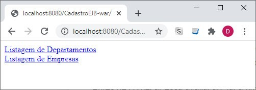
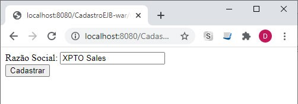
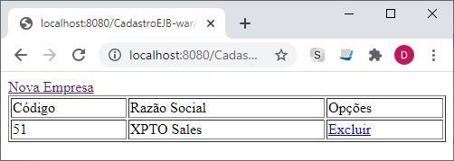
 
