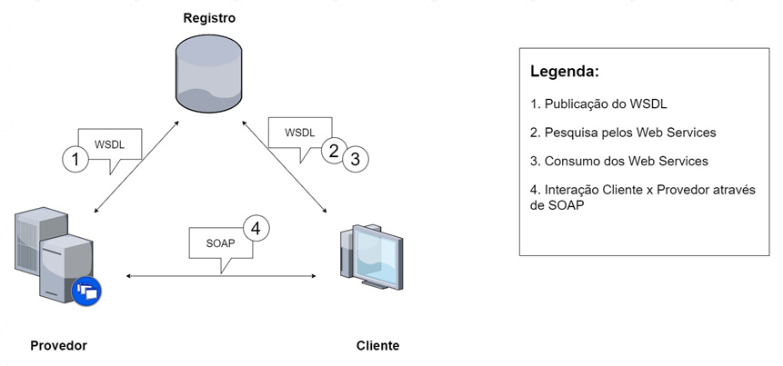
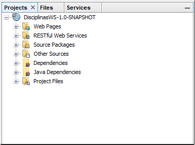
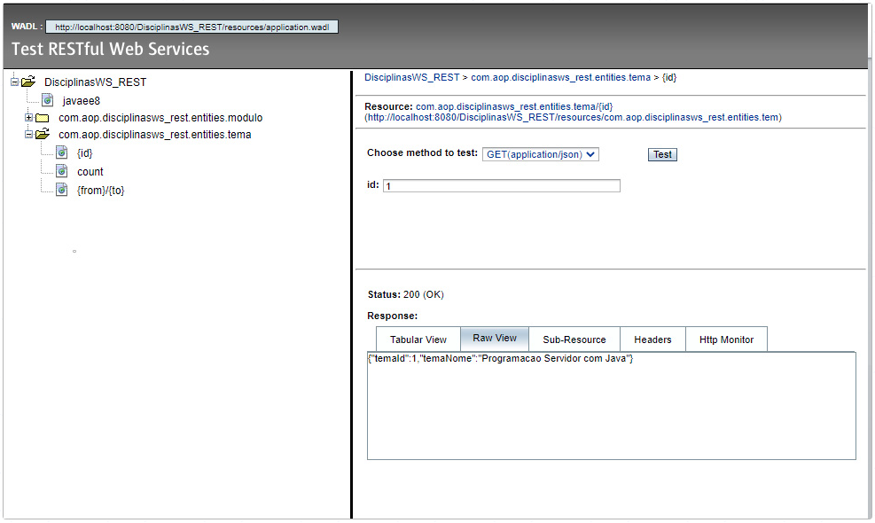
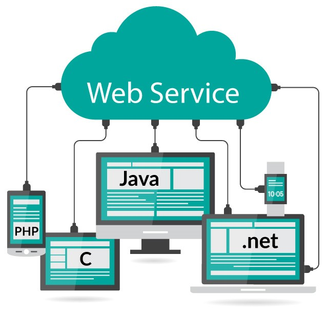

# Aula 5 - Web Services

## Web Services 
 
No início da computação distribuída, com as aplicações distribuídas, a comunicação entre cliente e servidor era restrita a uma rede interna, ficando o servidor responsável por efetuar todo o processamento. 
 
Posteriormente, esse processamento passou a ser feito entre vários servidores, onde era comum a utilização de middlewares como CORBA, DCOM e RMI, sendo tais middlewares responsáveis por prover a comunicação nos sistemas distribuídos. 
 
**Middlewares: Infraestrutura de software localizada entre o sistema operacional e uma aplicação distribuída.** 
 
Mais recentemente, as aplicações cliente x servidor migraram para a Internet, dando origem então aos Web Services, que surgiram como uma extensão dos conceitos de chamada remota de métodos, presentes nos middlewares já mencionados, para a Web. Logo, podemos dizer que os Web Services são aplicações distribuídas que se comunicam por meio de mensagens. Ou, usando outras palavras, um Web Service é uma interface que descreve uma coleção de operações acessíveis pela rede através de mensagens. Nesse sentido, temos transações e regras de negócio de uma aplicação expostas através de protocolos acessíveis e compreensíveis por outras aplicações – podendo essas ser escritas em qualquer linguagem de programação, além de residirem em qualquer sistema operacional. 
 
## Web Services e sua arquitetura 
 
A arquitetura dos Web Services é baseada em três componentes: 
* Provedor de serviços; 
* Consumidor de serviços; 
* Registro dos serviços. 
 
Vamos conhecer um pouco mais sobre cada um desses componentes. 
 
**Provedor de serviços**: O primeiro componente, o provedor de serviços, é responsável pela criação e descrição do Web Service – em um formato padrão, compreensível para quem precise utilizar o serviço ‒ assim como pela sua disponibilização a fim de que possa ser utilizado. 
 
**Consumidor de serviços**: Esse componente, ou papel, é representado por quem utiliza um Web Service disponibilizado em um provedor de serviços. 
 
**Registro dos serviços**: Trata-se de um repositório a partir do qual o provedor de serviços pode disponibilizar seus Web Services e no qual o consumidor de serviços pode utilizá-los. Em termos técnicos, o registro dos serviços contém informações, como os detalhes da empresa, os serviços por ela oferecidos e a descrição técnica dos Web Services. 
 
 
 
## Outros elementos da arquitetura dos web services 
 
Além dos elementos já apresentados, há ainda outros que compõem a arquitetura dos Web Services, como a WSDL, o SOAP, assim como a XML e a UDDI. 
 
WSDL: A WSDL (Web Services Description Language) é uma linguagem baseada em XML, cuja função é descrever, de forma automatizada, os serviços do Web Service através de um documento acessível aos clientes que desejam fazer uso do Web Service. **A WSDL é responsável por fornecer as informações necessárias para utilização de um Web Service, como as operações disponíveis e suas assinaturas.** 
 
UDDI: A UDDI (Universal Description, Discovery and Integration) é responsável por prover um mecanismo para a descoberta e publicação de Web Services. Nesse sentido, **a UDDI contém informações categorizadas sobre as funcionalidades e serviços disponíveis no Web Service**, permitindo, ainda, a associação de informações técnicas, normalmente definidas com o uso da WSDL, a esses serviços. 
 
## SOAP e REST 
 
Inicialmente, no contexto da computação distribuída, eram utilizadas tecnologias como RMI, DCOM e CORBA para a integração de aplicações. Nesse cenário, tais tecnologias obtiveram sucesso quando aplicadas em ambientes de rede locais e homogêneos. Posteriormente, já no ambiente heterogêneo da Internet, outras soluções foram aplicadas através da construção de aplicações web escritas em linguagens como ASP, PHP e Java (JSP). Tais aplicações, em termos de integração com outras aplicações, faziam uso de XML. 
 
Embora a XML seja um formato de transmissão de dados padronizado, faltava padronização por parte das empresas em termos de desenvolvimento, utilização de protocolos, transações, segurança etc. Frente a isso, o W3C desenvolveu um padrão cujo principal objetivo era prover a interoperabilidade entre aplicações. Tal padrão recebeu o nome de “Padrões WS-*” e é constituído por especificações para criação de Web Services baseados no protocolo SOAP. 
 
O padrão WS-* é composto por várias especificações, como a WS-Addressing (que trata dos mecanismos de transporte para a troca de mensagens nos Web Services), a WS-Security (protocolo que trata da segurança nos Web Services), entre outros. 
 
O REST, diferentemente do SOAP, não é uma especificação e nem foi criado pelo W3C. Em linhas gerais, trata-se de uma forma alternativa, uma arquitetura web, para o consumo de Web Services e que se baseia na utilização de recursos oferecidos pelo HTTP. 
 
## SOAP 
 
O SOAP é um protocolo, baseado em definições XML, utilizado para a troca de informações/comunicação em ambiente distribuído. Tal protocolo encapsula as chamadas e os retornos a métodos Web Services, trabalhando, principalmente, sobre o protocolo HTTP. Com o uso de SOAP, é possível invocar aplicações remotas utilizando RPC ou troca de mensagens, sendo indiferente o sistema operacional, a plataforma ou a linguagem de programação das aplicações envolvidas. 
 
### Comunicação em SOAP 
 
Web Services que fazem uso do protocolo SOAP podem utilizar dois modelos distintos de comunicação: 
 
RPC: Nesse modelo, é possível modelar chamadas de métodos com parâmetros, assim como receber valores de retorno. Com ele, o corpo (body) da mensagem SOAP contém o nome do método a ser executado e os parâmetros. Já a mensagem de resposta contém um valor de retorno ou de falha. 
 
Document: Nesse modelo, o body contém um fragmento XML que é enviado ao serviço requisitado, no lugar do conjunto de valores e parâmetros presente no RPC. 
 
### Formato de mensagem 
 
Uma mensagem SOAP é composta por três elementos: 
 
**Envelope**: Elemento principal (raiz do documento) do XML, responsável por definir o conteúdo da mensagem. É um elemento obrigatório. 
 
**Header**: Mecanismo genérico que torna possível a adição de características, de informações adicionais, à mensagem. É um elemento opcional, mas que, quando utilizado, deve ser o primeiro elemento do Envelope. 
 
**Body**: Corpo da mensagem. Contém a informação a ser transportada. Assim como o Envelope, é um elemento obrigatório. 
 
Aqui podemos ver o fragmento XML contendo os elementos definidos acima:  
 
```xml 
<SOAP-ENV:envelope> 


    <SOAP-ENV:header> </SOAP-ENV:header> 
    <SOAP-ENV:body> 


        <SOAP-ENV:fault> 
        </SOAP-ENV:fault> 
    </SOAP-ENV:body> 
</SOAP-ENV:envelope> 
``` 
 
Conforme visto no código, o elemento Body pode conter um elemento opcional, o Fault. Tal elemento é usado para transportar mensagens de status e/ou erros. 
 
### Exemplo de requisição e resposta utilizando SOAP 
 
Para melhor compreensão, veremos a seguir um exemplo prático de requisição e resposta de Web Service utilizando o protocolo SOAP. Nesse exemplo, será invocado o método “GetModulosTema”. Tal método recebe como parâmetro o nome do tema, representado pela variável “TemaNome”. Como resposta, são retornados os nomes dos módulos relacionados ao tema informado. O XML contendo o envelope da requisição pode ser visto no código abaixo: 
 
```xml 
<?xml version="1.0"?> 
<soap:Envelope xmlns:soap="http://www.w3.org/2003/05/soap-envelope"> 
    <soap:Header> 
    </soap:Header> 
    <soap:Body> 
      <GetModulosTema> 
         <TemaNome>Webservices<TemaNome> 
      </GetModulosTema> 
   </soap:Body> 
</soap:Envelope> 
``` 
 
A seguir, é demonstrado o XML do envelope contendo a resposta do método invocado. 
 
```xml 
<?xml version="1.0"?> 
<soap:Envelope 
    xmlns:soap="http://www.w3.org/2003/05/soap-envelope/" 
    soap:encodingStyle="http://www.w3.org/2003/05/soap-encoding"> 

<soap:Body> 
    <GetModulosTemaResponse> 
        <Modulos> 
            <Modulo> 
                <Nome>SOAP e REST</Nome> 
            </Modulo> 
            <Modulo> 
                <Nome>Utilização de SOAP XML em JAVA</Nome> 
            </Modulo> 
            <Modulo> 
                <Nome>Utilização de REST JSON em JAVA</Nome> 
            </Modulo> 
        </Modulos> 
    </GetModulosTemaResponse> 
</soap:Body> 

</soap:Envelope> 
``` 
 
## REST 
 
O REST foi proposto por Roy Fielding, um dos criadores do protocolo HTTP, em 2000, com a premissa de utilizar os recursos oferecidos pelo HTTP. Trata-se de um modelo mais simples que o SOAP, além de não ser um protocolo, mas, sim, uma arquitetura web, composta pelos seguintes elementos: 
Cliente (do Web Service); 
Provedor (do Web Service); 
Protocolo HTTP. 
 
Considerando os elementos acima, o consumo de um Web Service que faz uso de REST tem seu ciclo de vida iniciado com o cliente enviando uma solicitação a um determinado provedor. Tal provedor, após processar a requisição, responde ao cliente. Além disso, o HTTP é o protocolo que define o formato das mensagens enviadas e recebidas, além de também ser responsável pelo transporte dessas mensagens. 
 
A exemplo do WSDL, presente no protocolo SOAP, em REST está disponível a WADL (Web Application Description Language), cuja função também é a de descrever serviços – nesse caso, os serviços Web ou serviços REST. 
 
### Estrutura dos recursos REST 
 
Na arquitetura REST, os serviços ou recursos disponíveis correspondem a uma URI (Uniform Resource Identifier) específica e que também é única. Se considerarmos o exemplo visto no protocolo SOAP, podemos dizer que “GetModulosTema” é um método pertencente a um recurso – que vamos chamar de “Tema”. Logo, a URI para consumo desse serviço seria: http://www.dominio.com.br/tema/GetModulosTema/{nome-do-tema} 
 
Considerando então que “Tema” é o nome do recurso, podemos imaginar outros métodos disponíveis no mesmo. Poderíamos ter, por exemplo, um método para listar todos os temas; um método para inserir um novo tema; etc. Cada um desses serviços teria uma URI própria: 
* Listagem de todos os temas: http://www.dominio.com.br/tema 
* Inserção de tema: http://www.dominio.com.br/tema/CreateTema/{nome-do-tema} 
 
Uma vez que os Web Services REST são baseados no protocolo HTTP, a estrutura dos recursos REST, como visto acima, provém justamente dos métodos e códigos de retorno HTTP. Isto, em termos práticos, significa dizer que devemos usar os diferentes métodos HTTP de acordo com as operações para manipulação de dados dos recursos que desejamos fazer. 
 
Por exemplo: Para recuperar dados, como no caso onde queremos listar todos os temas  
existentes, devemos usar o método HTTP GET. 
 
Abaixo, na Tabela 1, estão listados os métodos HTTP e suas funções em relação à arquitetura REST: 

| Método HTTP  | Descrição / Para que é usado 
| ---          | --- 
| GET          | Usado na recuperação ou listagem de recursos 
| POST         | Usado na inclusão de um recurso 
| PUT          | Usado na edição de um recurso 
| DELETE       | Usado na exclusão de um recurso 
 
Como já mencionado, REST utiliza os recursos do protocolo HTTP. Logo, em relação às respostas dos serviços, temos disponíveis os códigos de retorno HTTP. 
 
Por exemplo: Para verificarmos se um recurso foi atualizado com sucesso, devemos verificar se o código HTTP é igual a 200. Caso algum erro tenha ocorrido, teremos então o código 400 ou 404. 
 
### Exemplo de requisição e resposta utilizando REST 
 
O consumo de um recurso REST é feito através de uma URI. Logo, poderíamos acessar tal recurso até mesmo através de um navegador web, sendo a forma mais usual, quando falamos de integração entre aplicações, implementarmos um cliente, através de uma linguagem de programação, que acesse o recurso em questão, enviando parâmetros, quando necessário, e tratando o retorno do mesmo. Nesse contexto, vamos usar o mesmo exemplo visto em SOAP e recuperar a listagem de módulos disponíveis para um determinado tema. 
 
Para consumir o serviço, vamos utilizar a seguinte URI: http://www.dominio.com.br/tema/GetModulosTema/Webservices 
 
Um possível retorno para essa requisição é visto a seguir: 
 
```json 
"Modulos":[
   {
      "Nome":"SOAP e REST"
   },
   {
      "Nome":"Utilização de SOAP XML em JAVA"
   },
   {
      "Nome":"Utilização de REST JSON em JAVA"
   }
]
}
``` 
 
Como vimos, as informações retornadas pelo Web Service consumido estão no formato JSON. Embora não seja o único tipo de dado disponível para o transporte de informações em REST – ou melhor, em mensagens HTTP, ele é o mais utilizado nessa arquitetura. 
 
Como curiosidade, em requisições REST podemos usar qualquer um dos tipos de conteúdo (Content-Type) abaixo: 
* Application/xml 
* Application/json 
* Text/plain 
* Text/xml 
* Text/html 
 
# Demonstrar o consumo de Web Services através do protocolo SOAP utilizando Java 
 
## Estrutura da aplicação 
 
Nossa aplicação será composta por uma aplicação do tipo EJB Module cujo papel será o de provedor de serviços. Nessa aplicação, construiremos os recursos que serão disponibilizados via SOAP. Além disso, teremos outra aplicação, do tipo Web Application, cujo papel será o de Cliente, ou seja, essa aplicação consumirá os recursos definidos na primeira aplicação. 
 
A árvore das aplicações pode ser vista abaixo: 
* Provedor SOAP 
   * DisciplinasWS (Projeto Java do tipo EJB Module) 
      * DisciplinasWS_Provedor (Webservice) 
        *  GetTema (Método/Recurso) 
        *  GetModulosTema (Método/Recurso) 
* Cliente SOAP 
   * DisciplinasWS_Cliente (Projeto Java do tipo Web Application) 
      * DisciplinasWS_Provedor (Webservice) 
         * Web Pages/index.jsp (Página principal) 
         * DisciplinaWSServlet (Servlet Java) 
 
## Provedor SOAP 
 
Nossa primeira aplicação será responsável por criar/manter o Web Service e os seus métodos/recursos. A seguir, veremos um passo a passo de como criar e disponibilizar o nosso serviço. 
 
## Criando o Web Service 
 
Passo 1: Abra a IDE NetBeans, clique no menu superior em “File” e, a seguir, em “New Project”.  
 
Passo 2: Selecione, entre as opções disponíveis, EJB Module e clique em “Next”. 
 
Passo 3: Na janela de configuração do projeto EJB Module, preencha os seguintes campos: 
* Project Name: DisciplinasWS 
* Group Id: com.[INICIAIS_DO_SEU_NOME] 
* Package: Será preenchido automaticamente após você preencher os dois campos acima. 
 
Passo 4: Após inserir as informações para criação do Projeto, clique em “Next”. 
 
Passo 5: Chegou a hora de escolher o Servidor a ser usado em nossa aplicação. Ao lado do campo “Server”, clique em “Add”. Na lista apresentada, escolha a opção “GlassFish Server”. A seguir, clique em “Next”. 
 
Passo 6: Na tela de configuração do Servidor GlassFish, mantenha os valores padrão sugeridos pela IDE. Na opção “Choose server to download”, escolha a versão mais recente. Clique na checkbox para aceitar a licença e, a seguir, em “Next”. 
 
Passo 7: Após download e instalação do Servidor GlassFish, finalize a tela de configuração do projeto EJB Module. 
 
Passo 8: Após a criação do projeto, sua janela “Projects” deverá ser exibida como abaixo: 

 
Passo 9: Agora criaremos nosso Web Service. Para isso, clique com o botão direito do mouse sobre o nome do projeto (na imagem anterior, nó “DisciplinasWS-1.0.SNAPSHOT”) e, a seguir, em “New”. Dentre as opções listadas, clique em “Web Service” (cuidado para não clicar, por engano, na opção Web Service Client). 
 
Passo 10: Na tela de configuração do novo Web Service, preencha os seguintes campos: 
* Web Service Name: DisciplinasWS_Provedor 
* Package: com.[INICIAIS_DO_SEU_NOME].disciplinasws 
 
Marque ainda a opção “Implement Web Service as Stateless Session Bean”. 
 
Passo 11: Após configurar o Web Service, clique em “Finish”. 
 
## Criando os serviços 
 
Após seguir o passo a passo descrito acima, você terá uma classe Java em seu projeto chamada “DisciplinasWS_Provedor” (ou uma classe com o nome, diferente do sugerido, que você inseriu para nomear o Web Service). Essa é a classe responsável por armazenar os métodos que estarão disponíveis em nosso Serviço Web. Perceba que, por padrão, a IDE cria um método chamado “hello”. 
 
A qualquer momento você poderá testar o funcionamento do Web Service e de seus métodos. Para isso, clique com o botão direito do mouse sobre o projeto e, a seguir, em “RUN”. A IDE, então, fará o “Deploy” do projeto. Após concluído esse processo, clique com o botão direito do mouse sobre o Web Service “DisciplinasWS_Provedor” (que estará dentro da pasta “Web Services”) e, a seguir, em “Test Web Service”. Em seguida, a janela do navegador abrirá e você poderá testar o funcionamento do Serviço. Caso ainda não tenha modificado o método default, “hello”, criado pela IDE, você verá uma página Web contendo um botão chamado “hello” e um campo input ao lado. Insira um texto nesse campo e clique no botão “hello”. Tal ação abrirá uma nova página na qual poderá ser visto o resultado da invocação do Web Service - método “hello”. Esse método, como podemos ver na classe que criamos, recebe uma string e a imprime entre as strings “Hello “ e “ !”. 
 
Repare ainda, na tela, que são mostrados também os envelopes contendo a requisição e a resposta SOAP. 
 
Dando seguimento à criação dos nossos métodos “GetTema” e “GetModulosTema”, vamos modificar a classe “DisciplinasWS_Provedor.java” para incluí-los, assim como para remover o método “hello”. A criação de métodos pode ser feita de duas formas: Diretamente via código ou através de um assistente de criação de códigos. Vamos usar a segunda opção, conforme o passo a passo a seguir. 
 
Passo 1: Remova o método “hello” da classe java “DisciplinasWS_Provedor”. 
 
Passo 2: Clique com o botão direito do mouse sobre a classe (na janela “Projects”) e, a seguir, clique em “Add Operation”. 
 
Passo 3: Na tela de configuração da operação, preencha/modifique os seguintes campos com os valores a seguir: 
* Name: GetTema 
* O tipo de retorno (Return Type) deverá ser “java.lang.String”, uma vez que nosso método retornará uma lista de temas. Além disso, essa operação não receberá parâmetros, uma vez que listará todos os temas existentes, sem que seja necessário passarmos qualquer parâmetro. 
* Ao final da execução do assistente, estará disponível em nossa classe o método criado. Repare que, até aqui, existe apenas o esqueleto do método. Mais adiante nós o incrementaremos, criando a lógica para que seja retornada uma listagem de nomes de temas. 
 
Passo 4: Repetiremos o passo anterior para criar a operação “GetModulosTema”. Entretanto, essa operação receberá um parâmetro do tipo string – que conterá o nome do tema a partir do qual listaremos os módulos existentes. 
 
Passo 5: Nesse ponto, a nossa classe deverá estar desta forma: 
 
```java 
package com.aop.disciplinasws; 

import javax.jws.WebService; 
import javax.jws.WebMethod; 
import javax.jws.WebParam; 
import javax.ejb.Stateless; 

@WebService(serviceName = "DisciplinasWS_Provedor") 
@Stateless() 
public class DisciplinasWS_Provedor { 

  @WebMethod(operationName = "GetTema") 
  public String GetTema() { 
      //TODO write your implementation code here: 
      return null; 
  } 

  @WebMethod(operationName = "GetModulosTema") 
  public String GetModulosTema(@WebParam(name = "tema") String tema) { 
      //TODO write your implementation code here: 
      return null; 
  } 
} 
``` 
 
Vamos, então, implementar os métodos. Em casos reais, provavelmente utilizaríamos um banco de dados de onde recuperaríamos as informações – os nomes dos temas e dos módulos. Entretanto, utilizaremos aqui uma coleção Java contendo tais informações, declarada diretamente na classe Java. 
 
Substitua ou adapte o seu código para ficar desta forma: 
 
```java 
package com.aop.disciplinasws; 

import java.util.ArrayList; 
import java.util.Arrays; 
import java.util.HashMap; 
import java.util.Map; 
import javax.jws.WebService; 
import javax.jws.WebMethod; 
import javax.jws.WebParam; 
import javax.ejb.Stateless; 

@WebService(serviceName = "DisciplinasWS_Provedor") 
@Stateless() 
public class DisciplinasWS_Provedor { 

  //Array contendo os nomes dos temas 
  String[] tema = {"Webservices", "Programação Servidor com Java", "JPA e JEE"}; 

  //HashMap para armazenar os nomes dos módulos, usando como chave o nome do tema 
  Map<String,ArrayList> modulos = new HashMap<>(); 

  @WebMethod(operationName = "GetTema") 
  public String GetTema() { 
      return Arrays.toString(tema); 
  } 

  @WebMethod(operationName = "GetModulosTema") 
  public String GetModulosTema(@WebParam(name = "tema") String tema) { 

      //Criando uma lista de Módulos para cada Tema 
      ArrayList<String> modulo3 = new ArrayList(); 
      modulo3.add("Webserver Tomcat"); 
      modulo3.add("App Server GlassFish"); 
      modulo3.add("Servlet e JSP"); 

      ArrayList<String> modulo4 = new ArrayList(); 
      modulo4.add("Tecnologia JPA"); 
      modulo4.add("Entrepise Java Beans"); 
      modulo4.add("Arquitetura MVC"); 

      ArrayList<String> modulo5 = new ArrayList(); 
      modulo5.add("Conceitos Web Services"); 
      modulo5.add("Utilizando SOAP em Java"); 
      modulo5.add("Utilizando REST em Java"); 

      //Populando o HashMap com os nomes dos módulos, 
      //  usando como chave o nome do tema 
      modulos.put("Programacao Servidor com Java", modulo3); 
      modulos.put("JPA e JEE", modulo4); 
      modulos.put("Webservices", modulo5); 

      String modulosTema = "Módulos: "; 

      if(modulos.containsKey(tema)){ 
          ArrayList<String> listModulos = modulos.get(tema); 
          for (String item: listModulos) { 
              modulosTema += " - " + item; 
          } 
          return modulosTema; 
      }else{ 
          return "Não encontrou"; 
      } 

  } 

} 
``` 
 
Nesse ponto, após codificar a classe Java, compile o código e teste o Web Service, seguindo os passos indicados anteriormente. Tendo confirmado que tudo funciona como deveria, vamos agora codificar nosso cliente SOAP. 
 
## Cliente SOAP 
 
Nosso Cliente SOAP será um projeto Java do tipo Web Application. Para criá-lo, siga os passos a seguir: 
 
Passo 1: Abra a IDE NetBeans, clique no menu superior em “File” e, a seguir, em “New Project”. Na janela de seleção aberta, escolha, na árvore “Java with Maven” o tipo “Web Application”. A seguir, clique em “Next”. 
 
Passo 2: Na janela de configuração do projeto, preencha os seguintes valores: 
* Project Name: DisciplinasWS_Cliente 
* Group Id: com.[INICIAIS_DO_SEU_NOME] 
 
Clique em “Next”. 
 
Passo 3: Na tela de configuração do servidor, escolha o “GlassFish Server”, a exemplo do que fizemos quando criamos o Provedor, mas sem a necessidade de adicionarmos o mesmo, uma vez que isso já foi feito anteriormente. Logo, basta selecionar o GlasshFish e clicar em “Finish”. 
 
Passo 4: Após o projeto ter sido criado e estar disponível na janela “Projects” da IDE, clique com o botão direito na raiz do projeto, sobre “DisciplinasWS_Cliente”. Clique em “New” e, a seguir, em “Web Service Client”. 
 
Passo 5: Na tela de configuração do Web Service Client, configuraremos qual o provedor a ser utilizado em nosso projeto. Deixe marcada a opção “Project” e clique em “Browse”. Perceba que na janela que foi aberta está sendo mostrado o nosso projeto anterior, o provedor de Web Service. Clique no sinal de “+”, para expandir o projeto. A seguir, clique sobre “DisciplinasWS_Provedor”.  
 
Passo 6: Clique em “Ok” após ter selecionado o provedor, na tela anterior. Na tela atual, no campo “Package”, selecione o nome dentre os disponíveis. No meu caso, o campo ficou assim: 
* Package: com.aop.disciplinasws_cliente 
* Clique em “Finish”. Nesse ponto, após o processamento e “build”, se você expandir, na janela “Projects” da IDE o nó “Web Service References”, verá as referências para o provedor de serviços que acabamos de linkar ao nosso projeto. 
 
## Criação da página web para invocação dos serviços 
 
Até aqui foi criado o projeto Java do tipo Web Application e adicionado ao mesmo a referência ao provedor do Web Service que iremos consumir. A próxima etapa consiste em criar uma página web (JSP) a partir da qual invocaremos os métodos do Web Service. Para isso, siga os passos abaixo: 
 
Passo 1: Na janela “Projects” da IDE, expanda o nó “Web Pages”. Nele, atualmente, há um arquivo chamado “index.html”. Exclua esse arquivo e a seguir crie um novo chamado “index.jsp”. 
 
Dica: Lembre-se de que é possível realizar inúmeras operações na IDE através do clique com o botão direito do mouse sobre o projeto ou nós do mesmo. 
 
Passo 2: Abra o arquivo “index.jsp”, recém-criado. Substituiremos o seu conteúdo por um novo conteúdo (aqui você pode ficar à vontade caso prefira uma abordagem diferente da que utilizaremos, que consiste em criar um formulário HTML com dois botões a partir do qual os serviços do Web Service serão invocados). 
 
Passo 3: Substitua o conteúdo do arquivo “index.jsp” por este abaixo: 
 
```html 
<html> 
  <head> 
    <meta http-equiv="Content-Type" content="text/html; charset=UTF-8"> 
    Consumindo Web Services SOAP 
  </head> 
  <body> 
    <form name="Test" method="post" action="DisciplinaWSServlet"> 
      Listando os Temas Existentes: 
      <br/> 
      <input name="service_name" value="listar_temas" type="hidden" id="service_name" /> 
      <input type="submit" value="Somar" name="calculadorabutton"> 
      <br/> 
      <p>Listando os Módulos de acordo com o Tema Informado:</p> 
      <br/> 
      <input name="tema_nome" id="tema_nome" /> 
      <br/> 
      <input type="submit" value="Listar Temas" name="formButton"> 
    </form> 
    <br/> 
    <form name="Test" method="post" action="DisciplinaWSServlet"> 
      <h1>Listando os Módulos de acordo com o Tema Informado:</h1> 
      <br/> 
      <input name="tema_nome" id="tema_nome" /> 
      <input name="service_name" value="listar_modulos" type="hidden" id="service_name" /> 
      <br/> 
      <input type="submit" value="Listar Módulos" name="formButton"> 
    </form> 
  </body> 
</html> 
``` 
 
Sobre o código acima, aqui vão algumas observações importantes: 
* O valor do atributo “action” dos formulários corresponde ao Servlet Java que criaremos a seguir, cuja função será coletar os dados do formulário, processar e chamar o Web Service de acordo com a ação selecionada. 
* Foram criados dois campos “input” do tipo “hidden”. Esses campos contêm valores correspondentes às ações a serem executadas. Usaremos os valores desses campos no Servlet para selecionar qual recurso invocaremos. 
 
## Criação do servlet para processamento do formulário e invocação do web service 
 
A partir de agora, criaremos a última parte de nosso Cliente WS, o Servlet responsável por receber a requisição realizada no formulário, na página web, e invocar o respectivo serviço no provedor WS. Siga este novo passo a passo: 
 
Passo 1: Clique com o botão direito na raiz do projeto, na janela “Projects”. A seguir, clique em “New” e em “Servlet”. Na tela de configuração, preencha os seguintes campos: 
* Class Name: DisciplinaWSServlet 
* Package: com.[INICIAIS_DO_SEU_NOME].servlet 
 
A seguir, clique em “Next”. 
 
Passo 2: Na tela seguinte, mantenha os valores como indicados na IDE e, a seguir, clique em “Finish”. Ao final desse processo, a IDE abrirá a classe Servlet. 
 
Passo 3: Substitua o conteúdo da classe Servlet, criada no passo anterior, pelo conteúdo a seguir. 
 
```java 
package com.aop.servlet; 

import java.io.IOException; 
import java.io.PrintWriter; 
import javax.servlet.ServletException; 
import javax.servlet.annotation.WebServlet; 
import javax.servlet.http.HttpServlet; 
import javax.servlet.http.HttpServletRequest; 
import javax.servlet.http.HttpServletResponse; 
import javax.xml.ws.WebServiceRef; 

@WebServlet(name = "DisciplinaWSServlet", urlPatterns = {"/DisciplinaWSServlet"}) 
public class DisciplinaWSServlet extends HttpServlet { 

    @WebServiceRef(wsdlLocation = 
    "WEB-INF/wsdl/localhost_8080/DisciplinasWS_Provedor/DisciplinasWS_Provedor.wsdl") 
        private com.aop.disciplinasws_cliente.DisciplinasWSProvedor_Service service; 

    protected void processRequest(HttpServletRequest request, HttpServletResponse response) 
            throws ServletException, IOException { 
            response.setContentType("text/html;charset=UTF-8"); 
            try (PrintWriter out = response.getWriter()) { 
                try { 
                    //Criando as instâncias para os métodos dos Web Service 
                    // a partir das referências ao provedor adicionadas ao projeto 
                    com.aop.disciplinasws_cliente.DisciplinasWSProvedor port = 
                        service.getDisciplinasWSProvedorPort(); 
                    com.aop.disciplinasws_cliente.DisciplinasWSProvedor port2 = 
                        service.getDisciplinasWSProvedorPort(); 

                    //Recupera o valor do input hidden, proveniente do formulário 
                    String serviceName = request.getParameter("service_name"); 
                    String result = null; 
                    String nomeTema = null; 

                    //Verifica qual serviço ws deverá ser invocado 
                    if(serviceName.equals("listar_temas")){ 
                        //Armazena na variavel result o retorno do serviço ws 
                        result = port.getTema(); 
                    }else if(serviceName.equals("listar_modulos")){ 
                        //Adiciona à variavel nomeTema o nome do tema inserido no form 
                        nomeTema = request.getParameter("tema_nome"); 
                        //Armazena na variavel o resultado da invocação do webservice 
                        result = port.getModulosTema(nomeTema); 
                    } 

                    //Imprimindo a página HTML com o resultado do consumo do WS 
                    out.println("<!DOCTYPE html>"); 
                    out.println("<html>"); 
                    out.println("<head>"); 
                    out.println("<title>Consumindo Web Services SOAP</title>"); 
                    out.println("</head>"); 
                    out.println("<body>"); 
                    if(serviceName.equals("listar_temas")){ 
                        out.println("<h1>Temas existentes</h1>"); 
                    }else if(serviceName.equals("listar_modulos")){ 
                        out.println("<h1>Lista de Módulos do Tema: " + nomeTema + "</h1>"); 
                    } 
                    out.println("<p>" + result + "</p>"); 
                    out.println("</body>"); 
                    out.println("</html>"); 

                } catch (Exception ex) { 
                    out.println("exception" + ex); 
                } 
            } 
    } 

    @Override 
    protected void doGet(HttpServletRequest request, HttpServletResponse response) 
        throws ServletException, IOException { 
        processRequest(request, response); 
    } 

    @Override 
    protected void doPost(HttpServletRequest request, HttpServletResponse response) 
        throws ServletException, IOException { 
        processRequest(request, response); 
    } 

    @Override 
    public String getServletInfo() { 
        return "Short description"; 
    } 

} 
``` 
 
Dica 1: Tome o cuidado de alterar os dados que configurou em seu projeto e que são diferentes dos que utilizamos. Por exemplo: O nome do “package”, onde indicamos que você utilizasse as iniciais do seu nome. O mesmo serve para o nome de classes que você tenha nomeado de forma diferente das que usamos. Essa dica serve também para os outros códigos. 
 
Dica 2: A função principal do Servlet é instanciar o serviço WS que referenciamos, a partir da instância local (variável “service”), assim como os métodos do mesmo (variáveis “port” e “port2”). 
 
Dica 3: Lembre de realizar o “build” e “deploy” do projeto a cada alteração que fizer no código: Clique com o botão direito do mouse na raiz do projeto e a seguir clique em “RUN”. Além de realizar o “build” e o “deploy”, essa ação abrirá o projeto no navegador. 
 
Passo 4: Com o formulário HTML sendo exibido no navegador, interaja com os seus elementos para consumir os Web Services e ver o resultado das operações. 
 
# Demonstrar o consumo de Web Services através do protocolo REST utilizando Java 
 
## Estrutura da aplicação 
 
As arquiteturas dos projetos podem ser vistas a seguir: 
* Provedor REST 
   * DisciplinasWS_REST (Projeto Java do tipo Web Application) 
   * Servidor: GlassFish 
* Cliente REST 
   * DisciplinasWS_REST_Cliente (Projeto Java do tipo Web Application) 
   * Servidor: GlassFish 
* Banco de Dados Java DB 
   * disciplina (banco de dados do tipo Java DB) 
      * tema (tabela de dados – Java DB) 
      * modulo (tabela de dados – Java DB) 
 
## Estrutura do banco de dados 
 
Os detalhes/passos para criação de um banco de dados do tipo Java DB não serão abordados aqui – a criação é bem simples: 
 
Acesse a janela “Services” na IDE, ao lado da janela “Projects”, e expanda o nó “Databases”. A seguir, basta criar o database e as tabelas. 
 
Após criar a estrutura do database, insira alguns valores nas tabelas. O código a seguir contém uma sugestão de valores, com base nos dados usados anteriormente. 
 
```sql 
INSERT INTO TEMA(TEMA_ID, TEMA_NOME) VALUES(1, 'Programacao Servidor com Java'); 
INSERT INTO TEMA(TEMA_ID, TEMA_NOME) VALUES(2, 'JPA e JEE'); 
INSERT INTO TEMA(TEMA_ID, TEMA_NOME) VALUES(3, 'Webservices'); 
 
INSERT INTO MODULO(MODULO_ID, MODULO_NOME, TEMA_ID) VALUES(1, 'Webserver Tomcat', 1); 
INSERT INTO MODULO(MODULO_ID, MODULO_NOME, TEMA_ID) VALUES(2, 'App Server GlassFish', 1); 
INSERT INTO MODULO(MODULO_ID, MODULO_NOME, TEMA_ID) VALUES(3, 'Servlet e JSP', 1); 
 
INSERT INTO MODULO(MODULO_ID, MODULO_NOME, TEMA_ID) VALUES(4, 'Tecnologia JPA', 2); 
INSERT INTO MODULO(MODULO_ID, MODULO_NOME, TEMA_ID) VALUES(5, 'Entrepise Java Beans', 2); 
INSERT INTO MODULO(MODULO_ID, MODULO_NOME, TEMA_ID) VALUES(6, 'Arquitetura MVC', 2); 
 
INSERT INTO MODULO(MODULO_ID, MODULO_NOME, TEMA_ID) VALUES(7, 'Conceitos Web Services', 3); 
INSERT INTO MODULO(MODULO_ID, MODULO_NOME, TEMA_ID) VALUES(8, 'Utilizando SOAP em Java', 3); 
INSERT INTO MODULO(MODULO_ID, MODULO_NOME, TEMA_ID) VALUES(9, 'Utilizando REST em Java', 3); 
``` 
 
## Provedor REST 
 
A primeira aplicação que criaremos será o provedor REST. Tal aplicação será uma aplicação do tipo “Web Application”. Seguindo o passo a passo para criação de aplicações, visto anteriormente, crie uma nova aplicação e dê o nome de “DisciplinasWS_REST”. 
 
## Criação do web service 
 
Para criar o Web Service, clique com o botão direito sobre a raiz do projeto, a seguir clique em “New > RESTful Web Services from Database”. Na janela de configuração, selecione, no campo “Database Connection”, a conexão referente ao database criada anteriormente (disciplina). Após selecionar a conexão, serão exibidas, abaixo, as tabelas do database. Selecione ambas e clique em “Add”. A seguir, clique em “Next”. 
 
Na janela seguinte, configuraremos as Classes de Entidade. No campo “package” adicione, ao final do valor existente, o valor “.entities”. Clique em “Next”. A seguir, clique em “Finish”. 
 
Nesse ponto, temos nosso provedor WS pronto para ser consumido. 
 
## Cliente REST 
 
O nosso Cliente também será uma aplicação do tipo Web Application. Dê a ela o nome de “DisciplinasWS_REST_Cliente”. 
 
Após a criação do Cliente, chegou a hora de linkarmos o cliente ao provedor. 
 
Para isso, expanda os nós do projeto Provedor (DisciplinasWS_REST), clique com o botão direito do mouse sobre o nó “RESTful Web Services” e, a seguir, na opção “Test RESTful Web Services”. 
 
Na janela seguinte, marque a opção “Web Test Client in Project” e, a seguir, em “Browse”. Na lista de projetos, clique em nosso Cliente – DisciplinasWS_REST_Cliente e em “Ok”. A seguir, clique em “Ok” novamente. 
 
Após os passos acima, o projeto será atualizado. Antes de continuarmos, compile e faça o deploy tanto do provedor quanto do cliente. Para isso: Botão direito do mouse na raiz do projeto, execute o “Run”. 
 
## Testando o web service rest 
 
Para testar os Web Services a partir do cliente, digite no navegador: http://localhost:8080/DisciplinasWS_REST_Cliente/test-services.html 
 
O arquivo “test-services.html” foi criado dentro da pasta “Web Pages”, do projeto Cliente, ao longo do processo de amarração entre as aplicações, realizado na etapa anterior. Veja que além dele foi criado também o arquivo “test-services.js”. 
 
Na página aberta, veja que, à esquerda, estão as entidades criadas. Expandindo o nó de cada uma, é possível ver alguns métodos criados por default. No tema, clique sobre a opção {id}. Agora, do lado direito, no input com o título ‘id’, digite 1 e clique em “Test”. Na janela abaixo, clique na aba “Raw View” e veja o retorno do método: Os dados relativos ao tema com id igual a 1 no formato JSON. 
 
A figura abaixo mostra a página “test-services.html” e o resultado da chamada ao método {id}: 
 
 

Caso você tenha problemas em testar o Web Service, como erros informando não ter sido possível encontrar uma das tabelas de nosso projeto, configure, no GlassFish, um pool de conexões (JDBC Connection Pools) e um recurso JDBC (JDBC Resources). A seguir, modifique o arquivo “persistence.xml”, na aplicação Provedor (DisciplinasWS_REST), pasta “Other Sources/src/main/resources/META-INF/” e adicione a linha “<jta-data-source>NOME-DO-JDBC-RESOURCE-CRIADO</jta-data-source>”, dentro do nó “<persistence-unit name="my_persistence_unit">”. 
 
## Incluindo um novo recurso 
 
Para finalizar nosso projeto, vamos adicionar um novo recurso no Provedor: Um método para recuperar os módulos de acordo com o tema. Para isso, na aplicação Provedor (DisciplinasWS_REST), abra a classe “ModuloFacadeREST.java” (dentro da pasta “Source Packages”). Insira o método abaixo nessa classe: 
 
```java 
/* 
* Metodo para recuperar as informações do módulo conforme o tema_id informado 
*/ 
@GET 
@Path("/tema/{tema_id}") //Define a URI do recurso 
@Produces({MediaType.APPLICATION_XML, MediaType.APPLICATION_JSON}) 
public List<Modulo> findByTemaId(@PathParam("tema_id") Integer tema_id) { 
    //Cria uma query selecionando os dados do modulo de acordo com o tema_id informado 
    return em.createQuery( 
            "SELECT m.moduloId, m.moduloNome, m.temaId FROM Modulo m WHERE m.temaId = :temaId") 
        .setParameter("temaId", tema_id) 
        .getResultList(); 
} 
``` 
 
Algumas observações sobre o código acima: 
@GET: Define o método HTTP através do qual o recurso estará disponível (aproveite que está com essa classe aberta e veja os demais métodos nela existentes). 
@Path: Define a URI do recurso. 
@Produces: Define os formatos de retorno de dados. Nesse caso, XML ou JSON. 
 
Após compilar e fazer o deploy do projeto, atualize a página de testes do Web Service: http://localhost:8080/DisciplinasWS_REST_Cliente/test-services.html 
 
Perceba que o recurso que criamos agora está disponível sob a árvore de recursos referentes ao Módulo. Expanda a árvore e clique no recurso “tema/{tema_id}. Insira 1 no campo “tema_id” e clique em “Test”. Veja na aba “Raw View” os dados referentes ao Módulo com tema_id igual a 1, em formato JSON. 
 
Nesse ponto, chegamos ao final da implantação do provedor e do cliente para fornecer e consumir Web Services no formato REST. Para encerrar, seguem algumas últimas observações: 
* Embora tenhamos usado alguns recursos facilitadores da IDE na criação de nossos projetos, os códigos gerados são totalmente funcionais e facilmente adaptáveis. 
* Abra as páginas web e as classes Java geradas ao longo de nossos projetos e analise os códigos. Procure entender os códigos de acordo com as regras que definimos ao longo das explanações. 
 
## Os web services e o "mundo real" 
 
As aplicações para fornecimento e consumo de Web Services, tanto SOAP quanto REST, que criamos ao longo deste tema, são aplicações compostas por códigos funcionais, que utilizam diversos recursos da linguagem Java e que podem ser facilmente adaptados para utilização em projetos, tanto voltados para fins de estudo quanto para fins profissionais, em aplicações reais. 
 
Com base nessa premissa, discutiremos, a partir de agora, em que situações, no dia a dia, podemos fazer uso de Web Services. Nesse sentido, veremos alguns casos de uso mais simples – e que você poderá utilizar caso esteja iniciando na área de desenvolvimento – e outros mais avançados – para você que já tem alguma experiência no desenvolvimento de aplicações. Para começar, recapitulemos alguns conceitos já vistos. A seguir, discutiremos os casos de uso em si. 
 
## Recapitulando conceitos 
 
### Web Services 
 
Um Web Service é um aplicativo projetado para suportar interoperabilidade entre máquinas através de uma rede (W3C, 2004). Logo, os Web Services são agentes de software cuja função é trocar mensagens, possuindo, para tal, um conjunto de funcionalidades definidas. 
 
Partindo dessa definição, podemos ver que as aplicações que criamos atendem às funcionalidades nelas mencionadas, ou seja, trata-se de aplicações, agentes de software, com a função de disponibilizar serviços – os Provedores SOAP e REST – e consumir serviços – os Clientes SOAP e REST. 
 
### Software 
 
Quando falamos de aplicações, estamos falando de softwares. Em relação a estes, os mesmos podem ser categorizados em alguns tipos, como: 
* Software de sistema. 
* Software de aplicação. 
* Software científico e de engenharia. 
* Software embutido. 
* Software para linhas de produtos. 
* Software para Web. 
* Software de inteligência artificial. 
Outros. 
 
Dentre essas categorias, cabe ressaltar a definição para o Software de Aplicação: Segundo Pressman (2106), são programas desenvolvidos para execução em um negócio específico ou em uma empresa específica. Essa definição cabe bem dentro das aplicações que desenvolvemos, uma vez que abordamos um tema específico, voltado para a área acadêmica, no qual manuseamos algumas Classes como “Tema” e “Módulos”, naturais do negócio em questão. 
 
#### API 
 
Uma Interface de Programação de Aplicação (API, acrônimo para Application Programming Interface) segundo Jacobson (2012), é uma maneira de duas aplicações de computador se comunicarem, uma com a outra, em uma rede (predominantemente a Internet) usando uma linguagem comum entendida por ambas. As APIs seguem uma especificação e isso implica que: 
* O provedor da API descreve exatamente qual funcionalidade a API oferecerá. 
* O provedor da API descreve quando e como a funcionalidade estará disponível. 
* O provedor da API pode estabelecer restrições técnicas, legais ou comerciais, como limites de utilização, entre outras. 
* Há um contrato estabelecido entre o provedor da API e quem dela faz uso, ficando o último comprometido a seguir as regras de uso estabelecidas pelo provedor. 
 
## Unindo conceitos 
 
Os três conceitos apresentados acima são de suma importância para abordarmos o uso de Web Services no mundo real, uma vez que se trata de conceitos intrinsecamente relacionados, como podemos perceber nas suas respectivas definições. Logo, é comum, no dia a dia, confundirmos os conceitos de Web Services e APIs, por exemplo. Frente a isso, cabe destacar algumas de suas diferenças: 
Podemos dizer que todos os Web Services são APIs, mas nem todas APIs são Web Services. 
Uma API pode usar outras formas de comunicação, além das utilizadas pelos Web Services (SOAP, REST e XML-RPC). 
Uma API, diferentemente do Web Service, não precisa de uma rede para funcionar. 
 
## Utilizando web services no mundo real 
 
Tomando como base as aplicações que criamos anteriormente, podemos pensar em algumas formas de como utilizá-las no mundo real. Por exemplo: Poderíamos ter um website que exibisse informações sobre os cursos oferecidos por uma instituição de ensino. Nesse site, dentre as funcionalidades disponíveis, poderia haver uma para listar todos os cursos e respectivas disciplinas, assim como o conteúdo de cada uma delas. 
 
Nesse caso, poderíamos consumir o Web Service desenvolvido (em SOAP ou REST) tanto a partir do “server side” – carregando as informações no carregamento da página – quanto a partir do “client side” – a partir de formulários de pesquisa e filtro de resultados carregando informações através de AJAX. 
 
Considerando o exemplo acima, você poderia questionar o porquê de utilizarmos Web Services para exibir o conteúdo em questão, uma vez que poderíamos utilizar outras técnicas, como consultas diretas ao Banco de Dados ou até mesmo páginas estáticas, sem o uso de Web Services. 

 
 
Nesse caso, a justificativa para a utilização de Web Services está em podermos disponibilizar o conteúdo em questão para outras aplicações além do website. Através deles poderíamos alimentar um aplicativo Mobile, assim como fornecer informações para um sistema de terceiros – um Portal que reúna informações dos cursos de diversas instituições de ensino, por exemplo. Logo, a escolha por uma arquitetura baseada em Web Services deve levar esses fatores em conta. 
 
Imaginando agora outra situação real e um pouco mais avançada, na qual se aplique a utilização de Web Services, temos a Arquitetura de Microsserviços, uma abordagem de desenvolvimento de softwares que prega a decomposição de aplicações em uma gama de serviços – serviços esses disponibilizados através de uma interface de APIs. 
 
Em comparação com a abordagem tradicional de desenvolvimento de aplicações, normalmente monolíticas, ou seja, todos os módulos e funcionalidades fazem parte de um bloco único, a abordagem baseada em microsserviços prega que as aplicações sejam desmembradas em componentes mínimos e independentes que, embora separados, trabalhem juntos para realizarem as mesmas tarefas. Entre as vantagens da abordagem baseada em microsserviços, temos: 
* Capacidade de compartilhamento de processos e funções semelhantes entre várias aplicações. 
* Escalabilidade: Maior flexibilidade para acréscimo de novas funcionalidades. 
* Disponibilidade: Com a aplicação não sendo formada por um único bloco, diminui o risco de indisponibilidade total da mesma. 
 
Além das vantagens acima, e agora com foco no processo de desenvolvimento, há outras vantagens como: 
* Mais facilidade na criação de testes unitários. 
* Maior frequência de deploy e facilidade para implementação da entrega contínua. 
* Otimização no monitoramento e identificação de erros. 
Outras. 
 
### Exemplos de APIS comumente utilizadas 
 
Pagamento: Serviços que fornecem diversos meios de pagamento e contemplam toda a segurança relacionada a esse processo, além de também oferecerem serviços extras como identificação de fraudes, entre outros. 
 
Redes Sociais: A maioria das redes sociais fornecem APIs públicas que permitem tanto o consumo de suas informações como a realização de outras ações: Login utilizando as credenciais da rede social; realizar publicações e compartilhamentos; etc. 
 
Localização: Um bom exemplo dessas APIs é o Google Maps. 
 
Outros: Consulta de CEP; consulta de previsão de tempo; conversão de moedas; serviços de câmbio; serviços de plataformas de e-commerce; chatbots; etc. 
 
