#Aula 1 - Programação Cliente com Javascript

## Incorporando o Javascript (JS) em páginas HTML 
 
Para incorporar ao documento HTML, podemos fazer de duas formas: 
* Inserindo o código JS na seção `<head>`, ao final da página, dentro da tag `<script>` 
* Incorporando um arquivo externo, contendo apenas código JS, também é possível fazer uso da tag `<script>` 
 
Considere sempre manter seu código Javascript em um arquivo externo, com a extensão “.js”. Além disso, sempre que possível, incorpore o script externo ao final da página HTML – imediatamente antes do fechamento da tag `<body>`. Além de tornar o carregamento da página mais rápido, uma vez que ela é renderizada de cima pra baixo – ou seja, ao encontrar a tag `<script>` logo no `<head>,` o navegador só continuará a carregar o restante da página após interpretar e executar todo o código JS. Essa boa prática também permite que elementos da página sejam manipulados pelo JS, pois ele será carregado apenas após todos os elementos já estarem disponíveis. Por outro lado, caso algum conteúdo ou funcionalidade da página dependa do JS para ser corretamente exibido, será necessário mantê-lo no `<head>`. Em resumo: avalie caso a caso. 
 
Exemplos: 
 
```html 
<!doctype html> 
<html lang="pt-BR"> 
<head> 
  <meta charset="utf-8"> 
  <title>Incorporação de JS em Páginas HTML</title> 
</head> 
<body> 
  <!-- Códigos HTML --> 
  <!-- Fim dos Códigos HTML --> 
  <!-- Incorporação do JS externo --> 
  <script type="text/javascript" src="script.js"></script> 
</body> 
</html> 
``` 
 
```html 
<!doctype html> 
<html lang="pt-BR"> 
<head> 
  <meta charset="utf-8"> 
  <title>Incorporação de JS em Páginas HTML</title> 
  <!-- Incorporação do JS interno --> 
  <script type="text/javascript"> 
  /* Códigos Javascript */ 
  </script> 
</head> 
<body> 
   <!-- Códigos HTML --> 
</body> 
</html> 
``` 
 
## Variáveis: escopos e tipos 
 
Quando falamos de escopo, estamos tratando do local onde uma variável existe dentro de um programa. Nesse sentido, em Javascript, uma variável pode existir a nível global ou dentro de bloco. 
 
Considere como bloco todo código escrito dentro de chaves "{ }" (estruturas condicionais, estruturas de repetição e funções, por exemplo). 
 
```html 
<!doctype html> 
<html lang="pt-BR"> 
<head> 
<meta charset="utf-8"> 
<title>Escopo de variáveis em JS</title> 
<script type="text/javascript"> 
var msg = "Conteúdo da variável msg fora do bloco de instrução"; 
//Bloco de Instrução 
//Em blocos de instrução, quando redeclarada, a variável sobrescreve a existente 
if(true){ 
var msg = "Conteúdo da variável msg dentro do bloco de instrução"; 
console.log(msg); //Imprimirá "Conteúdo da variável msg dentro do bloco de instrução" 
} 
console.log(msg); //Imprimirá "Conteúdo da variável msg dentro do bloco de instrução" 
var msg2 = "Conteúdo da variável msg2 fora do bloco de função"; 
//Bloco de Função 
//Em blocos de Função, quando redeclarada, a variável não sobrescreve a existente 
//Logo, a nova variável só existe a nível do escopo da função 
imprimeVariavel(); 
function imprimeVariavel(){ 
var msg2 = "Conteúdo da variável msg2 dentro do bloco de função"; 
var msg3 = "Conteúdo da variável msg3 - só existente dentro do bloco de função"; 
console.log(msg2); //Imprimirá "Conteúdo da variável msg2 dentro do bloco de função" 
} 
console.log(msg2); //Imprimirá "Conteúdo da variável msg2 fora do bloco função" 
console.log(msg3); //Disparará um erro dizendo que a variável msg3 não foi definida 
</script> 
</head> 
<body> 
</body> 
</html> 
``` 
 
Em linhas gerais, uma variável em Javascript tem comportamento distinto de acordo com o bloco na qual foi declarada e teve valores atribuídos. O destaque, no código anterior, vai para a variável msg2 definida e inicializada dentro da função “imprimeVariavel”. Nesse caso, embora precedida pela palavra reservada “var”, essa variável não possui escopo global, mas local, por ter sido definida dentro da função. 
 
**Variáveis definidas dentro de funções possuem escopo local, ficando restritas ao escopo da função.** 
 
### Utilizando var, let e const 
 
**Var**: A utilização dessa palavra reservada, na declaração de variáveis, concede escopo global a elas. Ou seja, variáveis declaradas utilizando var podem ser acessadas em qualquer ponto do script, dentro e fora de blocos – com exceção dos blocos de funções, onde, como já mencionado, as variáveis possuem escopo apenas local. 
 
**Let**: A partir do lançamento do Javascript 6, tornou-se possível melhorar o controle sobre o escopo de variáveis em JS com a introdução da palavra-chave let. Embora não suportada por todos os navegadores (no Internet Explorer, ela só está disponível a partir da versão Edge), essa nova palavra reservada juntou-se às demais (var e const), tendo como função, sobretudo, restringir o acesso a variáveis a nível de bloco. Ou seja, uma variável declarada com let, dentro de um bloco, não pode ser acessada em nenhum outro local do script, a não ser no bloco em questão. Isso implica ainda que, caso declarada fora de um bloco, essa variável passa a ter escopo global, assim como as variáveis declaradas com var. 
 
**Const**: Nas linguagens de programação, uma variável declarada como constante (const) é uma variável cujo valor é fixo, ou seja, o valor atribuído a tal variável não pode ser alterado. Em Javascript, utilizamos const para declarar uma variável como constante. O seu uso é indicado para garantirmos que o valor atribuído a uma variável não será alterado ao longo da execução de nosso programa, ou seja, para assegurarmos que alterações não previstas ou indesejadas sejam realizadas no valor de determinada variável. 
 
Utilizar let, var e const permite maior controle em relação à disponibilidade das variáveis e ao seu conteúdo, evitando erros de sobrescrita ou de acesso, entre outros. 
 
## Arrow functions 
 
Podem ser definidas como uma forma mais simples de se criar funções em JS.  
 
```javascript 
const multiplicacao = (n1, n2) => { 
  return n1 * n2; 
} 
console.log(multiplicacao(3, 2)); //imprimirá 6 
``` 
 
```javascript 
const multiplicacao = (n1, n2) => n1 * n2; 
console.log(multiplicacao(3, 5)); //imprimirá 15 
``` 
 
```javascript 
var cores = [ 
  { id: 1, nome: 'Amarelo' }, 
  { id: 2, nome: 'Verde' }, 
  { id: 3, nome: 'Azul' }, 
  { id: 4, nome: 'Branco' }, 
  { id: 5, nome: 'Preto' } 
]; 
//Caso você queira extrair apenas os nomes do array 'cores' 
//Exemplo 1: utilizando um laço foreach 
//Criando um novo array para receber os nomes 
var nomesCores = []; 
//Percorrendo o array cores e atribuindo ao novo array os nomes 
cores.forEach(function (cor) { 
  nomesCores.push(cor.nome); 
}); 
console.log(nomesCores); //imprimirá ["Amarelo", "Verde", "Azul", "Branco", "Preto"] 
//Exemplo 2: utilizando arrow function 
const coresNomes = cores.map(cor => cor.nome); 
console.log(coresNomes); //imprimirá ["Amarelo", "Verde", "Azul", "Branco", "Preto"] 
``` 
 
## Eventos 
 
Os eventos são responsáveis por fornecer interatividade a uma página HTML, fazendo uso da linguagem Javascript. Por exemplo: o clique do mouse em um link que abre uma janela modal ou revela um conteúdo até então escondido, como um submenu, faz uso de eventos. 
 
```javascript 
<!doctype html> 
<html lang="pt-BR"> 
<head> 
  <meta charset="utf-8"> 
  <title>Eventos em Javascript</title> 
</head> 
<body onload="escondeTexto()"> 
  <h1 id="titulo">Clique em qualquer lugar nesse texto para ver o conteúdo escondido.</h1> 
  <p id="texto_escondido">Texto escondido, que só será mostrado após click na texto acima.</p> 
<script type="text/javascript"> 
function escondeTexto(){ 
  var eP = document.getElementById("texto_escondido"); 
  eP.style.display = "none"; 
} 
var hP = document.getElementById("titulo"); 
hP.onclick = function(){ 
  document.getElementById("texto_escondido").style.display = "block"; 
} 
</script> 
</body> 
</html> 
``` 
 
## A biblioteca JQuery 
 
O jQuery é uma biblioteca Javascript rápida, pequena e rica em recursos. Tal biblioteca simplifica o processo de manipulação de documentos HTML, manipulação de eventos, animação e Ajax, com uma API fácil de usar, que funciona em vários navegadores (jQuery, 2020). 
 
Para incluir o JQuery no código, podemos fazer de duas formas: 
* Realizar o download com armazenagem local 
* Criar um link a partir de um repositório remoto 
 
Além disso, é importante saber que há versões diferentes, com tamanhos diversos. Ou seja, além de estar em contínua evolução, são disponibilizados diferentes pacotes: completos, compactados e slim. Esse último exclui alguns recursos, como os módulos AJAX e o módulo de efeitos. 
 
## Manipulando a árvore DOM 
 
A árvore DOM disponibiliza uma representação estruturada do documento HTML em formato de árvore. Logo, a partir desse modelo, temos acesso a qualquer elemento de uma página. 
 
 

### Selecionando elementos 
 
Podemos referenciar qualquer elemento da página HTML utilizando o objeto `$(seletor)`. Tal seletor pode ser um elemento DOM, um array contendo um conjunto de elementos DOM ou um objeto. 
 
```javascript 
<!doctype html> 
<html lang="pt-BR"> 
<head> 
  <meta charset="utf-8"> 
  <title>jQuery</title> 
  <script type="text/javascript" src="https://code.jquery.com/jquery-3.5.1.js"></script> 
</head> 
<body> 
  <p id="paragrafo_texto">Texto do parágrafo</p> 
  <ul> 
    <li class="item_lista">Primeiro item</li> 
    <li class="item_lista">Segundo item</li> 
    <li class="item_lista">Terceiro item</li> 
  </ul> 
  <script type="text/javascript"> 
  //imprimirá Texto do parágrafo 
  console.log($("#paragrafo_texto").html()); 
  //imprimirá Primeiro item 
  console.log($('.item_lista').eq(0).html()); 
  </script> 
</body> 
</html> 
``` 
 
No seletor, pode ser usada aspas duplas ou simples. Para id, o seletor tem "#". Para classe, o seletor usa ".". O método "eq" recebendo 0 como parâmetro, seleciona o primeiro elemento. 
 
Podemos também selecionar elementos usando o ":not": 
 
```javascript 
console.log($('li:not(.item_lista)').html()); 
``` 
 
Assim, irá selecionar os elementos que não possuírem a classe. 
 
### Adicionando e removendo elementos 
 
```html 
<!doctype html> 
<html lang="pt-BR"> 
<head> 
  <meta charset="utf-8"> 
  <title>jQuery</title> 
  <script type="text/javascript" src="https://code.jquery.com/jquery-3.5.1.js"></script> 
</head> 
<body> 
  <div> 
    <h1>Título na primeira div</h1> 
  </div> 
  <div> 
    <h2>Subtítulo na segunda div</h1> 
  </div> 
  <ul id="container_lista"> 
    <li class="item_lista">Primeiro item</li> 
    <li class="item_lista">Segundo item</li> 
    <li>Terceiro item</li> 
  </ul> 
  <script type="text/javascript"> 
  //Adicionando um novo item <li> ao final, dentro da tag <ul> com identificador "container_lista" 
  $('#container_lista').append('<li>Quarto Item</li>'); 
  //Adicionando uma tag <p> após cada tag <h1> e <h2> 
  $('h1,h2').after('<p>Texto do parágrafo inserido após cada tag h1 e h2 </p>'); 
  //Adicionando uma tag <h3> antes da tag <ul> com identificador "container_lista" 
  $('#container_lista').before('<h3>Subtítulo da Lista não ordenada</h3>'); 
  </script> 
</body> 
</html> 
``` 
 
Removeremos, em tempo de execução, alguns elementos inicialmente presentes no documento HTML. 
 
```javascript 
<!doctype html> 
<html lang="pt-BR"> 
<head> 
<meta charset="utf-8"> 
<title>jQuery</title> 
<script type="text/javascript" src="https://code.jquery.com/jquery-3.5.1.js"></script> 
</head> 
<body> 
<div> 
<h1>Título na primeira div</h1> 
<p>Texto do parágrafo inserido após cada tag h1 e h2 </p> 
</div> 
<div> 
<h2>Subtítulo na segunda div</h2> 
<p>Texto do parágrafo inserido após cada tag h1 e h2 </p> 
</div> 
<h3 class="item_lista">Subtítulo da Lista não ordenada</h3> 
<ul id="container_lista"> 
<li class="item_lista">Primeiro item</li> 
<li class="item_lista">Segundo item</li> 
<li>Terceiro item</li> 
<li>Quarto Item</li> 
</ul> 
<script type="text/javascript"> 
//Removendo o último parágrafo da página 
//Para acessar o primeiro elemento, utilizamos 0. Já para acessar o último, usamos -1 
$('p').eq(-1).remove(); 
//Removendo apenas os elementos <li> com a classe "item_list" 
//Repare que a tag <h3> também possui esse classe 
$('li.item_lista').remove(); 
</script> 
</body> 
</html> 
``` 
 
### Eventos 
 
**fire/fired**: Associado ao momento em que um evento é “disparado”. 
 
**listener**: Associado ao ato de “ouvir”, monitorar, um elemento à espera do disparo de um evento. 
 
**handler**: Associado à ação de manipular determinado evento. 
 
## Eventos onload e window.onload 
 
O evento onload ocorre quando um objeto, em uma página HTML, termina de ser carregado. Tal evento é normalmente utilizado na tag `<body>`, tornando possível que determinada ação seja realizada através de funções JS, quando a tag em questão terminar de carregar. Isso implica dizer que todas as imagens, scripts e arquivos CSS já foram carregados. Tal evento também pode ser utilizado com outras tags, como `<frame>`, `<iframe>`, ``, `<input type=’image’>`, `<link>`, `<script>` e `<style>`.
 
```javascript 
<!doctype html> 
<html lang="pt-BR"> 
<head> 
  <meta charset="utf-8"> 
  <title>Evento onload</title> 
  <script type="text/javascript" src="https://code.jquery.com/jquery-3.5.1.js"></script> 
</head> 
<body onload="alert('O <body> terminou de ser carregado')"> 
  <!-- Conteúdo HTML --> 
</body> 
</html> 
``` 
 
Assim como o evento onload, o evento window.onload ocorre quando determinado conteúdo é completamente carregado. Em JS, o objeto window está relacionado à janela do navegador – que contém um elemento DOM. Já o objeto document está relacionado ao DOM carregado na janela em questão. Portanto, o evento window.onload também é disparado quando todo o conteúdo da página é carregado. 
 
```javascript 
<!doctype html> 
<html lang="pt-BR"> 
<head> 
  <meta charset="utf-8"> 
  <title>Eventow window.load e document.load</title> 
  <script type="text/javascript" src="https://code.jquery.com/jquery-3.5.1.js"></script> 
</head> 
<body> 
  <div id="lipsum"> 
    <p> Lorem ipsum dolor sit amet, consectetur adipiscing elit. Sed justo ipsum, rhoncus at orci vel, aliquam consequat lorem. Integer congue enim quis semper mattis. Aenean augue libero, maximus et odio nec, malesuada tristique felis. Donec dignissim libero id pulvinar faucibus. Phasellus blandit justo quam. Integer ex massa, rhoncus eu libero quis, fermentum feugiat odio. Sed tellus purus, fermentum ac euismod et, mattis at nunc. Nunc nisl leo, dapibus eget lorem id, congue lobortis ipsum. </p> 
  </div> 
  <script type="text/javascript"> 
    window.onload = function () { 
      alert('Evento window.load disparado'); 
    } 
  </script> 
</body> 
</html> 
``` 
 
## O evento jquery $(document).ready() 
 
O `$(document).ready()` pode ser abreviado como `$(function(){ ... });`. Através desse evento, podemos ter acesso à página assim que a árvore DOM (tags HTML) estiver disponível, o que ocorre antes que todo o conteúdo seja carregado. 
 
```javascript 
<!doctype html> 
<html lang="pt-BR"> 
<head> 
<meta charset="utf-8"> 
<title>Eventos window.onload e $(document).ready()</title> 
<script type="text/javascript" src="https://code.jquery.com/jquery-3.5.1.js"></script> 
</head> 
<body> 
<div id="lipsum"> 
<p> Lorem ipsum dolor sit amet, consectetur adipiscing elit. Sed justo ipsum, rhoncus at orci vel, aliquam consequat lorem. Integer congue enim quis semper mattis. Aenean augue libero, maximus et odio nec, malesuada tristique felis. Donec dignissim libero id pulvinar faucibus. Phasellus blandit justo quam. Integer ex massa, rhoncus eu libero quis, fermentum feugiat odio. Sed tellus purus, fermentum ac euismod et, mattis at nunc. Nunc nisl leo, dapibus eget lorem id, congue lobortis ipsum. </p> 
<p> Lorem ipsum dolor sit amet, consectetur adipiscing elit. Sed justo ipsum, rhoncus at orci vel, aliquam consequat lorem. Integer congue enim quis semper mattis. Aenean augue libero, maximus et odio nec, malesuada tristique felis. Donec dignissim libero id pulvinar faucibus. Phasellus blandit justo quam. Integer ex massa, rhoncus eu libero quis, fermentum feugiat odio. Sed tellus purus, fermentum ac euismod et, mattis at nunc. Nunc nisl leo, dapibus eget lorem id, congue lobortis ipsum. </p> 
<p> Lorem ipsum dolor sit amet, consectetur adipiscing elit. Sed justo ipsum, rhoncus at orci vel, aliquam consequat lorem. Integer congue enim quis semper mattis. Aenean augue libero, maximus et odio nec, malesuada tristique felis. Donec dignissim libero id pulvinar faucibus. Phasellus blandit justo quam. Integer ex massa, rhoncus eu libero quis, fermentum feugiat odio. Sed tellus purus, fermentum ac euismod et, mattis at nunc. Nunc nisl leo, dapibus eget lorem id, congue lobortis ipsum. </p> 
 
 
 
 
 
</div> 
<script type="text/javascript"> 
window.onload = function () { 
alert('Evento window.load disparado'); 
} 
$(function () { 
//$('div p').before('<h1>Lorem Ipsum</h1>') 
alert('Evento document.ready disparado'); 
}); 
</script> 
</body> 
</html> 
``` 
 
Na biblioteca jQuery, também está disponível uma implementação do evento window.load, o $( window ).on(“load”, function () { ... }) . 
 
## Os eventos click() e on() 
 
Esse evento vincula um manipulador (handler) ou disparador (trigger) ao evento Javascript “click”. A ação relacionada a esse evento é disparada quando o botão do mouse é pressionado e, a seguir, liberado, sobre um elemento na página. Cabe destacar que qualquer elemento pode receber tal evento. 
 
```javascript 
<!doctype html> 
<html lang="pt-BR"> 
<head> 
<meta charset="utf-8"> 
<title>Evento click</title> 
<script type="text/javascript" src="https://code.jquery.com/jquery-3.5.1.js"></script> 
</head> 
<body> 
<ul> 
<li>Item 1</li> 
<li>Item 2</li> 
<li>Item 3</li> 
<li>Item 4</li> 
<li>Item 5</li> 
</ul> 
<script type="text/javascript"> 
$('ul li').click(function () { 
console.log('Conteúdo do item da lista: ' + $(this).text()); 
}); 
//Adicionando, dinamicamente, um novo elemento <li> à lista 
$('ul').append('<li>Item 6</li>'); 
</script> 
</body> 
</html> 
``` 
 
## Eventos de teclado e mouse 
 
Em jQuery, estão disponíveis alguns eventos relacionados ao teclado e ao mouse. É possível manipular, por exemplo, o evento disparado quando determinada tecla é pressionada ou os eventos de mouseover, entre outros. 
 
```javascript 
<!doctype html> 
<html lang="pt-BR"> 
<head> 
<meta charset="utf-8"> 
<title>Eventos de teclado e mouse</title> 
<script type="text/javascript" src="https://code.jquery.com/jquery-3.5.1.js"></script> 
</head> 
<body> 
<ul> 
<li>Item 1</li> 
<li>Item 2</li> 
<li>Item 3</li> 
<li>Item 4</li> 
<li>Item 5</li> 
</ul> 
<form> 
<input type="text" name="inpt" id="inpt" /> 
</form> 
<script type="text/javascript"> 
//Evento mouseover 
$('ul').on('mouseover', 'li', function () { 
console.log('Conteúdo do item da lista: ' + $(this).text()); 
}); 
//Evento mouseleave 
$('ul').on('mouseleave', 'li', function () { 
console.log('O mouse não está mais sobre o elemento da lista'); 
}); 
//Evento keypress 
$('#inpt').keypress(function (event) { 
event.preventDefault(); 
console.log('A tecla pressionada foi: ' + event.which); 
}); 
</script> 
</body> 
</html> 
``` 
 
## Método preventdefault() 
 
A sua função é, quando chamado, impedir que a ação padrão de um evento não seja disparada. 
 
```javascript 
<!doctype html> 
<html lang="pt-BR"> 
<head> 
<meta charset="utf-8"> 
<title>Método preventDefault</title> 
<script type="text/javascript" src="https://code.jquery.com/jquery-3.5.1.js"></script> 
</head> 
<body> 
<p> 
<a id="lnk" href="outra-pagina.html">Link para outra página</a> 
</p> 
<form action="script.php"> 
<input type="text" name="inpt" id="inpt" /> 
<input type="submit" name="inpt_sbmt" id="inpt_sbmt" value="Enviar o Formulário" /> 
</form> 
<script type="text/javascript"> 
//Click do link 
$('#lnk').click(function (event) { 
event.preventDefault(); 
console.log('Nada aconteceu ao clicar no link'); 
}); 
//Click do botão do formulário 
$('#inpt_sbmt').click(function (event) { 
event.preventDefault(); 
console.log('Nada aconteceu ao clicar no botão do formulário'); 
}); 
</script> 
</body> 
</html> 
``` 
 
O comportamento normal do link ao ser clicado é abrir a página contida no atributo “href”. Já o comportamento esperado do botão de submissão do formulário é navegar para o local definido no seu atributo action. 
 
Nenhuma dessas ações padrão foram executadas, e é pra isso que serve o método `event.preventDefault()`, para impedir que a ação default de determinado evento seja executada. Sua utilidade, na prática, é diversa, uma vez que nos permite não só impedir o comportamento normal, mas definir outro comportamento para os eventos. Um exemplo: você pode usá-lo para submeter os dados de um formulário via AJAX, impedindo que a página seja recarregada e que, por padrão, a submissão do formulário o leve a outra página. 
 
## O que é AJAX? 
 
Essa sigla significa Asynchronous Javascript and XML ou Javascript e XML Assíncronos.  
 
 

Isso implica na submissão de requisições, a partir de uma página web, sem interrupção em seu fluxo. Em outras palavras, a partir de requisições assíncronas, é possível requisitar recursos remotos, transferir dados e utilizá-los na página sem a necessidade de recarregá-la. 
 
## A interface jQuery.ajax() 
 
Para realizar requisições assíncronas através de jQuery, fazemos uso da interface jQuery.ajax(). A sintaxe desse método é composta pela URL para a qual submeteremos a requisição e por um parâmetro, no formato de objeto, que contém informações adicionais relacionadas à requisição. 
 
`jQuery.ajax(url[, settings])` 
 
```javascript 
<!doctype html> 
<html lang="pt-BR"> 
<head> 
<meta charset="utf-8"> 
<title>Requisições AJAX com jQuery</title> 
<script type="text/javascript" src="https://code.jquery.com/jquery-3.5.1.js"></script> 
</head> 
<body> 
<p> 
<a id="lnk" href="javascript:void(0);">Executar a requisição AJAX</a> 
</p> 
<!-- Esse div mostrará o resultado da requisição AJAX --> 
<div id="resultado"></div> 
<script type="text/javascript"> 
//Click do link 
$('#lnk').click(function () { 
$.ajax({ 
url: "url/recurso", 
type: 'post', 
beforeSend: function () { 
//A função beforeSend é chamada antes da requisição ser submetida. 
//Dependendo da velocidade do retorno da requisição, a msg abaixo pode não chegar 
// a ser exibida 
$("#resultado").html("Carregando..."); 
} 
}) 
.done(function (msg) { 
//Em caso de sucesso, mostra na div #resultado o retorno da requisição 
$("#resultado").html(msg); 
}) 
.fail(function (jqXHR, textStatus, msg) { 
//Em caso de fracasso, mostra no console a mensagem de erro retornada 
console.log('A requisição falhou e retornou com a seguinte mensagem: ' + msg); 
}); 
}); 
</script> 
</body> 
</html> 
``` 
 
Exemplo: 
 
```javascript 
<!doctype html> 
<html lang="pt-BR"> 
<head> 
<meta charset="utf-8"> 
<title>Requisições AJAX com jQuery</title> 
<script type="text/javascript" src="https://code.jquery.com/jquery-3.5.1.js"></script> 
</head> 
<body> 
<p> 
<a id="lnk" href="javascript:void(0);">Executar a requisição AJAX</a> 
</p> 
<!-- Esse div mostrará o resultado da requisição AJAX --> 
<div id="resultado"></div> 
<script type="text/javascript"> 
//Click do link 
$('#lnk').click(function () { 
$.ajax({ 
url: "https://reqres.in/api/users", 
type: 'post', 
data: { 
name: "Jose Maria", 
movies: ["Sem igual", "Incomparável"] 
}, 
beforeSend: function () { 
//A função beforeSend é chamada antes da requisição ser submetida. 
//Dependendo da velocidade do retorno da requisição, a msg abaixo pode não chegar 
// a ser exibida 
$("#resultado").html("Carregando..."); 
} 
}) 
.done(function (msg) { 
//Em caso de sucesso, mostra na div #resultado o retorno da requisição 
//console.log('Retorno: ' + JSON.stringify(msg) ); 
//console.dir(msg); 
/* 
//Assim como o método $.each, esse método percorre um array 
$.map(msg["movies[]"] , function( val, i ) { 
console.log(val); 
}); 
*/ 
var content = ''; 
$.each(msg["movies[]"], function (index, value) { 
content += value + ' - '; 
}); 
$("#resultado").html('Nome: ' + msg.name + '<br/>' + 'Filmes: ' + content + '<br/>' + 'Id: ' + msg.id + '<br/>' + 'Data de Criação: ' + msg.createdAt); 
}) 
.fail(function (jqXHR, textStatus, msg) { 
//Em caso de fracasso, mostra no console a mensagem de erro retornada 
console.log('A requisição falhou e retornou com a seguinte mensagem: ' + msg); 
}); 
}); 
</script> 
</body> 
</html> 
``` 
 
1. A exemplo do código anterior, é realizada uma requisição AJAX, utilizando o método HTTP POST. 
2. A URL para a qual a requisição foi submetida pertence a um serviço online que pode responder a diversos tipos de requisição. Em nosso caso, foi criado um recurso e, a seguir, tal recurso foi devolvido como resposta à solicitação. 
3. O atributo “data” foi utilizado para enviar dados para a URL requisitada. Foram passadas uma string, name, e um array, movies. 
4. Os dados recebidos em resposta à requisição vieram no formato JSON, sendo armazenados na variável “msg”. Tais resultados foram acessados através da notação de objetos – “objeto.atributo” e concatenados para serem inseridos dentro da `<div>` onde foram exibidos na página. 
5. Entre os dados retornados, merece destaque o atributo “movies”, por se tratar de um array. Veja no código que há dois métodos, tendo um permanecido comentado, para tratar esse tipo de estrutura: o `$.map` e o `$.each.` 
 
A biblioteca jQuery possui ainda dois outros métodos para realização de requisições AJAX: 
`$.get()`: Permite que sejam feitas requisições utilizando o método HTTP GET. 
`$.post()`: Permite requisições HTTP POST (é possível enviar dados na requisição). 
 
```javascript 
//Sintaxe: $.get(URL,callback); 
$.get("/url/recurso", function(data, status){ 
alert("Dados Retornados: " + data + "\nStatus: " + status); 
}); 
//Sintaxe: $.post(URL,data,callback); 
$.post("/url/recurso", {id: 1, order: "asc"} function(data, status){ 
alert("Dados Retornados: " + data + "\nStatus: " + status); 
}); 
``` 
 
#Aula 2 – Tecnologias de transmissão de dados em sistemas web 

## A linguagem XML 
 
A linguagem XML — acrônimo para eXtensible Markup Language – é, a exemplo da HTML, uma linguagem de marcação. Criada pelo W3C (World Wide Web Consortium), em 1996, e transformada em uma recomendação pelo mesmo órgão em 1998, tal linguagem possui algumas importantes diferenças em relação à HTML, visto que foi criada justamente para ser diferente desta — em outras palavras, para estender as funcionalidades da HTML. 
 
Podemos dizer que a XML é um padrão para a formatação e transmissão de dados de fácil entendimento tanto para humanos quanto para máquinas. Sua principal característica — e diferença para HTML – é ser composta por tags definidas pelo usuário (ou programador). Ou seja, diferentemente da HTML, na qual todas as tags são predefinidas, em XML nós mesmos criamos nossas tags. 
 
A principal função e utilização da XML é transmitir dados através da web. 
 
### Anatomia de um arquivo XML 
 
Os documentos XML são constituídos por unidades de armazenamento chamadas entidades, que contêm dados. Tais dados são compostos por caracteres, alguns dos quais formam dados de caracteres enquanto outros formam a marcação (W3C, 2020) 
 
```xml 
<?xml version="1.0" encoding="UTF-8" ?> 
<correntistas> 
<!-- Nesse documento há dados de duas 'pessoas' --> 
<pessoa> 
<tipo>física</tipo> 
<nome>José Maria</nome> 
<numero>000.000-00</numero> 
</pessoa> 
<pessoa> 
<tipo>jurídica</tipo> 
<nome>José Maria SA</nome> 
<numero>111.111-11</numero> 
</pessoa> 
</correntistas> 
``` 
 
Analisando linha a linha da XML acima, temos: 
* Na **primeira linha**, a declaração XML, responsável por especificar a versão e por informar ao navegador que se trata de um arquivo XML. Nessa primeira linha, também é definido o **charset** do documento. 
* Na **segunda linha**, representado pela tag `<correntistas>,` o nó principal — ou nó raiz — do documento. 
* Entre a **segunda e a terceira**, um comentário: Repare que os comentários em um documento XML são iguais aos usados em HTML. 
* Na **terceira linha**, temos o primeiro elemento filho do nó raiz, o elemento `<pessoa>`. 
* Na **quarta, quinta e sexta linhas**, temos os elementos filhos do elemento `<pessoa>`. 
* Nas linhas seguintes, temos outro elemento `<pessoa>` e seus respectivos elementos filhos. 
 
Em termos de sintaxe, repare que:  
* Toda tag deve ser iniciada e fechada. 
* Há um aninhamento representando hierarquia entre os dados. Por exemplo: As tags `<tipo>`, `<nome>` e `<numero>` estão indentadas, aninhadas e englobadas pela tag `<pessoa>`. Da mesma forma, todas as tags filhas estão aninhadas dentro do nó principal, `<correntistas>`;  
 
Exemplo de como o documento é renderizado no navegador: 

 
Considerando sua sintaxe, dizemos que XML é um documento bem formatado. Logo, deixar de fechar uma tag ou construir um documento sem tag raiz torna o arquivo mal formatado ou inválido.  
 
### Utilizando atributos 
 
Usando esse exemplo: 
 
```xml 
<?xml version="1.0" encoding="UTF-8" ?> 
<correntistas> 
<conta agencia="0123-4"> 
<tipo>física</tipo> 
<nome>José Maria</nome> 
<numero>000.000-00</numero> 
</conta> 
<conta agencia="5678-9"> 
<tipo>jurídica</tipo> 
<nome>José Maria SA</nome> 
<numero>111.111-11</numero> 
</conta> 
</correntistas> 
``` 
 
E a renderização no browser: 

 
Em relação ao primeiro documento XML, neste último, no elemento `<conta>`, foi adicionado o atributo “agencia” e um valor para esse atributo. Logo, podemos ter em um documento XML, além dos elementos, também atributos. Inclusive, poderíamos modificar o documento anterior, trocando os elementos filhos de `<conta>` por atributos, gerando este novo documento: 
 
```xml 
<?xml version="1.0" encoding="UTF-8" ?> 
<correntistas> 
<conta agencia="0123-4" tipo="fisica" nome="José Maria" numero="000.000-00" /> 
<conta agencia="5678-9" tipo="jurídica" nome="José Maria SA" numero="111.111-11" /> 
</correntistas> 
``` 
 
Perceba que, no lugar de elementos filhos, os dados de cada conta foram armazenados diretamente no elemento `<conta>`, na forma de atributos. Sobre os atributos, como visto no exemplo, é necessário envolvê-los com aspas. Por último, veja que o elemento `<conta>` foi simplificado, sendo aberto e fechado numa única linha, com a utilização da barra antes do sinal de maior ( /> ). 
 
**Anatomia em termos conceituais: um arquivo XML é composto por: ** 
1. Dados de caracteres (sequência de texto). 
2. Instruções de processamento através de anotações, normalmente inseridas no cabeçalho do documento. 
3. Comentários, quando necessário. 
4. Declaração de entidade. 
5. Nós — Elemento rotulado com um nome ou conjunto de atributos, cada um contendo nome e valor. 
 
**Por que utilizar XML?** Como vimos, ao tratarmos de sistemas web, a aplicabilidade da XML é servir como formato de transmissão de dados. Nesse sentido, considerando que tal formato foi especificado para ser simples, de fácil leitura por humanos e computadores, temos a principal justificativa quanto à sua adoção em sistemas web. 
 
Além dessa, podemos ainda mencionar as seguintes vantagens de utilização da XML:  
* XML é auto documentado, ou seja, seu formato descreve sua estrutura, elementos e valores. 
* XML é independente de plataforma e linguagem de programação. 
* XML é facilmente interpretado pela maioria das linguagens de programação (nas quais normalmente utilizamos recursos chamados de “parsers”, responsáveis por interpretar a estrutura e dados do documento). 
* XML é extensível. Logo, podemos tanto usar entidades criadas por outros, quanto criar nossas próprias tags e atributos. 
* XML possui suporte a Unicode. 
* XML possui suporte à validação através de DTD e Schema. 
 
Convém também citar algumas desvantagens desse formato, para a transmissão de dados através da Internet, em relação a outros disponíveis:  
* A sintaxe XML é detalhada e redundante quando comparada a outros formatos baseados em texto, como JSON. 
* XML não suporta arrays. 
* Um documento XML é menos legível que outros formatos como JSON e YAML. 
* XML pode gerar arquivos grandes dada a sua sintaxe detalhada. 
 
### Manipulando um arquivo XML com a interface DOM 
 
O DOM (Document Object Model) é uma interface de plataforma e linguagem neutra que permite que programas e scripts acessem e atualizem dinamicamente o conteúdo, a estrutura e o estilo de um documento. (W3C, 2020).  
 
Utilizando a interface DOM, é possível manipular tanto documentos HTML quanto documentos XML. Em ambos, o documento, através desse objeto, é representado na forma de árvore. 
 
### XML DOM 
 
O XML DOM é um padrão para obter, modificar, adicionar ou remover elementos XML. Através dele, é possível acessar todos os elementos de um documento XML. Utilizando o documento XML apresentado anteriormente, e novamente disponibilizado a seguir, veja o código no qual, utilizando Javascript, o arquivo em questão é manipulado. 
 
**Passo 1**: 
 
```xml 
<?xml version="1.0" encoding="UTF-8" ?> 
<correntistas> 
<conta agencia="0123-4"> 
<tipo>física</tipo> 
<nome>José Maria</nome> 
<numero>000.000-00</numero> 
</conta> 
<conta agencia="5678-9"> 
<tipo>jurídica</tipo> 
<nome>José Maria SA</nome> 
<numero>111.111-11</numero> 
</conta> 
</correntistas> 
``` 
 
**Passo 2**: 
 
```html 
<!DOCTYPE html> 
<html> 
<head> 
<meta charset="utf-8"> 
</head> 
<body> 
<p id="result"></p> 
<script type="text/javascript"> 
 
//Cria o XML visto no código acima no formato de string JS 
var xmlString = '<?xml version="1.0" encoding="UTF-8" ?>  \ 
<correntistas> \ 
<conta agencia="0123-4"> <tipo>física</tipo> \ 
<nome>José Maria</nome> <numero>000.000-00</numero> \ 
</conta> \ 
<conta agencia="5678-9"> <tipo>jurídica</tipo> \ 
<nome>José Maria SA</nome> <numero>111.111-11</numero> \ 
</conta> \ 
</correntistas>'; 
 
//Converte a string acima para um documento XML válido 
var parser = new DOMParser(); 
var xmlDoc = parser.parseFromString(xmlString, "text/xml"); 
 
//Chamada a função responsável por coletar e exibir dados do XML 
manipulaXML(xmlDoc); 
 
function manipulaXML(xml) { 
document.getElementById("result").innerHTML = 
xml.getElementsByTagName("nome")[0].childNodes[0].nodeValue; 
} 
</script> 
</body> 
</html> 
``` 
 
Como visto no código, foi criada uma string JS que, a seguir, foi transformada em um documento XML válido. Estando nesse formato, foi possível manipular o seu conteúdo através do DOM. Com o método ‘getElementsByTagName’ e as propriedades “childNodes” e “nodeValue”, foi acessado o conteúdo do primeiro elemento `<nome>` e atribuído o seu valor à tag HTML `<p>`, para exibição do resultado na tela. 
 
**Propriedades XML DOM** - Estas são algumas das propriedades disponíveis cujos nomes são autoexplicativos:  
* nodeName 
* nodeValue 
* parenteNode 
* childNodes 
* attributes 
 
**Métodos XML DOM** - Em relação aos métodos, estes são alguns dos disponíveis cujos nomes são autoexplicativos:  
* getElementsByTagName(name) 
* getAttributeNode(node) 
* appendChild(node) 
* removeChild(node) 
* createElement(name) 
* createTextNode(value) 
 
### Outras formas de navegar por um documento XML 
 
**XPATH**: XPath, que é uma recomendação do W3C e possui mais de 200 funções prontas para navegar em documentos XML utilizando a sintaxe “path like”. 
*XQUERY**: XQuery, que é uma linguagem para realização de consultas no formato de queries – representando para o XML o mesmo que o SQL representa para os bancos de dados. 
 
### Recursos avançados 
 
Além dos conceitos e exemplos vistos ao longo desse módulo, há muito mais para se estudar e aprender a respeito de XML. Por exemplo: DTDs (Document Type Definition), Schemas, Entidades, Notações, tipos de dados (datas, números, strings etc.). Embora o que vimos seja o bastante para utilizar o formato XML para a transmissão de dados em sistemas web na maioria dos casos, é recomendado que, caso você precise de recursos mais avançados, leia mais a respeito desse formato. A especificação W3C é um bom ponto de partida. 
 
## O formato JSON 
 
JSON, acrônimo para Javascript Object Notation, é uma sintaxe para armazenamento e troca de dados. Trata-se de um formato de texto escrito com notação de objeto Javascript (W3C, 2020). Com JSON, é possível representar dados de forma estruturada e transmiti-los na web, enviando e recebendo dados de servidores remotos e exibindo-os em páginas HTML ou em aplicativos, por exemplo.  
 
A data de criação desse formato remete ao início dos anos 2000. Em 2001, ele foi apresentado pela primeira vez através do site json.org. A especificação mais atual do JSON é a ECMA-404. Tal especificação define um pequeno conjunto de regras para a representação estruturada de dados e seu principal objetivo é definir a sintaxe de um documento JSON válido. 
 
### A SINTAXE JSON 
 
A sintaxe JSON é composta por duas estruturas:  
Coleção de pares nome: Valor (estrutura que, nas linguagens de programação, pode ser representada por objetos, dicionário, hash table, array associativo, entre outros). 
Lista ordenada de valores (nas linguagens de programação, pode ser representada como um array, vetor, lista, sequência, entre outros).  
 
Logo a seguir, é apresentado o JSON correspondente ao XML usado anteriormente. Após o código, cada elemento JSON será descrito. 
 
```json 
{ 
  "correntistas": { 
    "conta": [ 
      { 
      "agencia": "0123-4", 
      "tipo": "física", 
      "nome": "José Maria", 
      "numero": "000.000-00" 
      }, 
      { 
      "agencia": "5678-9", 
      "tipo": "jurídica", 
      "nome": "José Maria SA", 
      "numero": "111.111-11" 
      } 
    ] 
  } 
} 
``` 
 
O código acima também pode ser chamado de texto JSON. Os dados após as chaves “agencia”, “tipo”, “nome” e “numero” são os valores JSON. O par chave: valor — como “agencia”: “0123-4” — é chamado de objeto JSON. A chave “conta” é um array. 
 
**Texto JSON**: Um texto JSON é uma sequência de tokens formados a partir de código Unicode, em conformidade com a gramática JSON. Tal conjunto de tokens possui seis tokens estruturais (e que podem ser vistos no código acima):  
* [ 
* ] 
* { 
* } 
* : 
* , 
 
**Valores JSON**: Um valor JSON pode ser:  
* Um objeto 
* Um array 
* Um número 
* Uma string 
* true 
* false 
* null 
 
**Objetos JSON**: A estrutura de um objeto JSON é representada como um par de chaves “{“ e “}” que englobam nenhum ou alguns pares de nome/valor, no qual o nome é uma string, seguido de dois pontos (:) que separam o nome do valor. Esse par “nome:valor” pode ou não ser procedido de um ou mais pares nome/valor, devendo esses serem separados por vírgula. 
 
A sintaxe JSON não determina nenhuma restrição relacionada às strings utilizadas como nome, assim como não exige que os nomes sejam exclusivos. Além disso, a especificação JSON não define nenhum significado para a ordenação dos pares nome:valor. 
 
### Arrays em JSON 
 
Um array, em JSON, é uma estrutura representada por colchetes que englobam nenhum ou alguns conjuntos de pares “nome:valor”, que deverão ser separados por vírgulas. Além disso, a sintaxe JSON não prevê nenhuma forma para ordenar os valores do array. Como mencionado no exemplo anterior, a chave “conta” é um array. 
 
### JSON na prática 
 
Vejamos como enviar, receber e armazenar dados em JSON, utilizando a linguagem Javascript. 
 
#### Enviando dados 
 
Neste exemplo, é criado um objeto Javascript, que depois é convertido em texto JSON para ser enviado para um servidor remoto, onde poderá ser processado por uma linguagem server side, como Java, PHP etc. 
 
```json 
//Cria um objeto Javacript 
var objtoJS   = {agencia: "5678-9", tipo: "física", nome: "Maria José", numero: "222.222-22"}; 
 
//Converte o objeto Javascript em texto JSON 
var textoJson = JSON.stringify(objtoJS); 
 
//Redireciona a página para o endereço especificado, passando, via GET, o texto JSON 
window.location = "processa/json/?conta=" + textoJson; 
``` 
 
#### Recebendo dados 
 
Neste exemplo, será criado um texto JSON, que será convertido em um objeto Javascript e então atribuído a um elemento HTML. Esse exemplo simula, entre outros, a situação em que, através de uma requisição AJAX, ou outro tipo de requisição, recebemos como retorno um texto JSON e precisamos manipulá-lo para acessar e utilizar seus dados. 
 
```json 
//Representa um texto JSON (que poderia ter sido recebido de uma requisição, por ex) 
var textoJson   = '{"agencia": "5678-9", "tipo": "física", "nome": "Maria José", "numero": "222.222-22"}'; 
 
//Converte o texto JSON em um objeto Javascript 
var objtoJS = JSON.parse(textoJson); 
 
//Exibe na tag html com id=resultado os dados da conta 
document.getElementById("resultado").innerHTML = 'Agência: ' + objtoJS.agencia + ' Tipo: ' + objtoJS.tipo + ' Nome: ' + objtoJS.nome + ' Número: ' + objtoJS.numero; 
``` 
 
#### Armazenando dados 
 
O exemplo, a seguir, demonstra como armazenar dados no formato JSON. Para isso, será utilizado um objeto Javascript que será convertido em texto JSON e, a seguir, armazenado. Além disso, também será demonstrado como recuperar os dados armazenados. 
 
```json 
//Cria um objeto Javacript 
var objtoJS   = {agencia: "5678-9", tipo: "física", nome: "Maria José", numero: "222.222-22"}; 
 
//Converte o objeto Javascript em texto JSON 
var textoJson = JSON.stringify(objtoJS); 
 
//Armazenando os dados no navegador 
localStorage.setItem("stringJSON", textoJson); 
``` 
 
Para recuperar esses dados: 
 
```json 
//Cria uma variável para receber o conteúdo armazenado com localStorage 
var jsonText = localStorage.getItem("stringJSON"); 
//Converte em um objeto Javascript 
jsOBJ = JSON.parse(jsonText); 
 
//Exibe o conteúdo do objeto JS com o alert 
alert('Agência: ' + jsOBJ.agencia + ' Tipo: ' + jsOBJ.tipo + ' Nome: ' + jsOBJ.nome + ' Número: ' + jsOBJ.numero); 
``` 
 
## O formato YAML 
 
YYAML, acrônimo original para “Yet Another Markup Language”, e atualmente um acrônimo recursivo para “YAML Ain´t Mark-up Language”, como o próprio nome diz, não é uma linguagem de marcação. Trata-se de uma linguagem para serialização e transmissão de dados cujo formato é amigável para humanos e de fácil entendimento para máquinas, podendo ser usada com a maioria das linguagens de programação. Assim como XML e JSON, essa linguagem, como já mencionada, é usada para a transmissão de dados na Internet. Em comparação com os outros dois formatos, sua sintaxe é parecida, em termos de estrutura, com JSON. É comum vermos esse formato sendo utilizado como arquivo de configuração ou arquivo de logs, embora não fique limitada a tais funções. 
 
**A sintaxe YAML**: Em termos de estrutura e sintaxe, a YAML tem por característica usar poucos caracteres estruturais a fim de permitir que os dados sejam exibidos de forma natural. Nesse sentido, a sintaxe de um arquivo YAML é composta por:  
Recuo/tabulação, usado como estrutura. 
Sinal de dois pontos (“:”), usado como separador do par “chave: valor”. 
Travessão, usado para a criação de listas de marcadores. 
 
Aqui vemos o mesmo exemplo anterior, em XML e JSON, agora em YAML: 
 
```yaml 
correntistas: 
  conta: 
  - agencia: 0123-4 
    tipo: física 
    nome: José Maria 
    numero: 000.000-00 
  - agencia: 5678-9 
    tipo: jurídica 
    nome: José Maria SA 
    numero: 111.111-11 
``` 
 
Como podemos ver, YAML utiliza menos tokens, ou sinais, em sua estrutura, se comparada a XML e JSON — da mesma forma que JSON o faz em relação a XML. Tal minimalismo faz com que YAML seja bastante leve. Além disso, ainda no âmbito de comparação com os outros formatos vistos, o formato YAML privilegia a leitura e compreensão por humanos, em detrimento da interpretação por linguagens de programação. Nesse ponto, ela tem comportamento inverso ao JSON, que ao custo de ser menos legível por humanos, é mais fácil de ser gerada e interpretada por linguagens de programação. 
 
### YAML na prática 
 
Vejamos, de forma prática, como trabalhar com dados armazenados com o formato YAML. No primeiro código, será demonstrado como realizar a leitura de um arquivo YAML utilizando a linguagem Javascript e, no segundo, como gerar um arquivo YAML a partir de Javascript. 
 
```html 
<!DOCTYPE html> 
<html> 
<head> 
<meta http-equiv="Content-Type" content="text/html; charset=UTF-8" /> 
<title>Parser YAML em Javascript</title> 
<!-- Incorporando a biblioteca (de terceiros) que faz o parser yaml => javascript --> 
<script type="text/javascript" src="yaml.js"></script> 
</head> 
<body> 
<p id="resultado"></p> 
<script type="text/javascript"> 
 
//Recuperando o conteúdo do arquivo yaml e, através do parser, transformando-o em um objeto JS 
objJavascript = YAML.load('clientes.yml'); 
 
//console.dir(objJavascript); 
 
//Armazenando a propriedade 'conta', do objeto JS, que é um array, em uma nova variável 
var arrayContas = objJavascript.correntistas.conta; 
 
//Percorrendo o array de contas, com a função nativa JS map e exibindo os valores no elemento HTML #resultado 
arrayContas.map(function(conta) { 
  document.getElementById("resultado").innerHTML += 'Agência: ' + conta.agencia + ' Tipo: ' + conta.tipo + ' Nome: ' + conta.nome + ' Número: ' + conta.numero + '<br/>'; 
}); 
 
</script> 
</body> 
</html> 
``` 
 
Para executar o código, salve-o em uma pasta, em um servidor web, com o arquivo da biblioteca/parser (mencionada acima) e com o arquivo ‘clientes.yml’. 
 
```html 
<!DOCTYPE html> 
<html> 
<head> 
<meta http-equiv="Content-Type" content="text/html; charset=UTF-8" /> 
<title>Parser YAML em Javascript</title> 
<!-- Incorporando a biblioteca (de terceiros) que faz o parser yaml => javascript --> 
<script type="text/javascript" src="yaml.js"></script> 
</head> 
<body> 
<p id="resultado"></p> 
<script type="text/javascript"> 
 
//Cria um objeto Javacript 
var objtoJS  = {conta:{agencia: '5678-9', tipo: 'física', nome: 'Maria José', numero: '222.222-22'}}; 
 
//Converte, com o parser, o objeto Javascript em texto YAML 
var yamlString = YAML.stringify(objtoJS); 
 
//Chamda a função download que possibilita o download do arquivo no formato YAML 
download(yamlString, 'cliente.yml', 'application/yaml'); 
 
function download(content, fileName, contentType) { 
var a = document.createElement("a"); 
var file = new Blob([content], {type: contentType}); 
a.href = URL.createObjectURL(file); 
a.download = fileName; 
a.click(); 
} 
 
 
</script> 
</body> 
</html> 
``` 
 
Como vimos, se compararmos o processo de leitura e geração de conteúdo entre os três formatos descritos, o mais complexo deles diz respeito ao YAML. Além disso, a linguagem utilizada nos exemplos foi a Javascript. Entretanto, para cada linguagem de programação, o grau de dificuldade para manuseio desses formatos pode variar. Logo, não existe um formato melhor do que o outro. Na verdade, o melhor formato é o que melhor se adequa, em primeiro lugar, às necessidades de cada projeto e, em segundo lugar, às linguagens de programação utilizadas. 
 
 ## XML e AJAX 
 
Veremos como utilizar dados armazenados no formado XML através de requisições AJAX. Embora aqui representados por arquivos salvos com a extensão “.xml”, tais arquivos poderiam ser substituídos por conteúdo gerado por linguagens de programação server side — desde que, claro, estejam no formato em questão. 
 
Vamos ao código, começando com o arquivo XML, que será lido e, a seguir, pelo arquivo HTML e Javascript que consumirá os dados do XML e os exibirá na página. 
 
**Passo 1: ** 
 
```xml 
<?xml version="1.0" encoding="UTF-8"?> 
<Products> 
<Product> 
<Product_ID>7631</Product_ID> 
<SKU>HEH-9133</SKU> 
<Name>On Cloud Nine Pillow</Name> 
<Product_URL>https://www.domain.com/product/heh-9133</Product_URL> 
<Price>24.99</Price> 
<Retail_Price>24.99</Retail_Price> 
<Thumbnail_URL>https://www.domain.com/images/heh-9133_600x600.png</Thumbnail_URL> 
<Search_Keywords>lorem, ipsum, dolor, ...</Search_Keywords> 
<Description>Sociosqu facilisis duis ...</Description> 
<Category>Home>Home Decor>Pillows|Back In Stock</Category> 
<Category_ID>298|511</Category_ID> 
<Brand>FabDecor</Brand> 
<Child_SKU></Child_SKU> 
<Child_Price></Child_Price> 
<Color>White</Color> 
<Color_Family>White</Color_Family> 
<Color_Swatches></Color_Swatches> 
<Size></Size> 
<Shoe_Size></Shoe_Size> 
<Pants_Size></Pants_Size> 
<Occassion></Occassion> 
<Season></Season> 
<Badges></Badges> 
<Rating_Avg>4.2</Rating_Avg> 
<Rating_Count>8</Rating_Count> 
<Inventory_Count>21</Inventory_Count> 
<Date_Created>2018-03-03 17:41:13</Date_Created> 
</Product> 
<!-- No arquivo original há mais produtos no arquivo XML --> 
</Products> 
``` 
 
**Passo 2: ** 
 
```html 
<!DOCTYPE html> 
<html> 
<head> 
<meta http-equiv="Content-Type" content="text/html; charset=UTF-8" /> 
<title>Requisições AJAX com XML</title> 
<style type="text/css"> 
table {border-collapse: collapse;} 
th, td {padding: 15px;text-align: left;} 
tr:nth-child(even) {background-color: #f2f2f2;} 
</style> 
</head> 
<body> 
<div id="resultado"></div> 
 
<script type="text/javascript"> 
var xhttp = new XMLHttpRequest(); 
xhttp.onreadystatechange = function() { 
if (this.readyState == 4 && this.status == 200) { //Passando o resultado da requisição (o conteúdo em XML) para a função manipulaXML 
manipulaXML(this); 
} 
}; 
xhttp.open("GET", "produto.xml", true); 
xhttp.send(); 
 
/* 
Esta função recebe o xml resultado da requisição AJAX. 
Após ler o conteúdo, faz o parse e inclui o contéudo no elemento html de id #resultado 
*/ 
function manipulaXML(xml) { 
//o objeto responseXML trata o resultado de uma requisição AJAX no formato XML 
var xmlDoc = xml.responseXML; 
 
//Criando uma tabela para armazenar os dados e exibi-los na página 
var table = "<table>"; 
table += '<tr>'; 
 
//Armazena o primeiro no Product 
var primeiroNoProduct = xmlDoc.getElementsByTagName("Product")[0]; 
//Armazena os nós filhos do primeiro nó Product 
var nosFilhosNoProduct = primeiroNoProduct.childNodes; 
 
for (var j = 0; j < nosFilhosNoProduct.length; j++) { 
var noFilho = nosFilhosNoProduct[j]; 
//Como os nós filhos também contém nós relacionados aos espaços em branco, 
//  é preciso tratar esses nós para coletar apenas as tags válidas, com nos nomes dos filhos 
if (noFilho.nodeType === 1){ 
//Armazenando os nomes dos nós para serem usados como cabeçalho da tabela HTML 
table += '<th>'+noFilho.nodeName+'</th>'; 
} 
} 
table += '</tr>'; 
 
//Percorre todo o arquivo XML, coleta os valores dos nós 
//  e os armazena como linhas e colunas da tabela HTML 
//Armazena os nós Product 
var nosProduct = xmlDoc.getElementsByTagName("Product"); 
 
for (var cont = 0; cont < nosProduct.length; cont++) { 
var filhosNoProduct = nosProduct[cont].childNodes; 
table += '<tr>'; 
for (var contFilhos = 0; contFilhos < filhosNoProduct.length; contFilhos++) { 
if (filhosNoProduct[contFilhos].nodeType === 1){ 
table += (filhosNoProduct[contFilhos].firstChild) ? '<td>'+filhosNoProduct[contFilhos].firstChild.nodeValue+'</td>' : '<td>null</td>'; 
} 
} 
table += '</tr>'; 
} 
 
table += "</table>"; 
 
document.getElementById("resultado").innerHTML = table; 
} 
</script> 
</body> 
</html> 
``` 
 
Ao analisar o código anterior, perceba que é realizada uma verificação em relação ao tipo de nó, no ponto onde os nós filhos são coletados. Tal fragmento pode ser visto a seguir: `noFilho.nodeType === 1` 
 
Essa verificação é necessária, uma vez que os espaços em branco, no arquivo XML, também são considerados como nós. Veja na figura, uma parte dos nós filhos do elemento `<Product>` e repare que existem vários nós “#text” junto aos demais nós. 

 
## JSON e AJAX 
 
Veremos agora como trabalhar com JSON e AJAX. Nesse contexto, o primeiro código contém um fragmento do arquivo JSON que será requisitado via AJAX. Vamos observar o código AJAX que recupera o conteúdo do arquivo JSON, o processa e utiliza para exibir, no formato de tabela, na página web. 
 
```json 
{ 
"Products": { 
  "Product": [ 
    { 
    "Product_ID": "7631", 
    "SKU": "HEH-9133", 
    "Name": "On Cloud Nine Pillow", 
    "Product_URL": "https://www.domain.com/product/heh-9133", 
    "Price": "24.99", 
    "Retail_Price": "24.99", 
    "Thumbnail_URL": "https://www.domain.com/images/heh-9133_600x600.png", 
    "Search_Keywords": "lorem, ipsum, dolor, ...", 
    "Description": "Sociosqu facilisis duis ...", 
    "Category": "Home>Home Decor>Pillows|Back In Stock", 
    "Category_ID": "298|511", 
    "Brand": "FabDecor", 
    "Child_SKU": "", 
    "Child_Price": "", 
    "Color": "White", 
    "Color_Family": "White", 
    "Color_Swatches": "", 
    "Size": "", 
    "Shoe_Size": "", 
    "Pants_Size": "", 
    "Occassion": "", 
    "Season": "", 
    "Badges": "", 
    "Rating_Avg": "4.2", 
    "Rating_Count": "8", 
    "Inventory_Count": "21", 
    "Date_Created": "2018-03-03 17:41:13" 
    } 
  ] 
} 
} 
``` 
 
Como visto, estamos trabalhando com a mesma estrutura de dados usada no primeiro exemplo, em XML, ou seja, uma lista de produtos. A seguir, o código para coletar e processar essa estrutura. 
 
```html 
<!DOCTYPE html> 
<html> 
<head> 
<meta http-equiv="Content-Type" content="text/html; charset=UTF-8" /> 
<title>Requisições AJAX com JSON</title> 
<style type="text/css"> 
table {border-collapse: collapse;} 
th, td {padding: 15px;text-align: left;} 
tr:nth-child(even) {background-color: #f2f2f2;} 
</style> 
</head> 
<body> 
<div id="resultado"></div> 
 
<script type="text/javascript"> 
var xhttp = new XMLHttpRequest(); 
xhttp.onreadystatechange = function() { 
if (this.readyState == 4 && this.status == 200) { 
//Passando o resultado da requisição (o conteúdo em XML) para a função manipulaXML 
manipulaJSON(this); 
} 
}; 
xhttp.open("GET", "produto.json", true); 
xhttp.send(); 
 
/* 
Esta função recebe o json resultado da requisição AJAX. 
Após ler o conteúdo, faz o parse e inclui o contéudo no elemento html de id #resultado 
*/ 
function manipulaJSON(json) { 
//o objeto responseText trata o resultado de uma requisição AJAX no formato de texto. 
//  com a função JSON.parse convertemos o formato texto em um objeto Javascript 
var jsonDoc = JSON.parse(json.responseText); 
 
//Criando uma tabela para armazenar os dados e exibi-los na página 
var table = "<table>"; 
table += '<tr>'; 
//Percorre as chaves do array (no índice 0), dentro do objeto, para montar os títulos da tabela 
for (let key in jsonDoc.Products.Product[0]){ 
table += '<th>'+key+'</th>'; 
} 
table += '</tr>'; 
 
//Percorre o array, dentro do objeto, para montar, com seus valores, as linhas da tabela HTML 
jsonDoc.Products.Product.forEach(function(item) { 
table += '<tr>'; 
Object.keys(item).forEach(function(key) { 
//console.log("key:" + key + "value:" + item[key]); 
table += '<td>'+item[key]+'</td>' 
}); 
table += '</tr>'; 
}); 
table += "</table>"; 
 
document.getElementById("resultado").innerHTML = table; 
} 
</script> 
``` 
 
A exemplo do que foi feito com o arquivo XML, o código acima trata os dados recebidos da requisição AJAX — aqui no formato texto e posteriormente convertido em objeto JSON — e atribui as informações em uma tabela HTML. 
 
Ao longo dos códigos, estão inseridos comentários explicando algumas de suas partes. 
 
## Principais diferenças no processamento de XML e JSON 
 
Os códigos, acima, que tratam da requisição e manipulação dos dados nos formatos XML e JSON, contêm alguns comentários explicando cada passo do processo. Ainda assim, é importante destacar algumas das diferenças referentes à manipulação desses dois formatos de arquivos. 
 
**RESPONSEXML vs RESPONSETEXT**: Através de requisições AJAX, é possível recuperar dados de recursos remotos em diferentes formatos, como XML, texto puro, HTML e JSON. Já no código Javascript — no objeto xmlHttpRequest —, há dois métodos disponíveis para tratar esses formatos: responseText e responseXML. Com o primeiro, tratamos os dados recebidos que não estejam no formato XML. Logo, com ele teremos os dados da resposta representados como texto. Daí a necessidade de, ao recuperar dados como JSON, realizar um parse desses dados a fim de poder manipulá-los como um objeto JS. Com isso, conseguimos acessar cada par “chave: valor” do arquivo JSON na notação de objeto. 
 
Com o segundo método, responseXML, tratamos os dados no formato XML. Nesse caso, há métodos específicos para recuperar os dados através dos nós e valores do arquivo XML. 
 
**DADOS COMO OBJETOS JS**: Quando estiver trabalhando com AJAX, e sempre que possível, converta o resultado obtido em objeto JS. Isso facilita o trabalho de interagir sobre os dados, pois teremos acesso diretamente aos métodos e objetos nativos da linguagem Javascript. 
 
Uma dica para descobrir qual o formato dos dados recebidos é utilizar o método “console.dir” no resultado da requisição (seja ela responseXML ou responseText). Através desse método, podemos ver, no console do inspecionador de elementos, o formato desses dados. Veja, a seguir, o resultado desse método aplicado sobre o responseXML e responseText dos exemplos anteriores. Além disso, há também o resultado após ter sido realizado o “JSON.parser” sobre o responseText do segundo exemplo. 
 
 

Repare na figura (que contém apenas parte dos resultados da aplicação do método “console.dir” sobre cada retorno), a diferença entre cada dado.  
 
Veja que, no primeiro, no formato XML, já na primeira linha, temos a informação “#document” e, a seguir, quando expandimos esse cabeçalho, temos disponíveis diversas propriedades como “childNodes”, “firstChild”, entre outros.  
 
Todas elas relacionadas especificamente ao formato em questão. Já na segunda, perceba que temos apenas um texto plano, na string JSON. Por fim, após aplicação do “JSON.parser” sobre a string JSON, na primeira linha temos o “Object”. Ao expandi-lo, temos a estrutura, no formato de objetos e arrays, dos dados. 
 
## YAML E AJAX 
 
Trabalhar com dados transferidos no formato YAML é semelhante ao que vimos em relação ao JSON, uma vez que os dados também serão transferidos no formato de texto puro e que, através do método responseText, teremos acesso a eles. Então, de posse dos dados no formato YAML, teremos, nesse caso, um passo adicional, que é o de transformá-los no formato de objeto JS/JSON. 
 
Para essa tarefa, é recomendado utilizar um parser, uma biblioteca de terceiros — como vimos no módulo que tratou desse formato de dados. Após a conversão, todo o código restante será exatamente igual ao que utilizamos no último exemplo. 
 
Abaixo, podemos ver o fragmento do arquivo YAML contendo os dados dos produtos (trata-se do mesmo conteúdo dos exemplos anteriores). 
 
```yaml 
Products: 
  Product: 
  - Product_ID: '7631' 
    SKU: HEH-9133 
    Name: On Cloud Nine Pillow 
    Product_URL: https://www.domain.com/product/heh-9133 
    Price: '24.99' 
    Retail_Price: '24.99' 
    Thumbnail_URL: https://www.domain.com/images/heh-9133_600x600.png 
    Search_Keywords: lorem, ipsum, dolor, ... 
    Description: Sociosqu facilisis duis ... 
    Category: Home>Home Decor>Pillows|Back In Stock 
    Category_ID: 298|511 
    Brand: FabDecor 
    Child_SKU: '' 
    Child_Price: '' 
    Color: White 
    Color_Family: White 
    Color_Swatches: '' 
    Size: '' 
    Shoe_Size: '' 
    Pants_Size: '' 
    Occassion: '' 
    Season: '' 
    Badges: '' 
    Rating_Avg: '4.2' 
    Rating_Count: '8' 
    Inventory_Count: '21' 
    Date_Created: '2018-03-03 17:41:13' 
``` 
 
#Aula 3 - Programação servidor com Java 
## Protocolo HTTP 
 
O protocolo HTTP pertence à camada de aplicação do modelo OSI, definido originalmente para suportar páginas de hipertexto baseadas na sintaxe HTML. 
 
As informações transitam de diversas formas no protocolo HTTP, definidas a partir da escolha do método de transmissão utilizado. Os dois métodos mais comuns são **GET**, por meio do qual a informação é transmitida junto ao endereço, e **POST**, com a informação enviada para o servidor em background, de forma que não fique exposta para o usuário. 
 
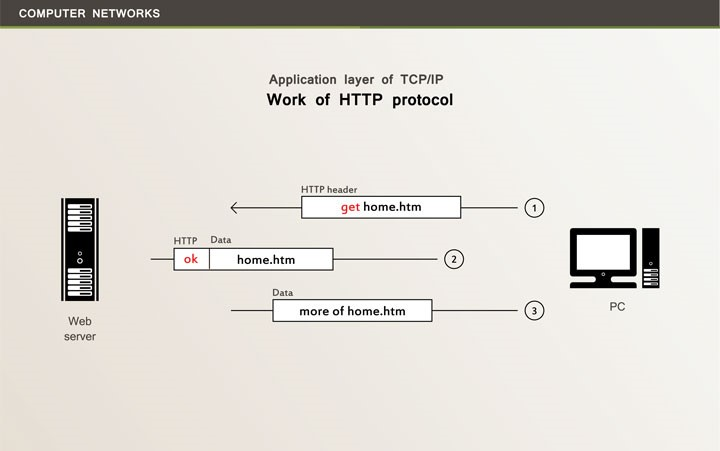 

Considerando o objetivo inicial, tudo que tínhamos eram conjuntos de páginas com conteúdo estático e a possibilidade de navegar entre elas a partir de hiperlinks, logo, o máximo de dinamismo possível era a execução de rotinas em JavaScript, ou a obtenção de dados via Sockets, com a utilização de Applets Java. 
 
Com a evolução da internet, as necessidades mudaram, e o processamento no servidor levou a um novo patamar na criação de sistemas para Web. Passamos a gerar respostas dinamicamente, com a possibilidade de utilização dos dados disponíveis no ambiente servidor, como tabelas dos bancos de dados, repositórios de arquivos, ou até mesmo informações obtidas por canais de comunicação com outras plataformas. 
 
Como as funcionalidades foram ampliadas, o perfil dos dados utilizados na comunicação também se diversificou. Atualmente, temos a adoção de **XML e JSON**, entre outros formatos, utilizados principalmente na representação de dados, como em operações cadastrais ou financeiras. 
 
De acordo com a metodologia mais aceita, atualmente, no que se refere à construção de páginas, a estruturação do conteúdo utiliza HTML, dados transitam nos formatos XML ou JSON, e a formatação tipográfica é baseada em CSS (Cascading Style Sheets). 
 
Como vamos gerar o conteúdo a partir de processamento efetuado no servidor, as respostas deverão ser constituídas com o uso dessas sintaxes e criadas através da linguagem de programação utilizada pelo servidor, como: **Java, Perl, PHP ou C#**. 
 
## Ambiente servidor para web 
 
Quando enviamos os dados para alguma tecnologia servidora, temos uma requisição HTTP, que poderá iniciar algum processamento no servidor e que, ao final, retornará uma resposta, normalmente com conteúdo HTML ou XML. Dentro do modelo de requisição e resposta, proporcionado pelo HTTP, o conteúdo recebido constitui um ambiente independente do anterior, no qual ocorreu a chamada, ou seja, **é um protocolo que não oferece a manutenção de estados**. 
 
Se utilizássemos um servidor HTTP simples, teríamos apenas um repositório de páginas e recursos de mídia, de forma geral, com todo o processamento ocorrendo no cliente, mas servidores como Apache **Tomcat** e IIS irão permitir o processamento no servidor. Em geral, temos a requisição do cliente, a interceptação do servidor, a captura de possíveis dados enviados, a execução de alguma rotina na linguagem adotada, a construção da resposta e o retorno para o cliente. 
 
Utilizaremos, no ambiente Java, uma implementação da interface **HttpServletRequest**, normalmente denominada **request**, para capturar os dados enviados pela requisição HTTP, efetuando qualquer tipo de processamento com esses dados, como a inserção em banco de dados ou as validações de segurança. A resposta, por sua vez, é encapsulada em uma implementação de **HttpServletResponse**, frequentemente com o nome **response**, que deverá emitir o conteúdo gerado através do canal de saída padrão da conexão. 
 
```javascript 
int a = Integer.parseInt(request.getParameter("valor")); 
response.getWriter().println("<html><body>Valor Enviado: "+a+ 
                             "</body></html>"); 
``` 
 
No fragmento de código apresentado, temos a recuperação de um parâmetro de nome **valor**, enviado através do protocolo HTTP, sendo recuperado no formato texto, a partir do método **getParameter** do objeto **request**, mas que teve a conversão para o formato inteiro com a chamada para **parseInt**. Em seguida, temos a escrita do conteúdo no canal de saída, através do objeto **response**, utilizando a sintaxe HTML. 
 
Algo que devemos ter em mente, com relação ao modelo Web, é a grande diferença do modelo desktop, no que se refere à gestão de estado de objetos. No modelo desktop, temos a armazenagem de objetos em um espaço de memória local, permitindo que os dados sejam mantidos durante toda a execução do sistema, mesmo que ocorra a troca de janelas, o que viabiliza a manutenção de estados, enquanto no modelo Web, a cada requisição e resposta, todos os objetos são recriados e o estado não pode ser mantido. 
 
Uma solução primária para a manutenção de estados no HTTP é o uso de cookies, algo que pode ser explorado através do Java Script. Com o uso do modelo de cookies, temos a desvantagem de trabalhar com recursos locais da máquina do usuário, ficando sujeitos a bloqueios efetuados no navegador. 
 
```javascript 
function setUser(login) { 
  var d = new Date(); 
  d.setTime(d.getTime() + (24 * 3600 * 1000)); // 24 horas 
  document.cookie = "username=" + login + ";expires=" + 
                    d.toUTCString() + ";path=/"; 
} 
``` 
 
Nas funções de exemplo, com sintaxe Java Script, temos o uso do atributo **cookie**, no objeto **document**, para armazenar o usuário logado de forma local. O momento para expiração da informação é calculado em milissegundos, sendo definido um prazo total de vinte e quatro horas, a partir do qual teremos a invalidação do cookie. 
 
Com base em uma tecnologia servidora, a melhor solução para manter os estados será a utilização de sessões, que correspondem a objetos alocados ao servidor, fazendo referência a dada conexão. Enquanto o usuário se mantiver no site, todos os dados atribuídos serão mantidos, sendo eliminados na perda da conexão. 
 
No ambiente Java, um objeto da classe **HttpSession**, que costuma se chamar **session**, permite a gerência de sessões HTTP, mas é sempre importante lembrar que ocorre consumo de memória no servidor, e a prática deve ficar restrita a finalidades específicas. 
 
## Web Server Tomcat 
 
Quando nos referimos ao **Tomcat**, estamos tratando de um projeto da Apache Software Foundation voltado para a definição de um servidor Web, ou **Web Server**, com código aberto e uso de tecnologias Java, como Java Server Pages (JSPs), Servlets, WebSockets e Java Expression Language. 
 
O conjunto de tecnologias adotado pelo Tomcat oferece um ambiente consistente para responder às chamadas HTTP, além de prover suporte a **Servlets** e **JSPs** de forma nativa no **contêiner Web**. Por ser um produto de código aberto, acabou se tornando o padrão para hospedagem de sistemas Java para Web, oferecendo a possibilidade de executar de modo totalmente independente, ou atuando como módulo plugável em servidores de aplicativos Java, uma estratégia adotada tanto pelo **JBoss** quanto pelo **GlassFish**. 
 
Um componente que implemente a interface **Servlet** é uma classe que permite ampliar as funcionalidades básicas de um servidor, ou seja, na prática é um aplicativo plugável, que deve ser executado em ambiente específico, como o contêiner Web oferecido pelo Tomcat. Por meio de um Servlet, temos o processamento no servidor, permitindo a geração dinâmica de conteúdo para a resposta HTTP. 
 
Quanto às páginas **JSP**, elas permitem uma sintaxe em que a porção estática da resposta é definida com base em **HTML ou XML**, e trechos dinâmicos são intercalados através de fragmentos de código Java denominados **Scriptlets**, que são executados no servidor. Apenas a forma de escrita é modificada, pois as páginas JSP são transformadas em Servlets pelo contêiner Web, quando ocorre o primeiro acesso, o que nos leva ao entendimento de que servidores como o Tomcat sempre utilizam Servlets para a geração de conteúdo dinâmico. 
 
A complexidade da arquitetura do **Tomcat** é refletida na grande quantidade de arquivos e diretórios gerados na instalação padrão. Os principais diretórios do Web Server Tomcat servidor podem ser: 
* bin: Binários estruturais do servidor, agrupados em arquivos no formato jar, e scripts para inicialização ou término da execução. 
* conf: Arquivos de configuração, como server.xml, que guardam os parâmetros gerais do Tomcat, incluindo a porta utilizada para comunicação. 
* lib: Bibliotecas de inicialização do servidor, no formato jar, que também ficam disponíveis para todos os aplicativos do ambiente. 
* logs: Arquivos de log, extremamente úteis para a identificação dos erros que ocorreram durante a execução do servidor. 
* webapps: Diretório de base para a instalação dos aplicativos Java Web, ou seja, define a raiz do site. Cada aplicativo corresponderá a um subdiretório. 
 
O **servidor Tomcat** pode ser utilizado como um serviço, executado a partir do ambiente do NetBeans, ou chamado diretamente pela linha de comando. Para executar na linha de comando, é necessário apontar a variável de ambiente **JAVA_HOME** para o local do **JDK** e executar o arquivo **startup.bat**, no Windows, ou **startup.sh**, para sistemas UNIX. 
 
```java 
set JAVA_HOME="C:\\Java\\jdk\\jdk1.7.0_80" 
startup.bat 
``` 
 
Com o servidor em execução, ele pode ser testado facilmente com a abertura de um navegador e a chamada para http://localhost:8080. 
 
Com a abertura da página inicial do Tomcat, sabemos que a inicialização se completou corretamente e o servidor está disponível para a inclusão de aplicativos. O término da execução ocorrerá com a chamada para **shutdown.bat**, no Windows, ou **shtdown.sh**, em sistemas com base no UNIX. 
 
No arquivo **server.xml**, do diretório **conf**, temos a possibilidade de alterar muitas das configurações do servidor, como o sistema de autenticação e a porta utilizada para a comunicação. A alteração da porta de conexão é feita no atributo com o nome **port**, presente nos elementos **Connector**, lembrando que o valor padrão é **8080**. 
 
```java 
<Connector port="8080" protocol="HTTP/1.1" 
           connectionTimeout="20000" redirectPort="8443" /> 
<Connector executor="tomcatThreadPool" 
           port="8080" protocol="HTTP/1.1" 
           connectionTimeout="20000" redirectPort="8443" /> 
``` 
 
Outro arquivo de grande importância, com o nome **tomcat-users.xml**, está presente no diretório **conf**. Para a autenticação padrão, podemos definir os usuários, as senhas e os perfis do servidor com o uso desse arquivo. 
 
```java 
<?xml version="1.0" encoding="UTF-8"?> 
<tomcat-users xmlns="http://tomcat.apache.org/xml" 
       xmlns:xsi="http://www.w3.org/2001/XMLSchema-instance"    
       version="1.0" 
       xsi:schemaLocation="http://tomcat.apache.org/xml 
       tomcat-users.xsd"> 
``` 
 
Na configuração inicial, temos apenas o usuário padrão do Tomcat, com utilização dos perfis, ou regras (**roles**), que liberam as funções administrativas apenas em modo texto. Podemos efetuar uma alteração muito interessante no arquivo **tomcat-users.xml**, acrescentando os perfis **manager-gui** e **admin-gui** ao usuário **tomcat**. 
 
```java 
<user password="tomcat" 
      roles="manager-script,admin,manager-gui,admin-gui" 
      username="tomcat"/> 
``` 
 
Com a alteração efetuada, podemos acessar os **gestores gráficos**, clicando em alguns dos links presentes na página inicial do servidor, como **Manager App** e **Host Manager**. 
 
### Interface administrativa do Tomcat 
 
Por meio dos gestores gráficos, é possível criar servidores virtuais, gerenciar os aplicativos, implantar novos aplicativos, entre diversas outras funções administrativas, sem que haja a necessidade de alterar diretamente os arquivos XML de configuração. 
 
 

## Estrutura do aplicativo WEB 
 
Os aplicativos que criaremos deverão obedecer à estrutura exigida pelo Tomcat, que é composta por um diretório de base, ou raiz, com o nome do aplicativo, contendo um subdiretório de nome WEB-INF e outro com o nome META-INF. Vejamos na figura a seguir como se organiza a estrutura de um aplicativo Web Java: 
 
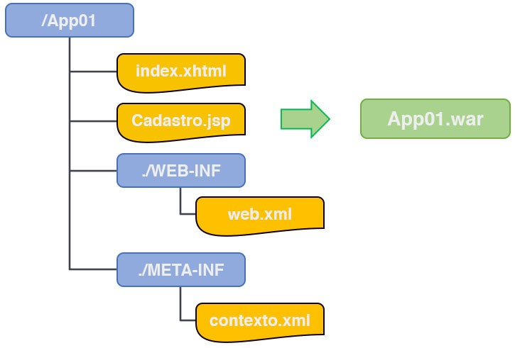

|   |   | 
|---|---|
| Diretório raiz | Temos páginas JSP, HTML, XML, e outros formatos interpretados, além de podermos acrescentar subdiretórios para a organização geral do conteúdo. É comum, por exemplo, definir diretórios para imagens, folhas de estilo e arquivos de código Java Script, permitindo que as bibliotecas e os temas utilizados sejam isolados em diretórios próprios, como no caso do JQuery, o que facilita a atualização de versões e a mudança do aspecto geral do sistema. |
| Diretório WEB-INF | Encontramos o arquivo de configuração com o nome web.xml, um subdiretório com o nome classes para os arquivos compilados do Java e um subdiretório lib com as bibliotecas nos formatos jar e zip. Quando criamos um Servlet, o arquivo compilado da classe Java é copiado para classes, obedecendo à estrutura de diretórios definida pelo pacote, e o reconhecimento pelo servidor pode ser configurado, com a utilização do mapeamento correto, no arquivo web.xml. |
| Diretório META-INF | São definidas as configurações de ambiente, com recursos oferecidos para o aplicativo a partir do contêiner Web. Podemos ter arquivos como context.xml, com informações gerais de contexto, incluindo o pool de conexões com o banco de dados. |
|   |   |
 
Alguns elementos fundamentais para a configuração do servidor: 
 
1. Área do manager app para implantação de aplicativos 
   - a. Toda a estrutura criada pode ser compactada em um arquivo com extensão war, que significa Web Archive, podendo ser implantado no servidor, com o simples upload na divisão WAR file to deploy do aplicativo Manager App. De acordo com a configuração utilizada no servidor, quando temos a opção de hot deployment ativada, podemos copiar o arquivo war, ou toda a estrutura aberta, para um diretório específico, normalmente chamado de webapps ou deploy, conforme a distribuição, e o aplicativo será expandido, ficando disponível para os usuários. 

   - b. 

2. Área do manager app para acompanhamento de aplicativos 
   - a. Com a configuração de hot deployment ativada, a desinstalação de um aplicativo ocorre por meio da simples remoção do diretório ou do arquivo war. Também é possível efetuar a desinstalação do aplicativo através da opção Undeploy de Manager App. 

   - b. 

3. Acréscimo do servidor à interface do netbeans 
   - a. A interface oferecida pelo NetBeans permite iniciar e parar o servidor, ou ainda remover os aplicativos implantados, por meio de uma interface gráfica simples, oferecida na aba Services, opção Servers. Caso o servidor não esteja configurado na plataforma, basta adicioná-lo, indicando diretório de instalação, usuário e senha. 
   
   - b. 

4. Gerenciamento de servidores por meio do netbeans 
   - a. Com o servidor configurado, basta clicar com o botão direito e escolher a opção Start, iniciando a execução e permitindo acessar e remover os aplicativos implantados, o que também é feito a partir do clique com o botão direito. A implantação do aplicativo, por sua vez, ocorre a partir da execução de um projeto do tipo Web. 

   - b 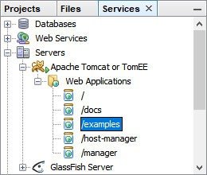
 
## Servidores de aplicativos 
 
Quando nos referimos a servidores de aplicativos, ou Application Servers, estamos considerando plataformas capazes de suportar o perfil de processamento necessário para projetos de grande porte, com alto nível de conectividade, processamento paralelo e distribuído, pools de recursos compartilhados, serviços de autenticação e autorização, entre diversos outros elementos comuns para um ambiente empresarial complexo. Entre os componentes necessários, é comum encontrar os Web Servers, que neste caso atuam como módulos internos dos Application Servers. 
 
O objetivo primário de um servidor de aplicativos é o de prover um ambiente que trate das necessidades comuns do ambiente de execução, como segurança, balanceamento de carga, alta disponibilidade, gerenciamento de exceções e controle transacional, entre outras. Eles oferecem uma arquitetura e um conjunto de contêineres, permitindo ao programador se concentrar apenas nas regras de negócio e deixando para o servidor a responsabilidade sobre a gerência de recursos e funcionalidades comuns. 
 
Servidores de aplicativos podem trabalhar de forma conjunta, com base em protocolos voltados para o processamento distribuído, o que traz mais dificuldades na gerência de exceções, já que podem ocorrer de forma local ou remota. Com a possibilidade da ocorrência de exceções em vários locais distintos, dentro de um mesmo processo, o controle transacional também precisa englobar esses locais, levando à necessidade de bibliotecas para a gerência de transações distribuídas. 
 
Uma transação é um processo atômico e isolado, que deve ser executado de forma consistente, e com resultados duráveis. 
 
Uma necessidade básica do ambiente corporativo é a gerência da segurança, exigindo ferramentas robustas para a autenticação de usuários e autorização para o uso de recursos e funcionalidades. Além de gerenciar o acesso, nosso servidor deve ser capaz de oferecer protocolos seguros, como TLS. 
 
Como os servidores de aplicativos devem lidar com diversos fluxos de dados que fazem parte do ambiente corporativo, incluindo bases de dados relacionais e mensagerias, um requisito primário é a presença de um grande conjunto de bibliotecas de middleware, garantindo a interoperabilidade com diversos outros sistemas. É com base nas opções de middleware que são definidos alguns componentes, como pools de conexões com o banco de dados e canais de comunicação com mensagerias, entre outros. 
 
Devido à grande quantidade de componentes e recursos compartilhados, é natural que haja a necessidade de individualização, o que deve ser feito com o uso de nomes únicos, gerenciados por serviços de nomes e diretórios. Para servidores criados na plataforma Java, o JNDI (Java Naming and Directory Interface) gerencia os serviços para registro e localização de recursos, funcionando como um canal de identificação comum entre os aplicativos, tanto internamente quanto para acessos externos, além de centralizar toda a integração com serviços de nomes e diretórios de outras plataformas. 
 
Temos diversas opções de servidores de aplicativos criados no ambiente Java, como JBoss, GlassFish, WebSphere, Oracle Application Server e WebLogic, sempre com base no JEE, uma arquitetura de referência para a implementação de ambientes de execução corporativos, com suporte a objetos distribuídos. 
 
## Tecnologias de objetos distribuídos 
 
Um ponto central, na grande maioria dos Application Servers, é a presença de sistemas de objetos distribuídos, como CORBA (Common Object Request Broker Architecture), ou Microsoft DCOM (Distributed Component Object Model). No caso do Java, temos os componentes do tipo EJB. 
 
Quando nos referimos a processamento distribuído, estamos considerando serviços que são oferecidos de forma remota, ou distribuída, usando protocolos próprios, como RPC e RMI. Qualquer que seja a tecnologia para processamento distribuído, alguns elementos são comuns para a definição da maioria das arquiteturas: 
* Protocolo de comunicação 
* Serviço de registro e localização 
* Descritor de serviços 
 
Um exemplo comum de processamento distribuído, no mercado de desenvolvimento, são os Web Services, como o tipo SOAP (Simple Object Access Protocol), que utiliza um protocolo de mesmo nome, WSDL (Web Service Description Language) para descrever os serviços e UDDI (Universal Description, Discovery and Integration) nas tarefas de registro e localização. 
 
Algo muito interessante sobre os elementos citados é que todos trabalham com XML, garantindo a interoperabilidade em todos os níveis da arquitetura. 
 
Quando consideramos os objetos distribuídos, temos o mesmo tipo de fornecimento de serviços, de forma distribuída, mas agora com a execução efetuada a partir de pools de objetos nos servidores. Por exemplo, no CORBA temos a utilização do protocolo de rede IIOP (Internet Inter-ORB Protocol), descritor IDL (Interface Definition Language), além de registro e localização via COS Naming, lembrando que COS significa CORBA Object Services. 
 
O registro dos EJBs, no ambiente Java, utiliza JNDI, e a comunicação utiliza o protocolo misto RMI-IIOP. Quanto ao descritor de serviços, utilizamos interfaces Java, mas pode ser gerado o IDL a partir das interfaces. 
 
A utilização dos serviços distribuídos segue um fluxo comum: 
1. Localizar o serviço ou objeto distribuído a partir do serviço de nomes 
2. Recuperar o descritor a partir da localização encontrada 
3. Gerar o cliente de comunicação a partir do descritor 
4. Transmitir as solicitações, através do cliente, com base no protocolo 
 
Com a utilização da ferramenta correta, o cliente é gerado de forma automática a partir do descritor, permitindo que nossas chamadas ao cliente se assemelhem a solicitações locais, enquanto toda a comunicação remota ocorre de forma transparente. 
 
Durante a execução dos objetos, no pool do servidor, o contêiner irá fornecer todos os recursos necessários em termos de autenticação, autorização, acesso a **middleware**, controle transacional, entre outras funcionalidades. Com base em um contêiner, temos a execução controlada e robusta dos processos de negócio do nosso sistema. 
 
Confira a seguir os **componentes arquiteturais** para alguns dos serviços distribuídos mais comuns. 

| TECNOLOGIA | REGISTRO E LOCALIZAÇÃO | DESCRITOR | PROTOCOLO |
| :---: | :---: | :---: | :---: | 
| CORBA | COS Naming | IDL | IIOP |
| SOAP | UDDI | WSDL | SOAP |
| RMI | JNDI | Interface Java | RMI |
| EJB | JNDI | Interface Java | RMI-IIOP |
| | |
 
## Application server glassfish 
 
Enquanto o Tomcat suporta, de forma nativa, apenas Servlets e JSPs, atuando como um Web Server, o GlassFish vai além, oferecendo suporte às tecnologias Java de objetos distribuídos, no caso os EJBs, sendo classificado como Application Server. 
 
É importante mencionar que o Tomcat é utilizado pelo GlassFish como módulo interno, delegando para o Web Server as tarefas de comunicação no protocolo HTTP e tratamento de Servlets e JSPs, enquanto os outros componentes da arquitetura do GlassFish tratam das diversas tecnologias do JEE. 
 
Com base no GlassFish, somos capazes de criar sistemas mais complexos, com uso de EJBs e transações distribuídas, além de obtermos ferramentas para gerenciamento de componentes corporativos, como mensagerias. O servidor também disponibiliza um ambiente de testes simplificado para Web Services do tipo SOAP. 
 
Seguindo a arquitetura JEE, o ponto central do servidor é o contêiner EJB, que gerencia o ciclo de vida dos objetos distribuídos, além de intermediar a utilização de recursos do ambiente. A disponibilização de recursos para os EJBs é configurada através de arquivos XML e anotações de código, sempre através de identificadores no JNDI. 
 
Como todas as bibliotecas de middleware são gerenciadas pelo servidor, o processo é o mesmo para a grande maioria dos recursos. De forma geral, temos a criação do recurso, como um pool de conexões, por exemplo, e o registro no JNDI, em um primeiro instante, e a localização e utilização pelo contêiner, a partir das configurações definidas para os EJBs, no momento da execução do aplicativo. 
 
Entre as bibliotecas e os elementos gerais de middleware do GlassFish, podemos destacar a presença do JDBC, intermediando o acesso aos bancos de dados, e do JMS, gerenciando o uso de mensagerias a partir de canais e filas, além de bibliotecas para o controle de transações locais e distribuídas, como JTA e JTS. 
 
Além dos componentes do GlassFish, e do Tomcat como módulo, a distribuição padrão inclui o serviço de mensageria GlassFish Message Queue, o banco de dados Derby, que também é conhecido como **Java DB**, e uma ferramenta de inicialização pelo console. 
 
Vejamos a seguir os níveis de diretórios do Application Server GlassFish: 
* bin: Contém apenas a ferramenta asadmin para inicialização pelo console e representa a divisão descrita. 
* glassfish: Diretório do servidor de aplicativos, com os componentes estruturais, arquivos de configuração e domínios estabelecidos. 
* javadb: Corresponde a uma distribuição do banco de dados Derby, contendo os subdiretórios bin e lib, com scripts de gerenciamento e bibliotecas. 
* mq: Contém os componentes da mensageria GlassFish MQ, além de diversos exemplos de utilização, disponibilizados no subdiretório examples. 
 
Ao trabalhar com o servidor GlassFish, precisamos definir domínios, que são ambientes completos e independentes para a instalação e execução de aplicativos. Fazendo uma comparação com sistemas de gerenciamento de bancos de dados, como o Oracle, temos o equivalente a instâncias de execução. 
1. Instalação do glassfish: Um domínio padrão, com o nome domain1, é criado, e podemos iniciar o servidor a partir da linha de comando com o uso de asadmin, tendo como parâmetros a opção start-domain e o nome do domínio. `asadmin start-domain domain1` 
2. Tela inicial do glassfish: Com o servidor iniciado, podemos acessar o domínio por meio da chamada para localhost na porta configurada, com o valor padrão 8080, através de um navegador, enquanto o console administrativo utiliza a porta 4848. Para encerrar a execução, basta invocar o mesmo programa (asadmin), com a utilização do parâmetro stop-domain, sendo ainda possível consultar os domínios cadastrados por meio da opção list-domains. 
3. Interface administrativa do glassfish: Observando a árvore de diretórios do servidor, temos subdiretórios para bibliotecas compartilhadas, módulos estruturais e programas administrativos (bin), entre outros. O mais importante para nós será o subdiretório domains, onde são definidas as estruturas de domínio do servidor. Entre os subdiretórios do domínio, temos um para a definição de configurações (config), podendo ser observado o arquivo domain.xml, com a definição de características gerais, como as portas de conexão utilizadas. Basicamente, apenas as portas de conexão precisam ser modificadas de forma manual para o domínio, ao nível do elemento network-listeners, de domain.xml, sendo todas as demais configurações efetuadas através do console administrativo, na porta 4848. Por meio da interface administrativa, é possível executar diversas tarefas, como implantar os aplicativos, criar os pools de conexão com o banco de dados, gerenciar filas e canais da mensageria, definir identificadores JNDI, entre outras. 
4. Gerenciamento de clusters do glassfish: Utilizando a árvore de navegação, iniciada em Common Tasks, temos acesso rápido a todas as tarefas administrativas, como o gerenciamento de Clusters, por exemplo. 
5. Gerenciamento do glassfish por meio do netbeans: Da mesma forma que para o Tomcat, podemos acessar e configurar elementos básicos do GlassFish a partir do NetBeans, por meio da aba Services. 
 
## Estrutura do aplicativo corporativo 
 
Um aplicativo corporativo comporta elementos como EJBs, Servlets e JSPs. De forma geral, os objetos de negócio e as classes de acesso ao banco de dados são compactados em um arquivo jar, enquanto a interface Web é organizada em um arquivo war, sendo os dois arquivos compactados em um terceiro, com extensão ear. 
 
A estrutura padrão para implantação é obedecida pelo NetBeans, quando criamos um projeto do tipo Enterprise Application. 
 
Na prática, são criados um projeto principal, com extensão ear, e dois projetos internos, com as extensões jar e war. Para implantar e testar o aplicativo, devemos utilizar sempre o projeto principal, representado por um triângulo. 
 
Uma estratégia simples de programação, dentro da arquitetura imposta pelo servidor, envolve a programação de classes DAO para acesso ao banco de dados, e EJBs, com as regras de negócio, no projeto jar. Como o projeto trata da camada de negócios do sistema, não devem ser definidos elementos de interface neste nível. 
 
Com a camada de negócios completa, ao nível do jar, podemos implementar a interface Web no projeto war, com a criação de elementos como Servlets e JSPs. Os elementos de interface não podem conter inteligência de negócios, funcionando como um simples canal de comunicação com o usuário e direcionador das solicitações efetuadas para a camada de negócios. 
 
Projetos mais simples, que não envolvem os EJBs e demais elementos corporativos, não precisam de um modelo tão robusto e podem ser definidos em termos de um simples aplicativo para Web, com extensão war. Nesse caso, os objetos de negócios e as classes de acesso ao banco de dados ficam no mesmo projeto, junto aos Servlets e JSPs. 
1. Criação de aplicativo web no netbeans: Para a criação de um aplicativo Web simples, que pode ser executado tanto no Tomcat quanto no GlassFish, utilizamos um projeto do tipo Web Application. Ao executar um projeto Web ou corporativo, ele é implantado no servidor e exibido no navegador após a implantação. Se o servidor não estiver ativo, o NetBeans irá iniciá-lo automaticamente, antes de implantar o aplicativo. 
2. Implantação de aplicativo no console do glassfish: Pode-se também implantar o aplicativo em um servidor externo, a partir do console de administração do GlassFish, com o uso da opção Deploy an Application. Tudo o que precisamos fazer, na tela, é escolher o arquivo, com extensão ear ou war, e com o clique no botão OK será efetuada a implantação. 
3. Gerenciamento de aplicativos no console do glassfish: Para verificar os aplicativos instalados, basta acessar a opção Applications na árvore de navegação, onde são listados todos os nossos aplicativos, sendo possível ainda efetuar a remoção deles. Em termos práticos, devido à funcionalidade do autodeploy, temos a implantação do aplicativo com o simples upload de um arquivo, e a remoção ocorre com a exclusão do arquivo no servidor. 
 
## Aplicativos web no netbeans 
 
Em nosso contexto de estudos, um aplicativo corporativo não será necessário, já que estamos analisando tecnologias voltadas para a camada Web. Precisaremos apenas de um aplicativo Web, com extensão war, e o uso de um servidor, como Tomcat ou GlassFish. 
 
Vamos criar um projeto de testes, conforme os passos apresentados a seguir: 
1. Escolha o projeto do tipo Web Application, na categoria Java Web. 
2. Defina o nome do projeto (WebTeste001). 
3. Escolha o servidor (GlassFish) e a versão do JEE (Java EE 8 Web). 
 
Ao término da execução desses passos, o novo projeto será apresentado na aba Projects do NetBeans. Pode ser necessário acrescentar manualmente a biblioteca Java EE 8 API, caso não esteja instalada. 
 
Observe que o arquivo web.xml não é apresentado na estrutura do projeto, o que se deve ao fato de termos utilizado o JEE versão 8, onde as configurações são efetuadas, em sua grande maioria, através de anotações no código Java. 
 
* Web Pages: Elementos interpretados, como XHTML, JSP (Java Server Pages), bibliotecas Java Script e folhas de estilo CSS. 
* Source Pages: Elementos compilados, definidos em temos de pacotes e classes Java, incluindo nossos Servlets. 
* Libraries: Bibliotecas Java requeridas pelo aplicativo Web. 
Configuration Files: Arquivos de configuração, como MANIFEST.MF e web.xml. 
 
Agora podemos começar a criar os elementos constituintes de nosso sistema, incluindo Servlets e JSPs, e executar o projeto. Na execução, teremos a geração do arquivo war, o servidor será iniciado, caso ainda não esteja ativo, e o arquivo compilado será copiado para o diretório de autodeploy, ocorrendo a implantação do aplicativo e abertura do navegador no endereço correspondente ao index.html. 
 
A classe HttpServlet, filha de GenericServlet, integra-se ao ambiente de execução do servidor através do contêiner Web, tirando proveito das tecnologias Java presentes ali, como pools de conexão, controle transacional e ferramentas de segurança. Quanto à comunicação com o usuário, a classe HttpServlet apresenta métodos para responder às chamadas dos tipos GET e POST no protocolo HTTP. 
 
Tudo que precisamos fazer é criar um descendente da classe HttpServlet, herdando toda a integração já existente com o ambiente, e alterar os métodos doGet e doPost para, através do polimorfismo, personalizar as respostas em nosso aplicativo às chamadas dos tipos GET e POST, respectivamente. 
 
Para definir um Servlet no NetBeans, adicione um novo arquivo e siga os passos: 
1. Escolha o arquivo do tipo Servlet na categoria Web. 
2. Defina o nome do Servlet (ServCalc) e do pacote (servlets). 
3. Finalize sem adicionar as informações ao arquivo web.xml. 
 
Teremos o código de ServCalc no editor de código do NetBeans e devemos observar alguns detalhes, como o código oculto (editor-fold), que trata de um trecho de código escondido por meio de comentários no início e fim do bloco, com a visualização alternada através do clique sobre o sinal de adição, próximo à margem esquerda. 
 
O código oculto, para ServCalc, engloba os métodos doGet e doPost, responsáveis pela recepção de chamadas HTTP dos tipos GET e POST, respectivamente. No código gerado, ambos os métodos redirecionam para processRequest, fazendo com que GET e POST sejam tratados da mesma forma, algo que nem sempre é interessante, pois temos situações, como no processo de login, em que não devemos aceitar chamadas GET. 
 
O próximo passo será a alteração do método processRequest, para que corresponda ao processamento necessário em nosso aplicativo. 
 
```java 
protected void processRequest(HttpServletRequest request, 
          HttpServletResponse response) 
          throws ServletException, IOException { 
  response.setContentType("text/html;charset=UTF-8"); 
  try (PrintWriter out = response.getWriter()) { 
    int a = new Integer(request.getParameter("a")); 
    int b = new Integer(request.getParameter("b")); 
    out.println("<html><body>"); 
    out.println("A soma de " + a + " e " + b + " será " + 
               (a + b)); 
    out.println("</body></html>"); 
  } 
} 
``` 
 
A assinatura do método **processRequest**, assim como ocorre em **doGet** e **doPost**, traz dois tipos de parâmetros: 
* Tipo HttpServletRequest: Com o nome request, para receber a requisição do usuário. 
* Tipo HttpServletResponse: Com o nome response, que será responsável pela resposta HTTP. 
 
Iniciamos a implementação de processRequest com a definição do tipo de saída, que no caso é HTML, com codificação UTF-8. Em seguida, iniciamos um bloco protegido, do tipo try with resources, em que o objeto de nome out recebe o canal de saída de response. 
 
Em meio ao bloco protegido, temos a recuperação dos parâmetros a e b, por meio do método getParameter, com a conversão para as variáveis inteiras de mesmo nome, o que é feito com base na classe Integer. Como o protocolo HTTP trabalha com valores do tipo texto, qualquer outro formato exigirá conversões ao nível do Java. 
 
Após a recuperação e conversão dos parâmetros da requisição, efetuamos a montagem da resposta através do canal de saída, com base em chamadas ao método println, como se estivéssemos enviando a informação para o console. Nossa resposta será uma página HTML simples, com a presença da frase com a soma dos valores fornecidos. 
 
Para testar nosso Servlet, devemos executar o projeto e efetuar a chamada correta a partir do navegador: http://localhost:8080/WebTeste001/ServCalc?a=10&b=15 
 
Devemos compreender como ocorre o direcionamento de fluxo, no protocolo HTTP, para a classe ServCalc. No formato original de mapeamento, deveríamos acrescentar uma entrada no arquivo web.xml, mas como estamos lidando com uma versão mais recente do contêiner, uma anotação WebServlet, aplicada à classe ServCalc, definirá o mapeamento necessário. 
 
```java 
@WebServlet(name = "ServCalc", urlPatterns = {"/ServCalc"}) public class ServCalc extends HttpServlet { 
``` 
 
A anotação WebServlet requer o nome do Servlet e o padrão de escrita da URL para o redirecionamento. Embora, tradicionalmente, sejam utilizados textos correspondentes ao nome da classe em si, esta não é uma regra, permitindo até mesmo a utilização de endereços dinâmicos na URL, com base em coringas, como no caso de "*.jsf". 
 
Para que não seja necessário escrever o endereço completo a cada chamada, podemos alterar o arquivo index.html. 
 
```html 
<!DOCTYPE html> 
<html> 
    <body> 
        <form method="GET" action="ServCalc"> 
            <input type="text" name="a"/> 
            <input type="text" name="b"/> 
            <input type="submit" value="somar"/> 
        </form> 
    </body> 
</html> 
``` 
 
Finalizando a modificação do index e executando novamente o aplicativo, teremos um formulário para a entrada dos valores e o botão de envio para o Servlet. 
 
## Tecnologia de JSPs 
 
A criação de Servlets seria suficiente para prover as necessidades de todo e qualquer aplicativo Java Web, porém, a construção de páginas diretamente no código pode se tornar desconfortável para os profissionais de design. O problema foi solucionado com um novo modelo de programação, em que os códigos Java são escritos dentro do conteúdo HTML ou XML por meio da tecnologia JSP. 
 
O processo para a criação de uma página JSP envolve apenas a adição de um arquivo, do tipo JSP na categoria Web. É necessário definir o nome do arquivo, sem acrescentar a extensão, e o novo componente ficará disponível na divisão Web Pages do projeto, ou em um subdiretório especificado nela. 
 
Vamos criar uma página JSP simples, utilizando o nome ListaCores. Ela não irá fornecer nenhuma funcionalidade relevante para o sistema, mas permitirá que analisemos os elementos estruturais principais das páginas JSP. 
 
```html 
<%@page contentType="text/html" pageEncoding="UTF-8"%> 
<!DOCTYPE html> 
<html> 
   <body> 
      <ul> 
         <% 
         String[] cores = {"vermelho","verde","azul"}; 
         for(String x: cores) { 
            out.println("<li>"+x+"</li>"); 
         } 
         %> 
      </ul> 
   </body> 
</html> 
``` 
 
Diretivas: A primeira linha deste código é uma diretiva, no caso indicando o tipo de conteúdo e a página de acentuação que será adotada. Diretivas também são utilizadas para importar bibliotecas e definir a página de erro, entre diversas outras opções. 
 
HTML: Nas linhas seguintes, temos código HTML padrão, que irá compor a saída sem requerer interpretação no servidor. O que temos aqui é a definição da estrutura básica da página HTML e a inclusão de uma lista, com o uso do marcador UL. 
 
Scriptlet: Internamente ao marcador de lista, temos um bloco iniciado com os símbolos de menor e percentual e terminado com os símbolos de percentual e maior, definindo um trecho que é executado no servidor, com utilização de sintaxe Java, e que é conhecido como Scriptlet. No trecho de código do exemplo, temos a definição de um vetor de texto com nomes de cores, as quais serão impressas no conteúdo da página através do objeto out, implícito nas páginas JSP, como itens de lista. 
 
Para testar nossa página JSP, vamos executar o projeto e efetuar a chamada correta a partir do navegador: http://localhost:8080/WebTeste001/ListaCores.jsp e estando tudo correto, teremos uma página de resposta. 
 
Os objetos request e response também são implícitos para as páginas JSP, podendo ser utilizados da mesma forma que nos métodos doGet e doPost dos Servlets. Inclusive, devemos nos lembrar de que a página JSP é convertida em Servlet no primeiro acesso, logo, o que muda é a forma de programar, e não a funcionalidade original. 
 
## Sessões e redirecionamentos 
 
As sessões HTTP são de grande utilidade no ambiente Web, provendo uma forma de manutenção de estados na troca de páginas, pois ao contrário dos sistemas desktop, com valores mantidos na alternância de janelas, a cada página temos um novo conjunto de variáveis, desconsiderando-se todas as existentes antes da requisição ser efetuada. 
 
Podemos controlar sessões de forma muito simples, com o uso da classe HttpSession, e um exemplo típico de utilização é no controle de login. Normalmente temos um Servlet para a verificação do login, e a sessão deve ser obtida a partir do objeto de requisição, com a invocação do método getSession. 
 
Nas páginas JSP, o controle de sessões é feito com o uso do objeto implícito session, da classe HttpSession. Para demonstrar o processo de login, vamos criar uma página JSP, que receberá o nome "Segura.jsp" e representará um recurso com acesso autenticado. 
 
```html 
<%@page contentType="text/html" pageEncoding="UTF-8"%> 
<% 
   if(session.getAttribute("usuario")==null) 
      response.sendRedirect("Login.jsp"); 
   else { 
%> 
<!DOCTYPE html> 
<html> 
   <body> 
      <h1>Esta é uma página protegida!</h1> 
      O usuário <%=session.getAttribute("usuario")%> 
      está logado.<br/> 
      <form action="ServletLogin" method="post"> 
      <input type="hidden" name="acao" value="desconectar"/> 
      <input type="submit" value="logout"/> 
      </form> 
   </body> 
</html> 
<% } %> 
``` 
 
Enquanto os parâmetros da requisição HTTP assumem apenas valores do tipo texto, os atributos da sessão permitem guardar qualquer tipo de objeto. Embora seja possível a utilização de estruturas mais complexas, iremos utilizar apenas um elemento de texto. 
 
Na primeira parte do arquivo JSP, temos o teste para a existência do atributo "usuário" na sessão, e se ele não existir, isto significa que não há um usuário autenticado, devendo ocorrer o redirecionamento para a página de login através de sendRedirect. 
 
A seguir, temos os dois métodos de redirecionamento do Java para Web. 
* Método sendRedirect: Possui a interface HttpServletResponse. Envia um sinal de redirecionamento para o navegador, gerando uma nova requisição. 
* Método forward: Possui a interface RequestDispatcher. Redirecionamento ao nível do servidor, que ocorre de forma interna, com a manutenção da requisição original e suas informações. 
 
Ainda observando o código da página JSP, podemos notar que a instrução else é aberta antes do início do código HTML e fechada apenas no final, logo após a tag de finalização, significando que a página de resposta será processada apenas se o atributo usuário estiver presente na sessão, ou seja, se existir alguém autenticado no sistema. Quando ocorre a montagem da página, temos um retorno bastante simples, com a exibição do login corrente, obtido através de getAttribute, e um botão para efetuar o logout, ou desconexão, por meio de uma chamada para ServletLogin. 
 
Agora precisamos criar a página de login, que receberá o nome "Login.jsp", e o Servlet responsável pelo controle das ações referentes aos processos de conexão e desconexão, que será chamado de ServletLogin. 
 
```html 
<%@page contentType="text/html" pageEncoding="UTF-8"%> 
<!DOCTYPE html> 
<html> 
   <body> 
      <h1>Acesso ao Sistema</h1> 
      <form action="ServletLogin" method="post"> 
         <input type="hidden" name="acao" value="conectar"/> 
         Login: <input type="text" name="login"/> 
         Senha: <input type="password" name="senha"/> 
         <input type="submit" value="login"/> 
      </form> 
<% 
   if(request.getAttribute("erro")!=null) { 
%> 
      <hr/>Ocorreu um erro: <%=request.getAttribute("erro")%>    
<% 
   } 
%> 
    </body> 
</html> 
``` 
 
Na primeira parte de Login.jsp, temos um formulário HTML bastante simples, contendo as informações que deverão ser enviadas para ServletLogin no processo de verificação, enquanto na segunda parte apresentamos mensagens de erro de autenticação. Note que a segunda parte será apresentada apenas se o atributo de erro estiver presente na chamada ao JSP, e que, por se tratar de um atributo, e não parâmetro, não permite o envio a partir do protocolo HTTP, mas apenas através do código do Servlet. 
 
```java 
@WebServlet(name = "ServletLogin", 
            urlPatterns = {"/ServletLogin"}) 
public class ServletLogin extends HttpServlet { 
   @Override 
   protected void doPost(HttpServletRequest request, 
                         HttpServletResponse response) 
                         throws ServletException, IOException { 
      String acao = request.getParameter("acao"); 
      if(acao==null) 
         throw new ServletException("Parâmetro Requerido"); 
      HttpSession session = request.getSession(); 
      switch(acao){ 
      case "conectar": 
         if(request.getParameter("login").equals("admin")&& 
            request.getParameter("senha").equals("123")){ 
            session.setAttribute("usuario", "Administrador"); 
            response.sendRedirect("Segura.jsp"); 
         } else { 
            request.setAttribute("erro","Dados inválidos."); 
            RequestDispatcher rd = 
               request.getRequestDispatcher("Login.jsp"); 
            rd.forward(request,response); 
         } 
         break; 
      case "desconectar": 
         session.invalidate(); 
         response.sendRedirect("index.html");                
         break; 
      default: 
         throw new ServletException("Parâmetro incorreto"); 
      } 
   } 
} 
``` 
 
Aqui estamos tratando de um processo de login muito simples, mas que, por se tratar de uma autenticação de usuário, deverá adotar apenas o método doPost. O parâmetro acao, indicando a solicitação de conexão ou desconexão, é obrigatório, sendo gerada uma exceção caso ele não seja fornecido. 
 
A partir de uma instrução switch, com base no parâmetro acao, temos a implementação da autenticação e da desconexão do sistema. Observe que o Java permite uso de texto para os desvios de fluxo do switch, mas apenas nas versões atuais da plataforma. 
 
Para responder à ação "conectar" é feito um teste, em que apenas o login "admin" e a senha com valor "123" permitirão a autenticação. Fornecidos os valores corretos, temos o acréscimo do atributo usuario à sessão, contendo o valor "Administrador", e ocorre o redirecionamento para a página Segura.jsp. 
 
Caso sejam fornecidas credenciais diferentes das estipuladas, será definido o atributo erro para a requisição, com a mensagem "Dados Inválidos", e ocorrerá o retorno para Login.jsp, através de um redirecionamento interno. 
 
Quanto à resposta para a ação "desconectar", temos um processo bem mais simples, com a chamada para o método invalidate, do objeto session, e o redirecionamento para a página index.hml. Com a utilização do método invalidate, a sessão atual é fechada, e os atributos associados à conexão do usuário são removidos da memória do servidor. 
 
Agora basta adicionar uma chamada para a página Segura.jsp em index.html. `<a href="Segura.jsp">Pagina Segura</a>` 
 
Embora seja um processo de autenticação muito simples, com valores prefixados, você pode alterá-lo facilmente para utilizar uma base de dados e senhas criptografadas. 
 
## Middleware 
 
Front-end: É a camada de software responsável pelo interfaceamento do sistema, com o uso de uma linguagem de programação. Aqui temos os aplicativos Java Web como opção de front-end. 
 
Back-end: Compreende o conjunto de tecnologias que pode ser acessado a partir de nosso front-end, mas que não pertence ao mesmo ambiente, como os bancos de dados e as mensagerias. Para nossos exemplos, iremos adotar o banco de dados Derby como back-end, com a consulta e manipulação de dados ocorrendo através do envio de comandos SQL, a partir do front-end. 
 
Exemplo: As mensagerias são outro bom exemplo de back-end, com uma arquitetura voltada para a comunicação assíncrona entre sistemas, efetuada através da troca de mensagens. Essa é uma tecnologia crucial para diversos sistemas corporativos, como os da rede bancária. 
 
Um grande problema, enfrentado pelas linguagens de programação mais antigas, é que deveríamos ter versões específicas do programa para acesso a cada tipo de servidor de banco de dados, como Oracle, Informix, DB2 e SQL Server, entre diversos outros, o que também ocorria com relação aos sistemas de mensagerias, como por exemplo, MQ Series, JBoss MQ, Active MQ e Microsoft MQ. 
 
Com diferentes componentes para acesso e modelos de programação heterogêneos, a probabilidade de ocorrência de erros é simplesmente enorme, levando à necessidade de uma camada de software intermediária, responsável por promover a comunicação entre o front-end e o back-end. Foi definido o termo middleware para a classificação desse tipo de tecnologia, que permite integração de forma transparente e mudança de fornecedor com pouca ou nenhuma alteração de código. 
 
Podemos dizer que o JDBC é o middleware do ambiente Java para acesso a bancos de dados. Ele permite que utilizemos produtos de diversos fornecedores, sem modificações no código do aplicativo, desde que os bancos de dados aceitem o uso de SQL ANSI. 
 
Entre as diversas opções de repositórios existentes, temos o Derby, ou Java DB, um banco de dados relacional construído totalmente com tecnologia Java, que não depende de um servidor e faz parte da distribuição padrão do JDK. Apache Derby é um subprojeto do Apache DB, disponível sob licença Apache, e que pode ser embutido em programas Java, bem como utilizado para transações online. 
 
Podemos gerenciar nossos bancos de dados Derby de forma muito simples, através da aba Services do NetBeans, na divisão Databases. 
1. Para criarmos um banco de dados, precisamos clicar com o botão direito sobre o driver **Java DB**, selecionável com a abertura da árvore de **Databases**, seguido da escolha da opção **Create Database**, no menu de contexto. Na janela que será aberta, efetuaremos o preenchimento do nome de nosso novo banco de dados com o valor "loja", bem como usuário e senha, podendo também utilizar o valor "loja" para ambos. 
2. Ao clicar no botão de confirmação, o banco de dados será criado e ficará disponível para conexão, através do driver **JDBC**. A conexão é identificada por sua **Connection String**, tendo como base o endereço de rede (**localhost**), a porta padrão (**1527**) e a instância que será utilizada (**loja**). A conexão é aberta com o duplo clique sobre o identificador, ou o clique com o botão direito e a escolha da opção **Connect**. Com o banco de dados aberto, podemos criar uma tabela, navegando até a divisão **Tables**, no esquema **LOJA**, e utilizando o clique com o botão direito para acessar a opção **Create Table** no menu de contexto. 
3. Na janela que se abrirá, iremos configurar uma tabela de nome Produto, com os campos definidos de acordo com o quadro seguinte. 
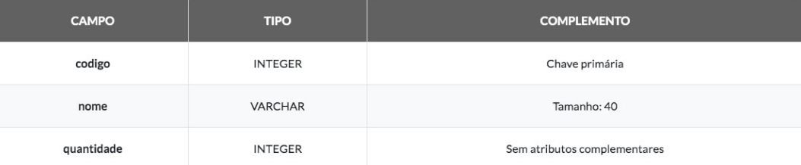
 
4. Definindo o nome da tabela e adicionando os campos, teremos a configuração que pode ser observada a seguir, com o processo sendo finalizado através do clique em **OK**. Cada campo deve ser adicionado individualmente, com o clique em **Add Column**. 
5. A tabela criada será acessada através de um novo nó, na árvore de navegação, abaixo de **Tables**, com o nome **Produto**. Utilizando o clique com o botão direito sobre o novo nó e escolhendo a opção **View Data**, teremos a abertura de uma área para execução de **SQL** e visualização de dados no editor de código, sendo possível acrescentar registros de forma visual com o uso de **ALT+I**, ou clique sobre o ícone referente. Nesta tela de inserção, podemos preencher os valores do novo registro, e se quisermos mais de um registro, basta clicar em **Add Row**. Ao final do preenchimento dos dados, clicamos em **OK** e o NetBeans executará os comandos **INSERT** necessários. 
 
 
## Acesso ao banco de dados no java 
 
Com relação à codificação Java, os componentes do JDBC estão presentes no pacote java.sql, e o processo para utilização segue quatro passos simples: 
1. Instanciar a classe do driver de conexão 
2. Obter uma conexão (Connection) a partir da Connection String, usuário e senha. 
3. Instanciar um executor de SQL (Statement) 
4. Executar os comandos DML (linguagem de manipulação de dados) 
 
Para o comando de seleção existe mais um detalhe, que seria a recepção da consulta em um ResultSet, o que pode ser observado no trecho de código seguinte, no qual, com base na tabela criada anteriormente, efetuamos uma consulta aos dados inseridos. 
 
```java 
ArrayList<String> listaDescricoes = new ArrayList<>(); 
 
// passo 1 
Class.forName("org.apache.derby.jdbc.ClientDriver"); 
 
// passo 2 
Connection c1 = DriverManager.getConnection( 
                "jdbc:derby://localhost:1527/loja", 
                "loja", "loja"); 
// passo 3 
Statement st = c1.createStatement(); 
 
// passo 4 e recepção no ResultSet 
ResultSet r1 = st.executeQuery("SELECT * FROM PRODUTO"); 
 
while(r1.next()) 
   listaDescricoes.add("Produto " + r1.getInt("codigo")+ 
                       ": " + r1.getString("nome")); 
r1.close(); 
st.close(); 
c1.close(); 
``` 
 
No início do código, temos o driver Derby sendo instanciado a partir a partir de uma chamada para o método forName. Com o driver instanciado, ele fica disponível para o aplicativo, permitindo abrir as conexões com o banco de dados através de JDBC. 
 
Em seguida, é instanciada a conexão c1, por meio da chamada ao método getConnection, da classe DriverManager, e os parâmetros fornecidos são a Connection String, o usuário e a senha. Quanto à Connection String, ela pode variar muito, sendo iniciada pelo driver utilizado, seguido dos parâmetros específicos para aquele driver, que, no caso do Derby, são o endereço de rede, a porta e o nome do banco de dados. 
 
A partir da conexão c1, é gerado um executor de SQL de nome st, com a chamada para o método createStatement. Com o executor instanciado, realizamos uma consulta ao banco, através da invocação do método executeQuery, recebendo um ResultSet. 
 
 
As consultas ao banco são feitas com a utilização de executeQuery, mas os comandos para manipulação de dados são executados através de executeUpdate. 
 
Após a recepção da consulta no objeto de nome r1, podemos nos movimentar pelos registros, com o uso de next, e acessar cada campo pelo nome para a obtenção do valor, sempre lembrando de utilizar o método correto para o tipo do campo, como getString para texto e getInt para valores numéricos inteiros. 
 
Ao efetuar a consulta, o ResultSet fica posicionado antes do primeiro registro, na posição BOF, e com o uso do comando next podemos mover para as posições seguintes, até atingir o final da consulta, na posição EOF. A cada registro visitado, adicionamos a descrição do produto ao ArrayList. 
 
Na parte final, devemos fechar os componentes JDBC, na ordem inversa daquela em que foram criados, já que existe dependência sucessiva entre eles. 
 
Caso a biblioteca JDBC, para o tipo de banco de dados escolhido, não esteja presente no servidor, devemos adicioná-la ao projeto, ou ocorrerá erro durante a execução. 
 
## Data Access Object (DAO) 
 
Agora que sabemos efetuar as operações sobre o banco de dados, seria interessante organizar a forma de programar, pois é fácil imaginar a dificuldade para dar manutenção em um sistema com dezenas de milhares de linhas de código Java, contendo diversos comandos SQL espalhados ao longo das linhas. 
 
A linguagem Java é orientada a objetos, e torna-se mais fácil representar uma tabela através de uma classe, onde suas instâncias corresponderão aos registros existentes. 
 
```java 
public class Produto { 
   public int codigo; 
   public String nome; 
   public int quantidade; 
    
   public Produto(){ } 
 
   public Produto(int codigo, String nome, int quantidade) { 
      this.codigo = codigo; 
      this.nome = nome; 
      this.quantidade = quantidade; 
   } 
} 
``` 
 
Com base na observação de que o SQL espalhado ao longo do código traz grandes dificuldades, foi desenvolvido o padrão DAO, com o objetivo de concentrar as instruções SQL em um único tipo de classe, o que permite o agrupamento e a reutilização dos diversos comandos relacionados ao banco de dados. Normalmente, temos uma classe DAO para cada classe de entidade relevante para o sistema. 
 
```java 
public class ProdutoDAO { 
   private Connection getConnection() throws Exception{ 
      Class.forName("org.apache.derby.jdbc.ClientDriver"); 
      return DriverManager.getConnection( 
         "jdbc:derby://localhost:1527/loja", 
         "loja", "loja");       
   } 
   private Statement getStatement() throws Exception{ 
      return getConnection().createStatement(); 
   }    
   private void closeStatement(Statement st) throws Exception{ 
      st.getConnection().close(); 
   } 
    
   public List<Produto> obterTodos(){ 
      ArrayList<Produto> lista = new ArrayList<>(); 
      try { 
         ResultSet r1 = getStatement().executeQuery( 
                        "SELECT * FROM PRODUTO"); 
         while(r1.next()) 
            lista.add(new Produto(r1.getInt("codigo"), 
               r1.getString("nome"),r1.getInt("quantidade"))); 
         closeStatement(r1.getStatement()); 
      }catch(Exception e){ 
      }    
      return lista;        
   } 
} 
``` 
 
Inicialmente, criamos os métodos getStatement e closeStatement com o objetivo de gerar executores de SQL e eliminá-los, efetuando também as conexões e desconexões nos momentos necessários. Outro método utilitário é o getConnection, utilizado apenas para encapsular o processo de conexão com o banco. 
 
O método obterTodos irá retornar todos os registros da tabela Produto no formato de um ArrayList de entidades do tipo Produto. Primeiramente, é executado o SQL necessário para a consulta e, para cada registro obtido no cursor, é gerado um novo objeto da classe Produto e adicionado à lista de retorno. 
 
Podemos alterar o código de ListaCores.jsp para exibir o nome de cada produto. 
 
```html 
<%@page import="model.Produto"%> 
<%@page import="model.ProdutoDAO"%> 
<%@page contentType="text/html" pageEncoding="UTF-8"%> 
<!DOCTYPE html> 
<html> <body> <ul> 
<% 
   ProdutoDAO dao = new ProdutoDAO(); 
   for (Produto p : dao.obterTodos()) { 
      out.println("<li>" + p.nome + "</li>"); 
   } 
%> 
</ul> </body> </html> 
``` 
 
A princípio foi necessário importar as classes Produto e ProdutoDAO, com a utilização da diretiva page, viabilizando o uso delas no Scriptlet. A partir daí, bastou instanciar o DAO, efetuar a chamada para obterTodos e percorrer a coleção, acrescentando os itens de lista para cada produto recebido. 
 
Agora que testamos o acesso ao banco de dados no ambiente Web, vamos acrescentar os métodos para efetuar a inclusão e a exclusão de produtos na classe ProdutoDAO. 
 
```java 
public void excluir(int codigo){ 
   try { 
      Statement st =  getStatement(); 
      st.executeUpdate( 
         "DELETE FROM PRODUTO WHERE CODIGO  = "+ 
         codigo); 
      closeStatement(st); 
   }catch(Exception e){ 
   } 
} 
``` 
 
Podemos observar que a exclusão utiliza um Statement, apenas com a observação de que em vez de utilizar executeQuery, como nas seleções de dados, adotamos o método executeUpdate, por se tratar de um comando DML. Com base no código fornecido, um comando SQL é montado, visando à exclusão do produto identificado pelo código. 
 
```java 
public void incluir(Produto p){ 
   try { 
      PreparedStatement ps = getConnection().prepareStatement( 
         "INSERT INTO PRODUTO VALUES(?,?,?)"); 
      ps.setInt   (1, p.codigo); 
      ps.setString(2, p.nome); 
      ps.setInt   (3, p.quantidade); 
      ps.executeUpdate(); 
      closeStatement(ps); 
   }catch(Exception e){ 
   } 
} 
``` 
 
Na inclusão foi utilizado um elemento do tipo PreparedStatement, que permite a construção de comandos SQL parametrizados. O uso de parâmetros facilita a escrita do comando SQL, sem a preocupação com o uso de apóstrofe ou outro delimitador, sendo particularmente útil quando tivermos de trabalhar com datas. 
 
Para definir os parâmetros utilizamos pontos de interrogação, que assumem valores posicionais, a partir de um, o que é um pouco diferente da indexação dos vetores, que começa em zero. 
 
Os parâmetros são preenchidos com a chamada ao método correto de acordo com seus tipos, como setInt para inteiro e setString para texto. Após o preenchimento, devemos executar o comando SQL, com a chamada para executeUpdate no caso das instruções INSERT, UPDATE e DELETE, ou executeQuery para a instrução SELECT. 
 
Com a codificação completa para as classes Produto e ProdutoDAO, estamos preparados para implementar nossa interface cadastral com o uso de Servlets e JSPs. 
 
## Aplicativos web com uso de DAO 
 
A construção de nosso aplicativo irá se concentrar na melhor utilização de Servlets e JSPs, ou seja, teremos o Servlet como um conversor de formatos e redirecionador de fluxo, enquanto o JSP será responsável pela construção da interface com o usuário. 
 
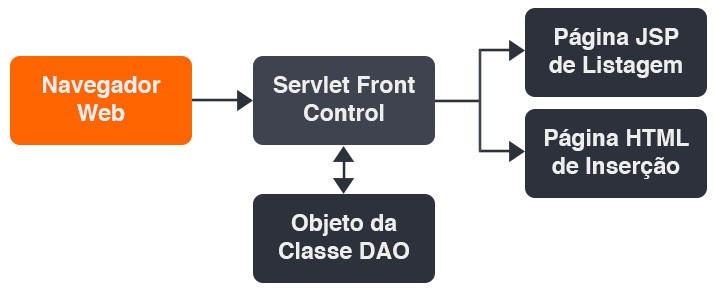 

Nosso sistema seguirá o padrão de desenvolvimento Front Controller, em que todas as requisições serão recebidas no Servlet, onde ocorrerão as conversões e os processamentos necessários, com o redirecionamento para a visualização correta ao final. Tendo como base o comportamento descrito, fica clara a necessidade de um parâmetro que permita diferenciar qual fluxo deverá ser executado, ao qual daremos o nome de “acao”. 
 
Vamos começar pela parte mais simples, acrescentando um arquivo do tipo HTML File, na categoria HTML5/JavaScript, com o nome ProdutoDados. 
 
Nossa página HTML será constituída apenas de um formulário, com campos de entrada para os atributos de Produto, além de um campo escondido (hidden) para definir o valor de acao como "inserirX". Após o usuário preencher os dados e clicar no botão incluir, ocorrerá o envio pelo método post para o Servlet. 
 
```html 
<html> 
  <body> 
    <form action="ServletProduto" method="post"> 
      Codigo: <input type="text" name="codigo"/><br/> 
      Nome: <input type="text" name="nome"/><br/> 
      Quantidade: <input type="text" name="quantidade"/><br/> 
      <input type="hidden" name="acao" value="inserirX"/> 
      <input type="submit" value="incluir"/> 
    </form> 
  </body> 
</html> 
``` 
 
Em seguida, vamos adicionar um arquivo do tipo JSP, na categoria Web, com o nome ProdutoLista. A nova página será responsável pela exibição dos dados emitidos a partir do Servlet, além de apresentar links para inclusão e exclusão de produtos. 
 
```html 
<%@page import="model.Produto"%> 
<%@page import="java.util.ArrayList"%> 
<%@page contentType="text/html" pageEncoding="UTF-8"%> 
<!DOCTYPE html> 
<html> 
  <body> 
    <a href="ServletProduto?acao=incluir">Incluir Produto</a> 
    <table border="1" width="80%"> 
      <tr> 
      <td>codigo</td> <td>nome</td> 
      <td>quantidade</td><td>Opções</td> 
      </tr> 
<% 
  ArrayList<Produto> lista = (ArrayList<Produto>) 
                     request.getAttribute("listaProduto"); 
  for(Produto p: lista) { 
%> 
      <tr> 
      <td><%=p.codigo%></td> <td><%=p.nome%></td> 
      <td><%=p.quantidade%></td> 
      <td> 
<a href="ServletProduto?acao=excluirX&codigo=<%=p.codigo%>"> 
excluir</a> 
      </td> 
      </tr> 
<%  } %>            
    </table> 
  </body> 
</html> 
``` 
 
Na parte inicial da página, temos um link para a inclusão de produto, com a chamada para o Servlet, tendo o parâmetro acao com valor "incluir". No nível do Servlet, o acesso corresponderá a um redirecionamento direto para a página HTML de cadastro. 
 
Em seguida, temos a criação de uma tabela para a exibição dos dados de cada produto, a partir de uma lista fornecida em um atributo da requisição. A tabela apresenta uma linha inicial com os nomes dos campos, e as demais linhas, com os valores, são criadas dinamicamente através do código do Scriptlet. 
 
Como os atributos podem ser de qualquer tipo de objeto, é necessário efetuar o type cast ao recebê-los, via método getAttribute. 
 
Após resgatar a lista, executamos um loop do tipo for each para visitar todos os produtos da lista, e para cada um é executado o bloco de repetição. Note que o bloco, delimitado com o uso de chaves, contém elementos HTML e Scriptlets, uma técnica muito interessante, que nos permite aproveitar a melhor forma de escrita a cada ponto. 
 
Dentro do bloco temos a construção de uma linha da tabela HTML, onde as colunas são preenchidas com o valor dos campos por meio de etiquetas de substituição, demarcadas com o uso dos símbolos de percentual e igual. Em termos práticos, a utilização de uma etiqueta de substituição equivale a um Scriptlet com o comando out.print. 
 
```html 
<%-- Formas Equivalentes --%> 
<%= p.codigo %> 
<% out.print(p.codigo); %> 
``` 
 
Podemos observar como a combinação entre HTML e etiquetas de substituição é muito fluida, principalmente na montagem do link, em que cada linha terá um código diferente, fazendo referência ao produto corrente. O link de exclusão utiliza o parâmetro acao com valor "excluirX", enquanto o parâmetro codigo recebe o valor dinamicamente. 
 
Agora chegou o momento de criar o Servlet, orquestrando a funcionalidade de nossas páginas e executando os processos necessários para cada chamada. Vamos adicionar um Servlet com o nome ServletProduto. 
 
```java 
@WebServlet(name = "ServletProduto", 
            urlPatterns = {"/ServletProduto"}) 
public class ServletProduto extends HttpServlet { 
  protected void processRequest(HttpServletRequest request, 
            HttpServletResponse response) 
            throws ServletException, IOException { 
    String acao = request.getParameter("acao"); 
    if(acao==null) acao="listar"; 
    String paginaDestino = (acao.equals("incluir"))? 
            "ProdutoDados.html" : "ProdutoLista.jsp"; 
    ProdutoDAO dao = new ProdutoDAO(); 
    switch(acao){ 
    case "incluirX": 
      int codigo = new Integer(request.getParameter("codigo")); 
      String nome = request.getParameter("nome"); 
      int quantidade = new Integer( 
                           request.getParameter("quantidade")); 
      dao.incluir(new Produto(codigo,nome,quantidade)); 
      break; 
    case "excluirX": 
      dao.excluir(new Integer(request.getParameter("codigo"))); 
      break; 
    } 
    if(!acao.equals("incluir")){ 
      request.setAttribute("listaProduto", dao.obterTodos()); 
    } 
    request.getRequestDispatcher(paginaDestino). 
            forward(request, response); 
  } 
 
  // O restante do código foi omitido 
 
} 
``` 
 
O primeiro passo, na execução do Servlet, é a captura do parâmetro acao, e se ele não é fornecido, assumimos o valor padrão "listar". Com base nesse parâmetro, teremos a escolha da página de destino, que será ProdutoDados.html para o início do processo de inclusão e ProdutoLista.jsp para as demais ações. 
 
Em seguida, é instanciado um objeto do tipo ProdutoDAO, com o nome dao, para dar suporte aos processos que devem ser iniciados nas ações. 
 
Para acao com o valor "incluirX", capturamos os valores fornecidos via HTTP, efetuando a conversão para inteiro, quando necessário, e invocamos o método incluir, do objeto dao, com a passagem de uma instância de Produto, inicializada com os valores obtidos. Para o valor "excluirX", resgatamos o valor do parâmetro codigo, convertendo para inteiro, e efetuamos uma chamada para o método excluir. 
 
A finalização do processo de inclusão, após o preenchimento dos dados e envio pelo usuário, bem como a exclusão de um registro e a simples listagem direcionam para a página ProdutoLista.jsp, onde deve ser resgatado o atributo listaProduto. Com base na necessidade, temos a chamada para setAttribute, no nível do Servlet, para qualquer ação que seja diferente do início da inclusão. 
 
Ao final, temos o redirecionamento para a página correta, com o método forward, e a construção da resposta ficará a cargo dela, completando o ciclo de resposta. 
 
Agora só precisamos efetuar a chamada correta para o Servlet: http://localhost:8080/WebTeste001/ServletProduto 
 
A tela de listagem será apresentada, fornecendo também os links necessários para efetuar a inclusão e exclusão de produtos. 
 
# Aula 4 – Tecnologias JPA e JEE

# JPA 
 
## Mapeamento objeto-relacional 
 
Nos bancos de dados **relacionais**, temos uma estrutura baseada em tabelas, que comportam valores em registros, e que se relacionam a partir de campos identificadores ou chaves primárias. A manutenção dos relacionamentos, por sua vez, é implementada através de chaves estrangeiras e estruturas de índices. 
 
Olhando para o ambiente de programação orientada a **objetos**, temos classes, cujas instâncias, ou objetos, comportam valores, e que podem se relacionar com outras classes através de coleções ou atributos do tipo da classe relacionada. Não existe uma estrutura de indexação, mas uma relação bilateral, com o preenchimento de propriedades dos objetos envolvidos. 
 
Temos duas filosofias distintas, com peculiaridades inerentes a cada ambiente de execução, e como o ambiente de programação deve lidar com toda a lógica, ocorre um esforço natural para minimizar o uso de tabelas e registros, com a substituição por classes e objetos. A abordagem fica clara quando utilizamos o padrão de desenvolvimento DAO (Data Access Object), onde temos uma classe de entidade, e as consultas e operações sobre o banco de dados são concentradas em uma classe gestora, com a conversão para objetos e coleções, a partir da qual não utilizamos mais o enfoque relacional no sistema. 
 
O uso de DAO deu origem à técnica de mapeamento **objeto-relacional**, ou **ORM**, na qual estamos nos referindo à forma como uma entidade (objeto) é preenchida com os dados que vieram de um registro (relacional), um processo que inicialmente era efetuado de maneira programática, mas que foi modificado com o advento de **frameworks de persistência**, normalmente baseados no uso de XML ou **anotações**. 
 
 

Com base nas configurações, indicando qual atributo da classe é refletido em determinado campo do registro, além da especificação de chaves e relacionamentos, o framework de persistência cria todos os comandos SQL necessários, de modo transparente, e transmite os comandos gerados para o banco de dados através de uma biblioteca de **middleware**. 
 
No ambiente Java, os primeiros exemplos de tecnologias para ORM que obtiveram sucesso foram os **Entity Beans** e o **Hibernate**. As duas tecnologias adotaram o mapeamento baseado em XML, mas utilizaram padrões funcionais bastante distintos. 
 
Os **Entity Beans** fazem parte do J2EE, e trabalham de acordo com o padrão **Active Record**, no qual cada leitura de propriedade equivale a um comando de seleção no banco de dados, a alocação de um objeto inicia um comando de inserção, e quando alteramos o valor da propriedade, temos uma alteração no registro. Podemos chegar facilmente à conclusão de que o padrão é ineficiente, pois temos uma grande demanda de comandos SQL desnecessários, que poderiam ser executados em blocos. 
 
```java 
public abstract class ProdutoEntityBean implements EntityBean { 
  public abstract int getCodigo(); 
  public abstract void setCodigo(int codigo); 
  public abstract String getNome(); 
  public abstract void setNome(String nome); 
  public abstract int getQuantidade(); 
  public abstract void setQuantidade(int quantidade); 
  // O restante do código foi omitido 
} 
``` 
 
No fragmento de código, temos o início da definição de um Entity Bean, onde o objeto concreto é gerado pelo servidor de aplicativos, e as classes de entidade apresentam apenas as **propriedades**, definidas a partir de getters e setters **abstratos**, além de alguns métodos de gerência do ciclo de vida, aqui omitidos. O mapeamento do Entity Bean para a tabela deve ser feito com base na sintaxe XML, como no trecho apresentado a seguir, para o servidor **JBoss**. 
 
```java 
<enterprise-beans> 
<entity> 
<ejb-name>ProdutoEntityBean</ejb-name> 
<table-name>PRODUTO</table-name> 
<cmp-field> 
<field-name>codigo</field-name> 
<column-name>COD_PRODUTO</column-name> 
</cmp-field> 
<cmp-field> 
<field-name>nome</field-name> 
<column-name>NOME</column-name> 
</cmp-field> 
<cmp-field> 
<field-name>quantidade</field-name> 
<column-name>QUANTIDADE</column-name> 
</cmp-field> 
</entity> 
</enterprise-beans> 
``` 
 
Já no framework **Hibernate**, temos o padrão **DAO**, de forma implícita, com os comandos sendo gerados a partir dos métodos de um gestor de persistência, com base no conjunto de elementos de mapeamento, e os dados presentes nas entidades. 
 
```java 
public class Produto { 
private int codigo; 
private String nome; 
private int quantidade; 
 
public Produto(){} 
// Os getters e setters das propriedades foram omitidos 
} 
``` 
 
As entidades, para o **Hibernate**, são apenas classes comuns, sem métodos de negócios, com um conjunto de propriedades e um construtor padrão. Todo o mapeamento deve ser efetuado através da sintaxe XML, como no trecho apresentado a seguir. 
 
```java 
<hibernate-mapping schema="loja"> 
<class name="model.Produto" table="PRODUTO"> 
<id name="codigo" type="int"> 
<column name="COD_PRODUTO" /> 
</id> 
<property name="nome" type="string" column="NOME" /> 
<property name="quantidade" type="int" column="QUANTIDADE" /> 
</class> 
</hibernate-mapping> 
``` 
 
Através do XML, temos um modelo documental para o mapeamento, retirando do código as referências aos elementos do banco de dados, o que garante maior flexibilidade e menor acoplamento, além de possibilitar a troca da base de dados com a simples alteração dos arquivos XML. 
 
## Java persistence API (JPA) 
 
Embora o uso de XML tenha se tornado um padrão muito aceito na configuração do mapeamento objeto-relacional, além de exigir a escrita de uma grande quantidade de texto, também traz a desvantagem de verificar eventuais erros apenas no momento da implantação. Uma nova abordagem passou a trabalhar com anotações de código, no lugar do XML, deixando a escrita mais concisa, e permitindo que o compilador efetue a análise sintática, com a detecção de muitos erros ainda na fase de codificação. 
 
**Anotações** são metadados anexados ao código, utilizados ao nível da classe, atributos, métodos ou até parâmetros, e que permitem a leitura por ferramentas externas, com o objetivo de configurar funcionalidades adicionais. 
 
Um dos maiores avanços do Java foi a criação do JPA, pois **permitiu unificar os frameworks de persistência em uma arquitetura padrão, com apenas um arquivo de configuração, o persistence.xml**. Não é apenas uma biblioteca, mas uma API que define a interface comum, configurável através de **anotações**, que deve ser seguida pelos frameworks de persistência da plataforma Java, como Hibernate, Eclipse Link e Oracle Toplink. 
 
Trabalhando no mesmo estilo do Hibernate, através do JPA temos um padrão DAO implícito, trazendo grande eficiência nas tarefas de persistência, o que ainda é otimizado com base em recursos de **cache** de entidades em **memória**. Não é por menos que, na plataforma JEE atual, temos a substituição dos Entity Beans, presentes no J2EE, pelo JPA. 
 
Da mesma forma que no Hibernate clássico, para definir uma entidade JPA devemos criar um **POJO (Plain Old Java Object)**, ou seja, **uma classe sem métodos de negócios, mas com atributos definidos de forma privada e métodos de acesso públicos**, além de um construtor padrão e alguns métodos utilitários, como **hash**. A entidade definida deve receber **anotações**, que serão responsáveis pelo **mapeamento** efetuado entre a classe e a tabela, ou seja, o **mapeamento objeto-relacional**. 
 
```java 
@Entity 
@Table(name = "PRODUTO") 
@NamedQueries({ 
@NamedQuery(name = "Produto.findAll", 
query = "SELECT p FROM Produto p")}) 
public class Produto implements Serializable { 
private static final long serialVersionUID = 1L; 
@Id 
@Basic(optional = false) 
@Column(name = "COD_PRODUTO") 
private Integer codigo; 
@Column(name = "QUANTIDADE") 
private Integer quantidade; 
 
public Produto() { 
} 
public Produto(Integer codigo) { 
this.codigo = codigo; 
} 
// Os getters e setters das propriedades foram omitidos 
@Override 
public int hashCode() { 
int hash = 0; 
hash += (codigo != null ? codigo.hashCode() : 0); 
return hash; 
} 
@Override 
public boolean equals(Object object) { 
if (object==null||!(object instanceof Produto)) { 
return false; 
} 
Produto other = (Produto) object; 
return this.codigo!=null && 
this.codigo.equals(other.codigo); 
} 
@Override 
public String toString() { 
return "model.Produto[ codigo=" + codigo + " ]"; 
} 
} 
``` 
 
A anotação **Entity** define a classe Produto como uma entidade para o JPA, enquanto **Table** especifica a tabela para a qual será mapeada no banco de dados, com base no parâmetro name. Temos ainda uma anotação **NamedQueries**, agrupando um conjunto de anotações **NamedQuery**, as quais são utilizadas para criar consultas através de uma sintaxe própria do JPA, denominada **JPQL (Java Persistence Query Language)**. 
 
Após configurar a tabela que será representada pela entidade, precisamos completar as informações de mapeamento ao nível dos **atributos**, com o uso da anotação **Column** e o nome do campo definido no parâmetro **name**. Com o uso de **Id** definimos qual atributo representará a chave primária, e tornamos um atributo obrigatório através da anotação **Basic**, tendo o parâmetro **optional** configurado com valor false. 
 
As principais anotações do JPA podem ser observadas no quadro seguinte. 

| Anotação   | Utilização 
| ---        | --- 
| Entity     | Marca a classe como uma entidade para o JPA. 
| Table      | Especifica a tabela que será utilizada no mapeamento. 
| Column     | Mapeia o atributo para o campo da tabela. 
| Id         | Especifica o atributo mapeado para a chave primária. 
| Basic      | Define a obrigatoriedade do campo ou o modo utilizado para a carga de dados. 
| OneToMany  | Mapeia a relação **1XN** do lado da entidade principal através de uma **coleção**. 
| ManyToOne  | Mapeia a relação **1XN** do lado da entidade dependente, com base em uma classe de **entidade**. 
| OneToOne   | Mapeia o relacionamento **1X1** com atributos de **entidade** em ambos os lados. 
| ManyToMany | Mapeia o relacionamento **NXN** com atributos de **coleção** em ambos os lados. 
| OrderBy    | Define a regra que será adotada para ordenar a coleção. 
| JoinColumn | Especifica a regra de relacionamento da chave estrangeira ao nível das tabelas. 
|            |  

As entidades JPA devem conter dois **construtores**, sendo um vazio e outro baseado na chave primária, como podemos verificar no código de Produto, além dos métodos **equals e hashCode**. 
 
Para a entidade Produto, os dois métodos utilitários são baseados no atributo **codigo**, o que é natural, já que ele recebe o valor da chave primária, tendo a capacidade de **individualizar** a instância da entidade em meio a uma coleção. 
 
Além dos elementos descritos até aqui, utilizados na definição da estrutura de nossa entidade, precisamos do atributo **serialVersionUID**, referente à versão da classe, algo que será relevante para os processos de migração da base de dados. Temos ainda uma implementação de **toString**, que não é obrigatória, mas nos dá controle sobre a representação da entidade como texto em alguns componentes visuais, ou na impressão para a linha de comando. 
 
Além das anotações nas entidades, precisamos de um arquivo de configuração, com o nome **persistence.xml**, onde serão definidos os aspectos gerais da conexão com o banco de dados. O arquivo deve ser criado na pasta **META-INF**, e os parâmetros podem incluir elementos como a classe de conexão **JDBC (Java Database Connectivity)** ou o pool de conexões do servidor, estando sempre presente a especificação do framework de persistência que será utilizado. 
 
```xml 
<?xml version="1.0" encoding="UTF-8"?> 
<persistence version="2.1" 
xmlns="http://xmlns.jcp.org/xml/ns/persistence" 
xmlns:xsi="http://www.w3.org/2001/XMLSchema-instance" 
xsi:schemaLocation="http://xmlns.jcp.org/xml/ns/persistence 
http://xmlns.jcp.org/xml/ns/persistence/persistence_2_1.xsd"> 
<persistence-unit name="ExemploSimplesJPAPU" 
transaction-type="RESOURCE_LOCAL"> 
<provider> 
org.eclipse.persistence.jpa.PersistenceProvider; 
</provider> 
<class>model.Produto</class> 
<properties> 
<property name="javax.persistence.jdbc.url" 
value="jdbc:derby://localhost:1527/bancoJPA"/> 
<property name="javax.persistence.jdbc.driver" 
value="org.apache.derby.jdbc.ClientDriver"/> 
<property name="javax.persistence.jdbc.user" 
value="bancoJPA"/> 
<property name="javax.persistence.jdbc.password" 
value="bancoJPA"/> 
</properties> 
</persistence-unit> 
</persistence> 
``` 
 
A primeira informação relevante é o nome da **unidade de persistência (ExemploSimplesJPAPU)**, com o tipo de **transação** que será utilizado. **Transações** são necessárias para garantir o nível de isolamento adequado entre tarefas, como no caso de múltiplos usuários acessando o mesmo banco de dados. 
 
O controle transacional pode ocorrer a partir de um gestor próprio, para uso no ambiente **JSE (Java Standard Edition)** ou pelo **JEE (Java Enterprise Edition)** no modelo **não gerenciado**, mas também permite o modo gerenciado, através da integração com **JTA (Java Transaction API)**. 
 
**Tipos de transação**:  
* RESOURCE_LOCAL: Utiliza o gestor de transações do JPA, para execução no JSE ou no modelo não gerenciado do JEE. 
* JTA: Ativa a integração com JTA, para utilizar o gerenciamento de transações pelo JEE. 
 
Em seguida, é definido o provedor de persistência no elemento **provider**, em nosso caso a classe **PersistenceProvider** do **Eclipse Link**. As classes de entidade englobadas devem ser especificadas nos elementos class, para o modelo de acesso local, e as propriedades da conexão são definidas no grupo **properties**, o que inclui o driver **JDBC** utilizado, a URL de conexão, bem como o usuário e a senha do banco de dados. 
 
## Consulta e manipulação de dados 
 
Com as entidades mapeadas e a conexão configurada, podemos efetuar as consultas e manipulações sobre os dados através de um objeto do tipo **EntityManager**. O gestor de entidades, ou EntityManager, concentra todos os métodos necessários para invocar os comandos **INSERT, UPDATE, DELETE e SELECT**, no banco de dados, montados pelo JPA a partir das anotações da entidade, de uma forma totalmente transparente. 
 
```java 
public class Principal { 
public static void main(String[] args) { 
EntityManagerFactory emf = 
Persistence.createEntityManagerFactory( 
"ExemploSimplesJPAPU"); 
EntityManager em = emf.createEntityManager(); 
Query query = em.createNamedQuery("Produto.findAll"); 
List<Produto> lista = query.getResultList(); 
lista.forEach((e) -> { 
System.out.println(e.getNome()); 
}); 
em.close(); 
} 
} 
``` 
 
**Passo 1**: O primeiro passo em nosso código é a definição do EntityManagerFactory, utilizando o nome da unidade de persistência (ExemploSimplesJPAPU). Em seguida, obtemos uma instância de EntityManager a partir da fábrica de gestores, através de uma chamada para o método **createEntityManager**. 
 
**Passo 2**: Com o gestor instanciado, obtemos um objeto do tipo Query, com a chamada para **createNamedQuery**, tendo como base uma anotação do tipo NamedQuery com name valendo Produto.findAll, a qual está anexada à classe Produto. As consultas nomeadas devem apresentar nomes diferentes, pois a busca é feita em todas as entidades, o que poderia gerar dualidades durante a execução. 
 
**Passo 3**: O resultado da consulta ao banco de dados é obtido com a chamada para o método **getResultList**, na forma de uma coleção de produtos do tipo List. Em termos práticos, a instrução JPQL é transformada em um comando SQL, o qual é transmitido para o banco de dados via JDBC, e o resultado da consulta é convertido em uma coleção de objetos, a partir do mapeamento efetuado com as anotações do JPA. Ao final, encerramos toda a comunicação com o banco de dados, utilizando o método **close** de nosso EntityManager. Embora o próprio coletor de lixo do Java possa causar a interrupção da conexão, a chamada para o método close é mais eficiente. 
 
Após receber a coleção de produtos, nós podemos percorrê-la através de um loop no estilo foreach, ou operador funcional equivalente, com a impressão do nome para cada produto encontrado. 
Note que o JPA não elimina o uso de JDBC, pois o que temos é a geração dos comandos SQL, de forma automatizada, a partir das informações oferecidas pelas anotações. 
 
Agora podemos verificar como é feita a inclusão de um produto em nossa base de dados. 
 
```java 
public static void incluir(Produto p){ 
EntityManagerFactory emf = 
Persistence.createEntityManagerFactory( 
"ExemploSimplesJPAPU"); 
EntityManager em = emf.createEntityManager(); 
try { 
em.getTransaction().begin(); 
em.persist(p); 
em.getTransaction().commit(); 
}catch(Exception e){ 
em.getTransaction().rollback(); 
}finally{ 
em.close(); 
} 
} 
``` 
 
Devido ao fato de uma inclusão poder gerar erros durante a execução, o ideal é que seja efetuada dentro de uma **transação**. Na verdade, qualquer manipulação de dados efetuada a partir do JPA irá exigir uma transação, podendo ser local ou via JTA. 
 
Após obtermos uma instância de EntityManager na variável **em**, é definido um bloco de código protegido, onde a transação é iniciada com **begin**, seguida da inclusão do produto na base de dados através do método **persist**, e temos a confirmação da transação com o uso de **commit**. 
 
Caso ocorra um erro, todas as alterações efetuadas são desfeitas com o uso de **rollback**, e ainda temos um trecho **finally**, onde fechamos a comunicação com o uso de close, independente da ocorrência de erros. 
 
Para efetuar a alteração dos dados de um registro, temos um processo muito similar, trocando apenas o método **persist** por **merge**. 
 
```java 
public static void alterar(Produto p){ 
EntityManagerFactory emf = 
Persistence.createEntityManagerFactory( 
"ExemploSimplesJPAPU"); 
EntityManager em = emf.createEntityManager(); 
try { 
em.getTransaction().begin(); 
em.merge(p); 
em.getTransaction().commit(); 
}catch(Exception e){ 
em.getTransaction().rollback(); 
}finally{ 
em.close(); 
} 
} 
``` 
 
Na exclusão de um registro, inicialmente deve ser feita a busca, com base na classe da entidade e o valor da chave primária, através do método **find**. Será retornada uma entidade, como resultado da consulta, e nós a utilizaremos como parâmetro para a chamada ao método **remove**, efetuando a exclusão no banco de dados. 
 
```java 
public static void excluir(Integer codigo){ 
EntityManagerFactory emf = 
Persistence.createEntityManagerFactory( 
"ExemploSimplesJPAPU"); 
EntityManager em = emf.createEntityManager(); 
try { 
em.getTransaction().begin(); 
em.remove(em.find(Produto.class, codigo)); 
em.getTransaction().commit(); 
}catch(Exception e){ 
em.getTransaction().rollback(); 
}finally{ 
em.close(); 
} 
} 
``` 
 
Observando os trechos de código apresentados, podemos concluir facilmente que os métodos **find, persist, merge e remove** correspondem, respectivamente, à execução dos comandos **SELECT, INSERT, UPDATE e DELETE**, ao nível do banco de dados. 
 
## Execução do aplicativo 
 
Quando executamos um aplicativo com elementos JPA no servidor, temos todas as bibliotecas necessárias disponíveis, mas a execução local irá necessitar da inclusão de algumas bibliotecas ao projeto. 
 
Trabalharemos com o banco de dados **Derby**, também chamado de **Java DB**, exigindo a inclusão da biblioteca JDBC correta. É interessante observar que o Derby é um banco de dados implementado em Java, que faz parte da distribuição padrão da plataforma, e que pode ser executado de forma local ou no servidor. 
 
Para adicionar a biblioteca JDBC do Derby ao projeto, vamos clicar com o botão direito sobre a divisão Libraries, e escolher a opção Add Library. Na janela que se abrirá, selecionaremos apenas a opção Java DB Driver e clicaremos no botão Add Library. 
 
Precisamos acrescentar o framework JPA escolhido, no caso, o **Eclipse Link**. Após efetuar o download da versão mais recente do Eclipse Link, no formato zip, e extrair para algum diretório de fácil acesso, crie uma biblioteca através da opção de menu Tools.Libraries, seguido do clique sobre o botão New Library. Daremos a ela o nome EclipseLink2.7, e adicionaremos o arquivo eclipselink.jar, presente no diretório jlib, além de todos os arquivos no formato jar do subdiretório jpa. 
 
Após a definição da nova biblioteca, vamos adicionar ao projeto, da mesma forma que fizemos para o driver JDBC, clicando com o botão direito sobre a divisão Libraries, e escolhendo a opção Add Library. Ao final, teremos a configuração de bibliotecas para o projeto. 
 
Agora só precisamos de um banco de dados Derby, que será criado de forma simples, através da aba Services do NetBeans, na divisão Databases. 
 
Para criarmos um banco de dados, precisamos clicar com o botão direito sobre o driver Java DB, selecionável com a abertura da árvore de Databases, seguido da escolha da opção Create Database, no menu de contexto. Na janela que será aberta, efetuaremos o preenchimento do nome de nosso novo banco de dados com o valor "bancoJPA", bem como usuário e senha, onde podemos também utilizar o valor "bancoJPA" para ambos. 
 
Ao clicar no botão de confirmação, o banco de dados será criado e ficará disponível para conexão, através do driver JDBC. A conexão é identificada por sua Connection String, tendo como base o endereço de rede (localhost), a porta padrão (1527) e a instância (bancoJPA). 
 
A conexão é aberta com o duplo-clique sobre o identificador, ou o clique com o botão direito e escolha da opção Connect. Com o banco de dados aberto, vamos executar os comandos SQL necessários para a criação e alimentação da tabela, clicando com o botão direito sobre a conexão e escolhendo a opção Execute Command. 
 
Veremos que a janela de edição de SQL será aberta, permitindo que seja digitado o script apresentado a seguir. Para executar nosso script, devemos pressionar CTRL+SHIFT+E, ou clicar sobre o botão de execução de SQL, disponibilizado na parte superior do editor. 
 
```sql 
CREATE TABLE PRODUTO ( 
COD_PRODUTO INTEGER NOT NULL PRIMARY KEY, 
NOME VARCHAR(50), 
QUANTIDADE INTEGER); 
 
INSERT INTO PRODUTO VALUES (1,'Morango',200); 
INSERT INTO PRODUTO VALUES (2,'Banana',1000); 
INSERT INTO PRODUTO VALUES (3,'Manga',600); 
 
SELECT * FROM PRODUTO; 
``` 
 
Ao final da execução, será apresentada a listagem da tabela, com os registros inseridos, na própria janela de edição, em uma divisão própria, e agora podemos executar nosso projeto. 
 
# Empregar componentes EJB na construção de regras de negócio 
 
## Enterprise Java Beans (EJB) 
 
De forma geral, uma arquitetura de objetos distribuídos é o elemento central para qualquer servidor de aplicativos. No ambiente Java não poderia ser diferente, como podemos observar no uso de componentes **EJB (Enterprise Java Bean)** em servidores como **GlassFish, JBoss e WebSphere**. 
 
Um EJB é um componente corporativo, utilizado de forma indireta, dentro de um ambiente de objetos distribuídos, suportando transações locais e distribuídas, recursos de autenticação e segurança, acesso a banco de dados via pool de conexões, e demais elementos da plataforma JEE (Java Enterprise Edition). Todo EJB executa dentro de um pool de objetos, em que o número de instâncias irá aumentar ou diminuir, de acordo com a demanda de solicitações efetuadas, segundo um intervalo de tempo estabelecido. 
 
Um pool de objetos segue o padrão de desenvolvimento Flyweight, no qual o objetivo é responder a uma grande quantidade de requisições através de um pequeno conjunto de objetos. 
O acesso aos serviços oferecidos pelo pool de EJBs deve ser solicitado a partir de uma interface local (EJBLocalObject) ou remota (EJBObject), onde as interfaces são geradas a partir de componentes de fábrica, criadas com a implementação de EJBLocalHome, para acesso local, ou EJBHome, para acesso remoto. Como é padrão na plataforma Java, as fábricas são registradas e localizadas via JNDI (Java Naming and Directory Interface). 
 
O processo para acessar o pool de EJBs envolve três passos: 
1. Cliente acessa a fábrica de interfaces através de JNDI. 
2. A interface de acesso é gerada pela fábrica. 
3. Cliente recebe a interface, podendo iniciar o diálogo com o pool. 
 
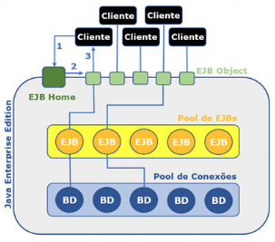 

Podemos observar muitos padrões de desenvolvimento no ambiente dos EJBs: 
* Service Locator: Para acesso aos componentes registrados via JNDI. 
* Abstract Factory: Na definição da fábrica de interfaces. 
* Proxy: Na comunicação com clientes remotos e, como citado anteriormente. 
* Flyweight: Na concepção do pool de objetos. 
 
O acesso ao banco de dados, no ambiente JEE, também ocorre de forma diferenciada, pois ao invés de uma conexão JDBC simples, obtida a partir do DriverManager, temos um pool de conexões JDBC, representado por um objeto do tipo DataSource, que assim como os EJBs, é registrado via JNDI. Quando solicitamos uma conexão ao DataSource, não estamos abrindo uma nova conexão, mas reservando uma das disponíveis no pool, e quando invocamos o método **close**, não ocorre a desconexão, mas, sim, a liberação da conexão para a próxima requisição. 
 
No fragmento de código seguinte, temos um exemplo de acesso e utilização de um pool de conexões, na linguagem Java, que poderia ser utilizado em um Servlet. Após obter o recurso via JNDI, através do método **lookup** de InitialContext, efetuamos a conversão para o tipo correto, no caso um DataSource, o qual fornece conexões através do método **getConnection**, e a partir daí, a programação é a mesma de um acesso local ao banco de dados, com a única diferença ocorrendo no comportamento do método **close**, que agora libera a conexão no pool para o próximo requisitante. 
 
```java 
protected void processRequest(HttpServletRequest request, 
HttpServletResponse response) 
throws ServletException, IOException { 
response.setContentType("text/html;charset=UTF-8"); 
try (PrintWriter out = response.getWriter()) { 
out.println("<html><body>"); 
try { 
InitialContext ctx = new InitialContext(); 
DataSource dts = (DataSource) ctx.lookup("jdbc/loja"); 
Connection c1 = dts.getConnection(); 
Statement st = c1.createStatement(); 
ResultSet rs = st.executeQuery("SELECT * FROM PRODUTO"); 
while(rs.next()) 
out.println(rs.getString("NOME")+" 
"); 
c1.close(); 
} catch (SQLException | NamingException ex) { 
} 
out.println(""); 
} 
} 
``` 
 
Como utilizamos JPA, não é necessário efetuar toda essa codificação para localização e utilização do pool, ficando a cargo do framework de persistência. No fluxo normal de execução, o cliente faz uma solicitação para a interface de acesso, que é repassada para o pool de EJBs, sendo disponibilizado um deles para responder, e na programação do EJB, utilizamos o JPA para obter acesso ao banco de dados a partir do DataSource, com o controle transacional sendo efetuado através do JTA (Java Transaction API). 
 
No J2EE, existia um EJB para persistência, denominado Entity Bean, que seguia o padrão Active Record, mas ele se mostrou inferior, em termos de eficiência, quando comparado a alguns frameworks de persistência, sendo substituído pelo JPA no JEE5. 
 
A programação, no modelo adotado a partir do JEE5, é bastante simples, e precisaremos apenas das anotações corretas para que os Application Servers, como o JBoss ou o GlassFish, se encarreguem de montar toda a estrutura necessária. Isso é bem diferente do processo de criação adotado pelo J2EE, com implementação baseada em contrato, envolvendo uma grande quantidade de interfaces, classes e arquivos XML, e tendo a verificação apenas no momento da implantação do sistema, já que não era um modelo de compilação formal. 
 
## Session Beans 
 
Quando trabalhamos com os componentes do tipo EJB, estamos preocupados com as regras de negócio de nosso aplicativo, ou seja, visamos à implementação da lógica do sistema, com base nas entidades e nos requisitos definidos, sem qualquer preocupação com a estrutura de persistência que será utilizada. Também devemos observar que as regras de negócio devem ser totalmente independentes das interfaces do sistema, não devendo ser direcionadas para nenhum ambiente específico.    
 
O primeiro tipo de EJB que deve ser observado é o de **sessão**, responsável por efetuar processos de negócios de forma **síncrona**, e configurável de três formas distintas, como podemos observar no quadro seguinte. 

| Comportamento | Descrição 
| ---           | ---        
| Stateless     | Não permite a manutenção de estado, ou seja, não guarda valores entre chamadas sucessivas. 
| Stateful      | Utilizado quando é necessário manter valores entre chamadas sucessivas, como no caso de somatórios. 
| Singleton     | Permite apenas uma instância por máquina virtual, garantindo o compartilhamento de dados entre todos os usuários. 
 
Utilizamos Stateless quando não precisamos de informações dos processos anteriores ao corrente. Qualquer instância do pool de EJBs pode ser escolhida, e não é necessário efetuar a carga de dados anteriores, definindo o padrão de comportamento mais ágil para um Session Bean. 
 
O comportamento Stateful deve ser utilizado apenas quando precisamos de informações anteriores, como em uma cesta de compras virtual, ou processos com acumuladores em cálculos estatísticos, entre outras situações com necessidade de gerência de estados. 
 
Antes de definir um Session Bean, devemos definir sua interface de acesso, com base na anotação Local, para acesso interno, ao nível do servidor, ou Remote, permitindo que o componente seja acessado remotamente. Em nossos estudos, o uso de acesso local será suficiente, já que teremos o acionamento dos EJBs a partir dos Servlets. 
 
```java 
@Local 
public interface CalculadoraLocal { 
int somar(int a, int b); 
} 
``` 
 
Ao criarmos o EJB, ele deverá implementar a interface de acesso, além de ser anotado como Stateless ou Stateful, dependendo da necessidade do negócio. Para uma calculadora simples, não precisaríamos de gerência de estados. 
 
```java 
@Stateless 
public class Calculadora implements CalculadoraLocal { 
@Override 
public int somar(int a, int b) { 
return a + b; 
} 
} 
``` 
 
Quanto ao EJB do tipo Singleton, ele é utilizado quando queremos compartilhar dados entre todos os usuários conectados, mesmo na execução sobre múltiplas máquinas virtuais, em ambientes distribuídos. Não podemos esquecer que os EJBs são uma tecnologia corporativa, e que a execução de forma clusterizada não é uma exceção em sistemas de missão crítica. 
 
Em um cluster, temos um conjunto de computadores atuando como se fossem apenas um, o que traz grande poder de processamento e menor possibilidade de interrupções, já que a falha de um computador causará a redistribuição das tarefas para os demais. 
 
Para utilizar um componente do tipo Session Bean a partir de um Servlet, o processo é trivial. 
 
```java 
@WebServlet(name = "ServletSoma", 
urlPatterns = {"/ServletSoma"}) 
public class ServletSoma extends HttpServlet { 
 
@EJB 
CalculadoraLocal facade; 
 
protected void doGet(HttpServletRequest request, 
HttpServletResponse response) 
throws ServletException, IOException { 
response.setContentType("text/html;charset=UTF-8"); 
try (PrintWriter out = response.getWriter()) { 
out.println("<html><body>"); 
 
out.println("<h1>Servlet ServletSoma: " + 
facade.somar(2, 3) + "</h1>"); 
out.println("</body>"); 
out.println("</html>"); 
} 
} 
} 
``` 
 
Tudo que precisamos fazer é anotar um atributo, do tipo da interface local, com EJB, e no código de resposta à chamada HTTP, invocamos os métodos da interface, como se fossem chamadas locais. No exemplo, temos a interface CalculadorLocal referenciada no atributo facade, o que permite invocar o método somar, sendo executado pelo pool. 
 
O uso da interface CalculadoraLocal permite solicitar os serviços do Session Bean, em meio ao pool de objetos, como se fossem simples chamadas locais. 
 
Quase todos os processos de negócio de um sistema corporativo, na plataforma JEE, são implementados através de Session Beans, mas alguns comportamentos não podem ser definidos de forma síncrona, exigindo um componente adequado para a comunicação com mensagerias, segundo um modelo assíncrono. 
 
## Message Driven Beans 
 
A tecnologia de mensagerias é muito importante para satisfazer aos requisitos de um sistema corporativo. Elas atuam de forma assíncrona e permitem a adoção do domínio **point to point**, onde as mensagens são enfileiradas para um tratamento sequencial no destinatário, ou **publish/subscribe**, onde as mensagens são depositadas em tópicos, para que os assinantes as recuperem. 
 
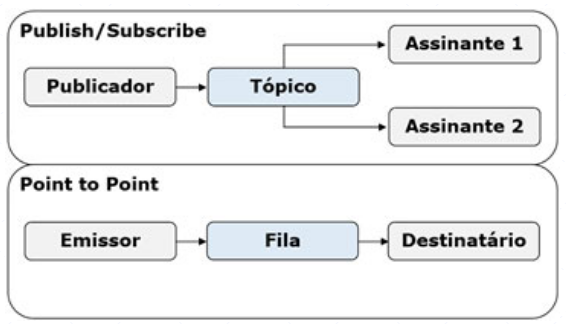 

O uso de mensagerias permite a construção de sistemas B2B (business to business), quase sem acoplamento, em que o único elemento de ligação entre os sistemas das duas empresas é a mensagem transmitida entre elas. A rede bancária utiliza amplamente as mensagerias, ao efetuar transações eletrônicas entre instituições diferentes, o que possibilita que um cliente solicite uma transferência, sem precisar esperar que ela seja concluída, já que não ocorre bloqueio do emissor. 
 
Após o cliente (**emissor ou publicador**) postar uma mensagem, a responsabilidade sobre a gerência dela passa a ser da mensageria, até o momento em que seja retirada pelos receptores. Já que as mensagerias funcionam como repositórios, gerenciando a persistência das mensagens, mesmo que o receptor esteja inativo, as mensagens não se perdem, sendo acumuladas até o momento em que o receptor seja ativado. 
 
Para criar filas ou tópicos no **GlassFish**, é necessário utilizar o comando **asadmin**, como no exemplo seguinte, para a criação de uma fila denominada jms/SimpleQueue. 
 
```java 
asadmin create-jms-resource --restype javax.jms.ConnectionFactory 
jms/SimpleConnectionFactory 
 
asadmin create-jms-resource --restype javax.jms.Queue 
jms/SimpleQueue 
``` 
 
Também podemos abrir o console do asadmin, sem a passagem de parâmetros, e depois invocar os comandos internamente. 
 
Existe um tipo de EJB denominado MDB (message driven bean), que tem como finalidade a comunicação com mensagerias via JMS, possibilitando o processamento assíncrono no JEE. Através do MDB é possível trabalhar nos dois domínios de mensagerias, com o tratamento de mensagens sendo feito através do pool de EJBs, a partir de um único método, que tem o nome onMessage representando os eventos de recepção de mensagens. 
 
```java 
@MessageDriven(activationConfig = { 
@ActivationConfigProperty(propertyName = "destinationLookup", 
propertyValue = "jms/SimpleQueue"), 
@ActivationConfigProperty(propertyName = "destinationType", 
propertyValue = "javax.jms.Queue") 
}) 
public class Mensageiro001 implements MessageListener { 
 
public Mensageiro001() { 
} 
 
@Override 
public void onMessage(Message message) { 
try { 
System.out.println("Mensagem enviada: "+ 
((TextMessage)message).getText()); 
} catch (JMSException ex) { 
System.out.println("Erro: "+ex.getMessage()); 
} 
} 
} 
``` 
 
No código de exemplo, temos uma anotação MessageDriven, para a definição do MDB, com a configuração para acesso a jms/SimpleQueue, do tipo javax.jms.Queue, através de anotações ActivationConfigProperty. Também é possível utilizar canais internos do projeto, mas o uso de canais do servidor viabiliza o comportamento B2B, com acesso a partir de qualquer plataforma que dê suporte ao uso de mensagerias. 
 
Para o tratamento das mensagens, devemos implementar a interface MessageListener, que contém apenas o método onMessage. A mensagem é recebida no parâmetro do tipo Message, que pode ser qualquer descendente da classe, segundo os princípios da orientação a objetos, o que torna necessário converter para o tipo correto, como no exemplo, onde temos a captura de um texto enviado via TextMessage, e a impressão da mensagem no console do GlassFish.  
 
Algo importante, acerca do MDB, é que ele foi projetado exclusivamente para receber mensagens, a partir de filas ou tópicos, o que faz com que não possa ser acionado diretamente, como os Session Beans. Para sua ativação, basta que um cliente poste uma mensagem. 
 
```java 
@WebServlet(name = "ServletMessage", 
urlPatterns = {"/ServletMessage"}) 
public class ServletMessage extends HttpServlet { 
@Resource(mappedName = "jms/SimpleConnectionFactory") 
private ConnectionFactory connectionFactory; 
@Resource(mappedName = "jms/SimpleQueue") 
private Queue queue; 
 
public void putMessage() throws ServletException { 
try { 
Connection connection = 
connectionFactory.createConnection(); 
Session session = 
connection.createSession(false, 
Session.AUTO_ACKNOWLEDGE); 
MessageProducer messageProducer = 
session.createProducer(queue); 
TextMessage message = session.createTextMessage(); 
message.setText("Teste com MDB"); 
messageProducer.send(message); 
} catch (JMSException ex) { 
throw new ServletException(ex); 
} 
} 
 
protected void doGet(HttpServletRequest request, 
HttpServletResponse response) 
throws ServletException, IOException { 
response.setContentType("text/html;charset=UTF-8"); 
try (PrintWriter out = response.getWriter()) { 
out.println(""); 
out.println(""); 
 
putMessage(); 
 
out.println("<h1>Mensagem Enviada</h1>"); 
out.println(""); 
} 
} 
} 
``` 
 
O processo é um pouco mais complexo que o adotado para os Session Beans, porém apresenta menor acoplamento. 
 
**Passo 1**: Inicialmente, devemos mapear a fábrica de conexões da mensageria e a fila de destino do MDB, através de anotações Resource. 
 
**Passo 2**: Com os recursos mapeados, definimos o método putMessage, para envio da mensagem, onde devemos criar uma conexão (Connection) a partir da fábrica, a sessão (Session) a partir da conexão, e o produtor de mensagens (MessageProducer) a partir da sessão. Na inicialização do MessageProducer, utilizamos o recurso de fila mapeado, indicando que ele deve apontar para a fila (Queue) destinada ao MDB. 
 
**Passo 3**: Após configurar a conexão, criamos a mensagem de texto (TextMessage) através da sessão, definimos o texto que será enviado com setText, e finalmente enviamos a mensagem, a partir do produtor, com o uso de send, finalizando a definição do método putMessage. Com o método completo, podemos utilizá-lo na resposta do Servlet ao protocolo HTTP, e verificar a mensagem na saída do GlassFish. 
 
## Aplicativo corportativo 
 
Para que possamos trabalhar com EJBs, através do ambiente do NetBeans, devemos definir um projeto corporativo. A sequência de passos para criar o Aplicativo Corporativo é:  
1. Criar um projeto do tipo Enterprise Application, na categoria Java Enterprise. 
2. Preencher o nome (ExemploEHB) e local do projeto 
3. Escolher o servidor (GlassFish) e versão do JEE(Java EE7), além de marcar as opções de criação para os módulos EJB e Web. 
 
Seguindo os passos anteriores corretamente, serão gerados três projetos, e poderemos visualizá-los na interface do NetBeans. 
 
O quadro seguinte apresenta as características de cada um dos projetos. 
 
| Projeto        | Característica 
| ---            | ---
| ExemploEJB-ejb |  Utilizado na definição das entidades JPA e dos componentes EJB, sendo compilado com a extensão "jar". 
| ExemploEJB-war | Contém os elementos para Web, como Servlets, Facelets e páginas XHTML, compilados para um arquivo "war". 
| ExemploEJB     | Agrupa os dois projetos anteriores, compactados em apenas um arquivo, com adoção da extensão "ear", para implantação. 
 
Quando trabalhamos com um projeto corporativo, devemos implantar o projeto principal, com extensão ear (Enterprise Archived), cujo ícone é um triângulo, pois qualquer tentativa de implantar os dois projetos secundários irá impedir a execução correta do conjunto, exigindo que seja feita a remoção manual dos projetos anteriores pela aba de Serviços. 
 
Agora, vamos criar nosso primeiro Session Bean, configurado como Stateless, no projeto secundário ExemploEJB-ejb, adicionando um novo arquivo e seguindo os seguintes passos: 
1. Selecionar o tipo de Session Bean na categoria Enterprise Java Beans 
2. Definir o nome (Calculadora) e pacote (ejbs) do novo Session Bean, escolher o tipo como Stateless e marcar apenas a interface Local. 
 
Em diversas situações, a IDE mostra um erro de compilação, decorrente da importação dos componentes da biblioteca javax.ejb. Caso o problema ocorra, a solução é simples, com a inclusão da biblioteca Java EE 7 API no projeto. 
 
Após incluir as bibliotecas necessárias, podemos completar os códigos de Calculadora e CalculadoraLocal, de acordo com os exemplos apresentados anteriormente, e iremos testar o EJB, ainda seguindo os exemplos, através de um Servlet. Já que os componentes Web são criados ao nível de ExemploEJB-war, devemos acessar o projeto e adicionar novo arquivo do tipo Servlet, na categoria Web, com o nome ServletSoma e pacote servlets, sem adicionar informações ao arquivo web.xml. 
 
Com o componente ServletSoma criado, utilizamos o código de exemplo definido antes, com a chamada para o EJB, executamos o projeto principal (ExemploEJB), e efetuamos a chamada apropriada: http://localhost:8080/ExemploSimplesJPA-war/ServletSoma 
 
Estando tudo correto, teremos a saída apresentada a seguir. 
 

 
Quanto ao EJB do tipo MDB, para criá-lo, devemos adicionar, no projeto ExemploEJB-ejb, um novo arquivo do tipo Message Driven Bean, na categoria Enterprise Java Beans. 
 
Precisamos definir o nome (Mensageiro001) e o pacote do componente, além de escolher a fila para as mensagens no servidor (jms/SimpleQueue), como na figura seguinte. 
 
Todos os passos para a codificação de Mensageiro001 foram descritos anteriormente, bem como a do Servlet para postagem da mensagem, com o nome ServletMessage, mas lembre-se de que o Servlet deve ser criado no projeto ExemploEJB-war. Com todos os componentes implementados, basta implantar o sistema, a partir do projeto principal, e efetuar a chamada correta no navegador: http://localhost:8080/ExemploSimplesJPA-war/ServletMessage 
 
Após efetuar a chamada, será apresentada a página com a informação de que ocorreu o envio da mensagem, o que poderá ser verificado no console de saída do GlassFish, conforme descrito anteriormente. 
 
# Descrever a utilização da arquitetura MVC na plataforma Java 
 
## Padrões de desenvolvimento 
 
A orientação a objetos representou um grande avanço na implementação de sistemas, pois aproximou a modelagem da codificação, mas o uso incorreto da metodologia levou à perda de diversas vantagens. Os padrões de desenvolvimento, que definem a formalização de soluções reutilizáveis, com nome, descrição da finalidade, modelagem UML e modo de utilização, permitiram recuperar as vantagens, baseando-se na adoção de soluções eficazes para a construção de sistemas orientados a objetos. 
 
Com os padrões, temos uma terminologia comum, pois permitem a utilização de um vocabulário básico e um ponto de vista semelhante sobre os problemas e possíveis soluções. Embora existam muitos padrões de desenvolvimento, alguns deles se destacam em um sistema cadastral corporativo, como Facade, Proxy, Flyweight, Front Controller e DAO (Data Access Object). 
 
Quando abordamos a tecnologia JPA, ficou claro que ocorre uma divisão entre os dados da entidade e o mapeamento objeto-relacional, já que, ao contrário dos atributos, as anotações não são serializáveis, impedindo a sua repercussão para outras camadas, o que é semelhante ao padrão DAO, no qual temos os comandos para acesso ao banco de dados agrupados em uma classe específica, separados da classe de entidade e de todo o restante do sistema. 
 
Também vimos a utilização de diversos padrões de desenvolvimento na arquitetura de componentes do tipo EJB, como Flyweight, para o pool de objetos, Abstract Factory, no fornecimento de interfaces de acesso locais ou remotas, Service Locator, necessário para a localização de recursos via JNDI, e Proxy, utilizado na comunicação remota. 
 
Outros componentes do sistema também deverão seguir padrões de desenvolvimento, visando a organizar as funcionalidades e facilitar a leitura do código-fonte, como o uso de Facade, ao nível dos Session Beans, ou Front Controller, aplicado aos Servlets. 
 
Temos a descrição formal dos padrões de desenvolvimento citados, além de alguns outros, comuns em sistemas criados para o ambiente JEE: 
* Abstract Factory: Definição de uma arquitetura abstrata para a geração de objetos, muito comum em frameworks. 
* Command: Encapsular o processamento da resposta para algum tipo de requisição, muito utilizado para o tratamento de solicitações feitas no protocolo HTTP. 
* Data Access Object: Utilização de classes específicas para concentrar as chamadas para o banco de dados. 
* Facade: Encapsular as chamadas para um sistema complexo, muito utilizado em ambientes corporativos. 
* Flyweight: Criação de grupos de objetos que respondem a uma grande quantidade de chamadas. 
* Front Controller: Concentrar as chamadas para o sistema, efetuando os direcionamentos corretos para cada chamada. 
* Iterator: Acesso sequencial aos objetos de uma coleção, o que é implementado nativamente no Java. 
* Proxy: Definição de um objeto para substituir a referência de outro, utilizado nos objetos remotos para deixar a conexão transparente para o programador. 
* Service Locator: Gerenciar a localização de recursos compartilhados, com base em serviços de nomes e diretórios. 
* Singleton: Garantir a existência de apenas uma instância para a classe, como em controles de acesso. 
* Strategy: Seleção de algoritmos em tempo de execução, com base em algum parâmetro fornecido. 
 
A simbologia utilizada para representar os padrões de desenvolvimento é um puzzle, algo muito justo ao considerarmos que os sistemas atuais são implementados através da combinação de diversos padrões. Um exemplo seria a criação de um pool de processadores de resposta para solicitações de usuários remotos, o que poderia ser caracterizado por um Flyweight de Strategies para a escolha de Commands, além da utilização de Proxy na comunicação com os clientes. 
 
## Padrões de arquiteturais 
 
A arquitetura de um sistema define a estrutura de alto nível do software, ou seja, formaliza a organização em termos de componentes e interações entre eles. Um dos objetivos é aproximar a visão de projeto da implementação do sistema, impedindo que ocorra a previsão de funcionalidades inviáveis para a fase de codificação. 
 
As especificações da arquitetura também definem as interfaces de entrada ou saída de informações, forma de comunicação com outros sistemas, e regras para o agrupamento dos componentes com base em suas áreas de atuação, entre outras características. 
 
Note que existem diversos perfis de sistemas, como aplicativos de linha de comando, ambientes baseados em janelas, ou até serviços sem interações diretas com o usuário, além da possibilidade de execução remota ou local, e cada perfil de execução traz algumas exigências estruturais. 
 
Padrões arquiteturais definem as regras do sistema em termos estruturais, ou seja, uma visão macroscópica do programa e suas relações com o ambiente. 
 
Um modelo arquitetural define uma arquitetura de forma abstrata, com foco apenas no objetivo ou característica principal, enquanto o estilo ou padrão arquitetural define o perfil dos componentes estruturais, modelo de comunicação e, até mesmo, quais são os padrões de desenvolvimento mais adequados na implementação. 
 
Por exemplo, o modelo de Objetos Distribuídos define apenas atributos essenciais para delimitar um ambiente com coleções de objetos respondendo a requisições remotas, enquanto o padrão arquitetural Broker define as regras de implementação, como o uso de Proxy na comunicação, ou a definição de pools de objetos no padrão Flyweight. 
 
Existem diferentes definições de modelos para os padrões arquiteturais, e alguns deles satisfazem a mais de um modelo, como podemos observar no quadro seguinte. 
 
| Padrão Arquitetural | Modelo(s) 
| ---                 | ---
| Broker              | Sistemas Distribuídos 
| Camadas             | Mud to Structure, Chamada e Retorno 
| Orientado a Objetos |  Chamada e Retorno 
| Programa Principal e Sub-rotina | Chamada e Retorno 
| Pipes/Filters       | Mud to Structure, Fluxo de Dados 
| Blackboard          | Mud to Structure, Centrada em Dados 
| Lote                | Fluxo de Dados 
| Repositório         | Centrada em Dados 
| Processos Comunicantes | Componentes Independentes 
| Event-Driven        | Componentes Independentes 
| Interpretador       | Máquina Virtual 
| Baseado em Regras   | Máquina Virtual 
| MVC                 | Sistemas Interativos 
| PAC                 | Sistemas Interativos 
| Microkernel         | Sistemas Adaptáveis 
| Reflexiva           | Sistemas Adaptáveis 
| |
 
A **arquitetura de referência** serve para definir o mapeamento de um padrão arquitetural para componentes de software que sejam capazes de implementar as funcionalidades requeridas de forma cooperativa. Definida a referência, finalmente pode ser construída uma arquitetura, com todos os componentes codificados adequadamente. 
 
Um exemplo de arquitetura é o VisiBroker, da fabricante Inprise, que utiliza como referência o CORBA (Common Object Request Broker Architecture), baseado no modelo de objetos distribuídos, segundo o padrão arquitetural Broker. 
 
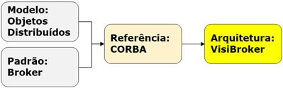 

Para utilizar uma arquitetura, é necessário compreender sua finalidade, de acordo com o padrão arquitetural adotado. Sistemas de baixa complexidade podem basear a arquitetura nos paradigmas adotados para a codificação, como a orientação a objetos, enquanto arquiteturas com maior complexidade seguem uma padronização mais robusta para os elementos estruturais, como a forma de comunicação em rede, a gerência de pools de objetos, ou a utilização de processos assíncronos. 
 
Enquanto para os mainframes era comum a arquitetura de processamento em lote, sistemas de linha de comando, no UNIX, utilizam amplamente o padrão de pipes/filters, no qual a saída obtida na execução de um programa serve como entrada para o próximo programa da sequência. Em ambos os casos, podemos observar arquiteturas baseadas no fluxo de dados. 
 
Ambientes de execução remota, como RPC (remote procedure call) e Web Services, são baseados em arquiteturas no padrão de **processos comunicantes**, onde servidores e clientes podem ser criados utilizando plataformas de desenvolvimento distintas, e o único fator de acoplamento é o protocolo de comunicação adotado. 
 
É comum o uso de mensagerias nos sistemas corporativos, onde utilizamos o padrão arquitetural event-driven, baseado na ativação de processos de forma indireta, a partir de mensagens. O papel das mensagerias é tão importante que o componente adotado na comunicação é chamado de MOM (Message-Oriented Middleware), e as vantagens no uso desse padrão são o acoplamento quase nulo e o processamento assíncrono. Um sistema simples pode responder a um único padrão arquitetural, mas os sistemas corporativos são complexos e heterogêneos, sendo muito comum a adoção de múltiplos padrões combinados. De forma geral, sempre existe um padrão principal, que no caso dos sistemas cadastrais é o MVC. 
 
## Arquitetura MVC 
 
A arquitetura MVC (model-view-controller) divide o sistema em três camadas, com responsabilidades específicas. Na camada Model, a mais baixa, temos as entidades e as classes para acesso ao banco de dados, na Controller, intermediária, concentramos os objetos de negócio, e na View, mais alta, são definidas as interfaces do sistema com o usuário ou com outros sistemas. 
 
**Model (Modelo)**:  
- Controla toda a persistência do sistema. 
- Concentra as chamadas ao banco de dados. 
- Encapsula o estado do sistema. 
- Pode utilizar mapeamento objeto-relacional. 
- Padrão DAO é aplicável. 
 
**Controller (Controle)**: 
- Implementa as regras de negócio do sistema. 
- Solicita os dados à camada Model. 
- Não pode ser direcionada para uma interface. 
- Pode utilizar objetos distribuídos. 
- Padrão Facade facilita a utilização da camada. 
 
 
**View (Visualização)**: 
- Define a interface do sistema. 
- Faz requisições para a camada Controller. 
- Contém apenas regras de formatação. 
- Podem ser definidas múltiplas interfaces. 
- Não pode acessar a camada Model. 
 
Uma regra fundamental para a arquitetura MVC é a de que os elementos da camada View não podem acessar a camada Model. Somente os objetos de negócio da camada Controller podem acessar os componentes da Model, e os elementos da View devem fazer suas requisições exclusivamente para os objetos de negócio. 
 
A arquitetura MVC é baseada em camadas, onde cada camada enxerga apenas a camada imediatamente abaixo. 
 
Em uma arquitetura MVC, as entidades são as unidades de informação para trânsito entre as camadas, e todos os comandos SQL ficam concentrados nas classes do padrão DAO. Como apenas a camada Controller pode acessar a Model, e nela estão as classes DAO, nós garantimos que as interfaces não acessem o banco de dados diretamente. 
 
O uso do padrão DAO e a popularização da arquitetura MVC demonstraram, de forma clara, a necessidade do mapeamento objeto-relacional em sistemas cadastrais criados com tecnologia orientada a objetos. Como as instruções SQL são bastante padronizadas, foi possível criar ferramentas para a geração dos comandos e preenchimento das entidades, de forma automática, bastando expressar a relação entre atributos da entidade e campos do registro. 
 
A camada Controller precisa ser definida sem que seja voltada para algum ambiente específico, como interfaces SWING ou protocolo HTTP. A única dependência aceitável para os objetos de negócio deve ser com relação à camada Model, e como a gerência do uso dos componentes DAO ocorre a partir deles, uma das características observadas é a diminuição da complexidade nas atividades cadastrais que foram iniciadas na View, o que justifica dizer que temos a aplicação do padrão Facade. 
 
Uma observação importante é a de que, como as regras de negócio ficam concentradas na camada Controller, podemos gerenciar as transações eficientemente a partir dos componentes dela. Inclusive, com a adoção de objetos distribuídos, a funcionalidade das transações foi ampliada para um modelo com a participação de múltiplos servidores. 
 
Da mesma forma, a camada Controller é o melhor local para definir as regras de autorização para o uso de funcionalidades do sistema, tendo como base o perfil de um usuário autenticado. Com relação à autenticação, ela pode ser iniciada por uma tela de login na camada View, com a efetivação na camada Controller, e nos modelos atuais é comum a geração de um token, mantendo a independência entre as camadas. 
 
## Componentes Java para MVC 
 
Uma grande vantagem do MVC é o direcionamento do desenvolvedor e das ferramentas para as necessidades de cada camada. Com a divisão funcional, diversos frameworks foram criados, como o JSF (Java Server Faces), que define interfaces Web na camada View, Spring ou EJB, para implementar as regras de negócio da camada Controller, e Hibernate, para a persistência ao nível da Model. Além disso, o uso de camadas especializadas permite a divisão da equipe entre profissionais cujo perfil seja voltado para criação visual, negócios ou banco de dados. 
 
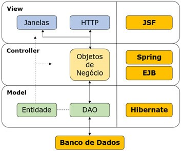 

Os frameworks facilitam a manutenção e evolução do sistema, pois tendem a acompanhar as tecnologias que surgem ao longo do tempo, mas apenas empresas de grande porte e comunidades de código aberto são capazes de garantir as atualizações, não sendo raros os casos em que uma ferramenta menos conhecida é descontinuada. 
 
Utilizar as ferramentas oferecidas pelo fabricante da linguagem pode ser uma boa opção quando desejamos garantir a continuidade da evolução do sistema. 
 
Em nosso contexto, a camada Model utiliza JPA, e como deve ser utilizada apenas pela camada Controller, é definida no mesmo projeto em que estão os componentes do tipo EJB. Note que a camada Controller oferece apenas as interfaces para os EJBs, com os dados sendo transitados na forma de entidades, sem acesso ao banco de dados, já que anotações não são serializáveis. 
 
Com a abordagem adotada, definimos o núcleo funcional e lógico de nosso sistema, sem a preocupação de satisfazer a qualquer tipo de tecnologia para construção de interfaces de usuário. 

A independência do núcleo garante que ele possa ser utilizado por diversas interfaces simultâneas, como SWING, HTTP ou Web Services, sem que ocorra qualquer modificação nos componentes do tipo JPA ou EJB 

Um erro comum, nos sistemas Java para Web, é definir os controladores no formato de Servlets, pois as regras de negócio se confundem com as rotinas de conversão utilizadas entre o protocolo HTTP e as estruturas da linguagem Java. 

A abordagem errônea faz com que qualquer nova interface, como SWING, Web Services, ou até linha de comando, seja obrigada a solicitar os serviços através do protocolo HTTP, algo que não é uma exigência das regras de negócio dos sistemas, de forma geral. 
 
Considere que a entidade Produto, definida anteriormente, com uso de tecnologia JPA, seja criada no projeto ExemploEJB-ejb, onde codificamos nosso Session Bean de teste, com o nome Calculadora. Com a presença da entidade no projeto, podemos adicionar outro Session Bean do tipo Stateless, com o nome ProdutoGestor e uso de interface Local, para as operações cadastrais. 
 
```java 
@Local 
public interface ProdutoGestorLocal { 
List<Produto> obterTodos(); 
void incluir(Produto p); 
} 
 
@Stateless 
public class ProdutoGestor implements ProdutoGestorLocal { 
@Override 
public List obterTodos() { 
EntityManagerFactory emf = Persistence. 
createEntityManagerFactory("ExemploSimplesJPAPU"); 
EntityManager em = emf.createEntityManager(); 
Query query = em.createNamedQuery("Produto.findAll"); 
List<Produto> lista = query.getResultList(); 
em.close(); 
return lista; 
} 
@Override 
public void incluir(Produto p) { 
EntityManagerFactory emf = Persistence. 
createEntityManagerFactory("ExemploSimplesJPAPU"); 
EntityManager em = emf.createEntityManager(); 
try { 
em.getTransaction().begin(); 
em.persist(p); 
em.getTransaction().commit(); 
} catch (Exception e) { 
em.getTransaction().rollback(); 
} finally { 
em.close(); 
} 
} 
} 
``` 
 
Precisamos adicionar o arquivo persistence.xml, definido em nosso exemplo de JPA, ao diretório conf do projeto ExemploEJB-ejb, sem modificações, o que levará à utilização de controle transacional de forma local. 
 
Com nossas camadas Model e Controller completamente codificadas, podemos definir um Servlet, no projeto ExemploEJB-war, com o nome ServletListaProduto, o qual será parte da camada View do sistema, no modelo Web. 
 
O objetivo do novo componente será a exibição da listagem dos produtos presentes na base de dados. 
 
```java 
@WebServlet(name = "ServletListaProduto", 
urlPatterns = {"/ServletListaProduto"}) 
public class ServletListaProduto extends HttpServlet { 
@EJB 
ProdutoGestorLocal facade; 
 
protected void doGet(HttpServletRequest request, 
HttpServletResponse response) 
throws ServletException, IOException { 
response.setContentType("text/html;charset=UTF-8"); 
try (PrintWriter out = response.getWriter()) { 
out.println("<html><body>"); 
facade.obterTodos().forEach(p -> { 
out.println(" 
" + p.getNome()); 
}); 
out.println(""); 
} 
} 
} 
``` 
 
No código temos o atributo facade, do tipo ProdutoGestorLocal, utilizando a anotação EJB para injetar o acesso ao pool de Session Beans. Após configurar o acesso, invocamos o método obterTodos, na construção da resposta ao HTTP no modo GET, aceitando uma chamada como a apresentada a seguir: http://localhost:8080/ExemploEJB-war/ServletListaProduto 
 
Estando tudo correto, teremos uma saída similar à seguinte, na tela do navegador. 
 
 

# Empregar padrão Front Controller em sistema MVC, com interface Java Web 
 
# Padrão Front Controller 
 
O objetivo do padrão Front Controller é a concentração das chamadas efetuadas em um único ponto de acesso, centralizando a orquestração dos serviços oferecidos a partir da camada Controller, e direcionando os resultados para a interface correta. A implementação do padrão Front Controller deve ocorrer ao nível da camada View, pois lida apenas com a conversão de formatos, o fluxo de chamadas e os redirecionamentos, sem interferir com regras de negócio. 
 
Criaremos um projeto do tipo Enterprise Application, na categoria Java Enterprise, com o nome CadastroEJB, configurando para utilização do servidor GlassFish e do Java EE 7. Antes de iniciar a codificação, precisamos entender o modelo funcional do sistema, e criar as tabelas necessárias, conforme o SQL seguinte. 
 
```sql 
CREATE TABLE EMPRESA ( 
CODIGO INT NOT NULL PRIMARY KEY, 
RAZAO_SOCIAL VARCHAR(50)); 
 
CREATE TABLE DEPARTAMENTO ( 
CODIGO INT NOT NULL PRIMARY KEY, 
NOME VARCHAR(50), 
COD_EMPRESA INT NOT NULL); 
 
ALTER TABLE DEPARTAMENTO ADD FOREIGN KEY(COD_EMPRESA) 
REFERENCES EMPRESA(CODIGO); 
 
CREATE TABLE SERIAIS ( 
NOME_TABELA VARCHAR(50) NOT NULL PRIMARY KEY, 
VALOR_CHAVE INT); 
 
INSERT INTO SERIAIS VALUES ('EMPRESA',0); 
INSERT INTO SERIAIS VALUES ('DEPARTAMENTO',0); 
``` 
 
Aqui temos as tabelas EMPRESA e DEPARTAMENTO, para a persistência de dados de um cadastro simples, com um relacionamento através do campo COD_EMPRESA, da tabela DEPARTAMENTO. Também podemos observar uma terceira tabela, com o nome SERIAIS, que viabilizará o autoincremento, através de anotações do JPA. 
 
Para a interface de nosso sistema, utilizaremos cinco páginas, as quais são descritas no quadro apresentado a seguir. 
 
| Página                | Descrição 
| ---                   | ---
| index.html            | Página inicial do aplicativo cadastral de exemplo, com acesso às listagens de empresas e departamentos. 
| ListaEmpresa.jsp      | Listagem das empresas e acesso às opções oferecidas para inclusão e exclusão de empresas. 
| DadosEmpresa.jsp      | Entrada de dados da empresa que será incluída. 
| ListaDepartamento.jsp | Listagem dos departamentos e acesso às opções de inclusão e exclusão de departamentos. 
| DadosDepartamento.jsp | Entrada de dados do departamento que será incluído. 
 
Agora vamos definir os fluxos das chamadas, que ocorrerão a partir do HTTP, o que pode ser representado através de uma Rede de Petri, um ferramental que permite expressar os estados de um sistema, físico ou virtual, e definir as transições que ocorrem, efetuando a ligação entre estados e transições através de arcos. Ao modelar um sistema Web, os estados definem páginas e as transições são chamadas HTTP. 
 
 

Em nossa Rede de Petri, temos as páginas dentro de figuras elípticas, que representam os estados do sistema, e as transições expressas através de figuras retangulares. A alternância entre páginas, ou estados, sempre ocorrerá com a passagem por uma transição, através de um Front Controller. 
 
Como as chamadas HTTP utilizam parâmetros, com valores do tipo texto, vamos adotar um parâmetro para identificação da transição requerida, onde teremos o nome acao e o valor correspondente a um dos valores de nosso diagrama. Podemos observar, no quadro seguinte, os valores utilizados e operações que devem ser realizadas. 
 
| Ação        | Operações 
| ---         | ---
| listaDep    | <ul><li>Obter a lista de departamentos</li> <li>Direcionar o fluxo para ListaDepartamento.jsp</li></ul>
| listaEmp    | <ul><li>Obter a lista de empresas</li> <li>Direcionar o fluxo para ListaEmpresa.jsp</li></ul>
| excDepExec  | <ul><li>Remover o departamento, de acordo com o código informado</li> <li>Obter a lista de departamentos</li> <li>Direcionar a informação para ListaDepartamento.jsp</li> </ul>
| excEmpExec  | <ul><li>Remover a empresa, de acordo com o código informado</li> <li> Obter a lista de empresas</li><li>Direcionar o fluxo para ListaEmpresa.jsp</li></ul>
| incDep      | <ul><li>Direcionar o fluxo para DadosDepartamento.jsp</li></ul>
| incDepExec  | <ul><li>Receber os dados para inclusão do departamento</li> <li>Converter para o formato de entidade</li> <li>Incluir o departamento na base de dados</li> <li>Obter a lista de departamentos</li> <li>Direcionar o fluxo para ListaDepartamento.jsp</li></ul>
| incEmp      | <ul><li>Direcionar o fluxo para DadosEmpresa.jsp</li></ul>
| incEmpExec  | <ul><li>Receber os dados para inclusão da empresa</li> <li> Converter para o formato de entidade </li> <li> Incluir a empresa na base de dados </li> <li> Obter a lista de empresas </li> <li> Direcionar o fluxo para ListaEmpresa.jsp </li></ul>
 
Nos aplicativos Java para Web, o padrão Front Controller pode ser implementado com base em um Servlet. O processo envolve a recepção de uma chamada HTTP, através dos métodos doGet ou doPost, execução de operações que envolvam chamadas aos EJBs, relacionadas às atividades de consulta ou persistência, e redirecionamento, ao final, para uma página, normalmente do tipo JSP, para a construção da resposta. 
 
## Camadas model e controller 
 
Nossas camadas Model e Controller serão criadas no projeto CadastroEJB-ejb, através das tecnologias JPA e EJB, iniciando com a codificação da camada Model, baseada na tecnologia JPA. 
 
Utilizaremos as ferramentas de automação do NetBeans, e para gerar as entidades do sistema, iremos executar os passos apresentados a seguir: 
 
Passo 1: Adicionar novo arquivo, escolhendo Entity Classes from Database, na categoria Persistence. 
 
Passo 2: Na configuração de Data Source, escolha New Data Source, com a definição do nome JNDI (jdbc/cadastro), e escolha da conexão para o banco de dados. 
 
Passo 3: Escolha as tabelas DEPARTAMENTO e EMPRESA, deixando marcada a opção de inclusão das tabelas relacionadas. 
 
Passo 4: Na tela seguinte, defina o nome do pacote como model, deixando marcada apenas a opção de criação da unidade de persistência. 
 
Passo 5: Escolha, ao chegar na última tela, o tipo de coleção como List, além de desmarcar todas as opções. 
 
Teremos a geração das entidades Departamento e Empresa, no pacote model, embora com possíveis erros de compilação, que serão resolvidos com o acréscimo da biblioteca Java EE 7 API ao projeto CadastroEJB-ejb. As entidades geradas irão precisar apenas de uma pequena modificação, para configurar o uso de autoincremento. 
 
```java 
@Entity 
@Table(name = "DEPARTAMENTO") 
@NamedQueries({ 
@NamedQuery(name = "Departamento.findAll", 
query = "SELECT d FROM Departamento d")}) 
public class Departamento implements Serializable { 
private static final long serialVersionUID = 1L; 
@Id 
@TableGenerator(name = "DeptoTabGen", table = "SERIAIS", 
pkColumnName = "NOME_TABELA", 
pkColumnValue = "DEPARTAMENTO", 
valueColumnName = "VALOR_CHAVE") 
@GeneratedValue(strategy = GenerationType.TABLE, 
generator = "DeptoTabGen") 
@Basic(optional = false) 
@NotNull 
@Column(name = "CODIGO") 
private Integer codigo; 
// O restante do código foi omitido por não ser relevante 
// para a modificação efetuada 
} 
 
@Entity 
@Table( name = "EMPRESA" ) 
@NamedQueries({ 
@NamedQuery(name = "Empresa.findAll", 
query = "SELECT e FROM Empresa e")}) 
public class Empresa implements Serializable { 
private static final long serialVersionUID = 1L; 
@Id 
@TableGenerator(name = "EmpTabGen", table = "SERIAIS", 
pkColumnName = "NOME_TABELA", 
pkColumnValue = "EMPRESA", 
valueColumnName = "VALOR_CHAVE") 
@GeneratedValue(strategy = GenerationType.TABLE, 
generator = "EmpTabGen") 
@Basic(optional = false) 
@NotNull 
@Column(name = "CODIGO") 
private Integer codigo; 
 
// O restante do código foi omitido por não ser relevante 
// para a modificação efetuada 
} 
``` 
 
A anotação TableGenerator define um gerador sequencial baseado em tabelas, sendo necessário definir a tabela que armazena os valores (SERIAIS), o campo da tabela que individualiza o gerador (NOME_TABELA), e o valor utilizado para o campo, sendo aqui adotado o próprio nome da tabela para cada entidade, além do campo que irá guardar o valor corrente para o sequencial (VALOR_CHAVE). Após definir o gerador, temos a aplicação do valor ao campo da entidade, com base na anotação GeneratedValue, tendo como estratégia o tipo GenerationType.TABLE, e a relação com o gerador a partir do nome escolhido.   
 
Durante a execução, quando uma entidade é criada e persistida no banco de dados, o gerador é acionado, incrementa o valor do campo VALOR_CHAVE para a linha da tabela SERIAIS referente à entidade, e alimenta a chave primária com o novo valor. Existem outras estratégias de geração, como o uso de SEQUENCE, mas a adoção de uma tabela de identificadores deixa o sistema muito mais portável. 
 
Com a camada Model pronta, vamos criar a camada Controller, usando componentes do tipo EJB, de acordo com os seguintes passos:  
 
Passo 1: Adicionar arquivo, escolhendo Session Beans For Entity Classes, na categoria Persistence. 
 
Passo 2: Selecionar todas as entidades do projeto. 
 
Passo 3: Definir o nome do pacote (control), além de adotar a interface Local. 
 
Será gerada uma classe abstrata, com o nome AbstractFacade, que concentra todos os processos de acesso e manipulação de dados, com o uso de elementos genéricos. 
 
```java 
public abstract class AbstractFacade { 
private Class entityClass; 
public AbstractFacade(Class entityClass) { 
this.entityClass = entityClass; 
} 
protected abstract EntityManager getEntityManager(); 
public void create(T entity) { 
getEntityManager().persist(entity); 
} 
public void edit(T entity) { 
getEntityManager().merge(entity); 
} 
public void remove(T entity) { 
getEntityManager().remove(getEntityManager().merge(entity)); 
} 
public T find(Object id) { 
return getEntityManager().find(entityClass, id); 
} 
public List findAll() { 
javax.persistence.criteria.CriteriaQuery cq = 
getEntityManager().getCriteriaBuilder().createQuery(); 
return getEntityManager().createQuery(cq).getResultList(); 
} 
public List<T> findRange(int[] range) { 
javax.persistence.criteria.CriteriaQuery cq = 
getEntityManager().getCriteriaBuilder().createQuery(); 
cq.select(cq.from(entityClass)); 
javax.persistence.Query q = 
getEntityManager().createQuery(cq); 
q.setMaxResults(range[1] - range[0] + 1); 
q.setFirstResult(range[0]); 
return q.getResultList(); 
} 
public int count() { 
javax.persistence.criteria.CriteriaQuery cq = 
getEntityManager().getCriteriaBuilder().createQuery(); 
javax.persistence.criteria.Root<T> rt = 
cq.from(entityClass); 
cq.select( 
getEntityManager().getCriteriaBuilder().count(rt)); 
javax.persistence.Query q = 
getEntityManager().createQuery(cq); 
return ((Long) q.getSingleResult()).intValue(); 
} 
} 
``` 
 
Observe que a classe é iniciada com um construtor, onde é recebida a classe da entidade gerenciada, e um método abstrato para retornar uma instância de EntityManager, ao nível dos descendentes, elementos utilizados pelos demais métodos da classe. 
 
Os métodos create, edit e remove, voltados para as ações de inclusão, edição e exclusão da entidade, são implementados através da invocação dos métodos de EntityManager, semelhante aos nossos exemplos anteriores, com tecnologia JPA, bem como find, que retorna uma entidade a partir de sua chave primária. 
 
Quanto aos métodos findAll e findRange, eles utilizam o JPA no modo programado, com base em CriteriaQuery, que apresenta métodos para substituir o uso de comandos na sintaxe JPQL. A chamada ao método from, tendo como parâmetro a classe da entidade, combinado com o método select, permite efetuar uma consulta que retorna todas as entidades do tipo gerenciado a partir do banco de dados, mas em findRange temos ainda o recurso de paginação, sendo definidos o índice inicial (setFirstResult) e a quantidade de entidades (setMaxResults). 
 
No método count, que obtém a quantidade total de entidades, também temos a adoção de CriteriaQuery, agora de uma forma mais complexa, com a definição de um elemento Root, envolvendo o conjunto completo de entidades, e aplicação do operador count sobre o conjunto. 
 
Com a definição do modelo funcional genérico, a construção dos Session Beans se torna muito simples, com base na herança e uso de anotações. 
 
```java 
@Stateless 
public class DepartamentoFacade extends 
AbstractFacade<Departamento> implements 
DepartamentoFacadeLocal { 
@PersistenceContext(unitName = "CadastroEJB-ejbPU") 
private EntityManager em; 
 
@Override 
protected EntityManager getEntityManager() { 
return em; 
} 
public DepartamentoFacade() { 
super(Departamento.class); 
} 
} 
 
@Stateless 
public class EmpresaFacade extends 
AbstractFacade<Empresa> implements 
EmpresaFacadeLocal { 
@PersistenceContext(unitName = "CadastroEJB-ejbPU") 
private EntityManager em; 
 
@Override 
protected EntityManager getEntityManager() { 
return em; 
} 
 
public EmpresaFacade() { 
super(Empresa.class); 
} 
} 
``` 
 
Em todos os três EJBs temos o mesmo tipo de programação, onde ocorre a herança com base em AbstractFacade, passando o tipo da entidade. O método getEntityManager retorna o atributo em, e no construtor a superclasse é chamada, com a passagem da classe da entidade. 
 
Os EJBs seguem o padrão Facade, e enquanto a anotação Stateless configura a classe para se tornar um Stateless Session Bean, o uso da anotação PersistenceContext, com a definição da unidade de persistência, instancia um EntityManager no atributo em. 
 
Ainda são necessárias as interfaces de acesso ao pool de EJBs, o que deve ser feito sem o uso de elementos genéricos. 
 
```java 
@Local 
public interface DepartamentoFacadeLocal { 
void create(Departamento departamento); 
void edit(Departamento departamento); 
void remove(Departamento departamento); 
Departamento find(Object id); 
List findAll(); 
List findRange(int[] range); 
int count(); 
} 
 
@Local 
public interface EmpresaFacadeLocal { 
void create(Empresa empresa); 
void edit(Empresa empresa); 
void remove(Empresa empresa); 
Empresa find(Object id); 
List<Empresa> findAll(); 
List<Empresa> findRange(int[] range); 
int count(); 
} 
``` 
 
Note que as interfaces apresentam métodos equivalentes aos que foram definidos em AbstractFacade, mas com a especificação da entidade, o que faz com que a herança ocorrida nos Session Beans implemente, de forma natural, as interfaces relacionadas. 
 
Não foram utilizadas instruções para o controle transacional, o que decorre do fato de que o contêiner EJB será o responsável por gerenciar as transações, via JTA, dentro do modelo conhecido como CMP (Container Managed Persistence). 
 
Para que o controle transacional ocorra da forma indicada, temos o atributo transaction-type com valor JTA, no arquivo persistence.xml, mas, há uma discrepância entre o NetBeans e o GlassFish, em termos da convenção de nomes, invalidando o identificador JNDI. 
 
Vamos alterar o atributo jndi-name, no arquivo glassfish-resources.xml, bem como o elemento jta-data-source, no arquivo persistence.xml, adotando o valor jdbc/cadastro para ambos. A modificação é necessária pelo fato do servidor GlassFish não aceitar o uso do sinal de dois pontos no identificador JNDI. 
 
```xml 
<?xml version="1.0" encoding="UTF-8"?> 
<DOCTYPE resources ...> 
<resources> 
<jdbc-connection-pool ...> 
<property name="serverName" value="localhost"/> 
<property name="portNumber" value="1527"/> 
<property name="databaseName" value="bancoJPA"/> 
<property name="User" value="bancoJPA"/> 
<property name="Password" value="bancoJPA"/> 
<property name="URL" 
value="jdbc:derby://localhost:1527/bancoJPA"/> 
<property name="driverClass" 
value="org.apache.derby.jdbc.ClientDriver"/> 
</jdbc-connection-pool> 
<jdbc-resource enabled="true" jndi-name="jdbc/cadastro" object-type="user" 
pool-name="derby_net_bancoJPA_bancoJPAPool"/> 
</resources> 
 
<?xml version="1.0" encoding="UTF-8"?> 
<persistence version="1.0" ...> 
<persistence-unit name="CadastroEJB-ejbPU" transaction-type="JTA"> 
<jta-data-source> jdbc/cadastro</jta-data-source> 
<exclude-unlisted-classes>false</exclude-unlisted-classes> 
<properties/> 
</persistence-unit> 
</persistence> 
``` 
 
Caso ocorra erro na implantação, mesmo após alterar os arquivos, execute o programa asadmin, invocando, em seguida, o comando add-resources, com a passagem do nome completo do arquivo glassfish-resources.xml. 
 
O arquivo glassfish-resources.xml fica disponível na divisão de configurações do projeto CadastroEJB-ejb, e foi gerado quando criamos as entidades a partir do banco de dados. 
 
## Camada view 
 
A construção da camada View ocorrerá no projeto CadastroEJB-war, e será iniciada com a geração das páginas JSP consideradas na Rede de Petri do sistema, começando pela página DadosEmpresa.jsp, que não apresenta conteúdo dinâmico. 
 
```java 
<%@page contentType="text/html" pageEncoding="UTF-8"%> 
<html><body> 
<form action="CadastroFC" method="post"> 
<input type="hidden" name="acao" value="incEmpExec"/> 
Razão Social: <input type="text" name="razao_social"/><br/> 
<input type="submit" value="Cadastrar"/> 
</form> 
</body></html> 
``` 
 
Observando o código-fonte, temos apenas um formulário comum, com um parâmetro do tipo hidden guardando o valor de acao, no caso incEmpExec, e um campo de texto para a razão social da empresa. Os dados serão enviados para CadastroFC, um Servlet no padrão Front Controller que iremos criar posteriormente. 
 
O cadastro de um departamento será mais complexo, pois envolverá a escolha de uma das empresas do banco de dados. Vamos adicionar o arquivo DadosDepartamento.jsp, com o conteúdo apresentado a seguir. 
 
```java 
<%@page import="model.Empresa"%> 
<%@page import="java.util.List"%> 
<%@page contentType="text/html" pageEncoding="UTF-8"%> 
<html> 
<body> 
<form action="CadastroFC" method="post"> 
<input type="hidden" name="acao" value="incDepExec"/> 
Empresa: 
<select name="cod_empresa"> 
<% 
List<Empresa> lista = (List<Empresa>) 
request.getAttribute("listaEmp"); 
for(Empresa e: lista){ 
%> 
<option value="<%=e.getCodigo()%>"> 
<%=e.getRazaoSocial()%> 
</option> 
<% } %> 
</select><br/> 
Nome: <input type="text" name="nome"/> 
 
<input type="submit" value="Cadastrar"/> 
</form> 
</body> 
</html> 
``` 
 
A coleção de empresas será recuperada a partir de um atributo de requisição, com o nome listaEmp, através do método getAttribute, e com base na coleção, preenchemos as opções de uma lista de seleção para o parâmetro cod_empresa. Os outros campos são apenas um parâmetro do tipo hidden, definindo o valor de acao como incDepExec, e um campo de texto para o nome do departamento. 
 
Agora vamos criar o primeiro arquivo para listagem, com o nome ListaEmpresa.jsp. 
 
```java 
<%@page import="model.Empresa"%> 
<%@page import="java.util.List"%> 
<%@page contentType="text/html" pageEncoding="UTF-8"%> 
<html> 
<body> 
<a href="CadastroFC?acao=incEmp">Nova Empresa</a> 
<table border="1" width="100%"> 
<tr><td>Código</td><td>Razão Social</td><td>Opções</td></tr> 
<% 
List<Empresa> lista = (List<Empresa>) 
request.getAttribute("lista"); 
for(Empresa e: lista){ 
%> 
<tr><td><%=e.getCodigo()%></td> 
<td><%=e.getRazaoSocial()%> </td> 
<td> 
<a href="CadastroFC?acao=excEmpExec&cod=<%=e.getCodigo()%>"> 
Excluir</a> 
</td> 
</tr> 
<% } %> 
</table> 
</body> 
</html> 
``` 
 
A página é iniciada com a definição de um link para CadastroFC, com o parâmetro acao contendo o valor incEmp. Em seguida, é definida uma tabela para exibir os dados de cada empresa do banco de dados, contendo os títulos Código, Razão Social e Opções. 
 
Recuperamos a coleção de empresas, através de um atributo de requisição com o nome lista, e preenchemos as células de cada linha da tabela a partir dos dados da entidade, além de um link para exclusão montado dinamicamente. A exclusão será efetuada com a chamada para CadastroFC, tendo o valor excEmpExec no parâmetro acao, e o código da empresa corrente no parâmetro cod. 
 
Finalmente, temos a listagem de departamentos, no arquivo ListaDepartamento.jsp. 
 
```java 
<%@page import="model.Departamento"%> 
<%@page import="java.util.List"%> 
<%@page contentType="text/html" pageEncoding="UTF-8"%> 
<html> 
<body> 
<a href="CadastroFC?acao=incDep">Novo Departamento</a> 
<table border="1" width="100%"> 
<tr><td>Código</td><td>Nome</td><td>Empresa</td> 
<td>Opções</td></tr> 
<% 
List<Departamento> lista = (List<Departamento>) 
request.getAttribute("lista"); 
for(Departamento d: lista){ 
%> 
<tr><td><%=d.getCodigo()%></td> 
<td><%=d.getNome()%></td> 
<td><%=d.getEmpresa().getRazaoSocial()%></td> 
<td> 
<a href="CadastroFC?acao=excDepExec&cod=<%=d.getCodigo()%>"> 
Excluir</a> 
</td> 
</tr> 
<% } %> 
</table> 
</body> 
</html> 
``` 
 
Em termos práticos, a listagem de departamentos é muito semelhante à de empresas, com a definição de um link de inclusão, agora com o valor incDep para acao, e a exibição dos dados através de uma tabela com os títulos Código, Nome, Empresa e Opções. 
 
Agora temos uma coleção de departamentos para o preenchimento das células, e o link para exclusão faz a chamada para CadastroFC, tendo o valor excDepExec no parâmetro acao, e o código do departamento corrente no parâmetro cod. Observe como a razão social da empresa é recuperada facilmente, utilizando o atributo presente na entidade departamento, alimentado através de uma anotação ManyToOne. 
 
Com a modificação de index.html, terminamos a construção das interfaces de usuário. 
 
```html 
<html> 
<body> 
<a href="CadastroFC?acao=listaDep"> 
Listagem de Departamentos</a> 
<a href="CadastroFC?acao=listaEmp"> 
Listagem de Empresas</a> 
</body> 
</html> 
``` 
 
Podemos observar que os links utilizados fazem referência a CadastroFC, com os valores de acao para obtenção de listagens para as entidades, que no caso são listaDep, para departamentos, e listaEmp, para empresas. 
 
## Implementação do front controller 
 
Com as interfaces concluídas, devemos iniciar a construção do Front Controller, levando à conclusão da camada View. Utilizaremos também um padrão Strategy, com o objetivo de segmentar as chamadas aos EJBs, e todas as classes serão criadas no pacote view, do projeto ExemploEJB-war. 
 
```java 
public abstract class Strategy { 
protected final K facade; 
public Strategy(K facade) { 
this.facade = facade; 
} 
public abstract String executar(String acao, 
HttpServletRequest request); 
} 
``` 
 
Com base em uma classe abstrata, e uso de elemento genérico, definimos um padrão Strategy, onde a execução ocorrerá a partir do valor para acao e da requisição HTTP, além de um construtor recebendo a interface para o EJB, através do elemento genérico. 
 
Definimos, em seguida, a estratégia para empresas, herdando da classe Strategy, com a adoção da interface EmpresaFacadeLocal. 
 
```java 
public class EmpresaStrategy 
extends Strategy<EmpresaFacadeLocal> { 
public EmpresaStrategy(EmpresaFacadeLocal facade) { 
super(facade); 
} 
@Override 
public String executar(String acao, 
HttpServletRequest request) { 
String paginaDestino = "ListaEmpresa.jsp"; 
switch(acao){ 
case "listaEmp": 
request.setAttribute("lista", facade.findAll()); 
break; 
case "excEmpExec": 
Integer codigo = 
new Integer(request.getParameter("cod")); 
facade.remove(facade.find(codigo)); 
request.setAttribute("lista", facade.findAll()); 
break; 
case "incEmpExec": 
String razaoSocial = 
request.getParameter("razao_social"); 
Empresa empresa = new Empresa(); 
empresa.setRazaoSocial(razaoSocial); 
facade.create(empresa); 
request.setAttribute("lista", facade.findAll()); 
break; 
case "incEmp": 
paginaDestino = "DadosEmpresa.jsp"; 
break; 
} 
return paginaDestino; 
} 
} 
``` 
 
Durante a execução, temos a definição da página de destino como ListaEmpresa.jsp, a qual será diferente apenas quando o parâmetro acao tiver valor incEmp, onde temos, como destino, a página DadosEmpresa.jsp. O método executar irá retornar o nome da página para o Front Controller, e ele efetuará o redirecionamento. 
 
Além da definição da página correta, temos as operações efetuadas a partir do atributo facade, como a remoção da entidade, quando acao vale excEmpExec, ou a inclusão, para o valor incEmpExec. Para todas as ações que direcionam para a página de listagem, temos ainda a definição do atributo de requisição com o nome lista, contendo a coleção de empresas, obtidas a partir do método findAll do facade, o que permite que ocorra sua recuperação posterior, na página JSP. 
 
Agora podemos definir a classe DepartamentoStrategy, com facade baseado em uma interface do tipo DepartamentoFacadeLocal, e acessando um segundo EJB, através do atributo facadeEmpresa, do tipo EmpresaFacadeLocal. Note que o construtor deve ser modificado para receber as duas interfaces utilizadas. 
 
```java 
public class DepartamentoStrategy 
extends Strategy<DepartamentoFacadeLocal>{ 
private final EmpresaFacadeLocal empresaFacade; 
public DepartamentoStrategy(DepartamentoFacadeLocal facade, 
EmpresaFacadeLocal empresaFacade) { 
super(facade); 
this.empresaFacade = empresaFacade; 
} 
@Override 
public String executar(String acao, 
HttpServletRequest request) { 
String paginaDestino = "ListaDepartamento.jsp"; 
switch(acao){ 
case "listaDep": 
request.setAttribute("lista", facade.findAll()); 
break; 
case "excDepExec": 
Integer codigo = new 
Integer(request.getParameter("cod")); 
facade.remove(facade.find(codigo)); 
request.setAttribute("lista", facade.findAll()); 
break; 
case "incDepExec": 
String nome = request.getParameter("nome"); 
Integer codEmpresa = new Integer( 
request.getParameter("cod_empresa")); 
Empresa empresa = empresaFacade.find(codEmpresa); 
Departamento departamento = new Departamento(); 
departamento.setNome(nome); 
departamento.setEmpresa(empresa); 
facade.create(departamento); 
request.setAttribute("lista", facade.findAll()); 
break; 
case "incDep": 
request.setAttribute("listaEmp", 
empresaFacade.findAll()); 
paginaDestino = "DadosDepartamento.jsp"; 
break; 
} 
return paginaDestino; 
} 
} 
``` 
 
Passo 1: Da mesma forma que na estratégia de empresa, temos as operações efetuadas a partir do atributo facade, como a remoção da entidade, quando acao tem valor excDepExec, ou a inclusão, para o valor incDepExec, e a chamada para findAll, para o preenchimento do atributo lista, nas ações que direcionam para a página de listagem. 
 
Passo 2: Também temos a utilização de facadeEmpresa, para definir o atributo listaEmp, quando acao tem valor incDep, e para recuperar a empresa selecionada, quando acao vale incDepExec. 
 
Passo 3: Com as estratégias definidas, podemos executar o último passo na construção de nosso aplicativo, adicionando um Servlet, com o nome CadastroFC, que será criado de acordo com o padrão Front Controller. 
 
```java 
@WebServlet(name="CadastroFC", urlPatterns={"/CadastroFC"}) 
public class CadastroFC extends HttpServlet { 
@EJB 
EmpresaFacadeLocal empresaFacade; 
@EJB 
DepartamentoFacadeLocal departamentoFacade; 
 
private final HashMap<String,Strategy> estrategia = 
new HashMap<>(); 
private final HashMap<String,String> acoes = new HashMap<>(); 
 
@Override 
public void init() throws ServletException { 
super.init(); 
estrategia.put("empresa", new EmpresaStrategy( 
empresaFacade)); 
estrategia.put("departamento", new DepartamentoStrategy( 
departamentoFacade,empresaFacade)); 
String[] acoesEmpresa = 
{"listaEmp","incEmp","incEmpExec","excEmpExec"}; 
for(String acao: acoesEmpresa) 
acoes.put(acao, "empresa"); 
String[] acoesDepto = 
{"listaDep","incDep","incDepExec","excDepExec"}; 
for(String acao: acoesDepto) 
acoes.put(acao, "departamento"); 
} 
 
protected void processRequest(HttpServletRequest request, 
HttpServletResponse response) 
throws ServletException, IOException { 
String acao = request.getParameter("acao"); 
if(acao==null) 
throw new ServletException("Parâmetro acao requerido"); 
Strategy st = estrategia.get(acoes.get(acao)); 
request.getRequestDispatcher(st.executar(acao, request)). 
forward(request, response); 
} 
@Override 
protected void doGet(HttpServletRequest request, 
HttpServletResponse response) 
throws ServletException, IOException { 
processRequest(request, response); 
} 
@Override 
protected void doPost(HttpServletRequest request, 
HttpServletResponse response) 
throws ServletException, IOException { 
processRequest(request, response); 
} 
} 
``` 
 
Como toda a complexidade foi distribuída entre os descendentes de Strategy, o Servlet irá funcionar como um simples redirecionador de fluxo. Inicialmente, temos os atributos anotados para acesso aos EJBs, e a definição de dois HashMaps, um para armazenar as estratégias de empresa e departamento, com o nome estrategia, e outro para relacionar as ações do sistema com os identificadores dos gestores, com o nome acoes. 
 
No método init temos a inicialização de ambos os HashMaps, e consequente criação das instâncias para os elementos Strategy. Note que as ações são facilmente relacionadas com o identificador de estratégia, apoiadas no uso de vetores de texto. 
 
Quanto à resposta ao HTTP, no método processRequest, o primeiro passo é a verificação do parâmetro acao, obrigatório na chamada ao Servlet. Se o parâmetro estiver presente, localizamos a estratégia correta, a partir dos HashMaps, invocamos a execução, e com o nome da página obtido, efetuamos o redirecionamento via RequestDispatcher. 
 
Agora, com o aplicativo completo, podemos executá-lo, testando a inclusão e a listagem, tanto para empresas quanto para departamentos. Algumas das telas de nosso sistema podem ser observadas a seguir. 

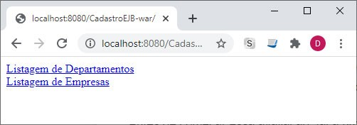
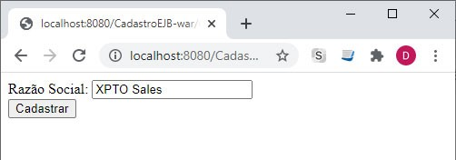

 

# Aula 5 - Web Services

## Web Services 
 
No início da computação distribuída, com as aplicações distribuídas, a comunicação entre cliente e servidor era restrita a uma rede interna, ficando o servidor responsável por efetuar todo o processamento. 
 
Posteriormente, esse processamento passou a ser feito entre vários servidores, onde era comum a utilização de middlewares como CORBA, DCOM e RMI, sendo tais middlewares responsáveis por prover a comunicação nos sistemas distribuídos. 
 
**Middlewares: Infraestrutura de software localizada entre o sistema operacional e uma aplicação distribuída.** 
 
Mais recentemente, as aplicações cliente x servidor migraram para a Internet, dando origem então aos Web Services, que surgiram como uma extensão dos conceitos de chamada remota de métodos, presentes nos middlewares já mencionados, para a Web. Logo, podemos dizer que os Web Services são aplicações distribuídas que se comunicam por meio de mensagens. Ou, usando outras palavras, um Web Service é uma interface que descreve uma coleção de operações acessíveis pela rede através de mensagens. Nesse sentido, temos transações e regras de negócio de uma aplicação expostas através de protocolos acessíveis e compreensíveis por outras aplicações – podendo essas ser escritas em qualquer linguagem de programação, além de residirem em qualquer sistema operacional. 
 
## Web Services e sua arquitetura 
 
A arquitetura dos Web Services é baseada em três componentes: 
* Provedor de serviços; 
* Consumidor de serviços; 
* Registro dos serviços. 
 
Vamos conhecer um pouco mais sobre cada um desses componentes. 
 
**Provedor de serviços**: O primeiro componente, o provedor de serviços, é responsável pela criação e descrição do Web Service – em um formato padrão, compreensível para quem precise utilizar o serviço ‒ assim como pela sua disponibilização a fim de que possa ser utilizado. 
 
**Consumidor de serviços**: Esse componente, ou papel, é representado por quem utiliza um Web Service disponibilizado em um provedor de serviços. 
 
**Registro dos serviços**: Trata-se de um repositório a partir do qual o provedor de serviços pode disponibilizar seus Web Services e no qual o consumidor de serviços pode utilizá-los. Em termos técnicos, o registro dos serviços contém informações, como os detalhes da empresa, os serviços por ela oferecidos e a descrição técnica dos Web Services. 
 
 
 
## Outros elementos da arquitetura dos web services 
 
Além dos elementos já apresentados, há ainda outros que compõem a arquitetura dos Web Services, como a WSDL, o SOAP, assim como a XML e a UDDI. 
 
WSDL: A WSDL (Web Services Description Language) é uma linguagem baseada em XML, cuja função é descrever, de forma automatizada, os serviços do Web Service através de um documento acessível aos clientes que desejam fazer uso do Web Service. **A WSDL é responsável por fornecer as informações necessárias para utilização de um Web Service, como as operações disponíveis e suas assinaturas.** 
 
UDDI: A UDDI (Universal Description, Discovery and Integration) é responsável por prover um mecanismo para a descoberta e publicação de Web Services. Nesse sentido, **a UDDI contém informações categorizadas sobre as funcionalidades e serviços disponíveis no Web Service**, permitindo, ainda, a associação de informações técnicas, normalmente definidas com o uso da WSDL, a esses serviços. 
 
## SOAP e REST 
 
Inicialmente, no contexto da computação distribuída, eram utilizadas tecnologias como RMI, DCOM e CORBA para a integração de aplicações. Nesse cenário, tais tecnologias obtiveram sucesso quando aplicadas em ambientes de rede locais e homogêneos. Posteriormente, já no ambiente heterogêneo da Internet, outras soluções foram aplicadas através da construção de aplicações web escritas em linguagens como ASP, PHP e Java (JSP). Tais aplicações, em termos de integração com outras aplicações, faziam uso de XML. 
 
Embora a XML seja um formato de transmissão de dados padronizado, faltava padronização por parte das empresas em termos de desenvolvimento, utilização de protocolos, transações, segurança etc. Frente a isso, o W3C desenvolveu um padrão cujo principal objetivo era prover a interoperabilidade entre aplicações. Tal padrão recebeu o nome de “Padrões WS-*” e é constituído por especificações para criação de Web Services baseados no protocolo SOAP. 
 
O padrão WS-* é composto por várias especificações, como a WS-Addressing (que trata dos mecanismos de transporte para a troca de mensagens nos Web Services), a WS-Security (protocolo que trata da segurança nos Web Services), entre outros. 
 
O REST, diferentemente do SOAP, não é uma especificação e nem foi criado pelo W3C. Em linhas gerais, trata-se de uma forma alternativa, uma arquitetura web, para o consumo de Web Services e que se baseia na utilização de recursos oferecidos pelo HTTP. 
 
## SOAP 
 
O SOAP é um protocolo, baseado em definições XML, utilizado para a troca de informações/comunicação em ambiente distribuído. Tal protocolo encapsula as chamadas e os retornos a métodos Web Services, trabalhando, principalmente, sobre o protocolo HTTP. Com o uso de SOAP, é possível invocar aplicações remotas utilizando RPC ou troca de mensagens, sendo indiferente o sistema operacional, a plataforma ou a linguagem de programação das aplicações envolvidas. 
 
### Comunicação em SOAP 
 
Web Services que fazem uso do protocolo SOAP podem utilizar dois modelos distintos de comunicação: 
 
RPC: Nesse modelo, é possível modelar chamadas de métodos com parâmetros, assim como receber valores de retorno. Com ele, o corpo (body) da mensagem SOAP contém o nome do método a ser executado e os parâmetros. Já a mensagem de resposta contém um valor de retorno ou de falha. 
 
Document: Nesse modelo, o body contém um fragmento XML que é enviado ao serviço requisitado, no lugar do conjunto de valores e parâmetros presente no RPC. 
 
### Formato de mensagem 
 
Uma mensagem SOAP é composta por três elementos: 
 
**Envelope**: Elemento principal (raiz do documento) do XML, responsável por definir o conteúdo da mensagem. É um elemento obrigatório. 
 
**Header**: Mecanismo genérico que torna possível a adição de características, de informações adicionais, à mensagem. É um elemento opcional, mas que, quando utilizado, deve ser o primeiro elemento do Envelope. 
 
**Body**: Corpo da mensagem. Contém a informação a ser transportada. Assim como o Envelope, é um elemento obrigatório. 
 
Aqui podemos ver o fragmento XML contendo os elementos definidos acima:  
 
```xml 
<SOAP-ENV:envelope> 
 
 
<SOAP-ENV:header> </SOAP-ENV:header> 
<SOAP-ENV:body> 
 
 
<SOAP-ENV:fault> 
</SOAP-ENV:fault> 
</SOAP-ENV:body> 
</SOAP-ENV:envelope> 
``` 
 
Conforme visto no código, o elemento Body pode conter um elemento opcional, o Fault. Tal elemento é usado para transportar mensagens de status e/ou erros. 
 
### Exemplo de requisição e resposta utilizando SOAP 
 
Para melhor compreensão, veremos a seguir um exemplo prático de requisição e resposta de Web Service utilizando o protocolo SOAP. Nesse exemplo, será invocado o método “GetModulosTema”. Tal método recebe como parâmetro o nome do tema, representado pela variável “TemaNome”. Como resposta, são retornados os nomes dos módulos relacionados ao tema informado. O XML contendo o envelope da requisição pode ser visto no código abaixo: 
 
```xml 
<?xml version="1.0"?> 
<soap:Envelope xmlns:soap="http://www.w3.org/2003/05/soap-envelope"> 
<soap:Header> 
</soap:Header> 
<soap:Body> 
<GetModulosTema> 
<TemaNome>Webservices<TemaNome> 
</GetModulosTema> 
</soap:Body> 
</soap:Envelope> 
``` 
 
A seguir, é demonstrado o XML do envelope contendo a resposta do método invocado. 
 
```xml 
<?xml version="1.0"?> 
<soap:Envelope 
xmlns:soap="http://www.w3.org/2003/05/soap-envelope/" 
soap:encodingStyle="http://www.w3.org/2003/05/soap-encoding"> 
 
<soap:Body> 
<GetModulosTemaResponse> 
<Modulos> 
<Modulo> 
<Nome>SOAP e REST</Nome> 
</Modulo> 
<Modulo> 
<Nome>Utilização de SOAP XML em JAVA</Nome> 
</Modulo> 
<Modulo> 
<Nome>Utilização de REST JSON em JAVA</Nome> 
</Modulo> 
</Modulos> 
</GetModulosTemaResponse> 
</soap:Body> 
 
</soap:Envelope> 
``` 
 
## REST 
 
O REST foi proposto por Roy Fielding, um dos criadores do protocolo HTTP, em 2000, com a premissa de utilizar os recursos oferecidos pelo HTTP. Trata-se de um modelo mais simples que o SOAP, além de não ser um protocolo, mas, sim, uma arquitetura web, composta pelos seguintes elementos: 
Cliente (do Web Service); 
Provedor (do Web Service); 
Protocolo HTTP. 
 
Considerando os elementos acima, o consumo de um Web Service que faz uso de REST tem seu ciclo de vida iniciado com o cliente enviando uma solicitação a um determinado provedor. Tal provedor, após processar a requisição, responde ao cliente. Além disso, o HTTP é o protocolo que define o formato das mensagens enviadas e recebidas, além de também ser responsável pelo transporte dessas mensagens. 
 
A exemplo do WSDL, presente no protocolo SOAP, em REST está disponível a WADL (Web Application Description Language), cuja função também é a de descrever serviços – nesse caso, os serviços Web ou serviços REST. 
 
### Estrutura dos recursos REST 
 
Na arquitetura REST, os serviços ou recursos disponíveis correspondem a uma URI (Uniform Resource Identifier) específica e que também é única. Se considerarmos o exemplo visto no protocolo SOAP, podemos dizer que “GetModulosTema” é um método pertencente a um recurso – que vamos chamar de “Tema”. Logo, a URI para consumo desse serviço seria: http://www.dominio.com.br/tema/GetModulosTema/{nome-do-tema} 
 
Considerando então que “Tema” é o nome do recurso, podemos imaginar outros métodos disponíveis no mesmo. Poderíamos ter, por exemplo, um método para listar todos os temas; um método para inserir um novo tema; etc. Cada um desses serviços teria uma URI própria: 
* Listagem de todos os temas: http://www.dominio.com.br/tema 
* Inserção de tema: http://www.dominio.com.br/tema/CreateTema/{nome-do-tema} 
 
Uma vez que os Web Services REST são baseados no protocolo HTTP, a estrutura dos recursos REST, como visto acima, provém justamente dos métodos e códigos de retorno HTTP. Isto, em termos práticos, significa dizer que devemos usar os diferentes métodos HTTP de acordo com as operações para manipulação de dados dos recursos que desejamos fazer. 
 
Por exemplo: Para recuperar dados, como no caso onde queremos listar todos os temas  
existentes, devemos usar o método HTTP GET. 
 
Abaixo, na Tabela 1, estão listados os métodos HTTP e suas funções em relação à arquitetura REST: 

| Método HTTP  | Descrição / Para que é usado 
| ---          | --- 
| GET          | Usado na recuperação ou listagem de recursos 
| POST         | Usado na inclusão de um recurso 
| PUT          | Usado na edição de um recurso 
| DELETE       | Usado na exclusão de um recurso 
 
Como já mencionado, REST utiliza os recursos do protocolo HTTP. Logo, em relação às respostas dos serviços, temos disponíveis os códigos de retorno HTTP. 
 
Por exemplo: Para verificarmos se um recurso foi atualizado com sucesso, devemos verificar se o código HTTP é igual a 200. Caso algum erro tenha ocorrido, teremos então o código 400 ou 404. 
 
### Exemplo de requisição e resposta utilizando REST 
 
O consumo de um recurso REST é feito através de uma URI. Logo, poderíamos acessar tal recurso até mesmo através de um navegador web, sendo a forma mais usual, quando falamos de integração entre aplicações, implementarmos um cliente, através de uma linguagem de programação, que acesse o recurso em questão, enviando parâmetros, quando necessário, e tratando o retorno do mesmo. Nesse contexto, vamos usar o mesmo exemplo visto em SOAP e recuperar a listagem de módulos disponíveis para um determinado tema. 
 
Para consumir o serviço, vamos utilizar a seguinte URI: http://www.dominio.com.br/tema/GetModulosTema/Webservices 
 
Um possível retorno para essa requisição é visto a seguir: 
 
```json 
{ 
"Modulos": [{ 
"Nome": "SOAP e REST" 
}, { 
"Nome": "Utilização de SOAP XML em JAVA" 
}, { 
"Nome": "Utilização de REST JSON em JAVA" 
} 
] 
} 
``` 
 
Como vimos, as informações retornadas pelo Web Service consumido estão no formato JSON. Embora não seja o único tipo de dado disponível para o transporte de informações em REST – ou melhor, em mensagens HTTP, ele é o mais utilizado nessa arquitetura. 
 
Como curiosidade, em requisições REST podemos usar qualquer um dos tipos de conteúdo (Content-Type) abaixo: 
* Application/xml 
* Application/json 
* Text/plain 
* Text/xml 
* Text/html 
 
# Demonstrar o consumo de Web Services através do protocolo SOAP utilizando Java 
 
## Estrutura da aplicação 
 
Nossa aplicação será composta por uma aplicação do tipo EJB Module cujo papel será o de provedor de serviços. Nessa aplicação, construiremos os recursos que serão disponibilizados via SOAP. Além disso, teremos outra aplicação, do tipo Web Application, cujo papel será o de Cliente, ou seja, essa aplicação consumirá os recursos definidos na primeira aplicação. 
 
A árvore das aplicações pode ser vista abaixo: 
* Provedor SOAP 
   * DisciplinasWS (Projeto Java do tipo EJB Module) 
      * DisciplinasWS_Provedor (Webservice) 
        *  GetTema (Método/Recurso) 
        *  GetModulosTema (Método/Recurso) 
* Cliente SOAP 
   * DisciplinasWS_Cliente (Projeto Java do tipo Web Application) 
      * DisciplinasWS_Provedor (Webservice) 
         * Web Pages/index.jsp (Página principal) 
         * DisciplinaWSServlet (Servlet Java) 
 
## Provedor SOAP 
 
Nossa primeira aplicação será responsável por criar/manter o Web Service e os seus métodos/recursos. A seguir, veremos um passo a passo de como criar e disponibilizar o nosso serviço. 
 
## Criando o Web Service 
 
Passo 1: Abra a IDE NetBeans, clique no menu superior em “File” e, a seguir, em “New Project”.  
 
Passo 2: Selecione, entre as opções disponíveis, EJB Module e clique em “Next”. 
 
Passo 3: Na janela de configuração do projeto EJB Module, preencha os seguintes campos: 
* Project Name: DisciplinasWS 
* Group Id: com.[INICIAIS_DO_SEU_NOME] 
* Package: Será preenchido automaticamente após você preencher os dois campos acima. 
 
Passo 4: Após inserir as informações para criação do Projeto, clique em “Next”. 
 
Passo 5: Chegou a hora de escolher o Servidor a ser usado em nossa aplicação. Ao lado do campo “Server”, clique em “Add”. Na lista apresentada, escolha a opção “GlassFish Server”. A seguir, clique em “Next”. 
 
Passo 6: Na tela de configuração do Servidor GlassFish, mantenha os valores padrão sugeridos pela IDE. Na opção “Choose server to download”, escolha a versão mais recente. Clique na checkbox para aceitar a licença e, a seguir, em “Next”. 
 
Passo 7: Após download e instalação do Servidor GlassFish, finalize a tela de configuração do projeto EJB Module. 
 
Passo 8: Após a criação do projeto, sua janela “Projects” deverá ser exibida como abaixo: 

 
Passo 9: Agora criaremos nosso Web Service. Para isso, clique com o botão direito do mouse sobre o nome do projeto (na imagem anterior, nó “DisciplinasWS-1.0.SNAPSHOT”) e, a seguir, em “New”. Dentre as opções listadas, clique em “Web Service” (cuidado para não clicar, por engano, na opção Web Service Client). 
 
Passo 10: Na tela de configuração do novo Web Service, preencha os seguintes campos: 
* Web Service Name: DisciplinasWS_Provedor 
* Package: com.[INICIAIS_DO_SEU_NOME].disciplinasws 
 
Marque ainda a opção “Implement Web Service as Stateless Session Bean”. 
 
Passo 11: Após configurar o Web Service, clique em “Finish”. 
 
## Criando os serviços 
 
Após seguir o passo a passo descrito acima, você terá uma classe Java em seu projeto chamada “DisciplinasWS_Provedor” (ou uma classe com o nome, diferente do sugerido, que você inseriu para nomear o Web Service). Essa é a classe responsável por armazenar os métodos que estarão disponíveis em nosso Serviço Web. Perceba que, por padrão, a IDE cria um método chamado “hello”. 
 
A qualquer momento você poderá testar o funcionamento do Web Service e de seus métodos. Para isso, clique com o botão direito do mouse sobre o projeto e, a seguir, em “RUN”. A IDE, então, fará o “Deploy” do projeto. Após concluído esse processo, clique com o botão direito do mouse sobre o Web Service “DisciplinasWS_Provedor” (que estará dentro da pasta “Web Services”) e, a seguir, em “Test Web Service”. Em seguida, a janela do navegador abrirá e você poderá testar o funcionamento do Serviço. Caso ainda não tenha modificado o método default, “hello”, criado pela IDE, você verá uma página Web contendo um botão chamado “hello” e um campo input ao lado. Insira um texto nesse campo e clique no botão “hello”. Tal ação abrirá uma nova página na qual poderá ser visto o resultado da invocação do Web Service - método “hello”. Esse método, como podemos ver na classe que criamos, recebe uma string e a imprime entre as strings “Hello “ e “ !”. 
 
Repare ainda, na tela, que são mostrados também os envelopes contendo a requisição e a resposta SOAP. 
 
Dando seguimento à criação dos nossos métodos “GetTema” e “GetModulosTema”, vamos modificar a classe “DisciplinasWS_Provedor.java” para incluí-los, assim como para remover o método “hello”. A criação de métodos pode ser feita de duas formas: Diretamente via código ou através de um assistente de criação de códigos. Vamos usar a segunda opção, conforme o passo a passo a seguir. 
 
Passo 1: Remova o método “hello” da classe java “DisciplinasWS_Provedor”. 
 
Passo 2: Clique com o botão direito do mouse sobre a classe (na janela “Projects”) e, a seguir, clique em “Add Operation”. 
 
Passo 3: Na tela de configuração da operação, preencha/modifique os seguintes campos com os valores a seguir: 
* Name: GetTema 
* O tipo de retorno (Return Type) deverá ser “java.lang.String”, uma vez que nosso método retornará uma lista de temas. Além disso, essa operação não receberá parâmetros, uma vez que listará todos os temas existentes, sem que seja necessário passarmos qualquer parâmetro. 
* Ao final da execução do assistente, estará disponível em nossa classe o método criado. Repare que, até aqui, existe apenas o esqueleto do método. Mais adiante nós o incrementaremos, criando a lógica para que seja retornada uma listagem de nomes de temas. 
 
Passo 4: Repetiremos o passo anterior para criar a operação “GetModulosTema”. Entretanto, essa operação receberá um parâmetro do tipo string – que conterá o nome do tema a partir do qual listaremos os módulos existentes. 
 
Passo 5: Nesse ponto, a nossa classe deverá estar desta forma: 
 
```java 
package com.aop.disciplinasws; 
 
import javax.jws.WebService; 
import javax.jws.WebMethod; 
import javax.jws.WebParam; 
import javax.ejb.Stateless; 
 
@WebService(serviceName = "DisciplinasWS_Provedor") 
@Stateless() 
public class DisciplinasWS_Provedor { 
 
@WebMethod(operationName = "GetTema") 
public String GetTema() { 
//TODO write your implementation code here: 
return null; 
} 
 
@WebMethod(operationName = "GetModulosTema") 
public String GetModulosTema(@WebParam(name = "tema") String tema) { 
//TODO write your implementation code here: 
return null; 
} 
} 
``` 
 
Vamos, então, implementar os métodos. Em casos reais, provavelmente utilizaríamos um banco de dados de onde recuperaríamos as informações – os nomes dos temas e dos módulos. Entretanto, utilizaremos aqui uma coleção Java contendo tais informações, declarada diretamente na classe Java. 
 
Substitua ou adapte o seu código para ficar desta forma: 
 
```java 
package com.aop.disciplinasws; 
 
import java.util.ArrayList; 
import java.util.Arrays; 
import java.util.HashMap; 
import java.util.Map; 
import javax.jws.WebService; 
import javax.jws.WebMethod; 
import javax.jws.WebParam; 
import javax.ejb.Stateless; 
 
@WebService(serviceName = "DisciplinasWS_Provedor") 
@Stateless() 
public class DisciplinasWS_Provedor { 
 
//Array contendo os nomes dos temas 
String[] tema = {"Webservices", "Programação Servidor com Java", "JPA e JEE"}; 
 
//HashMap para armazenar os nomes dos módulos, usando como chave o nome do tema 
Map<String,ArrayList> modulos = new HashMap<>(); 
 
@WebMethod(operationName = "GetTema") 
public String GetTema() { 
return Arrays.toString(tema); 
} 
 
@WebMethod(operationName = "GetModulosTema") 
public String GetModulosTema(@WebParam(name = "tema") String tema) { 
 
//Criando uma lista de Módulos para cada Tema 
ArrayList<String> modulo3 = new ArrayList(); 
modulo3.add("Webserver Tomcat"); 
modulo3.add("App Server GlassFish"); 
modulo3.add("Servlet e JSP"); 
 
ArrayList<String> modulo4 = new ArrayList(); 
modulo4.add("Tecnologia JPA"); 
modulo4.add("Entrepise Java Beans"); 
modulo4.add("Arquitetura MVC"); 
 
ArrayList<String> modulo5 = new ArrayList(); 
modulo5.add("Conceitos Web Services"); 
modulo5.add("Utilizando SOAP em Java"); 
modulo5.add("Utilizando REST em Java"); 
 
//Populando o HashMap com os nomes dos módulos, 
//  usando como chave o nome do tema 
modulos.put("Programacao Servidor com Java", modulo3); 
modulos.put("JPA e JEE", modulo4); 
modulos.put("Webservices", modulo5); 
 
String modulosTema = "Módulos: "; 
 
if(modulos.containsKey(tema)){ 
ArrayList<String> listModulos = modulos.get(tema); 
for (String item: listModulos) { 
   modulosTema += " - " + item; 
} 
return modulosTema; 
}else{ 
return "Não encontrou"; 
} 
 
} 
 
} 
``` 
 
Nesse ponto, após codificar a classe Java, compile o código e teste o Web Service, seguindo os passos indicados anteriormente. Tendo confirmado que tudo funciona como deveria, vamos agora codificar nosso cliente SOAP. 
 
## Cliente SOAP 
 
Nosso Cliente SOAP será um projeto Java do tipo Web Application. Para criá-lo, siga os passos a seguir: 
 
Passo 1: Abra a IDE NetBeans, clique no menu superior em “File” e, a seguir, em “New Project”. Na janela de seleção aberta, escolha, na árvore “Java with Maven” o tipo “Web Application”. A seguir, clique em “Next”. 
 
Passo 2: Na janela de configuração do projeto, preencha os seguintes valores: 
* Project Name: DisciplinasWS_Cliente 
* Group Id: com.[INICIAIS_DO_SEU_NOME] 
 
Clique em “Next”. 
 
Passo 3: Na tela de configuração do servidor, escolha o “GlassFish Server”, a exemplo do que fizemos quando criamos o Provedor, mas sem a necessidade de adicionarmos o mesmo, uma vez que isso já foi feito anteriormente. Logo, basta selecionar o GlasshFish e clicar em “Finish”. 
 
Passo 4: Após o projeto ter sido criado e estar disponível na janela “Projects” da IDE, clique com o botão direito na raiz do projeto, sobre “DisciplinasWS_Cliente”. Clique em “New” e, a seguir, em “Web Service Client”. 
 
Passo 5: Na tela de configuração do Web Service Client, configuraremos qual o provedor a ser utilizado em nosso projeto. Deixe marcada a opção “Project” e clique em “Browse”. Perceba que na janela que foi aberta está sendo mostrado o nosso projeto anterior, o provedor de Web Service. Clique no sinal de “+”, para expandir o projeto. A seguir, clique sobre “DisciplinasWS_Provedor”.  
 
Passo 6: Clique em “Ok” após ter selecionado o provedor, na tela anterior. Na tela atual, no campo “Package”, selecione o nome dentre os disponíveis. No meu caso, o campo ficou assim: 
* Package: com.aop.disciplinasws_cliente 
* Clique em “Finish”. Nesse ponto, após o processamento e “build”, se você expandir, na janela “Projects” da IDE o nó “Web Service References”, verá as referências para o provedor de serviços que acabamos de linkar ao nosso projeto. 
 
## Criação da página web para invocação dos serviços 
 
Até aqui foi criado o projeto Java do tipo Web Application e adicionado ao mesmo a referência ao provedor do Web Service que iremos consumir. A próxima etapa consiste em criar uma página web (JSP) a partir da qual invocaremos os métodos do Web Service. Para isso, siga os passos abaixo: 
 
Passo 1: Na janela “Projects” da IDE, expanda o nó “Web Pages”. Nele, atualmente, há um arquivo chamado “index.html”. Exclua esse arquivo e a seguir crie um novo chamado “index.jsp”. 
 
Dica: Lembre-se de que é possível realizar inúmeras operações na IDE através do clique com o botão direito do mouse sobre o projeto ou nós do mesmo. 
 
Passo 2: Abra o arquivo “index.jsp”, recém-criado. Substituiremos o seu conteúdo por um novo conteúdo (aqui você pode ficar à vontade caso prefira uma abordagem diferente da que utilizaremos, que consiste em criar um formulário HTML com dois botões a partir do qual os serviços do Web Service serão invocados). 
 
Passo 3: Substitua o conteúdo do arquivo “index.jsp” por este abaixo: 
 
```html 
<html> 
<head> 
<meta http-equiv="Content-Type" content="text/html; charset=UTF-8"> 
Consumindo Web Services SOAP 
</head> 
<body> 
<form name="Test" method="post" action="DisciplinaWSServlet"> 
Listando os Temas Existentes: 
<br/> 
<input name="service_name" value="listar_temas" type="hidden" id="service_name" /> 
<input type="submit" value="Somar" name="calculadorabutton"> 
<br/> 
<p>Listando os Módulos de acordo com o Tema Informado:</p> 
<br/> 
<input name="tema_nome" id="tema_nome" /> 
<br/> 
<input type="submit" value="Listar Temas" name="formButton"> 
</form> 
<br/> 
<form name="Test" method="post" action="DisciplinaWSServlet"> 
<h1>Listando os Módulos de acordo com o Tema Informado:</h1> 
<br/> 
<input name="tema_nome" id="tema_nome" /> 
<input name="service_name" value="listar_modulos" type="hidden" id="service_name" /> 
<br/> 
<input type="submit" value="Listar Módulos" name="formButton"> 
</form> 
</body> 
</html> 
``` 
 
Sobre o código acima, aqui vão algumas observações importantes: 
* O valor do atributo “action” dos formulários corresponde ao Servlet Java que criaremos a seguir, cuja função será coletar os dados do formulário, processar e chamar o Web Service de acordo com a ação selecionada. 
* Foram criados dois campos “input” do tipo “hidden”. Esses campos contêm valores correspondentes às ações a serem executadas. Usaremos os valores desses campos no Servlet para selecionar qual recurso invocaremos. 
 
## Criação do servlet para processamento do formulário e invocação do web service 
 
A partir de agora, criaremos a última parte de nosso Cliente WS, o Servlet responsável por receber a requisição realizada no formulário, na página web, e invocar o respectivo serviço no provedor WS. Siga este novo passo a passo: 
 
Passo 1: Clique com o botão direito na raiz do projeto, na janela “Projects”. A seguir, clique em “New” e em “Servlet”. Na tela de configuração, preencha os seguintes campos: 
* Class Name: DisciplinaWSServlet 
* Package: com.[INICIAIS_DO_SEU_NOME].servlet 
 
A seguir, clique em “Next”. 
 
Passo 2: Na tela seguinte, mantenha os valores como indicados na IDE e, a seguir, clique em “Finish”. Ao final desse processo, a IDE abrirá a classe Servlet. 
 
Passo 3: Substitua o conteúdo da classe Servlet, criada no passo anterior, pelo conteúdo a seguir. 
 
```java 
package com.aop.servlet; 
 
import java.io.IOException; 
import java.io.PrintWriter; 
import javax.servlet.ServletException; 
import javax.servlet.annotation.WebServlet; 
import javax.servlet.http.HttpServlet; 
import javax.servlet.http.HttpServletRequest; 
import javax.servlet.http.HttpServletResponse; 
import javax.xml.ws.WebServiceRef; 
 
@WebServlet(name = "DisciplinaWSServlet", urlPatterns = {"/DisciplinaWSServlet"}) 
public class DisciplinaWSServlet extends HttpServlet { 
 
@WebServiceRef(wsdlLocation = 
"WEB-INF/wsdl/localhost_8080/DisciplinasWS_Provedor/DisciplinasWS_Provedor.wsdl") 
private com.aop.disciplinasws_cliente.DisciplinasWSProvedor_Service service; 
 
protected void processRequest(HttpServletRequest request, HttpServletResponse response) 
throws ServletException, IOException { 
response.setContentType("text/html;charset=UTF-8"); 
try (PrintWriter out = response.getWriter()) { 
try { 
//Criando as instâncias para os métodos dos Web Service 
// a partir das referências ao provedor adicionadas ao projeto 
com.aop.disciplinasws_cliente.DisciplinasWSProvedor port = 
service.getDisciplinasWSProvedorPort(); 
com.aop.disciplinasws_cliente.DisciplinasWSProvedor port2 = 
service.getDisciplinasWSProvedorPort(); 
 
//Recupera o valor do input hidden, proveniente do formulário 
String serviceName = request.getParameter("service_name"); 
String result = null; 
String nomeTema = null; 
 
//Verifica qual serviço ws deverá ser invocado 
if(serviceName.equals("listar_temas")){ 
//Armazena na variavel result o retorno do serviço ws 
result = port.getTema(); 
}else if(serviceName.equals("listar_modulos")){ 
//Adiciona à variavel nomeTema o nome do tema inserido no form 
nomeTema = request.getParameter("tema_nome"); 
//Armazena na variavel o resultado da invocação do webservice 
result = port.getModulosTema(nomeTema); 
} 
 
//Imprimindo a página HTML com o resultado do consumo do WS 
out.println("<!DOCTYPE html>"); 
out.println("<html>"); 
out.println("<head>"); 
out.println("<title>Consumindo Web Services SOAP</title>"); 
out.println("</head>"); 
out.println("<body>"); 
if(serviceName.equals("listar_temas")){ 
out.println("<h1>Temas existentes</h1>"); 
}else if(serviceName.equals("listar_modulos")){ 
out.println("<h1>Lista de Módulos do Tema: " + nomeTema + "</h1>"); 
} 
out.println("<p>" + result + "</p>"); 
out.println("</body>"); 
out.println("</html>"); 
 
} catch (Exception ex) { 
out.println("exception" + ex); 
} 
} 
} 
 
@Override 
protected void doGet(HttpServletRequest request, HttpServletResponse response) 
throws ServletException, IOException { 
processRequest(request, response); 
} 
 
@Override 
protected void doPost(HttpServletRequest request, HttpServletResponse response) 
throws ServletException, IOException { 
processRequest(request, response); 
} 
 
@Override 
public String getServletInfo() { 
return "Short description"; 
} 
 
} 
``` 
 
Dica 1: Tome o cuidado de alterar os dados que configurou em seu projeto e que são diferentes dos que utilizamos. Por exemplo: O nome do “package”, onde indicamos que você utilizasse as iniciais do seu nome. O mesmo serve para o nome de classes que você tenha nomeado de forma diferente das que usamos. Essa dica serve também para os outros códigos. 
 
Dica 2: A função principal do Servlet é instanciar o serviço WS que referenciamos, a partir da instância local (variável “service”), assim como os métodos do mesmo (variáveis “port” e “port2”). 
 
Dica 3: Lembre de realizar o “build” e “deploy” do projeto a cada alteração que fizer no código: Clique com o botão direito do mouse na raiz do projeto e a seguir clique em “RUN”. Além de realizar o “build” e o “deploy”, essa ação abrirá o projeto no navegador. 
 
Passo 4: Com o formulário HTML sendo exibido no navegador, interaja com os seus elementos para consumir os Web Services e ver o resultado das operações. 
 
# Demonstrar o consumo de Web Services através do protocolo REST utilizando Java 
 
## Estrutura da aplicação 
 
As arquiteturas dos projetos podem ser vistas a seguir: 
* Provedor REST 
   * DisciplinasWS_REST (Projeto Java do tipo Web Application) 
   * Servidor: GlassFish 
* Cliente REST 
   * DisciplinasWS_REST_Cliente (Projeto Java do tipo Web Application) 
   * Servidor: GlassFish 
* Banco de Dados Java DB 
   * disciplina (banco de dados do tipo Java DB) 
      * tema (tabela de dados – Java DB) 
      * modulo (tabela de dados – Java DB) 
 
## Estrutura do banco de dados 
 
Os detalhes/passos para criação de um banco de dados do tipo Java DB não serão abordados aqui – a criação é bem simples: 
 
Acesse a janela “Services” na IDE, ao lado da janela “Projects”, e expanda o nó “Databases”. A seguir, basta criar o database e as tabelas. 
 
Após criar a estrutura do database, insira alguns valores nas tabelas. O código a seguir contém uma sugestão de valores, com base nos dados usados anteriormente. 
 
```sql 
INSERT INTO TEMA(TEMA_ID, TEMA_NOME) VALUES(1, 'Programacao Servidor com Java'); 
INSERT INTO TEMA(TEMA_ID, TEMA_NOME) VALUES(2, 'JPA e JEE'); 
INSERT INTO TEMA(TEMA_ID, TEMA_NOME) VALUES(3, 'Webservices'); 
 
INSERT INTO MODULO(MODULO_ID, MODULO_NOME, TEMA_ID) VALUES(1, 'Webserver Tomcat', 1); 
INSERT INTO MODULO(MODULO_ID, MODULO_NOME, TEMA_ID) VALUES(2, 'App Server GlassFish', 1); 
INSERT INTO MODULO(MODULO_ID, MODULO_NOME, TEMA_ID) VALUES(3, 'Servlet e JSP', 1); 
 
INSERT INTO MODULO(MODULO_ID, MODULO_NOME, TEMA_ID) VALUES(4, 'Tecnologia JPA', 2); 
INSERT INTO MODULO(MODULO_ID, MODULO_NOME, TEMA_ID) VALUES(5, 'Entrepise Java Beans', 2); 
INSERT INTO MODULO(MODULO_ID, MODULO_NOME, TEMA_ID) VALUES(6, 'Arquitetura MVC', 2); 
 
INSERT INTO MODULO(MODULO_ID, MODULO_NOME, TEMA_ID) VALUES(7, 'Conceitos Web Services', 3); 
INSERT INTO MODULO(MODULO_ID, MODULO_NOME, TEMA_ID) VALUES(8, 'Utilizando SOAP em Java', 3); 
INSERT INTO MODULO(MODULO_ID, MODULO_NOME, TEMA_ID) VALUES(9, 'Utilizando REST em Java', 3); 
``` 
 
## Provedor REST 
 
A primeira aplicação que criaremos será o provedor REST. Tal aplicação será uma aplicação do tipo “Web Application”. Seguindo o passo a passo para criação de aplicações, visto anteriormente, crie uma nova aplicação e dê o nome de “DisciplinasWS_REST”. 
 
## Criação do web service 
 
Para criar o Web Service, clique com o botão direito sobre a raiz do projeto, a seguir clique em “New > RESTful Web Services from Database”. Na janela de configuração, selecione, no campo “Database Connection”, a conexão referente ao database criada anteriormente (disciplina). Após selecionar a conexão, serão exibidas, abaixo, as tabelas do database. Selecione ambas e clique em “Add”. A seguir, clique em “Next”. 
 
Na janela seguinte, configuraremos as Classes de Entidade. No campo “package” adicione, ao final do valor existente, o valor “.entities”. Clique em “Next”. A seguir, clique em “Finish”. 
 
Nesse ponto, temos nosso provedor WS pronto para ser consumido. 
 
## Cliente REST 
 
O nosso Cliente também será uma aplicação do tipo Web Application. Dê a ela o nome de “DisciplinasWS_REST_Cliente”. 
 
Após a criação do Cliente, chegou a hora de linkarmos o cliente ao provedor. 
 
Para isso, expanda os nós do projeto Provedor (DisciplinasWS_REST), clique com o botão direito do mouse sobre o nó “RESTful Web Services” e, a seguir, na opção “Test RESTful Web Services”. 
 
Na janela seguinte, marque a opção “Web Test Client in Project” e, a seguir, em “Browse”. Na lista de projetos, clique em nosso Cliente – DisciplinasWS_REST_Cliente e em “Ok”. A seguir, clique em “Ok” novamente. 
 
Após os passos acima, o projeto será atualizado. Antes de continuarmos, compile e faça o deploy tanto do provedor quanto do cliente. Para isso: Botão direito do mouse na raiz do projeto, execute o “Run”. 
 
## Testando o web service rest 
 
Para testar os Web Services a partir do cliente, digite no navegador: http://localhost:8080/DisciplinasWS_REST_Cliente/test-services.html 
 
O arquivo “test-services.html” foi criado dentro da pasta “Web Pages”, do projeto Cliente, ao longo do processo de amarração entre as aplicações, realizado na etapa anterior. Veja que além dele foi criado também o arquivo “test-services.js”. 
 
Na página aberta, veja que, à esquerda, estão as entidades criadas. Expandindo o nó de cada uma, é possível ver alguns métodos criados por default. No tema, clique sobre a opção {id}. Agora, do lado direito, no input com o título ‘id’, digite 1 e clique em “Test”. Na janela abaixo, clique na aba “Raw View” e veja o retorno do método: Os dados relativos ao tema com id igual a 1 no formato JSON. 
 
A figura abaixo mostra a página “test-services.html” e o resultado da chamada ao método {id}: 
 
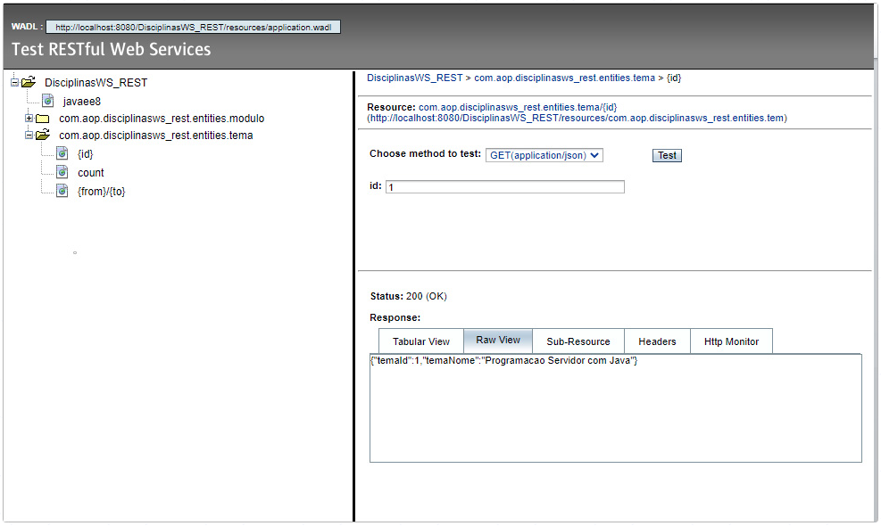 

Caso você tenha problemas em testar o Web Service, como erros informando não ter sido possível encontrar uma das tabelas de nosso projeto, configure, no GlassFish, um pool de conexões (JDBC Connection Pools) e um recurso JDBC (JDBC Resources). A seguir, modifique o arquivo “persistence.xml”, na aplicação Provedor (DisciplinasWS_REST), pasta “Other Sources/src/main/resources/META-INF/” e adicione a linha “<jta-data-source>NOME-DO-JDBC-RESOURCE-CRIADO</jta-data-source>”, dentro do nó “<persistence-unit name="my_persistence_unit">”. 
 
## Incluindo um novo recurso 
 
Para finalizar nosso projeto, vamos adicionar um novo recurso no Provedor: Um método para recuperar os módulos de acordo com o tema. Para isso, na aplicação Provedor (DisciplinasWS_REST), abra a classe “ModuloFacadeREST.java” (dentro da pasta “Source Packages”). Insira o método abaixo nessa classe: 
 
```java 
/* 
* Metodo para recuperar as informações do módulo conforme o tema_id informado 
*/ 
@GET 
@Path("/tema/{tema_id}") //Define a URI do recurso 
@Produces({MediaType.APPLICATION_XML, MediaType.APPLICATION_JSON}) 
public List<Modulo> findByTemaId(@PathParam("tema_id") Integer tema_id) { 
//Cria uma query selecionando os dados do modulo de acordo com o tema_id informado 
return em.createQuery( 
"SELECT m.moduloId, m.moduloNome, m.temaId FROM Modulo m WHERE m.temaId = :temaId") 
.setParameter("temaId", tema_id) 
.getResultList(); 
} 
``` 
 
Algumas observações sobre o código acima: 
@GET: Define o método HTTP através do qual o recurso estará disponível (aproveite que está com essa classe aberta e veja os demais métodos nela existentes). 
@Path: Define a URI do recurso. 
@Produces: Define os formatos de retorno de dados. Nesse caso, XML ou JSON. 
 
Após compilar e fazer o deploy do projeto, atualize a página de testes do Web Service: http://localhost:8080/DisciplinasWS_REST_Cliente/test-services.html 
 
Perceba que o recurso que criamos agora está disponível sob a árvore de recursos referentes ao Módulo. Expanda a árvore e clique no recurso “tema/{tema_id}. Insira 1 no campo “tema_id” e clique em “Test”. Veja na aba “Raw View” os dados referentes ao Módulo com tema_id igual a 1, em formato JSON. 
 
Nesse ponto, chegamos ao final da implantação do provedor e do cliente para fornecer e consumir Web Services no formato REST. Para encerrar, seguem algumas últimas observações: 
* Embora tenhamos usado alguns recursos facilitadores da IDE na criação de nossos projetos, os códigos gerados são totalmente funcionais e facilmente adaptáveis. 
* Abra as páginas web e as classes Java geradas ao longo de nossos projetos e analise os códigos. Procure entender os códigos de acordo com as regras que definimos ao longo das explanações. 
 
## Os web services e o "mundo real" 
 
As aplicações para fornecimento e consumo de Web Services, tanto SOAP quanto REST, que criamos ao longo deste tema, são aplicações compostas por códigos funcionais, que utilizam diversos recursos da linguagem Java e que podem ser facilmente adaptados para utilização em projetos, tanto voltados para fins de estudo quanto para fins profissionais, em aplicações reais. 
 
Com base nessa premissa, discutiremos, a partir de agora, em que situações, no dia a dia, podemos fazer uso de Web Services. Nesse sentido, veremos alguns casos de uso mais simples – e que você poderá utilizar caso esteja iniciando na área de desenvolvimento – e outros mais avançados – para você que já tem alguma experiência no desenvolvimento de aplicações. Para começar, recapitulemos alguns conceitos já vistos. A seguir, discutiremos os casos de uso em si. 
 
## Recapitulando conceitos 
 
### Web Services 
 
Um Web Service é um aplicativo projetado para suportar interoperabilidade entre máquinas através de uma rede (W3C, 2004). Logo, os Web Services são agentes de software cuja função é trocar mensagens, possuindo, para tal, um conjunto de funcionalidades definidas. 
 
Partindo dessa definição, podemos ver que as aplicações que criamos atendem às funcionalidades nelas mencionadas, ou seja, trata-se de aplicações, agentes de software, com a função de disponibilizar serviços – os Provedores SOAP e REST – e consumir serviços – os Clientes SOAP e REST. 
 
### Software 
 
Quando falamos de aplicações, estamos falando de softwares. Em relação a estes, os mesmos podem ser categorizados em alguns tipos, como: 
* Software de sistema. 
* Software de aplicação. 
* Software científico e de engenharia. 
* Software embutido. 
* Software para linhas de produtos. 
* Software para Web. 
* Software de inteligência artificial. 
Outros. 
 
Dentre essas categorias, cabe ressaltar a definição para o Software de Aplicação: Segundo Pressman (2106), são programas desenvolvidos para execução em um negócio específico ou em uma empresa específica. Essa definição cabe bem dentro das aplicações que desenvolvemos, uma vez que abordamos um tema específico, voltado para a área acadêmica, no qual manuseamos algumas Classes como “Tema” e “Módulos”, naturais do negócio em questão. 
 
#### API 
 
Uma Interface de Programação de Aplicação (API, acrônimo para Application Programming Interface) segundo Jacobson (2012), é uma maneira de duas aplicações de computador se comunicarem, uma com a outra, em uma rede (predominantemente a Internet) usando uma linguagem comum entendida por ambas. As APIs seguem uma especificação e isso implica que: 
* O provedor da API descreve exatamente qual funcionalidade a API oferecerá. 
* O provedor da API descreve quando e como a funcionalidade estará disponível. 
* O provedor da API pode estabelecer restrições técnicas, legais ou comerciais, como limites de utilização, entre outras. 
* Há um contrato estabelecido entre o provedor da API e quem dela faz uso, ficando o último comprometido a seguir as regras de uso estabelecidas pelo provedor. 
 
## Unindo conceitos 
 
Os três conceitos apresentados acima são de suma importância para abordarmos o uso de Web Services no mundo real, uma vez que se trata de conceitos intrinsecamente relacionados, como podemos perceber nas suas respectivas definições. Logo, é comum, no dia a dia, confundirmos os conceitos de Web Services e APIs, por exemplo. Frente a isso, cabe destacar algumas de suas diferenças: 
Podemos dizer que todos os Web Services são APIs, mas nem todas APIs são Web Services. 
Uma API pode usar outras formas de comunicação, além das utilizadas pelos Web Services (SOAP, REST e XML-RPC). 
Uma API, diferentemente do Web Service, não precisa de uma rede para funcionar. 
 
## Utilizando web services no mundo real 
 
Tomando como base as aplicações que criamos anteriormente, podemos pensar em algumas formas de como utilizá-las no mundo real. Por exemplo: Poderíamos ter um website que exibisse informações sobre os cursos oferecidos por uma instituição de ensino. Nesse site, dentre as funcionalidades disponíveis, poderia haver uma para listar todos os cursos e respectivas disciplinas, assim como o conteúdo de cada uma delas. 
 
Nesse caso, poderíamos consumir o Web Service desenvolvido (em SOAP ou REST) tanto a partir do “server side” – carregando as informações no carregamento da página – quanto a partir do “client side” – a partir de formulários de pesquisa e filtro de resultados carregando informações através de AJAX. 
 
Considerando o exemplo acima, você poderia questionar o porquê de utilizarmos Web Services para exibir o conteúdo em questão, uma vez que poderíamos utilizar outras técnicas, como consultas diretas ao Banco de Dados ou até mesmo páginas estáticas, sem o uso de Web Services. 

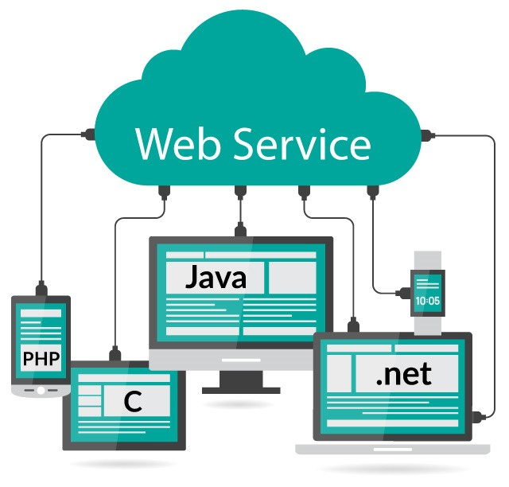 
 
Nesse caso, a justificativa para a utilização de Web Services está em podermos disponibilizar o conteúdo em questão para outras aplicações além do website. Através deles poderíamos alimentar um aplicativo Mobile, assim como fornecer informações para um sistema de terceiros – um Portal que reúna informações dos cursos de diversas instituições de ensino, por exemplo. Logo, a escolha por uma arquitetura baseada em Web Services deve levar esses fatores em conta. 
 
Imaginando agora outra situação real e um pouco mais avançada, na qual se aplique a utilização de Web Services, temos a Arquitetura de Microsserviços, uma abordagem de desenvolvimento de softwares que prega a decomposição de aplicações em uma gama de serviços – serviços esses disponibilizados através de uma interface de APIs. 
 
Em comparação com a abordagem tradicional de desenvolvimento de aplicações, normalmente monolíticas, ou seja, todos os módulos e funcionalidades fazem parte de um bloco único, a abordagem baseada em microsserviços prega que as aplicações sejam desmembradas em componentes mínimos e independentes que, embora separados, trabalhem juntos para realizarem as mesmas tarefas. Entre as vantagens da abordagem baseada em microsserviços, temos: 
* Capacidade de compartilhamento de processos e funções semelhantes entre várias aplicações. 
* Escalabilidade: Maior flexibilidade para acréscimo de novas funcionalidades. 
* Disponibilidade: Com a aplicação não sendo formada por um único bloco, diminui o risco de indisponibilidade total da mesma. 
 
Além das vantagens acima, e agora com foco no processo de desenvolvimento, há outras vantagens como: 
* Mais facilidade na criação de testes unitários. 
* Maior frequência de deploy e facilidade para implementação da entrega contínua. 
* Otimização no monitoramento e identificação de erros. 
Outras. 
 
### Exemplos de APIS comumente utilizadas 
 
Pagamento: Serviços que fornecem diversos meios de pagamento e contemplam toda a segurança relacionada a esse processo, além de também oferecerem serviços extras como identificação de fraudes, entre outros. 
 
Redes Sociais: A maioria das redes sociais fornecem APIs públicas que permitem tanto o consumo de suas informações como a realização de outras ações: Login utilizando as credenciais da rede social; realizar publicações e compartilhamentos; etc. 
 
Localização: Um bom exemplo dessas APIs é o Google Maps. 
 
Outros: Consulta de CEP; consulta de previsão de tempo; conversão de moedas; serviços de câmbio; serviços de plataformas de e-commerce; chatbots; etc. 
 

 

