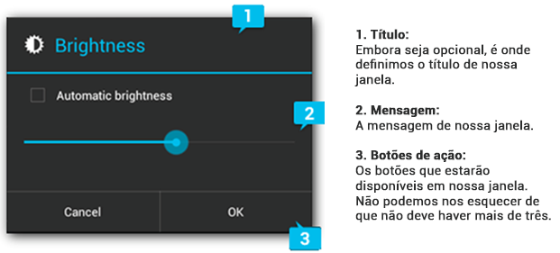

# Aula 6 - Mensagens e Notificações

## Toast

Como já discutido em aulas anteriores, a classe Toast(android.widget.Toast) é muito utilizada quando desejamos exibir mensagens de alertas para o usuário.

Esta exibe uma pequena tela, que pode ser personalizada, sem caráter permanente, ou seja, desaparecendo sem qualquer tipo de intervenção do usuário.

Para implementarmos este tipo de mensagem, é necessário obter uma instância de objeto Toast através do método estático, desta mesma classe, makeText(), que possui três parâmetros, conforme demonstrado abaixo:

`Toast.makeText (contexto, texto, duração)`

- No parâmetro contexto, definimos o contexto do aplicativo a ser exibido na mensagem;
- No parâmetro texto, definimos o texto a ser exibido na mensagem;
- No parâmetro duração, podemos definir o tempo de duração que a mensagem será exibida. A própria classe Toast nos oferece constantes para definirmos este tempo de duração, sendo elas Toast.LENGTH_SHORT e Toast.LENGTH_LONG.

Para exibir essa mensagem, precisamos apenas chamar o método show() do objeto.

## Notifications

Uma notificação Android nada mais é do que uma mensagem que aparece na barra de status Android. Seu objetivo é notificar ao usuário sobre algum evento, seja através de um ícone na barra de status, através de vibração, som ou acender de luzes do dispositivo.

É muito comum seu uso quando temos uma aplicação que roda em segundo plano, como, por exemplo, um aplicativo de mensagem instantânea, e não podemos ser interrompidos em uma aplicação que roda em primeiro plano, como, por exemplo, uma ligação telefônica.

### Opções de notificação

Além de exibir o ícone na barra de status, a classe Notification nos oferece mais três opções para configurar nossa notificação:

- Vibração: o dispositivo vibra rapidamente quando a notificação é recebida.

- Som: soa um alarme, seja um tom de chamada ou um tom gravado, quando a notificação é recebida.

- Luz: led pisca quando a notificação é recebida

A partir do Android 4.1 Jelly Bean, as notificações podem possuir os recursos:

- Visualização expansível: podemos expandir uma notificação usando o gesto "apertar e ampliar"

- Botões de ação: não estamos limitados a somente um botão de ação. Podemos adicionar até três botões.

- Estilos variados: BigTextStyle: Exibe um TextView com diversas linhas. BigInboxStyle: Exibe uma lista de informações.

- Tamanho maior: podem ser tão altas quanto 256 dp.

Para maiores informações você poderá acessar o link: https://developer.android.com/guide/topics/ui/notifiers/notifications.html

Para implementar uma notificação Android, precisamos obter a classe NotificationManager, visto que é um serviço do sistema não só executa, como gerencia as notificações.

As linhas abaixo demonstram os passos necessários para obter-se a NotificationManager:

`NotificationManager notificationManager =(NotificationManager) getSystemService(Context.NOTIFICATION_SERVICE);`

Após obtermos um NotificationManager, usamos a classe Notification.Builder para configurar nossa notificação.

Através dela, podemos configurar título, ícone e outros.

Isso é demonstrado no trecho de código abaixo:

```java

NotificationCompat.Builder builder = new NotificationCompat.Builder(this);
builder.setSmallIcon(R.drawable.ic_stat_notification);
builder.setContentIntent(pendingIntent);
builder.setAutoCancel(true);
builder.setLargeIcon(BitmapFactory.decodeResource(getResources(),R.drawable.ic_launcher));
builder.setContentTitle("BasicNotifications Sample");
builder.setContentText("Time to learn about notifications!");
builder.setSubText("Tap to view documentation about notifications.");


```

Devemos implementar, no mínimo, os métodos setSmallIcon(ícone pequeno), setContentTitle(título da notificação) e setContextText(Texto da Notificação).

Finalizando, implementamos um PendingIntent para o nosso builder.

Devemos criar somente um PendingIntent para todas nossas notificações.

## AlertDialog

Esta classe pode exibir uma caixa de diálogo com um título de até três botões.

Diferente da classe Toast, podemos interagir com o usuário pressionando botões.

Existem três regiões na AlertDialog que devemos configurar, conforme ilustrado na imagem abaixo:



Finalizando, para criar nossa AlertDialog, fazemos uso da classe AlertDialog.Builder.

Métodos:

- setTitle: define o título de nossa
- setMessage: define a mensagem de nossa AlertDialog
- setPositiveButton: define um botão para aceitar e continuar uma ação - (Exemplo: OK)
- setNeutralButton: define um botão que não cancela e nem confirma uma ação - (Exemplo: Notifique-me mais tarde)
- setNegativeButton: define um botão para cancelar a ação (Exemplo: Cancel)
- show(): exibe a AlertDialog

## ProgressDialog

Este tipo de caixa de diálogo exibe um indicador de progresso e uma mensagem de texto opcional. Seu range de progresso é de 0 a 10000.

Quando o sistema for efetuar uma operação demorada, podemos implementar a ProgressDialog. Com isso, o usuário não pensará que o aplicativo travou.

Existem dois tipos de ProgressDialog que podemos implementar:


O método setProgressStyle define o estilo da ProgressDialog, podendo ser STYLE_HORIZONTAL(Loop Finito) ou STYLE_SPINNER(Loop Infinito).

## DatePickerDialog

É muito comum precisarmos configurar datas em nossos aplicativos. Para tanto, o Android nos disponibiliza a classe DatePicker, que nos permite selecionar uma data.

Embora a DatePicker possa ser usada como um widgets independente, ela ocupa muito espaço. É prudente, então, implementá-la dentro de uma caixa de diálogo.

Pensando nisso, o Android nos poupou trabalho fornecendo a classe DatePickerDialog, que é bastante simples de se implementar.

## TimePickerDialog

Bastante similar à DatePickerDialog, a classe TimerPickerDialog nos permite manipular o horário de nosso sistema.
