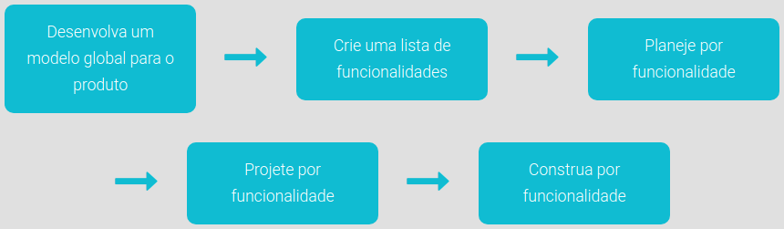

# Aula 1 - O que é engenharia de software

## O que é projeto? 

Projeto é um esforço temporário empreendido para criar um produto, serviço ou resultado exclusivo. Também pode ser descrito como: “uma original organização de pessoas e recursos para atingir um propósito específico, num período de tempo finito”. 

- Original: cada projeto é diferente de todos os outros. 

- Organização de pessoas e recursos: uma mistura de talentos e conhecimentos humanos, com recursos técnicos e físicos. 

- Para atingir um propósito específico: enfatiza a necessidade de os projetos terem sempre um objetivo tangível e realizável. 

- Num período de tempo finito: diferencia um projeto de um **processo**. 

## O que é software? 

Software é “uma sequência de instruções a serem executadas, com o objetivo de gerar informações a partir de uma série de dados coletados ou armazenados”. Também podemos definir como sendo “os programas que comandam o funcionamento de um computador”. 

Podemos classificar o software como a parte lógica cuja função é fornecer instruções para o hardware. 

**Composição do software** 

Um software é composto por módulos, instruções, bibliotecas, que gera um programa executável que lê dados denominados “entradas” ou inputs ao final do processo de desenvolvimento, e este, quando executado, recebe algum tipo de “entrada” de dados (input), processa as informações e libera uma “saída” (output) como resultado deste processamento. 

 

**Classificação do software** 

 

Podem os softwares podem ser classificados em três tipos: 

- **Software de Sistema**: é o conjunto de informações que gerenciam o hardware, que permitindo a interação entre o usuário e os periféricos do computador.
Exemplos: Windows e Linux. 

- **Software de Programação**: é o conjunto de ferramentas que permitem ao programador desenvolver sistemas informáticos. Exemplos: exemplo, C++, C#, VB, ASP, Delphi, GO. 

- **Software de Aplicação**: são programas de computadores que permitem ao usuário executar uma série de tarefas específicas em diversas áreas de atividade. Exemplos: planilha eletrônica, editores de texto e editores de apresentações (como PowerPoint). 

 

## Manifesto 

 

Diferentes tipos de projetos necessitam de diferentes métodos de gerenciamento. A abordagem ágil é muito utilizada em projetos orientados a valor. 

 

Tipos de programação ágil: 

1. **Programação extrema – XP (eXtreme Programming)**: Muito utilizado para equipes pequenas e médias que desenvolvem softwares com requisitos vagos e em constantes mudanças. A estratégia adotada é de constante acompanhamento e realização de vários pequenos ajustes durante o desenvolvimento de software. Tem valores fundamentais como: comunicação, simplicidade, feedback, coragem e respeito. Em um projeto, existem variáveis de controle do tipo custo, tempo, qualidade e escopo. O XP tem um foco explícito em escopo. Assim, recomenda-se a priorização de funcionalidades que representem o maior valor possível para o negócio. Um fator importante no XP é que ele incentiva o controle da qualidade como variável do projeto, pois o pequeno ganho de curto prazo na produtividade, ao diminuir a qualidade, não é compensado por perdas em médio e longo prazo. 

2. **Método Scrum**: Scrum não é um processo prescribente, ou seja, não descreve o que fazer em cada situação. Ele é usado para trabalhos complexos nos quais é impossível predizer tudo o que irá ocorrer. É um processo de desenvolvimento iterativo e incremental (criado em resposta às fraquezas do modelo em cascata) para gerenciamento de projetos e desenvolvimento ágil de software. Muito usado em trabalhos complexos, nos quais não há previsão exata do que se pretende desenvolver. No caso do Scrum, o projeto é dividido em ciclos (chamados de sprints), que correspondem à iteração. Projetos orientados a valor geralmente são realizados por profissionais do conhecimento e têm elevado grau de incerteza, por terem grande indefinição do escopo e elevado número de mudanças. 

 

### Valores do manifesto 

 

- **Indivíduos e interações** mais que processos e ferramentas; 

- **Software em funcionamento** mais que documentação abrangente; 

- **Colaboração com o cliente** mais que negociação de contratos; 

- **Responder a mudanças** mais que seguir um plano. 

 

### Indivíduos e interações mais que processos e ferramentas 

 

Observe que o primeiro valor do manifesto deixa claro uma importante mensagem. Processos e as ferramentas serão necessários no projeto; porém, devemos tentar concentrar a atenção da equipe sobre os indivíduos e interações envolvidos no projeto. 

 

Lembre-se que projetos são realizados por pessoas, e não por ferramentas, assim como os problemas são resolvidos por pessoas, e não por processos. 

 

Focando primariamente no desenvolvimento dos indivíduos envolvidos no projeto e enfatizando as interações produtivas e eficazes, melhoramos as chances de sucesso do projeto. 

 

Isso, no entanto, não quer dizer que processos e ferramentas não podem ajudar na conclusão de um projeto com êxito. Processos e ferramentas bem desenhados e adequados são ativos de grande importância. 

 

São as denominadas ferramentas CASE (Computer-Aided Software Engineering), que correspondem a todas as ferramentas que auxiliam os projetos de software, indo da análise de requisitos, modelagem até a implementação e os testes. 

 

Seu objetivo é auxiliar o desenvolvedor em todo o ciclo de desenvolvimento de software. 

 

### Software em funcionamento mais que documentação abrangente 

 

O segundo valor do manifesto destaca a necessidade de entregar o software. Projetos de software são iniciados com o objetivo de criar valor para a empresa por meio de um produto de software de alta qualidade, mas muitas vezes entregar em partes intermediárias (incrementos). 

 

Raramente a documentação é atualizada de forma completa e reflete a realidade do software, porém é essencial documentar o que é preciso em um software, sem exagero. 

 

Lembre-se sempre que software sem documentação é certamente problemático e dificulta o suporte e a manutenção. Contudo, uma documentação completa sem software não agrega absolutamente nada. 

 

### Colaboração com o cliente mais que negociação de contratos 

 

O terceiro valor reforça a necessidade de ser flexível e eficiente, em vez de rígidos e não cooperativos. É semelhante à diferença entre “estar certo” e “fazer a coisa certa”. 

 

Poderíamos construir o produto exatamente como originalmente especificado, mas se o cliente mudar de ideia ou de prioridade, você não concorda que devemos ser flexíveis e trabalhar para a nova meta? 

 

É claro que sim. As mudanças e ajustes deverão ser refletidos em aditivos contratuais ou ajustes, mas não deve ser um impeditivo para a continuidade do desenvolvimento e entrega do software. 

 

Atualmente existem diversas novas formas de contratos para acolher projetos com características ágeis, como pagamento de preço fixo por interação (ou sprint), pagamento por pontos, histórias ou outras que permitem a flexibilidade necessária para projetos orientados a valor. 

 

### Responder a mudanças mais que seguir um plano 

 

Em projetos com grande número de incertezas, é quase certo que os planos iniciais serão alterados. Em vez de investir esforços na tentativa de trazer o projeto de volta aos planos originais, nós deveríamos gastar esforço e energia para responder às inevitáveis mudanças no projeto. 

 

Observe que esse valor não está sugerindo abandonar o planejamento e apenas reagir às mudanças. Nós ainda precisamos planejar, mas temos de reconhecer que os planos iniciais foram criados quando conhecíamos menos sobre o projeto (no início), e com o desenvolvimento do trabalho, vamos precisar atualizar o plano. 

 

Muitos dos métodos ágeis focam em macroplanos superficiais (criação de histórias, product release, casos de uso etc.) e em um planejamento específico para iterações (ou sprints). 

 

**Os 12 princípios por trás do Manifesto (Agile Manifesto)** 

1. Nossa maior prioridade é satisfazer o cliente através da entrega contínua e adiantada de software com valor agregado; 

2. Mudanças nos requisitos são bem-vindas, mesmo tardiamente no desenvolvimento. Processos ágeis tiram vantagem das mudanças visando vantagem competitiva para o cliente; 

3. Entregar frequentemente software funcionando, de poucas semanas a poucos meses, com preferência à menor escala de tempo; 

4. Pessoas de negócio e desenvolvedores devem trabalhar diariamente em conjunto por todo o projeto; 

5. Construa projetos em torno de indivíduos motivados. Dê a eles o ambiente e o suporte necessário e confie neles para fazer o trabalho; 

6. O método mais eficiente e eficaz de transmitir informações para e entre uma equipe de desenvolvimento é através de conversa face a face; 

7. Software funcionando é a medida primária de progresso; 

8. Os processos ágeis promovem desenvolvimento sustentável. Os patrocinadores, desenvolvedores e usuários devem ser capazes de manter um ritmo constante indefinidamente; 

9. Contínua atenção à excelência técnica e bom design aumenta a agilidade; 

10. Simplicidade - a arte de maximizar a quantidade de trabalho não realizado é essencial; 

11. As melhores arquiteturas, requisitos e designs emergem de equipes auto-organizáveis; 

12. Em intervalos regulares, a equipe reflete sobre como se tornar mais eficaz e então refina e ajusta seu comportamento de acordo. 

 

 

## Declaração de interdependência 

 

Em 2005, a Agile Leadership Network - ALN criou a Declaração de Interdependência para Gerenciamento de Projetos Ágeis. 

 

Esse documento promove abordagens ágeis e adaptáveis para unir as pessoas, projetos e valor. Para alcançar esses resultados: 

- Aumentamos o retorno sobre o investimento, fazendo fluxo contínuo de valor, o nosso foco; 

- Entregamos resultados confiáveis por envolver os clientes em interações frequentes e compartilhamos a propriedade; 

- Esperamos a incerteza e a gerenciamos através de iterações, antecipações e adaptações; 

- Liberamos a criatividade e a inovação, reconhecendo que os indivíduos são a melhor fonte de valor, e criando um ambiente onde eles podem fazer a diferença; 

- Melhoramos o desempenho através de prestação de contas do grupo para resultados e responsabilidade compartilhada para a eficácia do time; 

- Melhoramos a eficácia e confiabilidade por meio de estratégias específicas, processos e práticas. 

 

## Outras metodologias e frameworks ágeis 

 

### Feature Driven Development – FDD (Desenvolvimento Dirigido a Funcionalidade) 

 

Foi concebido originalmente por Jeff de Luca. O FDD surgiu em Singapura, entre os anos de 1997 e 1999 com base no método Coad (Criado por Peter Coad – 1980/1990) e nos processos interativos e lean já utilizados por de Luca. 

 

É uma abordagem poderosa para o desenvolvimento de produtos. Busca o desenvolvimento por funcionalidade através de um requisito funcional do sistema. Uma equipe de projeto seguindo o método FDD primeiro desenvolve um modelo global para o produto, constrói uma lista de recursos e planeja o trabalho. 

 

A equipe então se move através da concepção e construção de iterações para desenvolver cada recurso. O FDD busca apresentar resultados frequentes, tangíveis e funcionais. 

 

**IMPORTANTE: O FDD pode atuar em conjunto com outras metodologias, principalmente com o Scrum, encaixando-se perfeitamente como metodologia de engenharia ágil de software com projeto ágil.** 

O FDD recomenda uma série de boas práticas oriundas da Engenharia de Software, como: 

- **Modelagem de domínio do objeto**: as equipes de explorar e explicar o domínio (ou ambiente de negócios) do problema a ser resolvido; 

- **Desenvolvimento por funcionalidade**: esta prática envolve decompor as necessidades em funcionalidades e definir períodos de desenvolvimento de uma ou mais funcionalidades em intervalos de duas semanas ou mais curtos; 

- **Propriedade individual (código)**: as áreas de código devem ter um único proprietário para garantir consistência, desempenho e integridade conceitual. **(Nota-se que é bem diferente da ideia de propriedade código coletiva do XP, que visa difundir o conhecimento para outros membros da equipe)**; 

- **Times dinâmicos**: devem-se formar pequenas equipes, de forma dinâmica, de acordo com características de cada projeto. Os times ajudam a mitigar o risco associado à propriedade individual; 

- **Inspeções**: são revisões que ajudam a garantir boa qualidade e design de código; 

- **Gerenciamento de configuração**: essa prática envolve rotulagem de código, controle de alterações e gerenciamento do código-fonte; 

- **Construções regulares**: através de entregas pequenas e constantes, o time incrementa o produto de software com a nova funcionalidade desenvolvida. Esta prática também permite criar facilmente uma versão demo; 

- **Visibilidade**: controle e acompanhamento do progresso dos resultados, baseados em funcionalidades desenvolvidas. 

 

Para comparação, é importante mostrar o percentual de tempo gasto em cada etapa: 

- Levantamento do domínio da aplicação = 1%; 

- Projeto = 40%; 

- Inspeção do projeto = 3%; 

- Desenvolvimento = 45%; 

- Inspeção do código = 10%; 

- Integração = 1%. 

 

### Dynamic Systems Development Method - DSDM (Metodologia de Desenvolvimento de Sistemas Dinâmicos) 

 

DSDM foi um dos pioneiros dos métodos ágeis. É uma metodologia de desenvolvimento bastante prescritiva, baseada em Rapid Application Development - RAD (Desenvolvimento Rápido de Aplicações), que enfatiza o envolvimento constante do usuário durante todo o projeto. 

 

Oferece uma metodologia para construir e manter sistemas que atendem restrições de prazo apertado, através do uso da prototipagem incremental. Cria três ciclos iterativos, abrangendo aspectos de um projeto ágil, analisando sempre a viabilidade e necessidade do negócio para a implementação. 

 

**Ciclo de vida do DSDM** 

 

O ciclo de vida do DSDM é iterativo e incremental. Portanto, a solução não pode ser entregue à empresa de uma só vez, mas de uma série de incrementos que facilitam a solução com cada entrega. 

Dessa forma, as necessidades de negócios urgentes podem ser priorizadas e abordadas cedo, enquanto características menos importantes são implementadas e entregues mais tarde. 

A natureza iterativa permite que os representantes de negócios vejam e se envolvam no trabalho em construção, analisando e já sugerindo os ajustes e alterações necessárias durante o desenvolvimento de um incremento da solução. 

O DSDM pode ser utilizado sozinho como metodologia ágil, porém o seu uso com outros métodos e boas práticas de gerenciamento de projetos ou técnicas de desenvolvimento detalhados podem contribuir para a melhora nos processos e resultados. 

 

Os ciclos são: 

1. A iteração de modelos funcionais: neste ciclo, é produzido um conjunto de protótipos incrementais que demonstram a funcionalidade para o cliente; 

2. A iteração de projeto e desenvolvimento: neste ciclo, revisitamos os protótipos desenvolvidos durante a iteração de modelos funcionais para assegurar que cada um tenha passado por um processo de engenharia para capacitá-los a oferecer aos usuários finais valor de negócio em termos operacionais; 

3. Implementação: no qual colocamos a última versão do incremento de software (um protótipo operacionalizado) no ambiente operacional. 

 

**ATENÇÃO: Em qualquer dos casos, o trabalho do desenvolvimento do DSDM continua, retornando à atividade de iteração do modelo funcional.** 

### Crystal 

 

Crystal é uma família de metodologias (Família Crystal de Metodologia) desenvolvidas por Alistair Cockburn, em meados da década de 1990. 

 

Ela inclui um grande número de métodos diferentes, que são selecionados de acordo com as características do projeto a ser desenvolvido, destinadas para projetos que vão desde aqueles executados por pequenas equipes de desenvolvimento com baixa criticidade e provê abordagens até com grandes equipes que implementam sistemas de alta criticidade. 

 

Características comuns à família Crystal: 

- Desenvolvimento incremental com ciclos de no máximo quatro meses; 

- Ênfase maior na comunicação e cooperação das pessoas; 

- Não limitação de quaisquer práticas de desenvolvimento, ferramentas ou produtos de trabalho; 

- Incorporação de objetivos para reduzir produtos de trabalho intermediários e desenvolvê-los como projetos evoluídos; 

- Utilização de cores diferentes para indicar o "peso" do projeto e qual metodologia aplicar. 

 

Princípios ágeis da família Crystal: 

- **Entregas frequentes** 

- **Melhoria reflexiva**: verificação constante e busca contínua de promoção de melhoria e implementação de novos métodos; 

- **Comunicação osmótica**: membros são alocados próximos uns dos outros para melhorar a comunicação, conceito também conhecido como War Room (Sala de Guerra); 

- **Segurança pessoal**: o Crystal defende um ambiente seguro para que todos possam apresentar suas dúvidas e questionamentos; 

- **Foco**: cada membro do time deve saber o que precisa fazer e ter liberdade suficiente para trabalhar no que é necessário; 

- **Fácil acesso ao usuário**: fácil acesso aos usuários chaves e rápido feedback; 

- **Ambiente automatizado**: testes automatizados, controle de configurações, integração contínua etc. 