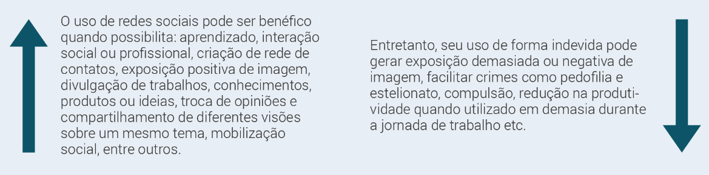

# Aula 2

**Conceito da neutralidade:** O conceito da neutralidade do conhecimento científico ou da tecnologia tem sua origem nas próprias condições e seu surgimento como tal, a partir do século XV, como uma oposição ao conhecimento (ou pensamento) religioso.

**Determinismo tecnológico:** Tanto o conceito de neutralidade quanto o do determinismo tecnológico ainda mantém em nossa sociedade e estão disseminados enquanto "senso comum" no imaginário social, apesar da existência de debates, divergências e controvérsias que indiquem outras visões, como é o caso da visão dialética.

**Conceito de Associação em Rede:** a tecnologia é inserida em uma rede de relações para a qual ocorrem os diferentes aspectos da vida em sociedade tendo como protagonistas diferentes atores, que se movimentavam em redes, movidos por interesses específicos.

Para Hughes, os sistemas de produção e distribuição incorporam os recursos físicos, intelectuais e simbólicos da sociedade que os constrói. Em cada sociedade e em momentos históricos distintos, esses sistemas, "envolvem certos comoponentes técnicos básicos e conexões, mas variações no essencial básico revelam frequentemente variações em recursos, tradições, arranjos políticos e práticas econômicas de uma sociedade para outra e de um tempo para outro.

> A ciência e a tecnologia, bem como seus fatos e artefatos, não são neutros e universais,  cabendo ao profissional avaliar antecipadamente os impactos de sua ação no contexto regional e organizacional de sua atuação, adotando uma postura ética e sustentável.

> A abordagem da associação em rede nos traz uma visão mais ampla das relações entre sociedade, ciência e tecnologia com atores protagonistas que, em sua atuação em rede, geram fatos e artefatos tecnológicos, de acordo com interesses específicos, direcionando a evolução científica e tecnológica em um determinado momento.

# Aula 3

A sociedade está sempre em constante mutação e evolução e, até chegarmos ao período atual,
podemos perceber claramente quatro fases principais de evolução da sociedade:

1. **Sociedade primitiva**
   1. Baseada na economia de subsistência;
   2. Uso do fogo e de armas;
   3. Tribos nômades;
   4. Linguagem oral e figurativa.
2. **Sociedade agrícola**
   1. Fixação à terra;
   2. Produção agrícola;
   3. Comércio;
   4. Valorização da terra e posses;
   5. Forte influência da igreja e das religiões;
   6. Linguagem oral e manuscrita.
3. **Sociedade industrial**
   1. Revolução industrial;
   2. Produção em série;
   3. Concentração em cidades;
   4. Processos industriais;
   5. Valorização do capital;
   6. Desenvolvimento de máquinas;
   7. Noção de mercado;
   8. Imprensa e livros;
   9. Invenção do rádio.
4. **Sociedade do conhecimento**
   1. Tecnologias da informação;
   2. Geração do conhecimento como atividade principal;
   3. Noção do espaço virtual;
   4. Informação e tecnologia como fonte de riqueza;
   5. Mercado globalizado;
   6. Desenvolvimento intensivo de hardware e software;
   7. Era das parcerias, da intenção e do relacionamento;
   8. Internet e realidade virtual, redes digitais, redes de conhecimento, redes de relacionamento.

O desenvolvimento social e econômico da sociedade do conhecimento está baseado na informação como meio de criação de conhecimento, o qual desempenha papel fundamental na produção de riqueza e na contribuição para o bem-estar e qualidade de vida dos cidadãos.

### Sociedade em rede
> Uma sociedade em que as estruturas sociais e as atividades principais estão organizadas
em torno das redes de informação eletronicamente processadas.

Combinação de redes sociais e de meios que dão forma à sua organização e às estruturas importantes em todos os níveis: individual, organizacional e societal.
Lógica própria do trabalho em rede que modifica substancialmente a operação e os resultados nos processos de produção.
As redes transformaram-se nas unidades básicas da sociedade contemporânea.

Uma rede social é aberta, pode se fazer e desfazer com rapidez e possibilita relacionamentos não hierárquicos entre as pessoas.
Numa rede social podem ser compartilhados informações e conhecimentos, interesses, ações para o alcance de objetivos comuns etc.
Essa disseminação das redes sociais somente pode ser alcançada devido às tecnologias desenvolvidas pela área de TI.

### Reestruturação Produtiva e Sociedade

Nova forma de organização da produção possibilitada pelas tecnologias da informação e comunicação. Nesse novo modelo são utilizadas estratégias para reestruturar a produtividade.

### Cadeia de Negócios

Algumas sociedades adotaram o modelo americano de Sociedade da Informação, baseado nas empresas para organização da cadeia de negócios.

Nesse modelo, as redes de negócios baseiam-se em grandes empresas líderes em parceria com universidades para desenvolvimento de projetos. O foco passa a ser no cliente e os produtos e serviços passam a ser adequados a ele e aos seus desejos. A inovação é a mola mestre nesse modelo, em que fornecedores e empresas líderes se aliam em cadeias de negócios para consolidar posição no mercado.

### OCDE

É uma organização internacional e intergovernamental que agrupa os países mais industrializados da economia do mercado, com sede em Paris, França.

Através da OCDE, os representantes dos países membros se reúnem para trocar informações e definir políticas para maximizar o crescimento econômico e o desenvolvimento desses países na atual Sociedade da Informação e do Conhecimento.

### O Livro Verde

As sociedades organizaram cada qual uma proposta de Sociedade da Informação.

No Brasil, foi elaborado o Livro Verde, um documento que tem o propósito de elucidar os objetivos do projeto e de uma proposta política, traduzindo uma oferta de desenvolvimento da informática e da Internet.

# Aula 4

## A Revolução Digital

**Convergência tecnológica:** Utilização de uma única infraestrutura de tecnologia para prover serviços que, anteriormente, requeriam equipamentos, canais de comunicação, protocolos e padrões independentes.

A internet atualmente está buscada no conceito de rede de arquitetura aberta.

**Negócios Digitais**

A partir da possibilidade dos negócios eletrônicos, muitas oportunidades foram criadas com base na internet, subvertendo a lógica de funcionamento dos mercados existentes, entre elas:

* Fácil acesso à informação;
* Redução dos custos de transação;
* Surgimento de novos agentes na ponta da cadeia produtiva, substituindo os tradicionais intermediários;
* Eliminação das distâncias físicas;
* Funcionamento ininterrupto.

## Conhecimento Digitalizado

O conhecimento está relacionado a mente das pessoas e como elas processam as informações.
Digitalizar o conhecimento é um processo complexo e que exige ferramentas tecnológicas apropriadas.

## Tecnologia Onipresente

Essa geração de nativos digitais possui algumas características importantes, como:
* Independência e forte interação em rede;
* Abertura intelectual;
* Colaboração;
* Interligação dos intelectos para a conscientização organizacional;
* Cultura de Inovação;
* Empresa em tempo real.

## Inclusão e Exclusão Digital

A exclusão digital está diretamente relacionada aos índices de miséria e de analfabetismo, ainda está muito altos no Brasil.
**Pobreza e exclusão digiatl estão diretamente relacionadas.**

**Migrante digital:** pessoa que não nasceu na era digital que está aprendendo e lidando com a tecnologia.

**Nativo digital:** é aquele que nasceu no meio da tecnologia digital.

# Aula 5

## Conceito de TIC

Tecnologia da informação e Comunicação (TIC) constitui-se num conjunto de recursos tecnológicos de informação e comunicação, utilizados com fins específicos e de forma integrada.

## Impactos das TIC na sociedade

Convergência Tecnológica: Utilização de uma única infraestrutura de tecnologia para prover serviços que, anteriormente, requeriam equipamentos, canais de comunicação, protocolos e padrões independentes.

## Relação dialética entre a sociedade e as TIC

A evolução social e tecnológica é um processo dialético no qual a sociedade determina mudanças, inovações e evolução na tecnologia, bem como a tecnologia e seu uso determinam mudanças no comportamento, na produção e na vida das pessoas.

A democratização da informação, quando possibilita a inclusão digital, pode trazer aos cidadãos as mesmas oportunidades de acesso à foramção e qualificação, bem como auxiliar no desenvolvimento de uma consciência crítica em relação ao uso das TIC, com proveito de suas vantagens e atenção às suas desvantagens para a sociedade.

**Síndrome do toque fantasma:** achar que o celular tocou quando não tocou.

**Nomofobia:** fobia de uma pessoa ficar sem aparelho celular.

**Depressão do facebook:** ninguém mostra coisa ruim e você acha que só você tem problemas e que a vida de todos é perfeita.

**Jogos online:** dependência de jogos online, vício.

**Hipocondria digital:** você sintomas nos outros e acha que tem também.

<table>
  <thead>
    <tr>
      <th colspan="2" align="center">As TIC constituem-se em uma grande força em áreas, como:</th>
    </tr>
  </thead>
  <tbody>
    <tr>
      <td>Educação</td>
      <td>Engenharia</td>
    </tr>
    <tr>
      <td>Finanças</td>
      <td>Produção de bens</td>
    </tr>
    <tr>
      <td>Indústria</td>
      <td>Imprensa</td>
    </tr>
    <tr>
      <td>Planejamento</td>
      <td>Biblioteca</td>
    </tr>
    <tr>
      <td>Transporte</td>
      <td>Centros de documentação</td>
    </tr>
    <tr>
      <th colspan="2">Possibilitando novas formas de organização e acesso às informações e ao conhecimento, baseadas numa arquitetura de rede e âmbito global.</th>
    </tr>
  </tbody>
</table>
