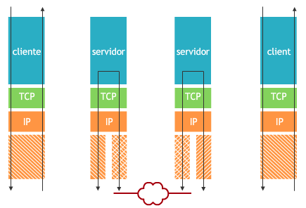
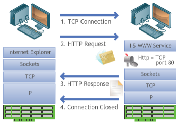

# Aula 2 - Principais protocolos da internet

## O que é protocolo?

**Protocolo** é uma padronização que permite a comunicação entre processos.

**Emissor (codificador) -> Mensagem (codificada) -> Receptor (decodificador)**

Durante o processo de emissão e recepção, pode haver um ruído na transmissão, isto é, **nem tudo aquilo que foi enviado foi recebido seja por qualquer motivo**. Para tentar minimizar este problema, pode haver uma rotina de verificação que estabeleça uma validação entre o que foi codificado e o que foi recebido. Esta rotina de validação é normalmente implementada no protocolo. Vale lembrar que nem todos os protocolos implementam esta validação.

A verificação de integridade de transmissão e recebimento conferida pelo protocolo TCP/IP trouxe para a Internet um ganho expressivo, pois, através destes, outros surgiram.

## Como funciona o protocolo TCP/IP?

O fluxo resumido do protocolo TCP/IP é o seguinte:

o aplicativo cliente se comunica com um servidor através do endereço IP, **enviando ao servidor uma informação que passa pelo meio lógico**.

na outra ponta, existe um outro servidor que, ao receber essa informação, **gera uma ação que pode ser despachá-la para outro servidor ou armazená-la para que um cliente possa buscá-la**.

o aplicativo cliente entra em contato com o servidor e **resgata a informação**.

## Envio e recebimento de emails

Para envio e recebimento de emails, se usa os protocolos SMTP, POP3, IMAP, FTP, HTTP.

### SMTP

Este protocolo opera na porta 25, e ao receber uma mensagem, busca identificar o endereço do servidor SMTP, indicado no email do cliente através da chave MX do serviço de resolução de nomes de domínios (DNS).

### POP3

Este protocolo permite a busca de emails no servidor de correio através da porta 110, baixando do servidor às mensagens de email para a máquina do cliente. Este protocolo não permite manipulações de mensagens no servidor, pois entende que você quer baixá-las na sua máquina.

### IMAP

Usa a porta 143 para acessar o serviço IMAP. Os sites com webmail normalmente usam essa técnica. Seu email fica armazenado no servidor até que você queira apagá-lo, podendo criar pastas virtuais, sincronizá-las offline, aplicar filtros entre outros recursos.

Tanto IMAP quanto POP3 são utilizados para ler mensagens e não enviá-las.

### FTP

Protocolo para transferência de arquivos é um dos mais antigos em uso na internet. Exclusivamente para lidar com arquivos, envio (upload) e recebimento (download). A vantagem é a especialização do serviço. Atende as portas padrão 20 e 21, sendo que a 20 é ftp-data e a 21 ftp. Pode ser usada para qualquer formato de arquivo.

### HTTP

Manipula como padrão arquivos escritos em HTML que podem ter extensões html ou htm que são interpretadas pelo servidor web. Os programas clientes deste protocolo são chamados de navegadores web ou web browsers.

Cada página visitada, também chamada de Home Page, está abrigada em um site que em português chama-se sitio (local). Desta forma, para acessarmos uma página na internet, precisaremos de um endereço web chamado URL _(Uniform Resource Locator, ou seja, URL é um Localizador de Recursos Universal)_.

URL: protocolo://endereço

  - exemplo: **http://www.estacio.br**

URL com site seguro, adicionando o s no protocolo:

  - exemplo: **https://www.estacio.br**

  - Neste caso, o servidor Web, indica ao navegador web que o site é seguro, utilizando o protocolo _Secury Sockets Layer (SSL)_.

Na figura abaixo, uma negociação entre o navegador e o servidor www.

Passo 1: o cliente estabelece um conexão TCP via navegador Web.

Passo 2: faz uma requisição HTTP para servidor Web que utiliza de forma padrão a porta 80 para este atendimento.

Passo 3: O servidor Web gera uma resposta HTTP transferindo uma página Web para o navegador Web do cliente e fecha a conexão.
