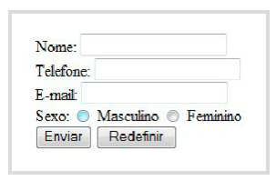

# Aula 7 - Formulários

## Modelo básico

No modelo básico de um formulário temos uma caixa de entrada definida através da tag <\input> e um botão para encaminhar os dados, definido pela tag <\submit>. Repare que no caso do exemplo anterior utilizamos também o tipo radio, cuja função é apresentar ao usuário um objeto do tipo botão de rádio que se selecionado desmarca a outra opção.

```html
<form action="http://www.estacio.br/cadastro.jsp" method="post">
  <p>
    <label for="nome">Nome: </label>

    <input type="text" id="nome" /><br />

    <label for="tel">Telefone: </label>

    <input type="text" id="telefone" /><br />

    <label for="email">E-mail: </label>

    <input type="text" id="email" /><br />

    <label for="sexo">Sexo: </label
    ><input type="radio" name="sexo" value="M" /> Masculino
    <input type="radio" name="sexo" value="F" /> Feminino<br />

    <input type="submit" value="Enviar" /> <input type="reset" />
  </p>
</form>
```



### Tag <input>

Temos alguns atributos essenciais para o bom entendimento de suas funcionalidades:

  - `type`: determina qual o tipo de campo de entrada será. As opções possíveis são **texto, enviar e senha**. No caso de campos texto, o `type="text"`, para botões de envio, o `type="submit"` e, no caso de senha, o `type="password"`.

  - `name`: Atribui um nome a um determinado campo de referência de modo que você pode, mais tarde, fazer referência a ele em um tratamento via linguagem de programação.

  - `size`: Define a largura horizontal do campo. A unidade de medida é em espaços em branco.

  - `maxlength`: Define o número máximo de caracteres que podem ser inseridos.

## Método de envios de dados

Existem dois tipos de ação a serem tomadas usando formulários em HTML. Uma delas, a mais comum, é o método _POST_ e a outra é o método _GET_.

GET: Através do método HTTP "get", os dados são anexados ao URI especificado pelo atributo.

POST: Através do método HTTP "post", os dados são anexados ao corpo do formulário e enviados ao agente a cargo do processamento.

O método GET permite que o usuário grave no seu navegador a URI (Universal Resourse Identifier) com todos os parâmetros. Isto pode ser bom ou ruim pela óptica da segurança de informações. Já o POST esconde estas informações do usuário no endereço do navegador. Assim ao usarmos POST não explicitamos os parâmetros utilizados.

## Atributos

### Caixa de entrada de texto multilinha

Este tipo de caixa é muito especial, pois permite a entrada de uma grande quantidade de texto em uma única página, tal como um editor de texto. Contudo, ela não aceita a formatação de textos como um editor visual.

Atributos:

  - rows – indica número de linhas em um objeto textarea.

  - cols - indica número de linhas em um objeto textarea

  - name – especifica o nome da textarea

  - wrap – controla a quebra de linhas (off, virtual, physical).

  - Off – desliga a quebra de linhas,

  - Virtual – mostra a quebra de linhas colocando um <ENTER> ao final.

  - Physical – inserem quebras de linhas quando necessário e as envia no processamento.

### Caixa de entrada de texto

A caixa de entrada é utilizada para entrada de dados como um campo em um formulário. Você pode utilizá-lo, por exemplo, para solicitar nome, endereço, telefone, CPF para o usuário em seu site. Seu limite é bem menor que aquele definido na Área de Texto.

Atributos:

  - size – especifica quantos caracteres serão apresentados dentro da caixa

  - maxlength - especifica o tamanho máximo da caixa

  - name - especifica o nome da caixa

  - value - especifica o valor padrão contido na caixa

### Caixa de senha

Com esta caixa, podemos digitar sem que os usuários próximos saibam qual o texto que está sendo digitado. Os caracteres são substituídos pelo \*.

Atributos:

  - size – especifica quantos caracteres serão apresentados dentro da caixa

  - maxlength - especifica o tamanho máximo da caixa

  - name - especifica o nome da caixa

  - value - especifica o valor padrão

### Caixa de verificação

Muito utilizada para a marcação de valores do tipo múltipla escolha.

Atributos:

  - name - especifica o nome da caixa

  - value - especifica o valor padrão

### Botão de rádio

Muito utilizada para a marcação de valores do tipo múltipla escolha com uma única resposta.

Atributos:

  - name - especifica o nome da caixa

  - value - especifica o valor padrão

### Caixa de seleção

Este objeto permite que carreguemos uma lista com muitos elementos pré-selecionando um dos itens. Ela é muito utilizada para a carga de UF em sites.

Atributos:

  - name - especifica o nome do campo

  - size - número de itens na lista

  - multiple – permite que se faça seleção múltipla

  - option – itens individuais no menu. Caso queira pré-selecionar algum, utilize selected ao lado do item

  - value – valor padrão

### Campo invisível

Algumas vezes queremos pré-processar algum dado utilizando, por exemplo, Javascript e submetê-lo sem que o usuário intervenha. Assim, o objeto hidden pode ser utilizado para este propósito.

Atributos:

  - name - especifica o nome do campo

  - value – valor padrão

### Botão cancelar

Através deste botão, o usuário poderá limpar os dados inseridos em seu formulário antes de submetê-lo.

Atributos:

  - name - especifica o nome do campo

  - value – texto descrito no botão

### Botão enviar

Através deste botão, o usuário poderá enviar seu dados que estão no formulário. Após o envio, normalmente não existe opção desfazer, pois o processamento deverá acontecer no servidor e não mais no cliente.

Atributos:

  - name - especifica o nome do campo

  - value – texto descrito no botão

### Imagem

É possível criar um botão utilizando uma imagem. O processo é semelhante ao do exemplo do Botão Enviar.

Atributos:

  - name – nome da imagem
