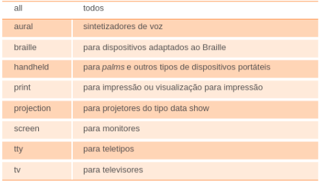
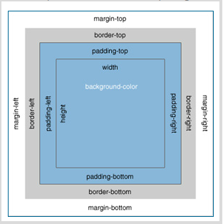

# Aula 9 – Folhas de estilo em cascata

## O que são folhas de estilos em cascata?

Folhas de Estilo em Cascata ou CSS (Cascade Style Sheet) são estilos aplicados em HTML. A linguagem HTML, na sua concepção, não foi projetada para ser utilizada na elaboração de páginas com layouts sofisticados. Como a HTML é limitada, foi necessário desenvolver uma alternativa capaz de manipular os elementos para garantir que uma página não fosse mais textos e imagens corridas ou, no máximo, contidas em tabelas.

As Folhas de Estilos em Cascatas têm como funções:

Definir a aparência das páginas em um único lugar, em vez de repetir-se uma e outra vez no site.

Facilmente alterar a aparência das páginas, mesmo depois que eles são criados.

Definir o tamanho da fonte e os atributos semelhantes com a mesma precisão que você tem com um processador de texto.

Definir a posição do conteúdo das páginas com precisão de pixel.

Definir estilos personalizados.

Definir as camadas sem a necessidade de pop-ups.

## Aplicando folhas de estilo em cascata

Existem 3 formas de se aplicar estilo às páginas em HTML.

In-line

Interna

Externa

A sintaxe do CSS segue o formato seletor com uma ou mais declarações:


Seletor
Declaração
{color:
Propriedade
Valor
Declaração
font-size:
Propriedade
12px:}
Valor

Tudo deve ser descrito em minúsculas.

Desta forma, pode-se utilizar mais de uma declaração para o mesmo seletor. Isto é muito mais poderoso do que se podia fazer em HTML puro.

Para se declarar um estilo, tem-se que determinar como ele será implementado no código: junto ao elemento, interno ao código ou externo ao código.

### In-line

Esta forma descreve o estilo diretamente na tag HTML correspondente. Isto, por um lado, tende a facilitar o processo, mas, por outro, dificulta a manutenção do código.

Exemplo:

```html
<p style="color: red">texto</p>
```

### Interno

Também pode-se implementar os estilos dentro do código da página. A diferença em relação ao anterior é que, neste caso, o estilo não é definido direto no elemento (tag), mas em uma parte do código cuja aplicação é indicada através de recursos de identificação. Assim, a manutenção da página fica mais fácil, pois, ao se alterar o estilo, todos os elementos associados a ele passam a sofrer essa alteração.

Para que se defina os estilos internos da página, deve-se criá-los dentro de tags <style..> </style>, dentro do bloco <head></head>, como no exemplo a seguir.

```html
<html>
  <head>
    <style type="text/css">
      p {
        color: red;
      }
    </style>
  </head>

  <body>
    <p>Primeiro parágrafo.</p>

    <p>
      Segundo parágrafo. Este também foi alterado, pois o estilo aplicado a
      parágrafo é quem manda.
    </p>
  </body>
</html>
```

Repare que o type é text/css. Além do type, pode-se definir para que tipo de mídia (media) se quer aplicar estes estilos. Isso é particularmente importante quando queremos diferenciar os estilos por dispositivos, no caso da acessibilidade.

Podemos ter as seguintes mídias:


aural
braille
handheld
print
projection
screen
tty
todos
sintetizadores de voz
para dispositivos adaptados ao Braille
para palms e outros tipos de dispositivos portáteis
para impressão ou visualização para impressão
para projetores do tipo data show
para monitores
para teletipos
para televisores

A omissão da declaração media determina o valor padrão all.

### Externo

Esta, com toda a certeza, é a maneira mais prática de se manter um portal. Através de arquivos externos, economiza-se na manutenção de dezenas ou centenas de páginas, pois basta que se altere um arquivo para que tudo aconteça no portal como um todo.

O arquivo css deve ser um arquivo com extensão css e estar dentro do contexto da sua aplicação, isto é, dentro de um diretório onde o servidor Web possa alcançá-lo para o seu navegador.

Veja no exemplo que segue. Será criado um arquivo chamado estilo_portal.css com o conteúdo abaixo.

estilo_portal.css

```css
body {
  background-color: beige;
}

h1 {
  color: blue;
  font-size: 20pt;
}

hr {
  color: navy;
}

p {
  font-size: 11pt;
  margin-left: 15px;
}

a:link {
  color: green;
}

a:visited {
  color: black;
}

a:hover {
  color: red;
}

a:active {
  color: yellow;
}
```

exemplo.html

```html
<!DOCTYPE html PUBLIC "-//W3C//DTD XHTML 1.0 Strict//EN" "http://www.w3.org/TR/xhtml1/DTD/xhtml1-strict.dtd">

<html>
  <head>
    <title>Exemplo CSS</title>

    <link rel="stylesheet" type="text/css" href="estilo_portal.css" />
  </head>

  <body>
    <h1>Estilos - Externos</h1>

    <p>Aplicação de estilos externos</p>

    <p><a href="http://www.estacio.br" target="_blank">UNESA</a></p>
  </body>
</html>
```

Para cada situação, é preciso que se defina o tipo de documento a ser interpretado através da declaração de DTD (Document Type Definition). Isto não é complicado, mas precisa ser feito de forma consciente, pois alguns programas editores de código (X)HTML os definem com base no padrão do fabricante do software e não de acordo com padrão pessoal.

## Seletores

Seletores estão para CSS como tags estão para HTML. O seletor é uma strings que identifica o elemento HTML ao qual a regra será aplicada.

seletor {propriedade:valor}
é o aspecto a ser alterado.
é o atributo ou caracteristica a ser estilizada, por exemplo, color, font-wegh.
irâ identificar o elemento HTML ou XHTML.

Exemplo:

```css
body {
  font-size: 0.8em;

  color: navy;
}
```

Neste caso, aplica-se ao corpo da página uma formatação de texto com letras de tamanho 0.8em na cor navy.

### Simples

Onde a regra se aplica ao tipo e/ou aos atributos do elemento e não à posição do mesmo. Em resumo, é aquele seletor constituído de um só elemento.

Exemplo: h1, p.

### Contextual

Onde o seletor é associado aos elementos de acordo com as posições que ocupam na estrutura do documento. Na verdade, o seletor contextual é um conjunto de seletores simples.

Exemplo: h1.inicio b.

### Universais

Aplicável a todos os elementos.

Exemplo: \* {color : red;}

### Classes

Este seletor pode ser aplicado a qualquer elemento (X)HTML, tendo em vista que se possui a prerrogativa de se criar um nome para ele.

Exemplo: .estilo_topo { color: navy;} – É importante perceber que, neste caso, criou-se uma classe chamada estilo_topo. Dessa forma, ao ser aplicado, tem-se a cor navy no elemento associado.

### Pseudo-classes

São complementações feitas aos seletores que são criadas para acessar as informações que não estão disponíveis na árvore do documento.

Sintaxe: **seletor:pseudo-classe {propriedade:valor}** ou, ainda, **seletor.classe:pseudo-classe {propriedade:valor}**

**Âncora**

a:active {color:#0000FF} /_ link selecionado _/

a:link {color:#FF0000} /_ link ainda não visitado_/

a:visited {color:#00FF00} /_ link visitado_/

a:hover {color:#FF00FF} /_ mouse sobre o link _/

**:first-child**

Define um elemento específico que é o primeiro filho de um elemento.

Exemplo:

```css
p:first-child {
  color: red;
}
```

**:focus**

Define o foco sobre um elemento ao se clicar nele. Este recurso é muito utilizado na elaboração de formulários.

Exemplo:

```css
input:focus {
  background-color: aqua;
}
```

### ID

Este é um seletor que se identifica com um único elemento (X)HTML, isto é, ele não pode ser aplicado a outro elemento dentro do documento.

Sua identificação é através do sinal # junto ao nome.

Exemplo:

```css
#estilo_cabecalho {
  color: #000080;

  background: #ffcc33;
}
```

### Descendentes ou encadeados

São todos os elementos que descendem de outro.

Exemplo:

```css
ul li a {
  color: #80ff00;
}
```

### Texto

Através das folhas de estilo em cascata, será possível alterar as fontes e as propriedades das mesmas na página.

Para isso, faz-se necessário que se aprenda bem as seguintes propriedades:

**font-family**: É a fonte propriamente dita. Exemplo: `font-family: "Times New Roman"`

**font-size**: Define-se, utilizando esta propriedade: o tamanho da fonte. Ex: `font-size: 12px`.

**font-weight**: É o peso da fonte. Ex: `font-weight: bold` ou `font-weight: normal`

**font-style**: É a inclinação do texto. Se ele está, ou não, em itálico. Ex: `font-style: italic` ou `font-style: normal`

**text-decoration**: O texto pode ter alguns elementos de marcação.

• `text-decoration: overline`, apresenta uma linha sobre o texto.

• `text-decoration: line-through`, apresenta uma linha atravessando o texto.

• `text-decoration: underline`, sublinha o texto. Cuidado, pois essa opção confunde o usuário com link.

**text-transform**: São recursos interessantes, pois pode-se trabalhar maiúsculas, minúsculas e letras capitalizadas.

• `text-transform: capitalize`, apresenta a primeira letra de cada palavra em maiúscula.

• `text-transform: uppercase`, apresenta todas as letras em maiúsculas.

• `text-transform: lowercase`, apresenta todas as letras em minúsculas.

• `text-transform: none`, resseta qualquer estilo neste contexto.

**text-spacing**: Cuida do espaçamento, identação e alinhamento entre letras e palavras.

• `letter-spacing` e `word-spacing` – espaçamento entre letras e palavras respectivamente. O padrão é normal.

• `line-height` – configura a altura entre as linhas. tal como ocorre com o espaçamento entre parágrafos no editor de texto. Múltiplos do tamanho da fonte ou %. O padrão é normal.

• `text-align` – alinha o texto pela direita, ao centro, à esquerda ou justificado. Opções: left, right, center e justify.

• `text-indent` – indica a identação da primeira linha do parágrafo.

### Margens e espaçamento

São as propriedades mais comumente utilizadas no espaçamento de elementos, em que as margens são espaços fora do elemento e o padding são os espaços dentro do elemento.

Os 4 lados podem ser trabalhados de forma individual utilizando-se as seguintes propriedades:

**margin-top, margin-right, margin-bottom, margin-left, padding-top, padding-right, padding-bottom e padding-left**

Elas são explicadas, mais facilmente, pela figura abaixo.


margirHop
padding-top
padding•bottom

### Bordas

Para adicionarmos uma borda ao redor do elemento, basta trabalharmos com a propriedade border-style cujos valores são:

**solid, dashed, dotted, groove, ridge, double, além de inset e outset**

Além dessas propriedades para border-style, devemos trabalhar a espessura da mesma com a propriedade border-widht.

### Lista de links

Para se criar uma barra de navegação como um menu, faz-se necessário que se conheça mais alguns detalhes. Na verdade, um menu de navegação nada mais é do que uma lista de links.

Existe uma propriedade na definição da lista chamada list-style-type que determina como a lista vai se comportar quanto à existência de marcadores. Neste caso, o valor está como none tendo em vista que uma barra de navegação não precisa de marcadores.

Além disso, as margens e espaçamentos estão zerados com o intuito de remover os valores definidos nos navegadores Web.

Para listas verticais, o código é outro, pois somente é preciso definir um estilo para a tag <a> a fim de se orientar como os links irão se comportar. No exemplo abaixo, foi definido um bloco por ser um menu vertical.

Exemplo:

```html
<head>
  <style type="text/css">
    ul {
      list-style-type: none;

      margin: 0;

      padding: 0;
    }

    a {
      display: block;

      width: 100px;

      background-color: orange;
    }
  </style>
</head>

<body>
  <ul>
    <li><a href="#home">Estácio</a></li>

    <li><a href="#news">Cursos</a></li>

    <li><a href="#contact">Fale conosco</a></li>

    <li><a href="#about">Créditos</a></li>
  </ul>
</body>
```
